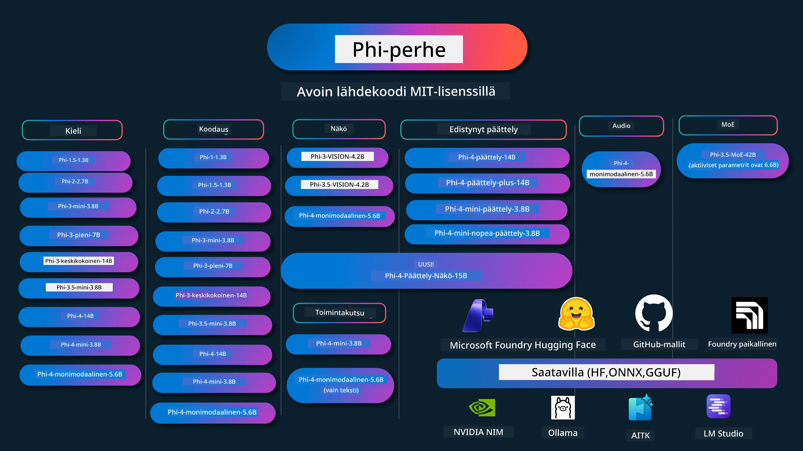

# Phi Cookbook: Käytännön esimerkkejä Microsoftin Phi-malleilla

[](https://codespaces.new/microsoft/phicookbook)
[](https://vscode.dev/redirect?url=vscode://ms-vscode-remote.remote-containers/cloneInVolume?url=https://github.com/microsoft/phicookbook)

[](https://GitHub.com/microsoft/phicookbook/graphs/contributors/?WT.mc_id=aiml-137032-kinfeylo)
[](https://GitHub.com/microsoft/phicookbook/issues/?WT.mc_id=aiml-137032-kinfeylo)
[](https://GitHub.com/microsoft/phicookbook/pulls/?WT.mc_id=aiml-137032-kinfeylo)
[](http://makeapullrequest.com?WT.mc_id=aiml-137032-kinfeylo)

[](https://GitHub.com/microsoft/phicookbook/watchers/?WT.mc_id=aiml-137032-kinfeylo)
[](https://GitHub.com/microsoft/phicookbook/network/?WT.mc_id=aiml-137032-kinfeylo)
[](https://GitHub.com/microsoft/phicookbook/stargazers/?WT.mc_id=aiml-137032-kinfeylo)

[](https://discord.com/invite/ByRwuEEgH4)

Phi on Microsoftin kehittämä avoimen lähdekoodin tekoälymallien sarja.

Phi on tällä hetkellä tehokkain ja kustannustehokkain pieni kielimalli (SLM), jolla on erittäin hyvät vertailuarvot monikielisyydessä, päättelyssä, tekstin/keskustelun generoinnissa, koodauksessa, kuvissa, äänissä ja muissa käyttötapauksissa.

Voit ottaa Filip käyttöön pilvessä tai reunalaitteilla ja rakentaa helposti generatiivisia tekoälysovelluksia rajallisella laskentateholla.

Seuraa näitä vaiheita aloittaaksesi näiden resurssien käytön:
1. **Haarauta repositorio**: Klikkaa [](https://GitHub.com/microsoft/phicookbook/network/?WT.mc_id=aiml-137032-kinfeylo)
2. **Kloonaa repositorio**: `git clone https://github.com/microsoft/PhiCookBook.git`
3. [**Liity Microsoft AI Discord -yhteisöön tapaa asiantuntijoita ja muita kehittäjiä**](https://discord.com/invite/ByRwuEEgH4?WT.mc_id=aiml-137032-kinfeylo)



### 🌐 Monikielituki

#### Tuettu GitHub Actionin kautta (automaattinen ja aina ajan tasalla)

<!-- CO-OP TRANSLATOR LANGUAGES TABLE START -->
[Arabia](../ar/README.md) | [Bengali](../bn/README.md) | [Bulgaria](../bg/README.md) | [Burma (Myanmar)](../my/README.md) | [Kiina (yksinkertaistettu)](../zh-CN/README.md) | [Kiina (perinteinen, Hong Kong)](../zh-HK/README.md) | [Kiina (perinteinen, Macao)](../zh-MO/README.md) | [Kiina (perinteinen, Taiwan)](../zh-TW/README.md) | [Kroatia](../hr/README.md) | [Tšekki](../cs/README.md) | [Tanska](../da/README.md) | [Hollanti](../nl/README.md) | [Viro](../et/README.md) | [Suomi](./README.md) | [Ranska](../fr/README.md) | [Saksa](../de/README.md) | [Kreikka](../el/README.md) | [Heprean kieli](../he/README.md) | [Hindi](../hi/README.md) | [Unkari](../hu/README.md) | [Indonesia](../id/README.md) | [Italia](../it/README.md) | [Japani](../ja/README.md) | [Kannada](../kn/README.md) | [Khmer](../km/README.md) | [Korea](../ko/README.md) | [Liettua](../lt/README.md) | [Malaiji](../ms/README.md) | [Malajalam](../ml/README.md) | [Marathi](../mr/README.md) | [Nepali](../ne/README.md) | [Nigerian Pidgin](../pcm/README.md) | [Norja](../no/README.md) | [Persia (Farsi)](../fa/README.md) | [Puola](../pl/README.md) | [Portugali (Brasilia)](../pt-BR/README.md) | [Portugali (Portugali)](../pt-PT/README.md) | [Punjabi (Gurmukhi)](../pa/README.md) | [Romania](../ro/README.md) | [Venäjä](../ru/README.md) | [Serbia (kyrillinen)](../sr/README.md) | [Slovakki](../sk/README.md) | [Sloveeni](../sl/README.md) | [Espanja](../es/README.md) | [Swahili](../sw/README.md) | [Ruotsi](../sv/README.md) | [Tagalog (Filipino)](../tl/README.md) | [Tamili](../ta/README.md) | [Telugu](../te/README.md) | [Thai](../th/README.md) | [Turkki](../tr/README.md) | [Ukraina](../uk/README.md) | [Urdu](../ur/README.md) | [Vietnam](../vi/README.md)

> **Haluatko mieluummin kloonata paikallisesti?**
>
> Tämä repositorio sisältää yli 50 kielikäännöstä, mikä lisää huomattavasti latauskokoa. Jos haluat kloonata ilman käännöksiä, käytä sparse checkout -toimintoa:
>
> **Bash / macOS / Linux:**
> ```bash
> git clone --filter=blob:none --sparse https://github.com/microsoft/PhiCookBook.git
> cd PhiCookBook
> git sparse-checkout set --no-cone '/*' '!translations' '!translated_images'
> ```
>
> **CMD (Windows):**
> ```cmd
> git clone --filter=blob:none --sparse https://github.com/microsoft/PhiCookBook.git
> cd PhiCookBook
> git sparse-checkout set --no-cone "/*" "!translations" "!translated_images"
> ```
>
> Tämä antaa sinulle kaiken tarvittavan kurssin läpiviemiseksi paljon nopeammalla latauksella.
<!-- CO-OP TRANSLATOR LANGUAGES TABLE END -->

## Sisällysluettelo

- Johdanto
  - [Tervetuloa Phi-perheeseen](./md/01.Introduction/01/01.PhiFamily.md)
  - [Ympäristön asetukset](./md/01.Introduction/01/01.EnvironmentSetup.md)
  - [Ymmärtäen keskeisiä teknologioita](./md/01.Introduction/01/01.Understandingtech.md)
  - [Tekoälyn turvallisuus Phi-malleissa](./md/01.Introduction/01/01.AISafety.md)
  - [Phi-laitteistotuki](./md/01.Introduction/01/01.Hardwaresupport.md)
  - [Phi-mallit ja saatavuus eri alustoilla](./md/01.Introduction/01/01.Edgeandcloud.md)
  - [Guidance-ai:n ja Phin käyttö](./md/01.Introduction/01/01.Guidance.md)
  - [GitHub Marketplace -mallit](https://github.com/marketplace/models)
  - [Azure AI Malliluettelo](https://ai.azure.com)

- Phi-päätelmät eri ympäristöissä
    -  [Hugging face](./md/01.Introduction/02/01.HF.md)
    -  [GitHub-mallit](./md/01.Introduction/02/02.GitHubModel.md)
    -  [Microsoft Foundryn malliluettelo](./md/01.Introduction/02/03.AzureAIFoundry.md)
    -  [Ollama](./md/01.Introduction/02/04.Ollama.md)
    -  [AI Toolkit VSCode (AITK)](./md/01.Introduction/02/05.AITK.md)
    -  [NVIDIA NIM](./md/01.Introduction/02/06.NVIDIA.md)
    -  [Foundry Local](./md/01.Introduction/02/07.FoundryLocal.md)

- Phi-perheen päätelmät
    - [Phi-päätelmät iOS:ssä](./md/01.Introduction/03/iOS_Inference.md)
    - [Phi-päätelmät Androidissa](./md/01.Introduction/03/Android_Inference.md)
    - [Phi-päätelmät Jetsossa](./md/01.Introduction/03/Jetson_Inference.md)
    - [Phi-päätelmät AI-PC:ssä](./md/01.Introduction/03/AIPC_Inference.md)
    - [Phi-päätelmät Apple MLX -kehyksen avulla](./md/01.Introduction/03/MLX_Inference.md)
    - [Phi-päätelmät paikallisella palvelimella](./md/01.Introduction/03/Local_Server_Inference.md)
    - [Phi-päätelmät etäpalvelimella AI Toolkitin avulla](./md/01.Introduction/03/Remote_Interence.md)
    - [Phi-päätelmät Rustilla](./md/01.Introduction/03/Rust_Inference.md)
    - [Phi-päätelmät Visio paikallisena](./md/01.Introduction/03/Vision_Inference.md)
    - [Phi-päätelmät Kaito AKS:n ja Azure Containersin (virallinen tuki) kanssa](./md/01.Introduction/03/Kaito_Inference.md)
-  [Phi-perheen kvantisointi](./md/01.Introduction/04/QuantifyingPhi.md)
    - [Phi-3.5 / 4 kvantisointi llama.cpp:n avulla](./md/01.Introduction/04/UsingLlamacppQuantifyingPhi.md)
    - [Phi-3.5 / 4 kvantisointi Generatiivisen tekoälyn laajennuksilla onnxruntimeen](./md/01.Introduction/04/UsingORTGenAIQuantifyingPhi.md)
    - [Phi-3.5 / 4 kvantisointi Intel OpenVINO:lla](./md/01.Introduction/04/UsingIntelOpenVINOQuantifyingPhi.md)
    - [Phi-3.5 / 4 kvantisointi Apple MLX -kehyksellä](./md/01.Introduction/04/UsingAppleMLXQuantifyingPhi.md)

-  Phi:n arviointi
    - [Vastuullinen tekoäly](./md/01.Introduction/05/ResponsibleAI.md)
    - [Microsoft Foundry arviointiin](./md/01.Introduction/05/AIFoundry.md)
    - [Promptflow:n käyttö arvioinnissa](./md/01.Introduction/05/Promptflow.md)
 
- RAG Azure AI Haulla
    - [Phi-4-mini ja Phi-4-multimodal (RAG) käyttö Azure AI Haun kanssa](https://github.com/microsoft/PhiCookBook/blob/main/code/06.E2E/E2E_Phi-4-RAG-Azure-AI-Search.ipynb)
    - [Zero-Cloud Paikallinen Hybrid RAG SQLite FTS5:n ja phi-4-minin kanssa](https://github.com/microsoft/PhiCookBook/blob/main/code/06.E2E/E2E_Phi-4-mini_Local_Hybrid_RAG_SQLite_FTS5.ipynb)

- Phi-sovelluskehityksen näytteet
  - Teksti- ja keskustelusovellukset
    - Phi-4-näytteet 
      - [📓] [Keskustele Phi-4-mini ONNX -mallin kanssa](./md/02.Application/01.TextAndChat/Phi4/ChatWithPhi4ONNX/README.md)
      - [Keskustele Phi-4 paikallisen ONNX-mallin kanssa .NET:llä](../../md/04.HOL/dotnet/src/LabsPhi4-Chat-01OnnxRuntime)
      - [Keskustelusovellus .NET-konsolissa Phi-4 ONNX:n kanssa käyttäen Semantic Kernelia](../../md/04.HOL/dotnet/src/LabsPhi4-Chat-02SK)

    - Phi-3 / 3.5 Näytteet
      - [Paikallinen chatbot selaimessa käyttäen Phi3, ONNX Runtime Web ja WebGPU](https://github.com/microsoft/onnxruntime-inference-examples/tree/main/js/chat)
      - [OpenVino Chat](./md/02.Application/01.TextAndChat/Phi3/E2E_OpenVino_Chat.md)
      - [Monimalli - Interaktiivinen Phi-3-mini ja OpenAI Whisper](./md/02.Application/01.TextAndChat/Phi3/E2E_Phi-3-mini_with_whisper.md)
      - [MLFlow - Rungon rakentaminen ja Phi-3:n käyttäminen MLFlow'n kanssa](./md//02.Application/01.TextAndChat/Phi3/E2E_Phi-3-MLflow.md)
      - [Mallin optimointi - Kuinka optimoida Phi-3-minimalli ONNX Runtime Webille Oliven avulla](https://github.com/microsoft/Olive/tree/main/examples/phi3)
      - [WinUI3-sovellus Phi-3 mini-4k-instruct-onnx:n kanssa](https://github.com/microsoft/Phi3-Chat-WinUI3-Sample/)
      -[WinUI3 Monimalli AI Powered Notes -sovellusnäyte](https://github.com/microsoft/ai-powered-notes-winui3-sample)
      - [Hienosäädä ja integroi mukautetut Phi-3-mallit Prompt flown kanssa](./md/02.Application/01.TextAndChat/Phi3/E2E_Phi-3-FineTuning_PromptFlow_Integration.md)
      - [Hienosäädä ja integroi mukautetut Phi-3-mallit Prompt flown kanssa Microsoft Foundryssä](./md/02.Application/01.TextAndChat/Phi3/E2E_Phi-3-FineTuning_PromptFlow_Integration_AIFoundry.md)
      - [Arvioi hienosäädetty Phi-3 / Phi-3.5 malli Microsoft Foundryssä keskittyen Microsoftin vastuullisen tekoälyn periaatteisiin](./md/02.Application/01.TextAndChat/Phi3/E2E_Phi-3-Evaluation_AIFoundry.md)
      - [📓] [Phi-3.5-mini-instruct kieliennustusnäyte (kiina/englanti)](./md/02.Application/01.TextAndChat/Phi3/phi3-instruct-demo.ipynb)
      - [Phi-3.5-Instruct WebGPU RAG Chatbot](./md/02.Application/01.TextAndChat/Phi3/WebGPUWithPhi35Readme.md)
      - [Windowsin GPU:n käyttäminen Prompt flow -ratkaisun luomiseen Phi-3.5-Instruct ONNX:n kanssa](./md/02.Application/01.TextAndChat/Phi3/UsingPromptFlowWithONNX.md)
      - [Microsoft Phi-3.5 tflite:n käyttäminen Android-sovelluksen luomiseen](./md/02.Application/01.TextAndChat/Phi3/UsingPhi35TFLiteCreateAndroidApp.md)
      - [Kyselyt ja vastaukset .NET-esimerkki paikallisen ONNX Phi-3 -mallin kanssa käyttäen Microsoft.ML.OnnxRuntime](../../md/04.HOL/dotnet/src/LabsPhi301)
      - [Konsolipohjainen chat .NET-sovellus Semantic Kernelin ja Phi-3:n kanssa](../../md/04.HOL/dotnet/src/LabsPhi302)

  - Azure AI Inference SDK -koodinäytteet 
    - Phi-4 Näytteet 
      - [📓] [Luo projektikoodi käyttäen Phi-4-multimodelia](./md/02.Application/02.Code/Phi4/GenProjectCode/README.md)
    - Phi-3 / 3.5 Näytteet
      - [Rakenna oma Visual Studio Code GitHub Copilot Chat Microsoft Phi-3 -perheellä](./md/02.Application/02.Code/Phi3/VSCodeExt/README.md)
      - [Luo oma Visual Studio Code Chat Copilot -agentti Phi-3.5:n avulla GitHub-malleilla](/md/02.Application/02.Code/Phi3/CreateVSCodeChatAgentWithGitHubModels.md)

  - Edistyneet päättelynäytteet
    - Phi-4 Näytteet 
      - [📓] [Phi-4-mini-päättely- tai Phi-4-päättelynäytteet](./md/02.Application/03.AdvancedReasoning/Phi4/AdvancedResoningPhi4mini/README.md)
      - [📓] [Hienosäätö Phi-4-mini-päättelylle Microsoft Oliven avulla](./md/02.Application/03.AdvancedReasoning/Phi4/AdvancedResoningPhi4mini/olive_ft_phi_4_reasoning_with_medicaldata.ipynb)
      - [📓] [Hienosäätö Phi-4-mini-päättelylle Apple MLX:n avulla](./md/02.Application/03.AdvancedReasoning/Phi4/AdvancedResoningPhi4mini/mlx_ft_phi_4_reasoning_with_medicaldata.ipynb)
      - [📓] [Phi-4-mini-päättely GitHub-mallien kanssa](./md/02.Application/02.Code/Phi4r/github_models_inference.ipynb)
      - [📓] [Phi-4-mini-päättely Microsoft Foundry -mallien kanssa](./md/02.Application/02.Code/Phi4r/azure_models_inference.ipynb)
  - Demoja
      - [Phi-4-mini demot Hugging Face Spaces -palvelussa](https://huggingface.co/spaces/microsoft/phi-4-mini?WT.mc_id=aiml-137032-kinfeylo)
      - [Phi-4-multimodal demot Hugging Face Spaces -palvelussa](https://huggingface.co/spaces/microsoft/phi-4-multimodal?WT.mc_id=aiml-137032-kinfeylo)
  - Vision Näytteet
    - Phi-4 Näytteet 
      - [📓] [Käytä Phi-4-multimodalia kuvien lukemiseen ja koodin generointiin](./md/02.Application/04.Vision/Phi4/CreateFrontend/README.md) 
    - Phi-3 / 3.5 Näytteet
      -  [📓][Phi-3-vision-Kuva tekstiksi-tekstiksi](./md/02.Application/04.Vision/Phi3/E2E_Phi-3-vision-image-text-to-text-online-endpoint.ipynb)
      - [Phi-3-vision-ONNX](https://onnxruntime.ai/docs/genai/tutorials/phi3-v.html)
      - [📓][Phi-3-vision CLIP -upotus](./md/02.Application/04.Vision/Phi3/E2E_Phi-3-vision-image-text-to-text-online-endpoint.ipynb)
      - [DEMO: Phi-3 kierrätys](https://github.com/jennifermarsman/PhiRecycling/)
      - [Phi-3-vision - Visuaalinen kieliavustaja - Phi3-Visionin ja OpenVINO:n kanssa](https://docs.openvino.ai/nightly/notebooks/phi-3-vision-with-output.html)
      - [Phi-3 Vision Nvidia NIM](./md/02.Application/04.Vision/Phi3/E2E_Nvidia_NIM_Vision.md)
      - [Phi-3 Vision OpenVino](./md/02.Application/04.Vision/Phi3/E2E_OpenVino_Phi3Vision.md)
      - [📓][Phi-3.5 Vision monikehys- tai monikuva-näyte](./md/02.Application/04.Vision/Phi3/phi3-vision-demo.ipynb)
      - [Phi-3 Vision paikallinen ONNX-malli käyttäen Microsoft.ML.OnnxRuntime .NET:ää](../../md/04.HOL/dotnet/src/LabsPhi303)
      - [Valikkopohjainen Phi-3 Vision paikallinen ONNX-malli käyttäen Microsoft.ML.OnnxRuntime .NET:ää](../../md/04.HOL/dotnet/src/LabsPhi304)

  - Päättely-Vision Näytteet
    - Phi-4-Päättely-Vision-15B 
      - [📓] [Phi-4-Päättely-Vision-15B:n käyttäminen vilkun tunnistukseen](./md/02.Application/10.ReasoningVision/Phi_4_reasoning_vision_15b_Jaywalking.ipynb)
      - [📓] [Phi-4-Päättely-Vision-15B:n käyttäminen matematiikkaan](./md/02.Application/10.ReasoningVision/Phi_4_reasoning_vision_15b_Math.ipynb)
      - [📓] [Phi-4-Päättely-Vision-15B:n käyttäminen käyttöliittymän tunnistukseen](./md/02.Application/10.ReasoningVision/Phi_4_reasoning_vision_15b_ui.ipynb)

  - Matematiikka Näytteet
    -  Phi-4-Mini-Flash-Päättely-Ohjeistettu Näytteet  [Matematiikka Demo Phi-4-Mini-Flash-Päättely-Ohjeistetulla](./md/02.Application/09.Math/MathDemo.ipynb)

  - Audio Näytteet
    - Phi-4 Näytteet 
      - [📓] [Äänitekstien purku Phi-4-multimodalilla](./md/02.Application/05.Audio/Phi4/Transciption/README.md)
      - [📓] [Phi-4-multimodal Audio Näyte](./md/02.Application/05.Audio/Phi4/Siri/demo.ipynb)
      - [📓] [Phi-4-multimodal Puheentekstitys näyte](./md/02.Application/05.Audio/Phi4/Translate/demo.ipynb)
      - [.NET-konsolisovellus käyttäen Phi-4-multimodalia analysoimaan äänitiedosto ja generoimaan tekstityksen](../../md/04.HOL/dotnet/src/LabsPhi4-MultiModal-02Audio)

  - MOE Näytteet
    - Phi-3 / 3.5 Näytteet
      - [📓] [Phi-3.5 Asiantuntijoiden sekoitus (MoEs) Sosiaalisen median näyte](./md/02.Application/06.MoE/Phi3/phi3_moe_demo.ipynb)
      - [📓] [Rakentaminen RAG-putkisto (Retrieval-Augmented Generation) NVIDIA NIM Phi-3 MOE:n, Azure AI Searchin ja LlamaIndexin kanssa](./md/02.Application/06.MoE/Phi3/azure-ai-search-nvidia-rag.ipynb)
      - 
  - Funktiokutsut Näytteet
    - Phi-4 Näytteet 🆕
      -  [📓] [Funktiokutsun käyttäminen Phi-4-minin kanssa](./md/02.Application/07.FunctionCalling/Phi4/FunctionCallingBasic/README.md)
      -  [📓] [Funktiokutsun käyttäminen moniagenttien luomiseksi Phi-4-minillä](./md/02.Application/07.FunctionCalling/Phi4/Multiagents/Phi_4_mini_multiagent.ipynb)
      -  [📓] [Funktiokutsun käyttäminen Ollaman kanssa](./md/02.Application/07.FunctionCalling/Phi4/Ollama/ollama_functioncalling.ipynb)
      -  [📓] [Funktiokutsun käyttäminen ONNX:n kanssa](./md/02.Application/07.FunctionCalling/Phi4/ONNX/onnx_parallel_functioncalling.ipynb)
  - Monimodaalinen sekoittaminen Näytteet
    - Phi-4 Näytteet 🆕
      -  [📓] [Phi-4-multimodalin käyttäminen teknologiatoimittajana](./md/02.Application/08.Multimodel/Phi4/TechJournalist/phi_4_mm_audio_text_publish_news.ipynb)
      - [.NET-konsolisovellus käyttäen Phi-4-multimodalia kuvien analysointiin](../../md/04.HOL/dotnet/src/LabsPhi4-MultiModal-01Images)

- Phi-mallien hienosäätö
  - [Hienosäätötilanteet](./md/03.FineTuning/FineTuning_Scenarios.md)
  - [Hienosäätö vs RAG](./md/03.FineTuning/FineTuning_vs_RAG.md)
  - [Hienosäätö: Anna Phi-3:n tulla alan asiantuntijaksi](./md/03.FineTuning/LetPhi3gotoIndustriy.md)
  - [Hienosäätö Phi-3 AI Toolkitin avulla VS Codeen](./md/03.FineTuning/Finetuning_VSCodeaitoolkit.md)
  - [Hienosäätö Phi-3 Azure Machine Learning Service:n avulla](./md/03.FineTuning/Introduce_AzureML.md)
  - [Hienosäätö Phi-3 Loran avulla](./md/03.FineTuning/FineTuning_Lora.md)
  - [Hienosäätö Phi-3 QLoran avulla](./md/03.FineTuning/FineTuning_Qlora.md)
  - [Hienosäätö Phi-3 Microsoft Foundryn avulla](./md/03.FineTuning/FineTuning_AIFoundry.md)
  - [Hienosäätö Phi-3 Azure ML CLI/SDK:n avulla](./md/03.FineTuning/FineTuning_MLSDK.md)
  - [Hienosäätö Microsoft Olivella](./md/03.FineTuning/FineTuning_MicrosoftOlive.md)
  - [Hienosäätö Microsoft Olive Hands-On Labin kanssa](./md/03.FineTuning/olive-lab/readme.md)
  - [Hienosäätö Phi-3-vision Weights and Biasin kanssa](./md/03.FineTuning/FineTuning_Phi-3-visionWandB.md)

  - [Phi-3 hienosäätö Apple MLX -kehyksellä](./md/03.FineTuning/FineTuning_MLX.md)
  - [Phi-3-vision hienosäätö (virallinen tuki)](./md/03.FineTuning/FineTuning_Vision.md)
  - [Phi-3 hienosäätö Kaito AKS:llä, Azure Containers (virallinen tuki)](./md/03.FineTuning/FineTuning_Kaito.md)
  - [Phi-3 ja 3.5 Vision hienosäätö](https://github.com/2U1/Phi3-Vision-Finetune)

- Käytännön harjoitukset
  - [Huippuluokan mallien tutkiminen: LLM:t, SLM:t, paikallinen kehitys ja muuta](https://github.com/microsoft/aitour-exploring-cutting-edge-models)
  - [NLP:n potentiaalin avaaminen: hienosäätö Microsoft Oliven avulla](https://github.com/azure/Ignite_FineTuning_workshop)

- Akateemiset tutkimuspaperit ja julkaisut
  - [Textbooks Are All You Need II: phi-1.5 tekninen raportti](https://arxiv.org/abs/2309.05463)
  - [Phi-3 tekninen raportti: erittäin kyvykäs kielimalli paikallisesti puhelimellasi](https://arxiv.org/abs/2404.14219)
  - [Phi-4 tekninen raportti](https://arxiv.org/abs/2412.08905)
  - [Phi-4-Mini tekninen raportti: Kompakti mutta tehokas monimodaalinen kielimalli Mixture-of-LoRA -tekniikalla](https://arxiv.org/abs/2503.01743)
  - [Pienten kielimallien optimointi ajoneuvon sisäisiin toiminnonkutsuihin](https://arxiv.org/abs/2501.02342)
  - [(WhyPHI) PHI-3 hienosäätö monivalintakysymyksiin: menetelmät, tulokset ja haasteet](https://arxiv.org/abs/2501.01588)
  - [Phi-4-päättelytekninen raportti](https://www.microsoft.com/en-us/research/wp-content/uploads/2025/04/phi_4_reasoning.pdf)
  - [Phi-4-mini-päättelytekninen raportti](https://huggingface.co/microsoft/Phi-4-mini-reasoning/blob/main/Phi-4-Mini-Reasoning.pdf)

## Phi-mallien käyttäminen

### Phi Microsoft Foundryssa

Voit oppia käyttämään Microsoft Phi:tä ja rakentamaan E2E-ratkaisuja eri laitteillasi. Kokeillaksesi Phi:tä itse, aloita leikkimällä malleilla ja muokkaamalla Phi:tä omiin käyttötapauksiisi [Microsoft Foundry Azure AI Model Catalog](https://aka.ms/phi3-azure-ai) kautta, lisätietoja on aloitusohjeissa [Microsoft Foundry](/md/02.QuickStart/AzureAIFoundry_QuickStart.md).

**Leikkikenttä**
Jokaisella mallilla on oma testileikkipaikkansa [Azure AI Playground](https://aka.ms/try-phi3).

### Phi GitHub-malleissa

Voit oppia käyttämään Microsoft Phi:tä ja rakentamaan E2E-ratkaisuja eri laitteillasi. Kokeillaksesi Phi:tä itse, aloita leikkimällä mallilla ja muokkaamalla Phi:tä omiin tilanteisiisi [GitHub Model Catalog](https://github.com/marketplace/models?WT.mc_id=aiml-137032-kinfeylo) kautta, lisätietoja on aloitusohjeissa [GitHub Model Catalog](/md/02.QuickStart/GitHubModel_QuickStart.md).

**Leikkikenttä**
Jokaisella mallilla on oma [leikkikenttä testaukseen](/md/02.QuickStart/GitHubModel_QuickStart.md).

### Phi Hugging Facessa

Mallin voi myös löytää [Hugging Facesta](https://huggingface.co/microsoft).

**Leikkikenttä**
 [Hugging Chat -leikkikenttä](https://huggingface.co/chat/models/microsoft/Phi-3-mini-4k-instruct)

 ## 🎒 Muut kurssit

Tiimimme tarjoaa myös muita kursseja! Tutustu:

<!-- CO-OP TRANSLATOR OTHER COURSES START -->
### LangChain
[](https://aka.ms/langchain4j-for-beginners)
[](https://aka.ms/langchainjs-for-beginners?WT.mc_id=m365-94501-dwahlin)
[](https://github.com/microsoft/langchain-for-beginners?WT.mc_id=m365-94501-dwahlin)
---

### Azure / Edge / MCP / Agentit
[](https://github.com/microsoft/AZD-for-beginners?WT.mc_id=academic-105485-koreyst)
[](https://github.com/microsoft/edgeai-for-beginners?WT.mc_id=academic-105485-koreyst)
[](https://github.com/microsoft/mcp-for-beginners?WT.mc_id=academic-105485-koreyst)
[](https://github.com/microsoft/ai-agents-for-beginners?WT.mc_id=academic-105485-koreyst)

---
 
### Generatiivisen tekoälyn sarja
[](https://github.com/microsoft/generative-ai-for-beginners?WT.mc_id=academic-105485-koreyst)
[-9333EA?style=for-the-badge&labelColor=E5E7EB&color=9333EA)](https://github.com/microsoft/Generative-AI-for-beginners-dotnet?WT.mc_id=academic-105485-koreyst)
[-C084FC?style=for-the-badge&labelColor=E5E7EB&color=C084FC)](https://github.com/microsoft/generative-ai-for-beginners-java?WT.mc_id=academic-105485-koreyst)
[-E879F9?style=for-the-badge&labelColor=E5E7EB&color=E879F9)](https://github.com/microsoft/generative-ai-with-javascript?WT.mc_id=academic-105485-koreyst)

---
 
### Perustaidot
[](https://aka.ms/ml-beginners?WT.mc_id=academic-105485-koreyst)
[](https://aka.ms/datascience-beginners?WT.mc_id=academic-105485-koreyst)
[](https://aka.ms/ai-beginners?WT.mc_id=academic-105485-koreyst)
[](https://github.com/microsoft/Security-101?WT.mc_id=academic-96948-sayoung)
[](https://aka.ms/webdev-beginners?WT.mc_id=academic-105485-koreyst)
[](https://aka.ms/iot-beginners?WT.mc_id=academic-105485-koreyst)
[](https://github.com/microsoft/xr-development-for-beginners?WT.mc_id=academic-105485-koreyst)

---
 
### Copilot-sarja
[](https://aka.ms/GitHubCopilotAI?WT.mc_id=academic-105485-koreyst)
[](https://github.com/microsoft/mastering-github-copilot-for-dotnet-csharp-developers?WT.mc_id=academic-105485-koreyst)
[](https://github.com/microsoft/CopilotAdventures?WT.mc_id=academic-105485-koreyst)
<!-- CO-OP TRANSLATOR OTHER COURSES END -->

## Vastuullinen tekoäly

Microsoft on sitoutunut auttamaan asiakkaitamme käyttämään tekoälytuotteitamme vastuullisesti, jakamaan oppejamme ja rakentamaan luottamukseen perustuvia kumppanuuksia läpinäkyvyysmuistiinpanojen ja vaikutusten arviointien kaltaisten työkalujen kautta. Monet näistä resursseista löytyvät osoitteesta [https://aka.ms/RAI](https://aka.ms/RAI).
Microsoftin lähestymistapa vastuulliseen tekoälyyn perustuu tekoälyn periaatteisiimme: oikeudenmukaisuus, luotettavuus ja turvallisuus, yksityisyys ja tietoturva, osallisuus, läpinäkyvyys ja vastuullisuus.

Laajamittaiset luonnollisen kielen, kuvan ja puheen mallit – kuten tässä esimerkissä käytetyt – voivat mahdollisesti käyttäytyä epäoikeudenmukaisesti, epäluotettavasti tai loukkaavasti, mikä voi aiheuttaa haittaa. Tutustu [Azure OpenAI -palvelun läpinäkyvyysmuistiinpanoon](https://learn.microsoft.com/legal/cognitive-services/openai/transparency-note?tabs=text) ollaksesi tietoinen riskeistä ja rajoituksista.


Suositeltu tapa riskien vähentämiseksi on sisällyttää arkkitehtuuriisi turvajärjestelmä, joka voi havaita ja estää haitallisen käyttäytymisen. [Azure AI Content Safety](https://learn.microsoft.com/azure/ai-services/content-safety/overview) tarjoaa itsenäisen suojakerroksen, joka pystyy havaitsemaan haitallisen käyttäjän tai tekoälyn luoman sisällön sovelluksissa ja palveluissa. Azure AI Content Safety sisältää teksti- ja kuva-API:t, joiden avulla voit havaita haitallista materiaalia. Microsoft Foundryn sisällä Content Safety -palvelu antaa sinun tarkastella, tutkia ja kokeilla esimerkkikoodeja haitallisen sisällön havaitsemiseksi eri muodoissa. Seuraava [aloitusdokumentaatio](https://learn.microsoft.com/azure/ai-services/content-safety/quickstart-text?tabs=visual-studio%2Clinux&pivots=programming-language-rest) ohjaa sinut tekemään pyyntöjä palveluun.

Toinen huomioon otettava seikka on sovelluksen yleinen suorituskyky. Monimuoto- ja monimallisten sovellusten kohdalla suorituskyvyllä tarkoitetaan, että järjestelmä toimii odotetusti sinulta ja käyttäjiltäsi, mukaan lukien haitallisten tulosten välttäminen. On tärkeää arvioida koko sovelluksesi suorituskykyä käyttämällä [suorituskykyä, laatua, riskiä ja turvallisuutta arvioivia työkaluja](https://learn.microsoft.com/azure/ai-studio/concepts/evaluation-metrics-built-in). Lisäksi voit luoda ja arvioida [omilla arvioijilla](https://learn.microsoft.com/azure/ai-studio/how-to/develop/evaluate-sdk#custom-evaluators).

Voit arvioida tekoälysovellustasi kehitysympäristössäsi käyttämällä [Azure AI Evaluation SDK:ta](https://microsoft.github.io/promptflow/index.html). Antamasi testidatan tai tavoitteen perusteella generatiivisen tekoälysovelluksesi tuotokset mitataan määrällisesti sisäänrakennetuilla tai valitsemillasi omilla arvioijilla. Pääset alkuun Azure AI Evaluation SDK:n kanssa arvioidaksesi järjestelmääsi seuraamalla [aloitusopasta](https://learn.microsoft.com/azure/ai-studio/how-to/develop/flow-evaluate-sdk). Kun suoritat arviointikierroksen, voit [visualisoida tulokset Microsoft Foundryssa](https://learn.microsoft.com/azure/ai-studio/how-to/evaluate-flow-results).

## Tavaramerkit

Tämä projekti saattaa sisältää tavaramerkkejä tai logoja projekteille, tuotteille tai palveluille. Microsoftin tavaramerkkien tai logojen käyttö on sallittua ainoastaan noudattaen [Microsoftin tavaramerkki- ja brändiohjeita](https://www.microsoft.com/legal/intellectualproperty/trademarks/usage/general).
Microsoftin tavaramerkkien tai logojen käyttö muokatuissa versioissa tästä projektista ei saa aiheuttaa sekaannusta tai antaa vaikutelmaa Microsoftin sponsoroinnista. Kolmansien osapuolten tavaramerkkien tai logojen käyttöä säätelevät kyseisten osapuolten ohjeistukset.

## Apua saatavilla

Jos jumitut tai sinulla on kysyttävää tekoälysovellusten rakentamisesta, liity seuraaviin yhteisöihin:

[](https://aka.ms/foundry/discord)

Jos sinulla on palautetta tuotteesta tai huomaat virheitä rakentamisen aikana, käy seuraavassa:

[](https://aka.ms/foundry/forum)

---

<!-- CO-OP TRANSLATOR DISCLAIMER START -->
**Vastuuvapauslauseke**:
Tämä asiakirja on käännetty käyttämällä tekoälypohjaista käännöspalvelua [Co-op Translator](https://github.com/Azure/co-op-translator). Vaikka pyrimme tarkkuuteen, otathan huomioon, että automaattiset käännökset saattavat sisältää virheitä tai epätarkkuuksia. Alkuperäinen asiakirja sen alkuperäiskielellä on virallinen lähde. Tärkeissä asioissa suositellaan ammattimaista ihmiskäännöstä. Emme ole vastuussa tämän käännöksen käytöstä aiheutuvista väärinymmärryksistä tai tulkinnoista.
<!-- CO-OP TRANSLATOR DISCLAIMER END -->