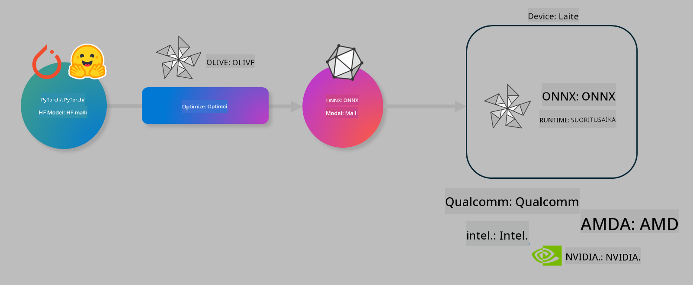

<!--
CO_OP_TRANSLATOR_METADATA:
{
  "original_hash": "6bbe47de3b974df7eea29dfeccf6032b",
  "translation_date": "2025-05-09T04:26:08+00:00",
  "source_file": "code/03.Finetuning/olive-lab/readme.md",
  "language_code": "fi"
}
-->
# Lab. Optimoi tekoälymalleja laitekohtaisiin päättelyihin

## Johdanto

> [!IMPORTANT]
> Tämä labra vaatii **Nvidia A10 tai A100 GPU:n** asennettuna asianmukaisine ajureineen ja CUDA-työkalupaketin (versio 12+) kanssa.

> [!NOTE]
> Tämä on **35 minuutin** labra, joka tarjoaa käytännönläheisen johdatuksen mallien optimointiin laitekohtaisia päättelyjä varten OLIVE-työkalulla.

## Oppimistavoitteet

Labran lopussa osaat käyttää OLIVEa:

- Kvantisointiin AWQ-kvantisointimenetelmällä.
- Tekoälymallin hienosäätöön tiettyyn tehtävään.
- LoRA-adapterien (hienosäädetty malli) luomiseen tehokasta laitekohtaista päättelyä varten ONNX Runtime -ympäristössä.

### Mikä on Olive

Olive (*O*NNX *live*) on mallien optimointityökalu, jonka mukana tulee komentorivityökalu (CLI), jonka avulla voit toimittaa malleja ONNX Runtime +++https://onnxruntime.ai+++ -ympäristöön laadukkaasti ja tehokkaasti.



Oliven syötteenä on tyypillisesti PyTorch- tai Hugging Face -malli ja tuloksena optimoitu ONNX-malli, joka suoritetaan laitteella (käyttökohde) ONNX Runtime -ympäristössä. Olive optimoi mallin kohdelaitteen tekoälykiihdyttimelle (NPU, GPU, CPU), jonka tarjoaa laitevalmistaja kuten Qualcomm, AMD, Nvidia tai Intel.

Olive suorittaa *workflow'n*, eli järjestetyn sarjan yksittäisiä mallin optimointitehtäviä, joita kutsutaan *passeiksi* – esimerkkeinä mallin pakkaus, graafin kaappaus, kvantisointi ja graafin optimointi. Jokaisella passilla on parametrit, joita voi säätää parhaan tuloksen, kuten tarkkuuden ja viiveen, saavuttamiseksi, ja nämä arvioidaan asianmukaisella arvioijalla. Olive käyttää hakualgoritmia, joka automaattisesti virittää jokaisen passin yksitellen tai useamman passin ryhmänä.

#### Oliven hyödyt

- **Vähentää turhautumista ja aikaa** kokeilemalla manuaalisesti eri tekniikoita graafin optimointiin, pakkaamiseen ja kvantisointiin. Määritä laatukriteerit ja suorituskykyvaatimukset, niin Olive löytää automaattisesti parhaan mallin.
- **Yli 40 valmiiksi rakennettua mallin optimointikomponenttia**, jotka kattavat uusimmat kvantisoinnin, pakkaamisen, graafin optimoinnin ja hienosäädön menetelmät.
- **Helppokäyttöinen komentorivityökalu** yleisimpiin mallin optimointitehtäviin, kuten olive quantize, olive auto-opt, olive finetune.
- Mallin pakkaus ja käyttöönotto sisäänrakennettuna.
- Tukee mallien generointia **Multi LoRA -palvelua varten**.
- Workflowt voi rakentaa YAML/JSON-muodossa mallin optimointia ja käyttöönottoa varten.
- Integraatio **Hugging Face** ja **Azure AI** -palveluihin.
- Sisäänrakennettu **välimuistimekanismi** kustannusten säästämiseksi.

## Labran ohjeet

> [!NOTE]
> Varmista, että olet varannut Azure AI Hubin ja projektin sekä määrittänyt A100-laskennan kuten Lab 1:ssä.

### Vaihe 0: Yhdistä Azure AI Compute -ympäristöösi

Yhdistät Azure AI Compute -ympäristöön käyttämällä VS Code -editorin etäyhteysominaisuutta.

1. Avaa **VS Code** työpöytäsovellus.
2. Avaa komentopaletti painamalla **Shift+Ctrl+P**.
3. Etsi komentopalettista **AzureML - remote: Connect to compute instance in New Window**.
4. Noudata näytön ohjeita yhdistääksesi laskentaympäristöön. Valitse Azure-tilauksesi, resurssiryhmäsi, projektisi ja Lab 1:ssä määrittämäsi laskentaympäristön nimi.
5. Kun olet yhdistänyt Azure ML Compute -solmuusi, se näkyy VS Code:n vasemmassa alakulmassa `><Azure ML: Compute Name`

### Vaihe 1: Kloonaa tämä repositorio

VS Codessa avaa uusi terminaali painamalla **Ctrl+J** ja kloonaa tämä repo:

Terminaalissa näet kehotteen

```
azureuser@computername:~/cloudfiles/code$ 
```
Kloonaa ratkaisu

```bash
cd ~/localfiles
git clone https://github.com/microsoft/phi-3cookbook.git
```

### Vaihe 2: Avaa kansio VS Codessa

Avaa oikea kansio VS Codessa suorittamalla terminaalissa seuraava komento, joka avaa uuden ikkunan:

```bash
code phi-3cookbook/code/04.Finetuning/Olive-lab
```

Vaihtoehtoisesti voit avata kansion valitsemalla **File** > **Open Folder**.

### Vaihe 3: Riippuvuudet

Avaa terminaali VS Codessa Azure AI Compute -instanssissasi (vinkki: **Ctrl+J**) ja suorita seuraavat komennot asentaaksesi riippuvuudet:

```bash
conda create -n olive-ai python=3.11 -y
conda activate olive-ai
pip install -r requirements.txt
az extension remove -n azure-cli-ml
az extension add -n ml
```

> [!NOTE]
> Riippuvuuksien asennus kestää noin 5 minuuttia.

Tässä labrassa lataat ja lataat malleja Azure AI Model -katalogiin. Päästäksesi katalogiin sinun täytyy kirjautua Azureen komennolla:

```bash
az login
```

> [!NOTE]
> Kirjautuessasi sinua pyydetään valitsemaan tilaus. Varmista, että valitset tämän labran käyttöön tarkoitetun tilauksen.

### Vaihe 4: Suorita Olive-komennot

Avaa terminaali VS Codessa Azure AI Compute -instanssissasi (vinkki: **Ctrl+J**) ja varmista, että `olive-ai` conda-ympäristö on aktivoitu:

```bash
conda activate olive-ai
```

Suorita sitten seuraavat Olive-komennot komentorivillä.

1. **Tarkastele dataa:** Tässä esimerkissä hienosäädät Phi-3.5-Mini-mallia, jotta se erikoistuu matkailuun liittyvien kysymysten vastaamiseen. Alla oleva koodi näyttää ensimmäiset muutamat tietueet JSON lines -muodossa:

    ```bash
    head data/data_sample_travel.jsonl
    ```

2. **Kvantisoi malli:** Ennen mallin koulutusta kvantisoi malli seuraavalla komennolla, joka käyttää Active Aware Quantization (AWQ) -menetelmää +++https://arxiv.org/abs/2306.00978+++. AWQ kvantisoi mallin painot ottamalla huomioon päättelyn aikana tuotetut aktivoinnit. Tämä tarkoittaa, että kvantisointiprosessi huomioi aktivaatioiden todellisen datajakauman, mikä säilyttää mallin tarkkuuden paremmin kuin perinteiset painokvantisointimenetelmät.

    ```bash
    olive quantize \
       --model_name_or_path microsoft/Phi-3.5-mini-instruct \
       --trust_remote_code \
       --algorithm awq \
       --output_path models/phi/awq \
       --log_level 1
    ```

    AWQ-kvantisointi kestää noin **8 minuuttia** ja pienentää mallin kokoa noin **7,5 GB:stä 2,5 GB:iin**.

   Tässä labrassa näytämme, miten malleja tuodaan Hugging Facesta (esimerkiksi: `microsoft/Phi-3.5-mini-instruct`). However, Olive also allows you to input models from the Azure AI catalog by updating the `model_name_or_path` argument to an Azure AI asset ID (for example:  `azureml://registries/azureml/models/Phi-3.5-mini-instruct/versions/4`). 

1. **Train the model:** Next, the `olive finetune` -komento hienosäätää kvantisoitua mallia. Mallin kvantisointi *ennen* hienosäätöä antaa paremman tarkkuuden, koska hienosäätö prosessi palauttaa osan kvantisoinnista aiheutuneesta tarkkuuden menetyksestä.

    ```bash
    olive finetune \
        --method lora \
        --model_name_or_path models/phi/awq \
        --data_files "data/data_sample_travel.jsonl" \
        --data_name "json" \
        --text_template "<|user|>\n{prompt}<|end|>\n<|assistant|>\n{response}<|end|>" \
        --max_steps 100 \
        --output_path ./models/phi/ft \
        --log_level 1
    ```

    Hienosäätö kestää noin **6 minuuttia** (100 askelta).

3. **Optimoi:** Kun malli on koulutettu, optimoi se Olive-komennolla `auto-opt` command, which will capture the ONNX graph and automatically perform a number of optimizations to improve the model performance for CPU by compressing the model and doing fusions. It should be noted, that you can also optimize for other devices such as NPU or GPU by just updating the `--device` and `--provider` – tässä labrassa käytämme CPU:ta.

    ```bash
    olive auto-opt \
       --model_name_or_path models/phi/ft/model \
       --adapter_path models/phi/ft/adapter \
       --device cpu \
       --provider CPUExecutionProvider \
       --use_ort_genai \
       --output_path models/phi/onnx-ao \
       --log_level 1
    ```

    Optimointi kestää noin **5 minuuttia**.

### Vaihe 5: Nopean mallin päättelyn testi

Testataksesi mallin päättelyä, luo kansioosi Python-tiedosto nimeltä **app.py** ja kopioi siihen seuraava koodi:

```python
import onnxruntime_genai as og
import numpy as np

print("loading model and adapters...", end="", flush=True)
model = og.Model("models/phi/onnx-ao/model")
adapters = og.Adapters(model)
adapters.load("models/phi/onnx-ao/model/adapter_weights.onnx_adapter", "travel")
print("DONE!")

tokenizer = og.Tokenizer(model)
tokenizer_stream = tokenizer.create_stream()

params = og.GeneratorParams(model)
params.set_search_options(max_length=100, past_present_share_buffer=False)
user_input = "what is the best thing to see in chicago"
params.input_ids = tokenizer.encode(f"<|user|>\n{user_input}<|end|>\n<|assistant|>\n")

generator = og.Generator(model, params)

generator.set_active_adapter(adapters, "travel")

print(f"{user_input}")

while not generator.is_done():
    generator.compute_logits()
    generator.generate_next_token()

    new_token = generator.get_next_tokens()[0]
    print(tokenizer_stream.decode(new_token), end='', flush=True)

print("\n")
```

Suorita koodi komennolla:

```bash
python app.py
```

### Vaihe 6: Lataa malli Azure AI:hin

Mallin lataaminen Azure AI -mallivarastoon tekee mallista jaettavan kehitystiimisi kanssa ja hoitaa mallin versionhallinnan. Lataa malli seuraavalla komennolla:

> [!NOTE]
> Päivitä `{}`-paikkamerkit `resourceGroup` ja Azure AI -projektin nimellä, ja suorita komento

```
az ml workspace show
```

Vaihtoehtoisesti voit mennä +++ai.azure.com+++ ja valita **management center** > **project** > **overview**.

Päivitä `{}`-paikkamerkit oman resurssiryhmäsi ja Azure AI -projektisi nimellä.

```bash
az ml model create \
    --name ft-for-travel \
    --version 1 \
    --path ./models/phi/onnx-ao \
    --resource-group {RESOURCE_GROUP_NAME} \
    --workspace-name {PROJECT_NAME}
```

Näet ladatun mallisi ja voit ottaa sen käyttöön osoitteessa https://ml.azure.com/model/list

**Vastuuvapauslauseke**:  
Tämä asiakirja on käännetty käyttämällä tekoälypohjaista käännöspalvelua [Co-op Translator](https://github.com/Azure/co-op-translator). Vaikka pyrimme tarkkuuteen, ota huomioon, että automaattikäännöksissä saattaa esiintyä virheitä tai epätarkkuuksia. Alkuperäistä asiakirjaa sen alkuperäiskielellä tulee pitää virallisena lähteenä. Tärkeiden tietojen osalta suositellaan ammattimaista ihmiskäännöstä. Emme ole vastuussa tämän käännöksen käytöstä johtuvista väärinymmärryksistä tai tulkinnoista.