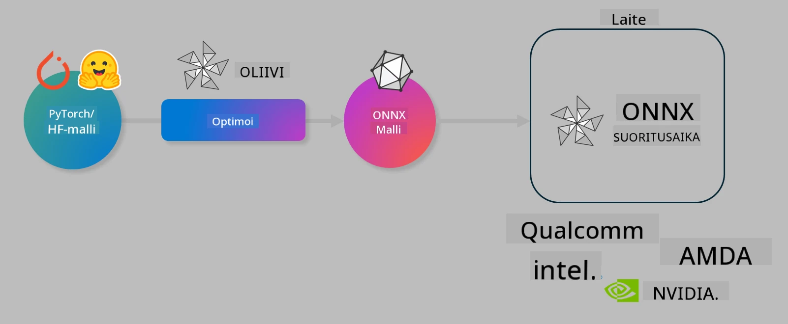

<!--
CO_OP_TRANSLATOR_METADATA:
{
  "original_hash": "6bbe47de3b974df7eea29dfeccf6032b",
  "translation_date": "2025-07-16T15:54:35+00:00",
  "source_file": "code/03.Finetuning/olive-lab/readme.md",
  "language_code": "fi"
}
-->
# Lab. Optimoi tekoälymalleja laitekohtaisiin päätelaskentoihin

## Johdanto

> [!IMPORTANT]  
> Tämä labra vaatii **Nvidia A10- tai A100-GPU:n** sekä siihen liittyvät ajurit ja CUDA-työkalupaketin (versio 12+) asennettuna.

> [!NOTE]  
> Tämä on **35 minuutin** labra, joka tarjoaa käytännönläheisen johdatuksen mallien optimoinnin keskeisiin käsitteisiin laitekohtaisia päätelaskentoja varten OLIVE-työkalulla.

## Oppimistavoitteet

Labran lopuksi osaat käyttää OLIVEa:

- Kvantisoimaan tekoälymallin AWQ-kvantisointimenetelmällä.
- Hienosäätämään tekoälymallin tiettyä tehtävää varten.
- Luomaan LoRA-adaptereita (hienosäädetty malli) tehokkaaseen laitekohtaiseen päätelaskentaan ONNX Runtime -ympäristössä.

### Mikä on Olive

Olive (*O*NNX *live*) on mallien optimointityökalu, johon kuuluu komentorivityökalu (CLI), jonka avulla voit toimittaa malleja ONNX Runtime +++https://onnxruntime.ai+++ -ympäristöön laadukkaasti ja tehokkaasti.



Olive ottaa syötteenä tyypillisesti PyTorch- tai Hugging Face -mallin ja tuottaa optimoidun ONNX-mallin, joka suoritetaan laitteella (käyttökohde) ONNX Runtime -ympäristössä. Olive optimoi mallin käyttökohteen tekoälykiihdyttimelle (NPU, GPU, CPU), jonka tarjoaa laitevalmistaja kuten Qualcomm, AMD, Nvidia tai Intel.

Olive suorittaa *työnkulun*, joka on järjestetty sarja yksittäisiä mallin optimointitehtäviä, joita kutsutaan *passauksiksi*. Esimerkkejä passeista ovat mallin pakkaus, graafin tallennus, kvantisointi ja graafin optimointi. Jokaisella passauksella on joukko parametreja, joita voi säätää parhaan suorituskyvyn, kuten tarkkuuden ja viiveen, saavuttamiseksi. Olive käyttää hakualgoritmia, joka automaattisesti hienosäätää passeja yksitellen tai ryhminä.

#### Oliven hyödyt

- **Vähentää turhautumista ja aikaa**, joka kuluu kokeilu-erehdys -tyyppiseen manuaaliseen optimointiin graafien optimoinnissa, pakkaamisessa ja kvantisoinnissa. Määritä laatua ja suorituskykyä koskevat vaatimukset, niin Olive löytää automaattisesti parhaan mallin.
- **Yli 40 sisäänrakennettua mallin optimointikomponenttia**, jotka kattavat uusimmat tekniikat kvantisoinnissa, pakkaamisessa, graafin optimoinnissa ja hienosäädössä.
- **Helppokäyttöinen komentorivityökalu** yleisiin mallin optimointitehtäviin, kuten olive quantize, olive auto-opt, olive finetune.
- Mallien pakkaus ja käyttöönotto sisäänrakennettuna.
- Tukee mallien luomista **Multi LoRA -palvelua varten**.
- Työnkulkujen rakentaminen YAML/JSON-muodossa mallin optimoinnin ja käyttöönoton orkestrointiin.
- **Hugging Face** ja **Azure AI** -integraatiot.
- Sisäänrakennettu **välimuistimekanismi** kustannusten **säästämiseksi**.

## Lab-ohjeet

> [!NOTE]  
> Varmista, että olet varannut Azure AI Hubin ja projektin sekä määrittänyt A100-laskentaympäristön Labra 1:n ohjeiden mukaisesti.

### Vaihe 0: Yhdistä Azure AI Compute -ympäristöösi

Yhdistät Azure AI Compute -ympäristöön käyttämällä etäyhteysominaisuutta **VS Codessa**.

1. Avaa **VS Code** -työpöytäsovellus:  
1. Avaa **komentopaletti** painamalla **Shift+Ctrl+P**  
1. Etsi komentopalettista **AzureML - remote: Connect to compute instance in New Window**.  
1. Seuraa näytön ohjeita yhdistääksesi Compute-ympäristöön. Tämä sisältää Azure-tilauksesi, resurssiryhmäsi, projektisi ja Labra 1:ssä määrittämäsi Compute-nimen valinnan.  
1. Kun olet yhdistänyt Azure ML Compute -solmuun, se näkyy **Visual Coden vasemmassa alakulmassa** muodossa `><Azure ML: Compute Name`.

### Vaihe 1: Kloonaa tämä repositorio

VS Codessa voit avata uuden terminaalin painamalla **Ctrl+J** ja kloonata tämän repositorion:

Terminaalissa pitäisi näkyä kehotteesi

```
azureuser@computername:~/cloudfiles/code$ 
```  
Kloonaa ratkaisu

```bash
cd ~/localfiles
git clone https://github.com/microsoft/phi-3cookbook.git
```

### Vaihe 2: Avaa kansio VS Codessa

Avaa VS Code oikeassa kansiossa suorittamalla terminaalissa seuraava komento, joka avaa uuden ikkunan:

```bash
code phi-3cookbook/code/04.Finetuning/Olive-lab
```

Vaihtoehtoisesti voit avata kansion valitsemalla **File** > **Open Folder**.

### Vaihe 3: Riippuvuudet

Avaa terminaali VS Codessa Azure AI Compute -instanssissasi (vinkki: **Ctrl+J**) ja suorita seuraavat komennot asentaaksesi riippuvuudet:

```bash
conda create -n olive-ai python=3.11 -y
conda activate olive-ai
pip install -r requirements.txt
az extension remove -n azure-cli-ml
az extension add -n ml
```

> [!NOTE]  
> Kaikkien riippuvuuksien asentaminen kestää noin 5 minuuttia.

Tässä labrassa lataat ja lataat malleja Azure AI Model -katalogiin. Päästäksesi käsiksi mallikatalogiin sinun tulee kirjautua Azureen seuraavalla komennolla:

```bash
az login
```

> [!NOTE]  
> Kirjautumisen yhteydessä sinua pyydetään valitsemaan tilaus. Varmista, että valitset tämän labran käyttöön annetun tilauksen.

### Vaihe 4: Suorita Olive-komennot

Avaa terminaali VS Codessa Azure AI Compute -instanssissasi (vinkki: **Ctrl+J**) ja varmista, että `olive-ai` conda-ympäristö on aktivoitu:

```bash
conda activate olive-ai
```

Suorita seuraavat Olive-komennot komentorivillä.

1. **Tarkastele dataa:** Tässä esimerkissä hienosäädät Phi-3.5-Mini-mallia, jotta se erikoistuu vastaamaan matkailuun liittyviin kysymyksiin. Alla oleva koodi näyttää muutaman ensimmäisen tietueen datasetistä, joka on JSON lines -muodossa:

    ```bash
    head data/data_sample_travel.jsonl
    ```

1. **Kvantisoi malli:** Ennen mallin koulutusta kvantisoit malli seuraavalla komennolla, joka käyttää Active Aware Quantization (AWQ) -tekniikkaa +++https://arxiv.org/abs/2306.00978+++. AWQ kvantisoi mallin painot ottamalla huomioon päätelaskennassa syntyvät aktivoinnit. Tämä tarkoittaa, että kvantisointiprosessi huomioi aktivointien todellisen datan jakauman, mikä säilyttää mallin tarkkuuden paremmin kuin perinteiset painokvantisointimenetelmät.

    ```bash
    olive quantize \
       --model_name_or_path microsoft/Phi-3.5-mini-instruct \
       --trust_remote_code \
       --algorithm awq \
       --output_path models/phi/awq \
       --log_level 1
    ```

    AWQ-kvantisointi kestää noin **8 minuuttia** ja **pienentää mallin kokoa noin 7,5 GB:stä noin 2,5 GB:iin**.

    Tässä labrassa näytämme, miten malleja tuodaan Hugging Facesta (esim. `microsoft/Phi-3.5-mini-instruct`). Olive mahdollistaa myös mallien tuonnin Azure AI -katalogista päivittämällä `model_name_or_path` -argumentin Azure AI -resurssitunnukseen (esim. `azureml://registries/azureml/models/Phi-3.5-mini-instruct/versions/4`).

1. **Kouluta malli:** Seuraavaksi `olive finetune` -komento hienosäätää kvantisoidun mallin. Mallin kvantisointi *ennen* hienosäätöä antaa paremman tarkkuuden, koska hienosäätöprosessi palauttaa osan kvantisoinnista aiheutuneesta tarkkuuden menetyksestä.

    ```bash
    olive finetune \
        --method lora \
        --model_name_or_path models/phi/awq \
        --data_files "data/data_sample_travel.jsonl" \
        --data_name "json" \
        --text_template "<|user|>\n{prompt}<|end|>\n<|assistant|>\n{response}<|end|>" \
        --max_steps 100 \
        --output_path ./models/phi/ft \
        --log_level 1
    ```

    Hienosäätö kestää noin **6 minuuttia** (100 askelta).

1. **Optimoi:** Kun malli on koulutettu, optimoi se Olive-komennolla `auto-opt`, joka tallentaa ONNX-graafin ja suorittaa automaattisesti useita optimointeja mallin suorituskyvyn parantamiseksi CPU:lla pakkaamalla mallia ja tekemällä fuusioita. Huomaa, että voit optimoida myös muille laitteille, kuten NPU:lle tai GPU:lle, päivittämällä `--device` ja `--provider` -argumentit, mutta tässä labrassa käytämme CPU:ta.

    ```bash
    olive auto-opt \
       --model_name_or_path models/phi/ft/model \
       --adapter_path models/phi/ft/adapter \
       --device cpu \
       --provider CPUExecutionProvider \
       --use_ort_genai \
       --output_path models/phi/onnx-ao \
       --log_level 1
    ```

    Optimointi kestää noin **5 minuuttia**.

### Vaihe 5: Mallin päätelaskennan pika-testi

Testataksesi mallin päätelaskentaa, luo kansioosi Python-tiedosto nimeltä **app.py** ja kopioi siihen seuraava koodi:

```python
import onnxruntime_genai as og
import numpy as np

print("loading model and adapters...", end="", flush=True)
model = og.Model("models/phi/onnx-ao/model")
adapters = og.Adapters(model)
adapters.load("models/phi/onnx-ao/model/adapter_weights.onnx_adapter", "travel")
print("DONE!")

tokenizer = og.Tokenizer(model)
tokenizer_stream = tokenizer.create_stream()

params = og.GeneratorParams(model)
params.set_search_options(max_length=100, past_present_share_buffer=False)
user_input = "what is the best thing to see in chicago"
params.input_ids = tokenizer.encode(f"<|user|>\n{user_input}<|end|>\n<|assistant|>\n")

generator = og.Generator(model, params)

generator.set_active_adapter(adapters, "travel")

print(f"{user_input}")

while not generator.is_done():
    generator.compute_logits()
    generator.generate_next_token()

    new_token = generator.get_next_tokens()[0]
    print(tokenizer_stream.decode(new_token), end='', flush=True)

print("\n")
```

Suorita koodi komennolla:

```bash
python app.py
```

### Vaihe 6: Lataa malli Azure AI:hin

Mallin lataaminen Azure AI -mallivarastoon tekee mallista jaettavan kehitystiimisi muiden jäsenten kanssa ja hoitaa myös mallin versionhallinnan. Lataa malli suorittamalla seuraava komento:

> [!NOTE]  
> Päivitä `{}`-paikkamerkit oman resurssiryhmäsi ja Azure AI -projektisi nimillä.

Löytääksesi resurssiryhmäsi `"resourceGroup"` ja Azure AI -projektisi nimen, suorita seuraava komento:

```
az ml workspace show
```

Tai käy osoitteessa +++ai.azure.com+++ ja valitse **management center** > **project** > **overview**

Päivitä `{}`-paikkamerkit oman resurssiryhmäsi ja Azure AI -projektisi nimillä.

```bash
az ml model create \
    --name ft-for-travel \
    --version 1 \
    --path ./models/phi/onnx-ao \
    --resource-group {RESOURCE_GROUP_NAME} \
    --workspace-name {PROJECT_NAME}
```

Näet ladatun mallisi ja voit ottaa sen käyttöön osoitteessa https://ml.azure.com/model/list

**Vastuuvapauslauseke**:  
Tämä asiakirja on käännetty käyttämällä tekoälypohjaista käännöspalvelua [Co-op Translator](https://github.com/Azure/co-op-translator). Vaikka pyrimme tarkkuuteen, huomioithan, että automaattikäännöksissä saattaa esiintyä virheitä tai epätarkkuuksia. Alkuperäistä asiakirjaa sen alkuperäiskielellä tulee pitää virallisena lähteenä. Tärkeissä asioissa suositellaan ammattimaista ihmiskäännöstä. Emme ole vastuussa tämän käännöksen käytöstä aiheutuvista väärinymmärryksistä tai tulkinnoista.