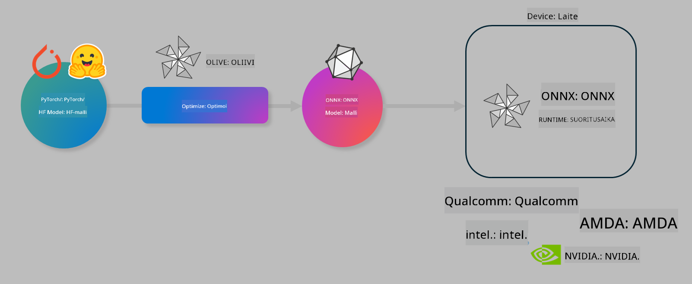

<!--
CO_OP_TRANSLATOR_METADATA:
{
  "original_hash": "6bbe47de3b974df7eea29dfeccf6032b",
  "translation_date": "2025-05-09T04:39:27+00:00",
  "source_file": "code/04.Finetuning/olive-lab/readme.md",
  "language_code": "fi"
}
-->
# Lab. Optimoi AI-malleja laitekohtaisen inferenssin käyttöön

## Johdanto

> [!IMPORTANT]  
> Tämä labra vaatii **Nvidia A10 tai A100 GPU:n** sekä siihen liittyvät ajurit ja CUDA-työkalupaketin (versio 12+) asennettuna.

> [!NOTE]  
> Tämä on **35 minuutin** labra, joka tarjoaa käytännönläheisen johdatuksen mallien optimoinnin ydinkäsitteisiin laitekohtaisen inferenssin käyttöön OLIVE:n avulla.

## Oppimistavoitteet

Tämän labran jälkeen osaat käyttää OLIVE:a:

- Kvantisointiin AI-mallille AWQ-kvantisointimenetelmällä.  
- Hienosäätää AI-mallia tiettyä tehtävää varten.  
- Luoda LoRA-adaptereita (hienosäädetty malli) tehokkaaseen laitekohtaiseen inferenssiin ONNX Runtime -ympäristössä.

### Mikä on Olive

Olive (*O*NNX *live*) on mallin optimointityökalu CLI-rajapinnalla, jonka avulla voit toimittaa malleja ONNX runtime +++https://onnxruntime.ai+++ -ympäristöön laadukkaasti ja tehokkaasti.



Olive saa syötteenä yleensä PyTorch- tai Hugging Face -mallin, ja tuloksena on optimoitu ONNX-malli, joka ajetaan laitteella (käyttöympäristössä) ONNX runtime -alustalla. Olive optimoi mallin käyttöympäristön AI-kiihdyttimelle (NPU, GPU, CPU), jota toimittaa laitevalmistaja kuten Qualcomm, AMD, Nvidia tai Intel.

Olive suorittaa *workflow’n*, joka on järjestetty sarja yksittäisiä mallin optimointitehtäviä eli *pass*-vaiheita — esimerkkeinä: mallin pakkaus, graafin tallennus, kvantisointi, graafin optimointi. Jokaisella pass-vaiheella on joukko parametreja, joita voi hienosäätää parhaan suorituskyvyn ja tarkkuuden saavuttamiseksi, joita arvioija mittaa. Olive käyttää hakustrategiaa, joka hyödyntää hakualgoritmia säätämään pass-vaiheita yksi kerrallaan tai ryhminä automaattisesti.

#### Olive:n edut

- **Vähentää turhautumista ja aikaa** kokeilemalla manuaalisesti erilaisia tekniikoita graafin optimointiin, pakkaamiseen ja kvantisointiin. Määrittele laatua ja suorituskykyä koskevat vaatimukset, niin Olive löytää automaattisesti parhaan mallin.
- **Yli 40 sisäänrakennettua mallin optimointikomponenttia**, jotka kattavat uusimmat tekniikat kvantisoinnissa, pakkaamisessa, graafin optimoinnissa ja hienosäädössä.
- **Helppokäyttöinen CLI** yleisimpiin mallin optimointitehtäviin, kuten olive quantize, olive auto-opt, olive finetune.
- Mallin pakkaus ja käyttöönotto sisäänrakennettuina.
- Tukee mallien generointia **Multi LoRA -palvelua varten**.
- Workflowt voi rakentaa YAML/JSON-muodossa mallin optimoinnin ja käyttöönoton orkestrointiin.
- Integroitu **Hugging Face** ja **Azure AI**.
- Sisäänrakennettu **välimuistimekanismi** kustannusten säästämiseksi.

## Lab-ohjeet

> [!NOTE]  
> Varmista, että olet varannut Azure AI Hubin ja projektin sekä määrittänyt A100-laskennan Lab 1:n ohjeiden mukaisesti.

### Vaihe 0: Yhdistä Azure AI Compute -laitteeseesi

Yhdistät Azure AI Compute -laitteeseen VS Code -etäyhteystoiminnolla.

1. Avaa **VS Code** -työpöytäsovellus:  
1. Avaa **komentopaletti** painamalla **Shift+Ctrl+P**  
1. Etsi komentopaletista **AzureML - remote: Connect to compute instance in New Window**.  
1. Seuraa näytön ohjeita yhdistääksesi laskentayksikköön. Valitse Azure-tilauksesi, resurssiryhmäsi, projektisi ja Lab 1:ssä määrittämäsi laskentayksikön nimi.  
1. Kun olet yhdistänyt Azure ML Compute -solmuun, se näkyy **Visual Coden vasemmassa alakulmassa** `><Azure ML: Compute Name`

### Vaihe 1: Klonaa tämä repo

VS Codessa avaa uusi terminaali painamalla **Ctrl+J** ja klonaa tämä repo:

Terminaalissa näkyy kehotteesi

```
azureuser@computername:~/cloudfiles/code$ 
```  
Klonaa ratkaisu  

```bash
cd ~/localfiles
git clone https://github.com/microsoft/phi-3cookbook.git
```

### Vaihe 2: Avaa kansio VS Codessa

Avaa VS Code oikeassa kansiossa suorittamalla terminaalissa seuraava komento, joka avaa uuden ikkunan:

```bash
code phi-3cookbook/code/04.Finetuning/Olive-lab
```

Vaihtoehtoisesti voit avata kansion valitsemalla **File** > **Open Folder**.

### Vaihe 3: Riippuvuudet

Avaa terminaali VS Codessa Azure AI Compute -instanssissasi (vinkki: **Ctrl+J**) ja suorita seuraavat komennot riippuvuuksien asentamiseksi:

```bash
conda create -n olive-ai python=3.11 -y
conda activate olive-ai
pip install -r requirements.txt
az extension remove -n azure-cli-ml
az extension add -n ml
```

> [!NOTE]  
> Kaikkien riippuvuuksien asentaminen kestää noin 5 minuuttia.

Tässä labrassa lataat ja lähetät malleja Azure AI Model -katalogiin. Jotta pääset käsiksi mallikatalogiin, sinun tulee kirjautua Azureen:

```bash
az login
```

> [!NOTE]  
> Kirjautuessasi sinulta pyydetään valitsemaan tilaus. Varmista, että valitset tämän labran käyttöön annetun tilauksen.

### Vaihe 4: Suorita Olive-komennot

Avaa terminaali VS Codessa Azure AI Compute -instanssissasi (vinkki: **Ctrl+J**) ja varmista, että `olive-ai` conda-ympäristö on aktivoitu:

```bash
conda activate olive-ai
```

Suorita seuraavaksi seuraavat Olive-komennot komentoriviltä.

1. **Tarkastele dataa:** Tässä esimerkissä hienosäädät Phi-3.5-Mini -mallia, jotta se erikoistuu matkailukysymyksiin vastaamiseen. Alla oleva koodi näyttää muutaman ensimmäisen tietueen datasetistä, joka on JSON lines -muodossa:

    ```bash
    head data/data_sample_travel.jsonl
    ```

1. **Kvantisoi malli:** Ennen mallin koulutusta kvantisoit mallin seuraavalla komennolla, joka käyttää Active Aware Quantization (AWQ) -tekniikkaa +++https://arxiv.org/abs/2306.00978+++. AWQ kvantisoidaan mallin painot ottaen huomioon inferenssin aikana tuotetut aktivoinnit. Tämä tarkoittaa, että kvantisointiprosessi huomioi aktivointien todellisen datajakauman, mikä johtaa parempaan mallin tarkkuuden säilymiseen verrattuna perinteisiin painokvantisointimenetelmiin.

    ```bash
    olive quantize \
       --model_name_or_path microsoft/Phi-3.5-mini-instruct \
       --trust_remote_code \
       --algorithm awq \
       --output_path models/phi/awq \
       --log_level 1
    ```

    AWQ-kvantisointi kestää noin **8 minuuttia** ja se **pienentää mallin kokoa noin 7,5GB:stä 2,5GB:iin**.

    Tässä labrassa näytämme, miten mallin voi syöttää Hugging Facesta (esimerkiksi: `microsoft/Phi-3.5-mini-instruct`). However, Olive also allows you to input models from the Azure AI catalog by updating the `model_name_or_path` argument to an Azure AI asset ID (for example:  `azureml://registries/azureml/models/Phi-3.5-mini-instruct/versions/4`). 

1. **Train the model:** Next, the `olive finetune` -komento hienosäätää kvantisoitua mallia). Mallin kvantisointi *ennen* hienosäätöä antaa paremman tarkkuuden, koska hienosäätöprosessi korjaa osan kvantisoinnin aiheuttamasta tarkkuuden heikkenemisestä.

    ```bash
    olive finetune \
        --method lora \
        --model_name_or_path models/phi/awq \
        --data_files "data/data_sample_travel.jsonl" \
        --data_name "json" \
        --text_template "<|user|>\n{prompt}<|end|>\n<|assistant|>\n{response}<|end|>" \
        --max_steps 100 \
        --output_path ./models/phi/ft \
        --log_level 1
    ```

    Hienosäätö kestää noin **6 minuuttia** (100 askelta).

1. **Optimoi:** Mallin koulutuksen jälkeen optimoi malli Olive:n `auto-opt` command, which will capture the ONNX graph and automatically perform a number of optimizations to improve the model performance for CPU by compressing the model and doing fusions. It should be noted, that you can also optimize for other devices such as NPU or GPU by just updating the `--device` and `--provider` -argumenteilla, mutta tässä labrassa käytämme CPU:ta.

    ```bash
    olive auto-opt \
       --model_name_or_path models/phi/ft/model \
       --adapter_path models/phi/ft/adapter \
       --device cpu \
       --provider CPUExecutionProvider \
       --use_ort_genai \
       --output_path models/phi/onnx-ao \
       --log_level 1
    ```

    Optimointi kestää noin **5 minuuttia**.

### Vaihe 5: Mallin inferenssin pika-testi

Testataksesi mallin inferenssiä, luo kansioosi Python-tiedosto nimeltä **app.py** ja kopioi siihen seuraava koodi:

```python
import onnxruntime_genai as og
import numpy as np

print("loading model and adapters...", end="", flush=True)
model = og.Model("models/phi/onnx-ao/model")
adapters = og.Adapters(model)
adapters.load("models/phi/onnx-ao/model/adapter_weights.onnx_adapter", "travel")
print("DONE!")

tokenizer = og.Tokenizer(model)
tokenizer_stream = tokenizer.create_stream()

params = og.GeneratorParams(model)
params.set_search_options(max_length=100, past_present_share_buffer=False)
user_input = "what is the best thing to see in chicago"
params.input_ids = tokenizer.encode(f"<|user|>\n{user_input}<|end|>\n<|assistant|>\n")

generator = og.Generator(model, params)

generator.set_active_adapter(adapters, "travel")

print(f"{user_input}")

while not generator.is_done():
    generator.compute_logits()
    generator.generate_next_token()

    new_token = generator.get_next_tokens()[0]
    print(tokenizer_stream.decode(new_token), end='', flush=True)

print("\n")
```

Suorita koodi komennolla:

```bash
python app.py
```

### Vaihe 6: Lataa malli Azure AI:hin

Mallin lataaminen Azure AI -mallivarastoon tekee mallista jaettavan kehitystiimisi jäsenten kanssa ja hallinnoi mallin versiointia. Lataa malli suorittamalla seuraava komento:

> [!NOTE]  
> Päivitä `{}` ` placeholders with the name of your resource group and Azure AI Project Name. 

To find your resource group ` "resourceGroup" ja Azure AI -projektin nimi ja suorita komento

```
az ml workspace show
```

Vaihtoehtoisesti voit mennä osoitteeseen +++ai.azure.com+++ ja valita **management center** > **project** > **overview**

Päivitä `{}` paikkamerkit resurssiryhmäsi ja Azure AI -projektisi nimellä.

```bash
az ml model create \
    --name ft-for-travel \
    --version 1 \
    --path ./models/phi/onnx-ao \
    --resource-group {RESOURCE_GROUP_NAME} \
    --workspace-name {PROJECT_NAME}
```  
Näet ladatun mallisi ja voit ottaa mallin käyttöön osoitteessa https://ml.azure.com/model/list

**Vastuuvapauslauseke**:  
Tämä asiakirja on käännetty käyttämällä tekoälypohjaista käännöspalvelua [Co-op Translator](https://github.com/Azure/co-op-translator). Vaikka pyrimme tarkkuuteen, otathan huomioon, että automaattiset käännökset saattavat sisältää virheitä tai epätarkkuuksia. Alkuperäistä asiakirjaa sen alkuperäiskielellä tulee pitää virallisena lähteenä. Tärkeissä asioissa suositellaan ammattimaista ihmiskäännöstä. Emme ole vastuussa tämän käännöksen käytöstä johtuvista väärinymmärryksistä tai tulkinnoista.