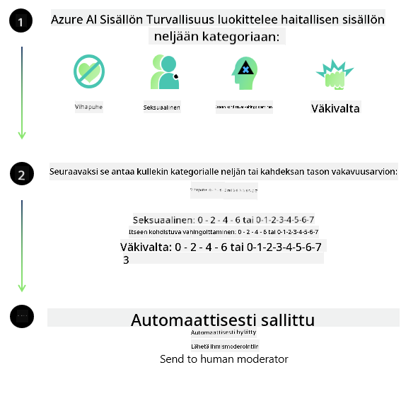
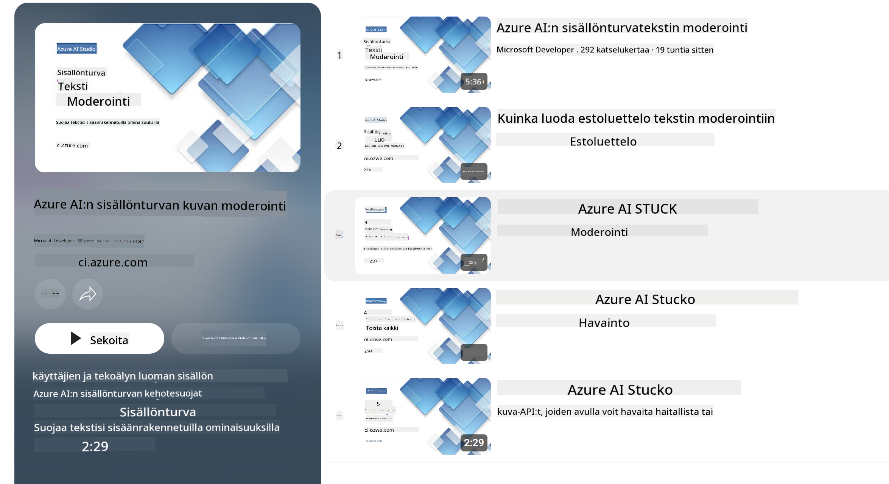

<!--
CO_OP_TRANSLATOR_METADATA:
{
  "original_hash": "c8273672cc57df2be675407a1383aaf0",
  "translation_date": "2025-05-09T06:05:38+00:00",
  "source_file": "md/01.Introduction/01/01.AISafety.md",
  "language_code": "fi"
}
-->
# AI-turvallisuus Phi-malleille  
Phi-malliperhe on kehitetty noudattaen [Microsoft Responsible AI Standard](https://query.prod.cms.rt.microsoft.com/cms/api/am/binary/RE5cmFl) -standardia, joka on yrityksen laajuinen vaatimusten kokoelma perustuen kuuteen periaatteeseen: vastuullisuus, läpinäkyvyys, oikeudenmukaisuus, luotettavuus ja turvallisuus, yksityisyys ja tietoturva sekä osallisuus. Nämä muodostavat [Microsoftin Responsible AI -periaatteet](https://www.microsoft.com/ai/responsible-ai).  

Kuten aiemmissa Phi-malleissa, myös tässä julkaisussa on käytetty monipuolista turvallisuusarviointia ja jälkikoulutukseen perustuvaa turvallisuusmenetelmää, ottaen lisäksi huomioon monikieliset kyvyt. Lähestymistapamme turvallisuuskoulutukseen ja arviointeihin, mukaan lukien testaus useilla kielillä ja riskiluokissa, on kuvattu [Phi Safety Post-Training Paperissa](https://arxiv.org/abs/2407.13833). Vaikka Phi-mallit hyötyvät tästä lähestymistavasta, kehittäjien tulisi soveltaa vastuullisen tekoälyn parhaita käytäntöjä, kuten riskien kartoittamista, mittaamista ja lieventämistä omien käyttötarkoitustensa sekä kulttuuristen ja kielellisten kontekstien mukaisesti.  

## Parhaat käytännöt  

Kuten muutkin mallit, Phi-malliperhe voi käyttäytyä tavoilla, jotka ovat epäoikeudenmukaisia, epäluotettavia tai loukkaavia.  

Joistakin SLM- ja LLM-mallien rajoittavista käyttäytymisistä, joista kannattaa olla tietoinen, mainittakoon:  

- **Palvelun laatu:** Phi-malleja on koulutettu pääasiassa englanninkielisellä aineistolla. Muilla kielillä suorituskyky on heikompi, ja englannin eri murteet, joita on vähemmän koulutusdatassa, saattavat toimia heikommin kuin standardi amerikkalainen englanti.  
- **Haittojen esittäminen ja stereotypioiden ylläpito:** Nämä mallit voivat yli- tai aliedustaa tiettyjä ihmisryhmiä, poistaa joidenkin ryhmien edustuksen tai vahvistaa halventavia tai negatiivisia stereotypioita. Turvallisuuden jälkikoulutuksesta huolimatta nämä rajoitteet voivat silti esiintyä, koska eri ryhmien edustus vaihtelee tai negatiivisia stereotypioita sisältäviä esimerkkejä on koulutusdatassa, mikä heijastaa todellisia yhteiskunnallisia malleja ja ennakkoluuloja.  
- **Sopimaton tai loukkaava sisältö:** Mallit voivat tuottaa myös muita sopimattomia tai loukkaavia sisältöjä, mikä voi tehdä niiden käyttämisestä herkillä alueilla sopimatonta ilman lisätoimenpiteitä, jotka on räätälöity käyttötarkoitukseen.  
- **Tietojen luotettavuus:** Kielimallit voivat tuottaa järjenvastaisia sisältöjä tai keksittyjä tietoja, jotka saattavat kuulostaa uskottavilta mutta ovat virheellisiä tai vanhentuneita.  
- **Rajallinen koodin tukialue:** Suurin osa Phi-3:n koulutusdatasta perustuu Python-kieleen ja yleisiin kirjastoihin, kuten "typing, math, random, collections, datetime, itertools". Jos malli generoi Python-skriptejä, jotka käyttävät muita kirjastoja tai skriptejä muilla kielillä, suosittelemme vahvasti, että käyttäjät tarkistavat kaikki API-kutsut manuaalisesti.  

Kehittäjien tulee noudattaa vastuullisen tekoälyn parhaita käytäntöjä ja varmistaa, että heidän käyttötapauksensa noudattavat asiaankuuluvia lakeja ja säädöksiä (esim. yksityisyys, kauppa jne.).  

## Vastuullisen tekoälyn näkökohdat  

Kuten muutkin kielimallit, myös Phi-sarjan mallit voivat käyttäytyä tavoilla, jotka ovat epäoikeudenmukaisia, epäluotettavia tai loukkaavia. Joitakin rajoittavia käyttäytymismalleja, joista on hyvä olla tietoinen:  

**Palvelun laatu:** Phi-mallit on koulutettu pääasiassa englanninkielisellä aineistolla. Muilla kielillä suorituskyky on heikompi. Englannin eri murteet, joita on vähemmän koulutusdatassa, saattavat toimia heikommin kuin standardi amerikkalainen englanti.  

**Haittojen esittäminen ja stereotypioiden ylläpito:** Nämä mallit voivat yli- tai aliedustaa ryhmiä, poistaa joidenkin ryhmien edustusta tai vahvistaa halventavia tai negatiivisia stereotypioita. Turvallisuuden jälkikoulutuksesta huolimatta nämä rajoitteet voivat silti esiintyä eri ryhmien erilaisen edustuksen tai negatiivisia stereotypioita sisältävien esimerkkien vuoksi, jotka heijastavat todellisia yhteiskunnallisia malleja ja ennakkoluuloja.  

**Sopimaton tai loukkaava sisältö:** Mallit voivat tuottaa myös muita sopimattomia tai loukkaavia sisältöjä, mikä voi tehdä niiden käyttämisestä herkillä alueilla sopimatonta ilman käyttötarkoitukseen räätälöityjä lisätoimenpiteitä.  
Tietojen luotettavuus: Kielimallit voivat tuottaa järjenvastaisia tai keksittyjä sisältöjä, jotka saattavat kuulostaa uskottavilta mutta ovat virheellisiä tai vanhentuneita.  

**Rajallinen koodin tukialue:** Suurin osa Phi-3:n koulutusdatasta perustuu Python-kieleen ja yleisiin kirjastoihin, kuten "typing, math, random, collections, datetime, itertools". Jos malli generoi Python-skriptejä, jotka käyttävät muita kirjastoja tai skriptejä muilla kielillä, suosittelemme vahvasti, että käyttäjät tarkistavat kaikki API-kutsut manuaalisesti.  

Kehittäjien tulee noudattaa vastuullisen tekoälyn parhaita käytäntöjä ja varmistaa, että heidän käyttötapauksensa noudattavat asiaankuuluvia lakeja ja säädöksiä (esim. yksityisyys, kauppa jne.). Tärkeitä huomioitavia alueita ovat:  

**Kohdentaminen:** Mallit eivät välttämättä sovellu tilanteisiin, joilla voi olla merkittävä vaikutus oikeudelliseen asemaan tai resurssien tai elämänmahdollisuuksien jakamiseen (esim. asuminen, työllisyys, luotto jne.) ilman lisäarviointeja ja ylimääräisiä vinoumien poiston tekniikoita.  

**Korkean riskin tilanteet:** Kehittäjien tulee arvioida mallien soveltuvuus korkean riskin tilanteissa, joissa epäoikeudenmukaiset, epäluotettavat tai loukkaavat vastaukset voivat olla erittäin kalliita tai aiheuttaa haittaa. Tämä koskee myös neuvojen antamista herkissä tai asiantuntija-aloissa, joissa tarkkuus ja luotettavuus ovat kriittisiä (esim. oikeudelliset tai terveysneuvot). Lisäsuojauksia tulee toteuttaa sovellustasolla käyttöönoton kontekstin mukaan.  

**Väärä tieto:** Mallit voivat tuottaa virheellistä tietoa. Kehittäjien tulee noudattaa läpinäkyvyyden parhaita käytäntöjä ja tiedottaa loppukäyttäjiä siitä, että he ovat vuorovaikutuksessa tekoälyjärjestelmän kanssa. Sovellustasolla kehittäjät voivat rakentaa palautemekanismeja ja putkia, jotka perustavat vastaukset käyttötapakohtaiseen, kontekstuaaliseen tietoon, mikä tunnetaan nimellä Retrieval Augmented Generation (RAG).  

**Haitallisen sisällön tuottaminen:** Kehittäjien tulee arvioida tuotoksia niiden kontekstissa ja käyttää saatavilla olevia turvallisuusluokittelijoita tai räätälöityjä ratkaisuja, jotka sopivat käyttötarkoitukseen.  

**Väärinkäyttö:** Muita väärinkäytön muotoja, kuten petoksia, roskapostia tai haittaohjelmien tuottamista, voi esiintyä, ja kehittäjien tulee varmistaa, etteivät heidän sovelluksensa riko sovellettavia lakeja ja säädöksiä.  

### Hienosäätö ja tekoälysisällön turvallisuus  

Mallin hienosäädön jälkeen suosittelemme vahvasti hyödyntämään [Azure AI Content Safety](https://learn.microsoft.com/azure/ai-services/content-safety/overview) -toimenpiteitä valvomaan mallien tuottamaa sisältöä, tunnistamaan ja estämään mahdollisia riskejä, uhkia ja laadullisia ongelmia.  

  

[Azure AI Content Safety](https://learn.microsoft.com/azure/ai-services/content-safety/overview) tukee sekä teksti- että kuvasisältöä. Se voidaan ottaa käyttöön pilvessä, eristetyissä konteissa sekä reunalaitteissa tai sulautetuissa laitteissa.  

## Yleiskatsaus Azure AI Content Safetystä  

Azure AI Content Safety ei ole yksi ratkaisu kaikille; sitä voi mukauttaa yritysten omien käytäntöjen mukaiseksi. Lisäksi sen monikieliset mallit mahdollistavat useiden kielten ymmärtämisen samanaikaisesti.  

  

- **Azure AI Content Safety**  
- **Microsoft Developer**  
- **5 videota**  

Azure AI Content Safety -palvelu tunnistaa haitallisen käyttäjän tuottaman ja tekoälyn generoiman sisällön sovelluksissa ja palveluissa. Se sisältää teksti- ja kuva-API:t, joiden avulla voidaan havaita haitallista tai sopimatonta materiaalia.  

[AI Content Safety Playlist](https://www.youtube.com/playlist?list=PLlrxD0HtieHjaQ9bJjyp1T7FeCbmVcPkQ)

**Vastuuvapauslauseke**:  
Tämä asiakirja on käännetty käyttämällä tekoälypohjaista käännöspalvelua [Co-op Translator](https://github.com/Azure/co-op-translator). Vaikka pyrimme tarkkuuteen, huomioithan, että automaattikäännöksissä voi esiintyä virheitä tai epätarkkuuksia. Alkuperäistä asiakirjaa sen alkuperäiskielellä tulee pitää virallisena lähteenä. Tärkeissä tiedoissa suositellaan ammattimaista ihmiskäännöstä. Emme ole vastuussa tämän käännöksen käytöstä aiheutuvista väärinymmärryksistä tai virhetulkinnoista.