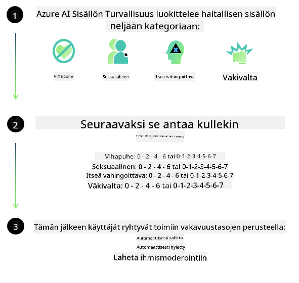

<!--
CO_OP_TRANSLATOR_METADATA:
{
  "original_hash": "c8273672cc57df2be675407a1383aaf0",
  "translation_date": "2025-07-16T17:49:46+00:00",
  "source_file": "md/01.Introduction/01/01.AISafety.md",
  "language_code": "fi"
}
-->
# AI-turvallisuus Phi-malleille  
Phi-malliperhe on kehitetty noudattaen [Microsoft Responsible AI Standard](https://query.prod.cms.rt.microsoft.com/cms/api/am/binary/RE5cmFl) -ohjeistusta, joka on yrityksen laajuinen vaatimuskokonaisuus perustuen kuuteen periaatteeseen: vastuullisuus, läpinäkyvyys, oikeudenmukaisuus, luotettavuus ja turvallisuus, yksityisyys ja tietoturva sekä osallisuus. Nämä muodostavat [Microsoftin Responsible AI -periaatteet](https://www.microsoft.com/ai/responsible-ai).

Kuten aiemmissa Phi-malleissa, myös tässä julkaisussa on käytetty monipuolista turvallisuusarviointia ja jälkikoulutuksen turvallisuusmenetelmiä, ottaen lisäksi huomioon monikieliset ominaisuudet. Turvallisuuskoulutuksen ja arviointien lähestymistapa, joka sisältää testauksen useilla kielillä ja riskiluokissa, on kuvattu [Phi Safety Post-Training Paperissa](https://arxiv.org/abs/2407.13833). Vaikka Phi-mallit hyötyvät tästä lähestymistavasta, kehittäjien tulee soveltaa vastuullisen tekoälyn parhaita käytäntöjä, mukaan lukien riskien kartoittaminen, mittaaminen ja lieventäminen oman käyttötapauksensa sekä kulttuurisen ja kielellisen kontekstin mukaan.

## Parhaat käytännöt

Kuten muutkin mallit, Phi-mallit voivat käyttäytyä tavoilla, jotka ovat epäoikeudenmukaisia, epäluotettavia tai loukkaavia.

Joihinkin SLM- ja LLM-mallien rajoittaviin käyttäytymismalleihin, joista on hyvä olla tietoinen, kuuluvat:

- **Palvelun laatu:** Phi-mallit on koulutettu pääasiassa englanninkielisellä tekstillä. Muilla kielillä suorituskyky on heikompi. Englannin eri murteet, joita on vähemmän edustettuna koulutusdatassa, voivat suoriutua heikommin kuin standardi amerikkalainen englanti.  
- **Vahinkojen esittäminen ja stereotypioiden ylläpitäminen:** Mallit voivat yli- tai aliedustaa tiettyjä ihmisryhmiä, poistaa joidenkin ryhmien edustusta tai vahvistaa halventavia tai negatiivisia stereotypioita. Vaikka turvallisuuskoulutusta on tehty, nämä rajoitukset voivat silti esiintyä erilaisten ryhmien edustuksen vaihtelun tai negatiivisten stereotypioiden esiintymisen vuoksi koulutusdatassa, joka heijastaa todellisia yhteiskunnallisia malleja ja ennakkoluuloja.  
- **Sopimaton tai loukkaava sisältö:** Mallit voivat tuottaa myös muita sopimattomia tai loukkaavia sisältöjä, mikä voi tehdä niiden käytöstä epäasianmukaista herkillä alueilla ilman käyttötapaukseen räätälöityjä lisätoimenpiteitä.  
- **Tietojen luotettavuus:** Kielenmallit voivat tuottaa järjenvastaisia tai keksittyjä sisältöjä, jotka saattavat kuulostaa uskottavilta, mutta ovat epätarkkoja tai vanhentuneita.  
- **Rajoitettu koodin tuki:** Suurin osa Phi-3:n koulutusdatasta perustuu Python-kieleen ja yleisiin kirjastoihin kuten "typing, math, random, collections, datetime, itertools". Jos malli tuottaa Python-skriptejä, jotka käyttävät muita kirjastoja tai skriptejä muilla kielillä, suosittelemme vahvasti, että käyttäjät tarkistavat kaikki API-kutsut manuaalisesti.

Kehittäjien tulee soveltaa vastuullisen tekoälyn parhaita käytäntöjä ja varmistaa, että käyttötapaus noudattaa soveltuvia lakeja ja säädöksiä (esim. yksityisyys, kauppa jne.).

## Vastuullisen tekoälyn näkökulmat

Kuten muutkin kielimallit, Phi-sarjan mallit voivat käyttäytyä tavoilla, jotka ovat epäoikeudenmukaisia, epäluotettavia tai loukkaavia. Joitakin rajoittavia käyttäytymismalleja, joista on hyvä olla tietoinen, ovat:

**Palvelun laatu:** Phi-mallit on koulutettu pääasiassa englanninkielisellä tekstillä. Muilla kielillä suorituskyky on heikompi. Englannin eri murteet, joita on vähemmän edustettuna koulutusdatassa, voivat suoriutua heikommin kuin standardi amerikkalainen englanti.

**Vahinkojen esittäminen ja stereotypioiden ylläpitäminen:** Mallit voivat yli- tai aliedustaa tiettyjä ihmisryhmiä, poistaa joidenkin ryhmien edustusta tai vahvistaa halventavia tai negatiivisia stereotypioita. Vaikka turvallisuuskoulutusta on tehty, nämä rajoitukset voivat silti esiintyä erilaisten ryhmien edustuksen vaihtelun tai negatiivisten stereotypioiden esiintymisen vuoksi koulutusdatassa, joka heijastaa todellisia yhteiskunnallisia malleja ja ennakkoluuloja.

**Sopimaton tai loukkaava sisältö:** Mallit voivat tuottaa myös muita sopimattomia tai loukkaavia sisältöjä, mikä voi tehdä niiden käytöstä epäasianmukaista herkillä alueilla ilman käyttötapaukseen räätälöityjä lisätoimenpiteitä.  
Tietojen luotettavuus: Kielenmallit voivat tuottaa järjenvastaisia tai keksittyjä sisältöjä, jotka saattavat kuulostaa uskottavilta, mutta ovat epätarkkoja tai vanhentuneita.

**Rajoitettu koodin tuki:** Suurin osa Phi-3:n koulutusdatasta perustuu Python-kieleen ja yleisiin kirjastoihin kuten "typing, math, random, collections, datetime, itertools". Jos malli tuottaa Python-skriptejä, jotka käyttävät muita kirjastoja tai skriptejä muilla kielillä, suosittelemme vahvasti, että käyttäjät tarkistavat kaikki API-kutsut manuaalisesti.

Kehittäjien tulee soveltaa vastuullisen tekoälyn parhaita käytäntöjä ja varmistaa, että käyttötapaus noudattaa soveltuvia lakeja ja säädöksiä (esim. yksityisyys, kauppa jne.). Tärkeitä huomioitavia alueita ovat:

**Kohdentaminen:** Mallit eivät välttämättä sovellu tilanteisiin, joilla voi olla merkittävä vaikutus oikeudelliseen asemaan tai resurssien ja elämänmahdollisuuksien jakautumiseen (esim. asuminen, työllisyys, luotto jne.) ilman lisäarviointeja ja lisätoimenpiteitä puolueettomuuden varmistamiseksi.

**Korkean riskin tilanteet:** Kehittäjien tulee arvioida mallien soveltuvuus korkean riskin tilanteissa, joissa epäoikeudenmukaiset, epäluotettavat tai loukkaavat vastaukset voivat aiheuttaa suuria kustannuksia tai vahinkoa. Tämä koskee esimerkiksi herkkiä tai asiantuntijakenttiä, joissa tarkkuus ja luotettavuus ovat kriittisiä (esim. oikeudellinen tai terveysneuvonta). Sovellustasolla tulee ottaa käyttöön lisäsuojauksia käyttöönoton kontekstin mukaan.

**Väärä tieto:** Mallit voivat tuottaa virheellistä tietoa. Kehittäjien tulee noudattaa läpinäkyvyyden parhaita käytäntöjä ja tiedottaa loppukäyttäjiä siitä, että he ovat vuorovaikutuksessa tekoälyjärjestelmän kanssa. Sovellustasolla kehittäjät voivat rakentaa palautemekanismeja ja putkia, jotka perustavat vastaukset käyttötapauksen mukaiseen, kontekstuaaliseen tietoon, tekniikkaa kutsutaan Retrieval Augmented Generationiksi (RAG).

**Vahingollisen sisällön tuottaminen:** Kehittäjien tulee arvioida mallin tuottamat vastaukset niiden kontekstissa ja käyttää saatavilla olevia turvallisuusluokittelijoita tai räätälöityjä ratkaisuja, jotka sopivat heidän käyttötapaukseensa.

**Väärinkäyttö:** Muita väärinkäytön muotoja, kuten petoksia, roskapostia tai haittaohjelmien tuottamista, voi olla mahdollista, ja kehittäjien tulee varmistaa, että heidän sovelluksensa eivät riko sovellettavia lakeja ja säädöksiä.

### Hienosäätö ja tekoälysisällön turvallisuus

Mallin hienosäädön jälkeen suosittelemme vahvasti hyödyntämään [Azure AI Content Safety](https://learn.microsoft.com/azure/ai-services/content-safety/overview) -toimenpiteitä mallien tuottaman sisällön valvontaan, mahdollisten riskien, uhkien ja laadun ongelmien tunnistamiseen ja estämiseen.

[Azure AI Content Safety](https://learn.microsoft.com/azure/ai-services/content-safety/overview) tukee sekä teksti- että kuvasisältöä. Se voidaan ottaa käyttöön pilvessä, eristetyissä konteissa sekä reunalaitteissa ja sulautetuissa järjestelmissä.

## Yleiskatsaus Azure AI Content Safetyyn

Azure AI Content Safety ei ole yksi ratkaisu kaikille; sitä voidaan räätälöidä vastaamaan yritysten erityisiä käytäntöjä. Lisäksi sen monikieliset mallit mahdollistavat useiden kielten ymmärtämisen samanaikaisesti.

- **Azure AI Content Safety**  
- **Microsoft Developer**  
- **5 videota**

Azure AI Content Safety -palvelu tunnistaa haitallista käyttäjän ja tekoälyn tuottamaa sisältöä sovelluksissa ja palveluissa. Se sisältää teksti- ja kuva-API:t, joiden avulla voidaan havaita haitallista tai sopimatonta materiaalia.

[AI Content Safety Playlist](https://www.youtube.com/playlist?list=PLlrxD0HtieHjaQ9bJjyp1T7FeCbmVcPkQ)

**Vastuuvapauslauseke**:  
Tämä asiakirja on käännetty käyttämällä tekoälypohjaista käännöspalvelua [Co-op Translator](https://github.com/Azure/co-op-translator). Vaikka pyrimme tarkkuuteen, huomioithan, että automaattikäännöksissä saattaa esiintyä virheitä tai epätarkkuuksia. Alkuperäistä asiakirjaa sen alkuperäiskielellä tulee pitää virallisena lähteenä. Tärkeissä asioissa suositellaan ammattimaista ihmiskäännöstä. Emme ole vastuussa tämän käännöksen käytöstä aiheutuvista väärinymmärryksistä tai tulkinnoista.