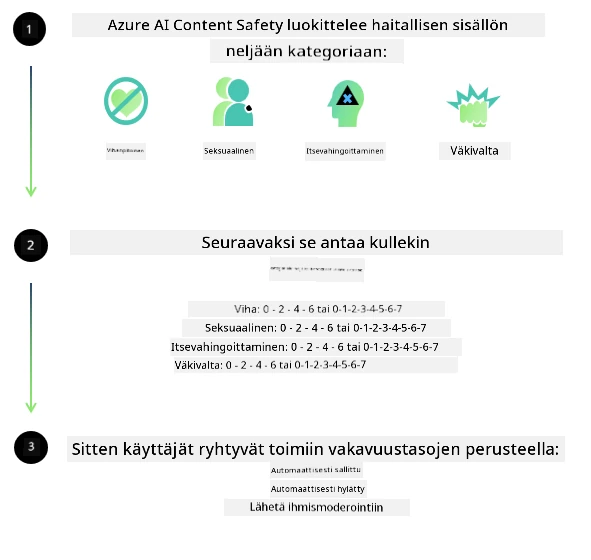
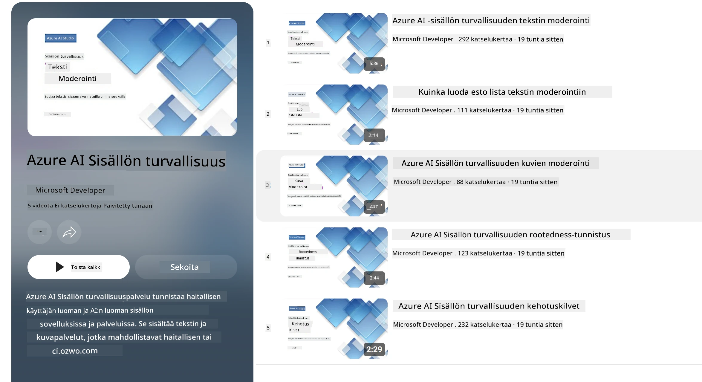

# Phi-mallien tekoälyn turvallisuus
Phi-malliperhe on kehitetty [Microsoftin vastuullisen tekoälyn standardin](https://www.microsoft.com/ai/principles-and-approach#responsible-ai-standard) mukaisesti, joka on yrityksen laajuinen vaatimusten kokoelma perustuen seuraaviin kuuteen periaatteeseen: tilivelvollisuus, läpinäkyvyys, oikeudenmukaisuus, luotettavuus ja turvallisuus, yksityisyys ja suojaus sekä osallisuus, jotka muodostavat [Microsoftin vastuullisen tekoälyn periaatteet](https://www.microsoft.com/ai/responsible-ai).

Kuten aiemmat Phi-mallit, myös tässä malliperheessä on omaksuttu monipuolinen turvallisuusarviointi ja turvallisuuden jälkikoulutusmenetelmä, johon on lisätty toimenpiteitä tämän julkaisun monikielisten kykyjen huomioimiseksi. Lähestymistapamme turvallisuuskoulutukseen ja arviointeihin, mukaan lukien testaus useilla kielillä ja riskiluokissa, on kuvattu [Phi Safety Post-Training Paperissa](https://arxiv.org/abs/2407.13833). Vaikka Phi-mallit hyötyvät tästä lähestymistavasta, kehittäjien tulee soveltaa vastuullisen tekoälyn parhaiden käytäntöjen mukaisia menetelmiä, mukaan lukien käyttöön liittyvien riskien kartoittaminen, mittaaminen ja lieventäminen kulttuurisen ja kielellisen kontekstin mukaisesti.

## Parhaat käytännöt

Kuten muutkin mallit, Phi-mallit voivat käyttäytyä epäoikeudenmukaisesti, epäluotettavasti tai loukkaavasti.

Joitakin SLM- ja LLM-mallien rajoittavia käyttäytymismalleja, joista tulisi olla tietoinen, ovat:

- **Palvelun laatu:** Phi-mallit on koulutettu pääasiassa englanninkielisellä tekstillä. Muu kieli kuin englanti saa heikomman suorituskyvyn. Englannin kielimuodot, joilla on vähemmän edustusta koulutusdatassa, saattavat saada heikomman suorituskyvyn verrattuna amerikkalaiseen englantiin.
- **Vahinkojen edustus ja stereotypioiden jatkuvuus:** Nämä mallit voivat yliedustaa tai aliedustaa ihmisryhmiä, poistaa joidenkin ryhmien edustusta tai vahvistaa halventavia tai negatiivisia stereotypioita. Turvallisuuden jälkikoulutuksesta huolimatta nämä rajoitukset voivat silti esiintyä johtuen erilaisten ryhmien edustuksen tasoista tai negatiivisten stereotypiaesimerkkien yleisyydestä koulutusdatassa, jotka heijastavat todellisen maailman malleja ja yhteiskunnallisia ennakkoluuloja.
- **Sopimaton tai loukkaava sisältö:** Nämä mallit saattavat tuottaa sopimatonta tai loukkaavaa sisältöä, mikä voi tehdä niiden käyttöönotosta epäsopivaa herkissä konteksteissa ilman lisätoimenpiteitä, jotka ovat käyttötilanteeseen erityisiä.
- **Tietojen luotettavuus:** Kielimallit voivat tuottaa järjenvastaisia sisältöjä tai tekaista sisältöä, joka saattaa kuulostaa mielekkäältä, mutta on epätarkkaa tai vanhentunutta.
- **Rajoitettu koodin soveltuvuus:** Suurin osa Phi-3:n koulutusdatasta perustuu Pythoniin ja käyttää yleisiä kirjastoja kuten "typing, math, random, collections, datetime, itertools". Jos malli generoi Python-skriptejä, jotka käyttävät muita kirjastoja tai skriptejä muilla kielillä, suosittelemme vahvasti, että käyttäjät varmistavat kaikki API-kutsut manuaalisesti.

Kehittäjien tulee soveltaa vastuullisen tekoälyn parhaiden käytäntöjen mukaista toimintaa ja heidän vastuullaan on varmistaa, että tietty käyttötapaus noudattaa asiaankuuluvia lakeja ja säädöksiä (esim. yksityisyys, kauppa jne.).

## Vastuullisen tekoälyn näkökohdat

Kuten muutkin kielimallit, Phi-sarjan mallit voivat käyttäytyä epäoikeudenmukaisesti, epäluotettavasti tai loukkaavasti. Joitakin rajoittavia käyttäytymismalleja, joista tulisi olla tietoinen, ovat:

**Palvelun laatu:** Phi-mallit on koulutettu pääasiassa englanninkielisellä tekstillä. Muilla kielillä saattaa olla heikompi suorituskyky. Englannin eri variantit, joilla on vähemmän edustusta koulutusdatassa, voivat tuottaa heikompaa tulosta verrattuna amerikkalaiseen englantiin.

**Vahinkojen edustus ja stereotypioiden jatkuvuus:** Nämä mallit voivat yliedustaa tai aliedustaa ihmisryhmiä, poistaa joidenkin ryhmien edustusta tai vahvistaa negatiivisia tai halventavia stereotypioita. Turvallisuuden jälkikoulutuksen jälkeen nämä rajoitukset voivat edelleen olla läsnä johtuen erilaisten ryhmien edustuksen eroista tai negatiivisten stereotypioiden yleisyydestä koulutusdatassa, jotka heijastavat todellisen maailman malleja ja yhteiskunnallisia ennakkoluuloja.

**Sopimaton tai loukkaava sisältö:** Nämä mallit voivat tuottaa sopimatonta tai loukkaavaa sisältöä, mikä saattaa tehdä niiden käyttöönotosta epäsopivaa herkissä tilanteissa ilman lisätoimenpiteitä, jotka ovat erityisiä kyseiselle käyttötapaukselle.
Tietojen luotettavuus: Kielimallit voivat luoda järjenvastaisia sisältöjä tai sepittää sisältöä, joka saattaa kuulostaa järkevältä, mutta on epätarkkaa tai vanhentunutta.

**Rajoitettu koodin soveltuvuus:** Suurin osa Phi-3:n koulutusdatasta perustuu Pythoniin ja käyttää yleisiä kirjastoja kuten "typing, math, random, collections, datetime, itertools". Jos malli tuottaa Python-koodia, joka käyttää muita kirjastoja tai muita kieliä, suosittelemme vahvasti, että käyttäjät tarkistavat kaikki API-kutsut manuaalisesti.

Kehittäjät tulisi käyttää vastuullisen tekoälyn parhaita käytäntöjä ja heidän vastuullaan on varmistaa, että tietty käyttötapaus on lakien ja määräysten mukainen (esim. yksityisyys, kauppa jne.). Tärkeitä huomioitavia alueita ovat:

**Resurssien kohdentaminen:** Mallit eivät välttämättä sovi tilanteisiin, joissa on merkittävä vaikutus oikeudelliseen asemaan tai resurssien tai elämänmahdollisuuksien kohdentamiseen (esim. asuminen, työllisyys, luotot jne.) ilman lisäarviointeja ja debiasointi-menetelmiä.

**Korkean riskin tilanteet:** Kehittäjien tulisi arvioida mallien sopivuus korkean riskin tilanteissa, joissa epäoikeudenmukaiset, epäluotettavat tai loukkaavat vastaukset voivat olla erittäin kalliita tai aiheuttaa haittaa. Tämä koskee neuvontaa herkissä tai asiantuntija-alueissa, joissa tarkkuus ja luotettavuus ovat ratkaisevia (esim. oikeudelliset tai terveysneuvot). Lisäsuojatoimenpiteet tulisi toteuttaa sovelluskohtaisesti käyttöönoton mukaan.

**Väärä tieto:** Mallit voivat tuottaa epätarkkaa tietoa. Kehittäjien tulee noudattaa läpinäkyvyyden parhaita käytäntöjä ja informoida loppukäyttäjiä, että he ovat tekemisissä tekoälyjärjestelmän kanssa. Sovellustasolla kehittäjät voivat rakentaa palautemekanismeja ja putkia, jotka perustavat vastaukset käyttötapakohtaiseen, kontekstuaaliseen tietoon, tekniikka jota kutsutaan Retrieval Augmented Generationiksi (RAG).

**Haitallisen sisällön generointi:** Kehittäjien tulee arvioida tuotokset kontekstinsa mukaan ja käyttää saatavilla olevia turvallisuusluokittelijoita tai räätälöityjä ratkaisuja, jotka soveltuvat heidän käyttötapaukseensa.

**Väärinkäyttö:** Muita väärinkäytön muotoja, kuten petokset, roskaposti tai haittaohjelmien tuottaminen, saattaa olla mahdollista, ja kehittäjien tulee varmistaa, että heidän sovelluksensa eivät riko sovellettavia lakeja tai säädöksiä.

### Hienosäätö ja tekoälysisällön turvallisuus

Mallin hienosäädön jälkeen suosittelemme vahvasti hyödyntämään [Azure AI Content Safety](https://learn.microsoft.com/azure/ai-services/content-safety/overview) -toimenpiteitä mallien tuottaman sisällön valvontaan, mahdollisten riskien, uhkien ja laadun ongelmien tunnistamiseen ja estämiseen.

[Azure AI Content Safety](https://learn.microsoft.com/azure/ai-services/content-safety/overview) tukee sekä teksti- että kuvasisältöä. Se voidaan ottaa käyttöön pilvessä, erilliskonteissa sekä reunalaitteissa/sulautetuissa laitteissa.

## Yleiskatsaus Azure AI Content Safetyyn

Azure AI Content Safety ei ole yksi ratkaisu kaikille; sitä voidaan räätälöidä yrityksen erityisten politiikkojen mukaiseksi. Lisäksi sen monikieliset mallit mahdollistavat useiden kielten yhtäaikaisen ymmärtämisen.

- **Azure AI Content Safety**
- **Microsoft Developer**
- **5 videota**

Azure AI Content Safety -palvelu havaitsee haitallisen käyttäjän ja tekoälyn tuottaman sisällön sovelluksissa ja palveluissa. Se sisältää teksti- ja kuva-API:t, jotka mahdollistavat haitallisen tai sopimattoman materiaalin tunnistamisen.

[AI Content Safety -soittolista](https://www.youtube.com/playlist?list=PLlrxD0HtieHjaQ9bJjyp1T7FeCbmVcPkQ)

---

<!-- CO-OP TRANSLATOR DISCLAIMER START -->
**Vastuuvapauslauseke**:
Tämä asiakirja on käännetty tekoälypohjaisella käännöspalvelulla [Co-op Translator](https://github.com/Azure/co-op-translator). Pyrimme tarkkuuteen, mutta ole hyvä ja huomioi, että automaattikäännöksissä voi esiintyä virheitä tai epätarkkuuksia. Alkuperäistä asiakirjaa sen alkuperäiskielellä pidetään virallisena lähteenä. Tärkeiden tietojen kohdalla suositellaan ammattimaista ihmiskäännöstä. Emme ole vastuussa tämän käännöksen käytöstä aiheutuvista väärinymmärryksistä tai tulkinnoista.
<!-- CO-OP TRANSLATOR DISCLAIMER END -->