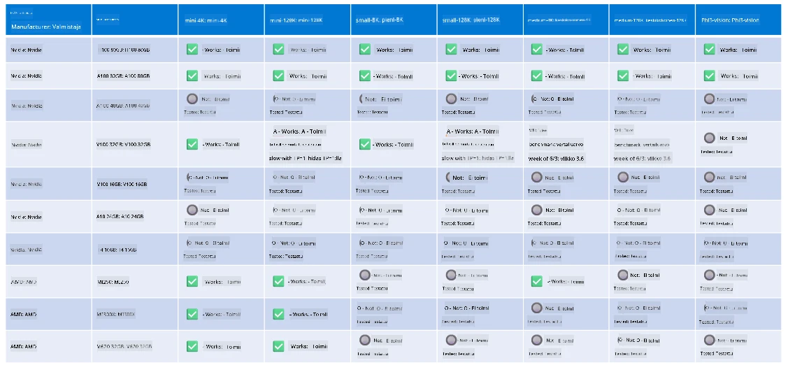

# Phi-laitteiston tuki

Microsoft Phi on optimoitu ONNX Runtime -ympäristöön ja tukee Windows DirectML:ää. Se toimii hyvin erilaisilla laitteistoilla, mukaan lukien GPU:t, CPU:t ja jopa mobiililaitteet.

## Laitteiston laitteet  
Erityisesti tuetut laitteistot ovat:

- GPU SKU: RTX 4090 (DirectML)
- GPU SKU: 1 A100 80GB (CUDA)
- CPU SKU: Standard F64s v2 (64 vCPU:ta, 128 GiB muistia)

## Mobiiliversio

- Android - Samsung Galaxy S21
- Apple iPhone 14 tai uudempi A16/A17-prosessori

## Phi-laitteiston tekniset tiedot

- Vähimmäiskokoonpano vaaditaan.
- Windows: DirectX 12 -yhteensopiva GPU ja vähintään 4 Gt yhdistettyä RAM-muistia

CUDA: NVIDIA GPU, jonka Compute Capability >= 7.02



## ONNX Runtime:n suorittaminen useammalla GPU:lla

Tällä hetkellä saatavilla olevat Phi ONNX -mallit ovat vain yhdelle GPU:lle. Moni-GPU-tuki Phi-malleille on mahdollinen, mutta ORT kaksi-GPU-kokoonpanolla ei taata parempaa suorituskykyä verrattuna kahteen erilliseen ORT-instanssiin. Viimeisimmät päivitykset löydät osoitteesta [ONNX Runtime](https://onnxruntime.ai/).

Build 2024 -tapahtumassa GenAI ONNX -tiimi ilmoitti, että he ovat ottaneet käyttöön monen instanssin tuen monen GPU:n sijasta Phi-malleissa. 

Tällä hetkellä voit ajaa yhtä onnxruntime- tai onnxruntime-genai -instanssia käyttämällä CUDA_VISIBLE_DEVICES-ympäristömuuttujaa seuraavasti.

```Python
CUDA_VISIBLE_DEVICES=0 python infer.py
CUDA_VISIBLE_DEVICES=1 python infer.py
```

Tutustu Phi:n mahdollisuuksiin lisää osoitteessa [Microsoft Foundry](https://ai.azure.com)

---

<!-- CO-OP TRANSLATOR DISCLAIMER START -->
**Vastuuvapauslauseke**:  
Tämä asiakirja on käännetty käyttämällä tekoälypohjaista käännöspalvelua [Co-op Translator](https://github.com/Azure/co-op-translator). Vaikka pyrimme tarkkuuteen, huomioithan, että automaattiset käännökset saattavat sisältää virheitä tai epätarkkuuksia. Alkuperäinen asiakirja omalla kielellään tulisi katsoa viralliseksi lähteeksi. Tärkeissä tiedoissa suositellaan ammattimaista ihmiskäännöstä. Emme ole vastuussa tämän käännöksen käytöstä johtuvista väärinkäsityksistä tai virhetulkinnoista.
<!-- CO-OP TRANSLATOR DISCLAIMER END -->