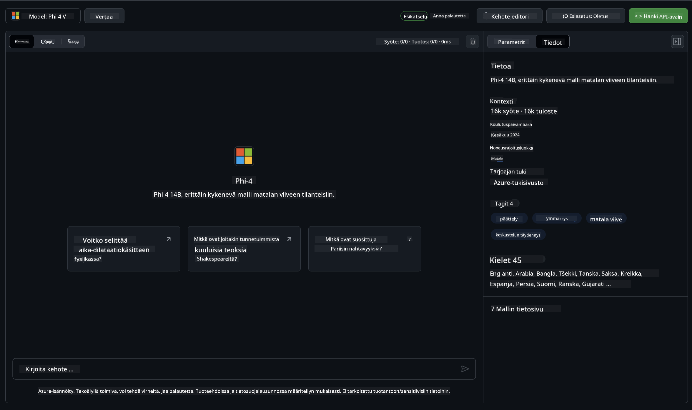

<!--
CO_OP_TRANSLATOR_METADATA:
{
  "original_hash": "fb67a08b9fc911a10ed58081fadef416",
  "translation_date": "2025-05-09T08:53:09+00:00",
  "source_file": "md/01.Introduction/02/02.GitHubModel.md",
  "language_code": "fi"
}
-->
## Phi-perhe GitHub-malleissa

Tervetuloa [GitHub Models](https://github.com/marketplace/models) -palveluun! Olemme valmiina auttamaan sinua tutustumaan Azure AI:lla isännöityihin tekoälymalleihin.


Lisätietoja GitHub Models -palvelussa saatavista malleista löydät osoitteesta [GitHub Model Marketplace](https://github.com/marketplace/models)

## Saatavilla olevat mallit

Jokaisella mallilla on oma leikkikenttä ja esimerkkikoodi



### Phi-perhe GitHub-malliluettelossa

- [Phi-4](https://github.com/marketplace/models/azureml/Phi-4)

- [Phi-3.5-MoE instruct (128k)](https://github.com/marketplace/models/azureml/Phi-3-5-MoE-instruct)

- [Phi-3.5-vision instruct (128k)](https://github.com/marketplace/models/azureml/Phi-3-5-vision-instruct)

- [Phi-3.5-mini instruct (128k)](https://github.com/marketplace/models/azureml/Phi-3-5-mini-instruct)

- [Phi-3-Medium-128k-Instruct](https://github.com/marketplace/models/azureml/Phi-3-medium-128k-instruct)

- [Phi-3-medium-4k-instruct](https://github.com/marketplace/models/azureml/Phi-3-medium-4k-instruct)

- [Phi-3-mini-128k-instruct](https://github.com/marketplace/models/azureml/Phi-3-mini-128k-instruct)

- [Phi-3-mini-4k-instruct](https://github.com/marketplace/models/azureml/Phi-3-mini-4k-instruct)

- [Phi-3-small-128k-instruct](https://github.com/marketplace/models/azureml/Phi-3-small-128k-instruct)

- [Phi-3-small-8k-instruct](https://github.com/marketplace/models/azureml/Phi-3-small-8k-instruct)

## Aloittaminen

Saatavilla on muutamia perusesimerkkejä, jotka voit suorittaa heti. Löydät ne samples-hakemistosta. Jos haluat hypätä suoraan suosikkikieleesi, esimerkit löytyvät seuraavilta kieliltä:

- Python
- JavaScript
- C#
- Java
- cURL

Saatavilla on myös oma Codespaces-ympäristö esimerkkien ja mallien suorittamiseen.


## Esimerkkikoodi

Alla on muutamia esimerkkikoodinpätkiä eri käyttötapauksiin. Lisätietoja Azure AI Inference SDK:sta löydät täydellisestä dokumentaatiosta ja esimerkeistä.

## Asennus

1. Luo henkilökohtainen käyttöoikeustunnus  
Sinun ei tarvitse antaa tunnukselle mitään oikeuksia. Huomioithan, että tunnus lähetetään Microsoftin palveluun.

Käyttääksesi alla olevia koodinpätkiä, luo ympäristömuuttuja, johon asetat tunnuksesi asiakaskoodin avaimena.

Jos käytät bashia:  
```
export GITHUB_TOKEN="<your-github-token-goes-here>"
```  
Jos käytät powershelliä:  

```
$Env:GITHUB_TOKEN="<your-github-token-goes-here>"
```  

Jos käytät Windowsin komentokehotetta:  

```
set GITHUB_TOKEN=<your-github-token-goes-here>
```  

## Python-esimerkki

### Asenna riippuvuudet  
Asenna Azure AI Inference SDK pipillä (vaatii: Python >=3.8):

```
pip install azure-ai-inference
```  
### Suorita perusesimerkki

Tämä esimerkki näyttää yksinkertaisen kutsun chat completion API:in. Se hyödyntää GitHub AI -mallin inference-pistettä ja GitHub-tunnustasi. Kutsu on synkroninen.

```python
import os
from azure.ai.inference import ChatCompletionsClient
from azure.ai.inference.models import SystemMessage, UserMessage
from azure.core.credentials import AzureKeyCredential

endpoint = "https://models.inference.ai.azure.com"
model_name = "Phi-4"
token = os.environ["GITHUB_TOKEN"]

client = ChatCompletionsClient(
    endpoint=endpoint,
    credential=AzureKeyCredential(token),
)

response = client.complete(
    messages=[
        UserMessage(content="I have $20,000 in my savings account, where I receive a 4% profit per year and payments twice a year. Can you please tell me how long it will take for me to become a millionaire? Also, can you please explain the math step by step as if you were explaining it to an uneducated person?"),
    ],
    temperature=0.4,
    top_p=1.0,
    max_tokens=2048,
    model=model_name
)

print(response.choices[0].message.content)
```

### Suorita monivaiheinen keskustelu

Tämä esimerkki näyttää monivaiheisen keskustelun chat completion API:in kanssa. Chat-sovelluksessa sinun täytyy hallita keskustelun historiaa ja lähettää mallille viimeisimmät viestit.

```
import os
from azure.ai.inference import ChatCompletionsClient
from azure.ai.inference.models import AssistantMessage, SystemMessage, UserMessage
from azure.core.credentials import AzureKeyCredential

token = os.environ["GITHUB_TOKEN"]
endpoint = "https://models.inference.ai.azure.com"
# Replace Model_Name
model_name = "Phi-4"

client = ChatCompletionsClient(
    endpoint=endpoint,
    credential=AzureKeyCredential(token),
)

messages = [
    SystemMessage(content="You are a helpful assistant."),
    UserMessage(content="What is the capital of France?"),
    AssistantMessage(content="The capital of France is Paris."),
    UserMessage(content="What about Spain?"),
]

response = client.complete(messages=messages, model=model_name)

print(response.choices[0].message.content)
```

### Striimaa tuloste

Parhaan käyttäjäkokemuksen saavuttamiseksi kannattaa striimata mallin vastaus, jotta ensimmäinen token ilmestyy nopeasti eikä tarvitse odottaa pitkiä vastauksia.

```
import os
from azure.ai.inference import ChatCompletionsClient
from azure.ai.inference.models import SystemMessage, UserMessage
from azure.core.credentials import AzureKeyCredential

token = os.environ["GITHUB_TOKEN"]
endpoint = "https://models.inference.ai.azure.com"
# Replace Model_Name
model_name = "Phi-4"

client = ChatCompletionsClient(
    endpoint=endpoint,
    credential=AzureKeyCredential(token),
)

response = client.complete(
    stream=True,
    messages=[
        SystemMessage(content="You are a helpful assistant."),
        UserMessage(content="Give me 5 good reasons why I should exercise every day."),
    ],
    model=model_name,
)

for update in response:
    if update.choices:
        print(update.choices[0].delta.content or "", end="")

client.close()
```

## ILMAINEN käyttö ja rajoitukset GitHub-malleissa


[Leikkikentän ja ilmaisen API-käytön rajoitukset](https://docs.github.com/en/github-models/prototyping-with-ai-models#rate-limits) on suunniteltu auttamaan sinua kokeilemaan malleja ja prototyyppaamaan tekoälysovellustasi. Näiden rajojen ylittävässä käytössä ja sovelluksen skaalaamisessa sinun tulee varata resursseja Azure-tililtä ja todennustaa sieltä henkilökohtaisen GitHub-käyttöoikeustunnuksen sijaan. Muutoksia koodiin ei tarvitse tehdä. Käytä tätä linkkiä selvittääksesi, miten voit ylittää ilmaiskäytön rajat Azure AI:ssa.

### Huomautukset

Muista, että mallin kanssa toimiessasi kokeilet tekoälyä, joten virheitä sisällössä voi esiintyä.

Ominaisuus on rajattu monin tavoin (mm. pyynnöt minuutissa, pyynnöt päivässä, tokenit per pyyntö ja samanaikaiset pyynnöt) eikä sitä ole suunniteltu tuotantokäyttöön.

GitHub Models käyttää Azure AI Content Safety -suodatusta. Näitä suodattimia ei voi poistaa käytöstä GitHub Models -kokemuksen aikana. Jos päätät käyttää malleja maksullisen palvelun kautta, muokkaa sisältösuodattimia tarpeidesi mukaan.

Tämä palvelu on GitHubin ennakkoversion ehtojen alainen.

**Vastuuvapauslauseke**:  
Tämä asiakirja on käännetty käyttämällä tekoälypohjaista käännöspalvelua [Co-op Translator](https://github.com/Azure/co-op-translator). Vaikka pyrimme tarkkuuteen, huomioithan, että automaattiset käännökset saattavat sisältää virheitä tai epätarkkuuksia. Alkuperäistä asiakirjaa sen alkuperäiskielellä tulee pitää auktoritatiivisena lähteenä. Tärkeissä asioissa suositellaan ammattimaista ihmiskäännöstä. Emme ole vastuussa tämän käännöksen käytöstä aiheutuvista väärinymmärryksistä tai virhetulkintojen seurauksista.