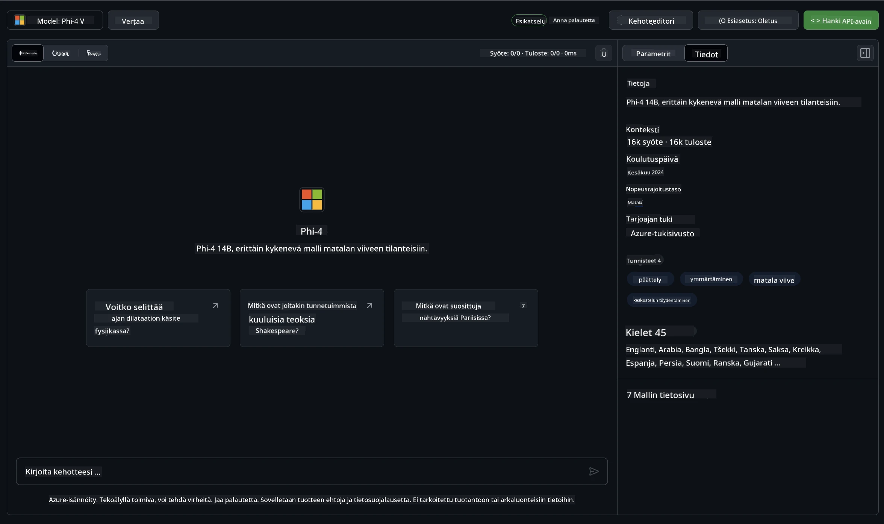
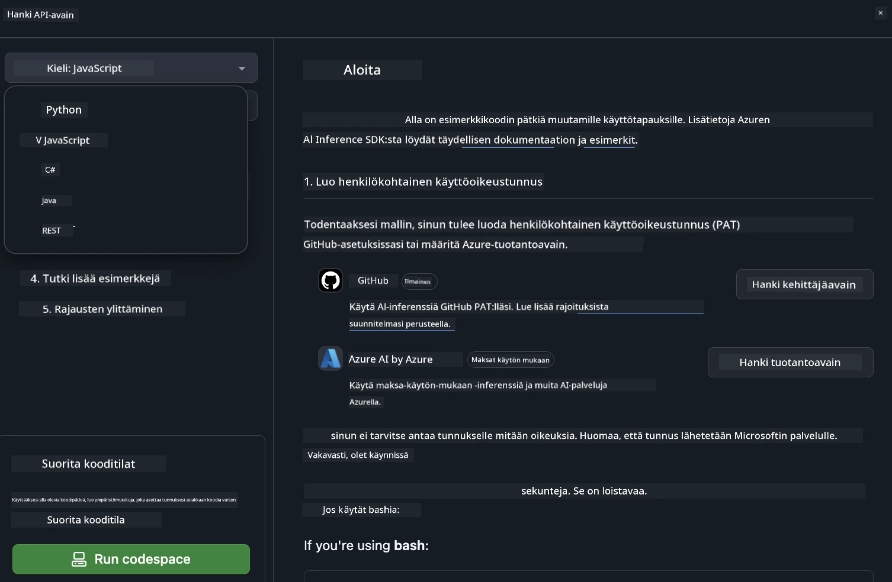
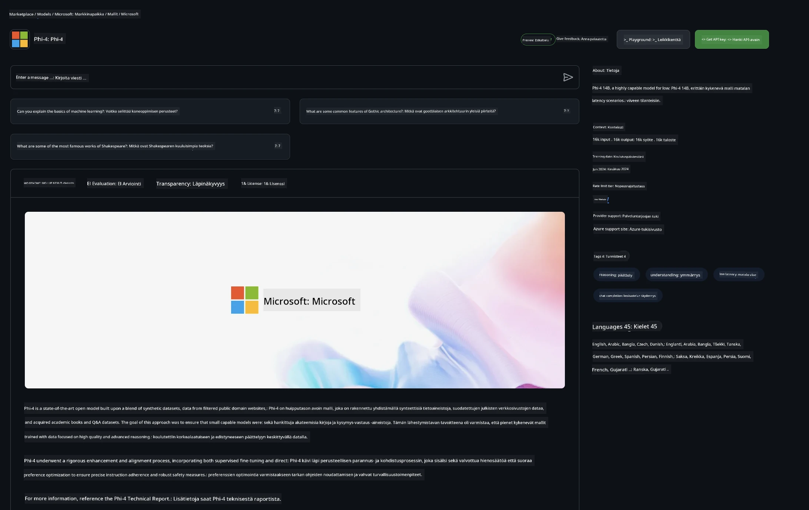

<!--
CO_OP_TRANSLATOR_METADATA:
{
  "original_hash": "fb67a08b9fc911a10ed58081fadef416",
  "translation_date": "2025-07-16T19:02:11+00:00",
  "source_file": "md/01.Introduction/02/02.GitHubModel.md",
  "language_code": "fi"
}
-->
## Phi-perhe GitHub-malleissa

Tervetuloa [GitHub Models](https://github.com/marketplace/models) -sivustolle! Olemme valmiina esittelemään sinulle Azure AI:lla isännöityjä tekoälymalleja.


Lisätietoja GitHub Models -palvelussa saatavista malleista löydät [GitHub Model Marketplacesta](https://github.com/marketplace/models)

## Saatavilla olevat mallit

Jokaisella mallilla on oma leikkikenttä ja esimerkkikoodi



### Phi-perhe GitHub Model Catalogissa

- [Phi-4](https://github.com/marketplace/models/azureml/Phi-4)

- [Phi-3.5-MoE instruct (128k)](https://github.com/marketplace/models/azureml/Phi-3-5-MoE-instruct)

- [Phi-3.5-vision instruct (128k)](https://github.com/marketplace/models/azureml/Phi-3-5-vision-instruct)

- [Phi-3.5-mini instruct (128k)](https://github.com/marketplace/models/azureml/Phi-3-5-mini-instruct)

- [Phi-3-Medium-128k-Instruct](https://github.com/marketplace/models/azureml/Phi-3-medium-128k-instruct)

- [Phi-3-medium-4k-instruct](https://github.com/marketplace/models/azureml/Phi-3-medium-4k-instruct)

- [Phi-3-mini-128k-instruct](https://github.com/marketplace/models/azureml/Phi-3-mini-128k-instruct)

- [Phi-3-mini-4k-instruct](https://github.com/marketplace/models/azureml/Phi-3-mini-4k-instruct)

- [Phi-3-small-128k-instruct](https://github.com/marketplace/models/azureml/Phi-3-small-128k-instruct)

- [Phi-3-small-8k-instruct](https://github.com/marketplace/models/azureml/Phi-3-small-8k-instruct)

## Aloittaminen

Saatavilla on muutamia perusesimerkkejä, jotka ovat valmiita suoritettaviksi. Löydät ne samples-kansiosta. Jos haluat hypätä suoraan suosikkikieleesi, esimerkit löytyvät seuraavilta kieliltä:

- Python
- JavaScript
- C#
- Java
- cURL

Saatavilla on myös oma Codespaces-ympäristö esimerkkien ja mallien ajamiseen.



## Esimerkkikoodi

Alla on esimerkkikoodipätkiä muutamiin käyttötapauksiin. Lisätietoja Azure AI Inference SDK:sta löydät täydellisestä dokumentaatiosta ja esimerkeistä.

## Asetukset

1. Luo henkilökohtainen käyttöoikeustunnus  
Sinun ei tarvitse antaa tunnukselle mitään oikeuksia. Huomaa, että tunnus lähetetään Microsoftin palveluun.

Käyttääksesi alla olevia koodipätkiä, luo ympäristömuuttuja, johon asetat tunnuksesi avaimena asiakaskoodille.

Jos käytät bashia:  
```
export GITHUB_TOKEN="<your-github-token-goes-here>"
```  
Jos käytät powershelliä:  

```
$Env:GITHUB_TOKEN="<your-github-token-goes-here>"
```  

Jos käytät Windowsin komentokehotetta:  

```
set GITHUB_TOKEN=<your-github-token-goes-here>
```  

## Python-esimerkki

### Asenna riippuvuudet  
Asenna Azure AI Inference SDK pipillä (vaatii: Python >=3.8):

```
pip install azure-ai-inference
```  
### Suorita perusesimerkki

Tämä esimerkki näyttää peruskutsun chat completion API:lle. Se hyödyntää GitHub AI -mallin inference-päätepistettä ja GitHub-tunnustasi. Kutsu on synkroninen.

```python
import os
from azure.ai.inference import ChatCompletionsClient
from azure.ai.inference.models import SystemMessage, UserMessage
from azure.core.credentials import AzureKeyCredential

endpoint = "https://models.inference.ai.azure.com"
model_name = "Phi-4"
token = os.environ["GITHUB_TOKEN"]

client = ChatCompletionsClient(
    endpoint=endpoint,
    credential=AzureKeyCredential(token),
)

response = client.complete(
    messages=[
        UserMessage(content="I have $20,000 in my savings account, where I receive a 4% profit per year and payments twice a year. Can you please tell me how long it will take for me to become a millionaire? Also, can you please explain the math step by step as if you were explaining it to an uneducated person?"),
    ],
    temperature=0.4,
    top_p=1.0,
    max_tokens=2048,
    model=model_name
)

print(response.choices[0].message.content)
```

### Suorita monivaiheinen keskustelu

Tämä esimerkki näyttää monivaiheisen keskustelun chat completion API:n kanssa. Kun käytät mallia chat-sovelluksessa, sinun täytyy hallita keskustelun historiaa ja lähettää mallille viimeisimmät viestit.

```
import os
from azure.ai.inference import ChatCompletionsClient
from azure.ai.inference.models import AssistantMessage, SystemMessage, UserMessage
from azure.core.credentials import AzureKeyCredential

token = os.environ["GITHUB_TOKEN"]
endpoint = "https://models.inference.ai.azure.com"
# Replace Model_Name
model_name = "Phi-4"

client = ChatCompletionsClient(
    endpoint=endpoint,
    credential=AzureKeyCredential(token),
)

messages = [
    SystemMessage(content="You are a helpful assistant."),
    UserMessage(content="What is the capital of France?"),
    AssistantMessage(content="The capital of France is Paris."),
    UserMessage(content="What about Spain?"),
]

response = client.complete(messages=messages, model=model_name)

print(response.choices[0].message.content)
```

### Suoratoista vastaus

Parempaa käyttökokemusta varten haluat suoratoistaa mallin vastauksen, jotta ensimmäinen token näkyy nopeasti eikä tarvitse odottaa pitkiä vastauksia.

```
import os
from azure.ai.inference import ChatCompletionsClient
from azure.ai.inference.models import SystemMessage, UserMessage
from azure.core.credentials import AzureKeyCredential

token = os.environ["GITHUB_TOKEN"]
endpoint = "https://models.inference.ai.azure.com"
# Replace Model_Name
model_name = "Phi-4"

client = ChatCompletionsClient(
    endpoint=endpoint,
    credential=AzureKeyCredential(token),
)

response = client.complete(
    stream=True,
    messages=[
        SystemMessage(content="You are a helpful assistant."),
        UserMessage(content="Give me 5 good reasons why I should exercise every day."),
    ],
    model=model_name,
)

for update in response:
    if update.choices:
        print(update.choices[0].delta.content or "", end="")

client.close()
```

## ILMAINEN käyttö ja rajoitukset GitHub-malleissa



[Leikkikentän ja ilmaisen API-käytön rajoitukset](https://docs.github.com/en/github-models/prototyping-with-ai-models#rate-limits) on tarkoitettu auttamaan sinua kokeilemaan malleja ja prototyyppien tekemisessä AI-sovelluksellesi. Näiden rajojen ylittävässä käytössä ja sovelluksen skaalaamisessa sinun tulee varata resursseja Azure-tililtä ja autentikoitua sieltä GitHubin henkilökohtaisen käyttöoikeustunnuksen sijaan. Koodissasi ei tarvitse tehdä muita muutoksia. Käytä tätä linkkiä oppiaksesi, miten voit ylittää ilmaiskäytön rajat Azure AI:ssa.

### Ilmoitukset

Muista, että mallin kanssa toimiessasi kokeilet tekoälyä, joten virheitä sisällössä voi esiintyä.

Ominaisuus on rajoitettu (mm. pyynnöt minuutissa, pyynnöt päivässä, tokenit per pyyntö ja samanaikaiset pyynnöt) eikä ole tarkoitettu tuotantokäyttöön.

GitHub Models käyttää Azure AI Content Safety -suodatusta. Näitä suodattimia ei voi poistaa käytöstä GitHub Models -kokemuksessa. Jos päätät käyttää malleja maksullisen palvelun kautta, muokkaa sisältösuodattimia tarpeidesi mukaan.

Tämä palvelu on GitHubin esijulkaisuehtojen alainen.

**Vastuuvapauslauseke**:  
Tämä asiakirja on käännetty käyttämällä tekoälypohjaista käännöspalvelua [Co-op Translator](https://github.com/Azure/co-op-translator). Vaikka pyrimme tarkkuuteen, huomioithan, että automaattikäännöksissä saattaa esiintyä virheitä tai epätarkkuuksia. Alkuperäistä asiakirjaa sen alkuperäiskielellä tulee pitää virallisena lähteenä. Tärkeissä tiedoissa suositellaan ammattimaista ihmiskäännöstä. Emme ole vastuussa tämän käännöksen käytöstä aiheutuvista väärinymmärryksistä tai tulkinnoista.