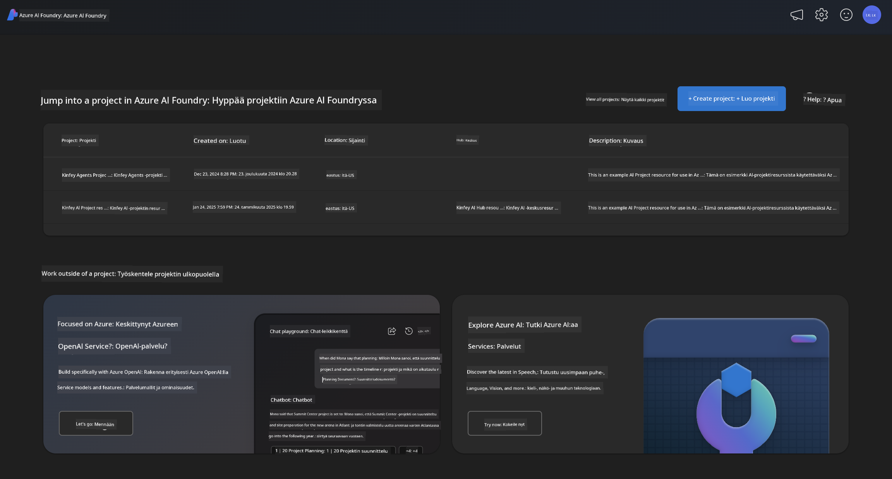
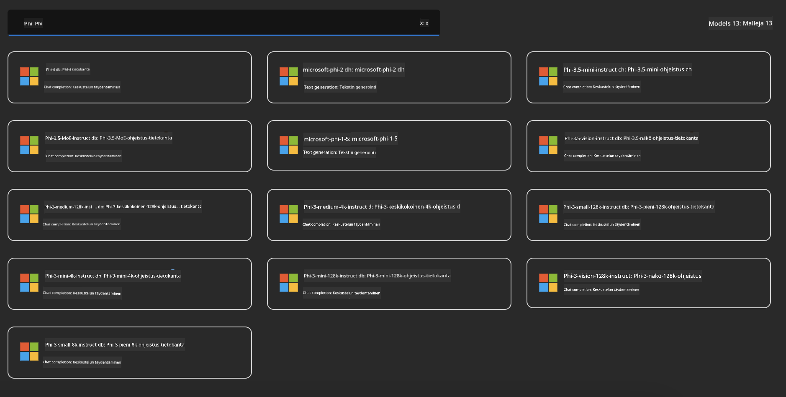
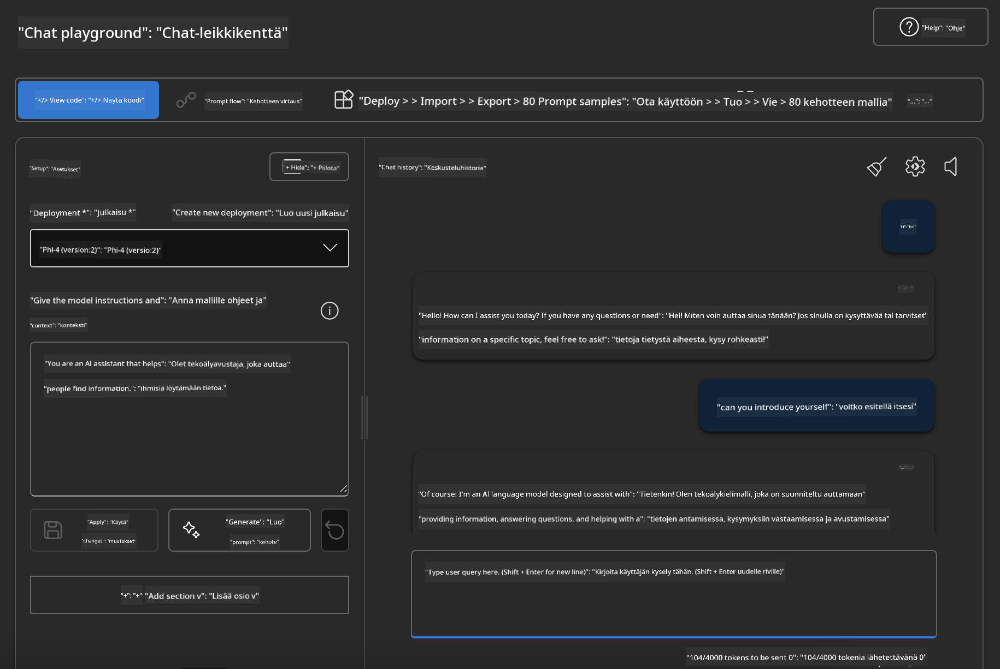

<!--
CO_OP_TRANSLATOR_METADATA:
{
  "original_hash": "3ae21dc5554e888defbe57946ee995ee",
  "translation_date": "2025-05-09T09:06:33+00:00",
  "source_file": "md/01.Introduction/02/03.AzureAIFoundry.md",
  "language_code": "fi"
}
-->
## Phi-perhe Azure AI Foundryssa

[Azure AI Foundry](https://ai.azure.com) on luotettava alusta, joka antaa kehittäjille mahdollisuuden edistää innovaatiota ja muokata tulevaisuutta tekoälyn avulla turvallisella, luotettavalla ja vastuullisella tavalla.

[Azure AI Foundry](https://ai.azure.com) on suunniteltu kehittäjille, jotka haluavat:

- Rakentaa generatiivisia tekoälysovelluksia yritystason alustalla.
- Tutkia, rakentaa, testata ja ottaa käyttöön huipputason tekoälytyökaluja ja koneoppimismalleja vastuullisen tekoälyn periaatteiden mukaisesti.
- Tehdä yhteistyötä tiimin kanssa sovelluskehityksen koko elinkaaren ajan.

Azure AI Foundryn avulla voit tutkia laajaa valikoimaa malleja, palveluita ja ominaisuuksia sekä ryhtyä rakentamaan tekoälysovelluksia, jotka palvelevat parhaiten tavoitteitasi. Azure AI Foundry -alusta mahdollistaa skaalautuvuuden, jonka avulla konseptin todistuksista voidaan helposti siirtyä täysimittaisiin tuotantosovelluksiin. Jatkuva seuranta ja hienosäätö tukevat pitkäaikaista menestystä.



Azure AOAI Service -palvelun lisäksi Azure AI Foundryssa voit käyttää myös kolmannen osapuolen malleja Azure AI Foundry Model Catalogissa. Tämä on hyvä vaihtoehto, jos haluat käyttää Azure AI Foundrya tekoälyratkaisualustana.

Phi-perheen mallien käyttöönotto onnistuu nopeasti Model Catalogin kautta Azure AI Foundryssa

[Microsoft Phi Models in Azure AI Foundry Models](https://ai.azure.com/explore/models/?selectedCollection=phi)



### **Ota Phi-4 käyttöön Azure AI Foundryssa**


### **Testaa Phi-4 Azure AI Foundry Playgroundissa**



### **Python-koodin suorittaminen Azure AI Foundry Phi-4:n kutsumiseen**

```python

import os  
import base64
from openai import AzureOpenAI  
from azure.identity import DefaultAzureCredential, get_bearer_token_provider  
        
endpoint = os.getenv("ENDPOINT_URL", "Your Azure AOAI Service Endpoint")  
deployment = os.getenv("DEPLOYMENT_NAME", "Phi-4")  
      
token_provider = get_bearer_token_provider(  
    DefaultAzureCredential(),  
    "https://cognitiveservices.azure.com/.default"  
)  
  
client = AzureOpenAI(  
    azure_endpoint=endpoint,  
    azure_ad_token_provider=token_provider,  
    api_version="2024-05-01-preview",  
)  
  

chat_prompt = [
    {
        "role": "system",
        "content": "You are an AI assistant that helps people find information."
    },
    {
        "role": "user",
        "content": "can you introduce yourself"
    }
] 
    
# Include speech result if speech is enabled  
messages = chat_prompt 

completion = client.chat.completions.create(  
    model=deployment,  
    messages=messages,
    max_tokens=800,  
    temperature=0.7,  
    top_p=0.95,  
    frequency_penalty=0,  
    presence_penalty=0,
    stop=None,  
    stream=False  
)  
  
print(completion.to_json())  

```

**Vastuuvapauslauseke**:  
Tämä asiakirja on käännetty käyttämällä tekoälypohjaista käännöspalvelua [Co-op Translator](https://github.com/Azure/co-op-translator). Vaikka pyrimme tarkkuuteen, otathan huomioon, että automaattiset käännökset saattavat sisältää virheitä tai epätarkkuuksia. Alkuperäistä asiakirjaa sen alkuperäiskielellä tulisi pitää auktoritatiivisena lähteenä. Tärkeiden tietojen osalta suositellaan ammattimaista ihmiskäännöstä. Emme ole vastuussa tämän käännöksen käytöstä johtuvista väärinymmärryksistä tai tulkinnoista.