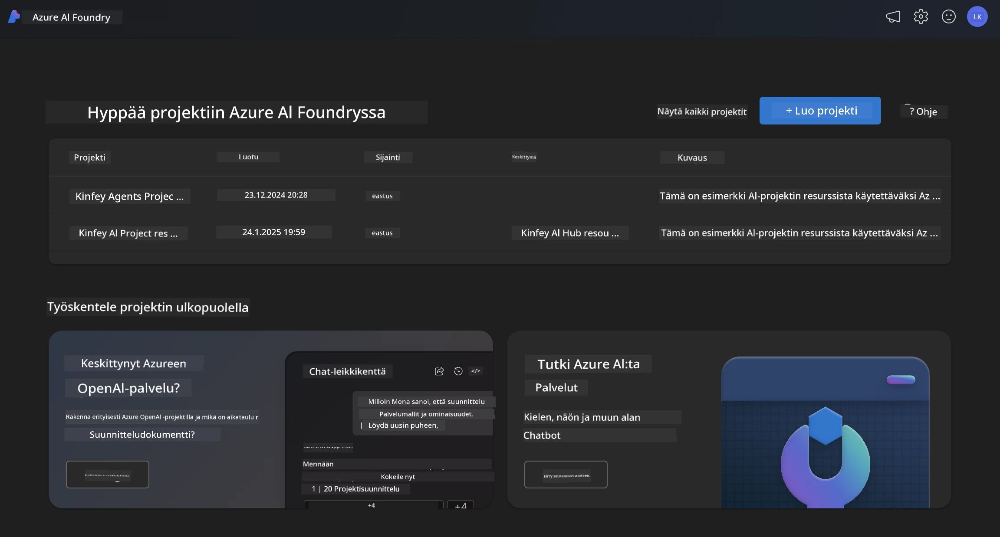
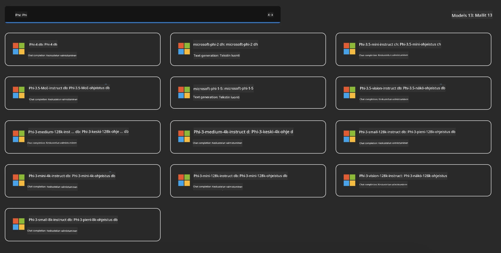
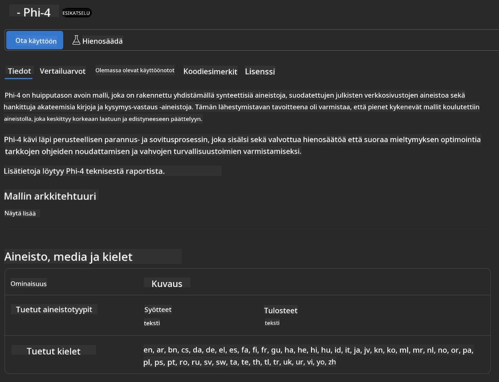
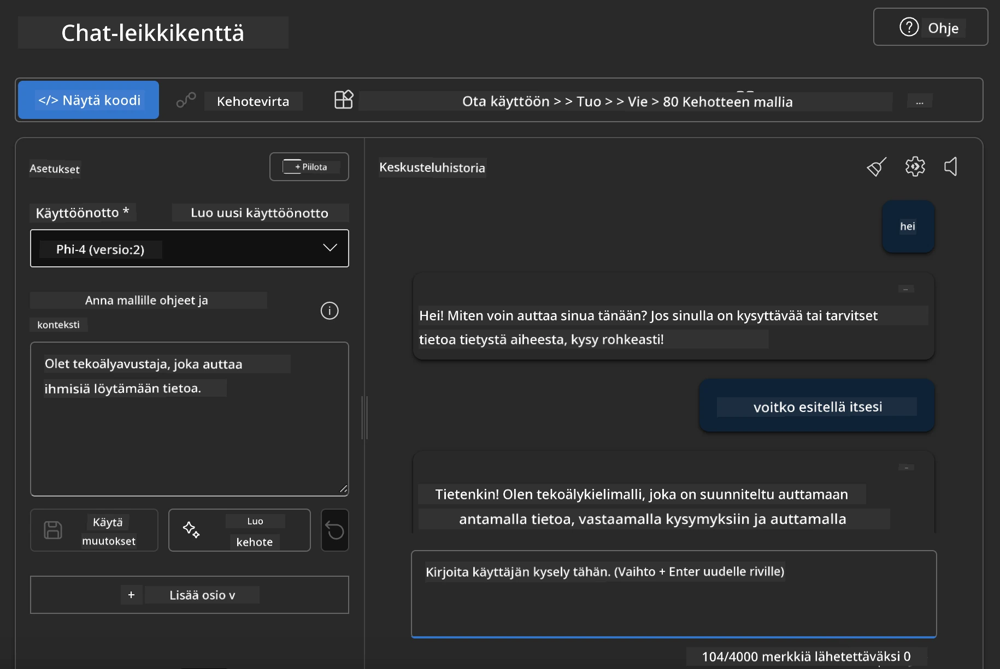

## Phi-perhe Microsoft Foundryssa

[Microsoft Foundry](https://ai.azure.com) on luotettava alusta, joka antaa kehittäjille mahdollisuuden edistää innovaatioita ja muokata tulevaisuutta tekoälyn avulla turvallisella, suojatulla ja vastuullisella tavalla.

[Microsoft Foundry](https://ai.azure.com) on suunniteltu kehittäjille, jotta he voivat:

- Rakentaa generatiivisia tekoälysovelluksia yritystason alustalla.
- Tutkia, rakentaa, testata ja ottaa käyttöön huippuluokan tekoälytyökaluja ja koneoppimismalleja vastuullisiin tekoälykäytäntöihin perustuen.
- Tehdä yhteistyötä tiimin kanssa sovelluskehityksen koko elinkaaren ajan.

Microsoft Foundryn avulla voit tutkia laajaa valikoimaa malleja, palveluita ja ominaisuuksia sekä aloittaa tekoälysovellusten rakentamisen, jotka parhaiten palvelevat tavoitteitasi. Microsoft Foundry -alusta mahdollistaa skaalautuvuuden helpolla siirtymisellä konseptin todistamisesta täysimittaisiin tuotantosovelluksiin. Jatkuva seuranta ja hienosäätö tukevat pitkäaikaista menestystä.



Azure AOAI -palvelun käyttämisen lisäksi Microsoft Foundryssa voit myös käyttää kolmannen osapuolen malleja Microsoft Foundryn malliluettelosta. Tämä on hyvä valinta, jos haluat käyttää Microsoft Foundrya tekoälyratkaisualustana.

Voimme nopeasti ottaa käyttöön Phi-perheen malleja Microsoft Foundryn malliluettelon kautta

[Microsoft Phi -mallit Microsoft Foundryn malleissa](https://ai.azure.com/explore/models/?selectedCollection=phi)



### **Ota Phi-4 käyttöön Microsoft Foundryssa**



### **Testaa Phi-4 Microsoft Foundryn Playgroundissa**



### **Python-koodin suorittaminen Microsoft Foundry Phi-4:n kutsumiseen**

```python

import os  
import base64
from openai import AzureOpenAI  
from azure.identity import DefaultAzureCredential, get_bearer_token_provider  
        
endpoint = os.getenv("ENDPOINT_URL", "Your Azure AOAI Service Endpoint")  
deployment = os.getenv("DEPLOYMENT_NAME", "Phi-4")  
      
token_provider = get_bearer_token_provider(  
    DefaultAzureCredential(),  
    "https://cognitiveservices.azure.com/.default"  
)  
  
client = AzureOpenAI(  
    azure_endpoint=endpoint,  
    azure_ad_token_provider=token_provider,  
    api_version="2024-05-01-preview",  
)  
  

chat_prompt = [
    {
        "role": "system",
        "content": "You are an AI assistant that helps people find information."
    },
    {
        "role": "user",
        "content": "can you introduce yourself"
    }
] 
    
# Sisällytä puhetulos, jos puhe on käytössä
messages = chat_prompt 

completion = client.chat.completions.create(  
    model=deployment,  
    messages=messages,
    max_tokens=800,  
    temperature=0.7,  
    top_p=0.95,  
    frequency_penalty=0,  
    presence_penalty=0,
    stop=None,  
    stream=False  
)  
  
print(completion.to_json())  

```

---

<!-- CO-OP TRANSLATOR DISCLAIMER START -->
**Vastuuvapauslauseke**:  
Tämä asiakirja on käännetty tekoälypohjaisella käännöspalvelulla [Co-op Translator](https://github.com/Azure/co-op-translator). Vaikka pyrimme tarkkuuteen, tulee ottaa huomioon, että automaattikäännöksissä saattaa esiintyä virheitä tai epätarkkuuksia. Alkuperäinen asiakirja alkuperäiskielellä on virallinen ja auktorisoitu lähde. Tärkeiden tietojen osalta suositellaan ammattimaisen ihmiskääntäjän käyttöä. Emme ole vastuussa tämän käännöksen käytöstä aiheutuvista väärinymmärryksistä tai tulkinnoista.
<!-- CO-OP TRANSLATOR DISCLAIMER END -->