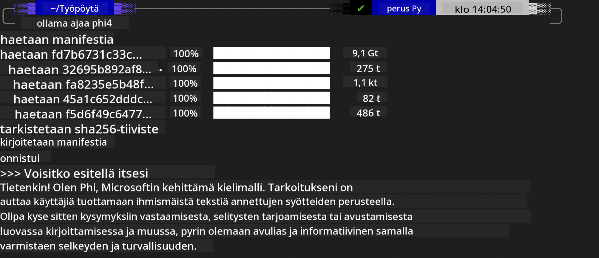

<!--
CO_OP_TRANSLATOR_METADATA:
{
  "original_hash": "0b38834693bb497f96bf53f0d941f9a1",
  "translation_date": "2025-07-16T19:17:01+00:00",
  "source_file": "md/01.Introduction/02/04.Ollama.md",
  "language_code": "fi"
}
-->
## Phi-perhe Ollamassa


[Ollama](https://ollama.com) mahdollistaa useammille käyttäjille avoimen lähdekoodin LLM- tai SLM-mallien suoran käyttöönoton yksinkertaisten skriptien avulla, ja sen avulla voi myös rakentaa API-rajapintoja paikallisten Copilot-sovellusten tarpeisiin.

## **1. Asennus**

Ollama tukee käyttöä Windowsilla, macOS:llä ja Linuxilla. Voit asentaa Ollaman tämän linkin kautta ([https://ollama.com/download](https://ollama.com/download)). Asennuksen jälkeen voit suoraan käyttää Ollama-skriptiä kutsuaksesi Phi-3:sta terminaali-ikkunassa. Näet kaikki [Ollaman saatavilla olevat kirjastot](https://ollama.com/library). Jos avaat tämän repositorion Codespacessa, Ollama on jo asennettuna.

```bash

ollama run phi4

```

> [!NOTE]
> Malli ladataan ensimmäisellä käyttökerralla. Tietenkin voit myös suoraan määrittää ladatun Phi-4-mallin. Otamme esimerkkinä WSL:n komennon suorittamiseen. Kun malli on ladattu onnistuneesti, voit olla vuorovaikutuksessa suoraan terminaalissa.



## **2. Phi-4 API:n kutsuminen Ollamasta**

Jos haluat kutsua Ollaman generoimaa Phi-4 API:a, voit käynnistää Ollama-palvelimen seuraavalla komennolla terminaalissa.

```bash

ollama serve

```

> [!NOTE]
> Jos käytät macOS:ää tai Linuxia, saatat kohdata seuraavan virheen **"Error: listen tcp 127.0.0.1:11434: bind: address already in use"**. Tämä virhe voi ilmetä komennon suorittamisen yhteydessä. Voit joko ohittaa virheen, sillä se tarkoittaa yleensä, että palvelin on jo käynnissä, tai voit pysäyttää ja käynnistää Ollaman uudelleen:

**macOS**

```bash

brew services restart ollama

```

**Linux**

```bash

sudo systemctl stop ollama

```

Ollama tukee kahta API:a: generate ja chat. Voit kutsua Ollaman tarjoamaa mallin API:a tarpeidesi mukaan lähettämällä pyyntöjä paikalliselle palvelimelle, joka toimii portissa 11434.

**Chat**

```bash

curl http://127.0.0.1:11434/api/chat -d '{
  "model": "phi3",
  "messages": [
    {
      "role": "system",
      "content": "Your are a python developer."
    },
    {
      "role": "user",
      "content": "Help me generate a bubble algorithm"
    }
  ],
  "stream": false
  
}'

This is the result in Postman


## Additional Resources

Check the list of available models in Ollama in [their library](https://ollama.com/library).

Pull your model from the Ollama server using this command

```bash
ollama pull phi4
```

Run the model using this command

```bash
ollama run phi4
```

***Note:*** Visit this link [https://github.com/ollama/ollama/blob/main/docs/api.md](https://github.com/ollama/ollama/blob/main/docs/api.md) to learn more

## Calling Ollama from Python

You can use `requests` or `urllib3` to make requests to the local server endpoints used above. However, a popular way to use Ollama in Python is via the [openai](https://pypi.org/project/openai/) SDK, since Ollama provides OpenAI-compatible server endpoints as well.

Here is an example for phi3-mini:

```python
import openai

client = openai.OpenAI(
    base_url="http://localhost:11434/v1",
    api_key="nokeyneeded",
)

response = client.chat.completions.create(
    model="phi4",
    temperature=0.7,
    n=1,
    messages=[
        {"role": "system", "content": "You are a helpful assistant."},
        {"role": "user", "content": "Write a haiku about a hungry cat"},
    ],
)

print("Response:")
print(response.choices[0].message.content)
```

## Calling Ollama from JavaScript 

```javascript
// Esimerkki tiedoston tiivistämisestä Phi-4:llä
script({
    model: "ollama:phi4",
    title: "Tiivistä Phi-4:llä",
    system: ["system"],
})

// Tiivistämisen esimerkki
const file = def("FILE", env.files)
$`Tiivistä ${file} yhteen kappaleeseen.`
```

## Calling Ollama from C#

Create a new C# Console application and add the following NuGet package:

```bash
dotnet add package Microsoft.SemanticKernel --version 1.34.0
```

Then replace this code in the `Program.cs` file

```csharp
using Microsoft.SemanticKernel;
using Microsoft.SemanticKernel.ChatCompletion;

// lisää chat completion -palvelu paikallisen ollama-palvelimen päätepisteellä
#pragma warning disable SKEXP0001, SKEXP0003, SKEXP0010, SKEXP0011, SKEXP0050, SKEXP0052
builder.AddOpenAIChatCompletion(
    modelId: "phi4",
    endpoint: new Uri("http://localhost:11434/"),
    apiKey: "non required");

// kutsu yksinkertaista kehotetta chat-palvelulle
string prompt = "Write a joke about kittens";
var response = await kernel.InvokePromptAsync(prompt);
Console.WriteLine(response.GetValue<string>());
```

Run the app with the command:

```bash
dotnet run

**Vastuuvapauslauseke**:  
Tämä asiakirja on käännetty käyttämällä tekoälypohjaista käännöspalvelua [Co-op Translator](https://github.com/Azure/co-op-translator). Vaikka pyrimme tarkkuuteen, huomioithan, että automaattikäännöksissä saattaa esiintyä virheitä tai epätarkkuuksia. Alkuperäinen asiakirja sen alkuperäiskielellä on virallinen lähde. Tärkeissä tiedoissa suositellaan ammattimaista ihmiskäännöstä. Emme ole vastuussa tämän käännöksen käytöstä aiheutuvista väärinymmärryksistä tai tulkinnoista.