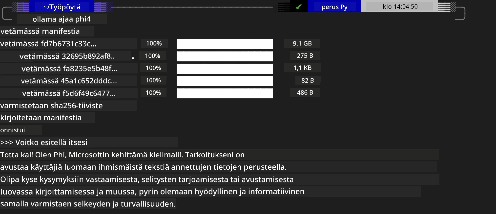

<!--
CO_OP_TRANSLATOR_METADATA:
{
  "original_hash": "2aa35f3c8b437fd5dc9995d53909d495",
  "translation_date": "2025-12-21T12:20:14+00:00",
  "source_file": "md/01.Introduction/02/04.Ollama.md",
  "language_code": "fi"
}
-->
## Phi-perhe Ollamassa


[Ollama](https://ollama.com) sallii useampien ihmisten ottaa suoraan käyttöön avoimen lähdekoodin LLM- tai SLM-malleja yksinkertaisilla skripteillä, ja voi myös rakentaa API-rajapintoja paikallisten Copilot-sovellus­skenaarioiden tukemiseksi.

## **1. Asennus**

Ollama tukee suoritusta Windowsissa, macOS:ssä ja Linuxissa. Voit asentaa Ollaman tämän linkin kautta ([https://ollama.com/download](https://ollama.com/download)). Asennuksen jälkeen voit suoraan käyttää Ollama-skriptiä kutsuaksesi Phi-3:a komentoriviltä. Näet kaikki [Ollaman saatavilla olevat kirjastot](https://ollama.com/library). Jos avaat tämän repositorion Codespacessa, siellä on jo Ollama asennettuna.

```bash

ollama run phi4

```

> [!NOTE]
> Malli ladataan ensin, kun ajat sitä ensimmäisen kerran. Tietenkin voit myös suoraan määrittää ladatun Phi-4-mallin. Käytämme WSL:ää esimerkkinä komennon suorittamiseen. Mallin latauduttua onnistuneesti voit olla vuorovaikutuksessa suoraan terminaalissa.



## **2. Kutsu phi-4-API:a Ollamasta**

Jos haluat kutsua Ollaman generoimaa Phi-4-APIa, voit käyttää tätä komentoa terminaalissa käynnistääksesi Ollama-palvelimen.

```bash

ollama serve

```

> [!NOTE]
> Jos ajat MacOS:ää tai Linuxia, ota huomioon, että saatat kohdata seuraavan virheen **"Error: listen tcp 127.0.0.1:11434: bind: address already in use"**. Saatat saada tämän virheen komentoa suorittaessasi. Voit joko sivuuttaa virheen, sillä se yleensä tarkoittaa, että palvelin on jo käynnissä, tai voit pysäyttää ja käynnistää Ollaman uudelleen:

**macOS**

```bash

brew services restart ollama

```

**Linux**

```bash

sudo systemctl stop ollama

```

Ollama tukee kahta API-rajapintaa: generate ja chat. Voit kutsua Ollaman tarjoamia mallin API:ita tarpeidesi mukaan lähettämällä pyyntöjä paikalliselle palvelulle, joka toimii portissa 11434.

**Chat**

```bash

curl http://127.0.0.1:11434/api/chat -d '{
  "model": "phi3",
  "messages": [
    {
      "role": "system",
      "content": "Your are a python developer."
    },
    {
      "role": "user",
      "content": "Help me generate a bubble algorithm"
    }
  ],
  "stream": false
  
}'
```

Tässä on tulos Postmanissa


## Lisäresurssit

Tutustu Ollaman saatavilla olevien mallien luetteloon [Ollaman kirjastossa](https://ollama.com/library).

Nouda mallisi Ollama-palvelimelta käyttämällä tätä komentoa

```bash
ollama pull phi4
```

Suorita malli tällä komennolla

```bash
ollama run phi4
```

***Huom:*** Käy tällä linkillä [https://github.com/ollama/ollama/blob/main/docs/api.md](https://github.com/ollama/ollama/blob/main/docs/api.md) saadaksesi lisätietoja

## Ollaman kutsuminen Pythonista

Voit käyttää `requests`- tai `urllib3`-kirjastoa tehdäksesi pyyntöjä edellä käytettyihin paikallisen palvelimen päätepisteisiin. Suosittu tapa käyttää Ollamaa Pythonissa on kuitenkin [openai](https://pypi.org/project/openai/)-SDK:n kautta, koska Ollama tarjoaa myös OpenAI-yhteensopivia palvelinpäätteitä.

Tässä on esimerkki phi3-mini:stä:

```python
import openai

client = openai.OpenAI(
    base_url="http://localhost:11434/v1",
    api_key="nokeyneeded",
)

response = client.chat.completions.create(
    model="phi4",
    temperature=0.7,
    n=1,
    messages=[
        {"role": "system", "content": "You are a helpful assistant."},
        {"role": "user", "content": "Write a haiku about a hungry cat"},
    ],
)

print("Response:")
print(response.choices[0].message.content)
```

## Ollaman kutsuminen JavaScriptistä 

```javascript
// Esimerkki tiedoston tiivistämisestä Phi-4:llä
script({
    model: "ollama:phi4",
    title: "Summarize with Phi-4",
    system: ["system"],
})

// Esimerkki tiivistämisestä
const file = def("FILE", env.files)
$`Summarize ${file} in a single paragraph.`
```

## Ollaman kutsuminen C#:stä

Luo uusi C# Console -sovellus ja lisää seuraava NuGet-paketti:

```bash
dotnet add package Microsoft.SemanticKernel --version 1.34.0
```

Sitten korvaa tämä koodi tiedostossa `Program.cs`

```csharp
using Microsoft.SemanticKernel;
using Microsoft.SemanticKernel.ChatCompletion;

// add chat completion service using the local ollama server endpoint
#pragma warning disable SKEXP0001, SKEXP0003, SKEXP0010, SKEXP0011, SKEXP0050, SKEXP0052
builder.AddOpenAIChatCompletion(
    modelId: "phi4",
    endpoint: new Uri("http://localhost:11434/"),
    apiKey: "non required");

// invoke a simple prompt to the chat service
string prompt = "Write a joke about kittens";
var response = await kernel.InvokePromptAsync(prompt);
Console.WriteLine(response.GetValue<string>());
```

Aja sovellus komennolla:

```bash
dotnet run
```

---

<!-- CO-OP TRANSLATOR DISCLAIMER START -->
Vastuuvapauslauseke:
Tämä asiakirja on käännetty käyttämällä tekoälypohjaista käännöspalvelua Co-op Translator (https://github.com/Azure/co-op-translator). Vaikka pyrimme tarkkuuteen, huomioithan, että automatisoiduissa käännöksissä voi esiintyä virheitä tai epätarkkuuksia. Alkuperäistä asiakirjaa sen alkuperäiskielellä on pidettävä ensisijaisena lähteenä. Kriittisten tietojen osalta suositellaan ammattimaista ihmiskäännöstä. Emme ole vastuussa mistään tästä käännöksestä johtuvista väärinymmärryksistä tai virheellisistä tulkinnoista.
<!-- CO-OP TRANSLATOR DISCLAIMER END -->