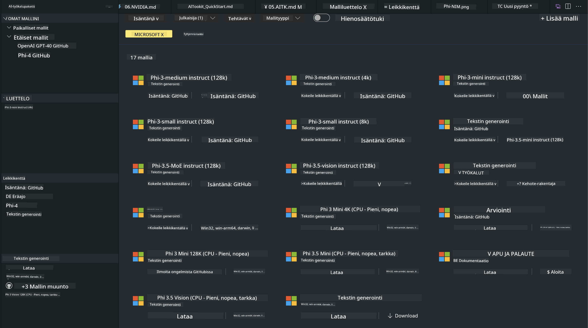
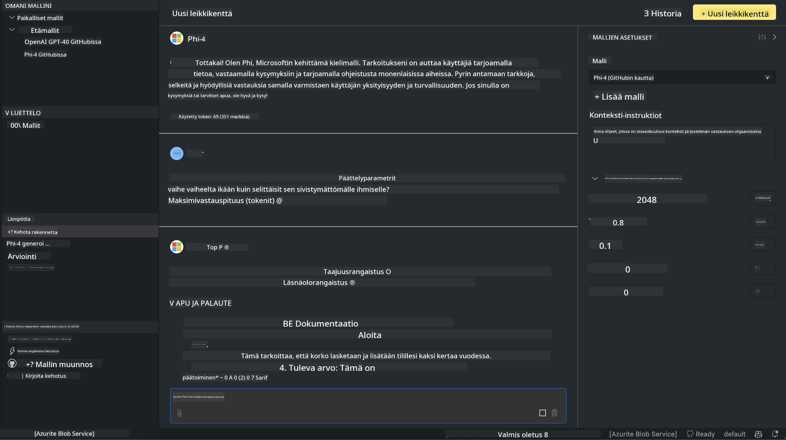

<!--
CO_OP_TRANSLATOR_METADATA:
{
  "original_hash": "4951d458c0b60c02cd1e751b40903877",
  "translation_date": "2025-05-09T09:37:39+00:00",
  "source_file": "md/01.Introduction/02/05.AITK.md",
  "language_code": "fi"
}
-->
# Phi-perhe AITK:ssa

[AI Toolkit for VS Code](https://marketplace.visualstudio.com/items?itemName=ms-windows-ai-studio.windows-ai-studio) helpottaa generatiivisten tekoälysovellusten kehitystä yhdistämällä huipputason tekoälykehitystyökalut ja -mallit Azure AI Foundry Catalogista sekä muista katalogeista kuten Hugging Face. Voit selata GitHub Modelsin ja Azure AI Foundryn mallikatalogeilla toimivaa tekoälymallikatalogia, ladata malleja paikallisesti tai etänä, hienosäätää, testata ja käyttää niitä sovelluksessasi.

AI Toolkit Preview toimii paikallisesti. Paikallinen päättely tai hienosäätö riippuu valitsemastasi mallista, ja saatat tarvita GPU:n, kuten NVIDIA CUDA GPU:n. Voit myös suorittaa GitHub-malleja suoraan AITK:n avulla.

## Aloittaminen

[Lisätietoja Windowsin Linux-alijärjestelmän asentamisesta](https://learn.microsoft.com/windows/wsl/install?WT.mc_id=aiml-137032-kinfeylo)

ja [oletusjakelun vaihtamisesta](https://learn.microsoft.com/windows/wsl/install#change-the-default-linux-distribution-installed).

[AI Toolkitin GitHub-repositorio](https://github.com/microsoft/vscode-ai-toolkit/)

- Windows, Linux, macOS
  
- Hienosäätöä varten sekä Windowsilla että Linuxilla tarvitset Nvidia GPU:n. Lisäksi **Windowsilla** vaaditaan Linux-alijärjestelmä, jossa on Ubuntu-jakeluversio 18.4 tai uudempi. [Lisätietoja Windowsin Linux-alijärjestelmän asentamisesta](https://learn.microsoft.com/windows/wsl/install) ja [oletusjakelun vaihtamisesta](https://learn.microsoft.com/windows/wsl/install#change-the-default-linux-distribution-installed).

### AI Toolkitin asentaminen

AI Toolkit toimitetaan [Visual Studio Code -laajennuksena](https://code.visualstudio.com/docs/setup/additional-components#_vs-code-extensions), joten sinun tulee ensin asentaa [VS Code](https://code.visualstudio.com/docs/setup/windows?WT.mc_id=aiml-137032-kinfeylo) ja ladata AI Toolkit [VS Marketplacesta](https://marketplace.visualstudio.com/items?itemName=ms-windows-ai-studio.windows-ai-studio).  
[AI Toolkit on saatavilla Visual Studio Marketplacessa](https://marketplace.visualstudio.com/items?itemName=ms-windows-ai-studio.windows-ai-studio) ja se voidaan asentaa kuten mikä tahansa VS Code -laajennus.

Jos et ole tottunut asentamaan VS Code -laajennuksia, noudata näitä ohjeita:

### Kirjautuminen

1. Valitse VS Codessa Aktiviteettipalkista **Extensions**  
1. Kirjoita laajennusten hakukenttään "AI Toolkit"  
1. Valitse "AI Toolkit for Visual Studio code"  
1. Valitse **Install**

Nyt olet valmis käyttämään laajennusta!

Sinua pyydetään kirjautumaan GitHubiin, joten klikkaa "Allow" jatkaaksesi. Sinut ohjataan GitHubin kirjautumissivulle.

Kirjaudu sisään ja seuraa ohjeita. Onnistuneen kirjautumisen jälkeen sinut ohjataan takaisin VS Codeen.

Kun laajennus on asennettu, näet AI Toolkit -kuvakkeen Aktiviteettipalkissasi.

Tutustutaan saatavilla oleviin toimintoihin!

### Saatavilla olevat toiminnot

AI Toolkitin pääsivupalkki on järjestetty seuraavasti:

- **Models**  
- **Resources**  
- **Playground**  
- **Fine-tuning**  
- **Evaluation**

Nämä löytyvät Resources-osiossa. Aloita valitsemalla **Model Catalog**.

### Mallin lataaminen katalogista

Käynnistäessäsi AI Toolkitin VS Code -sivupalkista voit valita seuraavista vaihtoehdoista:



- Etsi tuettu malli **Model Catalogista** ja lataa se paikallisesti  
- Testaa mallin päättelyä **Model Playgroundissa**  
- Hienosäädä mallia paikallisesti tai etänä **Model Fine-tuningissa**  
- Ota käyttöön hienosäädetyt mallit pilvessä AI Toolkitin komentopalettia käyttäen  
- Arvioi malleja

> [!NOTE]
>
> **GPU vs CPU**  
>
> Huomaat, että mallikorteissa näkyy mallin koko, alusta ja kiihdytintyyppi (CPU, GPU). Parhaan suorituskyvyn saavuttamiseksi **Windows-laitteilla, joissa on vähintään yksi GPU**, valitse malleja, jotka on optimoitu vain Windowsille.  
>
> Tämä takaa, että mallisi on optimoitu DirectML-kiihdyttimelle.  
>
> Mallien nimet ovat muodossa  
>
> - `{model_name}-{accelerator}-{quantization}-{format}`.  
>
> Tarkistaaksesi, onko Windows-laitteessasi GPU, avaa **Tehtävienhallinta** ja valitse **Suorituskyky**-välilehti. Jos sinulla on GPU:ita, ne näkyvät nimillä kuten "GPU 0" tai "GPU 1".

### Mallin ajaminen playgroundissa

Kun kaikki parametrit on asetettu, klikkaa **Generate Project**.

Kun mallisi on ladattu, valitse katalogin mallikortista **Load in Playground**:

- Käynnistä mallin lataus  
- Asenna kaikki vaadittavat esivaatimukset ja riippuvuudet  
- Luo VS Code -työtila



### REST API:n käyttäminen sovelluksessasi

AI Toolkit sisältää paikallisen REST API -web-palvelimen **portissa 5272**, joka käyttää [OpenAI chat completions -formaattia](https://platform.openai.com/docs/api-reference/chat/create).

Tämä mahdollistaa sovelluksesi testaamisen paikallisesti ilman pilvipohjaista tekoälypalvelua. Esimerkiksi seuraava JSON-tiedosto näyttää, miten pyynnön runko konfiguroidaan:

```json
{
    "model": "Phi-4",
    "messages": [
        {
            "role": "user",
            "content": "what is the golden ratio?"
        }
    ],
    "temperature": 0.7,
    "top_p": 1,
    "top_k": 10,
    "max_tokens": 100,
    "stream": true
}
```

Voit testata REST API:a esimerkiksi [Postmanilla](https://www.postman.com/) tai CURL (Client URL) -työkalulla:

```bash
curl -vX POST http://127.0.0.1:5272/v1/chat/completions -H 'Content-Type: application/json' -d @body.json
```

### OpenAI Python -asiakasohjelmistokirjaston käyttäminen

```python
from openai import OpenAI

client = OpenAI(
    base_url="http://127.0.0.1:5272/v1/", 
    api_key="x" # required for the API but not used
)

chat_completion = client.chat.completions.create(
    messages=[
        {
            "role": "user",
            "content": "what is the golden ratio?",
        }
    ],
    model="Phi-4",
)

print(chat_completion.choices[0].message.content)
```

### Azure OpenAI .NET -asiakasohjelmistokirjaston käyttäminen

Lisää projektiisi [Azure OpenAI client library for .NET](https://www.nuget.org/packages/Azure.AI.OpenAI/) NuGetin kautta:

```bash
dotnet add {project_name} package Azure.AI.OpenAI --version 1.0.0-beta.17
```

Lisää projektiisi C#-tiedosto nimeltä **OverridePolicy.cs** ja liitä siihen seuraava koodi:

```csharp
// OverridePolicy.cs
using Azure.Core.Pipeline;
using Azure.Core;

internal partial class OverrideRequestUriPolicy(Uri overrideUri)
    : HttpPipelineSynchronousPolicy
{
    private readonly Uri _overrideUri = overrideUri;

    public override void OnSendingRequest(HttpMessage message)
    {
        message.Request.Uri.Reset(_overrideUri);
    }
}
```

Seuraavaksi liitä seuraava koodi **Program.cs**-tiedostoosi:

```csharp
// Program.cs
using Azure.AI.OpenAI;

Uri localhostUri = new("http://localhost:5272/v1/chat/completions");

OpenAIClientOptions clientOptions = new();
clientOptions.AddPolicy(
    new OverrideRequestUriPolicy(localhostUri),
    Azure.Core.HttpPipelinePosition.BeforeTransport);
OpenAIClient client = new(openAIApiKey: "unused", clientOptions);

ChatCompletionsOptions options = new()
{
    DeploymentName = "Phi-4",
    Messages =
    {
        new ChatRequestSystemMessage("You are a helpful assistant. Be brief and succinct."),
        new ChatRequestUserMessage("What is the golden ratio?"),
    }
};

StreamingResponse<StreamingChatCompletionsUpdate> streamingChatResponse
    = await client.GetChatCompletionsStreamingAsync(options);

await foreach (StreamingChatCompletionsUpdate chatChunk in streamingChatResponse)
{
    Console.Write(chatChunk.ContentUpdate);
}
```


## Hienosäätö AI Toolkitin avulla

- Aloita mallien etsinnällä ja playgroundilla.  
- Mallin hienosäätö ja päättely paikallisilla resursseilla.  
- Etähienosäätö ja päättely Azure-resursseja käyttäen.

[Hienosäätö AI Toolkitin avulla](../../03.FineTuning/Finetuning_VSCodeaitoolkit.md)

## AI Toolkit Q&A -resurssit

Katso yleisimmät ongelmat ja ratkaisut [Q&A-sivultamme](https://github.com/microsoft/vscode-ai-toolkit/blob/main/archive/QA.md)

**Vastuuvapauslauseke**:  
Tämä asiakirja on käännetty käyttämällä tekoälypohjaista käännöspalvelua [Co-op Translator](https://github.com/Azure/co-op-translator). Vaikka pyrimme tarkkuuteen, otathan huomioon, että automaattiset käännökset saattavat sisältää virheitä tai epätarkkuuksia. Alkuperäistä asiakirjaa sen alkuperäiskielellä tulisi pitää auktoritatiivisena lähteenä. Tärkeiden tietojen osalta suositellaan ammattimaista ihmiskäännöstä. Emme ole vastuussa tämän käännöksen käytöstä johtuvista väärinymmärryksistä tai virhetulkinnoista.