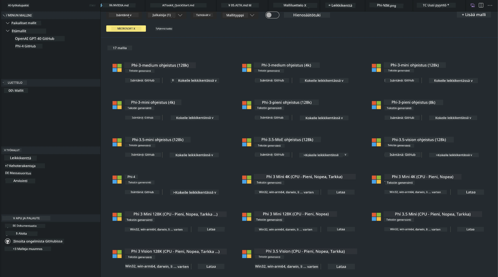
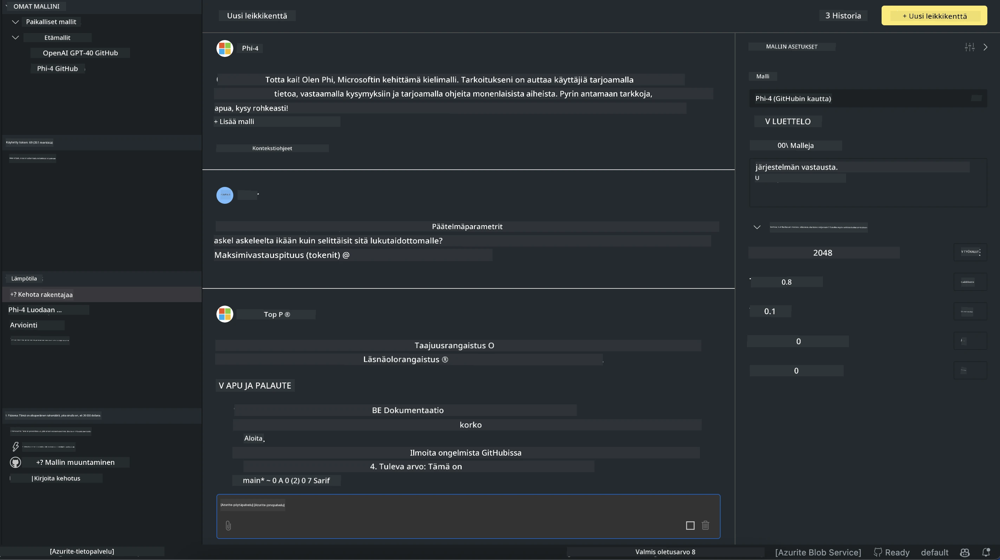

# Phi-perhe AITK:ssa

[AI Toolkit for VS Code](https://marketplace.visualstudio.com/items?itemName=ms-windows-ai-studio.windows-ai-studio) yksinkertaistaa generatiivisten tekoälysovellusten kehittämistä yhdistämällä huippuluokan tekoälyn kehitystyökalut ja -mallit Microsoft Foundry Catalogista sekä muista katalogeista kuten Hugging Face. Voit selata GitHub Modelsin ja Microsoft Foundry Model Catalogsin voimin toimivaa tekoälymallikatalogia, ladata niitä paikallisesti tai etänä, hienosäätää, testata ja käyttää niitä sovelluksissasi.

AI Toolkit Preview toimii paikallisesti. Paikallinen päättely tai hienosäätö riippuu valitsemastasi mallista, ja saatat tarvita GPU:n, kuten NVIDIA CUDA GPU:n. Voit myös käyttää GitHub-malleja suoraan AITK:n kanssa.

## Aloittaminen

[Lisätietoja Windowsin Linux-alijärjestelmän asentamisesta](https://learn.microsoft.com/windows/wsl/install?WT.mc_id=aiml-137032-kinfeylo)

ja [oletusjakelun vaihtamisesta](https://learn.microsoft.com/windows/wsl/install#change-the-default-linux-distribution-installed).

[AI Toolkit GitHub -varasto](https://github.com/microsoft/vscode-ai-toolkit/)

- Windows, Linux, macOS
  
- Hienosäätöä varten sekä Windowsilla että Linuxilla tarvitset Nvidia GPU:n. Lisäksi **Windowsilla** tarvitaan Linux-alijärjestelmä, jossa on Ubuntu-jakelupaketti versio 18.4 tai uudempi. [Lisätietoja Windowsin Linux-alijärjestelmän asentamisesta](https://learn.microsoft.com/windows/wsl/install) ja [oletusjakelun vaihtamisesta](https://learn.microsoft.com/windows/wsl/install#change-the-default-linux-distribution-installed).

### AI Toolkitin asennus

AI Toolkit toimitetaan [Visual Studio Code -laajennuksena](https://code.visualstudio.com/docs/setup/additional-components#_vs-code-extensions), joten sinun täytyy ensin asentaa [VS Code](https://code.visualstudio.com/docs/setup/windows?WT.mc_id=aiml-137032-kinfeylo) ja ladata AI Toolkit [VS Marketplacesta](https://marketplace.visualstudio.com/items?itemName=ms-windows-ai-studio.windows-ai-studio).
[AI Toolkit on saatavilla Visual Studio Marketplacessa](https://marketplace.visualstudio.com/items?itemName=ms-windows-ai-studio.windows-ai-studio) ja se voidaan asentaa kuten mikä tahansa VS Code -laajennus.

Jos et ole tottunut asentamaan VS Code -laajennuksia, noudata näitä ohjeita:

### Kirjautuminen

1. Valitse VS Code -aktiivisuuspalkista **Extensions**
1. Kirjoita Laajennusten hakupalkkiin "AI Toolkit"
1. Valitse "AI Toolkit for Visual Studio code"
1. Valitse **Install**

Nyt voit käyttää laajennusta!

Sinua pyydetään kirjautumaan sisään GitHubiin, joten klikkaa "Allow" jatkaaksesi. Sinut ohjataan GitHubin kirjautumissivulle.

Kirjaudu sisään ja noudata ohjeita. Kun kirjautuminen onnistuu, sinut ohjataan takaisin VS Codeen.

Kun laajennus on asennettu, näet AI Toolkit -kuvakkeen aktiivisuuspalkissa.

Tutustutaan saatavilla oleviin toimintoihin!

### Saatavilla olevat toiminnot

AI Toolkitin pääsivupalkki on järjestetty seuraavasti:

- **Models**
- **Resources**
- **Playground**  
- **Fine-tuning**
- **Evaluation**

Nämä löytyvät Resources-osiossa. Aloita valitsemalla **Model Catalog**.

### Mallin lataaminen katalogista

Käynnistäessäsi AI Toolkitin VS Coden sivupalkista, voit valita seuraavista vaihtoehdoista:



- Etsi tuettu malli **Model Catalog** -osiosta ja lataa paikallisesti
- Testaa mallin päättelyä **Model Playground** -osiossa
- Hienosäädä mallia paikallisesti tai etänä **Model Fine-tuning** -osiossa
- Ota käyttöön hienosäädetyt mallit pilvessä AI Toolkitin komentopalettia käyttäen
- Mallien arviointi

> [!NOTE]
>
> **GPU vs CPU**
>
> Huomaat, että mallikorteissa näytetään mallin koko, alusta ja kiihdyttimen tyyppi (CPU, GPU). Optimoidun suorituskyvyn saavuttamiseksi **Windows-laitteilla, joissa on vähintään yksi GPU**, valitse Windowsiin kohdennetut malliversiot.
>
> Tämä varmistaa, että sinulla on malli, joka on optimoitu DirectML-kiihdyttimelle.
>
> Mallin nimet ovat muodossa
>
> - `{mallin_nimi}-{kiihdytin}-{kvantisointi}-{formaatti}`.
>
> Tarkistaaksesi, onko Windows-laitteessasi GPU, avaa **Tehtävienhallinta** ja valitse **Suorituskyky**-välilehti. Jos sinulla on GPU(t), ne näkyvät nimillä kuten "GPU 0" tai "GPU 1".

### Mallin ajaminen leikkikentässä

Kun kaikki parametrit on asetettu, klikkaa **Generate Project**.

Kun mallisi on ladattu, valitse katalogin mallikortista **Load in Playground**:

- Aloittaa mallin latauksen
- Asentaa kaikki esivaatimukset ja riippuvuudet
- Luo VS Code -työtila



### Käytä REST-API:a sovelluksessasi

AI Toolkit sisältää paikallisen REST-API-web-palvelimen **portissa 5272**, joka käyttää [OpenAI-chat-completions-muotoa](https://platform.openai.com/docs/api-reference/chat/create).

Tämä mahdollistaa sovelluksesi testaamisen paikallisesti ilman tarvetta pilvipohjaiselle tekoälypalvelulle. Esimerkiksi seuraava JSON-tiedosto näyttää, miten pyyntö rakennetaan:

```json
{
    "model": "Phi-4",
    "messages": [
        {
            "role": "user",
            "content": "what is the golden ratio?"
        }
    ],
    "temperature": 0.7,
    "top_p": 1,
    "top_k": 10,
    "max_tokens": 100,
    "stream": true
}
```
  
Voit testata REST-API:a esimerkiksi [Postmanilla](https://www.postman.com/) tai CURL-työkalulla:

```bash
curl -vX POST http://127.0.0.1:5272/v1/chat/completions -H 'Content-Type: application/json' -d @body.json
```
  
### OpenAI-asiakirjaston käyttäminen Pythonille

```python
from openai import OpenAI

client = OpenAI(
    base_url="http://127.0.0.1:5272/v1/", 
    api_key="x" # vaaditaan API:lle mutta ei käytössä
)

chat_completion = client.chat.completions.create(
    messages=[
        {
            "role": "user",
            "content": "what is the golden ratio?",
        }
    ],
    model="Phi-4",
)

print(chat_completion.choices[0].message.content)
```
  
### Azure OpenAI -asiakirjaston käyttäminen .NET:lle

Lisää projektiisi [Azure OpenAI -asiakirjasto .NET:lle](https://www.nuget.org/packages/Azure.AI.OpenAI/) NuGetilla:

```bash
dotnet add {project_name} package Azure.AI.OpenAI --version 1.0.0-beta.17
```
  
Lisää projektiisi C#-tiedosto nimeltä **OverridePolicy.cs** ja liitä seuraava koodi:

```csharp
// OverridePolicy.cs
using Azure.Core.Pipeline;
using Azure.Core;

internal partial class OverrideRequestUriPolicy(Uri overrideUri)
    : HttpPipelineSynchronousPolicy
{
    private readonly Uri _overrideUri = overrideUri;

    public override void OnSendingRequest(HttpMessage message)
    {
        message.Request.Uri.Reset(_overrideUri);
    }
}
```
  
Seuraavaksi liitä seuraava koodi **Program.cs**-tiedostoosi:

```csharp
// Program.cs
using Azure.AI.OpenAI;

Uri localhostUri = new("http://localhost:5272/v1/chat/completions");

OpenAIClientOptions clientOptions = new();
clientOptions.AddPolicy(
    new OverrideRequestUriPolicy(localhostUri),
    Azure.Core.HttpPipelinePosition.BeforeTransport);
OpenAIClient client = new(openAIApiKey: "unused", clientOptions);

ChatCompletionsOptions options = new()
{
    DeploymentName = "Phi-4",
    Messages =
    {
        new ChatRequestSystemMessage("You are a helpful assistant. Be brief and succinct."),
        new ChatRequestUserMessage("What is the golden ratio?"),
    }
};

StreamingResponse<StreamingChatCompletionsUpdate> streamingChatResponse
    = await client.GetChatCompletionsStreamingAsync(options);

await foreach (StreamingChatCompletionsUpdate chatChunk in streamingChatResponse)
{
    Console.Write(chatChunk.ContentUpdate);
}
```


## Hienosäätö AI Toolkitin kanssa

- Aloita mallin etsinnästä ja leikkikentästä.
- Mallin hienosäätö ja päättely paikallisilla tietokoneresursseilla.
- Etähienosäätö ja päättely Azure-resursseilla.

[Hienosäätö AI Toolkitin kanssa](../../03.FineTuning/Finetuning_VSCodeaitoolkit.md)

## AI Toolkit Kysymykset ja Vastaukset

Katso yleisimmät ongelmat ja ratkaisut [Kysymykset ja Vastaukset -sivultamme](https://github.com/microsoft/vscode-ai-toolkit/blob/main/archive/QA.md)

---

<!-- CO-OP TRANSLATOR DISCLAIMER START -->
**Vastuuvapauslauseke**:  
Tämä asiakirja on käännetty käyttäen tekoälypohjaista käännöspalvelua [Co-op Translator](https://github.com/Azure/co-op-translator). Pyrimme tarkkuuteen, mutta huomioithan, että automaattikäännöksissä saattaa esiintyä virheitä tai epätarkkuuksia. Alkuperäinen asiakirja sen omalla kielellä tulee pitää auktoritatiivisena lähteenä. Kiireellisissä ja tärkeissä tiedoissa suositellaan ammattimaista ihmiskäännöstä. Emme ole vastuussa tämän käännöksen käytöstä aiheutuvista väärinymmärryksistä tai tulkinnoista.
<!-- CO-OP TRANSLATOR DISCLAIMER END -->