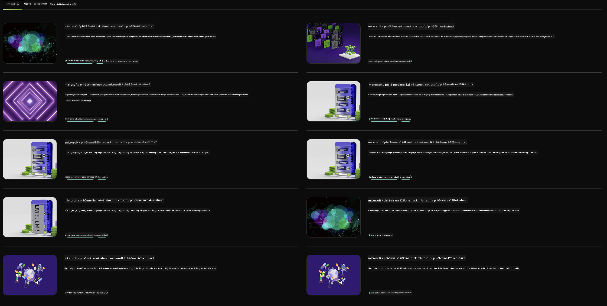

<!--
CO_OP_TRANSLATOR_METADATA:
{
  "original_hash": "7b08e277df2a9307f861ae54bc30c772",
  "translation_date": "2025-05-09T09:56:26+00:00",
  "source_file": "md/01.Introduction/02/06.NVIDIA.md",
  "language_code": "fi"
}
-->
## Phi-perhe NVIDIA NIM:ssä

NVIDIA NIM on joukko helppokäyttöisiä mikropalveluita, jotka on suunniteltu nopeuttamaan generatiivisten tekoälymallien käyttöönottoa pilvessä, datakeskuksissa ja työasemilla. NIMit on jaoteltu malliperheiden ja yksittäisten mallien mukaan. Esimerkiksi NVIDIA NIM suurille kielimalleille (LLM) tuo huippuluokan LLM-mallien voiman yrityssovelluksiin tarjoten vertaansa vailla olevat luonnollisen kielen käsittelyn ja ymmärtämisen ominaisuudet.

NIM helpottaa IT- ja DevOps-tiimejä itse isännöimään suuria kielimalleja omissa hallinnoiduissa ympäristöissään samalla kun se tarjoaa kehittäjille alan standardin mukaiset API:t, joiden avulla he voivat rakentaa tehokkaita avustajia, chatboteja ja tekoälyavustajia, jotka voivat muuttaa liiketoimintaa. Hyödyntämällä NVIDIAn huippuluokan GPU-kiihdytystä ja skaalautuvaa käyttöönottoa, NIM tarjoaa nopeimman polun päätelaskentaan vertaansa vailla olevalla suorituskyvyllä.

Voit käyttää NVIDIA NIM:iä Phi-perheen mallien päätelaskentaan



### **Esimerkit - Phi-3-Vision NVIDIA NIM:ssä**

Kuvittele, että sinulla on kuva (`demo.png`) ja haluat luoda Python-koodin, joka käsittelee tätä kuvaa ja tallentaa siitä uuden version (`phi-3-vision.jpg`).

Yllä oleva koodi automatisoi tämän prosessin seuraavasti:

1. Ympäristön ja tarvittavien asetusten määrittäminen.
2. Kehotteen luominen, joka ohjeistaa mallia generoimaan tarvittava Python-koodi.
3. Kehotteen lähettäminen mallille ja generoitu koodi kerätään.
4. Generoidun koodin poimiminen ja suorittaminen.
5. Alkuperäisen ja käsitellyn kuvan näyttäminen.

Tämä lähestymistapa hyödyntää tekoälyn voimaa kuvankäsittelytehtävien automatisointiin, tehden tavoitteiden saavuttamisesta helpompaa ja nopeampaa.

[Sample Code Solution](../../../../../code/06.E2E/E2E_Nvidia_NIM_Phi3_Vision.ipynb)

Käydään läpi, mitä koko koodi tekee vaihe vaiheelta:

1. **Asenna tarvittava paketti**:  
    ```python
    !pip install langchain_nvidia_ai_endpoints -U
    ```  
    Tämä komento asentaa `langchain_nvidia_ai_endpoints`-paketin varmistaen, että käytössä on uusin versio.

2. **Tuo tarvittavat moduulit**:  
    ```python
    from langchain_nvidia_ai_endpoints import ChatNVIDIA
    import getpass
    import os
    import base64
    ```  
    Nämä tuonnit sisältävät moduulit, joita tarvitaan NVIDIA AI -päätepisteiden kanssa työskentelyyn, salasanojen turvalliseen käsittelyyn, käyttöjärjestelmän kanssa vuorovaikuttamiseen sekä base64-muotoisen datan koodaamiseen ja dekoodaamiseen.

3. **Aseta API-avain**:  
    ```python
    if not os.getenv("NVIDIA_API_KEY"):
        os.environ["NVIDIA_API_KEY"] = getpass.getpass("Enter your NVIDIA API key: ")
    ```  
    Tämä koodi tarkistaa, onko ympäristömuuttuja `NVIDIA_API_KEY` asetettu. Jos ei, käyttäjältä pyydetään API-avain turvallisesti.

4. **Määritä malli ja kuvatiedoston polku**:  
    ```python
    model = 'microsoft/phi-3-vision-128k-instruct'
    chat = ChatNVIDIA(model=model)
    img_path = './imgs/demo.png'
    ```  
    Tässä asetetaan käytettävä malli, luodaan `ChatNVIDIA`-instanssi määritetyllä mallilla ja määritellään kuvatiedoston polku.

5. **Luo tekstikehote**:  
    ```python
    text = "Please create Python code for image, and use plt to save the new picture under imgs/ and name it phi-3-vision.jpg."
    ```  
    Tässä määritellään tekstikehote, joka ohjeistaa mallia generoimaan Python-koodin kuvan käsittelyyn.

6. **Koodaa kuva base64-muotoon**:  
    ```python
    with open(img_path, "rb") as f:
        image_b64 = base64.b64encode(f.read()).decode()
    image = f''
    ```  
    Tämä koodi lukee kuvatiedoston, koodaa sen base64-muotoon ja luo HTML-kuvatagin koodatulla datalla.

7. **Yhdistä teksti ja kuva kehoteeksi**:  
    ```python
    prompt = f"{text} {image}"
    ```  
    Tämä yhdistää tekstikehotteen ja HTML-kuvatagin yhdeksi merkkijonoksi.

8. **Generoi koodi ChatNVIDIA:n avulla**:  
    ```python
    code = ""
    for chunk in chat.stream(prompt):
        print(chunk.content, end="")
        code += chunk.content
    ```  
    Tämä koodi lähettää kehotteen `ChatNVIDIA`-oliolle ja tallentaa saadun koodin merkkijonona.

9. **Poimi Python-koodi generoidusta sisällöstä**:  
    ```python
    begin = code.index('```python') + 9  
    code = code[begin:]  
    end = code.index('```')
    code = code[:end]
    ```  
    Tämä poimii varsinaisen Python-koodin generoidusta sisällöstä poistamalla markdown-muotoilun.

10. **Suorita generoitu koodi**:  
    ```python
    import subprocess
    result = subprocess.run(["python", "-c", code], capture_output=True)
    ```  
    Tämä suorittaa poimitun Python-koodin aliprosessina ja tallentaa sen tulosteen.

11. **Näytä kuvat**:  
    ```python
    from IPython.display import Image, display
    display(Image(filename='./imgs/phi-3-vision.jpg'))
    display(Image(filename='./imgs/demo.png'))
    ```  
    Nämä rivit näyttävät kuvat `IPython.display`-moduulin avulla.

**Vastuuvapauslauseke**:  
Tämä asiakirja on käännetty käyttämällä tekoälypohjaista käännöspalvelua [Co-op Translator](https://github.com/Azure/co-op-translator). Vaikka pyrimme tarkkuuteen, ole hyvä ja huomioi, että automaattikäännöksissä saattaa esiintyä virheitä tai epätarkkuuksia. Alkuperäistä asiakirjaa sen alkuperäiskielellä tulee pitää ensisijaisena lähteenä. Tärkeissä tiedoissa suositellaan ammattimaista ihmiskäännöstä. Emme ole vastuussa tämän käännöksen käytöstä johtuvista väärinymmärryksistä tai virhetulkinnoista.