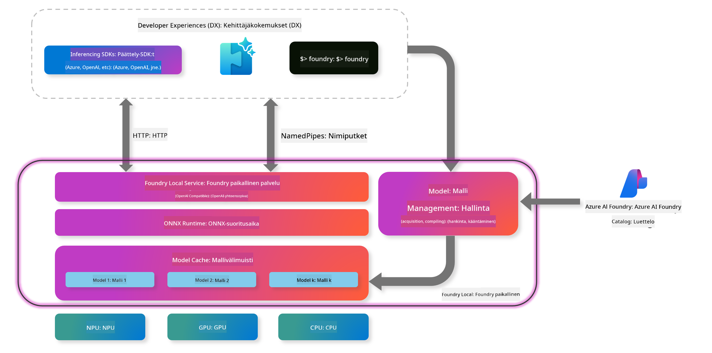
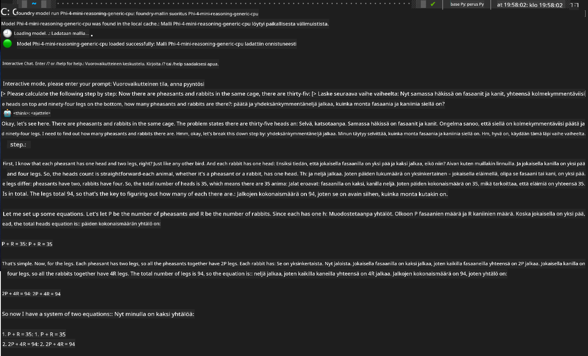

<!--
CO_OP_TRANSLATOR_METADATA:
{
  "original_hash": "52973a5680a65a810aa80b7036afd31f",
  "translation_date": "2025-07-16T19:48:07+00:00",
  "source_file": "md/01.Introduction/02/07.FoundryLocal.md",
  "language_code": "fi"
}
-->
## Aloittaminen Phi-Family-mallien kanssa Foundry Localissa

### Johdanto Foundry Localiin

Foundry Local on tehokas paikallinen tekoälyn inferenssiratkaisu, joka tuo yritystason tekoälyominaisuudet suoraan omaan laitteeseesi. Tässä opetusohjelmassa käydään läpi Phi-Family-mallien käyttöönotto ja käyttö Foundry Localin kanssa, tarjoten sinulle täyden hallinnan tekoälykuormiesi suhteen samalla kun säilytät yksityisyyden ja vähennät kustannuksia.

Foundry Local tarjoaa suorituskykyä, yksityisyyttä, räätälöitävyyttä ja kustannusetuja ajamalla tekoälymalleja paikallisesti laitteellasi. Se integroituu saumattomasti olemassa oleviin työnkulkuihisi ja sovelluksiisi intuitiivisen CLI:n, SDK:n ja REST-rajapinnan kautta.




### Miksi valita Foundry Local?

Foundry Localin etujen ymmärtäminen auttaa sinua tekemään perusteltuja päätöksiä tekoälyn käyttöönotossa:

- **Paikallinen inferenssi:** Suorita mallit omalla laitteistollasi, mikä vähentää kustannuksia ja pitää kaikki datasi laitteellasi.

- **Mallin räätälöinti:** Valitse valmiista malleista tai käytä omia mallejasi täyttämään erityiset vaatimukset ja käyttötapaukset.

- **Kustannustehokkuus:** Poista toistuvat pilvipalvelukustannukset käyttämällä olemassa olevaa laitteistoasi, tehden tekoälystä helpommin saavutettavaa.

- **Saumaton integraatio:** Yhdistä sovelluksiisi SDK:n, API-päätepisteiden tai CLI:n kautta, ja skaalaa helposti Azure AI Foundryyn tarpeidesi kasvaessa.

> **Aloitusmuistutus:** Tämä opas keskittyy Foundry Localin käyttöön CLI- ja SDK-rajapintojen kautta. Opit molemmat tavat, jotta voit valita parhaan menetelmän omaan käyttötarkoitukseesi.

## Osa 1: Foundry Local CLI:n käyttöönotto

### Vaihe 1: Asennus

Foundry Local CLI on porttisi hallita ja ajaa tekoälymalleja paikallisesti. Aloitetaan asentamalla se järjestelmääsi.

**Tuetut alustat:** Windows ja macOS

Yksityiskohtaiset asennusohjeet löydät [virallisesta Foundry Local -dokumentaatiosta](https://github.com/microsoft/Foundry-Local/blob/main/README.md).

### Vaihe 2: Saatavilla olevien mallien tutkiminen

Kun Foundry Local CLI on asennettu, voit tutkia, mitä malleja on käytettävissä käyttötarkoitukseesi. Tämä komento näyttää kaikki tuetut mallit:


```bash
foundry model list
```

### Vaihe 3: Phi Family -mallien ymmärtäminen

Phi Family tarjoaa erilaisia malleja, jotka on optimoitu eri käyttötarkoituksiin ja laitteistokokoonpanoihin. Tässä ovat Foundry Localissa saatavilla olevat Phi-mallit:

**Saatavilla olevat Phi-mallit:** 

- **phi-3.5-mini** - Kompakti malli perustoimiin
- **phi-3-mini-128k** - Laajennettu konteksti pidempiin keskusteluihin
- **phi-3-mini-4k** - Vakio kontekstimalli yleiskäyttöön
- **phi-4** - Kehittynyt malli parannetuilla ominaisuuksilla
- **phi-4-mini** - Kevyt versio Phi-4:stä
- **phi-4-mini-reasoning** - Erikoistunut monimutkaisiin päättelytehtäviin

> **Laitteistoyhteensopivuus:** Jokainen malli voidaan konfiguroida eri laitteistokiihdytyksille (CPU, GPU) järjestelmäsi ominaisuuksien mukaan.

### Vaihe 4: Ensimmäisen Phi-mallin ajaminen

Aloitetaan käytännön esimerkillä. Ajamme `phi-4-mini-reasoning`-mallin, joka on erinomainen monimutkaisten ongelmien vaiheittaisessa ratkaisemisessa.


**Komento mallin ajamiseen:**

```bash
foundry model run Phi-4-mini-reasoning-generic-cpu
```

> **Ensiasennus:** Kun ajat mallia ensimmäistä kertaa, Foundry Local lataa sen automaattisesti paikalliselle laitteellesi. Latausaika vaihtelee verkkoyhteytesi nopeuden mukaan, joten ole kärsivällinen alkuvaiheessa.

### Vaihe 5: Mallin testaaminen todellisella ongelmalla

Testataan nyt mallia klassisella logiikkaongelmalla nähdäksesi, miten se suorittaa vaiheittaista päättelyä:

**Esimerkkiongelma:**

```txt
Please calculate the following step by step: Now there are pheasants and rabbits in the same cage, there are thirty-five heads on top and ninety-four legs on the bottom, how many pheasants and rabbits are there?
```

**Odotettu toiminta:** Mallin tulisi pilkkoa ongelma loogisiin vaiheisiin käyttäen tietoa, että fasaanilla on 2 jalkaa ja kanilla 4 jalkaa, ratkaistakseen yhtälöryhmän.

**Tulokset:**



## Osa 2: Sovellusten rakentaminen Foundry Local SDK:lla

### Miksi käyttää SDK:ta?

Vaikka CLI sopii hyvin testaamiseen ja nopeisiin vuorovaikutuksiin, SDK mahdollistaa Foundry Localin ohjelmallisen integroinnin sovelluksiisi. Tämä avaa mahdollisuuksia:

- Räätälöityjen tekoälypohjaisten sovellusten rakentamiseen
- Automaattisten työnkulkujen luomiseen
- Tekoälyominaisuuksien integrointiin olemassa oleviin järjestelmiin
- Chatbottien ja interaktiivisten työkalujen kehittämiseen

### Tuetut ohjelmointikielet

Foundry Local tarjoaa SDK-tukea useille ohjelmointikielille, jotta voit valita kehitysympäristöösi sopivimman:

**📦 Saatavilla olevat SDK:t:**

- **C# (.NET):** [SDK-dokumentaatio ja esimerkit](https://github.com/microsoft/Foundry-Local/tree/main/sdk/cs)
- **Python:** [SDK-dokumentaatio ja esimerkit](https://github.com/microsoft/Foundry-Local/tree/main/sdk/python)
- **JavaScript:** [SDK-dokumentaatio ja esimerkit](https://github.com/microsoft/Foundry-Local/tree/main/sdk/js)
- **Rust:** [SDK-dokumentaatio ja esimerkit](https://github.com/microsoft/Foundry-Local/tree/main/sdk/rust)

### Seuraavat askeleet

1. **Valitse haluamasi SDK** kehitysympäristösi mukaan
2. **Seuraa SDK-kohtaisia dokumentaatioita** yksityiskohtaisia toteutusohjeita varten
3. **Aloita yksinkertaisista esimerkeistä** ennen monimutkaisten sovellusten rakentamista
4. **Tutustu esimerkkikoodeihin** kunkin SDK:n repositoriossa

## Yhteenveto

Olet nyt oppinut:
- ✅ Asentamaan ja ottamaan käyttöön Foundry Local CLI:n
- ✅ Löytämään ja ajamaan Phi Family -malleja
- ✅ Testaamaan malleja todellisilla ongelmilla
- ✅ Ymmärtämään SDK-vaihtoehdot sovelluskehitykseen

Foundry Local tarjoaa vahvan pohjan tekoälyominaisuuksien tuomiseksi suoraan paikalliseen ympäristöösi, antaen sinulle hallinnan suorituskyvystä, yksityisyydestä ja kustannuksista samalla kun säilytät joustavuuden skaalata pilviratkaisuihin tarpeen mukaan.

**Vastuuvapauslauseke**:  
Tämä asiakirja on käännetty käyttämällä tekoälypohjaista käännöspalvelua [Co-op Translator](https://github.com/Azure/co-op-translator). Vaikka pyrimme tarkkuuteen, huomioithan, että automaattikäännöksissä saattaa esiintyä virheitä tai epätarkkuuksia. Alkuperäistä asiakirjaa sen alkuperäiskielellä tulee pitää virallisena lähteenä. Tärkeissä tiedoissa suositellaan ammattimaista ihmiskäännöstä. Emme ole vastuussa tämän käännöksen käytöstä aiheutuvista väärinymmärryksistä tai tulkinnoista.