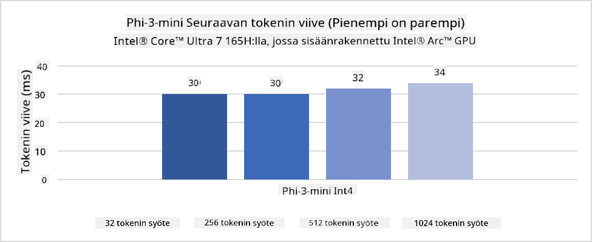
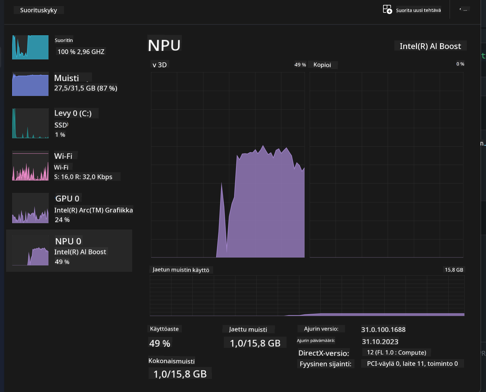
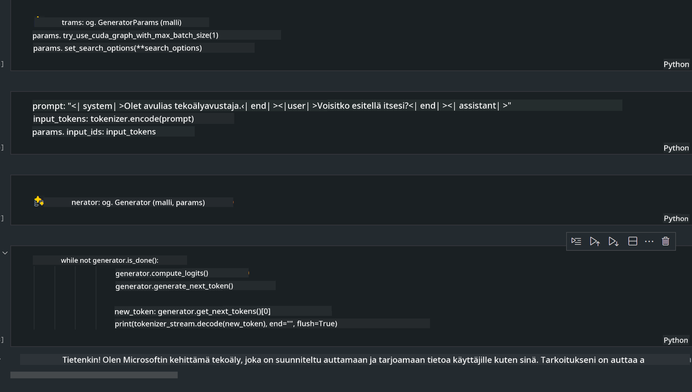
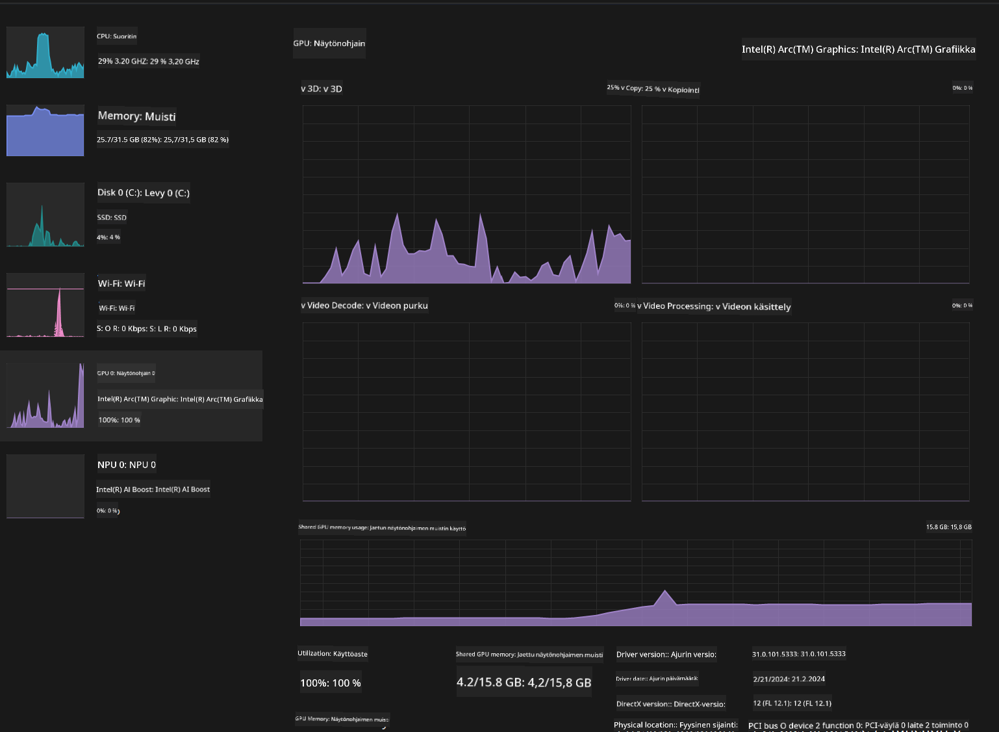

<!--
CO_OP_TRANSLATOR_METADATA:
{
  "original_hash": "e08ce816e23ad813244a09ca34ebb8ac",
  "translation_date": "2025-07-16T20:03:26+00:00",
  "source_file": "md/01.Introduction/03/AIPC_Inference.md",
  "language_code": "fi"
}
-->
# **Phi-3-päätelmä AI-PC:ssä**

Generatiivisen tekoälyn kehittymisen ja reunalaitteiden laitteistokapasiteetin parantumisen myötä yhä useammat generatiiviset tekoälymallit voidaan nyt integroida käyttäjien omiin BYOD-laitteisiin. AI-PC:t ovat näiden mallien joukossa. Vuodesta 2024 alkaen Intel, AMD ja Qualcomm ovat tehneet yhteistyötä PC-valmistajien kanssa tuodakseen markkinoille AI-PC:t, jotka mahdollistavat paikallisten generatiivisten tekoälymallien käyttöönoton laitteistomuutosten avulla. Tässä keskustelussa keskitymme Intelin AI-PC:ihin ja tarkastelemme, miten Phi-3 otetaan käyttöön Intel AI-PC:ssä.

### Mikä on NPU

NPU (Neural Processing Unit) on erillinen prosessori tai prosessointiyksikkö suuremmassa SoC:ssa, joka on suunniteltu erityisesti hermoverkkojen toimintojen ja tekoälytehtävien kiihdyttämiseen. Toisin kuin yleiskäyttöiset CPU:t ja GPU:t, NPU:t on optimoitu datalähtöiseen rinnakkaislaskentaan, mikä tekee niistä erittäin tehokkaita käsittelemään suuria multimedia-aineistoja, kuten videoita ja kuvia, sekä hermoverkkojen datankäsittelyä. Ne soveltuvat erityisen hyvin tekoälyyn liittyviin tehtäviin, kuten puheentunnistukseen, taustan sumennukseen videopuheluissa sekä valokuva- tai videonmuokkausprosesseihin, kuten kohteiden tunnistukseen.

## NPU vs GPU

Vaikka monet tekoäly- ja koneoppimistehtävät ajetaan GPU:illa, GPU:iden ja NPU:iden välillä on tärkeä ero.
GPU:t tunnetaan rinnakkaislaskentakyvystään, mutta kaikki GPU:t eivät ole yhtä tehokkaita graafisen käsittelyn ulkopuolella. NPU:t sen sijaan on suunniteltu monimutkaisiin hermoverkkojen laskutoimituksiin, mikä tekee niistä erittäin tehokkaita tekoälytehtävissä.

Yhteenvetona: NPU:t ovat matemaattisia neroja, jotka kiihdyttävät tekoälyn laskentaa, ja ne ovat keskeisessä roolissa nousevassa AI-PC-aikakaudessa!

***Tämä esimerkki perustuu Intelin uusimpaan Intel Core Ultra -prosessoriin***

## **1. Käytä NPU:ta Phi-3-mallin ajamiseen**

Intel® NPU-laite on tekoälyn päätelmäkiihdytin, joka on integroitu Intelin asiakasprosessoreihin alkaen Intel® Core™ Ultra -sukupolvesta (entinen Meteor Lake). Se mahdollistaa energiatehokkaan keinotekoisten hermoverkkojen tehtävien suorittamisen.




**Intel NPU Acceleration Library**

Intel NPU Acceleration Library [https://github.com/intel/intel-npu-acceleration-library](https://github.com/intel/intel-npu-acceleration-library) on Python-kirjasto, joka on suunniteltu parantamaan sovellustesi tehokkuutta hyödyntämällä Intel Neural Processing Unitin (NPU) laskentatehoa yhteensopivalla laitteistolla.

Esimerkki Phi-3-ministä AI-PC:llä, jossa on Intel® Core™ Ultra -prosessori.


Asenna Python-kirjasto pipillä

```bash

   pip install intel-npu-acceleration-library

```

***Huom*** Projekti on vielä kehitysvaiheessa, mutta referenssimalli on jo hyvin kattava.

### **Phi-3:n ajaminen Intel NPU Acceleration Librarylla**

Intel NPU -kiihdytyksen avulla tämä kirjasto ei vaikuta perinteiseen koodausprosessiin. Tarvitset vain tämän kirjaston alkuperäisen Phi-3-mallin kvantisointiin, kuten FP16, INT8, INT4, esimerkiksi

```python
from transformers import AutoTokenizer, pipeline,TextStreamer
from intel_npu_acceleration_library import NPUModelForCausalLM, int4
from intel_npu_acceleration_library.compiler import CompilerConfig
import warnings

model_id = "microsoft/Phi-3-mini-4k-instruct"

compiler_conf = CompilerConfig(dtype=int4)
model = NPUModelForCausalLM.from_pretrained(
    model_id, use_cache=True, config=compiler_conf, attn_implementation="sdpa"
).eval()

tokenizer = AutoTokenizer.from_pretrained(model_id)

text_streamer = TextStreamer(tokenizer, skip_prompt=True)
```

Kun kvantisointi onnistuu, jatka suorittamista kutsumalla NPU:ta ajamaan Phi-3-mallia.

```python
generation_args = {
   "max_new_tokens": 1024,
   "return_full_text": False,
   "temperature": 0.3,
   "do_sample": False,
   "streamer": text_streamer,
}

pipe = pipeline(
   "text-generation",
   model=model,
   tokenizer=tokenizer,
)

query = "<|system|>You are a helpful AI assistant.<|end|><|user|>Can you introduce yourself?<|end|><|assistant|>"

with warnings.catch_warnings():
    warnings.simplefilter("ignore")
    pipe(query, **generation_args)
```

Koodia suoritettaessa voimme tarkastella NPU:n toimintatilaa Tehtävienhallinnan kautta



***Esimerkit*** : [AIPC_NPU_DEMO.ipynb](../../../../../code/03.Inference/AIPC/AIPC_NPU_DEMO.ipynb)

## **2. Käytä DirectML + ONNX Runtimea Phi-3-mallin ajamiseen**

### **Mikä on DirectML**

[DirectML](https://github.com/microsoft/DirectML) on suorituskykyinen, laitteistokiihdytetty DirectX 12 -kirjasto koneoppimiseen. DirectML tarjoaa GPU-kiihdytyksen yleisille koneoppimistehtäville laajalla tuettujen laitteistojen ja ajureiden valikoimalla, mukaan lukien kaikki DirectX 12 -yhteensopivat GPU:t valmistajilta kuten AMD, Intel, NVIDIA ja Qualcomm.

Itsenäisesti käytettynä DirectML API on matalan tason DirectX 12 -kirjasto, joka sopii korkean suorituskyvyn ja pienen viiveen sovelluksiin, kuten kehyskirjastoihin, peleihin ja muihin reaaliaikaisiin sovelluksiin. DirectML:n saumaton yhteensopivuus Direct3D 12:n kanssa sekä sen pieni ylikuorma ja laitteistojen välinen yhdenmukaisuus tekevät siitä ihanteellisen koneoppimisen kiihdyttämiseen, kun halutaan sekä korkea suorituskyky että luotettavat ja ennustettavat tulokset eri laitteistoilla.

***Huom*** : Uusin DirectML tukee jo NPU:ta (https://devblogs.microsoft.com/directx/introducing-neural-processor-unit-npu-support-in-directml-developer-preview/)

### DirectML ja CUDA ominaisuuksien ja suorituskyvyn näkökulmasta:

**DirectML** on Microsoftin kehittämä koneoppimiskirjasto. Se on suunniteltu kiihdyttämään koneoppimistehtäviä Windows-laitteilla, mukaan lukien pöytäkoneet, kannettavat ja reunalaitteet.
- DX12-pohjainen: DirectML rakentuu DirectX 12:n (DX12) päälle, joka tarjoaa laajan laitteistotuen GPU:ille, mukaan lukien sekä NVIDIA että AMD.
- Laajempi tuki: Koska se hyödyntää DX12:ta, DirectML toimii minkä tahansa DX12-yhteensopivan GPU:n kanssa, myös integroitujen GPU:iden.
- Kuvankäsittely: DirectML käsittelee kuvia ja muuta dataa hermoverkkojen avulla, joten se sopii tehtäviin kuten kuvantunnistus, kohteiden tunnistus ja muut.
- Helppo käyttöönotto: DirectML:n käyttöönotto on suoraviivaista, eikä se vaadi erityisiä SDK:ita tai kirjastoja GPU-valmistajilta.
- Suorituskyky: Joissain tapauksissa DirectML toimii hyvin ja voi olla nopeampi kuin CUDA, erityisesti tietyissä työkuormissa.
- Rajoitukset: Toisaalta DirectML voi olla hitaampi, erityisesti float16-muotoisissa suurissa erissä.

**CUDA** on NVIDIAn rinnakkaislaskenta-alusta ja ohjelmointimalli. Se antaa kehittäjille mahdollisuuden hyödyntää NVIDIA GPU:iden tehoa yleiskäyttöiseen laskentaan, mukaan lukien koneoppiminen ja tieteelliset simulaatiot.
- NVIDIA-spesifinen: CUDA on tiiviisti integroitu NVIDIA GPU:ihin ja suunniteltu nimenomaan niille.
- Erittäin optimoitu: Se tarjoaa erinomaisen suorituskyvyn GPU-kiihdytetyissä tehtävissä, erityisesti NVIDIA GPU:illa.
- Laajasti käytetty: Monet koneoppimiskehykset ja kirjastot (kuten TensorFlow ja PyTorch) tukevat CUDA:ta.
- Räätälöitävyys: Kehittäjät voivat hienosäätää CUDA-asetuksia tiettyihin tehtäviin, mikä voi johtaa optimaaliseen suorituskykyyn.
- Rajoitukset: CUDA:n riippuvuus NVIDIA-laitteistosta voi olla rajoittava, jos halutaan laajempi yhteensopivuus eri GPU:iden kanssa.

### Valinta DirectML:n ja CUDA:n välillä

Valinta DirectML:n ja CUDA:n välillä riippuu käyttötapauksestasi, laitteistosta ja mieltymyksistäsi.
Jos haluat laajemman yhteensopivuuden ja helpon käyttöönoton, DirectML voi olla hyvä valinta. Jos sinulla on NVIDIA GPU:t ja tarvitset erittäin optimoitua suorituskykyä, CUDA on edelleen vahva vaihtoehto. Yhteenvetona molemmilla on omat vahvuutensa ja heikkoutensa, joten harkitse tarpeitasi ja käytettävissä olevaa laitteistoa päätöstä tehdessäsi.

### **Generatiivinen tekoäly ONNX Runtime -ympäristössä**

Tekoälyn aikakaudella mallien siirrettävyys on erittäin tärkeää. ONNX Runtime mahdollistaa koulutettujen mallien helpon käyttöönoton eri laitteilla. Kehittäjien ei tarvitse huolehtia päätelmäkehyksestä, vaan he voivat käyttää yhtenäistä API:a mallin päätelmään. Generatiivisen tekoälyn aikakaudella ONNX Runtime on myös optimoitu koodin suorituskyvyn parantamiseksi (https://onnxruntime.ai/docs/genai/). Optimoidun ONNX Runtime -ympäristön avulla kvantisoitu generatiivinen tekoälymalli voidaan ajaa eri päätelaitteilla. Generatiivisen tekoälyn kanssa ONNX Runtime tarjoaa API:n Pythonille, C#:lle, C/C++:lle. Tietysti iPhonella käyttöönotto voi hyödyntää C++:n Generative AI with ONNX Runtime -API:a.

[Esimerkkikoodi](https://github.com/Azure-Samples/Phi-3MiniSamples/tree/main/onnx)

***Käännä generatiivisen tekoälyn ONNX Runtime -kirjasto***

```bash

winget install --id=Kitware.CMake  -e

git clone https://github.com/microsoft/onnxruntime.git

cd .\onnxruntime\

./build.bat --build_shared_lib --skip_tests --parallel --use_dml --config Release

cd ../

git clone https://github.com/microsoft/onnxruntime-genai.git

cd .\onnxruntime-genai\

mkdir ort

cd ort

mkdir include

mkdir lib

copy ..\onnxruntime\include\onnxruntime\core\providers\dml\dml_provider_factory.h ort\include

copy ..\onnxruntime\include\onnxruntime\core\session\onnxruntime_c_api.h ort\include

copy ..\onnxruntime\build\Windows\Release\Release\*.dll ort\lib

copy ..\onnxruntime\build\Windows\Release\Release\onnxruntime.lib ort\lib

python build.py --use_dml


```

**Asenna kirjasto**

```bash

pip install .\onnxruntime_genai_directml-0.3.0.dev0-cp310-cp310-win_amd64.whl

```

Tässä ajon tulos



***Esimerkit*** : [AIPC_DirectML_DEMO.ipynb](../../../../../code/03.Inference/AIPC/AIPC_DirectML_DEMO.ipynb)

## **3. Käytä Intel OpenVinoa Phi-3-mallin ajamiseen**

### **Mikä on OpenVINO**

[OpenVINO](https://github.com/openvinotoolkit/openvino) on avoimen lähdekoodin työkalu syväoppimismallien optimointiin ja käyttöönottoon. Se tarjoaa parannetun suorituskyvyn näkö-, ääni- ja kielimalleille suosituista kehyksistä kuten TensorFlow, PyTorch ja muista. Aloita OpenVINO:n käyttö. OpenVINOa voidaan käyttää myös yhdessä CPU:n ja GPU:n kanssa Phi-3-mallin ajamiseen.

***Huom***: Tällä hetkellä OpenVINO ei tue NPU:ta.

### **Asenna OpenVINO-kirjasto**

```bash

 pip install git+https://github.com/huggingface/optimum-intel.git

 pip install git+https://github.com/openvinotoolkit/nncf.git

 pip install openvino-nightly

```

### **Phi-3:n ajaminen OpenVINOlla**

Kuten NPU:n kanssa, OpenVINO suorittaa generatiivisten tekoälymallien kutsun ajamalla kvantisoituja malleja. Meidän täytyy ensin kvantisoida Phi-3-malli ja suorittaa mallin kvantisointi komentoriviltä optimum-cli:n avulla.

**INT4**

```bash

optimum-cli export openvino --model "microsoft/Phi-3-mini-4k-instruct" --task text-generation-with-past --weight-format int4 --group-size 128 --ratio 0.6  --sym  --trust-remote-code ./openvinomodel/phi3/int4

```

**FP16**

```bash

optimum-cli export openvino --model "microsoft/Phi-3-mini-4k-instruct" --task text-generation-with-past --weight-format fp16 --trust-remote-code ./openvinomodel/phi3/fp16

```

Muunnettu formaatti näyttää tältä


Lataa mallin polut (model_dir), siihen liittyvät asetukset (ov_config = {"PERFORMANCE_HINT": "LATENCY", "NUM_STREAMS": "1", "CACHE_DIR": ""}) ja laitteistokiihdytetyt laitteet (GPU.0) OVModelForCausalLM:n kautta

```python

ov_model = OVModelForCausalLM.from_pretrained(
     model_dir,
     device='GPU.0',
     ov_config=ov_config,
     config=AutoConfig.from_pretrained(model_dir, trust_remote_code=True),
     trust_remote_code=True,
)

```

Koodia suoritettaessa voimme tarkastella GPU:n toimintatilaa Tehtävienhallinnan kautta



***Esimerkit*** : [AIPC_OpenVino_Demo.ipynb](../../../../../code/03.Inference/AIPC/AIPC_OpenVino_Demo.ipynb)

### ***Huom*** : Edellä mainituilla kolmella menetelmällä on omat etunsa, mutta AI-PC:n päätelmässä suositellaan NPU-kiihdytystä.

**Vastuuvapauslauseke**:  
Tämä asiakirja on käännetty käyttämällä tekoälypohjaista käännöspalvelua [Co-op Translator](https://github.com/Azure/co-op-translator). Vaikka pyrimme tarkkuuteen, huomioithan, että automaattikäännöksissä saattaa esiintyä virheitä tai epätarkkuuksia. Alkuperäistä asiakirjaa sen alkuperäiskielellä tulee pitää virallisena lähteenä. Tärkeissä tiedoissa suositellaan ammattimaista ihmiskäännöstä. Emme ole vastuussa tämän käännöksen käytöstä aiheutuvista väärinymmärryksistä tai tulkinnoista.