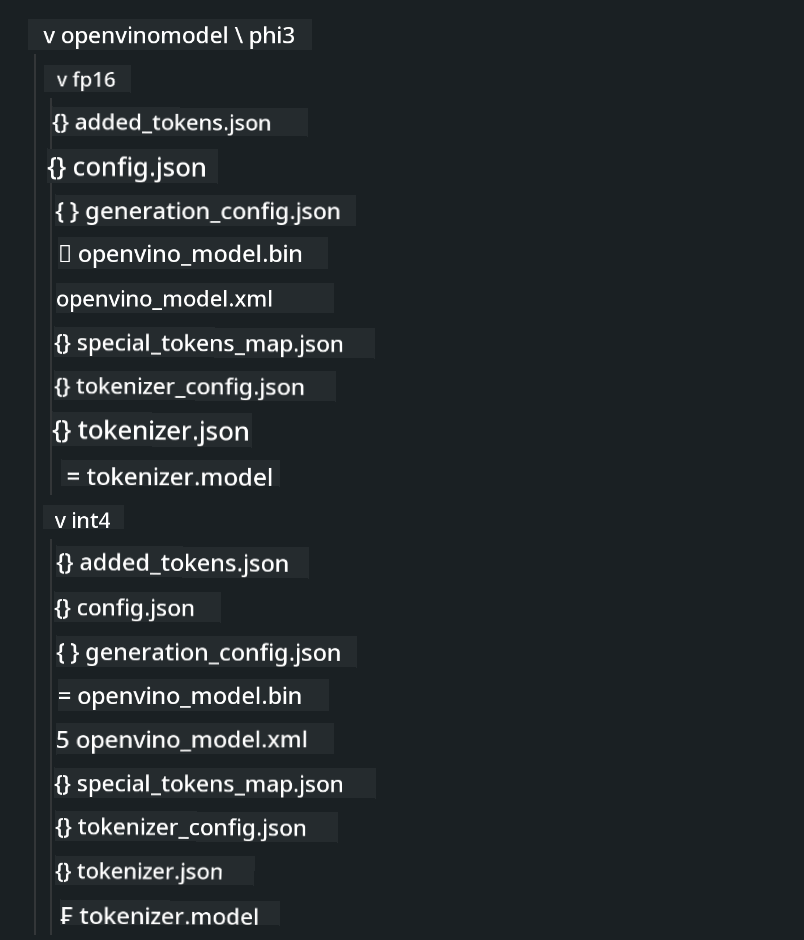

<!--
CO_OP_TRANSLATOR_METADATA:
{
  "original_hash": "e08ce816e23ad813244a09ca34ebb8ac",
  "translation_date": "2025-05-09T10:22:51+00:00",
  "source_file": "md/01.Introduction/03/AIPC_Inference.md",
  "language_code": "fi"
}
-->
# **Phi-3-päätelmä AI-tietokoneessa**

Generatiivisen tekoälyn kehityksen ja reunalaitteiden laitteistokapasiteetin parantumisen myötä yhä useammat generatiiviset tekoälymallit voidaan nyt integroida käyttäjien omiin BYOD-laitteisiin. AI-tietokoneet ovat näiden mallien joukossa. Vuodesta 2024 lähtien Intel, AMD ja Qualcomm ovat tehneet yhteistyötä tietokonevalmistajien kanssa tuodakseen markkinoille AI-tietokoneita, jotka helpottavat paikallisten generatiivisten tekoälymallien käyttöönottoa laitteistomuutosten avulla. Tässä keskustelussa keskitymme Intelin AI-tietokoneisiin ja tutkimme, miten Phi-3 otetaan käyttöön Intelin AI-tietokoneessa.

### Mikä on NPU

NPU (Neural Processing Unit) on erikoistunut prosessori tai prosessointiyksikkö suuremmassa SoC:ssa, joka on suunniteltu erityisesti hermoverkkojen toimintojen ja tekoälytehtävien kiihdyttämiseen. Toisin kuin yleiskäyttöiset CPU:t ja GPU:t, NPU:t on optimoitu datavetoiseen rinnakkaislaskentaan, mikä tekee niistä erittäin tehokkaita käsittelemään suuria multimedia-aineistoja, kuten videoita ja kuvia, sekä prosessoimaan dataa hermoverkoille. Ne soveltuvat erityisesti tekoälytehtäviin, kuten puheentunnistukseen, taustan sumentamiseen videopuheluissa ja valokuva- tai videoeditointiprosesseihin, kuten kohteiden tunnistukseen.

## NPU vs GPU

Vaikka monet tekoäly- ja koneoppimistehtävät ajetaan GPU:lla, GPU:iden ja NPU:iden välillä on tärkeä ero.
GPU:t tunnetaan rinnakkaislaskentakyvyistään, mutta kaikki GPU:t eivät ole yhtä tehokkaita graafisen prosessoinnin ulkopuolella. NPU:t sen sijaan on suunniteltu monimutkaisiin laskutoimituksiin, joita hermoverkkojen toiminnot vaativat, mikä tekee niistä erittäin tehokkaita tekoälytehtävissä.

Yhteenvetona: NPU:t ovat matemaattisia neroja, jotka kiihdyttävät tekoälyn laskentaa ja näyttelevät keskeistä roolia AI-tietokoneiden uudella aikakaudella!

***Tämä esimerkki perustuu Intelin uusimpaan Intel Core Ultra -suorittimeen***

## **1. Käytä NPU:ta Phi-3-mallin ajamiseen**

Intel® NPU-laite on tekoälyn päätelmäkiihdytin, joka on integroitu Intelin asiakas-CPU:ihin alkaen Intel® Core™ Ultra -sukupolvesta (entinen Meteor Lake). Se mahdollistaa energiatehokkaan keinotekoisten hermoverkkojen tehtävien suorittamisen.


**Intel NPU Acceleration Library**

Intel NPU Acceleration Library [https://github.com/intel/intel-npu-acceleration-library](https://github.com/intel/intel-npu-acceleration-library) on Python-kirjasto, joka on suunniteltu parantamaan sovellustesi tehokkuutta hyödyntämällä Intelin Neural Processing Unitin (NPU) laskentatehoa yhteensopivalla laitteistolla.

Esimerkki Phi-3-mini -mallista AI-tietokoneessa, jota pyörittävät Intel® Core™ Ultra -suorittimet.


Asenna Python-kirjasto pipillä

```bash

   pip install intel-npu-acceleration-library

```

***Huom*** Projekti on vielä kehitysvaiheessa, mutta referenssimalli on jo hyvin kattava.

### **Phi-3:n ajaminen Intel NPU Acceleration Librarylla**

Intel NPU -kiihdytyksen avulla tämä kirjasto ei vaikuta perinteiseen koodausprosessiin. Tarvitset vain tämän kirjaston alkuperäisen Phi-3-mallin kvantisointiin, kuten FP16, INT8, INT4, esimerkiksi

```python
from transformers import AutoTokenizer, pipeline,TextStreamer
from intel_npu_acceleration_library import NPUModelForCausalLM, int4
from intel_npu_acceleration_library.compiler import CompilerConfig
import warnings

model_id = "microsoft/Phi-3-mini-4k-instruct"

compiler_conf = CompilerConfig(dtype=int4)
model = NPUModelForCausalLM.from_pretrained(
    model_id, use_cache=True, config=compiler_conf, attn_implementation="sdpa"
).eval()

tokenizer = AutoTokenizer.from_pretrained(model_id)

text_streamer = TextStreamer(tokenizer, skip_prompt=True)
```

Kun kvantisointi on onnistunut, jatka kutsumalla NPU:ta suorittamaan Phi-3-malli.

```python
generation_args = {
   "max_new_tokens": 1024,
   "return_full_text": False,
   "temperature": 0.3,
   "do_sample": False,
   "streamer": text_streamer,
}

pipe = pipeline(
   "text-generation",
   model=model,
   tokenizer=tokenizer,
)

query = "<|system|>You are a helpful AI assistant.<|end|><|user|>Can you introduce yourself?<|end|><|assistant|>"

with warnings.catch_warnings():
    warnings.simplefilter("ignore")
    pipe(query, **generation_args)
```

Koodia suoritettaessa voimme tarkastella NPU:n tilaa Tehtävienhallinnan kautta


***Esimerkit*** : [AIPC_NPU_DEMO.ipynb](../../../../../code/03.Inference/AIPC/AIPC_NPU_DEMO.ipynb)

## **2. Käytä DirectML + ONNX Runtimea Phi-3-mallin ajamiseen**

### **Mikä on DirectML**

[DirectML](https://github.com/microsoft/DirectML) on suorituskykyinen, laitteistokiihdytetty DirectX 12 -kirjasto koneoppimiseen. DirectML tarjoaa GPU-kiihdytyksen yleisille koneoppimistehtäville laajalla valikoimalla tuettuja laitteistoja ja ajureita, mukaan lukien kaikki DirectX 12 -yhteensopivat GPU:t valmistajilta kuten AMD, Intel, NVIDIA ja Qualcomm.

Kun sitä käytetään itsenäisesti, DirectML API on matalan tason DirectX 12 -kirjasto, joka sopii korkean suorituskyvyn ja pienen viiveen sovelluksiin, kuten kehyksiin, peleihin ja muihin reaaliaikaisiin sovelluksiin. DirectML:n saumaton yhteensopivuus Direct3D 12:n kanssa sekä sen alhainen kuormitus ja laitteistojen välinen yhdenmukaisuus tekevät siitä ihanteellisen koneoppimisen kiihdyttämiseen silloin, kun halutaan sekä korkea suorituskyky että luotettavat ja ennustettavat tulokset eri laitteistoilla.

***Huom*** : Uusin DirectML tukee jo NPU:ta (https://devblogs.microsoft.com/directx/introducing-neural-processor-unit-npu-support-in-directml-developer-preview/)

### DirectML ja CUDA ominaisuuksien ja suorituskyvyn näkökulmasta:

**DirectML** on Microsoftin kehittämä koneoppimiskirjasto. Se on suunniteltu kiihdyttämään koneoppimistehtäviä Windows-laitteilla, mukaan lukien pöytäkoneet, kannettavat ja reunalaitteet.
- DX12-pohjainen: DirectML rakentuu DirectX 12:n (DX12) päälle, joka tarjoaa laajan laitteistotuen eri GPU:ille, mukaan lukien NVIDIA ja AMD.
- Laajempi tuki: Koska se hyödyntää DX12:ta, DirectML toimii kaikkien DX12-yhteensopivien GPU:iden kanssa, myös integroitujen GPU:iden.
- Kuvankäsittely: DirectML käsittelee kuvia ja muuta dataa hermoverkkojen avulla, joten se soveltuu tehtäviin kuten kuvantunnistus, kohteiden havaitseminen ja muut.
- Helppo käyttöönotto: DirectML:n käyttöönotto on suoraviivaista, eikä se vaadi erityisiä SDK:ita tai kirjastoja GPU-valmistajilta.
- Suorituskyky: Joissain tapauksissa DirectML toimii hyvin ja voi olla nopeampi kuin CUDA, erityisesti tietyissä työkuormissa.
- Rajoitukset: Toisaalta on tilanteita, joissa DirectML voi olla hitaampi, erityisesti float16-muotoisten suurten erien kanssa.

**CUDA** on NVIDIAn rinnakkaislaskenta-alusta ja ohjelmointimalli. Se antaa kehittäjille mahdollisuuden hyödyntää NVIDIA-GPU:iden tehoa yleiskäyttöiseen laskentaan, mukaan lukien koneoppiminen ja tieteelliset simulaatiot.
- NVIDIA-spesifinen: CUDA on tiiviisti integroitu NVIDIA-GPU:ihin ja suunniteltu erityisesti niille.
- Erittäin optimoitu: Se tarjoaa erinomaisen suorituskyvyn GPU-kiihdytetyille tehtäville, erityisesti NVIDIA-GPU:illa.
- Laajasti käytetty: Monet koneoppimiskehykset ja kirjastot (kuten TensorFlow ja PyTorch) tukevat CUDAa.
- Räätälöitävyys: Kehittäjät voivat hienosäätää CUDA-asetuksia tiettyihin tehtäviin, mikä voi johtaa optimaaliseen suorituskykyyn.
- Rajoitukset: CUDA:n riippuvuus NVIDIA-laitteistosta voi rajoittaa laajemman yhteensopivuuden halutessa eri GPU:iden kanssa.

### Valinta DirectML:n ja CUDA:n välillä

Valinta DirectML:n ja CUDA:n välillä riippuu käyttötapauksestasi, laitteistosta ja mieltymyksistäsi.
Jos tarvitset laajempaa yhteensopivuutta ja helppoa käyttöönottoa, DirectML voi olla hyvä valinta. Jos sinulla on NVIDIA-GPU ja tarvitset erittäin optimoitua suorituskykyä, CUDA on edelleen vahva vaihtoehto. Yhteenvetona molemmilla on vahvuutensa ja heikkoutensa, joten harkitse tarpeitasi ja käytettävissä olevaa laitteistoa päätöstä tehdessäsi.

### **Generatiivinen tekoäly ONNX Runtime -ympäristössä**

Tekoälyn aikakaudella AI-mallien siirrettävyys on erittäin tärkeää. ONNX Runtime mahdollistaa koulutettujen mallien helpon käyttöönoton eri laitteilla. Kehittäjien ei tarvitse huolehtia päätelmäkehyksestä, vaan he voivat käyttää yhtenäistä API:a mallin päätelmään. Generatiivisen tekoälyn aikakaudella ONNX Runtime on myös suorittanut koodin optimointia (https://onnxruntime.ai/docs/genai/). Optimoidun ONNX Runtime -ympäristön avulla kvantisoitu generatiivinen AI-malli voidaan ajaa eri päätelaitteilla. Generatiivisessa tekoälyssä ONNX Runtime avulla voit tehdä mallipäätelmiä Pythonilla, C#:lla, C/C++:lla. Tietysti iPhonella käyttöönotto voi hyödyntää C++:n Generative AI with ONNX Runtime API:a.

[Esimerkkikoodi](https://github.com/Azure-Samples/Phi-3MiniSamples/tree/main/onnx)

***Käännä generatiivisen tekoälyn ONNX Runtime -kirjasto***

```bash

winget install --id=Kitware.CMake  -e

git clone https://github.com/microsoft/onnxruntime.git

cd .\onnxruntime\

./build.bat --build_shared_lib --skip_tests --parallel --use_dml --config Release

cd ../

git clone https://github.com/microsoft/onnxruntime-genai.git

cd .\onnxruntime-genai\

mkdir ort

cd ort

mkdir include

mkdir lib

copy ..\onnxruntime\include\onnxruntime\core\providers\dml\dml_provider_factory.h ort\include

copy ..\onnxruntime\include\onnxruntime\core\session\onnxruntime_c_api.h ort\include

copy ..\onnxruntime\build\Windows\Release\Release\*.dll ort\lib

copy ..\onnxruntime\build\Windows\Release\Release\onnxruntime.lib ort\lib

python build.py --use_dml


```

**Asenna kirjasto**

```bash

pip install .\onnxruntime_genai_directml-0.3.0.dev0-cp310-cp310-win_amd64.whl

```

Tässä on ajon tulos


***Esimerkit*** : [AIPC_DirectML_DEMO.ipynb](../../../../../code/03.Inference/AIPC/AIPC_DirectML_DEMO.ipynb)

## **3. Käytä Intel OpenVinoa Phi-3-mallin ajamiseen**

### **Mikä on OpenVINO**

[OpenVINO](https://github.com/openvinotoolkit/openvino) on avoimen lähdekoodin työkalu syväoppimismallien optimointiin ja käyttöönottoon. Se tarjoaa parannetun syväoppimisen suorituskyvyn näkö-, ääni- ja kielimalleille suosituista kehyksistä kuten TensorFlow, PyTorch ja muut. Aloita OpenVINO:n käyttö. OpenVINO:a voi käyttää myös yhdessä CPU:n ja GPU:n kanssa Phi-3-mallin ajamiseen.

***Huom***: Tällä hetkellä OpenVINO ei tue NPU:ta.

### **Asenna OpenVINO-kirjasto**

```bash

 pip install git+https://github.com/huggingface/optimum-intel.git

 pip install git+https://github.com/openvinotoolkit/nncf.git

 pip install openvino-nightly

```

### **Phi-3:n ajaminen OpenVINO:lla**

Kuten NPU, OpenVINO suorittaa generatiivisten AI-mallien kutsut ajamalla kvantisoituja malleja. Meidän täytyy ensin kvantisoida Phi-3-malli ja suorittaa mallin kvantisointi komentoriviltä optimum-cli:n avulla.

**INT4**

```bash

optimum-cli export openvino --model "microsoft/Phi-3-mini-4k-instruct" --task text-generation-with-past --weight-format int4 --group-size 128 --ratio 0.6  --sym  --trust-remote-code ./openvinomodel/phi3/int4

```

**FP16**

```bash

optimum-cli export openvino --model "microsoft/Phi-3-mini-4k-instruct" --task text-generation-with-past --weight-format fp16 --trust-remote-code ./openvinomodel/phi3/fp16

```

Muunnettu muoto näyttää tältä



Lataa mallipolut (model_dir), asiaankuuluvat konfiguraatiot (ov_config = {"PERFORMANCE_HINT": "LATENCY", "NUM_STREAMS": "1", "CACHE_DIR": ""}) ja laitteistokiihdytetyt laitteet (GPU.0) OVModelForCausalLM:n kautta

```python

ov_model = OVModelForCausalLM.from_pretrained(
     model_dir,
     device='GPU.0',
     ov_config=ov_config,
     config=AutoConfig.from_pretrained(model_dir, trust_remote_code=True),
     trust_remote_code=True,
)

```

Koodia suoritettaessa voimme tarkastella GPU:n tilaa Tehtävienhallinnan kautta


***Esimerkit*** : [AIPC_OpenVino_Demo.ipynb](../../../../../code/03.Inference/AIPC/AIPC_OpenVino_Demo.ipynb)

### ***Huom*** : Edellä mainituilla kolmella menetelmällä on omat etunsa, mutta AI-tietokoneen päätelmään suositellaan NPU-kiihdytystä.

**Vastuuvapauslauseke**:  
Tämä asiakirja on käännetty käyttämällä tekoälypohjaista käännöspalvelua [Co-op Translator](https://github.com/Azure/co-op-translator). Vaikka pyrimme tarkkuuteen, ole hyvä ja huomioi, että automaattikäännöksissä voi esiintyä virheitä tai epätarkkuuksia. Alkuperäistä asiakirjaa sen alkuperäiskielellä tulee pitää ensisijaisena ja luotettavana lähteenä. Tärkeissä asioissa suositellaan ammattimaista ihmiskäännöstä. Emme ole vastuussa mahdollisista väärinymmärryksistä tai virhetulkinnoista, jotka johtuvat tämän käännöksen käytöstä.