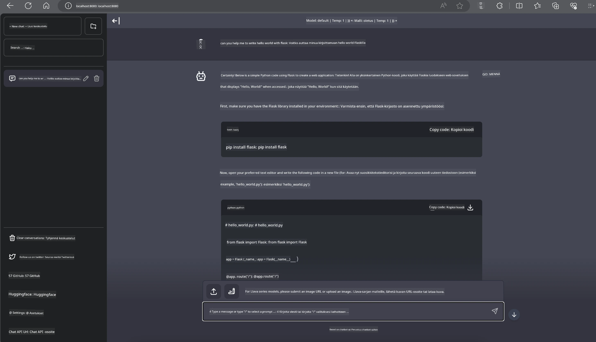

# **Inference Phi-3 Nvidia Jetsoneissa**

Nvidia Jetson on sarja sulautettuja tietokonealustoja Nvidialta. Jetson TK1, TX1 ja TX2 -mallit sisältävät kaikki Nvidian Tegra-prosessorin (tai SoC:n), joka yhdistää ARM-arkkitehtuurin keskusyksikön (CPU). Jetson on vähävirrankulutuksinen järjestelmä, joka on suunniteltu koneoppimissovellusten kiihdyttämiseen. Nvidia Jetsonia käyttävät ammattilaiskehittäjät luodakseen läpimurtoteknologioita tekoälyn alalla eri toimialoilla, sekä opiskelijat ja harrastajat käytännön tekoälyoppimiseen ja upeiden projektien tekemiseen. SLM on otettu käyttöön reunalaitteissa, kuten Jetsoneissa, mikä mahdollistaa teollisten generatiivisten tekoälysovellusten paremman toteutuksen.

## Käyttöönotto NVIDIA Jetsoneissa:
Autonomisten robotiikka- ja sulautettujen laitteiden kehittäjät voivat hyödyntää Phi-3 Miniä. Phi-3:n suhteellisen pieni koko tekee siitä ihanteellisen reunalaitteisiin. Parametrit on hienosäädetty tarkasti koulutuksen aikana, mikä takaa korkean tarkkuuden vastauksissa.

### TensorRT-LLM Optimointi:
NVIDIAn [TensorRT-LLM kirjasto](https://github.com/NVIDIA/TensorRT-LLM?WT.mc_id=aiml-138114-kinfeylo) optimoi suurten kielimallien päättelyn. Se tukee Phi-3 Minin pitkää kontekstikkunaa, parantaen sekä läpimenoa että viivettä. Optimointeihin kuuluvat tekniikat kuten LongRoPE, FP8 ja inflight batching.

### Saatavuus ja käyttöönotto:
Kehittäjät voivat tutustua Phi-3 Miniin 128K kontekstikkunalla osoitteessa [NVIDIA AI](https://www.nvidia.com/en-us/ai-data-science/generative-ai/). Se on paketoitu NVIDIA NIM:inä, mikropalveluna, jolla on standardoitu API ja jonka voi ottaa käyttöön missä tahansa. Lisäksi [TensorRT-LLM toteutukset GitHubissa](https://github.com/NVIDIA/TensorRT-LLM).

## **1. Valmistelut**

a. Jetson Orin NX / Jetson NX

b. JetPack 5.1.2+

c. Cuda 11.8

d. Python 3.8+

## **2. Phi-3:n ajaminen Jetsoneissa**

Voimme valita [Ollama](https://ollama.com) tai [LlamaEdge](https://llamaedge.com)

Jos haluat käyttää gguf:ia sekä pilvessä että reunalaitteissa samanaikaisesti, LlamaEdgeä voi ymmärtää WasmEdgenä (WasmEdge on kevyt, suorituskykyinen ja skaalautuva WebAssembly-ajoympäristö, joka sopii pilvipohjaisiin, reunalaitteisiin ja hajautettuihin sovelluksiin. Se tukee serverless-sovelluksia, sulautettuja toimintoja, mikropalveluita, älysopimuksia ja IoT-laitteita. Voit ottaa gguf:n kvantitatiivisen mallin käyttöön reunalaitteissa ja pilvessä LlamaEdgen kautta.


Tässä ovat käyttöohjeet:

1. Asenna ja lataa tarvittavat kirjastot ja tiedostot

```bash

curl -sSf https://raw.githubusercontent.com/WasmEdge/WasmEdge/master/utils/install.sh | bash -s -- --plugin wasi_nn-ggml

curl -LO https://github.com/LlamaEdge/LlamaEdge/releases/latest/download/llama-api-server.wasm

curl -LO https://github.com/LlamaEdge/chatbot-ui/releases/latest/download/chatbot-ui.tar.gz

tar xzf chatbot-ui.tar.gz

```

**Huom:** llama-api-server.wasm ja chatbot-ui tulee olla samassa hakemistossa

2. Suorita skriptit terminaalissa

```bash

wasmedge --dir .:. --nn-preload default:GGML:AUTO:{Your gguf path} llama-api-server.wasm -p phi-3-chat

```

Tässä on ajon tulos



***Esimerkkikoodi*** [Phi-3 mini WASM Notebook Sample](https://github.com/Azure-Samples/Phi-3MiniSamples/tree/main/wasm)

Yhteenvetona Phi-3 Mini edustaa merkittävää harppausta kielimallinnuksessa, yhdistäen tehokkuuden, kontekstin ymmärryksen ja NVIDIAn optimointiosaamisen. Olitpa rakentamassa robotteja tai reunasovelluksia, Phi-3 Mini on tehokas työkalu, joka kannattaa ottaa huomioon.

**Vastuuvapauslauseke**:  
Tämä asiakirja on käännetty käyttämällä tekoälypohjaista käännöspalvelua [Co-op Translator](https://github.com/Azure/co-op-translator). Vaikka pyrimme tarkkuuteen, huomioithan, että automaattikäännöksissä saattaa esiintyä virheitä tai epätarkkuuksia. Alkuperäistä asiakirjaa sen alkuperäiskielellä tulee pitää virallisena lähteenä. Tärkeissä tiedoissa suositellaan ammattimaista ihmiskäännöstä. Emme ole vastuussa tämän käännöksen käytöstä aiheutuvista väärinymmärryksistä tai tulkinnoista.