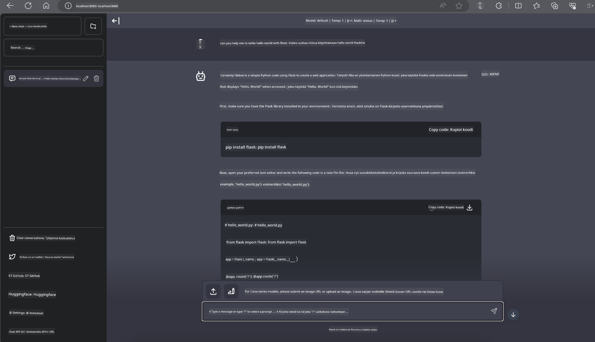

<!--
CO_OP_TRANSLATOR_METADATA:
{
  "original_hash": "be4101a30d98e95a71d42c276e8bcd37",
  "translation_date": "2025-05-09T11:40:03+00:00",
  "source_file": "md/01.Introduction/03/Jetson_Inference.md",
  "language_code": "fi"
}
-->
# **Phi-3-päätelmät Nvidia Jetsoneilla**

Nvidia Jetson on sarja sulautettuja tietokonealustoja Nvidialta. Jetson TK1, TX1 ja TX2 -malleissa on kaikki Nvidia Tegra -prosessori (tai SoC), joka sisältää ARM-arkkitehtuurin keskusyksikön (CPU). Jetson on vähävirrankulutuksinen järjestelmä, joka on suunniteltu koneoppimissovellusten nopeuttamiseen. Nvidia Jetsonia käyttävät ammattilaiskehittäjät luodakseen uraauurtavia tekoälytuotteita eri toimialoille sekä opiskelijat ja harrastajat saadakseen käytännön kokemusta tekoälystä ja tehdäkseen upeita projekteja. SLM on otettu käyttöön reunalaitteissa, kuten Jetsonissa, mikä mahdollistaa teollisten generatiivisten tekoälysovellusten paremman toteutuksen.

## Käyttöönotto NVIDIA Jetsoneilla:
Autonomisten robottien ja sulautettujen laitteiden kehittäjät voivat hyödyntää Phi-3 Miniä. Phi-3:n suhteellisen pieni koko tekee siitä ihanteellisen reunalaitteisiin. Parametrit on huolellisesti viritetty koulutuksen aikana, mikä takaa korkean tarkkuuden vastauksissa.

### TensorRT-LLM-optimointi:
NVIDIAn [TensorRT-LLM-kirjasto](https://github.com/NVIDIA/TensorRT-LLM?WT.mc_id=aiml-138114-kinfeylo) optimoi suurten kielimallien päätelmiä. Se tukee Phi-3 Minin pitkää konteksti-ikkunaa, parantaen sekä läpimenokykyä että viivettä. Optimointitekniikoihin kuuluvat LongRoPE, FP8 ja inflight batching.

### Saatavuus ja käyttöönotto:
Kehittäjät voivat tutustua Phi-3 Miniin 128K konteksti-ikkunalla osoitteessa [NVIDIA AI](https://www.nvidia.com/en-us/ai-data-science/generative-ai/). Se on paketoitu NVIDIA NIM -mikropalveluksi, jossa on standardoitu API ja jonka voi ottaa käyttöön missä tahansa. Lisäksi [TensorRT-LLM:n toteutukset GitHubissa](https://github.com/NVIDIA/TensorRT-LLM).

## **1. Valmistelut**

a. Jetson Orin NX / Jetson NX

b. JetPack 5.1.2+

c. Cuda 11.8

d. Python 3.8+

## **2. Phi-3:n ajaminen Jetsonilla**

Voimme valita [Ollaman](https://ollama.com) tai [LlamaEdgen](https://llamaedge.com)

Jos haluat käyttää gguf:ää sekä pilvessä että reunalaitteissa samanaikaisesti, LlamaEdgeä voi pitää WasmEdgenä (WasmEdge on kevyt, suorituskykyinen ja skaalautuva WebAssembly-ajoympäristö, joka sopii pilvi-native-, reuna- ja hajautettuihin sovelluksiin. Se tukee serverless-sovelluksia, upotettuja toimintoja, mikropalveluita, älysopimuksia ja IoT-laitteita. Voit ottaa gguf:n kvantitatiivisen mallin käyttöön reunalaitteissa ja pilvessä LlamaEdgen kautta.


Näin käytät:

1. Asenna ja lataa tarvittavat kirjastot ja tiedostot

```bash

curl -sSf https://raw.githubusercontent.com/WasmEdge/WasmEdge/master/utils/install.sh | bash -s -- --plugin wasi_nn-ggml

curl -LO https://github.com/LlamaEdge/LlamaEdge/releases/latest/download/llama-api-server.wasm

curl -LO https://github.com/LlamaEdge/chatbot-ui/releases/latest/download/chatbot-ui.tar.gz

tar xzf chatbot-ui.tar.gz

```

**Huom:** llama-api-server.wasm ja chatbot-ui tulee olla samassa hakemistossa

2. Aja skriptit terminaalissa

```bash

wasmedge --dir .:. --nn-preload default:GGML:AUTO:{Your gguf path} llama-api-server.wasm -p phi-3-chat

```

Tässä ajon tulos



***Esimerkkikoodi*** [Phi-3 mini WASM Notebook Sample](https://github.com/Azure-Samples/Phi-3MiniSamples/tree/main/wasm)

Yhteenvetona Phi-3 Mini edustaa merkittävää harppausta kielimallinnuksessa, yhdistäen tehokkuuden, kontekstin ymmärryksen ja NVIDIAn optimointiosaamisen. Olitpa rakentamassa robotteja tai reunasovelluksia, Phi-3 Mini on voimakas työkalu, joka kannattaa tuntea.

**Vastuuvapauslauseke**:  
Tämä asiakirja on käännetty käyttämällä tekoälypohjaista käännöspalvelua [Co-op Translator](https://github.com/Azure/co-op-translator). Vaikka pyrimme tarkkuuteen, huomioithan, että automaattiset käännökset saattavat sisältää virheitä tai epätarkkuuksia. Alkuperäistä asiakirjaa sen alkuperäiskielellä tulee pitää auktoritatiivisena lähteenä. Tärkeissä asioissa suositellaan ammattimaista ihmiskäännöstä. Emme ole vastuussa tästä käännöksestä mahdollisesti aiheutuvista väärinymmärryksistä tai tulkinnoista.