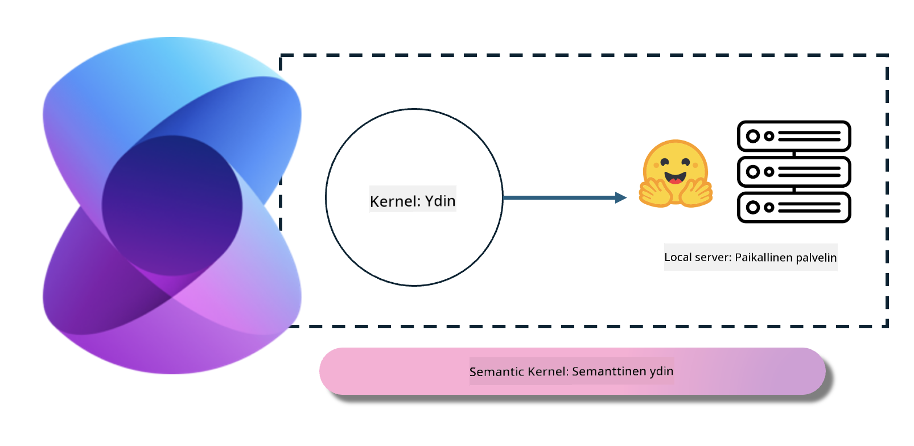

<!--
CO_OP_TRANSLATOR_METADATA:
{
  "original_hash": "bcf5dd7031db0031abdb9dd0c05ba118",
  "translation_date": "2025-05-09T12:05:52+00:00",
  "source_file": "md/01.Introduction/03/Local_Server_Inference.md",
  "language_code": "fi"
}
-->
# **Inference Phi-3 paikallisella palvelimella**

Voimme ottaa Phi-3:n käyttöön paikallisella palvelimella. Käyttäjät voivat valita [Ollama](https://ollama.com) tai [LM Studio](https://llamaedge.com) -ratkaisuista, tai he voivat kirjoittaa oman koodinsa. Phi-3:n paikallisiin palveluihin voi yhdistää [Semantic Kernelin](https://github.com/microsoft/semantic-kernel?WT.mc_id=aiml-138114-kinfeylo) tai [Langchainin](https://www.langchain.com/) avulla Copilot-sovellusten rakentamista varten.

## **Käytä Semantic Kernelia Phi-3-miniin pääsemiseksi**

Copilot-sovelluksessa luomme sovelluksia Semantic Kernelin / LangChainin kautta. Tämä sovelluskehys on yleisesti yhteensopiva Azure OpenAI -palvelun / OpenAI-mallien kanssa, ja se tukee myös Hugging Facen avoimen lähdekoodin malleja sekä paikallisia malleja. Mitä tehdä, jos haluamme käyttää Semantic Kernelia Phi-3-miniin pääsemiseksi? Käytetään esimerkkinä .NET:iä, jonka voi yhdistää Semantic Kernelin Hugging Face Connectoriin. Oletuksena se vastaa Hugging Facen mallin tunnusta (ensimmäisellä käyttökerralla malli ladataan Hugging Facesta, mikä vie aikaa). Voit myös yhdistää itse rakennettuun paikalliseen palveluun. Näistä kahdesta suosittelemme jälkimmäistä, koska se tarjoaa enemmän itsenäisyyttä, erityisesti yrityssovelluksissa.

Kuvasta nähdään, että paikallisiin palveluihin pääseminen Semantic Kernelin kautta yhdistää helposti itse rakennettuun Phi-3-mini-mallipalvelimeen. Tässä on ajon tulos:

***Sample Code*** https://github.com/kinfey/Phi3MiniSamples/tree/main/semantickernel

**Vastuuvapauslauseke**:  
Tämä asiakirja on käännetty käyttämällä tekoälypohjaista käännöspalvelua [Co-op Translator](https://github.com/Azure/co-op-translator). Vaikka pyrimme tarkkuuteen, huomioithan, että automaattikäännöksissä saattaa esiintyä virheitä tai epätarkkuuksia. Alkuperäistä asiakirjaa sen alkuperäiskielellä tulee pitää virallisena lähteenä. Tärkeissä asioissa suositellaan ammattimaista ihmiskäännöstä. Emme ole vastuussa mahdollisista väärinymmärryksistä tai virhetulkintojen aiheuttamista seurauksista tämän käännöksen käytöstä.