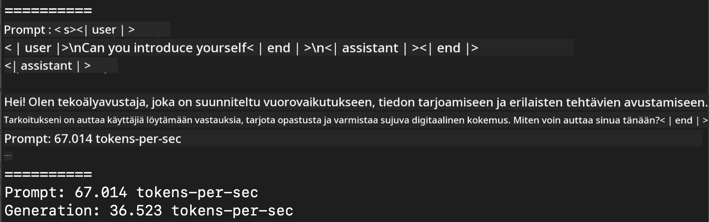
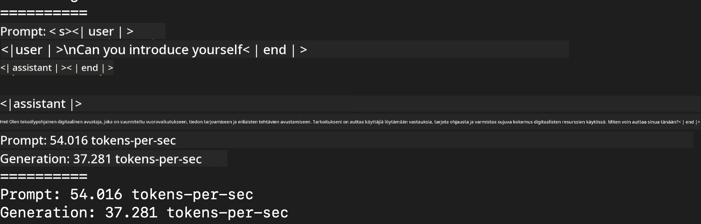
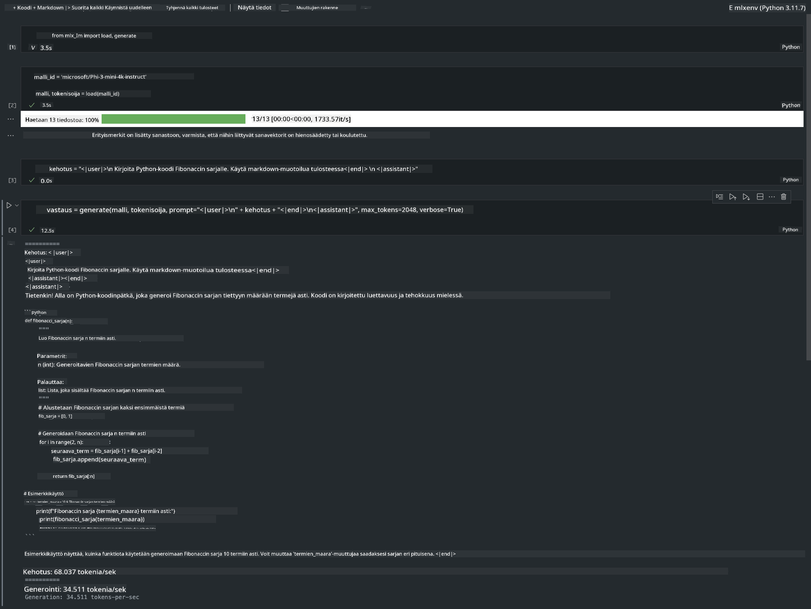

<!--
CO_OP_TRANSLATOR_METADATA:
{
  "original_hash": "dcb656f3d206fc4968e236deec5d4384",
  "translation_date": "2025-05-09T12:15:27+00:00",
  "source_file": "md/01.Introduction/03/MLX_Inference.md",
  "language_code": "fi"
}
-->
# **Phi-3-päättely Apple MLX Frameworkilla**

## **Mikä on MLX Framework**

MLX on taulukkoalusta koneoppimustutkimukseen Apple-sirulla, jonka on kehittänyt Apple koneoppimustutkimus.

MLX on suunniteltu koneoppimustutkijoiden toimesta koneoppimustutkijoille. Frameworkin tarkoituksena on olla käyttäjäystävällinen, mutta silti tehokas mallien kouluttamiseen ja käyttöönottoon. Myös frameworkin rakenne on konseptuaalisesti yksinkertainen. Tavoitteenamme on tehdä siitä helppokäyttöinen tutkijoille, jotta he voivat nopeasti laajentaa ja parantaa MLX:ää uusien ideoiden kokeilemista varten.

LLM-malleja voidaan kiihdyttää Apple Silicon -laitteilla MLX:n avulla, ja malleja voi ajaa paikallisesti erittäin kätevästi.

## **MLX:n käyttäminen Phi-3-minin päättelyyn**

### **1. Valmistele MLX-ympäristö**

1. Python 3.11.x
2. Asenna MLX-kirjasto


```bash

pip install mlx-lm

```

### **2. Phi-3-minin suorittaminen terminaalissa MLX:llä**


```bash

python -m mlx_lm.generate --model microsoft/Phi-3-mini-4k-instruct --max-token 2048 --prompt  "<|user|>\nCan you introduce yourself<|end|>\n<|assistant|>"

```

Tulos (ympäristöni on Apple M1 Max, 64GB) on



### **3. Phi-3-minin kvantisointi MLX:llä terminaalissa**


```bash

python -m mlx_lm.convert --hf-path microsoft/Phi-3-mini-4k-instruct

```

***Note：*** Malli voidaan kvantisoida mlx_lm.convert-funktiolla, ja oletuskvantisointi on INT4. Tässä esimerkissä Phi-3-mini kvantisoidaan INT4-muotoon.

Malli voidaan kvantisoida mlx_lm.convert-funktiolla, ja oletuskvantisointi on INT4. Tässä esimerkissä Phi-3-mini kvantisoidaan INT4-muotoon. Kvantisoinnin jälkeen se tallennetaan oletushakemistoon ./mlx_model

Voimme testata MLX:llä kvantisoitua mallia terminaalista


```bash

python -m mlx_lm.generate --model ./mlx_model/ --max-token 2048 --prompt  "<|user|>\nCan you introduce yourself<|end|>\n<|assistant|>"

```

Tulos on




### **4. Phi-3-minin suorittaminen MLX:llä Jupyter Notebookissa**




***Note:*** Lue tämä esimerkkitiedosto [click this link](../../../../../code/03.Inference/MLX/MLX_DEMO.ipynb)


## **Resurssit**

1. Lisätietoja Apple MLX Frameworkista [https://ml-explore.github.io](https://ml-explore.github.io/mlx/build/html/index.html)

2. Apple MLX GitHub Repo [https://github.com/ml-explore](https://github.com/ml-explore)

**Vastuuvapauslauseke**:  
Tämä asiakirja on käännetty käyttämällä tekoälypohjaista käännöspalvelua [Co-op Translator](https://github.com/Azure/co-op-translator). Pyrimme tarkkuuteen, mutta ole hyvä ja huomioi, että automaattikäännöksissä saattaa esiintyä virheitä tai epätarkkuuksia. Alkuperäistä asiakirjaa sen alkuperäiskielellä tulee pitää virallisena lähteenä. Tärkeissä tiedoissa suositellaan ammattimaista ihmiskäännöstä. Emme ole vastuussa tämän käännöksen käytöstä aiheutuvista väärinymmärryksistä tai tulkinnoista.