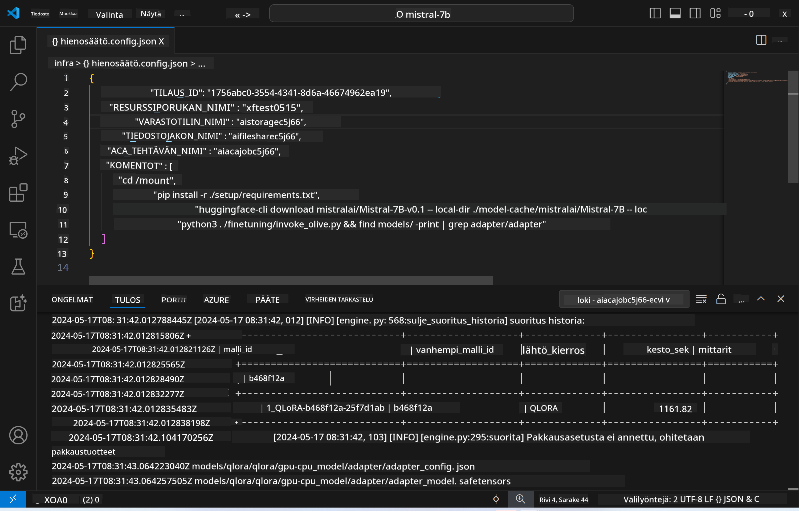
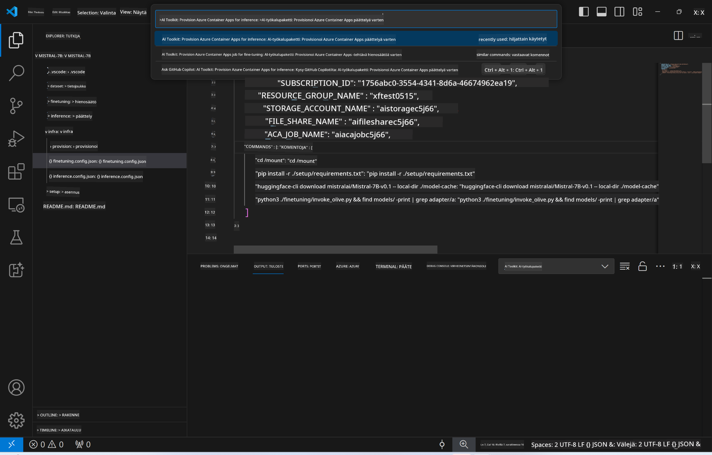
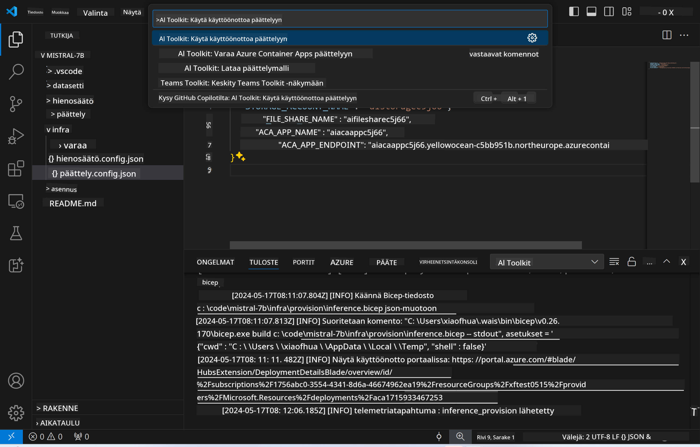
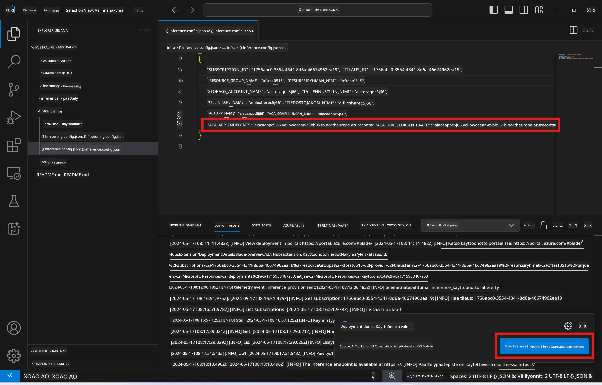

<!--
CO_OP_TRANSLATOR_METADATA:
{
  "original_hash": "a54cd3d65b6963e4e8ce21e143c3ab04",
  "translation_date": "2025-05-09T12:42:01+00:00",
  "source_file": "md/01.Introduction/03/Remote_Interence.md",
  "language_code": "fi"
}
-->
# Etäinferenssi hienosäädetyllä mallilla

Kun adapterit on koulutettu etäympäristössä, käytä yksinkertaista Gradio-sovellusta mallin kanssa vuorovaikutukseen.



### Azure-resurssien määrittäminen  
Sinun tulee määrittää Azure-resurssit etäinferenssiä varten suorittamalla `AI Toolkit: Provision Azure Container Apps for inference` komentopalettista. Tämän asetuksen aikana sinua pyydetään valitsemaan Azure-tilauksesi ja resurssiryhmäsi.  

   
Oletuksena inferenssin tilauksen ja resurssiryhmän tulisi vastata hienosäätöön käytettyjä. Inferenssi käyttää samaa Azure Container App Environment -ympäristöä ja pääsee käsiksi malliin sekä mallin adapteriin, jotka on tallennettu Azure Filesiin ja jotka luotiin hienosäätövaiheessa. 

## AI Toolkitin käyttö

### Käyttöönotto inferenssiä varten  
Jos haluat muokata inferenssikoodia tai ladata inferenssimallin uudelleen, suorita `AI Toolkit: Deploy for inference` -komento. Tämä synkronoi viimeisimmän koodisi ACA:n kanssa ja käynnistää replikan uudelleen.  



Kun käyttöönotto on onnistuneesti suoritettu, malli on valmis arvioitavaksi tämän päätepisteen kautta.

### Pääsy inferenssi-API:iin

Pääset inferenssi-API:iin klikkaamalla VSCode-ilmoituksessa olevaa "*Go to Inference Endpoint*" -painiketta. Vaihtoehtoisesti web-API-päätepiste löytyy `ACA_APP_ENDPOINT` kohdasta `./infra/inference.config.json` sekä tulospaneelista.



> **Note:** Inferenssipäätepisteen käyttöönotto voi kestää muutaman minuutin, ennen kuin se on täysin toiminnassa.

## Mallipohjaan sisältyvät inferenssikomponentit
 
| Kansio | Sisältö |
| ------ |--------- |
| `infra` | Sisältää kaikki tarvittavat asetukset etäkäyttöä varten. |
| `infra/provision/inference.parameters.json` | Sisältää parametrien määrittelyt bicep-malleille, joita käytetään Azure-resurssien määrittämiseen inferenssiä varten. |
| `infra/provision/inference.bicep` | Sisältää mallipohjat Azure-resurssien määrittämiseen inferenssiä varten. |
| `infra/inference.config.json` | Määritystiedosto, joka luodaan `AI Toolkit: Provision Azure Container Apps for inference` -komennolla. Sitä käytetään syötteenä muille etäkomentopaleteille. |

### AI Toolkitin käyttö Azure-resurssien määrittämiseen  
Määritä [AI Toolkit](https://marketplace.visualstudio.com/items?itemName=ms-windows-ai-studio.windows-ai-studio)

Määritä Azure Container Apps inferenssiä varten ` command.

You can find configuration parameters in `./infra/provision/inference.parameters.json` file. Here are the details:
| Parameter | Description |
| --------- |------------ |
| `defaultCommands` | This is the commands to initiate a web API. |
| `maximumInstanceCount` | This parameter sets the maximum capacity of GPU instances. |
| `location` | This is the location where Azure resources are provisioned. The default value is the same as the chosen resource group's location. |
| `storageAccountName`, `fileShareName` `acaEnvironmentName`, `acaEnvironmentStorageName`, `acaAppName`,  `acaLogAnalyticsName` | These parameters are used to name the Azure resources for provision. By default, they will be same to the fine-tuning resource name. You can input a new, unused resource name to create your own custom-named resources, or you can input the name of an already existing Azure resource if you'd prefer to use that. For details, refer to the section [Using existing Azure Resources](../../../../../md/01.Introduction/03). |

### Using Existing Azure Resources

By default, the inference provision use the same Azure Container App Environment, Storage Account, Azure File Share, and Azure Log Analytics that were used for fine-tuning. A separate Azure Container App is created solely for the inference API. 

If you have customized the Azure resources during the fine-tuning step or want to use your own existing Azure resources for inference, specify their names in the `./infra/inference.parameters.json` tiedostossa. Suorita sitten `AI Toolkit: Provision Azure Container Apps for inference` -komento komentopaletista. Tämä päivittää määritellyt resurssit ja luo puuttuvat.

Esimerkiksi, jos sinulla on olemassa oleva Azure Container -ympäristö, `./infra/finetuning.parameters.json` tiedostosi tulisi näyttää tältä:

```json
{
    "$schema": "https://schema.management.azure.com/schemas/2019-04-01/deploymentParameters.json#",
    "contentVersion": "1.0.0.0",
    "parameters": {
      ...
      "acaEnvironmentName": {
        "value": "<your-aca-env-name>"
      },
      "acaEnvironmentStorageName": {
        "value": null
      },
      ...
    }
  }
```

### Manuaalinen määrittäminen  
Jos haluat määrittää Azure-resurssit manuaalisesti, voit käyttää `./infra/provision` folders. If you have already set up and configured all the Azure resources without using the AI Toolkit command palette, you can simply enter the resource names in the `inference.config.json` tiedostossa olevia bicep-tiedostoja.

Esimerkiksi:

```json
{
  "SUBSCRIPTION_ID": "<your-subscription-id>",
  "RESOURCE_GROUP_NAME": "<your-resource-group-name>",
  "STORAGE_ACCOUNT_NAME": "<your-storage-account-name>",
  "FILE_SHARE_NAME": "<your-file-share-name>",
  "ACA_APP_NAME": "<your-aca-name>",
  "ACA_APP_ENDPOINT": "<your-aca-endpoint>"
}
```

**Vastuuvapauslauseke**:  
Tämä asiakirja on käännetty käyttämällä tekoälypohjaista käännöspalvelua [Co-op Translator](https://github.com/Azure/co-op-translator). Vaikka pyrimme tarkkuuteen, ole hyvä ja huomioi, että automaattikäännöksissä saattaa esiintyä virheitä tai epätarkkuuksia. Alkuperäistä asiakirjaa sen alkuperäiskielellä tulee pitää auktoritatiivisena lähteenä. Tärkeissä asioissa suositellaan ammattimaista ihmiskäännöstä. Emme ole vastuussa tämän käännöksen käytöstä johtuvista väärinymmärryksistä tai virhetulkinnoista.