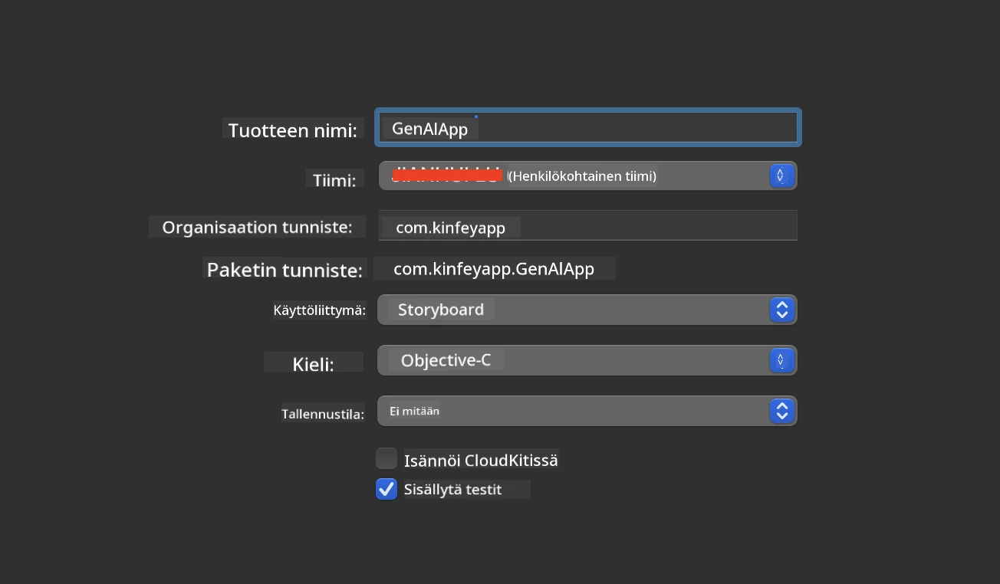
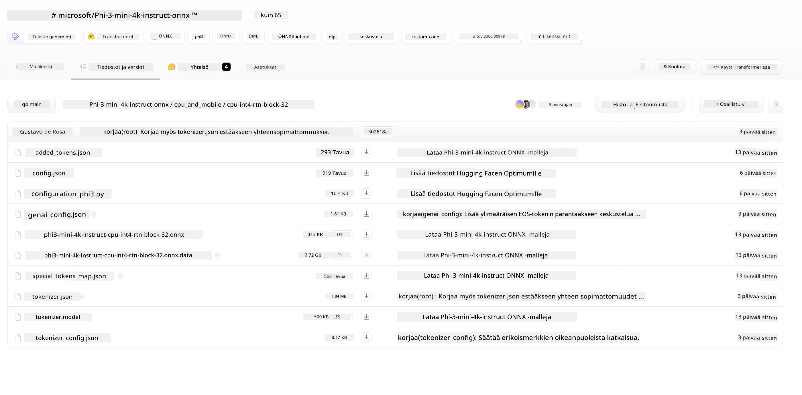
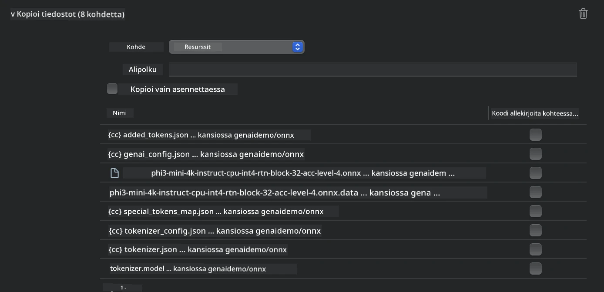
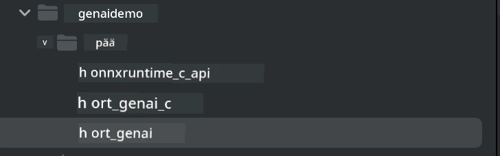
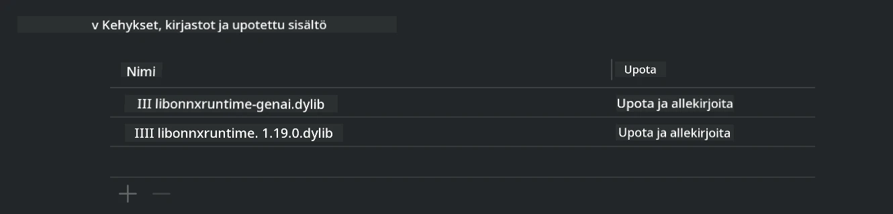
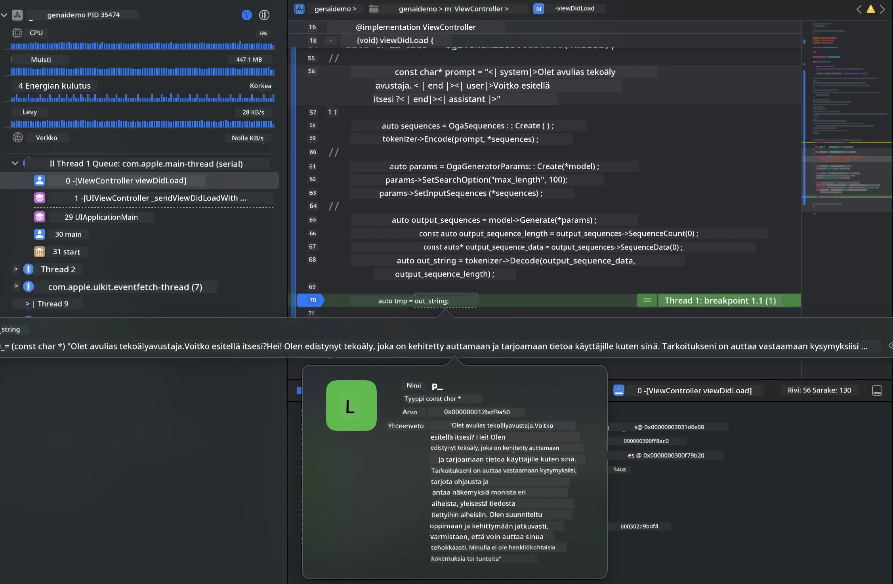

# **Phi-3-päätelmä iOS:llä**

Phi-3-mini on Microsoftin uusi mallisarja, joka mahdollistaa suurten kielimallien (LLM) käyttöönoton reunalaitteissa ja IoT-laitteissa. Phi-3-mini on saatavilla iOS:lle, Androidille ja reunalaitteille, mikä mahdollistaa generatiivisen tekoälyn käyttöönoton BYOD-ympäristöissä. Seuraava esimerkki näyttää, miten Phi-3-mini otetaan käyttöön iOS:llä.

## **1. Valmistelut**

- **a.** macOS 14+
- **b.** Xcode 15+
- **c.** iOS SDK 17.x (iPhone 14 A16 tai uudempi)
- **d.** Asenna Python 3.10+ (Conda suositeltu)
- **e.** Asenna Python-kirjasto: `python-flatbuffers`
- **f.** Asenna CMake

### Semantic Kernel ja päättely

Semantic Kernel on sovelluskehys, jonka avulla voit luoda sovelluksia, jotka toimivat Azure OpenAI -palvelun, OpenAI-mallien ja jopa paikallisten mallien kanssa. Paikallisiin palveluihin pääseminen Semantic Kernelin kautta mahdollistaa helpon integraation itse ylläpitämääsi Phi-3-mini-mallipalvelimeen.

### Kvantisoitujen mallien kutsuminen Ollamalla tai LlamaEdgellä

Monet käyttäjät suosivat kvantisoitujen mallien käyttöä mallien paikalliseen suorittamiseen. [Ollama](https://ollama.com) ja [LlamaEdge](https://llamaedge.com) tarjoavat mahdollisuuden kutsua erilaisia kvantisoituja malleja:

#### **Ollama**

Voit suorittaa `ollama run phi3` suoraan tai määrittää sen offline-tilassa. Luo Modelfile, jossa on polku `gguf`-tiedostoosi. Esimerkkikoodi Phi-3-mini kvantisoidun mallin suorittamiseen:

```gguf
FROM {Add your gguf file path}
TEMPLATE \"\"\"<|user|> .Prompt<|end|> <|assistant|>\"\"\"
PARAMETER stop <|end|>
PARAMETER num_ctx 4096
```

#### **LlamaEdge**

Jos haluat käyttää `gguf`-tiedostoa sekä pilvessä että reunalaitteissa samanaikaisesti, LlamaEdge on erinomainen vaihtoehto.

## **2. ONNX Runtime -kääntäminen iOS:lle**

```bash

git clone https://github.com/microsoft/onnxruntime.git

cd onnxruntime

./build.sh --build_shared_lib --ios --skip_tests --parallel --build_dir ./build_ios --ios --apple_sysroot iphoneos --osx_arch arm64 --apple_deploy_target 17.5 --cmake_generator Xcode --config Release

cd ../

```

### **Huomio**

- **a.** Ennen kääntämistä varmista, että Xcode on oikein konfiguroitu ja asetettu aktiiviseksi kehittäjähakemistoksi terminaalissa:

    ```bash
    sudo xcode-select -switch /Applications/Xcode.app/Contents/Developer
    ```

- **b.** ONNX Runtime täytyy kääntää eri alustoille. iOS:lle voit kääntää `arm64`- tai `x86_64`-arkkitehtuurille.

- **c.** Suositeltavaa on käyttää uusinta iOS SDK:ta käännöksessä, mutta voit käyttää myös vanhempaa versiota, jos tarvitset yhteensopivuutta aiempien SDK-versioiden kanssa.

## **3. Generatiivisen tekoälyn kääntäminen ONNX Runtime -ympäristössä iOS:lle**

> **Note:** Koska Generative AI ONNX Runtime -ympäristössä on vielä esikatseluvaiheessa, ole tietoinen mahdollisista muutoksista.

```bash

git clone https://github.com/microsoft/onnxruntime-genai
 
cd onnxruntime-genai
 
mkdir ort
 
cd ort
 
mkdir include
 
mkdir lib
 
cd ../
 
cp ../onnxruntime/include/onnxruntime/core/session/onnxruntime_c_api.h ort/include
 
cp ../onnxruntime/build_ios/Release/Release-iphoneos/libonnxruntime*.dylib* ort/lib
 
export OPENCV_SKIP_XCODEBUILD_FORCE_TRYCOMPILE_DEBUG=1
 
python3 build.py --parallel --build_dir ./build_ios --ios --ios_sysroot iphoneos --ios_arch arm64 --ios_deployment_target 17.5 --cmake_generator Xcode --cmake_extra_defines CMAKE_XCODE_ATTRIBUTE_CODE_SIGNING_ALLOWED=NO

```

## **4. Luo App-sovellus Xcodessa**

Valitsin Objective-C:n sovelluskehitykseen, koska Generative AI ONNX Runtime C++ API:n kanssa Objective-C on paremmin yhteensopiva. Tietenkin voit myös tehdä vastaavat kutsut Swift-sillan kautta.



## **5. Kopioi ONNX kvantisoitu INT4 -malli App-sovellusprojektiin**

Meidän täytyy tuoda INT4-kvantisointimalli ONNX-muodossa, joka täytyy ensin ladata.



Lataamisen jälkeen lisää se projektin Resources-kansioon Xcodessa.



## **6. Lisää C++ API ViewControllers-luokkiin**

> **Huomio:**

- **a.** Lisää vastaavat C++-otsikkotiedostot projektiin.

  

- **b.** Sisällytä `onnxruntime-genai`-dynaaminen kirjasto Xcode-projektiin.

  

- **c.** Käytä C-esimerkkikoodia testaukseen. Voit myös lisätä lisäominaisuuksia, kuten ChatUI:n, laajempaan toiminnallisuuteen.

- **d.** Koska projektissasi täytyy käyttää C++:aa, nimeä `ViewController.m` uudelleen muotoon `ViewController.mm` Objective-C++ -tuen aktivoimiseksi.

```objc

    NSString *llmPath = [[NSBundle mainBundle] resourcePath];
    char const *modelPath = llmPath.cString;

    auto model =  OgaModel::Create(modelPath);

    auto tokenizer = OgaTokenizer::Create(*model);

    const char* prompt = "<|system|>You are a helpful AI assistant.<|end|><|user|>Can you introduce yourself?<|end|><|assistant|>";

    auto sequences = OgaSequences::Create();
    tokenizer->Encode(prompt, *sequences);

    auto params = OgaGeneratorParams::Create(*model);
    params->SetSearchOption("max_length", 100);
    params->SetInputSequences(*sequences);

    auto output_sequences = model->Generate(*params);
    const auto output_sequence_length = output_sequences->SequenceCount(0);
    const auto* output_sequence_data = output_sequences->SequenceData(0);
    auto out_string = tokenizer->Decode(output_sequence_data, output_sequence_length);
    
    auto tmp = out_string;

```

## **7. Sovelluksen suorittaminen**

Kun asennus on valmis, voit käynnistää sovelluksen ja nähdä Phi-3-mini-mallin päätelmän tulokset.



Lisää esimerkkikoodeja ja yksityiskohtaiset ohjeet löydät [Phi-3 Mini Samples -varastosta](https://github.com/Azure-Samples/Phi-3MiniSamples/tree/main/ios).

**Vastuuvapauslauseke**:  
Tämä asiakirja on käännetty käyttämällä tekoälypohjaista käännöspalvelua [Co-op Translator](https://github.com/Azure/co-op-translator). Vaikka pyrimme tarkkuuteen, huomioithan, että automaattikäännöksissä saattaa esiintyä virheitä tai epätarkkuuksia. Alkuperäistä asiakirjaa sen alkuperäiskielellä tulee pitää virallisena lähteenä. Tärkeissä tiedoissa suositellaan ammattimaista ihmiskäännöstä. Emme ole vastuussa tämän käännöksen käytöstä aiheutuvista väärinymmärryksistä tai tulkinnoista.