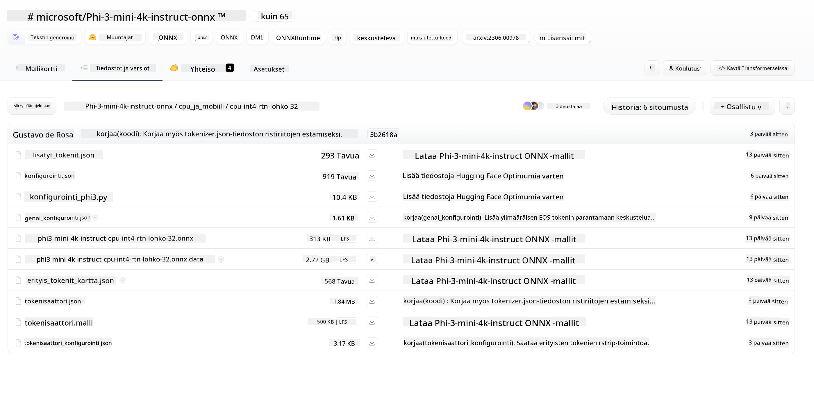
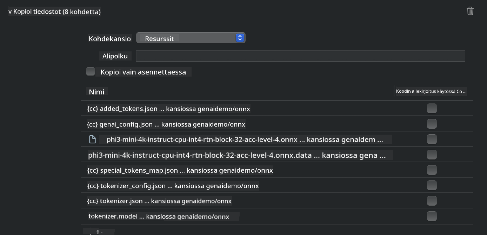
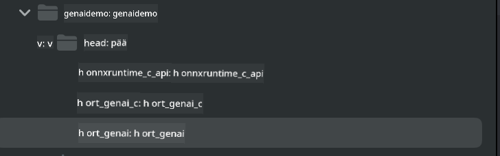
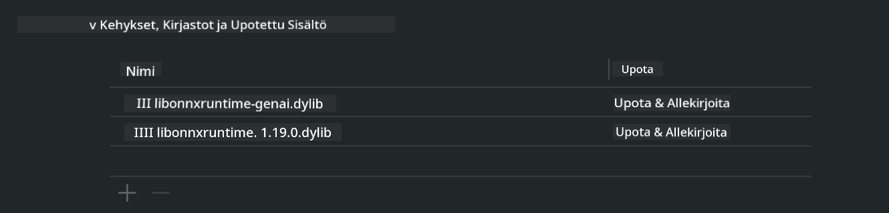
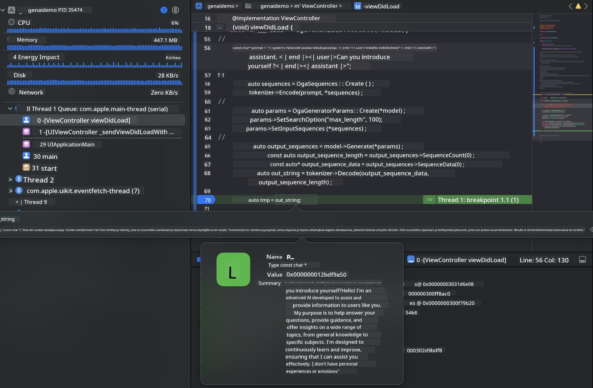

<!--
CO_OP_TRANSLATOR_METADATA:
{
  "original_hash": "82af197df38d25346a98f1f0e84d1698",
  "translation_date": "2025-05-09T11:00:41+00:00",
  "source_file": "md/01.Introduction/03/iOS_Inference.md",
  "language_code": "fi"
}
-->
# **Phi-3-päätelmien teko iOS:llä**

Phi-3-mini on Microsoftin uusi mallisarja, joka mahdollistaa suurten kielimallien (LLM) käyttöönoton reunalaitteissa ja IoT-laitteissa. Phi-3-mini on saatavilla iOS:lle, Androidille ja reunalaitteiden käyttöönottoon, mikä mahdollistaa generatiivisen tekoälyn hyödyntämisen BYOD-ympäristöissä. Seuraava esimerkki näyttää, miten Phi-3-mini otetaan käyttöön iOS:llä.

## **1. Valmistelut**

- **a.** macOS 14+
- **b.** Xcode 15+
- **c.** iOS SDK 17.x (iPhone 14 A16 tai uudempi)
- **d.** Asenna Python 3.10+ (Conda suositeltava)
- **e.** Asenna Python-kirjasto: `python-flatbuffers`
- **f.** Asenna CMake

### Semantic Kernel ja päättely

Semantic Kernel on sovelluskehys, jonka avulla voit luoda sovelluksia, jotka toimivat Azure OpenAI -palvelun, OpenAI-mallien ja jopa paikallisten mallien kanssa. Paikallisiin palveluihin pääsy Semantic Kernelin kautta mahdollistaa helpon integraation itse ylläpitämääsi Phi-3-mini-mallipalvelimeen.

### Kvantisoitujen mallien kutsuminen Ollamalla tai LlamaEdgellä

Monet käyttäjät suosivat kvantisoituja malleja mallien paikalliseen suorittamiseen. [Ollama](https://ollama.com) ja [LlamaEdge](https://llamaedge.com) tarjoavat mahdollisuuden kutsua erilaisia kvantisoituja malleja:

#### **Ollama**

Voit ajaa `ollama run phi3` suoraan tai konfiguroida sen offline-tilassa. Luo Modelfile, jossa on polku `gguf`-tiedostoon. Esimerkkikoodi Phi-3-mini-kvantisoidun mallin ajamiseen:

```gguf
FROM {Add your gguf file path}
TEMPLATE \"\"\"<|user|> .Prompt<|end|> <|assistant|>\"\"\"
PARAMETER stop <|end|>
PARAMETER num_ctx 4096
```

#### **LlamaEdge**

Jos haluat käyttää `gguf` sekä pilvessä että reunalaitteissa samanaikaisesti, LlamaEdge on erinomainen vaihtoehto.

## **2. ONNX Runtime -kääntäminen iOS:lle**

```bash

git clone https://github.com/microsoft/onnxruntime.git

cd onnxruntime

./build.sh --build_shared_lib --ios --skip_tests --parallel --build_dir ./build_ios --ios --apple_sysroot iphoneos --osx_arch arm64 --apple_deploy_target 17.5 --cmake_generator Xcode --config Release

cd ../

```

### **Huomio**

- **a.** Ennen kääntämistä varmista, että Xcode on oikein konfiguroitu ja asetettu aktiiviseksi kehittäjäkansioksi terminaalissa:

    ```bash
    sudo xcode-select -switch /Applications/Xcode.app/Contents/Developer
    ```

- **b.** ONNX Runtime pitää kääntää eri alustoille. iOS:lle voit kääntää `arm64` or `x86_64`.

- **c.** Suositeltavaa on käyttää uusinta iOS SDK:ta kääntämiseen, mutta voit käyttää myös vanhempaa versiota, jos tarvitset yhteensopivuutta aiempien SDK-versioiden kanssa.

## **3. Generatiivisen tekoälyn kääntäminen ONNX Runtime -alustalla iOS:lle**

> **Note:** Koska generatiivinen tekoäly ONNX Runtime -alustalla on esikatseluvaiheessa, olethan tietoinen mahdollisista muutoksista.

```bash

git clone https://github.com/microsoft/onnxruntime-genai
 
cd onnxruntime-genai
 
mkdir ort
 
cd ort
 
mkdir include
 
mkdir lib
 
cd ../
 
cp ../onnxruntime/include/onnxruntime/core/session/onnxruntime_c_api.h ort/include
 
cp ../onnxruntime/build_ios/Release/Release-iphoneos/libonnxruntime*.dylib* ort/lib
 
export OPENCV_SKIP_XCODEBUILD_FORCE_TRYCOMPILE_DEBUG=1
 
python3 build.py --parallel --build_dir ./build_ios --ios --ios_sysroot iphoneos --ios_arch arm64 --ios_deployment_target 17.5 --cmake_generator Xcode --cmake_extra_defines CMAKE_XCODE_ATTRIBUTE_CODE_SIGNING_ALLOWED=NO

```

## **4. Luo App-sovellus Xcodessa**

Valitsin Objective-C:n sovelluskehityksen menetelmäksi, koska generatiivisen tekoälyn käyttö ONNX Runtime C++ -rajapinnan kanssa toimii paremmin Objective-C:n kanssa. Tietenkin voit myös hoitaa tarvittavat kutsut Swift-sillan kautta.


## **5. Kopioi ONNX-kvantisoitu INT4-malli App-sovellusprojektiin**

Meidän täytyy tuoda ONNX-muotoinen INT4-kvantisoitu malli, joka tulee ensin ladata.



Latauksen jälkeen malli lisätään projektin Resources-kansioon Xcodessa.



## **6. C++-rajapinnan lisääminen ViewControllers-luokkiin**

> **Huomio:**

- **a.** Lisää vastaavat C++-otsikkotiedostot projektiin.

  

- **b.** Sisällytä `onnxruntime-genai` dynamic library in Xcode.

  

- **c.** Use the C Samples code for testing. You can also add additional features like ChatUI for more functionality.

- **d.** Since you need to use C++ in your project, rename `ViewController.m` to `ViewController.mm` Objective-C++-tuen aktivoimiseksi.

```objc

    NSString *llmPath = [[NSBundle mainBundle] resourcePath];
    char const *modelPath = llmPath.cString;

    auto model =  OgaModel::Create(modelPath);

    auto tokenizer = OgaTokenizer::Create(*model);

    const char* prompt = "<|system|>You are a helpful AI assistant.<|end|><|user|>Can you introduce yourself?<|end|><|assistant|>";

    auto sequences = OgaSequences::Create();
    tokenizer->Encode(prompt, *sequences);

    auto params = OgaGeneratorParams::Create(*model);
    params->SetSearchOption("max_length", 100);
    params->SetInputSequences(*sequences);

    auto output_sequences = model->Generate(*params);
    const auto output_sequence_length = output_sequences->SequenceCount(0);
    const auto* output_sequence_data = output_sequences->SequenceData(0);
    auto out_string = tokenizer->Decode(output_sequence_data, output_sequence_length);
    
    auto tmp = out_string;

```

## **7. Sovelluksen ajaminen**

Kun asetukset ovat valmiit, voit ajaa sovelluksen ja nähdä Phi-3-mini-mallin päättelytulokset.



Lisää esimerkkikoodeja ja yksityiskohtaiset ohjeet löytyvät [Phi-3 Mini Samples -repositoriosta](https://github.com/Azure-Samples/Phi-3MiniSamples/tree/main/ios).

**Vastuuvapauslauseke**:  
Tämä asiakirja on käännetty käyttämällä tekoälypohjaista käännöspalvelua [Co-op Translator](https://github.com/Azure/co-op-translator). Pyrimme tarkkuuteen, mutta ole hyvä ja huomioi, että automaattikäännöksissä saattaa esiintyä virheitä tai epätarkkuuksia. Alkuperäistä asiakirjaa sen alkuperäiskielellä tulee pitää ensisijaisena lähteenä. Tärkeissä tiedoissa suositellaan ammattimaista ihmiskäännöstä. Emme ole vastuussa tämän käännöksen käytöstä aiheutuvista väärinkäsityksistä tai virhetulkinnoista.