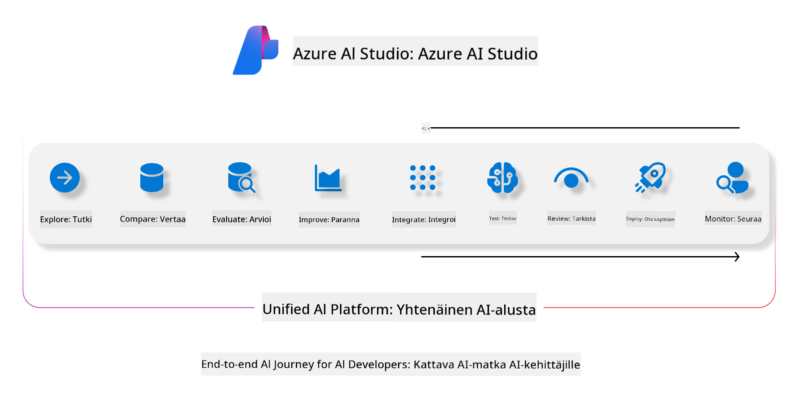
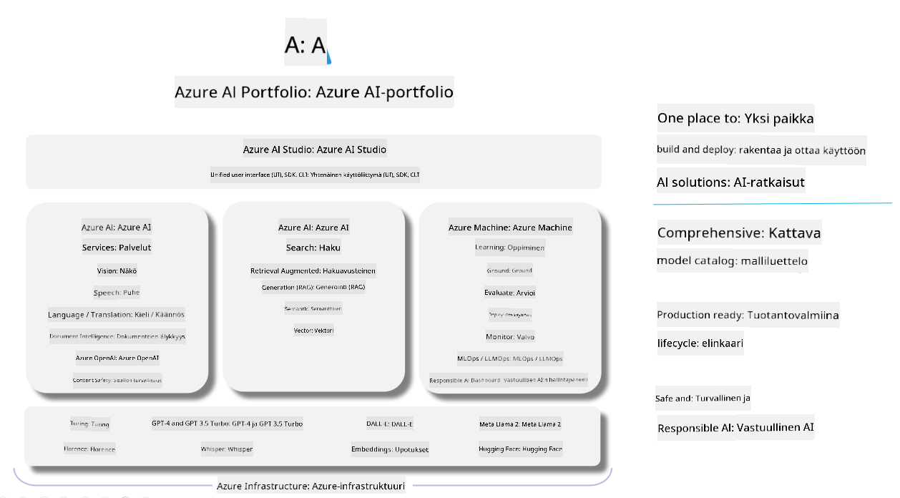

<!--
CO_OP_TRANSLATOR_METADATA:
{
  "original_hash": "7b4235159486df4000e16b7b46ddfec3",
  "translation_date": "2025-05-09T14:59:50+00:00",
  "source_file": "md/01.Introduction/05/AIFoundry.md",
  "language_code": "fi"
}
-->
# **Azure AI Foundryn käyttö arviointiin**

Miten arvioida generatiivista AI-sovellustasi käyttämällä [Azure AI Foundryä](https://ai.azure.com?WT.mc_id=aiml-138114-kinfeylo). Olitpa sitten arvioimassa yksittäisiä tai monivaiheisia keskusteluja, Azure AI Foundry tarjoaa työkaluja mallin suorituskyvyn ja turvallisuuden arviointiin.

## Miten arvioida generatiivisia AI-sovelluksia Azure AI Foundryllä
Lisätietoja löydät [Azure AI Foundryn dokumentaatiosta](https://learn.microsoft.com/azure/ai-studio/how-to/evaluate-generative-ai-app?WT.mc_id=aiml-138114-kinfeylo)

Aloittamiseen tarvitset seuraavat vaiheet:

## Generatiivisten AI-mallien arviointi Azure AI Foundryssä

**Edellytykset**

- Testidatasetti CSV- tai JSON-muodossa.
- Käyttöönotettu generatiivinen AI-malli (esim. Phi-3, GPT 3.5, GPT 4 tai Davinci-mallit).
- Suoritusympäristö, jossa on laskentayksikkö arvioinnin suorittamiseen.

## Sisäänrakennetut arviointimittarit

Azure AI Foundryllä voit arvioida sekä yksittäisiä että monimutkaisia, monivaiheisia keskusteluja.
Retrieval Augmented Generation (RAG) -tilanteissa, joissa malli perustuu tiettyyn aineistoon, voit arvioida suorituskykyä sisäänrakennettujen mittareiden avulla.
Lisäksi voit arvioida yleisiä yksittäisiä kysymys-vastaus -tilanteita (ei-RAG).

## Arviointikierroksen luominen

Azure AI Foundryn käyttöliittymässä siirry joko Evaluate-sivulle tai Prompt Flow -sivulle.
Seuraa arvioinnin luontiohjatinta määrittääksesi arviointikierroksen. Voit antaa arvioinnille halutessasi nimen.
Valitse sovelluksesi tavoitteisiin sopiva skenaario.
Valitse yksi tai useampi arviointimittari mallin tulosten arviointiin.

## Mukautettu arviointiprosessi (valinnainen)

Joustavuutta varten voit luoda oman mukautetun arviointiprosessin. Mukauta arviointia omien tarpeidesi mukaan.

## Tulosten tarkastelu

Arvioinnin suoritettuasi kirjaudu sisään, tarkastele ja analysoi yksityiskohtaisia arviointimittareita Azure AI Foundryssä. Saat tietoa sovelluksesi vahvuuksista ja rajoituksista.

**Note** Azure AI Foundry on tällä hetkellä julkisessa esikatseluvaiheessa, joten käytä sitä kokeiluun ja kehitykseen. Tuotantokäyttöön kannattaa harkita muita vaihtoehtoja. Tutustu viralliseen [AI Foundryn dokumentaatioon](https://learn.microsoft.com/azure/ai-studio/?WT.mc_id=aiml-138114-kinfeylo) saadaksesi lisätietoja ja vaiheittaiset ohjeet.

**Vastuuvapauslauseke**:  
Tämä asiakirja on käännetty käyttäen tekoälypohjaista käännöspalvelua [Co-op Translator](https://github.com/Azure/co-op-translator). Vaikka pyrimme tarkkuuteen, huomioithan, että automaattiset käännökset saattavat sisältää virheitä tai epätarkkuuksia. Alkuperäistä asiakirjaa sen alkuperäiskielellä tulee pitää virallisena lähteenä. Tärkeiden tietojen osalta suositellaan ammattimaista ihmiskäännöstä. Emme ole vastuussa tämän käännöksen käytöstä aiheutuvista väärinymmärryksistä tai tulkinnoista.