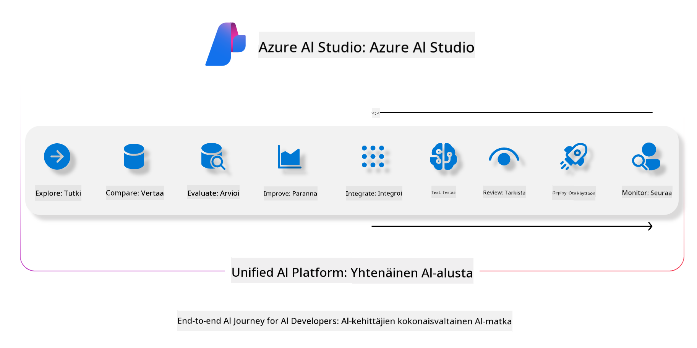
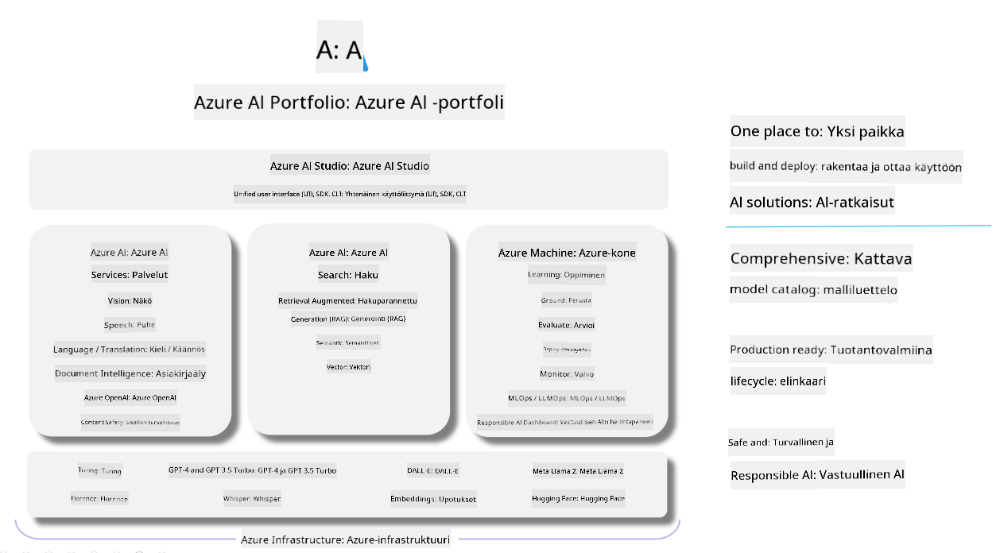

<!--
CO_OP_TRANSLATOR_METADATA:
{
  "original_hash": "7b4235159486df4000e16b7b46ddfec3",
  "translation_date": "2025-07-16T22:32:07+00:00",
  "source_file": "md/01.Introduction/05/AIFoundry.md",
  "language_code": "fi"
}
-->
# **Azure AI Foundryn käyttäminen arviointiin**

Miten arvioida generatiivista AI-sovellustasi käyttäen [Azure AI Foundrya](https://ai.azure.com?WT.mc_id=aiml-138114-kinfeylo). Olipa kyse yksittäisistä tai monivaiheisista keskusteluista, Azure AI Foundry tarjoaa työkaluja mallin suorituskyvyn ja turvallisuuden arviointiin.

## Miten arvioida generatiivisia AI-sovelluksia Azure AI Foundrylla
Lisätietoja löydät [Azure AI Foundryn dokumentaatiosta](https://learn.microsoft.com/azure/ai-studio/how-to/evaluate-generative-ai-app?WT.mc_id=aiml-138114-kinfeylo)

Aloita seuraavien vaiheiden avulla:

## Generatiivisten AI-mallien arviointi Azure AI Foundryssa

**Esivaatimukset**

- Testidataa CSV- tai JSON-muodossa.
- Julkaistu generatiivinen AI-malli (kuten Phi-3, GPT 3.5, GPT 4 tai Davinci-mallit).
- Suoritusympäristö, jossa on laskentaresurssi arvioinnin ajamista varten.

## Sisäänrakennetut arviointimittarit

Azure AI Foundrylla voit arvioida sekä yksittäisiä että monimutkaisia, monivaiheisia keskusteluja.  
Retrieval Augmented Generation (RAG) -tilanteissa, joissa malli perustuu tiettyyn dataan, voit mitata suorituskykyä sisäänrakennetuilla arviointimittareilla.  
Voit myös arvioida yleisiä yksittäisiä kysymys-vastaus -tilanteita (ei-RAG).

## Arviointiajon luominen

Azure AI Foundryn käyttöliittymässä siirry Evaluate- tai Prompt Flow -sivulle.  
Seuraa arvioinnin luontiopasta määrittääksesi arviointiajon. Voit antaa arvioinnille valinnaisen nimen.  
Valitse sovelluksesi tavoitteisiin sopiva skenaario.  
Valitse yksi tai useampi arviointimittari mallin tulosten arvioimiseksi.

## Mukautettu arviointiprosessi (valinnainen)

Joustavuutta varten voit luoda oman mukautetun arviointiprosessin. Räätälöi arviointi vastaamaan tarkasti tarpeitasi.

## Tulosten tarkastelu

Arvioinnin suoritettuasi kirjaa, tarkastele ja analysoi yksityiskohtaisia arviointimittareita Azure AI Foundryssa. Saat arvokasta tietoa sovelluksesi vahvuuksista ja rajoituksista.

**Note** Azure AI Foundry on tällä hetkellä julkisessa esikatseluvaiheessa, joten käytä sitä kokeiluun ja kehitykseen. Tuotantokäyttöön kannattaa harkita muita vaihtoehtoja. Tutustu viralliseen [AI Foundryn dokumentaatioon](https://learn.microsoft.com/azure/ai-studio/?WT.mc_id=aiml-138114-kinfeylo) saadaksesi lisätietoja ja vaiheittaiset ohjeet.

**Vastuuvapauslauseke**:  
Tämä asiakirja on käännetty käyttämällä tekoälypohjaista käännöspalvelua [Co-op Translator](https://github.com/Azure/co-op-translator). Vaikka pyrimme tarkkuuteen, huomioithan, että automaattikäännöksissä saattaa esiintyä virheitä tai epätarkkuuksia. Alkuperäistä asiakirjaa sen alkuperäiskielellä tulee pitää virallisena lähteenä. Tärkeissä tiedoissa suositellaan ammattimaista ihmiskäännöstä. Emme ole vastuussa tämän käännöksen käytöstä aiheutuvista väärinymmärryksistä tai tulkinnoista.