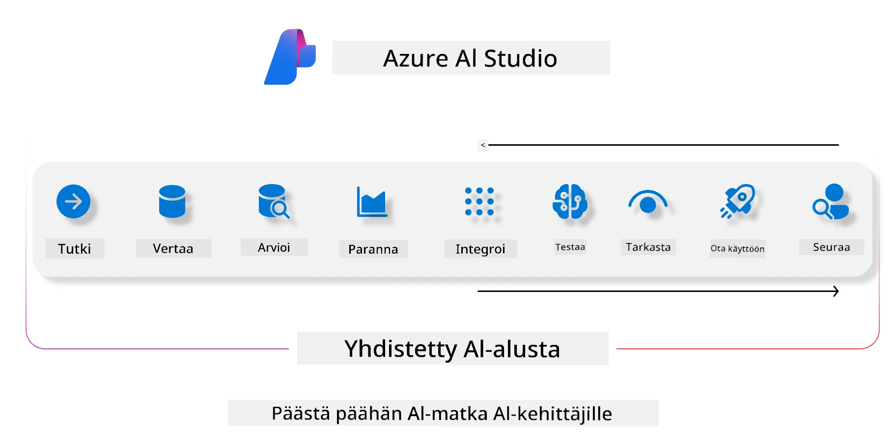
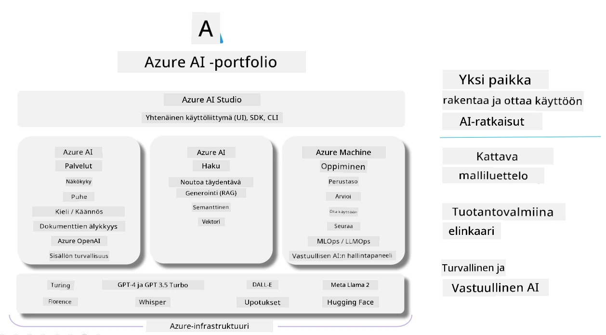

# **Microsoft Foundryn käyttö arviointiin**

Kuinka arvioida generatiivista tekoälysovellustasi käyttäen [Microsoft Foundrya](https://ai.azure.com?WT.mc_id=aiml-138114-kinfeylo). Olitpa sitten arvioimassa yksivaiheisia tai monivaiheisia keskusteluja, Microsoft Foundry tarjoaa työkaluja mallin suorituskyvyn ja turvallisuuden arviointiin.

## Kuinka arvioida generatiivisia tekoälysovelluksia Microsoft Foundryn avulla
Lisätietoja ohjeista löytyy [Microsoft Foundryn dokumentaatiosta](https://learn.microsoft.com/azure/ai-studio/how-to/evaluate-generative-ai-app?WT.mc_id=aiml-138114-kinfeylo)

Tässä ovat aloitusvaiheet:

## Generatiivisten tekoälymallien arviointi Microsoft Foundryssa

**Esivaatimukset**

- Testiaineisto CSV- tai JSON-muodossa.
- Käyttöön otettu generatiivinen tekoälymalli (kuten Phi-3, GPT 3.5, GPT 4 tai Davinci-mallit).
- Suoritusympäristö, jossa on laskentainstanssi arvioinnin suorittamiseen.

## Sisäänrakennetut arviointimittarit

Microsoft Foundry mahdollistaa sekä yksivaiheisten että monimutkaisten monivaiheisten keskustelujen arvioinnin.  
Hakuun perustuvissa generatiivisissa (RAG) skenaarioissa, joissa malli perustuu tiettyihin tietoihin, voit arvioida suorituskykyä sisäänrakennettujen arviointimittareiden avulla.  
Lisäksi voit arvioida yleisiä yksivaiheisia kysymys-vastaus -tilanteita (ei-RAG).

## Arviointiajon luominen

Microsoft Foundryn käyttöliittymästä siirry joko Evaluate-sivulle tai Prompt Flow -sivulle.  
Seuraa arviointiohjatun luomisen vaiheita määrittääksesi arviointiajon. Voit antaa arvioinnillesi valinnaisen nimen.  
Valitse skenaario, joka vastaa sovelluksesi tavoitteita.  
Valitse yksi tai useampi arviointimittari mallin tuoton arvioimiseksi.

## Mukautettu arviointivaihe (valinnainen)

Joustavamman arvioinnin tarpeessa voit perustaa mukautetun arviointivaiheen. Mukauta arviointiprosessia omien erityisvaatimustesi mukaan.

## Tulosten tarkastelu

Arvioinnin suorittamisen jälkeen kirjaudu, tarkastele ja analysoi yksityiskohtaisia arviointimittareita Microsoft Foundryssa. Saat tietoa sovelluksesi kyvyistä ja rajoituksista.

**Huomio** Microsoft Foundry on tällä hetkellä julkisessa esikatselussa, joten käytä sitä kokeilu- ja kehitystarkoituksiin. Tuotantokuormissa harkitse muita vaihtoehtoja. Tutustu viralliseen [AI Foundryn dokumentaatioon](https://learn.microsoft.com/azure/ai-studio/?WT.mc_id=aiml-138114-kinfeylo) saadaksesi lisätietoja ja vaiheittaiset ohjeet.

---

<!-- CO-OP TRANSLATOR DISCLAIMER START -->
**Vastuuvapauslauseke**:  
Tämä asiakirja on käännetty tekoälypohjaisella käännöspalvelulla [Co-op Translator](https://github.com/Azure/co-op-translator). Vaikka pyrimme tarkkuuteen, on hyvä huomioida, että automaattiset käännökset saattavat sisältää virheitä tai epätarkkuuksia. Alkuperäinen asiakirja sen alkuperäiskielellä tulisi pitää virallisena lähteenä. Tärkeiden tietojen osalta suositellaan ammattimaista ihmiskäännöstä. Emme ole vastuussa tämän käännöksen käytöstä aiheutuvista väärinkäsityksistä tai tulkinnoista.
<!-- CO-OP TRANSLATOR DISCLAIMER END -->