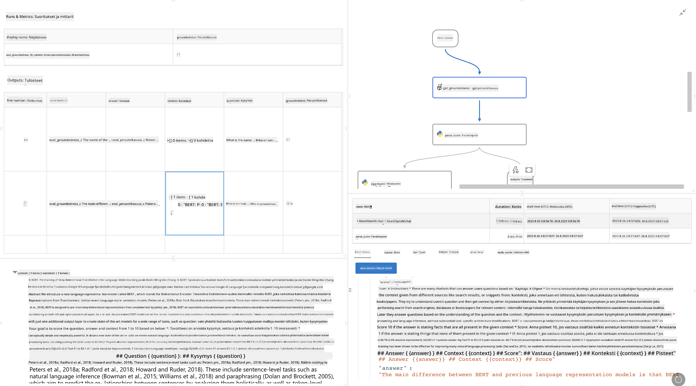

<!--
CO_OP_TRANSLATOR_METADATA:
{
  "original_hash": "3cbe7629d254f1043193b7fe22524d55",
  "translation_date": "2025-05-09T15:15:05+00:00",
  "source_file": "md/01.Introduction/05/Promptflow.md",
  "language_code": "fi"
}
-->
# **Esittele Promptflow**

[Microsoft Prompt Flow](https://microsoft.github.io/promptflow/index.html?WT.mc_id=aiml-138114-kinfeylo) on visuaalinen työnkulkujen automaatiotyökalu, jonka avulla käyttäjät voivat luoda automatisoituja työnkulkuja valmiiden mallien ja mukautettujen liittimien avulla. Se on suunniteltu auttamaan kehittäjiä ja liiketoiminta-analyytikkoja rakentamaan nopeasti automatisoituja prosesseja esimerkiksi tiedonhallintaan, yhteistyöhön ja prosessien optimointiin. Prompt Flown avulla käyttäjät voivat helposti yhdistää erilaisia palveluita, sovelluksia ja järjestelmiä sekä automatisoida monimutkaisia liiketoimintaprosesseja.

Microsoft Prompt Flow on suunniteltu virtaviivaistamaan LLM-mallien (Large Language Models) voimin toimivien tekoälysovellusten koko kehityssykliä. Olitpa sitten ideoimassa, prototyyppaamassa, testaamassa, arvioimassa tai julkaisemassa LLM-pohjaisia sovelluksia, Prompt Flow yksinkertaistaa prosessia ja mahdollistaa tuotantolaatuisten LLM-sovellusten rakentamisen.

## Tässä ovat Microsoft Prompt Flown keskeiset ominaisuudet ja edut:

**Interaktiivinen kirjoituskokemus**

Prompt Flow tarjoaa visuaalisen esityksen työnkulun rakenteesta, mikä helpottaa projektien ymmärtämistä ja navigointia.  
Se tarjoaa muistikirjamaisen koodauskokemuksen tehokkaaseen työnkulkujen kehitykseen ja virheenkorjaukseen.

**Promptin variantit ja hienosäätö**

Luo ja vertaile useita prompt-variantteja iteratiivisen hienosäätöprosessin helpottamiseksi. Arvioi eri promptien suorituskykyä ja valitse tehokkaimmat.

**Valmiit arviointityönkulut**  
Arvioi promptiesi ja työnkulkujesi laatua ja tehokkuutta sisäänrakennettujen arviointityökalujen avulla.  
Ymmärrä, miten hyvin LLM-pohjaiset sovelluksesi toimivat.

**Laajat resurssit**  
Prompt Flow sisältää kirjaston valmiita työkaluja, esimerkkejä ja malleja. Nämä resurssit toimivat kehityksen lähtökohtana, inspiroivat luovuutta ja nopeuttavat prosessia.

**Yhteistyö ja yritysvalmius**  
Tue tiimityöskentelyä sallimalla useiden käyttäjien työskennellä yhdessä prompt-tekniikan projekteissa.  
Hallitse versiohallintaa ja jaa tietoa tehokkaasti. Virtaviivaista koko prompt-tekniikan prosessi kehityksestä ja arvioinnista aina käyttöönottoon ja seurantaan.

## Arviointi Prompt Flow'ssa

Microsoft Prompt Flow'ssa arviointi on keskeisessä roolissa tekoälymallien suorituskyvyn mittaamisessa. Tarkastellaan, miten voit mukauttaa arviointityönkulkuja ja mittareita Prompt Flow'ssa:

**Arvioinnin ymmärtäminen Prompt Flow'ssa**

Prompt Flow'ssa työnkulku edustaa solmujen sarjaa, jotka käsittelevät syötteen ja tuottavat tuloksen. Arviointityönkulut ovat erityisiä työnkulkuja, joiden tarkoituksena on arvioida suorituksen laatua tiettyjen kriteerien ja tavoitteiden perusteella.

**Arviointityönkulkujen keskeiset ominaisuudet**

Ne suoritetaan yleensä testattavan työnkulun jälkeen käyttäen sen tuloksia. Ne laskevat pisteitä tai mittareita mitatakseen testattavan työnkulun suorituskykyä. Mittareina voivat olla tarkkuus, relevanssipisteet tai muut soveltuvat mittarit.

### Arviointityönkulkujen mukauttaminen

**Syötteiden määrittely**

Arviointityönkulkujen tulee ottaa vastaan testattavan suorituksen tulokset. Määrittele syötteet samalla tavalla kuin tavallisissa työnkuluissa.  
Esimerkiksi, jos arvioit QnA-työnkulkua, nimeä syöte "answer". Jos arvioit luokittelutyönkulkua, nimeä syöte "category". Todelliset tulokset (esim. oikeat luokat) voivat myös olla tarpeen.

**Tulosteet ja mittarit**

Arviointityönkulut tuottavat tuloksia, jotka mittaavat testattavan työnkulun suorituskykyä. Mittarit voidaan laskea Pythonilla tai LLM:llä. Käytä log_metric()-funktiota kirjataksesi olennaiset mittarit.

**Mukautettujen arviointityönkulkujen käyttö**

Kehitä oma arviointityönkulku, joka on räätälöity tehtäviisi ja tavoitteisiisi. Mukauta mittareita arviointitavoitteidesi mukaan.  
Käytä tätä mukautettua arviointityönkulkua eräajoissa laajamittaiseen testaukseen.

## Valmiit arviointimenetelmät

Prompt Flow tarjoaa myös valmiita arviointimenetelmiä.  
Voit suorittaa eräajoja ja käyttää näitä menetelmiä arvioidaksesi työnkulun suorituskykyä suurilla tietomäärillä.  
Tarkastele arviointituloksia, vertaile mittareita ja toista tarvittaessa.  
Muista, että arviointi on välttämätöntä, jotta tekoälymallisi täyttävät halutut kriteerit ja tavoitteet. Tutustu viralliseen dokumentaatioon saadaksesi yksityiskohtaiset ohjeet arviointityönkulkujen kehittämiseen ja käyttöön Microsoft Prompt Flow'ssa.

Yhteenvetona, Microsoft Prompt Flow antaa kehittäjille mahdollisuuden luoda korkealaatuisia LLM-sovelluksia yksinkertaistamalla prompt-tekniikkaa ja tarjoamalla vankan kehitysympäristön. Jos työskentelet LLM:ien kanssa, Prompt Flow on arvokas työkalu, jota kannattaa tutkia. Tutustu [Prompt Flow Evaluation Documents](https://learn.microsoft.com/azure/machine-learning/prompt-flow/how-to-develop-an-evaluation-flow?view=azureml-api-2?WT.mc_id=aiml-138114-kinfeylo) saadaksesi yksityiskohtaiset ohjeet arviointityönkulkujen kehittämiseen ja käyttöön Microsoft Prompt Flow'ssa.

**Vastuuvapauslauseke**:  
Tämä asiakirja on käännetty käyttämällä tekoälypohjaista käännöspalvelua [Co-op Translator](https://github.com/Azure/co-op-translator). Vaikka pyrimme tarkkuuteen, huomioithan, että automaattiset käännökset saattavat sisältää virheitä tai epätarkkuuksia. Alkuperäistä asiakirjaa sen alkuperäiskielellä tulee pitää virallisena lähteenä. Tärkeissä asioissa suositellaan ammattimaista ihmiskäännöstä. Emme ole vastuussa tämän käännöksen käytöstä aiheutuvista väärinkäsityksistä tai virhetulkinnoista.