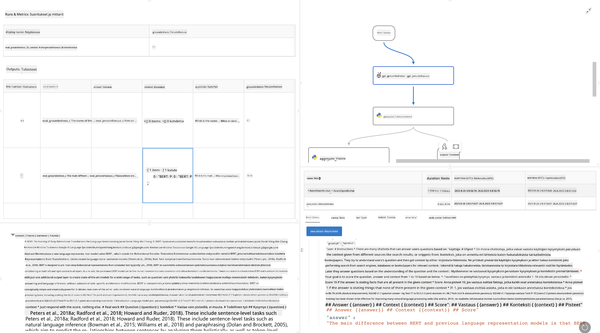

<!--
CO_OP_TRANSLATOR_METADATA:
{
  "original_hash": "3cbe7629d254f1043193b7fe22524d55",
  "translation_date": "2025-07-16T22:41:57+00:00",
  "source_file": "md/01.Introduction/05/Promptflow.md",
  "language_code": "fi"
}
-->
# **Esittele Promptflow**

[Microsoft Prompt Flow](https://microsoft.github.io/promptflow/index.html?WT.mc_id=aiml-138114-kinfeylo) on visuaalinen työnkulkujen automaatiotyökalu, jonka avulla käyttäjät voivat luoda automatisoituja työnkulkuja valmiiden mallien ja mukautettujen liittimien avulla. Se on suunniteltu auttamaan kehittäjiä ja liiketoiminta-analyytikkoja rakentamaan nopeasti automatisoituja prosesseja esimerkiksi tiedonhallintaan, yhteistyöhön ja prosessien optimointiin. Prompt Flown avulla käyttäjät voivat helposti yhdistää eri palveluita, sovelluksia ja järjestelmiä sekä automatisoida monimutkaisia liiketoimintaprosesseja.

Microsoft Prompt Flow on suunniteltu virtaviivaistamaan tekoälysovellusten koko kehityssykliä, joita tukevat suuret kielimallit (LLM). Olitpa sitten ideoimassa, prototypoimassa, testaamassa, arvioimassa tai käyttöönotossa LLM-pohjaisia sovelluksia, Prompt Flow yksinkertaistaa prosessia ja mahdollistaa tuotantotason LLM-sovellusten rakentamisen.

## Tässä ovat Microsoft Prompt Flown keskeiset ominaisuudet ja hyödyt:

**Interaktiivinen kirjoituskokemus**

Prompt Flow tarjoaa visuaalisen esityksen työnkulun rakenteesta, mikä helpottaa projektien ymmärtämistä ja navigointia.
Se tarjoaa muistikirjamaisen koodauskokemuksen tehokkaaseen työnkulkujen kehitykseen ja virheenkorjaukseen.

**Promptin variantit ja hienosäätö**

Luo ja vertaa useita promptin versioita, mikä helpottaa iteratiivista parannusprosessia. Arvioi eri promptien suorituskykyä ja valitse tehokkaimmat.

**Sisäänrakennetut arviointityönkulut**

Arvioi promptiesi ja työnkulkujesi laatua ja tehokkuutta sisäänrakennettujen arviointityökalujen avulla.
Ymmärrä, miten hyvin LLM-pohjaiset sovelluksesi toimivat.

**Laajat resurssit**

Prompt Flow sisältää kirjaston valmiita työkaluja, esimerkkejä ja malleja. Nämä resurssit toimivat kehityksen lähtökohtana, inspiroivat luovuutta ja nopeuttavat prosessia.

**Yhteistyö ja yritysvalmius**

Tukee tiimityöskentelyä sallimalla useiden käyttäjien työskennellä yhdessä prompt-tekniikan projekteissa.
Hallitse versionhallintaa ja jaa tietoa tehokkaasti. Virtaviivaista koko prompt-tekniikan prosessi kehityksestä ja arvioinnista käyttöönottoon ja seurantaan.

## Arviointi Prompt Flow’ssa

Microsoft Prompt Flow’ssa arvioinnilla on keskeinen rooli tekoälymallien suorituskyvyn mittaamisessa. Tarkastellaan, miten voit mukauttaa arviointityönkulkuja ja mittareita Prompt Flow’ssa:

**Arvioinnin ymmärtäminen Prompt Flow’ssa**

Prompt Flow’ssa työnkulku tarkoittaa solmujen sarjaa, jotka käsittelevät syötteen ja tuottavat tuloksen. Arviointityönkulut ovat erityyppisiä työnkulkuja, jotka on suunniteltu mittaamaan suorituksen laatua tiettyjen kriteerien ja tavoitteiden perusteella.

**Arviointityönkulkujen keskeiset ominaisuudet**

Ne suoritetaan yleensä testattavan työnkulun jälkeen käyttäen sen tuottamia tuloksia. Ne laskevat pisteitä tai mittareita testattavan työnkulun suorituskyvyn mittaamiseksi. Mittareina voi olla tarkkuus, relevanssipisteet tai muut asiaankuuluvat mittarit.

### Arviointityönkulkujen mukauttaminen

**Syötteiden määrittely**

Arviointityönkulkujen tulee ottaa vastaan testattavan suorituksen tulokset. Määrittele syötteet samalla tavalla kuin tavallisissa työnkuluissa.
Esimerkiksi, jos arvioit QnA-työnkulkua, nimeä syöte "answer". Jos arvioit luokittelutyönkulkua, nimeä syöte "category". Todelliset arvot (esim. oikeat luokat) voivat myös olla tarpeen.

**Tulosteet ja mittarit**

Arviointityönkulut tuottavat tuloksia, jotka mittaavat testattavan työnkulun suorituskykyä. Mittareita voidaan laskea Pythonilla tai LLM:llä. Käytä log_metric()-funktiota merkkaamaan asiaankuuluvat mittarit.

**Mukautettujen arviointityönkulkujen käyttö**

Kehitä oma arviointityönkulku, joka on räätälöity erityisiin tehtäviisi ja tavoitteisiisi. Mukauta mittareita arviointitavoitteidesi mukaan.
Käytä tätä mukautettua arviointityönkulkua eräajoissa laajamittaiseen testaukseen.

## Sisäänrakennetut arviointimenetelmät

Prompt Flow tarjoaa myös valmiita arviointimenetelmiä.
Voit lähettää eräajoja ja käyttää näitä menetelmiä arvioidaksesi työnkulun suorituskykyä suurilla tietoaineistoilla.
Tarkastele arviointituloksia, vertaa mittareita ja tee tarvittaessa iterointeja.
Muista, että arviointi on välttämätöntä, jotta tekoälymallisi täyttävät halutut kriteerit ja tavoitteet. Tutustu viralliseen dokumentaatioon saadaksesi yksityiskohtaiset ohjeet arviointityönkulkujen kehittämiseen ja käyttöön Microsoft Prompt Flow’ssa.

Yhteenvetona Microsoft Prompt Flow antaa kehittäjille mahdollisuuden luoda korkealaatuisia LLM-sovelluksia yksinkertaistamalla prompt-tekniikkaa ja tarjoamalla vankan kehitysympäristön. Jos työskentelet LLM:ien kanssa, Prompt Flow on arvokas työkalu, jota kannattaa tutkia. Tutustu [Prompt Flow Evaluation Documents](https://learn.microsoft.com/azure/machine-learning/prompt-flow/how-to-develop-an-evaluation-flow?view=azureml-api-2?WT.mc_id=aiml-138114-kinfeylo) -sivustoon saadaksesi yksityiskohtaiset ohjeet arviointityönkulkujen kehittämiseen ja käyttöön Microsoft Prompt Flow’ssa.

**Vastuuvapauslauseke**:  
Tämä asiakirja on käännetty käyttämällä tekoälypohjaista käännöspalvelua [Co-op Translator](https://github.com/Azure/co-op-translator). Vaikka pyrimme tarkkuuteen, huomioithan, että automaattikäännöksissä saattaa esiintyä virheitä tai epätarkkuuksia. Alkuperäistä asiakirjaa sen alkuperäiskielellä tulee pitää virallisena lähteenä. Tärkeissä tiedoissa suositellaan ammattimaista ihmiskäännöstä. Emme ole vastuussa tämän käännöksen käytöstä aiheutuvista väärinymmärryksistä tai tulkinnoista.