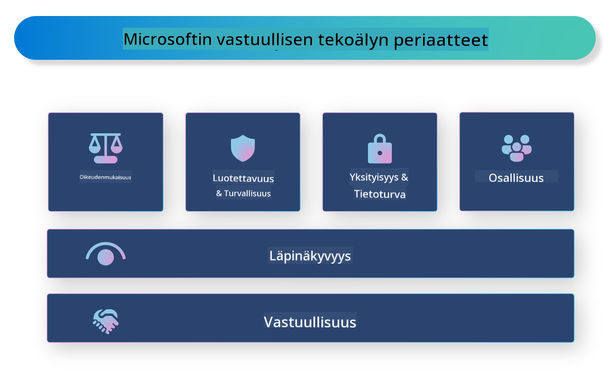

<!--
CO_OP_TRANSLATOR_METADATA:
{
  "original_hash": "805b96b20152936d8f4c587d90d6e06e",
  "translation_date": "2025-05-09T15:38:11+00:00",
  "source_file": "md/01.Introduction/05/ResponsibleAI.md",
  "language_code": "fi"
}
-->
# **Esittely vastuullisesta tekoälystä**

[Microsoft Responsible AI](https://www.microsoft.com/ai/responsible-ai?WT.mc_id=aiml-138114-kinfeylo) on aloite, jonka tavoitteena on auttaa kehittäjiä ja organisaatioita rakentamaan tekoälyjärjestelmiä, jotka ovat läpinäkyviä, luotettavia ja vastuullisia. Aloite tarjoaa ohjeita ja resursseja vastuullisten tekoälyratkaisujen kehittämiseen, jotka noudattavat eettisiä periaatteita, kuten yksityisyyttä, oikeudenmukaisuutta ja läpinäkyvyyttä. Tarkastelemme myös joitakin vastuullisten tekoälyjärjestelmien rakentamiseen liittyviä haasteita ja parhaita käytäntöjä.

## Microsoft Responsible AI:n yleiskatsaus

**Eettiset periaatteet**

Microsoft Responsible AI perustuu joukkoon eettisiä periaatteita, kuten yksityisyys, oikeudenmukaisuus, läpinäkyvyys, vastuullisuus ja turvallisuus. Näiden periaatteiden tarkoituksena on varmistaa, että tekoälyjärjestelmät kehitetään eettisesti ja vastuullisesti.

**Läpinäkyvä tekoäly**

Microsoft Responsible AI korostaa läpinäkyvyyden merkitystä tekoälyjärjestelmissä. Tämä tarkoittaa selkeiden selitysten tarjoamista siitä, miten tekoälymallit toimivat, sekä varmistamista, että tietolähteet ja algoritmit ovat julkisesti saatavilla.

**Vastuullinen tekoäly**

[Microsoft Responsible AI](https://www.microsoft.com/ai/responsible-ai?WT.mc_id=aiml-138114-kinfeylo) edistää vastuullisten tekoälyjärjestelmien kehittämistä, jotka voivat tarjota näkemyksiä siitä, miten tekoälymallit tekevät päätöksiä. Tämä auttaa käyttäjiä ymmärtämään ja luottamaan tekoälyn tuloksiin.

**Osallisuus**

Tekoälyjärjestelmien tulisi olla suunniteltuja hyödyttämään kaikkia. Microsoft pyrkii luomaan osallistavaa tekoälyä, joka huomioi moninaiset näkökulmat ja välttää puolueellisuutta tai syrjintää.

**Luotettavuus ja turvallisuus**

On ratkaisevan tärkeää varmistaa, että tekoälyjärjestelmät ovat luotettavia ja turvallisia. Microsoft keskittyy rakentamaan kestäviä malleja, jotka toimivat johdonmukaisesti ja välttävät haitallisia seurauksia.

**Oikeudenmukaisuus tekoälyssä**

Microsoft Responsible AI tunnistaa, että tekoälyjärjestelmät voivat ylläpitää ennakkoluuloja, jos ne koulutetaan puolueellisilla tiedoilla tai algoritmeilla. Aloite tarjoaa ohjeita oikeudenmukaisten tekoälyjärjestelmien kehittämiseen, jotka eivät syrji esimerkiksi rodun, sukupuolen tai iän perusteella.

**Yksityisyys ja tietoturva**

Microsoft Responsible AI korostaa käyttäjien yksityisyyden ja tietoturvan suojaamisen tärkeyttä tekoälyjärjestelmissä. Tämä sisältää vahvan tiedon salauksen ja pääsynhallinnan toteuttamisen sekä säännölliset auditoinnit haavoittuvuuksien varalta.

**Vastuullisuus ja vastuu**

Microsoft Responsible AI edistää vastuullisuutta ja vastuuta tekoälyn kehittämisessä ja käyttöönotossa. Tämä tarkoittaa, että kehittäjien ja organisaatioiden tulee olla tietoisia tekoälyjärjestelmiin liittyvistä riskeistä ja ryhtyä toimiin niiden minimoimiseksi.

## Parhaat käytännöt vastuullisten tekoälyjärjestelmien rakentamiseen

**Kehitä tekoälymalleja käyttämällä monipuolisia tietoaineistoja**

Puolueellisuuden välttämiseksi tekoälyjärjestelmissä on tärkeää käyttää monipuolisia tietoaineistoja, jotka edustavat erilaisia näkökulmia ja kokemuksia.

**Käytä selitettäviä tekoälymenetelmiä**

Selitettävät tekoälymenetelmät auttavat käyttäjiä ymmärtämään, miten tekoälymallit tekevät päätöksiä, mikä voi lisätä luottamusta järjestelmään.

**Tarkasta tekoälyjärjestelmät säännöllisesti haavoittuvuuksien varalta**

Säännölliset auditoinnit auttavat tunnistamaan mahdolliset riskit ja haavoittuvuudet, jotka on korjattava.

**Ota käyttöön vahva tiedon salaus ja pääsynhallinta**

Tiedon salaus ja pääsynhallinta auttavat suojaamaan käyttäjien yksityisyyttä ja turvallisuutta tekoälyjärjestelmissä.

**Noudata eettisiä periaatteita tekoälyn kehittämisessä**

Eettisten periaatteiden, kuten oikeudenmukaisuuden, läpinäkyvyyden ja vastuullisuuden, noudattaminen auttaa rakentamaan luottamusta tekoälyjärjestelmiin ja varmistaa, että ne kehitetään vastuullisesti.

## Vastuullinen tekoäly Azure AI Foundryn avulla

[Azure AI Foundry](https://ai.azure.com?WT.mc_id=aiml-138114-kinfeylo) on tehokas alusta, joka mahdollistaa kehittäjien ja organisaatioiden nopean älykkäiden, edistyksellisten, markkinoille valmiiden ja vastuullisten sovellusten luomisen. Tässä joitakin Azure AI Foundryn keskeisiä ominaisuuksia ja kyvykkyyksiä:

**Valmiit API:t ja mallit**

Azure AI Foundry tarjoaa valmiita ja muokattavia API:ita ja malleja, jotka kattavat laajan valikoiman tekoälytehtäviä, kuten generatiivinen tekoäly, luonnollisen kielen käsittely keskusteluissa, haku, valvonta, käännökset, puhe, näkö ja päätöksenteko.

**Prompt Flow**

Prompt flow Azure AI Foundryssa mahdollistaa keskustelevien tekoälykokemusten luomisen. Sen avulla voit suunnitella ja hallita keskusteluvaiheita, mikä helpottaa chatbotien, virtuaaliassistenttien ja muiden interaktiivisten sovellusten rakentamista.

**Retrieval Augmented Generation (RAG)**

RAG on tekniikka, joka yhdistää hakuperusteisen ja generatiivisen lähestymistavan. Se parantaa tuotettujen vastausten laatua hyödyntämällä sekä olemassa olevaa tietoa (haku) että luovaa generointia (generointi).

**Generatiivisen tekoälyn arviointi- ja valvontamittarit**

Azure AI Foundry tarjoaa työkaluja generatiivisten tekoälymallien arviointiin ja valvontaan. Voit arvioida niiden suorituskykyä, oikeudenmukaisuutta ja muita tärkeitä mittareita vastuullisen käyttöönoton varmistamiseksi. Lisäksi, jos olet luonut kojelaudan, voit käyttää Azure Machine Learning Studion no-code-käyttöliittymää mukauttaaksesi ja luodaksesi Responsible AI Dashboardin ja siihen liittyvän pistetaulukon [Responsible AI Toolbox](https://responsibleaitoolbox.ai/?WT.mc_id=aiml-138114-kinfeylo) Python-kirjastojen pohjalta. Tämä pistetaulukko auttaa jakamaan keskeisiä näkemyksiä oikeudenmukaisuudesta, ominaisuuksien merkityksestä ja muista vastuulliseen käyttöönottoon liittyvistä näkökohdista sekä teknisille että ei-teknisille sidosryhmille.

Vastuullisen tekoälyn hyödyntämiseksi AI Foundryn kanssa voit noudattaa näitä parhaita käytäntöjä:

**Määrittele tekoälyjärjestelmän ongelma ja tavoitteet**

Ennen kehitysprosessin aloittamista on tärkeää määritellä selkeästi se ongelma tai tavoite, jonka tekoälyjärjestelmä pyrkii ratkaisemaan. Tämä auttaa tunnistamaan tarvittavat tiedot, algoritmit ja resurssit tehokkaan mallin rakentamiseksi.

**Kerää ja esikäsittele relevantti data**

Tekoälyjärjestelmän koulutuksessa käytetyn datan laatu ja määrä vaikuttavat merkittävästi sen suorituskykyyn. Siksi on tärkeää kerätä relevanttia dataa, puhdistaa ja esikäsitellä se sekä varmistaa, että se edustaa kohdeyleisöä tai ratkaistavaa ongelmaa.

**Valitse sopiva arviointimenetelmä**

Saatavilla on erilaisia arviointialgoritmeja. On tärkeää valita dataasi ja ongelmaasi parhaiten sopiva menetelmä.

**Arvioi ja tulkitse malli**

Kun tekoälymalli on rakennettu, sen suorituskyky on arvioitava sopivilla mittareilla ja tulokset on tulkittava läpinäkyvästi. Tämä auttaa tunnistamaan mahdolliset vinoumat tai rajoitukset mallissa ja tekemään tarvittavia parannuksia.

**Varmista läpinäkyvyys ja selitettävyys**

Tekoälyjärjestelmien tulee olla läpinäkyviä ja selitettäviä, jotta käyttäjät ymmärtävät, miten ne toimivat ja miten päätökset tehdään. Tämä on erityisen tärkeää sovelluksissa, joilla on merkittäviä vaikutuksia ihmisten elämään, kuten terveydenhuollossa, rahoituksessa ja oikeusjärjestelmässä.

**Valvo ja päivitä malli**

Tekoälyjärjestelmiä tulee valvoa ja päivittää jatkuvasti, jotta ne pysyvät tarkkoina ja tehokkaina ajan myötä. Tämä vaatii jatkuvaa ylläpitoa, testausta ja mallin uudelleenkoulutusta.

Yhteenvetona Microsoft Responsible AI on aloite, jonka tavoitteena on auttaa kehittäjiä ja organisaatioita rakentamaan tekoälyjärjestelmiä, jotka ovat läpinäkyviä, luotettavia ja vastuullisia. Muista, että vastuullinen tekoälyn käyttöönotto on ratkaisevan tärkeää, ja Azure AI Foundry pyrkii tekemään siitä käytännöllistä organisaatioille. Noudattamalla eettisiä periaatteita ja parhaita käytäntöjä voimme varmistaa, että tekoälyjärjestelmät kehitetään ja otetaan käyttöön vastuullisesti, mikä hyödyttää koko yhteiskuntaa.

**Vastuuvapauslauseke**:  
Tämä asiakirja on käännetty käyttämällä tekoälypohjaista käännöspalvelua [Co-op Translator](https://github.com/Azure/co-op-translator). Vaikka pyrimme tarkkuuteen, ole hyvä ja huomioi, että automaattikäännöksissä voi esiintyä virheitä tai epätarkkuuksia. Alkuperäistä asiakirjaa sen alkuperäiskielellä tulee pitää virallisena lähteenä. Tärkeissä asioissa suositellaan ammattimaista ihmiskäännöstä. Emme ole vastuussa tämän käännöksen käytöstä aiheutuvista väärinkäsityksistä tai virhetulkinnoista.