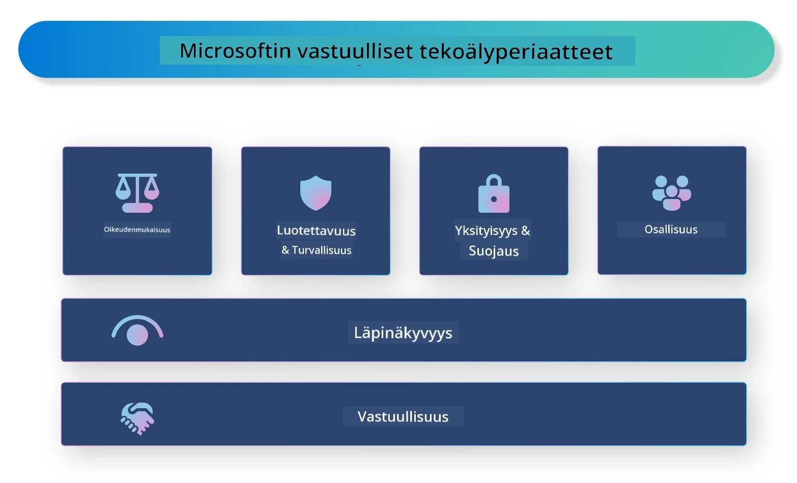

# **Esittely vastuullisesta tekoälystä**

[Microsoft Responsible AI](https://www.microsoft.com/ai/responsible-ai?WT.mc_id=aiml-138114-kinfeylo) on aloite, jonka tavoitteena on auttaa kehittäjiä ja organisaatioita rakentamaan tekoälyjärjestelmiä, jotka ovat läpinäkyviä, luotettavia ja vastuullisia. Aloite tarjoaa ohjeistusta ja resursseja vastuullisten tekoälyratkaisujen kehittämiseen, jotka ovat linjassa eettisten periaatteiden, kuten yksityisyyden, oikeudenmukaisuuden ja läpinäkyvyyden kanssa. Tutustumme myös joihinkin haasteisiin ja parhaisiin käytäntöihin, jotka liittyvät vastuullisten tekoälyjärjestelmien rakentamiseen.

## Microsoft Responsible AI:n yleiskatsaus

**Eettiset periaatteet**

Microsoft Responsible AI:tä ohjaavat joukko eettisiä periaatteita, kuten yksityisyys, oikeudenmukaisuus, läpinäkyvyys, vastuullisuus ja turvallisuus. Näiden periaatteiden tarkoituksena on varmistaa, että tekoälyjärjestelmät kehitetään eettisellä ja vastuullisella tavalla.

**Läpinäkyvä tekoäly**

Microsoft Responsible AI korostaa läpinäkyvyyden merkitystä tekoälyjärjestelmissä. Tämä tarkoittaa selkeiden selitysten tarjoamista siitä, miten tekoälymallit toimivat, sekä sen varmistamista, että tietolähteet ja algoritmit ovat julkisesti saatavilla.

**Vastuullinen tekoäly**

[Microsoft Responsible AI](https://www.microsoft.com/ai/responsible-ai?WT.mc_id=aiml-138114-kinfeylo) edistää vastuullisten tekoälyjärjestelmien kehittämistä, jotka voivat tarjota näkemyksiä siitä, miten tekoälymallit tekevät päätöksiä. Tämä voi auttaa käyttäjiä ymmärtämään ja luottamaan tekoälyjärjestelmien tuloksiin.

**Osallisuus**

Tekoälyjärjestelmien tulisi olla suunniteltu hyödyttämään kaikkia. Microsoft pyrkii luomaan osallistavaa tekoälyä, joka ottaa huomioon moninaiset näkökulmat ja välttää vinoumia tai syrjintää.

**Luotettavuus ja turvallisuus**

Tekoälyjärjestelmien luotettavuuden ja turvallisuuden varmistaminen on ratkaisevan tärkeää. Microsoft keskittyy rakentamaan kestäviä malleja, jotka toimivat johdonmukaisesti ja välttävät haitallisia seurauksia.

**Oikeudenmukaisuus tekoälyssä**

Microsoft Responsible AI tunnustaa, että tekoälyjärjestelmät voivat ylläpitää vinoumia, jos ne on koulutettu vinoutuneilla datoilla tai algoritmeilla. Aloite tarjoaa ohjeistusta oikeudenmukaisten tekoälyjärjestelmien kehittämiseen, jotka eivät syrji esimerkiksi rodun, sukupuolen tai iän perusteella.

**Yksityisyys ja turvallisuus**

Microsoft Responsible AI korostaa käyttäjien yksityisyyden ja datan turvallisuuden suojaamisen merkitystä tekoälyjärjestelmissä. Tämä sisältää vahvan datan salauksen ja käyttöoikeuksien hallinnan toteuttamisen sekä tekoälyjärjestelmien säännöllisen auditoinnin haavoittuvuuksien varalta.

**Vastuullisuus ja vastuu**

Microsoft Responsible AI edistää vastuullisuutta ja vastuuta tekoälyn kehittämisessä ja käyttöönotossa. Tämä sisältää sen varmistamisen, että kehittäjät ja organisaatiot ovat tietoisia tekoälyjärjestelmiin liittyvistä mahdollisista riskeistä ja ryhtyvät toimenpiteisiin näiden riskien vähentämiseksi.

## Parhaat käytännöt vastuullisten tekoälyjärjestelmien rakentamiseen

**Kehitä tekoälymalleja käyttämällä monipuolisia aineistoja**

Vääristymien välttämiseksi tekoälyjärjestelmissä on tärkeää käyttää monipuolisia aineistoja, jotka edustavat erilaisia näkökulmia ja kokemuksia.

**Käytä selitettäviä tekoälytekniikoita**

Selitettävät tekoälytekniikat voivat auttaa käyttäjiä ymmärtämään, miten tekoälymallit tekevät päätöksiä, mikä voi lisätä luottamusta järjestelmään.

**Auditoi tekoälyjärjestelmiä säännöllisesti haavoittuvuuksien varalta**

Tekoälyjärjestelmien säännölliset auditoinnit voivat auttaa tunnistamaan mahdolliset riskit ja haavoittuvuudet, jotka vaativat huomiota.

**Toteuta vahva datan salaus ja käyttöoikeuksien hallinta**

Datan salaus ja käyttöoikeuksien hallinta voivat auttaa suojaamaan käyttäjien yksityisyyttä ja turvallisuutta tekoälyjärjestelmissä.

**Noudata eettisiä periaatteita tekoälyn kehittämisessä**

Eettisten periaatteiden, kuten oikeudenmukaisuuden, läpinäkyvyyden ja vastuullisuuden noudattaminen auttaa rakentamaan luottamusta tekoälyjärjestelmiin ja varmistaa, että ne kehitetään vastuullisesti.

## AI Foundryn käyttäminen vastuulliseen tekoälyyn

[Microsoft Foundry](https://ai.azure.com?WT.mc_id=aiml-138114-kinfeylo) on tehokas alusta, joka mahdollistaa kehittäjien ja organisaatioiden nopean älykkäiden, huipputeknisten, markkinoille valmiiden ja vastuullisten sovellusten luomisen. Tässä on joitakin Microsoft Foundryn keskeisiä ominaisuuksia ja kykyjä:

**Valmiit API:t ja mallit**

Microsoft Foundry tarjoaa valmiita ja räätälöitäviä API:ita ja malleja. Ne kattavat laajan valikoiman tekoälytehtäviä, mukaan lukien generatiivinen tekoäly, luonnollisen kielen käsittely keskusteluissa, haku, valvonta, kääntäminen, puhe, näkö ja päätöksenteko.

**Prompt Flow**

Prompt flow Microsoft Foundryssa mahdollistaa keskustelevien tekoälykokemusten luomisen. Sen avulla voi suunnitella ja hallita keskusteluvaiheita, mikä helpottaa chatbotien, virtuaaliassistenttien ja muiden vuorovaikutteisten sovellusten rakentamista.

**Retrieval Augmented Generation (RAG)**

RAG on tekniikka, joka yhdistää hakupohjaisen ja generatiivisen lähestymistavan. Se parantaa tuotettujen vastausten laatua hyödyntämällä sekä olemassa olevaa tietoa (hakeminen) että luovaa generointia.

**Generatiivisen tekoälyn arviointi- ja valvontamittarit**

Microsoft Foundry tarjoaa työkaluja generatiivisten tekoälymallien arviointiin ja valvontaan. Voit arvioida niiden suorituskykyä, oikeudenmukaisuutta ja muita tärkeitä mittareita vastuullisen käyttöönoton varmistamiseksi. Lisäksi, jos olet luonut kojelaudan, voit käyttää ei-koodattavaa käyttöliittymää Azure Machine Learning Studio:ssa mukauttaaksesi ja luodaksesi Responsible AI Dashboardin ja siihen liittyvän pistetaulukon, joka perustuu [Repsonsible AI Toolbox](https://responsibleaitoolbox.ai/?WT.mc_id=aiml-138114-kinfeylo) Python-kirjastoihin. Tämä pistetaulukko auttaa jakamaan keskeisiä oivalluksia, jotka liittyvät oikeudenmukaisuuteen, ominaisuuksien merkitykseen ja muihin vastuulliseen käyttöönottoon liittyviin seikkoihin sekä teknisille että ei-teknisille sidosryhmille.

Vastuullisen tekoälyn käyttämiseksi AI Foundryn kanssa voit noudattaa näitä parhaita käytäntöjä:

**Määrittele tekoälyjärjestelmäsi ongelma ja tavoitteet**

Ennen kehitysprosessin aloittamista on tärkeää määritellä selkeästi ongelma tai tavoite, jonka tekoälyjärjestelmäsi pyrkii ratkaisemaan. Tämä auttaa tunnistamaan tarvittavat tiedot, algoritmit ja resurssit tehokkaan mallin rakentamiseksi.

**Kerää ja esikäsittele relevantti data**

Tekoälyjärjestelmän koulutuksessa käytetyn datan laatu ja määrä voivat vaikuttaa merkittävästi sen suorituskykyyn. Siksi on tärkeää kerätä relevantti data, puhdistaa se, esikäsitellä se ja varmistaa, että se edustaa väestöä tai ongelmaa, jota olet ratkaisemassa.

**Valitse sopiva arviointimenetelmä**

Saatavilla on erilaisia arviointialgoritmeja. On tärkeää valita dataasi ja ongelmaasi parhaiten soveltuva algoritmi.

**Arvioi ja tulkitse malli**

Kun olet rakentanut tekoälymallin, on tärkeää arvioida sen suorituskyky sopivilla mittareilla ja tulkita tulokset läpinäkyvästi. Tämä auttaa tunnistamaan mahdolliset vinoumat tai rajoitukset mallissa ja tekemään tarvittavat parannukset.

**Varmista läpinäkyvyys ja selitettävyys**

Tekoälyjärjestelmien tulee olla läpinäkyviä ja selitettäviä, jotta käyttäjät voivat ymmärtää, miten ne toimivat ja miten päätökset tehdään. Tämä on erityisen tärkeää sovelluksissa, joilla on merkittäviä vaikutuksia ihmisten elämään, kuten terveydenhuollossa, rahoituksessa ja oikeusjärjestelmissä.

**Seuraa ja päivitä mallia**

Tekoälyjärjestelmiä tulee jatkuvasti valvoa ja päivittää, jotta ne pysyvät ajan tasalla ja tehokkaina. Tämä vaatii jatkuvaa ylläpitoa, testausta ja mallin uudelleenkoulutusta.

Yhteenvetona Microsoft Responsible AI on aloite, jonka tavoitteena on auttaa kehittäjiä ja organisaatioita rakentamaan tekoälyjärjestelmiä, jotka ovat läpinäkyviä, luotettavia ja vastuullisia. Muista, että vastuullinen tekoälyn toteutus on ratkaisevan tärkeää, ja Microsoft Foundryn tavoitteena on tehdä siitä käytännöllistä organisaatioille. Noudattamalla eettisiä periaatteita ja parhaita käytäntöjä voimme varmistaa, että tekoälyjärjestelmät kehitetään ja käyttöönotetaan vastuullisesti, mikä hyödyttää koko yhteiskuntaa.

---

<!-- CO-OP TRANSLATOR DISCLAIMER START -->
**Vastuuvapauslauseke**:  
Tämä asiakirja on käännetty käyttäen tekoälypohjaista käännöspalvelua [Co-op Translator](https://github.com/Azure/co-op-translator). Pyrimme tarkkuuteen, mutta otathan huomioon, että automaattikäännöksissä saattaa esiintyä virheitä tai epätarkkuuksia. Alkuperäinen asiakirja sen omalla kielellä on ensisijainen ja virallinen lähde. Tärkeissä asioissa suositellaan ammattilaisen tekemää ihmiskäännöstä. Emme ole vastuussa tämän käännöksen käytöstä mahdollisesti aiheutuvista väärinymmärryksistä tai tulkinnoista.
<!-- CO-OP TRANSLATOR DISCLAIMER END -->