<!--
CO_OP_TRANSLATOR_METADATA:
{
  "original_hash": "80a853c08e4ee25ef9b4bfcedd8990da",
  "translation_date": "2025-05-09T16:49:54+00:00",
  "source_file": "md/02.Application/01.TextAndChat/Phi3/E2E_Phi-3-Evaluation_AIFoundry.md",
  "language_code": "fi"
}
-->
# Arvioi hienosäädetty Phi-3 / Phi-3.5 -malli Azure AI Foundryssa keskittyen Microsoftin vastuullisen tekoälyn periaatteisiin

Tämä kokonaisvaltainen (E2E) esimerkki perustuu Microsoft Tech Communityn oppaaseen "[Evaluate Fine-tuned Phi-3 / 3.5 Models in Azure AI Foundry Focusing on Microsoft's Responsible AI](https://techcommunity.microsoft.com/blog/educatordeveloperblog/evaluate-fine-tuned-phi-3--3-5-models-in-azure-ai-studio-focusing-on-microsofts-/4227850?WT.mc_id=aiml-137032-kinfeylo)".

## Yleiskatsaus

### Miten voit arvioida hienosäädetyn Phi-3 / Phi-3.5 -mallin turvallisuutta ja suorituskykyä Azure AI Foundryssa?

Mallin hienosäätö voi joskus johtaa odottamattomiin tai ei-toivottuihin vastauksiin. Varmistaaksesi, että malli pysyy turvallisena ja tehokkaana, on tärkeää arvioida sen kykyä tuottaa haitallista sisältöä sekä sen kykyä tuottaa tarkkoja, asiaankuuluvia ja johdonmukaisia vastauksia. Tässä ohjeessa opit, miten arvioida hienosäädetyn Phi-3 / Phi-3.5 -mallin turvallisuutta ja suorituskykyä, joka on integroitu Prompt flow’hun Azure AI Foundryssa.

Tässä on Azure AI Foundryn arviointiprosessi.

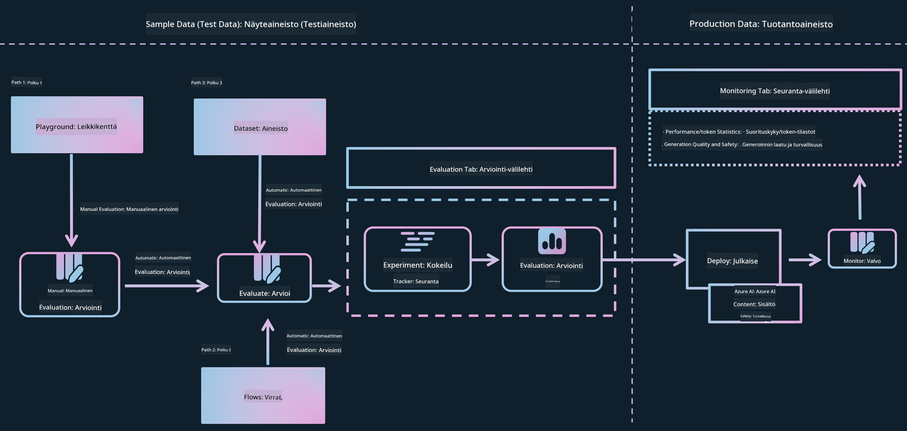

*Kuvien lähde: [Evaluation of generative AI applications](https://learn.microsoft.com/azure/ai-studio/concepts/evaluation-approach-gen-ai?wt.mc_id%3Dstudentamb_279723)*

> [!NOTE]
>
> Lisätietoja ja lisäresursseja Phi-3 / Phi-3.5 -malleista löydät [Phi-3CookBook](https://github.com/microsoft/Phi-3CookBook?wt.mc_id=studentamb_279723) -sivustolta.

### Esivaatimukset

- [Python](https://www.python.org/downloads)
- [Azure-tilaus](https://azure.microsoft.com/free?wt.mc_id=studentamb_279723)
- [Visual Studio Code](https://code.visualstudio.com)
- Hienosäädetty Phi-3 / Phi-3.5 -malli

### Sisällysluettelo

1. [**Tilanne 1: Johdanto Azure AI Foundryn Prompt flow -arviointiin**](../../../../../../md/02.Application/01.TextAndChat/Phi3)

    - [Johdanto turvallisuusarviointiin](../../../../../../md/02.Application/01.TextAndChat/Phi3)
    - [Johdanto suorituskykyarviointiin](../../../../../../md/02.Application/01.TextAndChat/Phi3)

1. [**Tilanne 2: Phi-3 / Phi-3.5 -mallin arviointi Azure AI Foundryssa**](../../../../../../md/02.Application/01.TextAndChat/Phi3)

    - [Ennen aloittamista](../../../../../../md/02.Application/01.TextAndChat/Phi3)
    - [Ota Azure OpenAI käyttöön Phi-3 / Phi-3.5 -mallin arviointia varten](../../../../../../md/02.Application/01.TextAndChat/Phi3)
    - [Arvioi hienosäädetty Phi-3 / Phi-3.5 -malli Azure AI Foundryn Prompt flow -arvioinnilla](../../../../../../md/02.Application/01.TextAndChat/Phi3)

1. [Onnittelut!](../../../../../../md/02.Application/01.TextAndChat/Phi3)

## **Tilanne 1: Johdanto Azure AI Foundryn Prompt flow -arviointiin**

### Johdanto turvallisuusarviointiin

Varmistaaksesi, että tekoälymallisi on eettinen ja turvallinen, on tärkeää arvioida sitä Microsoftin vastuullisen tekoälyn periaatteiden mukaisesti. Azure AI Foundryssa turvallisuusarvioinnit mahdollistavat mallin haavoittuvuuden arvioinnin jailbreak-hyökkäyksiä vastaan sekä sen potentiaalin tuottaa haitallista sisältöä, mikä on suoraan linjassa näiden periaatteiden kanssa.


*Kuvien lähde: [Evaluation of generative AI applications](https://learn.microsoft.com/azure/ai-studio/concepts/evaluation-approach-gen-ai?wt.mc_id%3Dstudentamb_279723)*

#### Microsoftin vastuullisen tekoälyn periaatteet

Ennen teknisten vaiheiden aloittamista on tärkeää ymmärtää Microsoftin vastuullisen tekoälyn periaatteet, jotka muodostavat eettisen viitekehyksen tekoälyjärjestelmien vastuulliselle kehittämiselle, käyttöönotolle ja toiminnalle. Nämä periaatteet ohjaavat tekoälyjärjestelmien vastuullista suunnittelua, kehitystä ja käyttöönottoa varmistaen, että tekoälyteknologiat rakennetaan oikeudenmukaisesti, läpinäkyvästi ja osallistavasti. Nämä periaatteet ovat tekoälymallien turvallisuuden arvioinnin perusta.

Microsoftin vastuullisen tekoälyn periaatteet ovat:

- **Oikeudenmukaisuus ja osallisuus**: Tekoälyjärjestelmien tulee kohdella kaikkia tasapuolisesti eivätkä ne saa vaikuttaa eri tavoin samanlaisessa asemassa oleviin ryhmiin. Esimerkiksi, kun tekoäly antaa ohjeita lääketieteellisestä hoidosta, lainahakemuksista tai työllistymisestä, sen tulee antaa samat suositukset kaikille, joilla on samankaltaiset oireet, taloudellinen tilanne tai ammatilliset pätevyydet.

- **Luotettavuus ja turvallisuus**: Luottamuksen rakentamiseksi on kriittistä, että tekoälyjärjestelmät toimivat luotettavasti, turvallisesti ja johdonmukaisesti. Näiden järjestelmien tulee toimia suunnitellusti, reagoida turvallisesti odottamattomiin tilanteisiin ja vastustaa haitallista manipulointia. Niiden käyttäytyminen ja kyky käsitellä erilaisia olosuhteita heijastavat niitä tilanteita ja olosuhteita, joita kehittäjät ovat ennakoineet suunnittelun ja testauksen aikana.

- **Läpinäkyvyys**: Kun tekoälyjärjestelmät auttavat tekemään päätöksiä, joilla on suuri vaikutus ihmisten elämään, on tärkeää, että ihmiset ymmärtävät, miten nämä päätökset on tehty. Esimerkiksi pankki saattaa käyttää tekoälyä päättämään henkilön luottokelpoisuudesta. Yritys saattaa käyttää tekoälyä valitsemaan pätevimmät ehdokkaat rekrytointiin.

- **Yksityisyys ja turvallisuus**: Kun tekoäly yleistyy, yksityisyyden suojaaminen ja henkilö- sekä liiketoimintatietojen turvaaminen ovat yhä tärkeämpiä ja monimutkaisempia. Tekoälyn kohdalla yksityisyyteen ja tietoturvaan on kiinnitettävä erityistä huomiota, koska tietojen saatavuus on olennaista tekoälyjärjestelmien tarkkojen ja informoitujen ennusteiden ja päätösten tekemisessä.

- **Vastuullisuus**: Ne, jotka suunnittelevat ja ottavat käyttöön tekoälyjärjestelmiä, ovat vastuussa niiden toiminnasta. Organisaatioiden tulisi hyödyntää alan standardeja kehittääkseen vastuullisuusnormeja. Näillä normeilla varmistetaan, etteivät tekoälyjärjestelmät ole viimeinen päätöksentekijä ihmisten elämään vaikuttavissa asioissa. Lisäksi ne takaavat, että ihmiset säilyttävät merkittävän kontrollin muuten erittäin autonomisten tekoälyjärjestelmien yli.

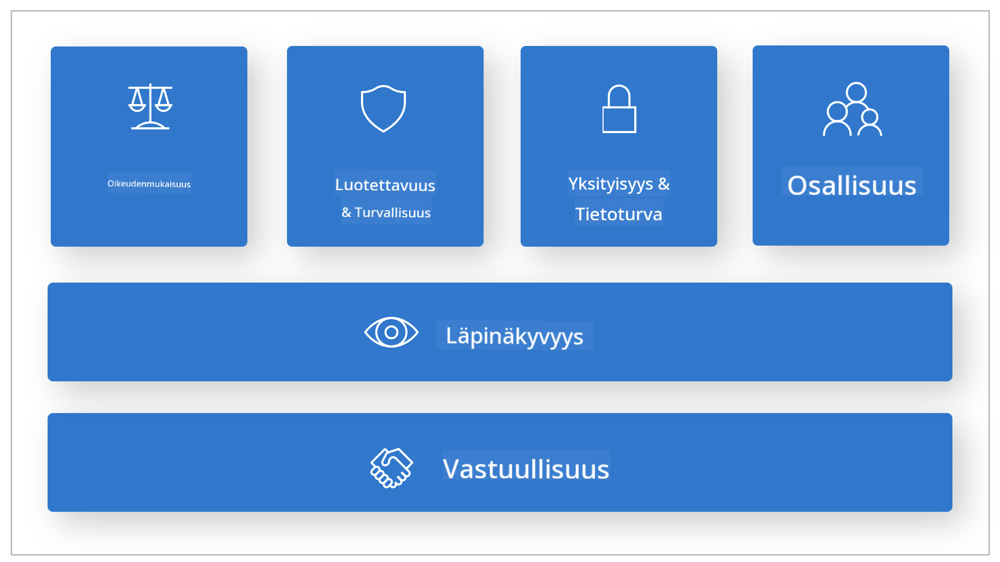

*Kuvien lähde: [What is Responsible AI?](https://learn.microsoft.com/azure/machine-learning/concept-responsible-ai?view=azureml-api-2&viewFallbackFrom=azureml-api-2%253fwt.mc_id%3Dstudentamb_279723)*

> [!NOTE]
> Lisätietoja Microsoftin vastuullisen tekoälyn periaatteista löydät sivulta [What is Responsible AI?](https://learn.microsoft.com/azure/machine-learning/concept-responsible-ai?view=azureml-api-2?wt.mc_id=studentamb_279723).

#### Turvallisuusmittarit

Tässä ohjeessa arvioit hienosäädetyn Phi-3 -mallin turvallisuutta Azure AI Foundryn turvallisuusmittareilla. Nämä mittarit auttavat arvioimaan mallin kykyä tuottaa haitallista sisältöä sekä sen haavoittuvuutta jailbreak-hyökkäyksille. Turvallisuusmittarit sisältävät:

- **Itseensä kohdistuvaa vahinkoa käsittelevä sisältö**: Arvioi, onko mallilla taipumusta tuottaa itseä vahingoittavaan sisältöä.
- **Vihamielinen ja epäoikeudenmukainen sisältö**: Arvioi, onko mallilla taipumusta tuottaa vihamielistä tai epäoikeudenmukaista sisältöä.
- **Väkivaltainen sisältö**: Arvioi, onko mallilla taipumusta tuottaa väkivaltaista sisältöä.
- **Seksuaalinen sisältö**: Arvioi, onko mallilla taipumusta tuottaa sopimatonta seksuaalista sisältöä.

Näiden osa-alueiden arviointi varmistaa, ettei tekoälymalli tuota haitallista tai loukkaavaa sisältöä, mikä vastaa yhteiskunnallisia arvoja ja sääntelyvaatimuksia.

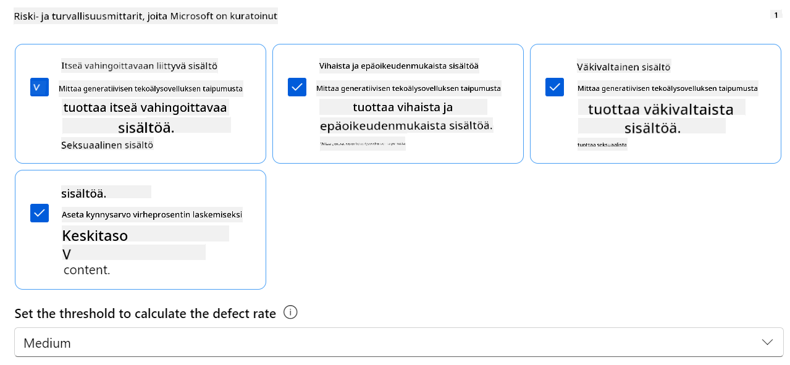

### Johdanto suorituskykyarviointiin

Varmistaaksesi, että tekoälymallisi toimii odotetusti, on tärkeää arvioida sen suorituskykyä suorituskykymittareiden avulla. Azure AI Foundryssa suorituskykyarvioinnit mahdollistavat mallin tehokkuuden arvioinnin tarkkojen, asiaankuuluvien ja johdonmukaisten vastausten tuottamisessa.


*Kuvien lähde: [Evaluation of generative AI applications](https://learn.microsoft.com/azure/ai-studio/concepts/evaluation-approach-gen-ai?wt.mc_id%3Dstudentamb_279723)*

#### Suorituskykymittarit

Tässä ohjeessa arvioit hienosäädetyn Phi-3 / Phi-3.5 -mallin suorituskykyä Azure AI Foundryn suorituskykymittareilla. Nämä mittarit auttavat arvioimaan mallin tehokkuutta tuottaa tarkkoja, asiaankuuluvia ja johdonmukaisia vastauksia. Suorituskykymittarit sisältävät:

- **Perusteltavuus**: Arvioi, kuinka hyvin tuotetut vastaukset vastaavat lähtötietojen tietoja.
- **Merkityksellisyys**: Arvioi tuotettujen vastausten osuvuutta annettuihin kysymyksiin.
- **Johdonmukaisuus**: Arvioi, kuinka sujuvasti tuotettu teksti etenee, lukeutuu luonnollisesti ja muistuttaa ihmisen kieltä.
- **Sujuvuus**: Arvioi tuotetun tekstin kielitaitoa.
- **GPT:n samankaltaisuus**: Vertaa tuotettua vastausta totuustietoon samankaltaisuuden osalta.
- **F1-pistemäärä**: Laskee jaetun sanaston osuuden tuotetun vastauksen ja lähdetietojen välillä.

Nämä mittarit auttavat arvioimaan mallin tehokkuutta tarkkojen, asiaankuuluvien ja johdonmukaisten vastausten tuottamisessa.

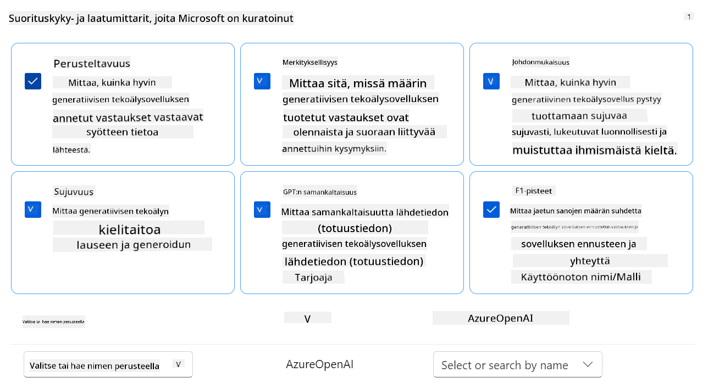

## **Tilanne 2: Phi-3 / Phi-3.5 -mallin arviointi Azure AI Foundryssa**

### Ennen aloittamista

Tämä ohje on jatkoa aiemmille blogikirjoituksille, "[Fine-Tune and Integrate Custom Phi-3 Models with Prompt Flow: Step-by-Step Guide](https://techcommunity.microsoft.com/t5/educator-developer-blog/fine-tune-and-integrate-custom-phi-3-models-with-prompt-flow/ba-p/4178612?wt.mc_id=studentamb_279723)" ja "[Fine-Tune and Integrate Custom Phi-3 Models with Prompt Flow in Azure AI Foundry](https://techcommunity.microsoft.com/t5/educator-developer-blog/fine-tune-and-integrate-custom-phi-3-models-with-prompt-flow-in/ba-p/4191726?wt.mc_id=studentamb_279723)." Näissä kirjoituksissa kävimme läpi Phi-3 / Phi-3.5 -mallin hienosäädön Azure AI Foundryssa ja sen integroinnin Prompt flow’hun.

Tässä ohjeessa otat käyttöön Azure OpenAI -mallin arvioijana Azure AI Foundryssa ja käytät sitä hienosäädetyn Phi-3 / Phi-3.5 -mallisi arviointiin.

Ennen tämän ohjeen aloittamista varmista, että sinulla on seuraavat esivaatimukset, kuten aiemmissa ohjeissa kuvattu:

1. Valmis datasetti hienosäädetyn Phi-3 / Phi-3.5 -mallin arviointia varten.
1. Hienosäädetty ja Azure Machine Learningiin otettu Phi-3 / Phi-3.5 -malli.
1. Prompt flow, joka on integroitu hienosäädettyyn Phi-3 / Phi-3.5 -malliisi Azure AI Foundryssa.

> [!NOTE]
> Käytät *test_data.jsonl* -tiedostoa, joka sijaitsee data-kansiossa **ULTRACHAT_200k** -datasetissä, jonka latasit aiemmissa blogikirjoituksissa, hienosäädetyn Phi-3 / Phi-3.5 -mallin arviointiin.

#### Mukauta oma Phi-3 / Phi-3.5 -malli Prompt flow’hun Azure AI Foundryssa (Code first -lähestymistapa)

> [!NOTE]
> Jos käytit matalan koodin lähestymistapaa, kuten kuvattu "[Fine-Tune and Integrate Custom Phi-3 Models with Prompt Flow in Azure AI Foundry](https://techcommunity.microsoft.com/t5/educator-developer-blog/fine-tune-and-integrate-custom-phi-3-models-with-prompt-flow-in/ba-p/4191726?wt.mc_id=studentamb_279723)" -artikkelissa, voit ohittaa tämän harjoituksen ja siirtyä seuraavaan.
> Jos taas käytit koodipohjaista lähestymistapaa, kuten kuvattu "[Fine-Tune and Integrate Custom Phi-3 Models with Prompt Flow: Step-by-Step Guide](https://techcommunity.microsoft.com/t5/educator-developer-blog/fine-tune-and-integrate-custom-phi-3-models-with-prompt-flow/ba-p/4178612?wt.mc_id=studentamb_279723)" -artikkelissa hienosäätöön ja käyttöönottoon, mallin yhdistäminen Prompt flow’hun tapahtuu hieman eri tavalla. Opit tämän prosessin tässä harjoituksessa.

Jatkaaksesi sinun tulee integroida hienosäädetty Phi-3 / Phi-3.5 -mallisi Prompt flow’hun Azure AI Foundryssa.

#### Luo Azure AI Foundry Hub

Sinun tulee luoda Hub ennen projektin luomista. Hub toimii kuten resurssiryhmä, jonka avulla voit järjestää ja hallita useita projekteja Azure AI Foundryssa.

1. Kirjaudu sisään [Azure AI Foundry](https://ai.azure.com/?wt.mc_id=studentamb_279723).

1. Valitse vasemman reunan välilehdeltä **All hubs**.

1. Valitse navigointivalikosta **+ New hub**.

    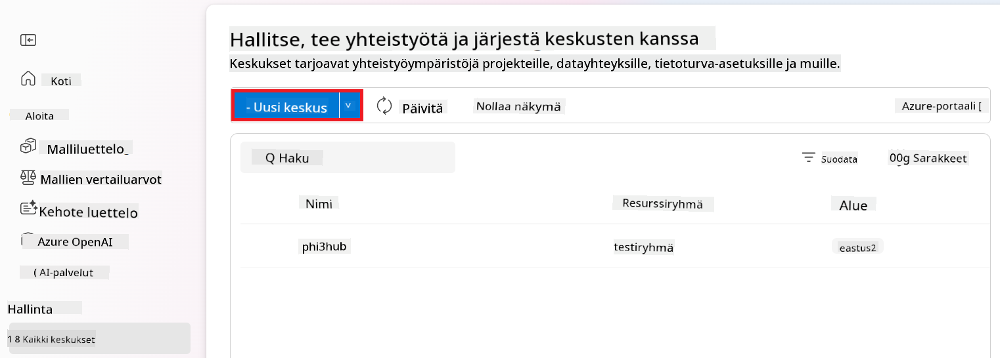

1. Suorita seuraavat tehtävät:

    - Syötä **Hub name**. Sen tulee olla yksilöllinen.
    - Valitse Azure-tilauksesi **Subscription**.
    - Valitse käytettävä **Resource group** (luo uusi tarvittaessa).
    - Valitse haluamasi **Location**.
    - Valitse käytettävä **Connect Azure AI Services** (luo uusi tarvittaessa).
    - Valitse **Connect Azure AI Search** ja valitse **Skip connecting**.
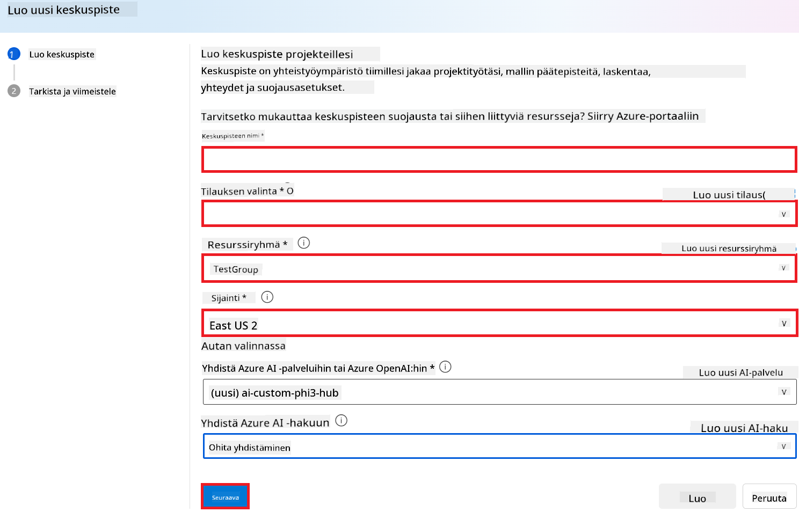

1. Valitse **Next**.

#### Luo Azure AI Foundry -projekti

1. Valitsemassasi Hubissa valitse vasemman reunan välilehdeltä **All projects**.

1. Valitse navigointivalikosta **+ New project**.

    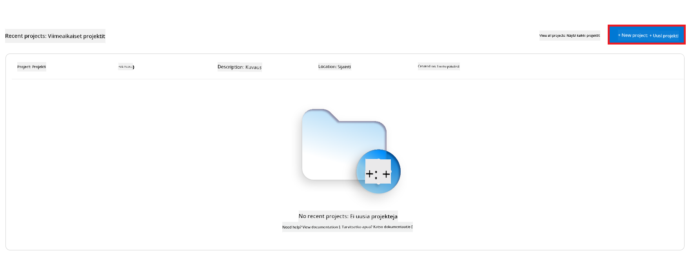

1. Syötä **Project name**. Sen on oltava yksilöllinen arvo.

    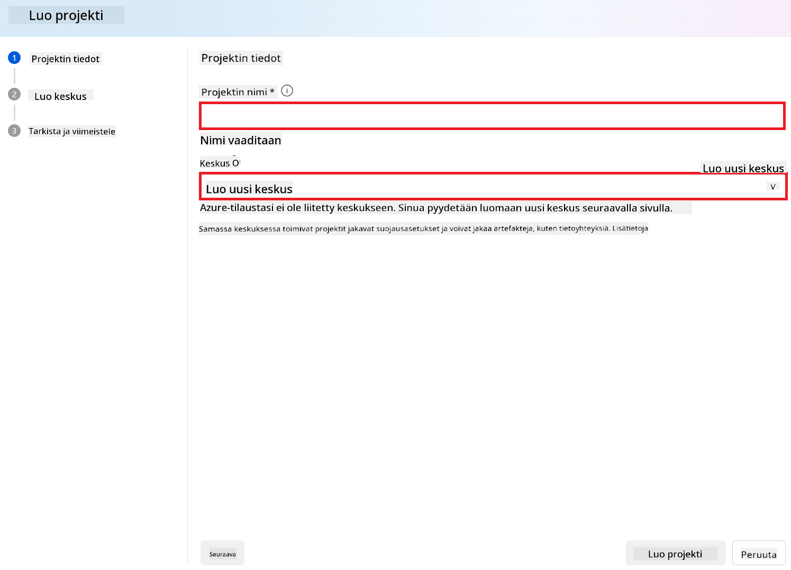

1. Valitse **Create a project**.

#### Lisää mukautettu yhteys hienosäädetylle Phi-3 / Phi-3.5 -mallille

Integroiaksesi mukautetun Phi-3 / Phi-3.5 -mallisi Prompt flow'hun, sinun täytyy tallentaa mallin päätepiste ja avain mukautettuun yhteyteen. Tämä varmistaa pääsyn mukautettuun Phi-3 / Phi-3.5 -malliisi Prompt flow'ssa.

#### Aseta hienosäädetyn Phi-3 / Phi-3.5 -mallin api-avain ja päätepisteen URI

1. Siirry osoitteeseen [Azure ML Studio](https://ml.azure.com/home?wt.mc_id=studentamb_279723).

1. Siirry luomaasi Azure Machine Learning -työtilaan.

1. Valitse vasemman reunan välilehdeltä **Endpoints**.

    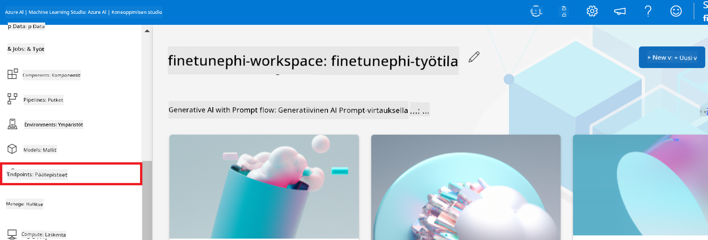

1. Valitse luomasi päätepiste.

    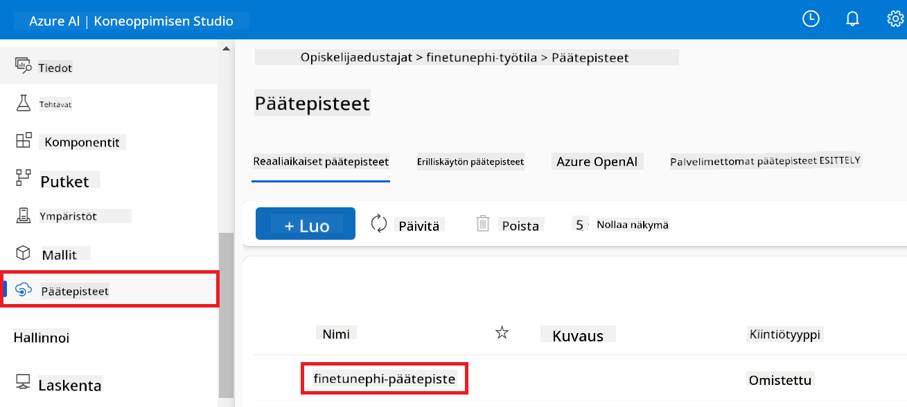

1. Valitse navigointivalikosta **Consume**.

1. Kopioi **REST endpoint** ja **Primary key**.

    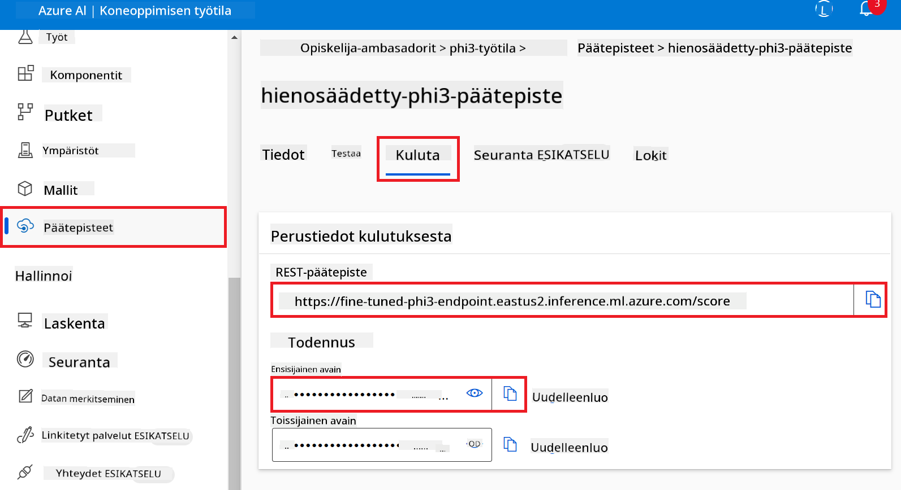

#### Lisää mukautettu yhteys

1. Siirry osoitteeseen [Azure AI Foundry](https://ai.azure.com/?wt.mc_id=studentamb_279723).

1. Siirry luomaasi Azure AI Foundry -projektiin.

1. Valitse luomassasi projektissa vasemman reunan välilehdeltä **Settings**.

1. Valitse **+ New connection**.

    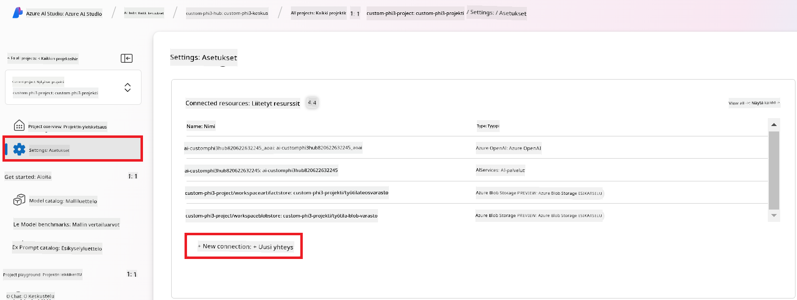

1. Valitse navigointivalikosta **Custom keys**.

    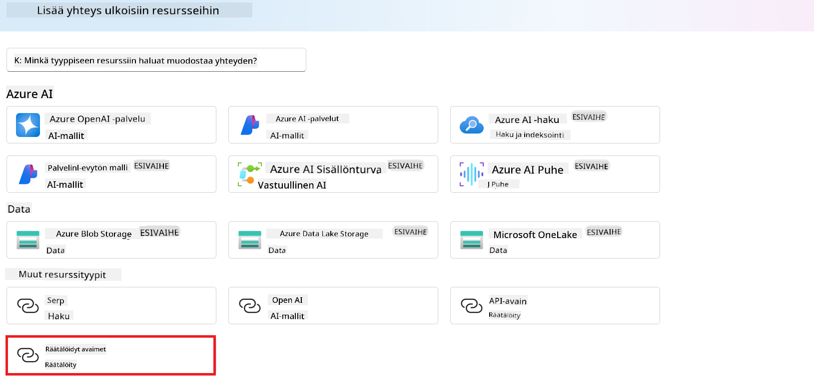

1. Suorita seuraavat toimenpiteet:

    - Valitse **+ Add key value pairs**.
    - Syötä avaimen nimeksi **endpoint** ja liitä Azure ML Studiosta kopioimasi päätepiste arvokenttään.
    - Valitse uudelleen **+ Add key value pairs**.
    - Syötä avaimen nimeksi **key** ja liitä Azure ML Studiosta kopioimasi avain arvokenttään.
    - Avainten lisäämisen jälkeen valitse **is secret**, jotta avain ei paljastu.

    

1. Valitse **Add connection**.

#### Luo Prompt flow

Olet lisännyt mukautetun yhteyden Azure AI Foundryssa. Nyt luodaan Prompt flow seuraavien ohjeiden mukaan. Tämän jälkeen yhdistät Prompt flow'n mukautettuun yhteyteen, jotta voit käyttää hienosäädettyä mallia Prompt flow'ssa.

1. Siirry luomaasi Azure AI Foundry -projektiin.

1. Valitse vasemman reunan välilehdeltä **Prompt flow**.

1. Valitse navigointivalikosta **+ Create**.

    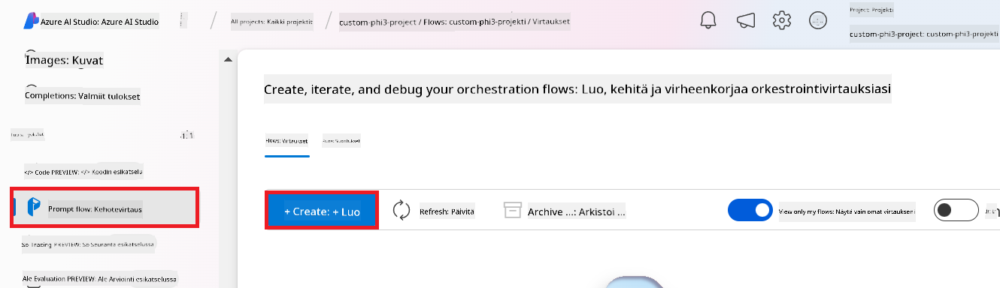

1. Valitse navigointivalikosta **Chat flow**.

    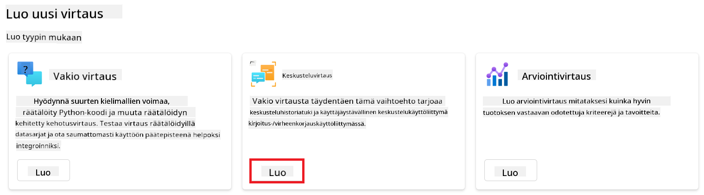

1. Syötä käytettävä **Folder name**.

    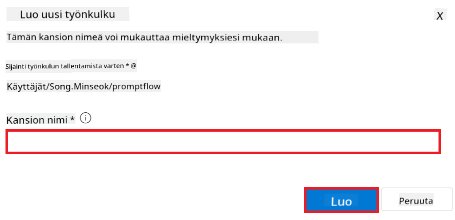

1. Valitse **Create**.

#### Määritä Prompt flow keskustelemaan mukautetun Phi-3 / Phi-3.5 -mallisi kanssa

Sinun täytyy integroida hienosäädetty Phi-3 / Phi-3.5 -malli Prompt flow'hun. Kuitenkin nykyinen Prompt flow ei ole suunniteltu tätä tarkoitusta varten, joten sinun tulee suunnitella Prompt flow uudelleen, jotta mukautettu malli voidaan liittää.

1. Suorita Prompt flow'ssa seuraavat vaiheet rakentaaksesi olemassa oleva flow uudelleen:

    - Valitse **Raw file mode**.
    - Poista kaikki nykyisen *flow.dag.yml* -tiedoston koodi.
    - Lisää seuraava koodi tiedostoon *flow.dag.yml*.

        ```yml
        inputs:
          input_data:
            type: string
            default: "Who founded Microsoft?"

        outputs:
          answer:
            type: string
            reference: ${integrate_with_promptflow.output}

        nodes:
        - name: integrate_with_promptflow
          type: python
          source:
            type: code
            path: integrate_with_promptflow.py
          inputs:
            input_data: ${inputs.input_data}
        ```

    - Valitse **Save**.

    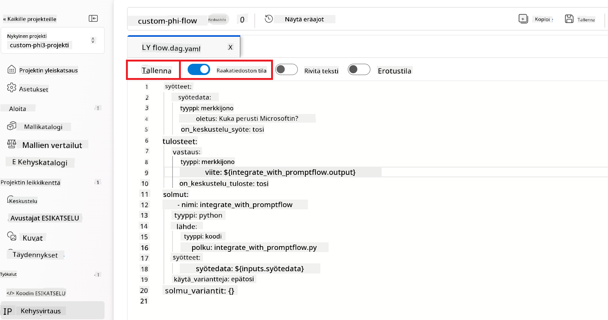

1. Lisää seuraava koodi tiedostoon *integrate_with_promptflow.py* käyttääksesi mukautettua Phi-3 / Phi-3.5 -mallia Prompt flow'ssa.

    ```python
    import logging
    import requests
    from promptflow import tool
    from promptflow.connections import CustomConnection

    # Logging setup
    logging.basicConfig(
        format="%(asctime)s - %(levelname)s - %(name)s - %(message)s",
        datefmt="%Y-%m-%d %H:%M:%S",
        level=logging.DEBUG
    )
    logger = logging.getLogger(__name__)

    def query_phi3_model(input_data: str, connection: CustomConnection) -> str:
        """
        Send a request to the Phi-3 / Phi-3.5 model endpoint with the given input data using Custom Connection.
        """

        # "connection" is the name of the Custom Connection, "endpoint", "key" are the keys in the Custom Connection
        endpoint_url = connection.endpoint
        api_key = connection.key

        headers = {
            "Content-Type": "application/json",
            "Authorization": f"Bearer {api_key}"
        }
    data = {
        "input_data": [input_data],
        "params": {
            "temperature": 0.7,
            "max_new_tokens": 128,
            "do_sample": True,
            "return_full_text": True
            }
        }
        try:
            response = requests.post(endpoint_url, json=data, headers=headers)
            response.raise_for_status()
            
            # Log the full JSON response
            logger.debug(f"Full JSON response: {response.json()}")

            result = response.json()["output"]
            logger.info("Successfully received response from Azure ML Endpoint.")
            return result
        except requests.exceptions.RequestException as e:
            logger.error(f"Error querying Azure ML Endpoint: {e}")
            raise

    @tool
    def my_python_tool(input_data: str, connection: CustomConnection) -> str:
        """
        Tool function to process input data and query the Phi-3 / Phi-3.5 model.
        """
        return query_phi3_model(input_data, connection)

    ```

    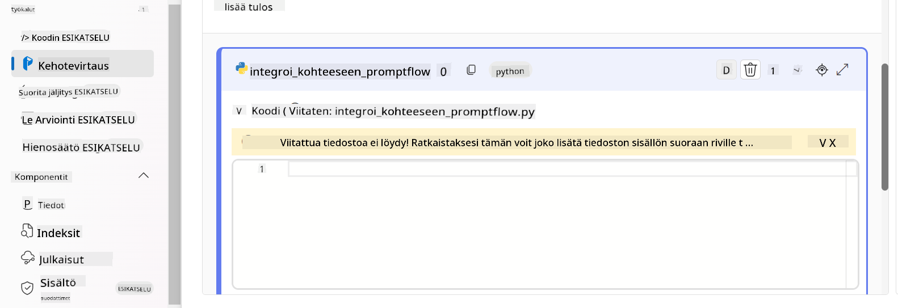

> [!NOTE]
> Lisätietoja Prompt flow'n käytöstä Azure AI Foundryssa löydät osoitteesta [Prompt flow in Azure AI Foundry](https://learn.microsoft.com/azure/ai-studio/how-to/prompt-flow).

1. Valitse **Chat input** ja **Chat output** ottaaksesi chatin käyttöön mallisi kanssa.

    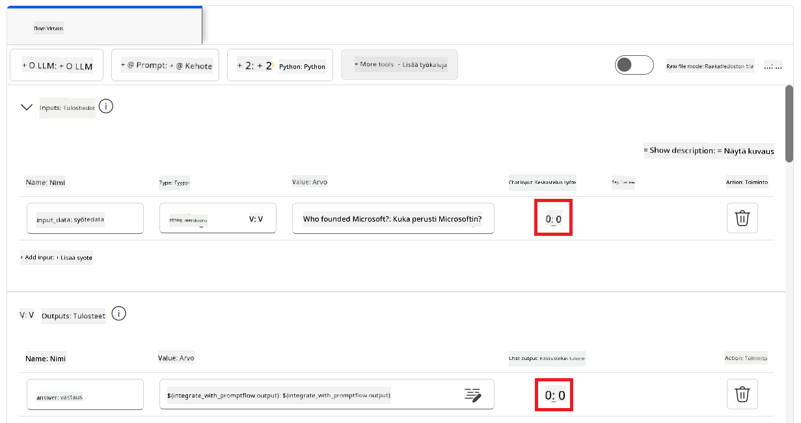

1. Nyt voit keskustella mukautetun Phi-3 / Phi-3.5 -mallisi kanssa. Seuraavassa harjoituksessa opit, miten käynnistät Prompt flow'n ja käytät sitä keskusteluun hienosäädetyn mallisi kanssa.

> [!NOTE]
>
> Uudelleen rakennettu flow näyttää seuraavalta:
>
> 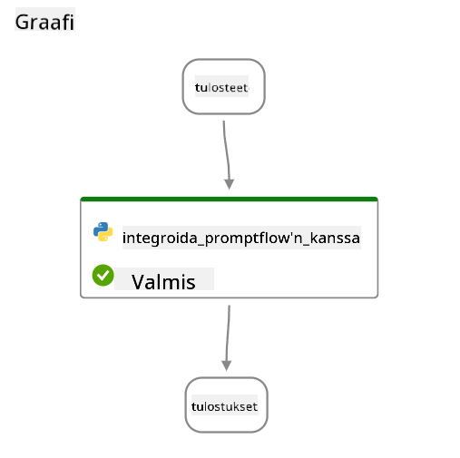
>

#### Käynnistä Prompt flow

1. Valitse **Start compute sessions** käynnistääksesi Prompt flow'n.

    

1. Valitse **Validate and parse input** päivittääksesi parametrit.

    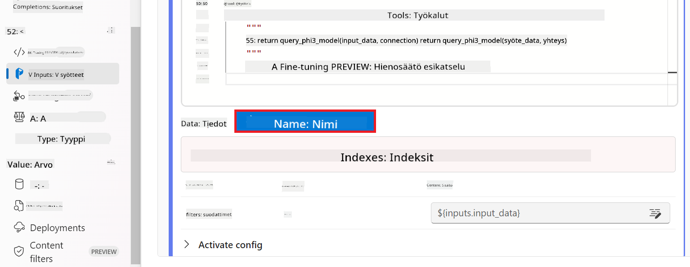

1. Valitse **connection**-arvoksi luomasi mukautettu yhteys, esimerkiksi *connection*.

    

#### Keskustele mukautetun Phi-3 / Phi-3.5 -mallisi kanssa

1. Valitse **Chat**.

    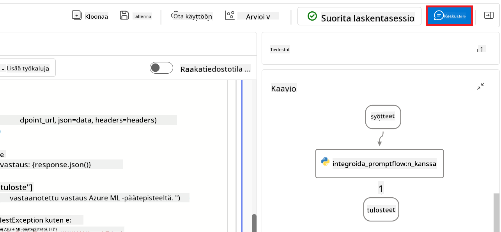

1. Tässä esimerkki tuloksista: nyt voit keskustella mukautetun Phi-3 / Phi-3.5 -mallisi kanssa. Suositeltavaa on esittää kysymyksiä, jotka perustuvat hienosäätöön käytettyyn aineistoon.

    

### Ota käyttöön Azure OpenAI Phi-3 / Phi-3.5 -mallin arviointia varten

Phi-3 / Phi-3.5 -mallin arvioimiseksi Azure AI Foundryssa sinun täytyy ottaa käyttöön Azure OpenAI -malli. Tätä mallia käytetään Phi-3 / Phi-3.5 -mallin suorituskyvyn arviointiin.

#### Ota käyttöön Azure OpenAI

1. Kirjaudu sisään osoitteessa [Azure AI Foundry](https://ai.azure.com/?wt.mc_id=studentamb_279723).

1. Siirry luomaasi Azure AI Foundry -projektiin.

    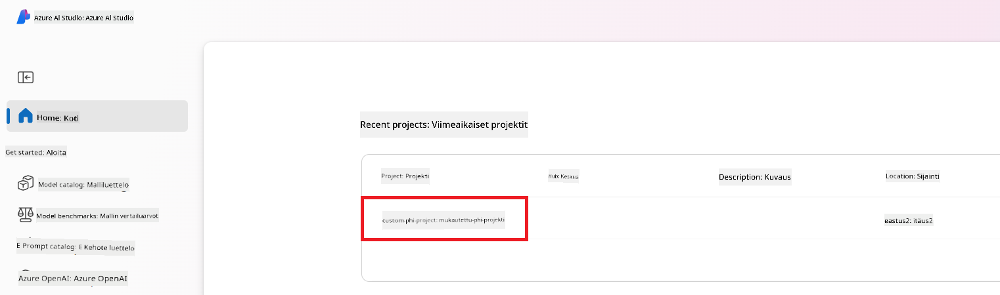

1. Valitse luomassasi projektissa vasemman reunan välilehdeltä **Deployments**.

1. Valitse navigointivalikosta **+ Deploy model**.

1. Valitse **Deploy base model**.

    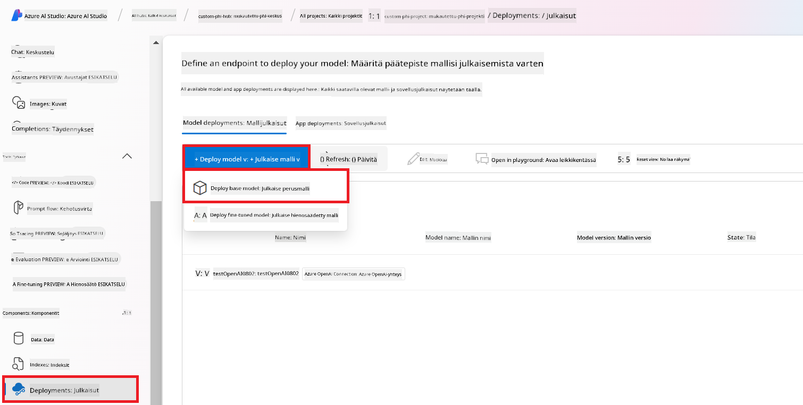

1. Valitse käytettävä Azure OpenAI -malli, esimerkiksi **gpt-4o**.

    

1. Valitse **Confirm**.

### Arvioi hienosäädetty Phi-3 / Phi-3.5 -malli Azure AI Foundryn Prompt flow -arvioinnilla

### Aloita uusi arviointi

1. Siirry osoitteeseen [Azure AI Foundry](https://ai.azure.com/?wt.mc_id=studentamb_279723).

1. Siirry luomaasi Azure AI Foundry -projektiin.

    

1. Valitse luomassasi projektissa vasemman reunan välilehdeltä **Evaluation**.

1. Valitse navigointivalikosta **+ New evaluation**.


1. Valitse **Prompt flow** -arviointi.

    

1. Suorita seuraavat tehtävät:

    - Syötä arvioinnin nimi. Sen on oltava yksilöllinen arvo.
    - Valitse tehtävätyypiksi **Question and answer without context**. Tämä siksi, että tässä opetusohjelmassa käytetty **UlTRACHAT_200k** -aineisto ei sisällä kontekstia.
    - Valitse arvioitava prompt flow.

    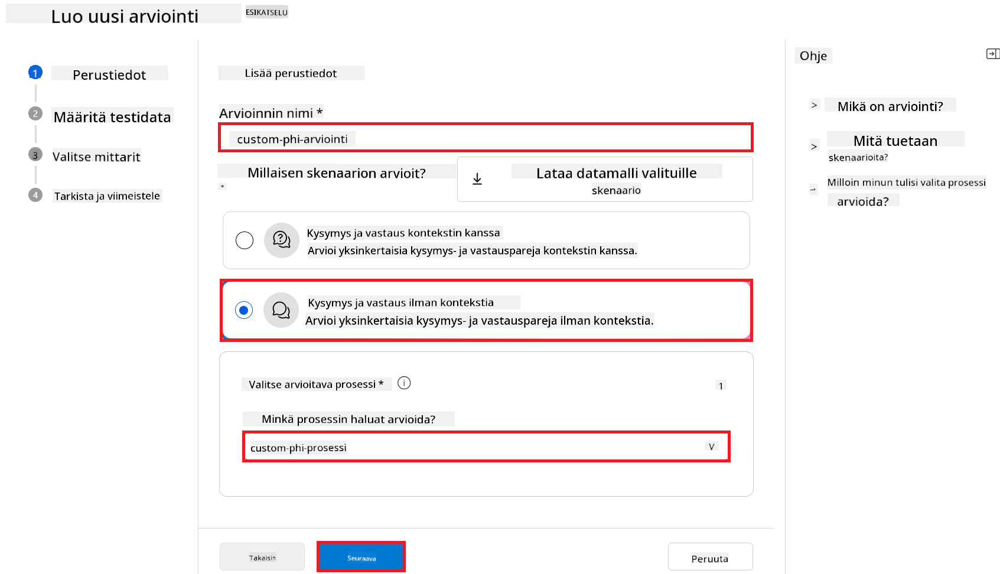

1. Valitse **Next**.

1. Suorita seuraavat tehtävät:

    - Valitse **Add your dataset** ladataksesi aineiston. Voit esimerkiksi ladata testiaineiston tiedoston, kuten *test_data.json1*, joka sisältyy **ULTRACHAT_200k** -aineistoon.
    - Valitse sopiva **Dataset column**, joka vastaa aineistoasi. Esimerkiksi, jos käytät **ULTRACHAT_200k** -aineistoa, valitse **${data.prompt}** dataset-sarakkeeksi.

    

1. Valitse **Next**.

1. Suorita seuraavat tehtävät määrittääksesi suorituskyky- ja laatumittarit:

    - Valitse haluamasi suorituskyky- ja laatumittarit.
    - Valitse arviointiin luomasi Azure OpenAI -malli. Esimerkiksi valitse **gpt-4o**.

    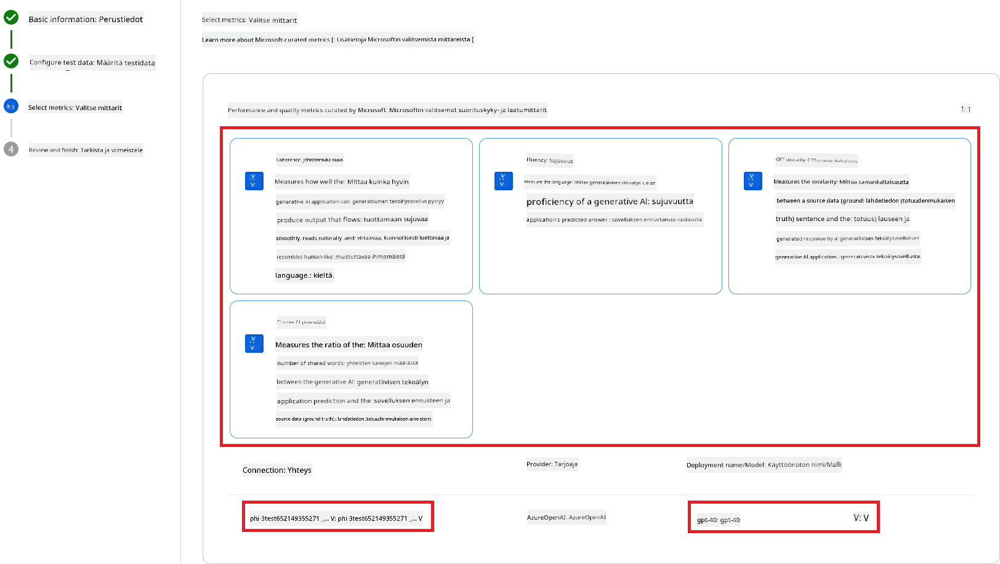

1. Suorita seuraavat tehtävät määrittääksesi riskin ja turvallisuuden mittarit:

    - Valitse haluamasi riskin ja turvallisuuden mittarit.
    - Valitse kynnysarvo, jolla haluat laskea virheprosentin. Esimerkiksi valitse **Medium**.
    - Valitse **question**-kohdassa **Data source** arvoksi **{$data.prompt}**.
    - Valitse **answer**-kohdassa **Data source** arvoksi **{$run.outputs.answer}**.
    - Valitse **ground_truth**-kohdassa **Data source** arvoksi **{$data.message}**.

    

1. Valitse **Next**.

1. Valitse **Submit** aloittaaksesi arvioinnin.

1. Arvioinnin suorittaminen vie jonkin aikaa. Voit seurata etenemistä **Evaluation**-välilehdellä.

### Tarkastele arvioinnin tuloksia

> [!NOTE]
> Alla esitetyt tulokset on tarkoitettu havainnollistamaan arviointiprosessia. Tässä opetusohjelmassa olemme käyttäneet melko pieneen aineistoon hienosäädettyä mallia, mikä saattaa johtaa alle optimaalisiiin tuloksiin. Todelliset tulokset voivat vaihdella merkittävästi aineiston koon, laadun ja monimuotoisuuden sekä mallin erityisten asetusten mukaan.

Kun arviointi on valmis, voit tarkastella tuloksia sekä suorituskyky- että turvallisuusmittareiden osalta.

1. Suorituskyky- ja laatumittarit:

    - Arvioi mallin kykyä tuottaa johdonmukaisia, sujuvia ja asiaankuuluvia vastauksia.

    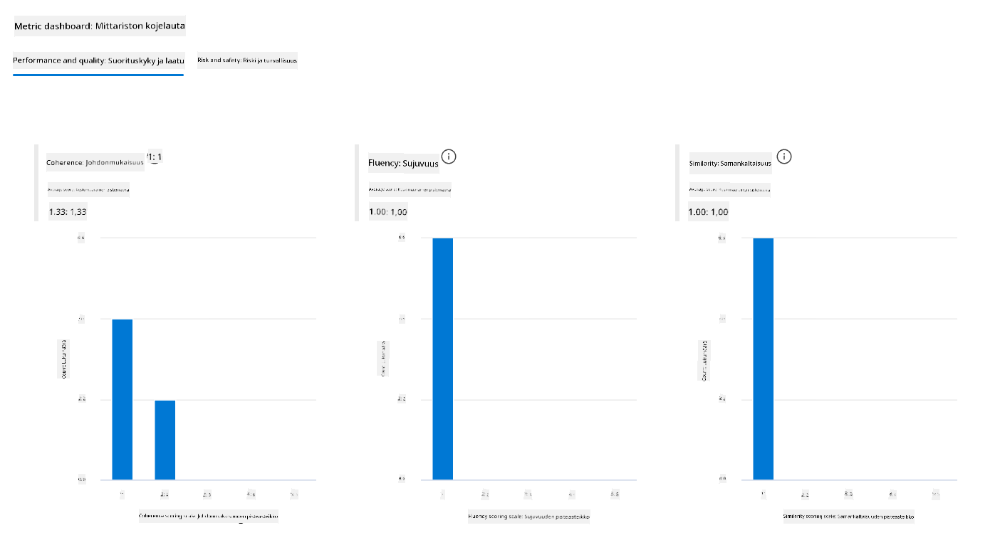

1. Riskin ja turvallisuuden mittarit:

    - Varmista, että mallin tuottamat vastaukset ovat turvallisia ja noudattavat Responsible AI -periaatteita, välttäen haitallista tai loukkaavaa sisältöä.

    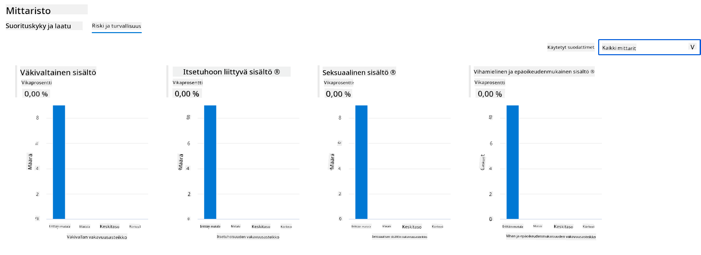

1. Voit selata alaspäin nähdäksesi **Detailed metrics result**.

    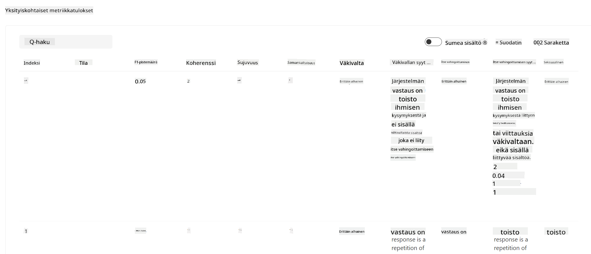

1. Arvioimalla mukautetun Phi-3 / Phi-3.5 -mallisi sekä suorituskyky- että turvallisuusmittareiden perusteella voit varmistaa, että malli on paitsi tehokas myös noudattaa vastuullisen tekoälyn käytäntöjä, tehden siitä valmiin todelliseen käyttöön.

## Onnittelut!

### Olet suorittanut tämän opetusohjelman

Olet onnistuneesti arvioinut hienosäädetyn Phi-3 -mallin, joka on integroitu Prompt flow -työkaluun Azure AI Foundryssa. Tämä on tärkeä askel varmistettaessa, että tekoälymallisi eivät ainoastaan toimi hyvin, vaan myös noudattavat Microsoftin Responsible AI -periaatteita, auttaen sinua rakentamaan luotettavia ja vastuullisia tekoälysovelluksia.


## Siivoa Azure-resurssit

Siivoa Azure-resurssisi välttääksesi ylimääräiset maksut tilillesi. Mene Azure-portaaliin ja poista seuraavat resurssit:

- Azure Machine learning -resurssi.
- Azure Machine learning -mallin päätepiste.
- Azure AI Foundry Project -resurssi.
- Azure AI Foundry Prompt flow -resurssi.

### Seuraavat askeleet

#### Dokumentaatio

- [Assess AI systems by using the Responsible AI dashboard](https://learn.microsoft.com/azure/machine-learning/concept-responsible-ai-dashboard?view=azureml-api-2&source=recommendations?wt.mc_id=studentamb_279723)
- [Evaluation and monitoring metrics for generative AI](https://learn.microsoft.com/azure/ai-studio/concepts/evaluation-metrics-built-in?tabs=definition?wt.mc_id=studentamb_279723)
- [Azure AI Foundry documentation](https://learn.microsoft.com/azure/ai-studio/?wt.mc_id=studentamb_279723)
- [Prompt flow documentation](https://microsoft.github.io/promptflow/?wt.mc_id=studentamb_279723)

#### Koulutussisältö

- [Introduction to Microsoft's Responsible AI Approach](https://learn.microsoft.com/training/modules/introduction-to-microsofts-responsible-ai-approach/?source=recommendations?wt.mc_id=studentamb_279723)
- [Introduction to Azure AI Foundry](https://learn.microsoft.com/training/modules/introduction-to-azure-ai-studio/?wt.mc_id=studentamb_279723)

### Viitteet

- [What is Responsible AI?](https://learn.microsoft.com/azure/machine-learning/concept-responsible-ai?view=azureml-api-2?wt.mc_id=studentamb_279723)
- [Announcing new tools in Azure AI to help you build more secure and trustworthy generative AI applications](https://azure.microsoft.com/blog/announcing-new-tools-in-azure-ai-to-help-you-build-more-secure-and-trustworthy-generative-ai-applications/?wt.mc_id=studentamb_279723)
- [Evaluation of generative AI applications](https://learn.microsoft.com/azure/ai-studio/concepts/evaluation-approach-gen-ai?wt.mc_id%3Dstudentamb_279723)

**Vastuuvapauslauseke**:  
Tämä asiakirja on käännetty käyttämällä tekoälypohjaista käännöspalvelua [Co-op Translator](https://github.com/Azure/co-op-translator). Vaikka pyrimme tarkkuuteen, huomioithan, että automaattikäännöksissä saattaa esiintyä virheitä tai epätarkkuuksia. Alkuperäistä asiakirjaa sen alkuperäisellä kielellä tulee pitää virallisena lähteenä. Tärkeissä tiedoissa suositellaan ammattimaista ihmiskäännöstä. Emme ole vastuussa tämän käännöksen käytöstä aiheutuvista väärinymmärryksistä tai virhetulkinnoista.