# Arvioi hienosäädetty Phi-3 / Phi-3.5 -malli Azure AI Foundryssa keskittyen Microsoftin vastuullisen tekoälyn periaatteisiin

Tämä kokonaisvaltainen (E2E) esimerkki perustuu Microsoft Tech Communityn oppaaseen "[Evaluate Fine-tuned Phi-3 / 3.5 Models in Azure AI Foundry Focusing on Microsoft's Responsible AI](https://techcommunity.microsoft.com/blog/educatordeveloperblog/evaluate-fine-tuned-phi-3--3-5-models-in-azure-ai-studio-focusing-on-microsofts-/4227850?WT.mc_id=aiml-137032-kinfeylo)".

## Yleiskatsaus

### Miten voit arvioida hienosäädetyn Phi-3 / Phi-3.5 -mallin turvallisuutta ja suorituskykyä Azure AI Foundryssa?

Mallin hienosäätö voi joskus johtaa tahattomiin tai ei-toivottuihin vastauksiin. Jotta malli pysyy turvallisena ja tehokkaana, on tärkeää arvioida sen kyky tuottaa haitallista sisältöä sekä sen kyky antaa tarkkoja, asiaankuuluvia ja johdonmukaisia vastauksia. Tässä opetusohjelmassa opit, miten arvioida hienosäädetyn Phi-3 / Phi-3.5 -mallin turvallisuutta ja suorituskykyä, kun se on integroitu Prompt flow -työkaluun Azure AI Foundryssa.

Tässä on Azure AI Foundryn arviointiprosessi.

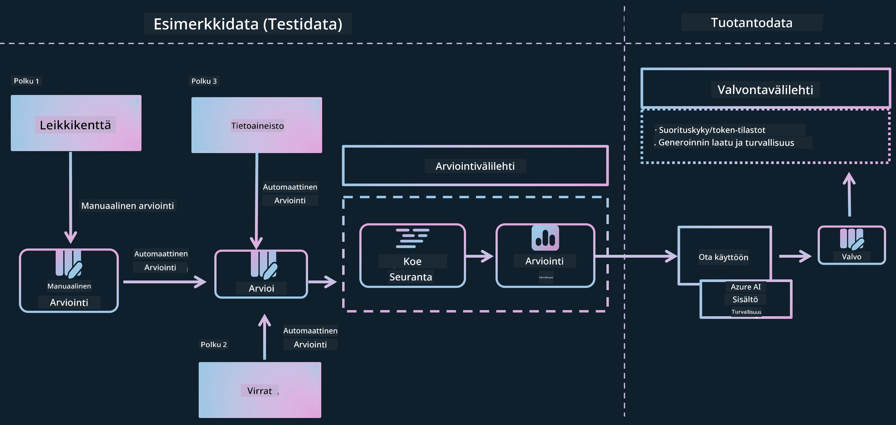

*Kuvan lähde: [Evaluation of generative AI applications](https://learn.microsoft.com/azure/ai-studio/concepts/evaluation-approach-gen-ai?wt.mc_id%3Dstudentamb_279723)*

> [!NOTE]
>
> Lisätietoja ja lisäresursseja Phi-3 / Phi-3.5 -malleista löydät [Phi-3CookBookista](https://github.com/microsoft/Phi-3CookBook?wt.mc_id=studentamb_279723).

### Esivaatimukset

- [Python](https://www.python.org/downloads)
- [Azure-tilaus](https://azure.microsoft.com/free?wt.mc_id=studentamb_279723)
- [Visual Studio Code](https://code.visualstudio.com)
- Hienosäädetty Phi-3 / Phi-3.5 -malli

### Sisällysluettelo

1. [**Tapaus 1: Johdatus Azure AI Foundryn Prompt flow -arviointiin**](../../../../../../md/02.Application/01.TextAndChat/Phi3)

    - [Johdatus turvallisuusarviointiin](../../../../../../md/02.Application/01.TextAndChat/Phi3)
    - [Johdatus suorituskyvyn arviointiin](../../../../../../md/02.Application/01.TextAndChat/Phi3)

1. [**Tapaus 2: Phi-3 / Phi-3.5 -mallin arviointi Azure AI Foundryssa**](../../../../../../md/02.Application/01.TextAndChat/Phi3)

    - [Ennen aloittamista](../../../../../../md/02.Application/01.TextAndChat/Phi3)
    - [Ota Azure OpenAI käyttöön Phi-3 / Phi-3.5 -mallin arviointia varten](../../../../../../md/02.Application/01.TextAndChat/Phi3)
    - [Arvioi hienosäädetty Phi-3 / Phi-3.5 -malli Azure AI Foundryn Prompt flow -arvioinnilla](../../../../../../md/02.Application/01.TextAndChat/Phi3)

1. [Onnittelut!](../../../../../../md/02.Application/01.TextAndChat/Phi3)

## **Tapaus 1: Johdatus Azure AI Foundryn Prompt flow -arviointiin**

### Johdatus turvallisuusarviointiin

Jotta tekoälymallisi olisi eettinen ja turvallinen, on tärkeää arvioida sitä Microsoftin vastuullisen tekoälyn periaatteiden mukaisesti. Azure AI Foundryssa turvallisuusarvioinnit mahdollistavat mallin haavoittuvuuden arvioinnin jailbreak-hyökkäyksiä vastaan sekä sen kyvyn tuottaa haitallista sisältöä, mikä on suoraan linjassa näiden periaatteiden kanssa.


*Kuvan lähde: [Evaluation of generative AI applications](https://learn.microsoft.com/azure/ai-studio/concepts/evaluation-approach-gen-ai?wt.mc_id%3Dstudentamb_279723)*

#### Microsoftin vastuullisen tekoälyn periaatteet

Ennen teknisten vaiheiden aloittamista on tärkeää ymmärtää Microsoftin vastuullisen tekoälyn periaatteet, eettinen kehys, joka ohjaa tekoälyjärjestelmien vastuullista kehittämistä, käyttöönottoa ja toimintaa. Nämä periaatteet ohjaavat tekoälyjärjestelmien vastuullista suunnittelua, kehitystä ja käyttöönottoa varmistaen, että tekoälyteknologiat rakennetaan oikeudenmukaisesti, läpinäkyvästi ja osallistavasti. Ne muodostavat perustan tekoälymallien turvallisuuden arvioinnille.

Microsoftin vastuullisen tekoälyn periaatteet ovat:

- **Oikeudenmukaisuus ja osallistavuus**: Tekoälyjärjestelmien tulee kohdella kaikkia tasapuolisesti eikä vaikuttaa eri tavoin samankaltaisissa tilanteissa oleviin ryhmiin. Esimerkiksi kun tekoälyjärjestelmät antavat ohjeita lääketieteellisestä hoidosta, lainahakemuksista tai työllistymisestä, niiden tulee antaa samat suositukset kaikille, joilla on samankaltaiset oireet, taloudellinen tilanne tai ammatilliset pätevyydet.

- **Luotettavuus ja turvallisuus**: Luottamuksen rakentamiseksi on olennaista, että tekoälyjärjestelmät toimivat luotettavasti, turvallisesti ja johdonmukaisesti. Näiden järjestelmien tulee pystyä toimimaan suunnitellulla tavalla, reagoimaan turvallisesti odottamattomiin tilanteisiin ja vastustamaan haitallista manipulointia. Niiden käyttäytyminen ja kyky käsitellä erilaisia tilanteita heijastavat kehittäjien suunnittelun ja testauksen aikana ennakoimia tilanteita.

- **Läpinäkyvyys**: Kun tekoälyjärjestelmät auttavat tekemään päätöksiä, joilla on suuri vaikutus ihmisten elämään, on tärkeää, että ihmiset ymmärtävät, miten nämä päätökset on tehty. Esimerkiksi pankki saattaa käyttää tekoälyä arvioidakseen henkilön luottokelpoisuutta. Yritys voi käyttää tekoälyä valitakseen pätevimmät ehdokkaat työhön.

- **Yksityisyys ja turvallisuus**: Tekoälyn yleistyessä yksityisyyden suojaaminen ja henkilö- sekä yritystietojen turvaaminen korostuvat ja monimutkaistuvat. Tekoälyn kohdalla yksityisyyden ja tietoturvan huomioiminen on erityisen tärkeää, koska datan saatavuus on välttämätöntä tekoälyjärjestelmien tarkkojen ja perusteltujen ennusteiden ja päätösten tekemiseksi.

- **Vastuullisuus**: Tekoälyjärjestelmien suunnittelijoiden ja käyttöönottojen tekijöiden tulee olla vastuussa järjestelmiensä toiminnasta. Organisaatioiden tulisi hyödyntää alan standardeja vastuullisuuden normien kehittämiseksi. Nämä normit varmistavat, että tekoälyjärjestelmät eivät ole lopullinen auktoriteetti päätöksissä, jotka vaikuttavat ihmisten elämään, ja että ihmiset säilyttävät merkittävän kontrollin muuten hyvin autonomisten tekoälyjärjestelmien yli.

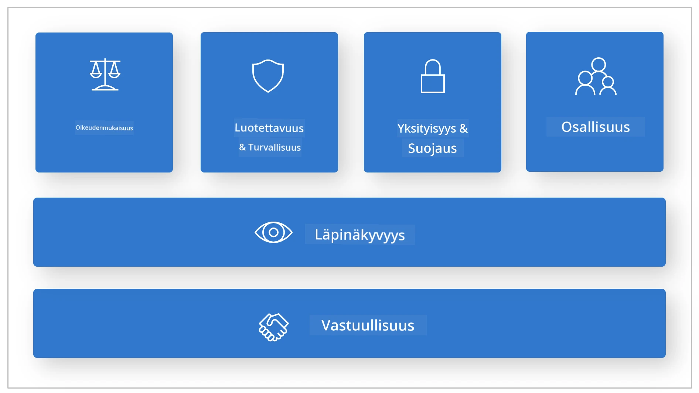

*Kuvan lähde: [What is Responsible AI?](https://learn.microsoft.com/azure/machine-learning/concept-responsible-ai?view=azureml-api-2&viewFallbackFrom=azureml-api-2%253fwt.mc_id%3Dstudentamb_279723)*

> [!NOTE]
> Lisätietoja Microsoftin vastuullisen tekoälyn periaatteista löydät sivulta [What is Responsible AI?](https://learn.microsoft.com/azure/machine-learning/concept-responsible-ai?view=azureml-api-2?wt.mc_id=studentamb_279723).

#### Turvallisuusmittarit

Tässä opetusohjelmassa arvioit hienosäädetyn Phi-3 -mallin turvallisuutta Azure AI Foundryn turvallisuusmittareilla. Nämä mittarit auttavat sinua arvioimaan mallin kykyä tuottaa haitallista sisältöä ja sen haavoittuvuutta jailbreak-hyökkäyksille. Turvallisuusmittarit sisältävät:

- **Itseä vahingoittava sisältö**: Arvioi, onko mallilla taipumusta tuottaa itseä vahingoittavaan sisältöön liittyvää materiaalia.
- **Vihamielinen ja epäoikeudenmukainen sisältö**: Arvioi, onko mallilla taipumusta tuottaa vihamielistä tai epäoikeudenmukaista sisältöä.
- **Väkivaltainen sisältö**: Arvioi, onko mallilla taipumusta tuottaa väkivaltaista sisältöä.
- **Seksuaalinen sisältö**: Arvioi, onko mallilla taipumusta tuottaa sopimatonta seksuaalista sisältöä.

Näiden osa-alueiden arviointi varmistaa, että tekoälymalli ei tuota haitallista tai loukkaavaa sisältöä, mikä vastaa yhteiskunnallisia arvoja ja sääntelyvaatimuksia.

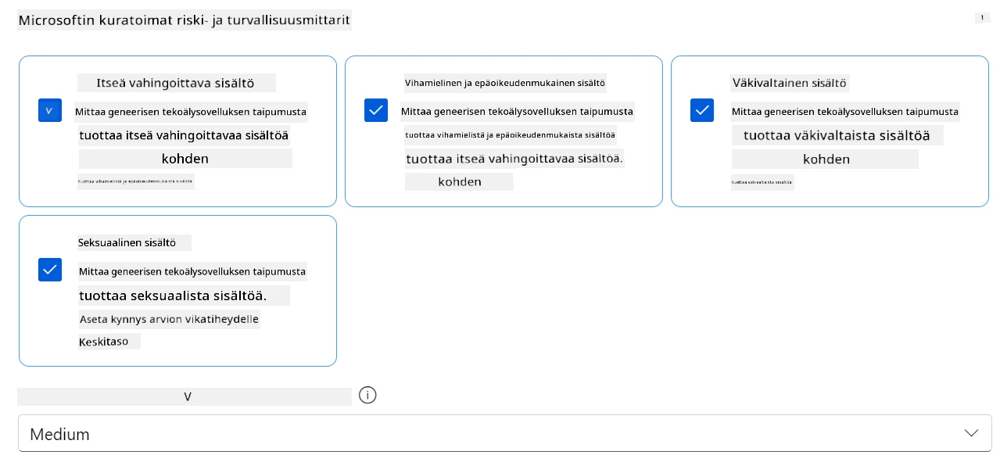

### Johdatus suorituskyvyn arviointiin

Jotta tekoälymallisi toimisi odotetusti, on tärkeää arvioida sen suorituskykyä suorituskykymittareiden avulla. Azure AI Foundryssa suorituskyvyn arvioinnit mahdollistavat mallin tehokkuuden arvioinnin tarkkojen, asiaankuuluvien ja johdonmukaisten vastausten tuottamisessa.

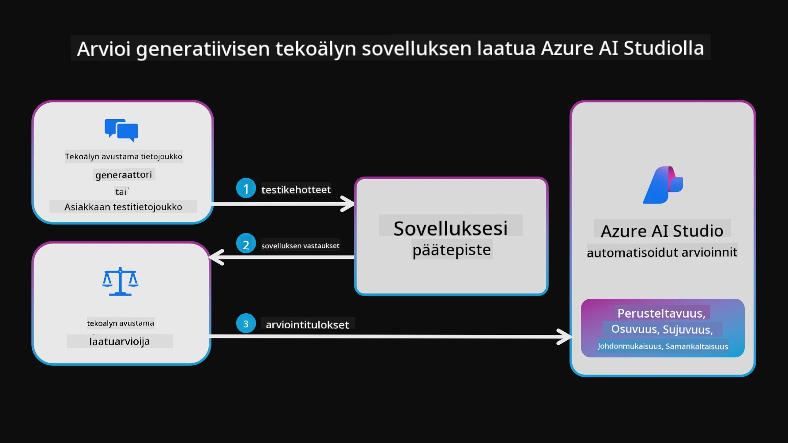

*Kuvan lähde: [Evaluation of generative AI applications](https://learn.microsoft.com/azure/ai-studio/concepts/evaluation-approach-gen-ai?wt.mc_id%3Dstudentamb_279723)*

#### Suorituskykymittarit

Tässä opetusohjelmassa arvioit hienosäädetyn Phi-3 / Phi-3.5 -mallin suorituskykyä Azure AI Foundryn suorituskykymittareilla. Nämä mittarit auttavat sinua arvioimaan mallin tehokkuutta tarkkojen, asiaankuuluvien ja johdonmukaisten vastausten tuottamisessa. Suorituskykymittarit sisältävät:

- **Perusteltavuus**: Arvioi, kuinka hyvin tuotetut vastaukset vastaavat syötteen lähdetietoa.
- **Asiaankuuluvuus**: Arvioi tuotettujen vastausten merkityksellisyyttä annettuihin kysymyksiin nähden.
- **Johdonmukaisuus**: Arvioi, kuinka sujuvasti tuotettu teksti etenee, lukeutuu luonnollisesti ja muistuttaa ihmismäistä kieltä.
- **Sujuvuus**: Arvioi tuotetun tekstin kielitaitoa.
- **GPT:n samankaltaisuus**: Vertaa tuotettua vastausta totuudenmukaiseen vastaukseen samankaltaisuuden osalta.
- **F1-pistemäärä**: Laskee jaetun sanamäärän suhteen tuotetun vastauksen ja lähdetiedon välillä.

Nämä mittarit auttavat sinua arvioimaan mallin tehokkuutta tarkkojen, asiaankuuluvien ja johdonmukaisten vastausten tuottamisessa.

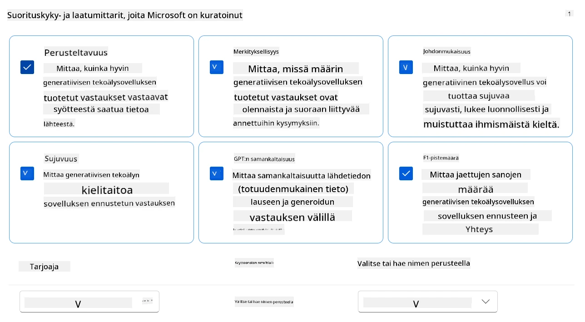

## **Tapaus 2: Phi-3 / Phi-3.5 -mallin arviointi Azure AI Foundryssa**

### Ennen aloittamista

Tämä opetusohjelma jatkaa aiempia blogikirjoituksia, "[Fine-Tune and Integrate Custom Phi-3 Models with Prompt Flow: Step-by-Step Guide](https://techcommunity.microsoft.com/t5/educator-developer-blog/fine-tune-and-integrate-custom-phi-3-models-with-prompt-flow/ba-p/4178612?wt.mc_id=studentamb_279723)" ja "[Fine-Tune and Integrate Custom Phi-3 Models with Prompt Flow in Azure AI Foundry](https://techcommunity.microsoft.com/t5/educator-developer-blog/fine-tune-and-integrate-custom-phi-3-models-with-prompt-flow-in/ba-p/4191726?wt.mc_id=studentamb_279723)." Näissä kirjoituksissa kävimme läpi Phi-3 / Phi-3.5 -mallin hienosäädön Azure AI Foundryssa ja sen integroinnin Prompt flow -työkaluun.

Tässä opetusohjelmassa otat käyttöön Azure OpenAI -mallin arvioijana Azure AI Foundryssa ja käytät sitä hienosäädetyn Phi-3 / Phi-3.5 -mallisi arviointiin.

Ennen tämän opetusohjelman aloittamista varmista, että sinulla on seuraavat esivaatimukset, kuten aiemmissa opetusohjelmissa kuvattu:

1. Valmis aineisto hienosäädetyn Phi-3 / Phi-3.5 -mallin arviointiin.
1. Phi-3 / Phi-3.5 -malli, joka on hienosäädetty ja otettu käyttöön Azure Machine Learningissä.
1. Prompt flow, joka on integroitu hienosäädettyyn Phi-3 / Phi-3.5 -malliisi Azure AI Foundryssa.

> [!NOTE]
> Käytät *test_data.jsonl* -tiedostoa, joka sijaitsee **ULTRACHAT_200k** -aineiston data-kansiossa ja joka ladattiin aiemmissa blogikirjoituksissa, aineistona hienosäädetyn Phi-3 / Phi-3.5 -mallin arviointiin.

#### Integroi mukautettu Phi-3 / Phi-3.5 -malli Prompt flow -työkaluun Azure AI Foundryssa (koodipohjainen lähestymistapa)
> [!NOTE]
> Jos seurasit vähäkoodista lähestymistapaa, joka on kuvattu artikkelissa "[Fine-Tune and Integrate Custom Phi-3 Models with Prompt Flow in Azure AI Foundry](https://techcommunity.microsoft.com/t5/educator-developer-blog/fine-tune-and-integrate-custom-phi-3-models-with-prompt-flow-in/ba-p/4191726?wt.mc_id=studentamb_279723)", voit ohittaa tämän harjoituksen ja siirtyä seuraavaan.
> Kuitenkin, jos seurasit koodikeskeistä lähestymistapaa, joka on kuvattu artikkelissa "[Fine-Tune and Integrate Custom Phi-3 Models with Prompt Flow: Step-by-Step Guide](https://techcommunity.microsoft.com/t5/educator-developer-blog/fine-tune-and-integrate-custom-phi-3-models-with-prompt-flow/ba-p/4178612?wt.mc_id=studentamb_279723)" hienosäätääksesi ja ottaaksesi käyttöön Phi-3 / Phi-3.5 -mallisi, mallin yhdistäminen Prompt Flow'hun tapahtuu hieman eri tavalla. Opit tämän prosessin tässä harjoituksessa.
Jatkaaksesi sinun täytyy integroida hienosäädetty Phi-3 / Phi-3.5 -mallisi Prompt flow'hun Azure AI Foundryssa.

#### Luo Azure AI Foundry Hub

Sinun täytyy luoda Hub ennen projektin luomista. Hub toimii kuin resurssiryhmä, jonka avulla voit järjestää ja hallita useita projekteja Azure AI Foundryssa.

1. Kirjaudu sisään [Azure AI Foundry](https://ai.azure.com/?wt.mc_id=studentamb_279723).

1. Valitse vasemman sivupalkin välilehdeltä **All hubs**.

1. Valitse navigaatiovalikosta **+ New hub**.

    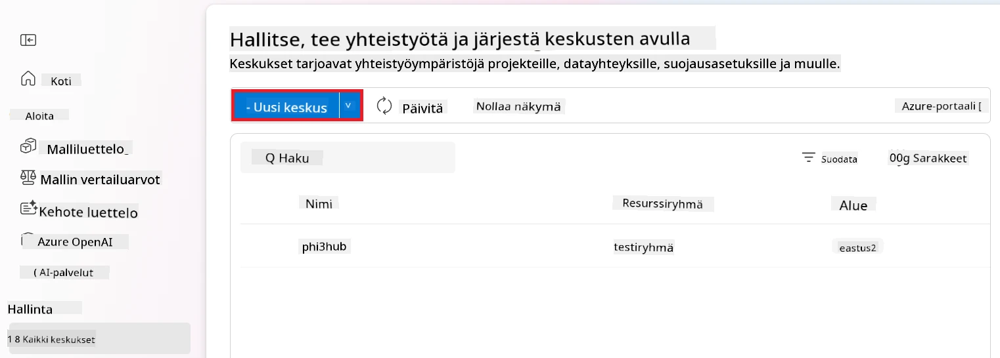

1. Suorita seuraavat tehtävät:

    - Syötä **Hub name**. Sen täytyy olla yksilöllinen arvo.
    - Valitse Azure-tilauksesi (**Subscription**).
    - Valitse käytettävä **Resource group** (luo uusi tarvittaessa).
    - Valitse haluamasi **Location**.
    - Valitse käytettävä **Connect Azure AI Services** (luo uusi tarvittaessa).
    - Valitse **Connect Azure AI Search** ja valitse **Skip connecting**.

    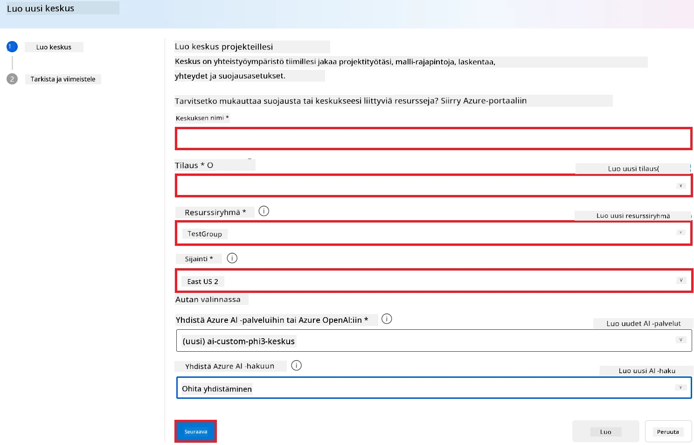

1. Valitse **Next**.

#### Luo Azure AI Foundry -projekti

1. Valitse luomassasi Hubissa vasemman sivupalkin välilehdeltä **All projects**.

1. Valitse navigaatiovalikosta **+ New project**.

    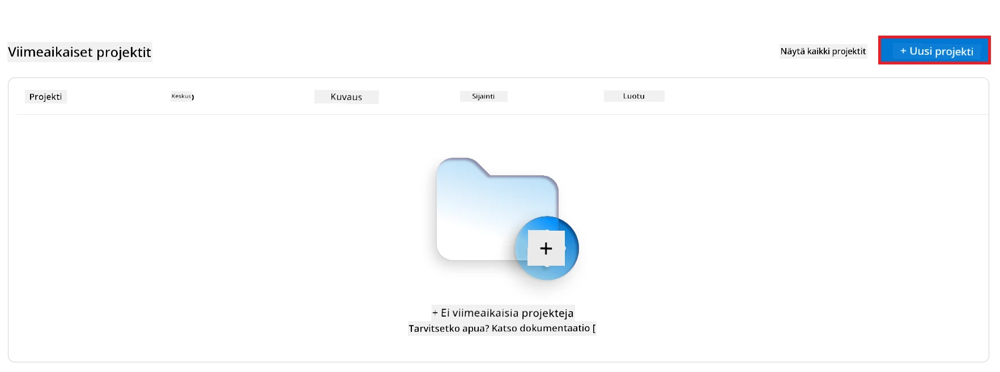

1. Syötä **Project name**. Sen täytyy olla yksilöllinen arvo.

    

1. Valitse **Create a project**.

#### Lisää mukautettu yhteys hienosäädetylle Phi-3 / Phi-3.5 -mallille

Jotta voit integroida mukautetun Phi-3 / Phi-3.5 -mallisi Prompt flow'hun, sinun täytyy tallentaa mallin endpoint ja avain mukautettuun yhteyteen. Tämä varmistaa pääsyn mukautettuun Phi-3 / Phi-3.5 -malliisi Prompt flow'ssa.

#### Aseta hienosäädetyn Phi-3 / Phi-3.5 -mallin api-avain ja endpoint-URI

1. Siirry osoitteeseen [Azure ML Studio](https://ml.azure.com/home?wt.mc_id=studentamb_279723).

1. Siirry luomaasi Azure Machine Learning -työtilaan.

1. Valitse vasemman sivupalkin välilehdeltä **Endpoints**.

    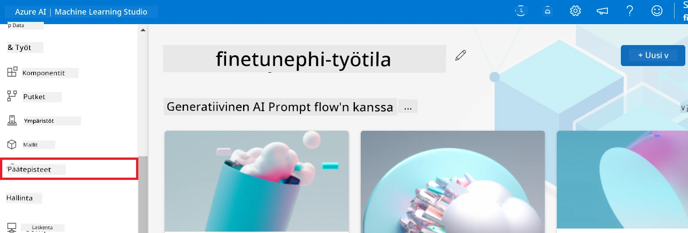

1. Valitse luomasi endpoint.

    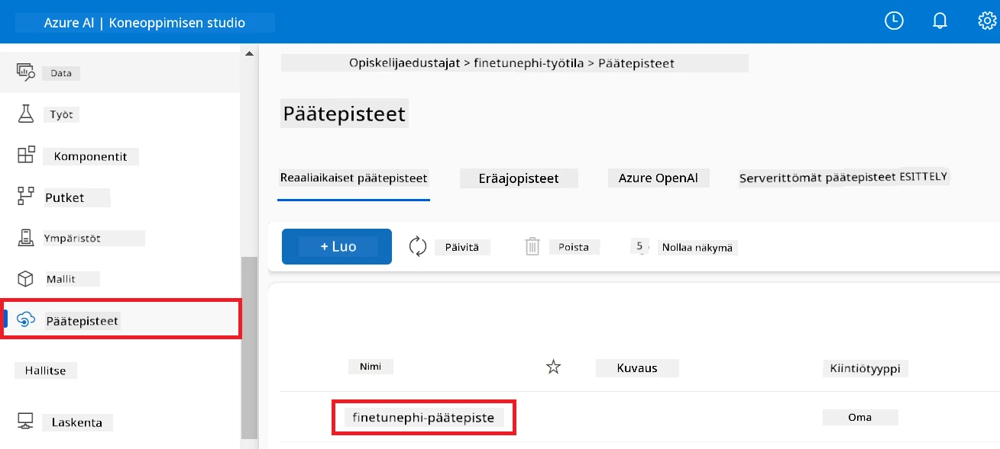

1. Valitse navigaatiovalikosta **Consume**.

1. Kopioi **REST endpoint** ja **Primary key**.

    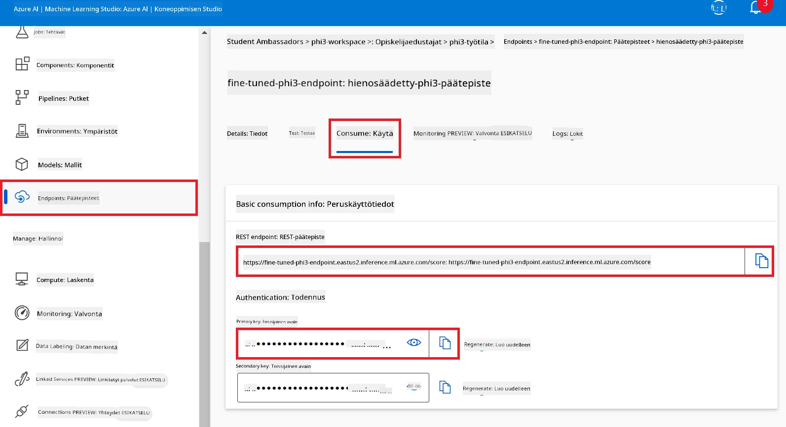

#### Lisää mukautettu yhteys

1. Siirry osoitteeseen [Azure AI Foundry](https://ai.azure.com/?wt.mc_id=studentamb_279723).

1. Siirry luomaasi Azure AI Foundry -projektiin.

1. Valitse luomassasi projektissa vasemman sivupalkin välilehdeltä **Settings**.

1. Valitse **+ New connection**.

    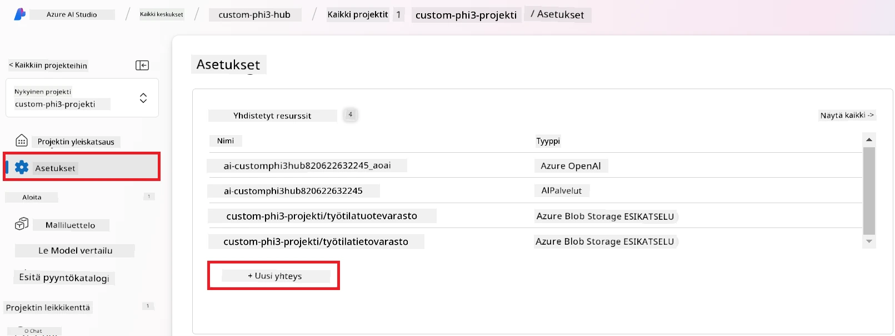

1. Valitse navigaatiovalikosta **Custom keys**.

    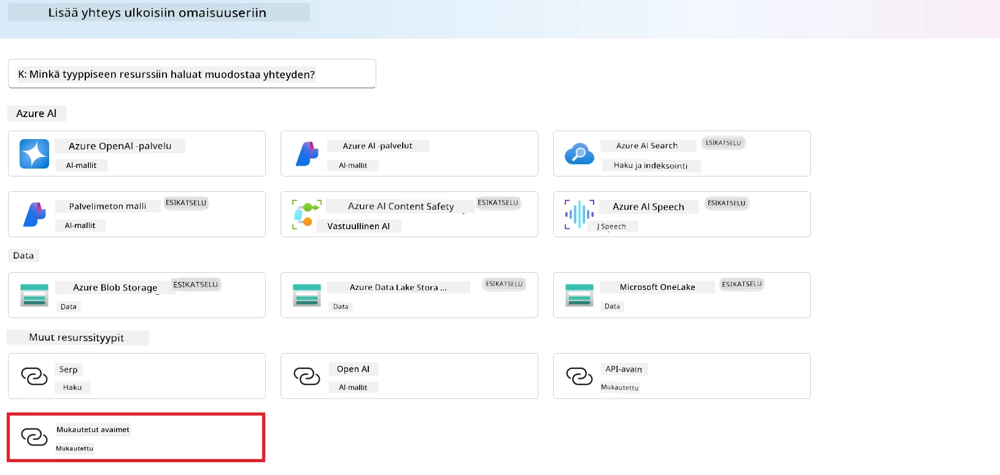

1. Suorita seuraavat tehtävät:

    - Valitse **+ Add key value pairs**.
    - Avaimen nimeksi kirjoita **endpoint** ja liitä Azure ML Studiosta kopioimasi endpoint arvokenttään.
    - Valitse uudelleen **+ Add key value pairs**.
    - Avaimen nimeksi kirjoita **key** ja liitä Azure ML Studiosta kopioimasi avain arvokenttään.
    - Kun avaimet on lisätty, valitse **is secret** estääksesi avaimen paljastumisen.

    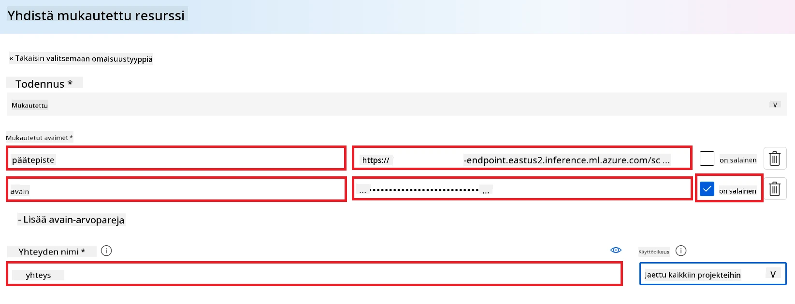

1. Valitse **Add connection**.

#### Luo Prompt flow

Olet lisännyt mukautetun yhteyden Azure AI Foundryssa. Luodaan nyt Prompt flow seuraavien ohjeiden mukaan. Tämän jälkeen yhdistät Prompt flow'n mukautettuun yhteyteen, jotta voit käyttää hienosäädettyä mallia Prompt flow'ssa.

1. Siirry luomaasi Azure AI Foundry -projektiin.

1. Valitse vasemman sivupalkin välilehdeltä **Prompt flow**.

1. Valitse navigaatiovalikosta **+ Create**.

    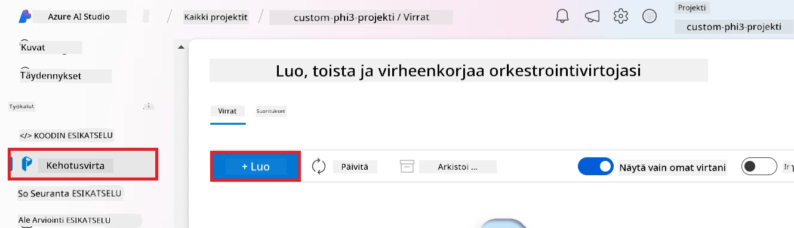

1. Valitse navigaatiovalikosta **Chat flow**.

    

1. Syötä käytettävä **Folder name**.

    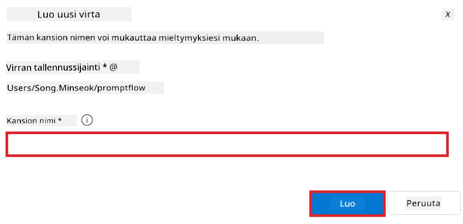

1. Valitse **Create**.

#### Määritä Prompt flow keskustelemaan mukautetun Phi-3 / Phi-3.5 -mallisi kanssa

Sinun täytyy integroida hienosäädetty Phi-3 / Phi-3.5 -malli Prompt flow'hun. Nykyinen Prompt flow ei ole suunniteltu tätä varten, joten sinun täytyy muokata Prompt flow uudelleen, jotta mukautettu malli voidaan integroida.

1. Prompt flow'ssa tee seuraavat toimenpiteet rakentaaksesi olemassa olevan flow'n uudelleen:

    - Valitse **Raw file mode**.
    - Poista kaikki olemassa oleva koodi tiedostosta *flow.dag.yml*.
    - Lisää seuraava koodi tiedostoon *flow.dag.yml*.

        ```yml
        inputs:
          input_data:
            type: string
            default: "Who founded Microsoft?"

        outputs:
          answer:
            type: string
            reference: ${integrate_with_promptflow.output}

        nodes:
        - name: integrate_with_promptflow
          type: python
          source:
            type: code
            path: integrate_with_promptflow.py
          inputs:
            input_data: ${inputs.input_data}
        ```

    - Valitse **Save**.

    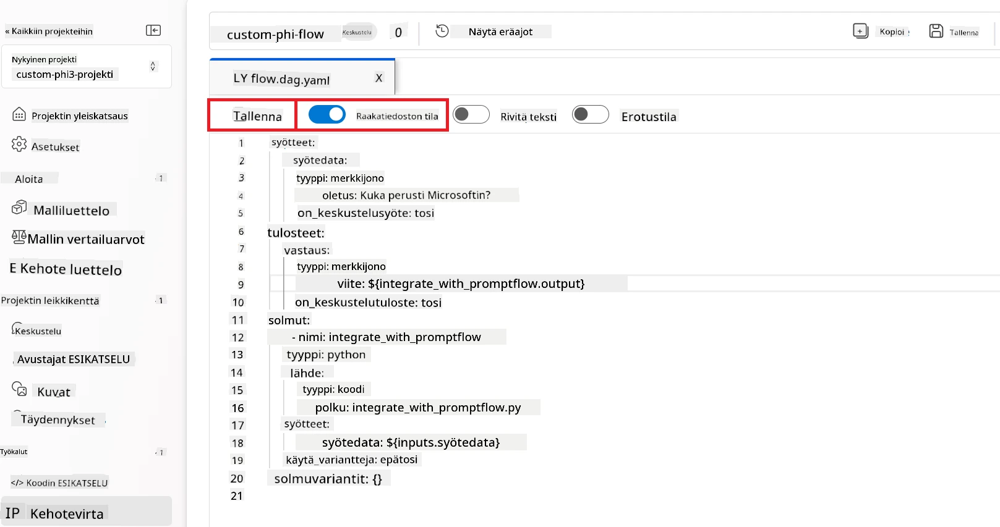

1. Lisää seuraava koodi tiedostoon *integrate_with_promptflow.py* käyttääksesi mukautettua Phi-3 / Phi-3.5 -mallia Prompt flow'ssa.

    ```python
    import logging
    import requests
    from promptflow import tool
    from promptflow.connections import CustomConnection

    # Logging setup
    logging.basicConfig(
        format="%(asctime)s - %(levelname)s - %(name)s - %(message)s",
        datefmt="%Y-%m-%d %H:%M:%S",
        level=logging.DEBUG
    )
    logger = logging.getLogger(__name__)

    def query_phi3_model(input_data: str, connection: CustomConnection) -> str:
        """
        Send a request to the Phi-3 / Phi-3.5 model endpoint with the given input data using Custom Connection.
        """

        # "connection" is the name of the Custom Connection, "endpoint", "key" are the keys in the Custom Connection
        endpoint_url = connection.endpoint
        api_key = connection.key

        headers = {
            "Content-Type": "application/json",
            "Authorization": f"Bearer {api_key}"
        }
    data = {
        "input_data": [input_data],
        "params": {
            "temperature": 0.7,
            "max_new_tokens": 128,
            "do_sample": True,
            "return_full_text": True
            }
        }
        try:
            response = requests.post(endpoint_url, json=data, headers=headers)
            response.raise_for_status()
            
            # Log the full JSON response
            logger.debug(f"Full JSON response: {response.json()}")

            result = response.json()["output"]
            logger.info("Successfully received response from Azure ML Endpoint.")
            return result
        except requests.exceptions.RequestException as e:
            logger.error(f"Error querying Azure ML Endpoint: {e}")
            raise

    @tool
    def my_python_tool(input_data: str, connection: CustomConnection) -> str:
        """
        Tool function to process input data and query the Phi-3 / Phi-3.5 model.
        """
        return query_phi3_model(input_data, connection)

    ```

    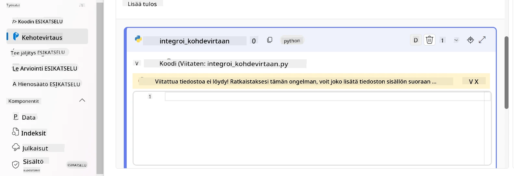

> [!NOTE]
> Lisätietoja Prompt flow'n käytöstä Azure AI Foundryssa löydät osoitteesta [Prompt flow in Azure AI Foundry](https://learn.microsoft.com/azure/ai-studio/how-to/prompt-flow).

1. Valitse **Chat input** ja **Chat output** ottaaksesi keskustelun mallisi kanssa käyttöön.

    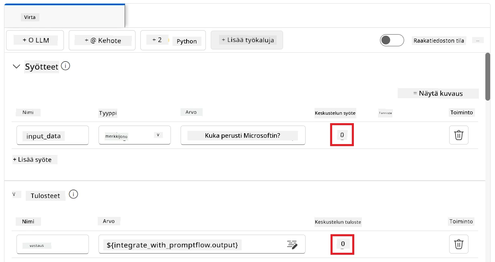

1. Nyt olet valmis keskustelemaan mukautetun Phi-3 / Phi-3.5 -mallisi kanssa. Seuraavassa harjoituksessa opit, miten Prompt flow käynnistetään ja miten sitä käytetään keskusteluun hienosäädetyn Phi-3 / Phi-3.5 -mallin kanssa.

> [!NOTE]
>
> Uudelleen rakennettu flow näyttää tältä:
>
> 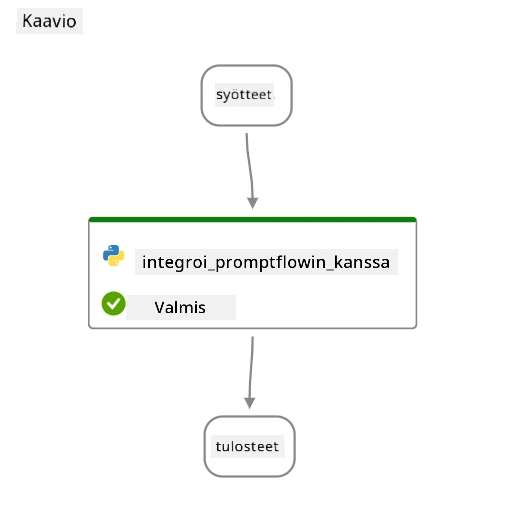
>

#### Käynnistä Prompt flow

1. Valitse **Start compute sessions** käynnistääksesi Prompt flow'n.

    

1. Valitse **Validate and parse input** päivittääksesi parametrit.

    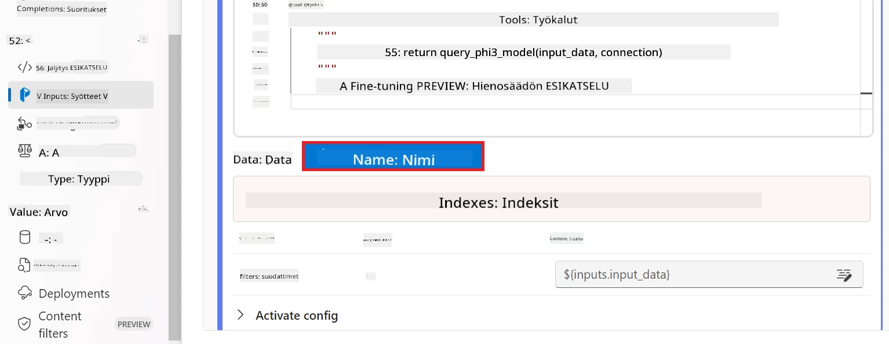

1. Valitse **connection**-arvoksi luomasi mukautettu yhteys, esimerkiksi *connection*.

    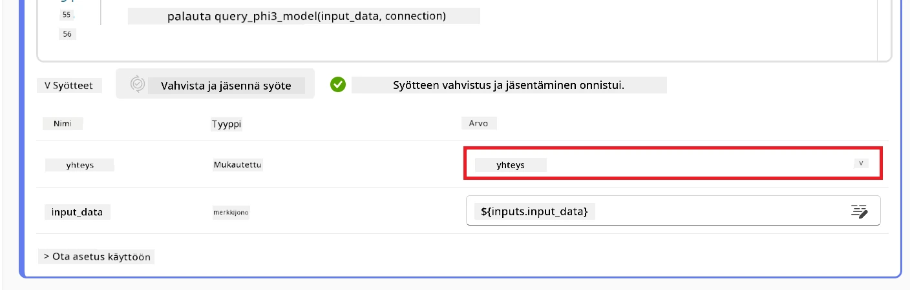

#### Keskustele mukautetun Phi-3 / Phi-3.5 -mallisi kanssa

1. Valitse **Chat**.

    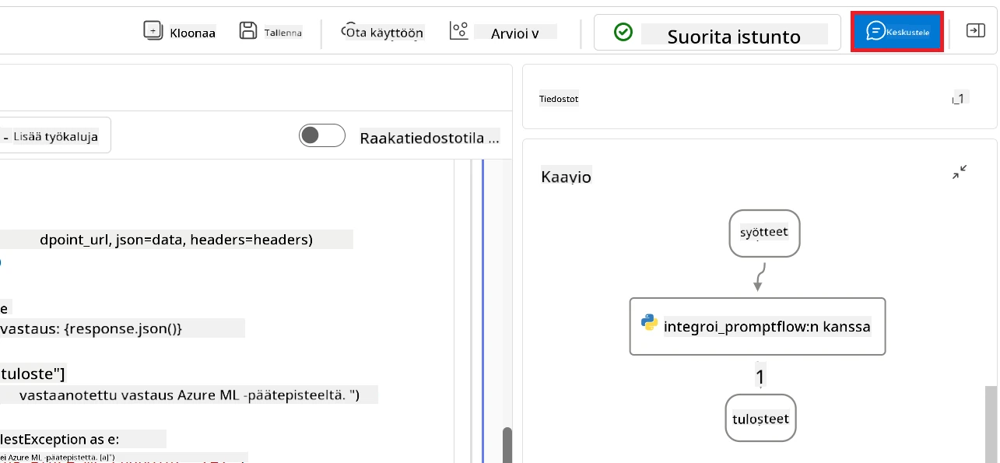

1. Tässä esimerkki tuloksista: Nyt voit keskustella mukautetun Phi-3 / Phi-3.5 -mallisi kanssa. On suositeltavaa esittää kysymyksiä, jotka perustuvat hienosäätöön käytettyyn dataan.

    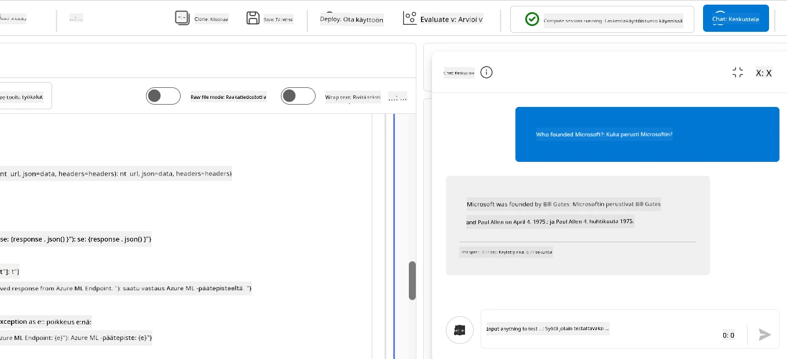

### Ota käyttöön Azure OpenAI Phi-3 / Phi-3.5 -mallin arviointia varten

Phi-3 / Phi-3.5 -mallin arvioimiseksi Azure AI Foundryssa sinun täytyy ottaa käyttöön Azure OpenAI -malli. Tätä mallia käytetään Phi-3 / Phi-3.5 -mallin suorituskyvyn arviointiin.

#### Ota Azure OpenAI käyttöön

1. Kirjaudu sisään [Azure AI Foundry](https://ai.azure.com/?wt.mc_id=studentamb_279723).

1. Siirry luomaasi Azure AI Foundry -projektiin.

    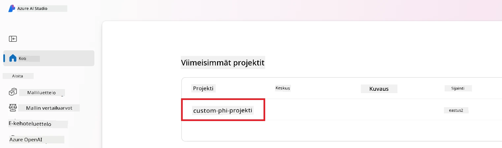

1. Valitse luomassasi projektissa vasemman sivupalkin välilehdeltä **Deployments**.

1. Valitse navigaatiovalikosta **+ Deploy model**.

1. Valitse **Deploy base model**.

    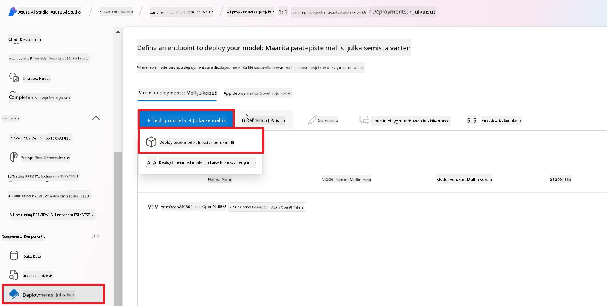

1. Valitse käytettävä Azure OpenAI -malli, esimerkiksi **gpt-4o**.

    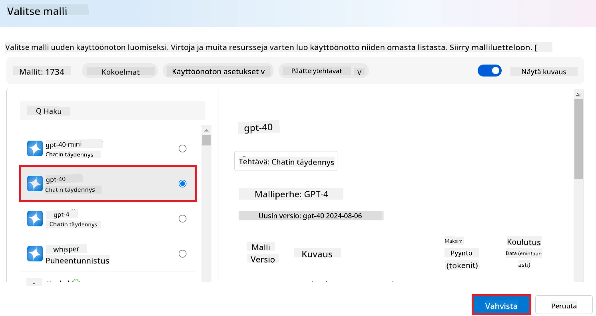

1. Valitse **Confirm**.

### Arvioi hienosäädetty Phi-3 / Phi-3.5 -malli Azure AI Foundryn Prompt flow -arvioinnilla

### Aloita uusi arviointi

1. Siirry osoitteeseen [Azure AI Foundry](https://ai.azure.com/?wt.mc_id=studentamb_279723).

1. Siirry luomaasi Azure AI Foundry -projektiin.

    

1. Valitse luomassasi projektissa vasemman sivupalkin välilehdeltä **Evaluation**.

1. Valitse navigaatiovalikosta **+ New evaluation**.

    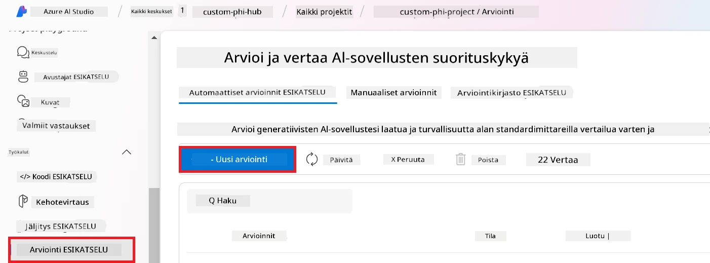

1. Valitse **Prompt flow** -arviointi.

    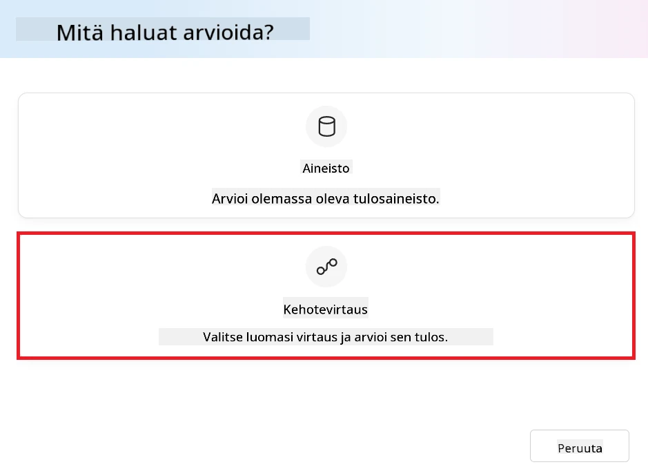

1. Suorita seuraavat tehtävät:

    - Syötä arvioinnin nimi. Sen täytyy olla yksilöllinen arvo.
    - Valitse tehtävätyypiksi **Question and answer without context**, koska tässä ohjeistuksessa käytetty **ULTRACHAT_200k** -aineisto ei sisällä kontekstia.
    - Valitse arvioitava prompt flow.

    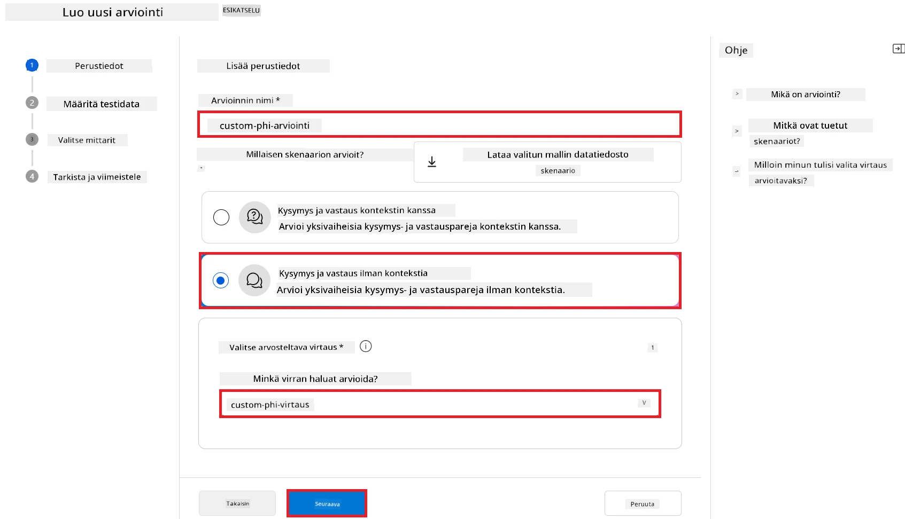

1. Valitse **Next**.

1. Suorita seuraavat tehtävät:

    - Valitse **Add your dataset** ladataksesi aineiston. Esimerkiksi voit ladata testiaineiston tiedoston, kuten *test_data.json1*, joka sisältyy **ULTRACHAT_200k** -aineistoon.
    - Valitse sopiva **Dataset column**, joka vastaa aineistoasi. Esimerkiksi **ULTRACHAT_200k** -aineiston tapauksessa valitse **${data.prompt}** dataset-sarakkeeksi.

    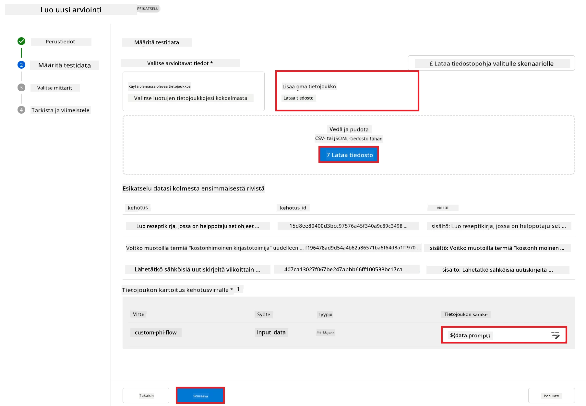

1. Valitse **Next**.

1. Suorita seuraavat tehtävät suorituskyky- ja laatumittareiden määrittämiseksi:

    - Valitse käytettävät suorituskyky- ja laatumittarit.
    - Valitse arviointiin käyttämäsi Azure OpenAI -malli, esimerkiksi **gpt-4o**.

    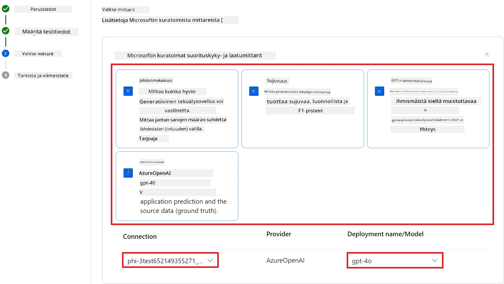

1. Suorita seuraavat tehtävät riskien ja turvallisuusmittareiden määrittämiseksi:

    - Valitse käytettävät riskien ja turvallisuusmittarit.
    - Valitse kynnysarvo vikaprosentin laskemiseen, esimerkiksi **Medium**.
    - Kysymykselle valitse **Data source** arvoksi **{$data.prompt}**.
    - Vastaukselle valitse **Data source** arvoksi **{$run.outputs.answer}**.
    - Totuustiedolle valitse **Data source** arvoksi **{$data.message}**.

    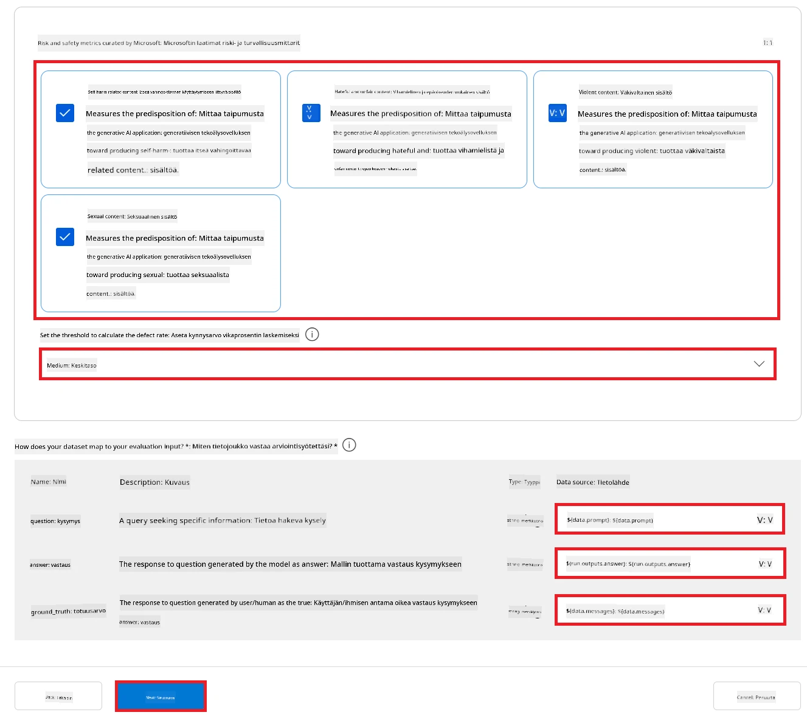

1. Valitse **Next**.

1. Valitse **Submit** aloittaaksesi arvioinnin.

1. Arviointi kestää hetken. Voit seurata etenemistä **Evaluation**-välilehdellä.

### Tarkastele arvioinnin tuloksia
> [!NOTE]
> Alla esitetyt tulokset on tarkoitettu havainnollistamaan arviointiprosessia. Tässä opetusohjelmassa olemme käyttäneet mallia, joka on hienosäädetty suhteellisen pienellä aineistolla, mikä saattaa johtaa ei-optimaalisiin tuloksiin. Todelliset tulokset voivat vaihdella merkittävästi käytetyn aineiston koon, laadun ja monimuotoisuuden sekä mallin erityisen konfiguraation mukaan.
Kun arviointi on valmis, voit tarkastella tuloksia sekä suorituskyky- että turvallisuusmittareiden osalta.

1. Suorituskyky- ja laatumittarit:

    - arvioi mallin tehokkuutta tuottaa johdonmukaisia, sujuvia ja asiaankuuluvia vastauksia.

    

1. Riskien ja turvallisuuden mittarit:

    - Varmista, että mallin tuottamat vastaukset ovat turvallisia ja noudattavat Responsible AI Principles -periaatteita, välttäen haitallista tai loukkaavaa sisältöä.

    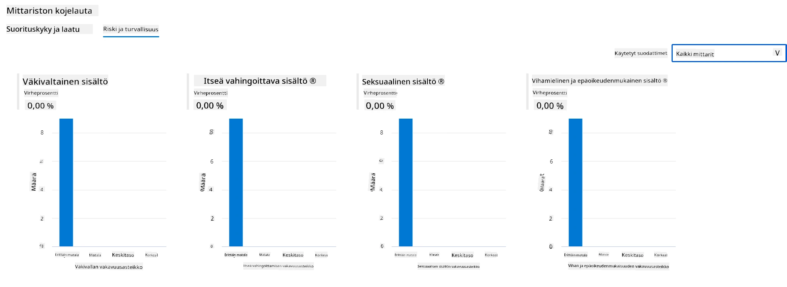

1. Voit selata alaspäin nähdäksesi **Yksityiskohtaiset mittaustulokset**.

    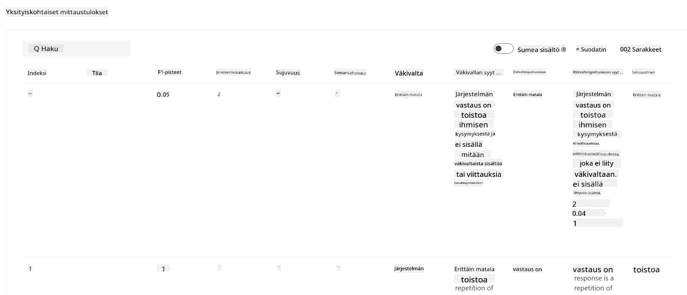

1. Arvioimalla mukautetun Phi-3 / Phi-3.5 -mallisi sekä suorituskyky- että turvallisuusmittareiden perusteella voit varmistaa, että malli ei ole pelkästään tehokas, vaan myös noudattaa vastuullisen tekoälyn käytäntöjä, tehden siitä valmiin käytettäväksi todellisissa sovelluksissa.

## Onnittelut!

### Olet suorittanut tämän opetusohjelman

Olet onnistuneesti arvioinut hienosäädetyn Phi-3 -mallin, joka on integroitu Prompt flow -työkaluun Azure AI Foundryssa. Tämä on tärkeä askel varmistettaessa, että tekoälymallisi eivät ainoastaan toimi hyvin, vaan myös noudattavat Microsoftin Responsible AI -periaatteita, auttaen sinua rakentamaan luotettavia ja vastuullisia tekoälysovelluksia.


## Siivoa Azure-resurssit

Siivoa Azure-resurssisi välttääksesi ylimääräiset maksut tilillesi. Mene Azure-portaaliin ja poista seuraavat resurssit:

- Azure Machine learning -resurssi.
- Azure Machine learning -mallin päätepiste.
- Azure AI Foundry Project -resurssi.
- Azure AI Foundry Prompt flow -resurssi.

### Seuraavat askeleet

#### Dokumentaatio

- [Assess AI systems by using the Responsible AI dashboard](https://learn.microsoft.com/azure/machine-learning/concept-responsible-ai-dashboard?view=azureml-api-2&source=recommendations?wt.mc_id=studentamb_279723)
- [Evaluation and monitoring metrics for generative AI](https://learn.microsoft.com/azure/ai-studio/concepts/evaluation-metrics-built-in?tabs=definition?wt.mc_id=studentamb_279723)
- [Azure AI Foundry documentation](https://learn.microsoft.com/azure/ai-studio/?wt.mc_id=studentamb_279723)
- [Prompt flow documentation](https://microsoft.github.io/promptflow/?wt.mc_id=studentamb_279723)

#### Koulutusmateriaali

- [Introduction to Microsoft's Responsible AI Approach](https://learn.microsoft.com/training/modules/introduction-to-microsofts-responsible-ai-approach/?source=recommendations?wt.mc_id=studentamb_279723)
- [Introduction to Azure AI Foundry](https://learn.microsoft.com/training/modules/introduction-to-azure-ai-studio/?wt.mc_id=studentamb_279723)

### Viitteet

- [What is Responsible AI?](https://learn.microsoft.com/azure/machine-learning/concept-responsible-ai?view=azureml-api-2?wt.mc_id=studentamb_279723)
- [Announcing new tools in Azure AI to help you build more secure and trustworthy generative AI applications](https://azure.microsoft.com/blog/announcing-new-tools-in-azure-ai-to-help-you-build-more-secure-and-trustworthy-generative-ai-applications/?wt.mc_id=studentamb_279723)
- [Evaluation of generative AI applications](https://learn.microsoft.com/azure/ai-studio/concepts/evaluation-approach-gen-ai?wt.mc_id%3Dstudentamb_279723)

**Vastuuvapauslauseke**:  
Tämä asiakirja on käännetty käyttämällä tekoälypohjaista käännöspalvelua [Co-op Translator](https://github.com/Azure/co-op-translator). Vaikka pyrimme tarkkuuteen, huomioithan, että automaattikäännöksissä saattaa esiintyä virheitä tai epätarkkuuksia. Alkuperäistä asiakirjaa sen alkuperäiskielellä tulee pitää virallisena lähteenä. Tärkeissä asioissa suositellaan ammattimaista ihmiskäännöstä. Emme ole vastuussa tämän käännöksen käytöstä aiheutuvista väärinymmärryksistä tai tulkinnoista.