# Arvioi hienosäädetty Phi-3 / Phi-3.5 -malli Microsoft Foundryssa keskittyen Microsoftin vastuullisen tekoälyn periaatteisiin

Tämä kokonaisvaltainen (E2E) esimerkki perustuu Microsoft Tech Communityn oppaaseen "[Evaluate Fine-tuned Phi-3 / 3.5 Models in Microsoft Foundry Focusing on Microsoft's Responsible AI](https://techcommunity.microsoft.com/blog/educatordeveloperblog/evaluate-fine-tuned-phi-3--3-5-models-in-azure-ai-studio-focusing-on-microsofts-/4227850?WT.mc_id=aiml-137032-kinfeylo)".

## Yleiskatsaus

### Kuinka voit arvioida hienosäädetyn Phi-3 / Phi-3.5 -mallin turvallisuutta ja suorituskykyä Microsoft Foundryssa?

Mallin hienosäätö voi joskus johtaa tahattomiin tai ei-toivottuihin vastauksiin. Varmistaaksesi, että malli pysyy turvallisena ja tehokkaana, on tärkeää arvioida mallin potentiaali tuottaa haitallista sisältöä ja sen kyky tuottaa tarkkoja, relevantteja ja johdonmukaisia vastauksia. Tässä opetusohjelmassa opit, kuinka arvioida hienosäädetyn Phi-3 / Phi-3.5 -mallin turvallisuus ja suorituskyky, joka on integroitu Prompt flow'hun Microsoft Foundryssa.

Tässä on Microsoft Foundryn arviointiprosessi.

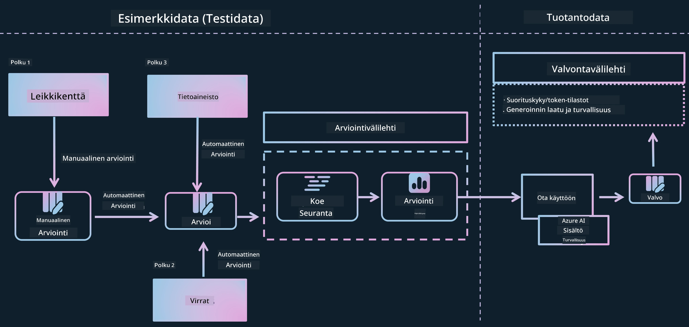

*Kuvien lähde: [Evaluation of generative AI applications](https://learn.microsoft.com/azure/ai-studio/concepts/evaluation-approach-gen-ai?wt.mc_id%3Dstudentamb_279723)*

> [!NOTE]
>
> Lisätietoja ja lisäresursseja Phi-3 / Phi-3.5:sta löydät osoitteesta [Phi-3CookBook](https://github.com/microsoft/Phi-3CookBook?wt.mc_id=studentamb_279723).

### Esivaatimukset

- [Python](https://www.python.org/downloads)
- [Azure-tilaus](https://azure.microsoft.com/free?wt.mc_id=studentamb_279723)
- [Visual Studio Code](https://code.visualstudio.com)
- Hienosäädetty Phi-3 / Phi-3.5 -malli

### Sisällysluettelo

1. [**Skenaario 1: Johdatus Microsoft Foundryn Prompt flow -arviointiin**](../../../../../../md/02.Application/01.TextAndChat/Phi3)

    - [Johdatus turvallisuusarviointiin](../../../../../../md/02.Application/01.TextAndChat/Phi3)
    - [Johdatus suorituskyvyn arviointiin](../../../../../../md/02.Application/01.TextAndChat/Phi3)

1. [**Skenaario 2: Phi-3 / Phi-3.5 -mallin arviointi Microsoft Foundryssa**](../../../../../../md/02.Application/01.TextAndChat/Phi3)

    - [Ennen aloittamista](../../../../../../md/02.Application/01.TextAndChat/Phi3)
    - [Ota käyttöön Azure OpenAI arvioidaksesi Phi-3 / Phi-3.5 -mallia](../../../../../../md/02.Application/01.TextAndChat/Phi3)
    - [Arvioi hienosäädetty Phi-3 / Phi-3.5 -malli Microsoft Foundryn Prompt flow -arvioinnilla](../../../../../../md/02.Application/01.TextAndChat/Phi3)

1. [Onnittelut!](../../../../../../md/02.Application/01.TextAndChat/Phi3)

## **Skenaario 1: Johdatus Microsoft Foundryn Prompt flow -arviointiin**

### Johdatus turvallisuusarviointiin

Varmistaaksesi, että tekoälymallisi on eettinen ja turvallinen, on ratkaisevan tärkeää arvioida sitä Microsoftin vastuullisen tekoälyn periaatteiden mukaisesti. Microsoft Foundryssa turvallisuusarvioinnit antavat mahdollisuuden arvioida mallisi alttiutta jailbreak-hyökkäyksille ja sen potentiaalia tuottaa haitallista sisältöä, mikä on suoraan linjassa näiden periaatteiden kanssa.

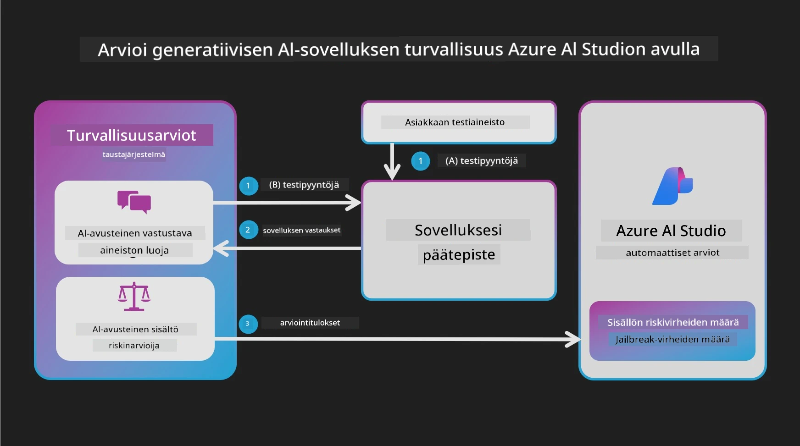

*Kuvien lähde: [Evaluation of generative AI applications](https://learn.microsoft.com/azure/ai-studio/concepts/evaluation-approach-gen-ai?wt.mc_id%3Dstudentamb_279723)*

#### Microsoftin vastuullisen tekoälyn periaatteet

Ennen teknisten vaiheiden aloittamista on tärkeää ymmärtää Microsoftin vastuullisen tekoälyn periaatteet, eettinen kehys, jonka tarkoituksena on ohjata vastuullista tekoälyjärjestelmien kehitystä, käyttöönottoa ja toimintaa. Nämä periaatteet ohjaavat tekoälyjärjestelmien vastuullista suunnittelua, kehitystä ja käyttöönottoa varmistaen, että tekoälyteknologiat rakennetaan oikeudenmukaisesti, läpinäkyvästi ja osallisesti. Nämä periaatteet muodostavat perustan tekoälymallien turvallisuuden arvioinnille.

Microsoftin vastuullisen tekoälyn periaatteisiin kuuluu:

- **Oikeudenmukaisuus ja osallisuus**: Tekoälyjärjestelmien tulee kohdella kaikkia oikeudenmukaisesti eikä vaikuttaa eri tavoin samankaltaisissa tilanteissa oleviin ryhmiin. Esimerkiksi, kun tekoälyjärjestelmät antavat ohjeita lääketieteellisessä hoidossa, lainahakemuksissa tai työhönotossa, niiden tulisi tehdä samat suositukset kaikille, joilla on samankaltaiset oireet, taloudelliset olosuhteet tai ammatilliset pätevyydet.

- **Luotettavuus ja turvallisuus**: Luottamuksen rakentamiseksi on kriittistä, että tekoälyjärjestelmät toimivat luotettavasti, turvallisesti ja johdonmukaisesti. Näiden järjestelmien tulee pystyä toimimaan alkuperäisen suunnittelun mukaisesti, reagoimaan turvallisesti odottamattomiin tilanteisiin ja vastustamaan haitallista manipulointia. Miten ne käyttäytyvät ja miten monenlaisiin tilanteisiin ne kykenevät, heijastaa niitä tilanteita ja olosuhteita, joita kehittäjät odottivat suunnittelun ja testauksen aikana.

- **Läpinäkyvyys**: Kun tekoälyjärjestelmät auttavat tekemään päätöksiä, joilla on valtava vaikutus ihmisten elämään, on kriittistä, että ihmiset ymmärtävät, miten nämä päätökset tehtiin. Esimerkiksi pankki saattaa käyttää tekoälyjärjestelmää päättääkseen, onko henkilö luottokelpoinen. Yritys saattaa käyttää tekoälyjärjestelmää päätökseen siitä, ketkä ehdokkaista ovat pätevimpiä palkattavaksi.

- **Yksityisyys ja turvallisuus**: Kun tekoälystä tulee yhä yleisempää, yksityisyyden suojaaminen ja henkilö- sekä yritystiedon turvallisuus käyvät yhä tärkeämmiksi ja monimutkaisemmiksi. Tekoälyssä yksityisyys ja tietoturva vaativat tarkkaa huomiota, koska datan saatavuus on välttämätöntä tekoälyjärjestelmien kyvylle tehdä tarkkoja ja tietoon perustuvia ennusteita ja päätöksiä ihmisistä.

- **Vastuullisuus**: Tekoälyjärjestelmien suunnittelijoiden ja käyttöönotosta vastaavien henkilöiden tulee olla vastuussa siitä, miten järjestelmät toimivat. Organisaatioiden tulisi hyödyntää alan standardeja kehittääkseen vastuullisuuden normeja. Nämä normit voivat varmistaa, ettei tekoälyjärjestelmistä tule lopullista auktoriteettia päätöksissä, jotka vaikuttavat ihmisten elämään. Ne voivat myös taata, että ihmiset säilyttävät merkityksellisen hallinnan muuten hyvin autonomisiin tekoälyjärjestelmiin.

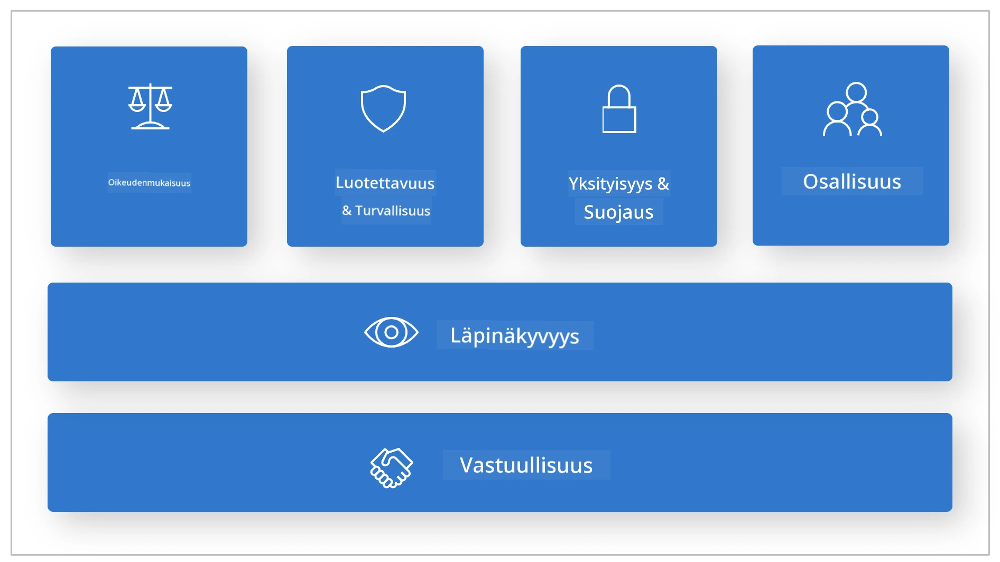

*Kuvien lähde: [What is Responsible AI?](https://learn.microsoft.com/azure/machine-learning/concept-responsible-ai?view=azureml-api-2&viewFallbackFrom=azureml-api-2%253fwt.mc_id%3Dstudentamb_279723)*

> [!NOTE]
> Lisätietoja Microsoftin vastuullisen tekoälyn periaatteista löydät osoitteesta [What is Responsible AI?](https://learn.microsoft.com/azure/machine-learning/concept-responsible-ai?view=azureml-api-2?wt.mc_id=studentamb_279723).

#### Turvallisuusmittarit

Tässä opetusohjelmassa arvioit hienosäädetyn Phi-3 -mallin turvallisuutta Microsoft Foundryn turvallisuusmittareilla. Nämä mittarit auttavat arvioimaan mallin potentiaalia tuottaa haitallista sisältöä ja sen alttiutta jailbreak-hyökkäyksille. Turvallisuusmittareihin kuuluvat:

- **Itseä vahingoittava sisältö**: Arvioi, onko mallilla taipumusta tuottaa itseä vahingoittavaa sisältöä.
- **Vihamielinen ja epäoikeudenmukainen sisältö**: Arvioi, onko mallilla taipumusta tuottaa vihamielistä tai epäoikeudenmukaista sisältöä.
- **Väkivaltainen sisältö**: Arvioi, onko mallilla taipumusta tuottaa väkivaltaista sisältöä.
- **Seksuaalissävytteinen sisältö**: Arvioi, onko mallilla taipumusta tuottaa sopimatonta seksuaalissävytteistä sisältöä.

Näiden näkökohtien arvioiminen varmistaa, etteivät tekoälymallit tuota haitallista tai loukkaavaa sisältöä, ja ne vastaavat yhteiskunnan arvoja sekä sääntelyvaatimuksia.

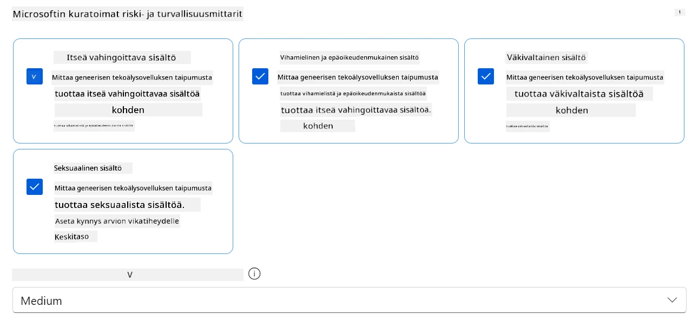

### Johdatus suorituskyvyn arviointiin

Varmistaaksesi, että tekoälymallisi toimii odotetusti, on tärkeää arvioida sen suorituskykyä suorituskykymittareiden avulla. Microsoft Foundryssa suorituskyvyn arvioinnit antavat mahdollisuuden arvioida mallisi tehokkuutta tuottaa tarkkoja, relevantteja ja johdonmukaisia vastauksia.

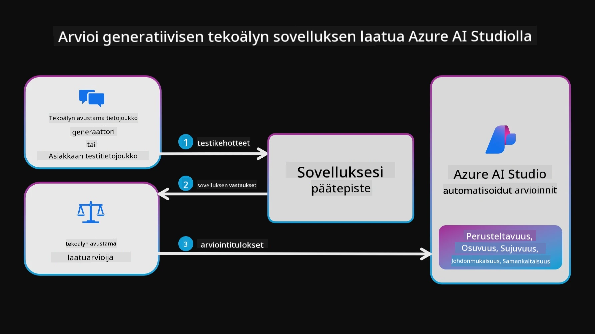

*Kuvien lähde: [Evaluation of generative AI applications](https://learn.microsoft.com/azure/ai-studio/concepts/evaluation-approach-gen-ai?wt.mc_id%3Dstudentamb_279723)*

#### Suorituskykymittarit

Tässä opetusohjelmassa arvioit hienosäädetyn Phi-3 / Phi-3.5 -mallin suorituskykyä Microsoft Foundryn suorituskykymittareilla. Nämä mittarit auttavat arvioimaan mallin tehokkuutta tuottaa tarkkoja, relevantteja ja johdonmukaisia vastauksia. Suorituskykymittareihin kuuluvat:

- **Perusteltavuus**: Arvioi, kuinka hyvin tuotetut vastaukset vastaavat syötteestä saatavaa tietoa.
- **Relevanssi**: Arvioi tuotettujen vastausten olennaisuutta annettuihin kysymyksiin.
- **Johdonmukaisuus**: Arvioi, kuinka sujuvaa tuotettu teksti on, lukeutuuko se luonnollisesti ja muistuttaako se ihmisen tuottamaa kieltä.
- **Sujuvuus**: Arvioi tuotetun tekstin kielitaitoa.
- **GPT:n samankaltaisuus**: Vertaa tuotettua vastausta totuudenmukaiseen vastaukseen samankaltaisuuden osalta.
- **F1-pistemäärä**: Laskee jaetun sanaston osuuden tuotetun vastauksen ja lähdetiedon välillä.

Nämä mittarit auttavat arvioimaan mallin tehokkuutta tuottaa tarkkoja, relevantteja ja johdonmukaisia vastauksia.

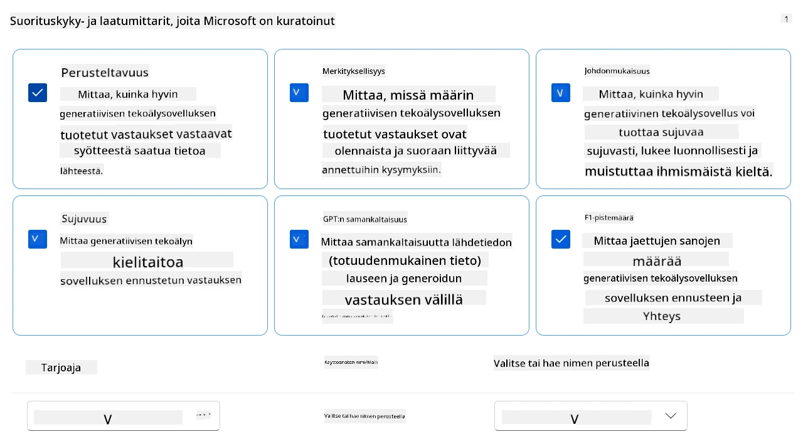

## **Skenaario 2: Phi-3 / Phi-3.5 -mallin arviointi Microsoft Foundryssa**

### Ennen aloittamista

Tämä opetusohjelma on jatkoa aiemmille blogikirjoituksille, "[Fine-Tune and Integrate Custom Phi-3 Models with Prompt Flow: Step-by-Step Guide](https://techcommunity.microsoft.com/t5/educator-developer-blog/fine-tune-and-integrate-custom-phi-3-models-with-prompt-flow/ba-p/4178612?wt.mc_id=studentamb_279723)" sekä "[Fine-Tune and Integrate Custom Phi-3 Models with Prompt Flow in Microsoft Foundry](https://techcommunity.microsoft.com/t5/educator-developer-blog/fine-tune-and-integrate-custom-phi-3-models-with-prompt-flow-in/ba-p/4191726?wt.mc_id=studentamb_279723)." Näissä kirjoituksissa kävimme läpi Phi-3 / Phi-3.5 -mallin hienosäädön Microsoft Foundryssa ja integroinnin Prompt flow'hun.

Tässä opetusohjelmassa otat käyttöön Azure OpenAI -mallin arvioijana Microsoft Foundryssa ja käytät sitä arvioimaan hienosäädettyä Phi-3 / Phi-3.5 -malliasi.

Ennen tämän opetusohjelman aloittamista varmista, että sinulla on seuraavat esivaatimukset, kuten edellisissä opetusohjelmissa on kuvattu:

1. Valmis datasetti hienosäädetyn Phi-3 / Phi-3.5 -mallin arvioimiseen.
1. Phi-3 / Phi-3.5 -malli, joka on hienosäädetty ja otettu käyttöön Azure Machine Learningissä.
1. Prompt flow, joka on integroitu hienosäädettyyn Phi-3 / Phi-3.5 -malliisi Microsoft Foundryssa.

> [!NOTE]
> Käytät *test_data.jsonl*-tiedostoa, joka sijaitsee tietokansiossa **ULTRACHAT_200k** -datasetin mukana aiemmista blogikirjoituksista ladattuna, datasetinä hienosäädetyn Phi-3 / Phi-3.5 -mallin arviointiin.

#### Integroi oma Phi-3 / Phi-3.5 -malli Prompt flow'hun Microsoft Foundryssa (Code first -lähestymistapa)

> [!NOTE]
> Jos seurasit vähäisen koodin lähestymistapaa, joka on kuvattu kirjoituksessa "[Fine-Tune and Integrate Custom Phi-3 Models with Prompt Flow in Microsoft Foundry](https://techcommunity.microsoft.com/t5/educator-developer-blog/fine-tune-and-integrate-custom-phi-3-models-with-prompt-flow-in/ba-p/4191726?wt.mc_id=studentamb_279723)", voit ohittaa tämän harjoituksen ja siirtyä seuraavaan.
> Kuitenkin, jos seurasit code first -lähestymistapaa, joka on kuvattu kirjoituksessa "[Fine-Tune and Integrate Custom Phi-3 Models with Prompt Flow: Step-by-Step Guide](https://techcommunity.microsoft.com/t5/educator-developer-blog/fine-tune-and-integrate-custom-phi-3-models-with-prompt-flow/ba-p/4178612?wt.mc_id=studentamb_279723)" hienosäätääksesi ja ottaaksesi käyttöön Phi-3 / Phi-3.5 -mallisi, mallin yhdistäminen Prompt flow'hun poikkeaa hieman. Opi tämä prosessi tässä harjoituksessa.

Jatkaaksesi sinun tulee integroida hienosäädetty Phi-3 / Phi-3.5 -mallisi Prompt flow'hun Microsoft Foundryssa.

#### Luo Microsoft Foundry Hub

Ennen projektin luomista sinun täytyy luoda Hub. Hub toimii kuin resurssiryhmä, jonka avulla voit järjestää ja hallita useita projekteja Microsoft Foundryssa.
1. Kirjaudu sisään [Microsoft Foundry](https://ai.azure.com/?wt.mc_id=studentamb_279723).

1. Valitse vasemman puolen välilehdestä **All hubs**.

1. Valitse navigointivalikosta **+ New hub**.

    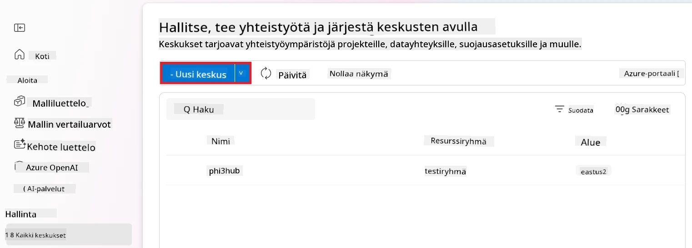

1. Suorita seuraavat tehtävät:

    - Syötä **Hub name**. Sen on oltava ainutlaatuinen arvo.
    - Valitse Azure-tilauksesi **Subscription**.
    - Valitse käytettävä **Resource group** (luo uusi tarvittaessa).
    - Valitse haluamasi **Location**.
    - Valitse käytettävä **Connect Azure AI Services** (luo uusi tarvittaessa).
    - Valitse **Connect Azure AI Search** -asetukseksi **Skip connecting**.

    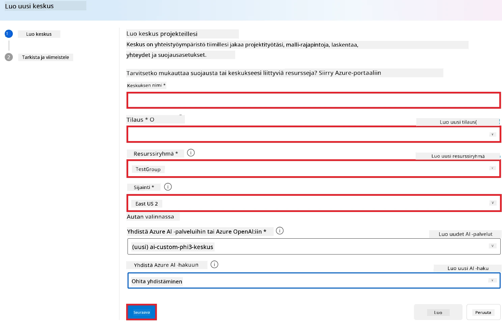

1. Valitse **Next**.

#### Luo Microsoft Foundry -projekti

1. Luomassasi Hubissa valitse vasemman puolen välilehdestä **All projects**.

1. Valitse navigointivalikosta **+ New project**.

    

1. Syötä **Project name**. Sen on oltava ainutlaatuinen arvo.

    

1. Valitse **Create a project**.

#### Lisää mukautettu yhteys hienosäädetylle Phi-3 / Phi-3.5-mallille

Integroiaksesi mukautetun Phi-3 / Phi-3.5 -mallisi Prompt flow -työkaluun, sinun on tallennettava mallin päätepiste ja avain mukautettuun yhteyteen. Tämä varmistaa pääsyn mukautettuun Phi-3 / Phi-3.5 -malliisi Prompt flow’ssa.

#### Määritä hienosäädetyn Phi-3 / Phi-3.5 -mallin api-avain ja päätepisteen URI

1. Siirry osoitteeseen [Azure ML Studio](https://ml.azure.com/home?wt.mc_id=studentamb_279723).

1. Siirry luomaasi Azure Machine Learning -työtilaan.

1. Valitse vasemman puolen välilehdestä **Endpoints**.

    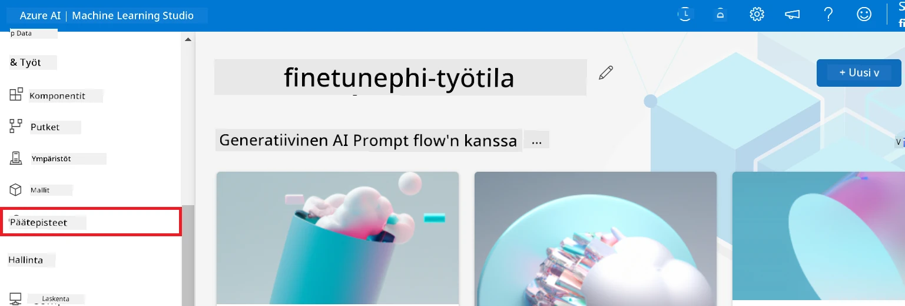

1. Valitse luomasi päätepiste.

    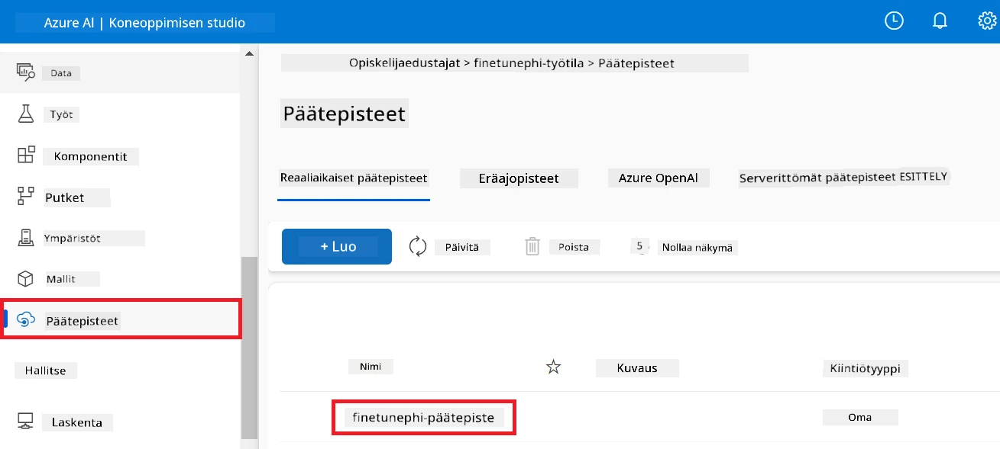

1. Valitse navigointivalikosta **Consume**.

1. Kopioi **REST endpoint** ja **Primary key**.

    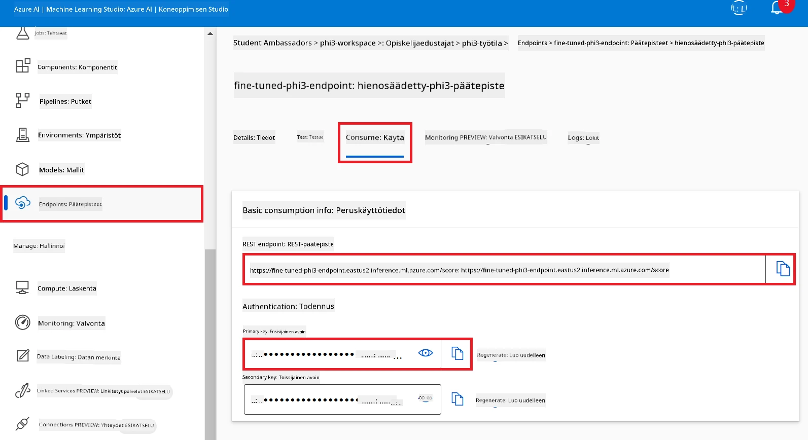

#### Lisää mukautettu yhteys

1. Siirry osoitteeseen [Microsoft Foundry](https://ai.azure.com/?wt.mc_id=studentamb_279723).

1. Siirry luomaasi Microsoft Foundry -projektiin.

1. Valitse luomassasi projektissa vasemman puolen välilehdestä **Settings**.

1. Valitse **+ New connection**.

    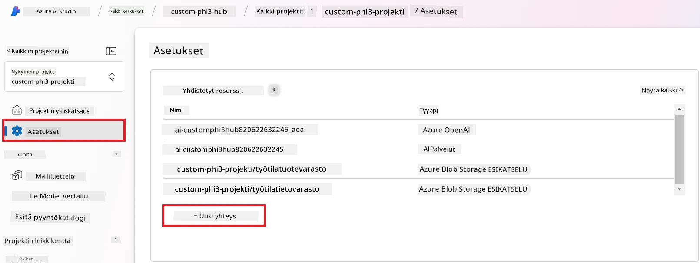

1. Valitse navigointivalikosta **Custom keys**.

    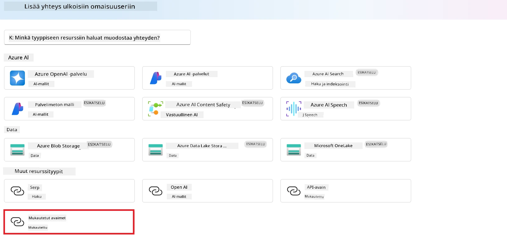

1. Suorita seuraavat tehtävät:

    - Valitse **+ Add key value pairs**.
    - Anna avaimen nimeksi **endpoint** ja liitä aiemmin Azure ML Studiosta kopioimasi päätepiste arvokenttään.
    - Valitse uudestaan **+ Add key value pairs**.
    - Anna avaimen nimeksi **key** ja liitä aiemmin kopioimasi avain arvokenttään.
    - Kun avaimet on lisätty, valitse **is secret** estääksesi avaimen paljastumisen.

    

1. Valitse **Add connection**.

#### Luo Prompt flow

Olet lisännyt mukautetun yhteyden Microsoft Foundryssa. Luodaan nyt Prompt flow seuraavien ohjeiden mukaisesti. Tämän jälkeen yhdistät Prompt flow’n mukautettuun yhteyteen, jotta voit käyttää hienosäädettyä mallia Prompt flow’ssa.

1. Siirry luomaasi Microsoft Foundry -projektiin.

1. Valitse vasemman puolen välilehdestä **Prompt flow**.

1. Valitse navigointivalikosta **+ Create**.

    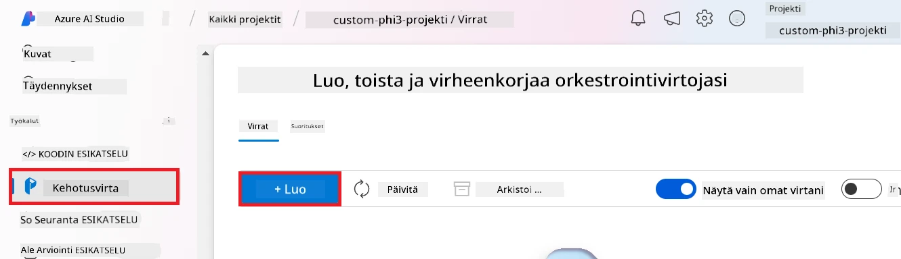

1. Valitse navigointivalikosta **Chat flow**.

    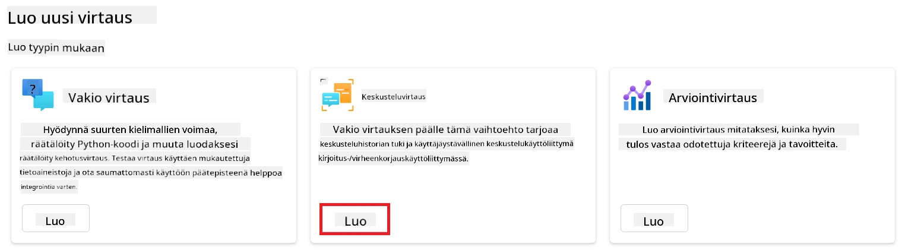

1. Syötä käytettävän **Folder name**.

    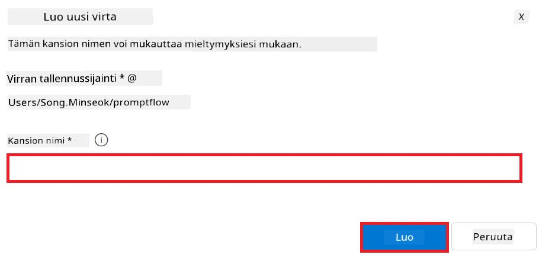

1. Valitse **Create**.

#### Määritä Prompt flow keskustelemaan mukautetun Phi-3 / Phi-3.5 -mallisi kanssa

Sinun on integroitava hienosäädetty Phi-3 / Phi-3.5 -malli Prompt flow’hun. Nykyinen valmiiksi annettu Prompt flow ei ole suunniteltu tätä tarkoitusta varten, joten sinun on suunniteltava Prompt flow uudelleen, jotta mukautettu malli voidaan integroida.

1. Prompt flow’ssa suorita seuraavat tehtävät rakentaaksesi olemassa oleva flow uudelleen:

    - Valitse **Raw file mode**.
    - Poista kaikki nykyiset koodit tiedostosta *flow.dag.yml*.
    - Lisää alla oleva koodi tiedostoon *flow.dag.yml*.

        ```yml
        inputs:
          input_data:
            type: string
            default: "Who founded Microsoft?"

        outputs:
          answer:
            type: string
            reference: ${integrate_with_promptflow.output}

        nodes:
        - name: integrate_with_promptflow
          type: python
          source:
            type: code
            path: integrate_with_promptflow.py
          inputs:
            input_data: ${inputs.input_data}
        ```

    - Valitse **Save**.

    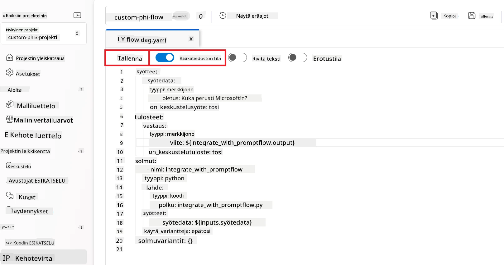

1. Lisää seuraava koodi tiedostoon *integrate_with_promptflow.py*, jotta voit käyttää mukautettua Phi-3 / Phi-3.5 -mallia Prompt flow’ssa.

    ```python
    import logging
    import requests
    from promptflow import tool
    from promptflow.connections import CustomConnection

    # Lokituksen asetukset
    logging.basicConfig(
        format="%(asctime)s - %(levelname)s - %(name)s - %(message)s",
        datefmt="%Y-%m-%d %H:%M:%S",
        level=logging.DEBUG
    )
    logger = logging.getLogger(__name__)

    def query_phi3_model(input_data: str, connection: CustomConnection) -> str:
        """
        Send a request to the Phi-3 / Phi-3.5 model endpoint with the given input data using Custom Connection.
        """

        # "connection" on Custom Connectionin nimi, "endpoint", "key" ovat avaimet Custom Connectionissa
        endpoint_url = connection.endpoint
        api_key = connection.key

        headers = {
            "Content-Type": "application/json",
            "Authorization": f"Bearer {api_key}"
        }
    data = {
        "input_data": [input_data],
        "params": {
            "temperature": 0.7,
            "max_new_tokens": 128,
            "do_sample": True,
            "return_full_text": True
            }
        }
        try:
            response = requests.post(endpoint_url, json=data, headers=headers)
            response.raise_for_status()
            
            # Kirjaa koko JSON-vastaus
            logger.debug(f"Full JSON response: {response.json()}")

            result = response.json()["output"]
            logger.info("Successfully received response from Azure ML Endpoint.")
            return result
        except requests.exceptions.RequestException as e:
            logger.error(f"Error querying Azure ML Endpoint: {e}")
            raise

    @tool
    def my_python_tool(input_data: str, connection: CustomConnection) -> str:
        """
        Tool function to process input data and query the Phi-3 / Phi-3.5 model.
        """
        return query_phi3_model(input_data, connection)

    ```

    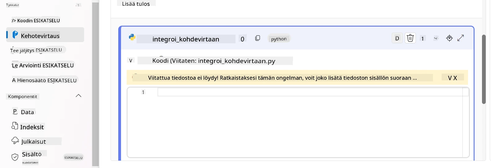

> [!NOTE]
> Tarkempia tietoja Prompt flow’n käytöstä Microsoft Foundryssa löydät kohdasta [Prompt flow in Microsoft Foundry](https://learn.microsoft.com/azure/ai-studio/how-to/prompt-flow).

1. Valitse **Chat input**, **Chat output** ottaaksesi käyttöön keskustelun mallisi kanssa.

    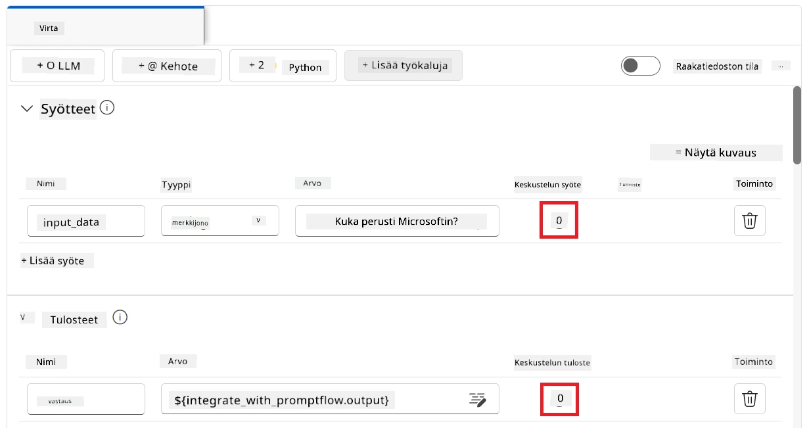

1. Nyt olet valmis keskustelemaan mukautetun Phi-3 / Phi-3.5 -mallisi kanssa. Seuraavassa harjoituksessa opit, miten Prompt flow käynnistetään ja miten sitä käytetään hienosäädetyn Phi-3 / Phi-3.5 -mallin kanssa keskusteluun.

> [!NOTE]
>
> Uudelleen rakennettu flow näyttää tältä kuvalta:
>
> 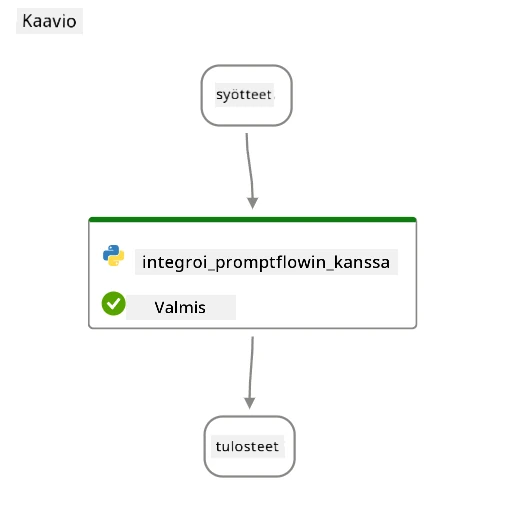
>

#### Käynnistä Prompt flow

1. Valitse **Start compute sessions** aloittaaksesi Prompt flow’n.

    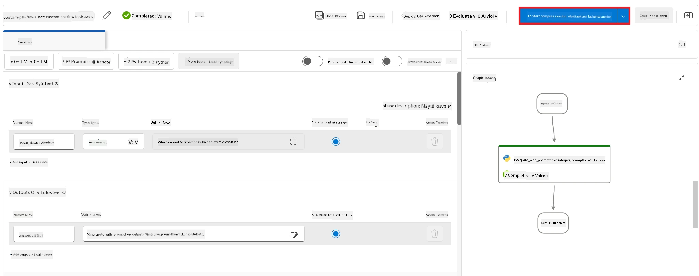

1. Valitse **Validate and parse input** päivittääksesi parametrit.

    

1. Valitse **connection**-kohdassa se arvo, joka vastaa luomaasi mukautettua yhteyttä. Esimerkiksi *connection*.

    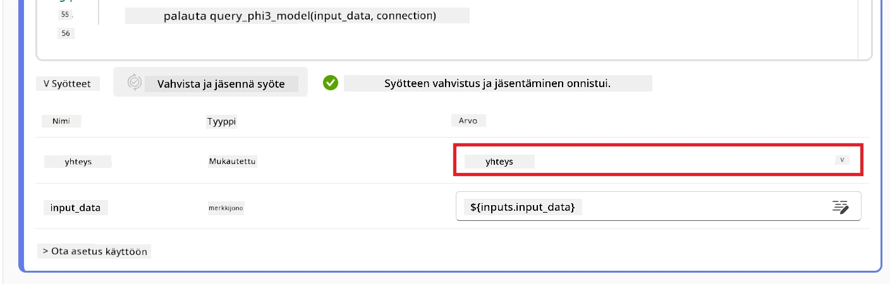

#### Keskustele mukautetun Phi-3 / Phi-3.5 -mallisi kanssa

1. Valitse **Chat**.

    

1. Tässä on esimerkki tuloksista: Nyt voit keskustella mukautetun Phi-3 / Phi-3.5 -mallisi kanssa. Suositeltavaa on esittää kysymyksiä, jotka perustuvat hienosäätödatan sisältöön.

    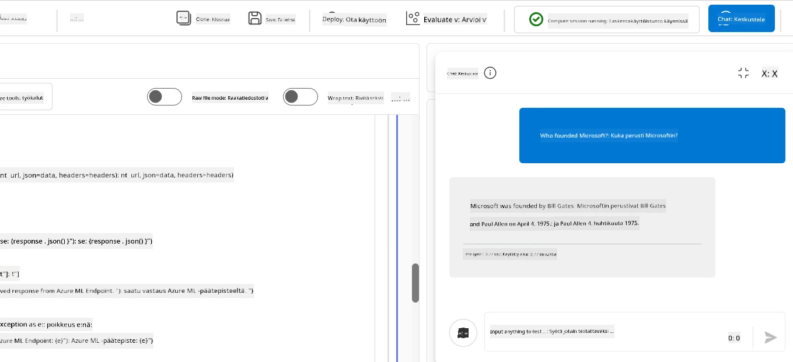

### Ota käyttöön Azure OpenAI Phi-3 / Phi-3.5 -mallin arvioimiseksi

Phi-3 / Phi-3.5 -mallin arvioimiseksi Microsoft Foundryssa sinun tulee ottaa käyttöön Azure OpenAI -malli. Tätä mallia käytetään Phi-3 / Phi-3.5 -mallin suorituskyvyn arvioimiseen.

#### Ota Azure OpenAI käyttöön

1. Kirjaudu sisään [Microsoft Foundry](https://ai.azure.com/?wt.mc_id=studentamb_279723).

1. Siirry luomaasi Microsoft Foundry -projektiin.

    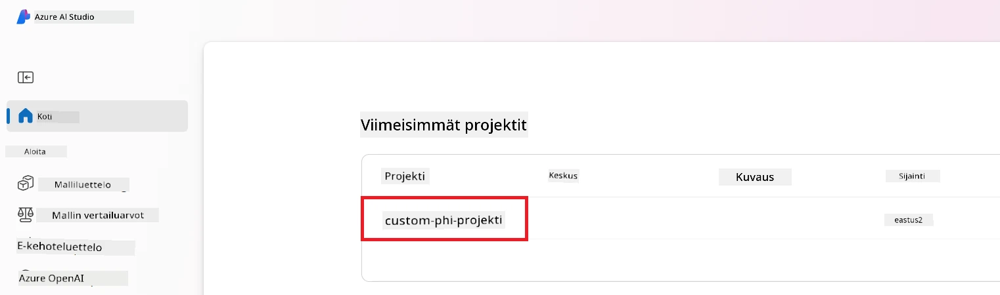

1. Valitse projektissa vasemman puolen välilehdestä **Deployments**.

1. Valitse navigointivalikosta **+ Deploy model**.

1. Valitse **Deploy base model**.

    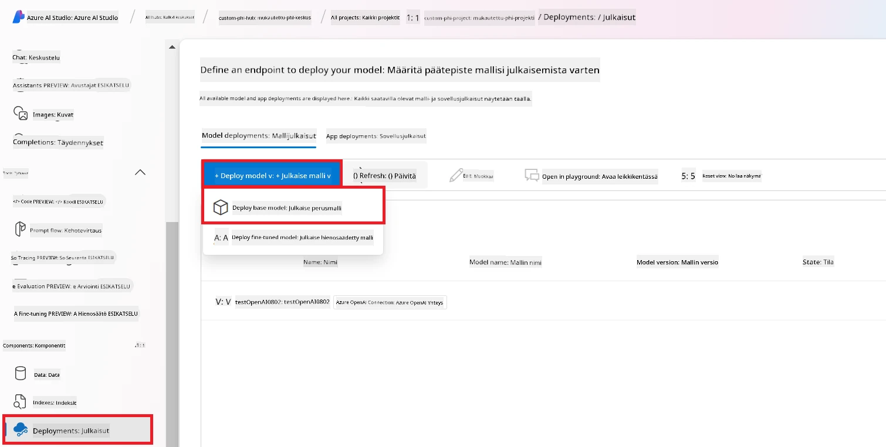

1. Valitse käytettäväksi haluamasi Azure OpenAI -malli. Esimerkiksi **gpt-4o**.

    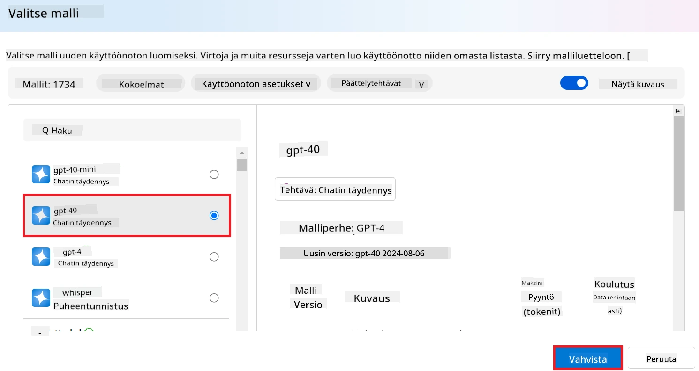

1. Valitse **Confirm**.

### Arvioi hienosäädetty Phi-3 / Phi-3.5 -malli Microsoft Foundryn Prompt flow -arvioinnin avulla

### Aloita uusi arviointi

1. Siirry osoitteeseen [Microsoft Foundry](https://ai.azure.com/?wt.mc_id=studentamb_279723).

1. Siirry luomaasi Microsoft Foundry -projektiin.

    

1. Valitse projektissasi vasemman puolen välilehdestä **Evaluation**.

1. Valitse navigointivalikosta **+ New evaluation**.

    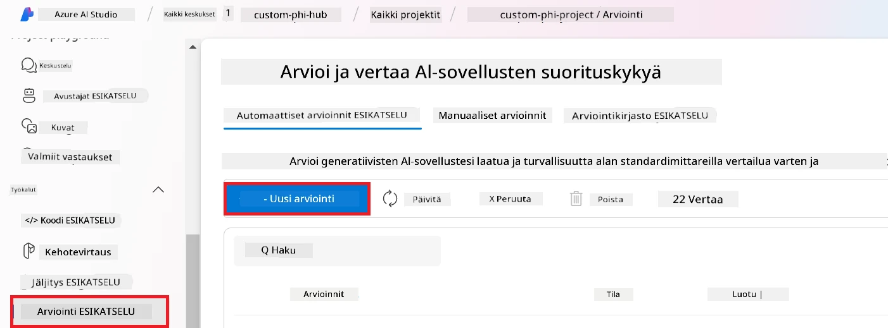

1. Valitse **Prompt flow** -arviointi.

    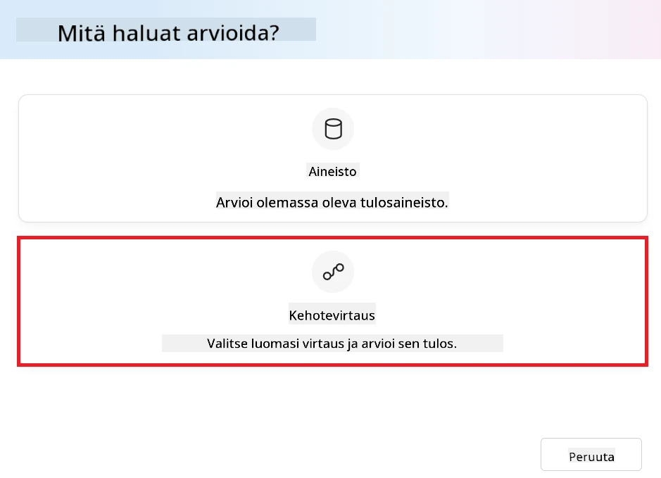

1. Suorita seuraavat tehtävät:

    - Syötä arvioinnille nimi. Sen on oltava ainutlaatuinen arvo.
    - Valitse tehtävätyypiksi **Question and answer without context**. Tämä johtuu siitä, että tässä opastuksessa käytetty **ULTRACHAT_200k**-aineisto ei sisällä kontekstia.
    - Valitse arvioitava prompt flow.

    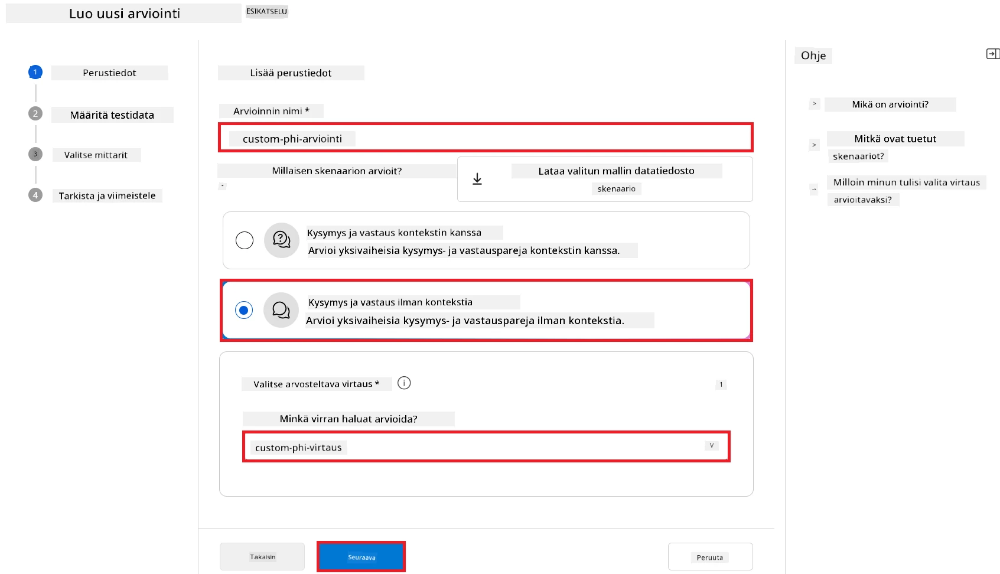

1. Valitse **Next**.

1. Suorita seuraavat tehtävät:

    - Valitse **Add your dataset** ladataksesi aineiston. Esimerkiksi voit ladata testiaineistotiedoston, kuten *test_data.json1*, joka sisältyy **ULTRACHAT_200k** -aineistoon.
    - Valitse sopiva **Dataset column**, joka vastaa aineistoasi. Esimerkiksi **ULTRACHAT_200k** -aineiston kohdalla valitse **${data.prompt}** aineistosarakkeeksi.

    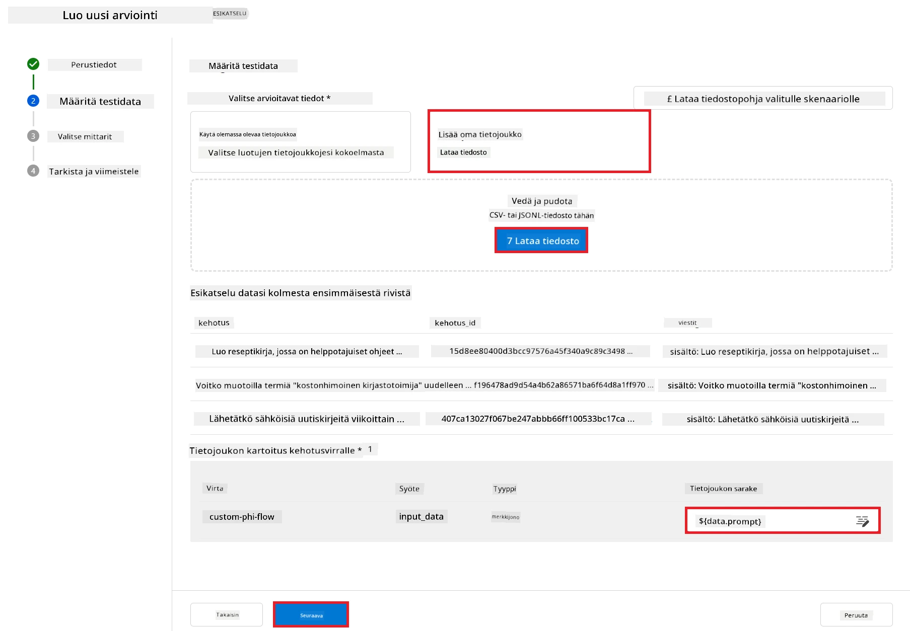

1. Valitse **Next**.

1. Suorita seuraavat tehtävät suorituskyvyn ja laadun mittareiden määrittämiseksi:

    - Valitse käytettävät suorituskyky- ja laatuarvot.
    - Valitse arviointiin käyttämäsi Azure OpenAI -malli. Esimerkiksi **gpt-4o**.

    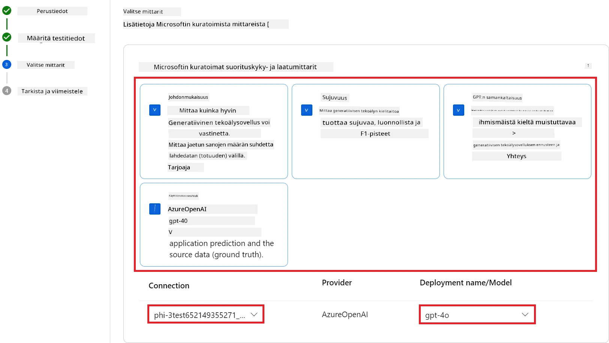

1. Suorita seuraavat tehtävät riskien ja turvallisuuden mittareiden määrittämiseksi:

    - Valitse käytettävät riski- ja turvallisuusmittarit.
    - Valitse vikaprosentin laskentaan käytettävä kynnysarvo. Esimerkiksi **Medium**.
    - Kysymykseksi valitse **Data source** arvoksi **{$data.prompt}**.
    - Vastaukseksi valitse **Data source** arvoksi **{$run.outputs.answer}**.
    - Totuustiedoksi valitse **Data source** arvoksi **{$data.message}**.

    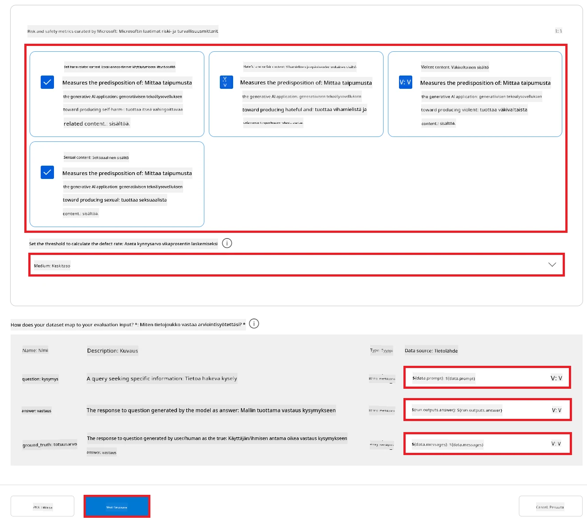

1. Valitse **Next**.

1. Valitse **Submit** aloittaaksesi arvioinnin.

1. Arviointi kestää jonkin aikaa. Voit seurata etenemistä **Evaluation**-välilehdellä.

### Tarkastele arvioinnin tuloksia

> [!NOTE]
> Alla esitetyt tulokset ovat tarkoitettu havainnollistamaan arviointiprosessia. Tässä opastuksessa olemme käyttäneet suhteellisen pieneen aineistoon hienosäädettyä mallia, mikä voi johtaa keskinkertaisiin tuloksiin. Todelliset tulokset voivat vaihdella huomattavasti aineiston koon, laadun ja monimuotoisuuden sekä mallin erityisen kokoonpanon mukaan.

Kun arviointi on valmis, voit tarkastella sekä suorituskyky- että turvallisuusmittareiden tuloksia.
1. Suorituskyky- ja laatumittarit:

    - arvioi mallin tehokkuutta tuottaa johdonmukaisia, sujuvia ja asiaankuuluvia vastauksia.

    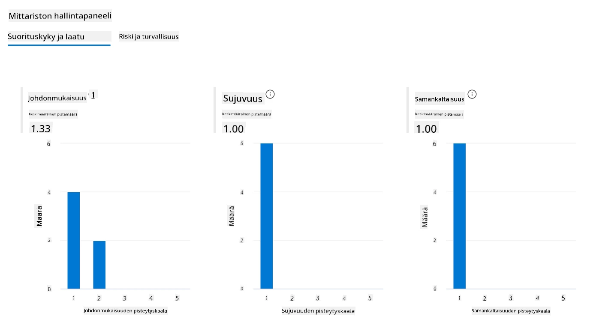

1. Risiko- ja turvallisuusmittarit:

    - Varmista, että mallin tuottamat tulokset ovat turvallisia ja noudattavat vastuullisen tekoälyn periaatteita, välttäen vahingollista tai loukkaavaa sisältöä.

    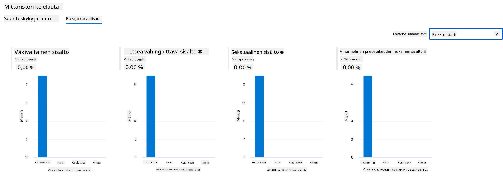

1. Voit selata alas nähdäksesi **Yksityiskohtaiset mittaustulokset**.

    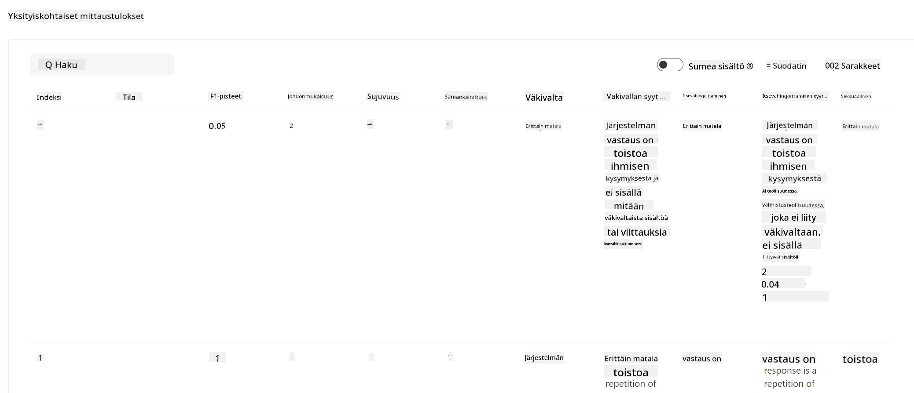

1. Arvioimalla mukautetun Phi-3 / Phi-3.5 -mallisi sekä suorituskyky- että turvallisuusmittareilla voit varmistaa, että malli ei ole vain tehokas, vaan myös noudattaa vastuullisen tekoälyn käytäntöjä, tehden siitä valmiin käyttöön todellisissa ympäristöissä.

## Onnittelut!

### Olet suorittanut tämän opetusohjelman

Olet onnistuneesti arvioinut hienosäädetyn Phi-3 -mallin, joka on integroitu Prompt flow'hun Microsoft Foundryn kautta. Tämä on tärkeä askel varmistamaan, että tekoälymallisi eivät ainoastaan toimi hyvin, vaan myös noudattavat Microsoftin Vastuullisen tekoälyn periaatteita auttaakseen sinua rakentamaan luotettavia ja luotettavia tekoälysovelluksia.


## Siivoa Azure-resurssit

Siivoa Azure-resurssisi välttääksesi ylimääräisiä kuluja tilillesi. Mene Azure-portaaliin ja poista seuraavat resurssit:

- Azure Machine Learning -resurssi.
- Azure Machine Learning -mallin päätepiste.
- Microsoft Foundry Project -resurssi.
- Microsoft Foundry Prompt flow -resurssi.

### Seuraavat askeleet

#### Dokumentaatio

- [Arvioi tekoälyjärjestelmiä vastuullisen tekoälyn hallintapaneelin avulla](https://learn.microsoft.com/azure/machine-learning/concept-responsible-ai-dashboard?view=azureml-api-2&source=recommendations?wt.mc_id=studentamb_279723)
- [Generatiivisen tekoälyn arviointi- ja seurantamittarit](https://learn.microsoft.com/azure/ai-studio/concepts/evaluation-metrics-built-in?tabs=definition?wt.mc_id=studentamb_279723)
- [Microsoft Foundry -dokumentaatio](https://learn.microsoft.com/azure/ai-studio/?wt.mc_id=studentamb_279723)
- [Prompt flow -dokumentaatio](https://microsoft.github.io/promptflow/?wt.mc_id=studentamb_279723)

#### Koulutussisältö

- [Johdanto Microsoftin vastuullisen tekoälyn lähestymistapaan](https://learn.microsoft.com/training/modules/introduction-to-microsofts-responsible-ai-approach/?source=recommendations?wt.mc_id=studentamb_279723)
- [Johdanto Microsoft Foundryyn](https://learn.microsoft.com/training/modules/introduction-to-azure-ai-studio/?wt.mc_id=studentamb_279723)

### Viitteet

- [Mitä on vastuullinen tekoäly?](https://learn.microsoft.com/azure/machine-learning/concept-responsible-ai?view=azureml-api-2?wt.mc_id=studentamb_279723)
- [Uusien työkalujen julkistus Azure AI:ssa turvallisempien ja luotettavampien generatiivisten tekoälysovellusten rakentamiseksi](https://azure.microsoft.com/blog/announcing-new-tools-in-azure-ai-to-help-you-build-more-secure-and-trustworthy-generative-ai-applications/?wt.mc_id=studentamb_279723)
- [Generatiivisten tekoälysovellusten arviointi](https://learn.microsoft.com/azure/ai-studio/concepts/evaluation-approach-gen-ai?wt.mc_id%3Dstudentamb_279723)

---

<!-- CO-OP TRANSLATOR DISCLAIMER START -->
**Vastuuvapauslauseke**:  
Tämä asiakirja on käännetty tekoälypohjaisella käännöspalvelulla [Co-op Translator](https://github.com/Azure/co-op-translator). Vaikka pyrimme tarkkuuteen, automaattisissa käännöksissä saattaa esiintyä virheitä tai epätarkkuuksia. Alkuperäinen asiakirja sen alkuperäiskielellä tulee pitää auktoriteettisena lähteenä. Tärkeiden tietojen osalta suosittelemme ammattimaista ihmiskäännöstä. Emme ole vastuussa tämän käännöksen käytöstä aiheutuvista väärinymmärryksistä tai tulkinnoista.
<!-- CO-OP TRANSLATOR DISCLAIMER END -->