<!--
CO_OP_TRANSLATOR_METADATA:
{
  "original_hash": "7ca2c30fdb802664070e9cfbf92e24fe",
  "translation_date": "2026-01-05T12:41:38+00:00",
  "source_file": "md/02.Application/01.TextAndChat/Phi3/E2E_Phi-3-FineTuning_PromptFlow_Integration.md",
  "language_code": "fi"
}
-->
# Hienosäädä ja integroi mukautettuja Phi-3-malleja Prompt flow’n kanssa

Tämä kokonaisvaltainen (E2E) esimerkkisovellus perustuu Microsoft Tech Communityn oppaaseen "[Fine-Tune and Integrate Custom Phi-3 Models with Prompt Flow: Step-by-Step Guide](https://techcommunity.microsoft.com/t5/educator-developer-blog/fine-tune-and-integrate-custom-phi-3-models-with-prompt-flow/ba-p/4178612?WT.mc_id=aiml-137032-kinfeylo)". Se esittelee prosessit, joissa hienosäädetään, otetaan käyttöön ja integroidaan mukautettuja Phi-3-malleja Prompt flown kanssa.

## Yleiskatsaus

Tässä E2E-esimerkkisovelluksessa opit hienosäätämään Phi-3-mallin ja integroimaan sen Prompt flown kanssa. Hyödyntämällä Azure Machine Learningiä ja Prompt flow’ta luot työnkulun mukautettujen tekoälymallien käyttöönotolle ja hyödyntämiselle. Tämä E2E-esimerkkisovellus on jaettu kolmeen skenaarioon:

**Skenaario 1: Azure-resurssien pystyttäminen ja valmistautuminen hienosäätöön**

**Skenaario 2: Phi-3-mallin hienosäätö ja käyttöönotto Azure Machine Learning Studiossa**

**Skenaario 3: Integrointi Prompt flown kanssa ja vuorovaikutus mukautetun mallisi kanssa**

Tässä on yleiskatsaus tähän E2E-esimerkkisovellukseen.


### Sisällysluettelo

1. **[Skenaario 1: Azure-resurssien pystyttäminen ja valmistautuminen hienosäätöön](../../../../../../md/02.Application/01.TextAndChat/Phi3)**
    - [Luo Azure Machine Learning -työtila](../../../../../../md/02.Application/01.TextAndChat/Phi3)
    - [Pyydä GPU-kiintiöitä Azure-tilauksessa](../../../../../../md/02.Application/01.TextAndChat/Phi3)
    - [Lisää roolimääritys](../../../../../../md/02.Application/01.TextAndChat/Phi3)
    - [Pystytä projekti](../../../../../../md/02.Application/01.TextAndChat/Phi3)
    - [Valmistele datasetti hienosäätöä varten](../../../../../../md/02.Application/01.TextAndChat/Phi3)

1. **[Skenaario 2: Phi-3-mallin hienosäätö ja käyttöönotto Azure Machine Learning Studiossa](../../../../../../md/02.Application/01.TextAndChat/Phi3)**
    - [Pystytä Azure CLI](../../../../../../md/02.Application/01.TextAndChat/Phi3)
    - [Hienosäädä Phi-3-malli](../../../../../../md/02.Application/01.TextAndChat/Phi3)
    - [Ota hienosäädetty malli käyttöön](../../../../../../md/02.Application/01.TextAndChat/Phi3)

1. **[Skenaario 3: Integrointi Prompt flown kanssa ja vuorovaikutus mukautetun mallisi kanssa](../../../../../../md/02.Application/01.TextAndChat/Phi3)**
    - [Integroi mukautettu Phi-3-malli Prompt flow’hun](../../../../../../md/02.Application/01.TextAndChat/Phi3)
    - [Keskustele mukautetun mallisi kanssa](../../../../../../md/02.Application/01.TextAndChat/Phi3)

## Skenaario 1: Azure-resurssien pystyttäminen ja valmistautuminen hienosäätöön

### Luo Azure Machine Learning -työtila

1. Kirjoita **hakupalkkiin** portaalisivun yläreunassa *azure machine learning* ja valitse avautuvista vaihtoehdoista **Azure Machine Learning**.

    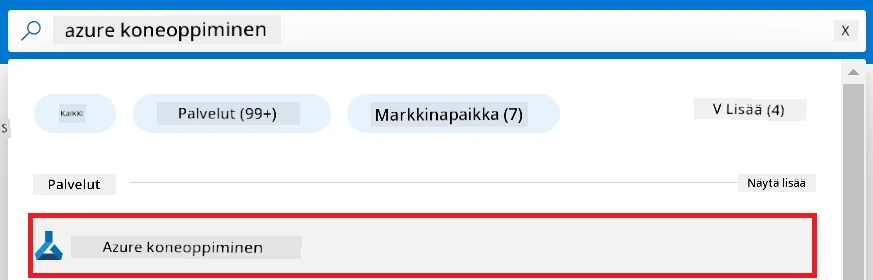

1. Valitse navigointivalikosta **+ Create**.

1. Valitse navigointivalikosta **New workspace**.

    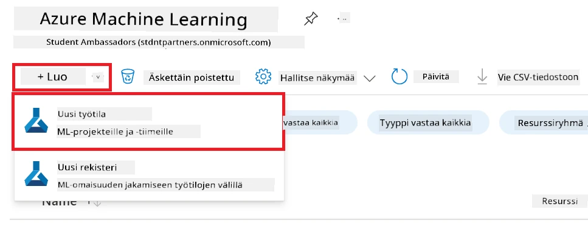

1. Suorita seuraavat toimet:

    - Valitse Azure-tilauksesi **Subscription**.
    - Valitse käytettävä **Resource group** (luo tarvittaessa uusi).
    - Syötä **Workspace Name**. Sen on oltava ainutlaatuinen arvo.
    - Valitse **Region**, jota haluat käyttää.
    - Valitse käytettävä **Storage account** (luo tarvittaessa uusi).
    - Valitse käytettävä **Key vault** (luo tarvittaessa uusi).
    - Valitse käytettävä **Application insights** (luo tarvittaessa uusi).
    - Valitse käytettävä **Container registry** (luo tarvittaessa uusi).

    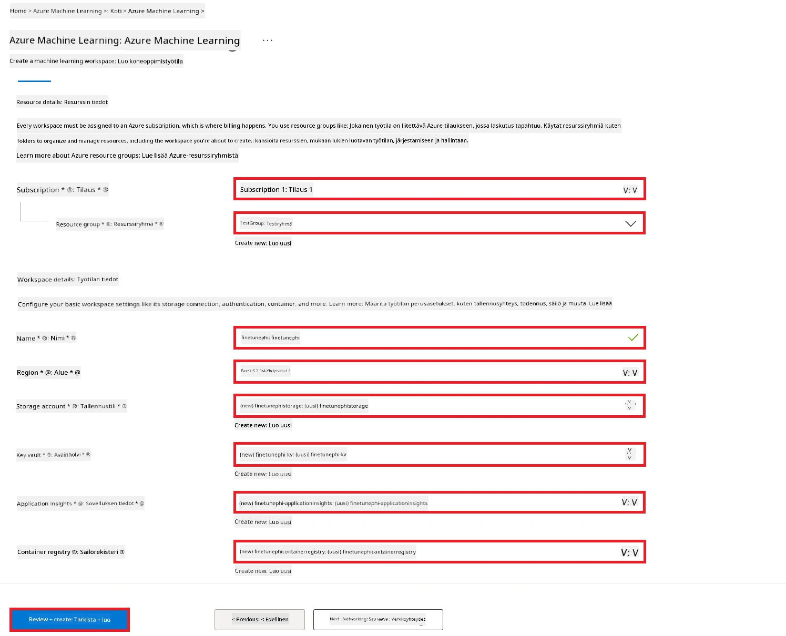

1. Valitse **Review + Create**.

1. Valitse **Create**.

### Pyydä GPU-kiintiöitä Azure-tilauksessa

Tässä E2E-esimerkkisovelluksessa käytät *Standard_NC24ads_A100_v4 GPU* -yksikköä hienosäätöön, joka vaatii kiintiöpyynnön, sekä *Standard_E4s_v3* CPU-yksikköä käyttöönottoon, joka ei vaadi kiintiöpyyntöä.

> [!NOTE]
>
> Vain Pay-As-You-Go -tilaukset (vakio-tilauksen tyyppi) ovat oikeutettuja GPU-allokaatioon; etuustilauksia ei tällä hetkellä tueta.
>
> Jos käytät etuusjäsenyyksiä (kuten Visual Studio Enterprise Subscription) tai haluat nopeasti testata hienosäätöä ja käyttöönottoa, tämä opas tarjoaa myös ohjeet hienosäätöön pienen datasetin avulla CPU:lla. On kuitenkin tärkeää huomata, että tulokset ovat merkittävästi parempia, kun käytetään GPU:ta suurempien datasetien kanssa.

1. Vieraile [Azure ML Studiossa](https://ml.azure.com/home?wt.mc_id=studentamb_279723).

1. Suorita seuraavat toimenpiteet pyytääksesi *Standard NCADSA100v4 Family* -kiintiötä:

    - Valitse vasemmanpuoleisesta välilehdestä **Quota**.
    - Valitse käytettävä **Virtual machine family**. Esimerkiksi valitse **Standard NCADSA100v4 Family Cluster Dedicated vCPUs**, joka sisältää *Standard_NC24ads_A100_v4* GPU:n.
    - Valitse navigointivalikosta **Request quota**.

        

    - Kirjoita Request quota -sivulla haluamasi **New cores limit**. Esimerkiksi 24.
    - Valitse Request quota -sivulla **Submit**, jotta GPU-kiintiöpyyntö lähetetään.

> [!NOTE]
> Voit valita tarpeisiisi sopivan GPU:n tai CPU:n tutustumalla [Sizes for Virtual Machines in Azure](https://learn.microsoft.com/azure/virtual-machines/sizes/overview?tabs=breakdownseries%2Cgeneralsizelist%2Ccomputesizelist%2Cmemorysizelist%2Cstoragesizelist%2Cgpusizelist%2Cfpgasizelist%2Chpcsizelist) -dokumentaatioon.

### Lisää roolimääritys

Jotta voit hienosäätää ja ottaa mallejasi käyttöön, sinun tulee ensin luoda käyttäjäkohtainen hallittu identiteetti (User Assigned Managed Identity, UAI) ja antaa sille asianmukaiset käyttöoikeudet. Tätä UAI:ta käytetään autentikointiin käyttöönoton aikana.

#### Luo käyttäjäkohtainen hallittu identiteetti (UAI)

1. Kirjoita **hakupalkkiin** portaalisivun yläreunassa *managed identities* ja valitse avautuvista vaihtoehdoista **Managed Identities**.

    

1. Valitse **+ Create**.

    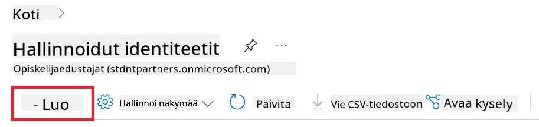

1. Suorita seuraavat toimet:

    - Valitse Azure-tilauksesi **Subscription**.
    - Valitse käytettävä **Resource group** (luo tarvittaessa uusi).
    - Valitse **Region**, jota haluat käyttää.
    - Syötä **Name**. Sen tulee olla ainutlaatuinen.

1. Valitse **Review + create**.

1. Valitse **+ Create**.

#### Lisää Contributor-roolimääritys hallitulle identiteetille

1. Siirry luomaasi Managed Identity -resurssiin.

1. Valitse vasemmanpuoleisesta välilehdestä **Azure role assignments**.

1. Valitse navigointivalikosta **+Add role assignment**.

1. Add role assignment -sivulla suorita seuraavat toimet:
    - Valitse **Scope**ksi **Resource group**.
    - Valitse Azure-tilauksesi **Subscription**.
    - Valitse käytettävä **Resource group**.
    - Valitse **Role**ksi **Contributor**.

    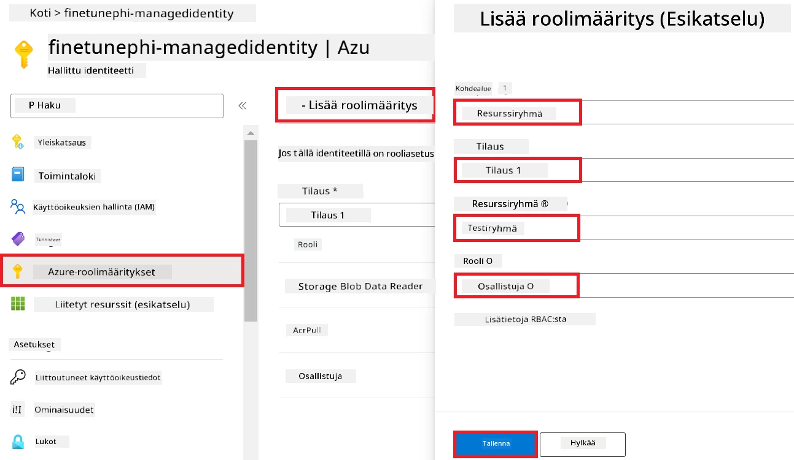

1. Valitse **Save**.

#### Lisää Storage Blob Data Reader -roolimääritys hallitulle identiteetille

1. Kirjoita **hakupalkkiin** portaalisivun yläreunassa *storage accounts* ja valitse avautuvista vaihtoehdoista **Storage accounts**.

    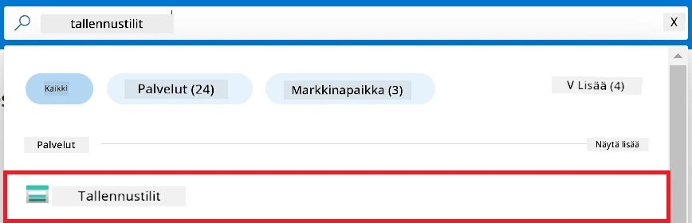

1. Valitse sen Azure Storage -tilin kohde, joka on liitetty luomaasi Azure Machine Learning -työtilaan. Esimerkiksi *finetunephistorage*.

1. Suorita seuraavat toimet siirtyäksesi Add role assignment -sivulle:

    - Siirry luomaasi Azure Storage -tiliin.
    - Valitse vasemmanpuoleisesta välilehdestä **Access Control (IAM)**.
    - Valitse navigointivalikosta **+ Add**.
    - Valitse navigointivalikosta **Add role assignment**.

    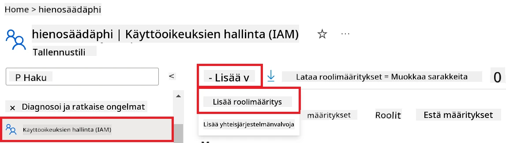

1. Add role assignment -sivulla tee seuraavat toimet:

    - Kirjoita roolisivulla **hakupalkkiin** *Storage Blob Data Reader* ja valitse avautuvista vaihtoehdoista **Storage Blob Data Reader**.
    - Valitse roolisivulla **Next**.
    - Jäsenten sivulla valitse **Assign access to** -kohdasta **Managed identity**.
    - Jäsenten sivulla valitse **+ Select members**.
    - Select managed identities -sivulla valitse Azure-tilauksesi **Subscription**.
    - Select managed identities -sivulla valitse **Managed identity**ksi **Manage Identity**.
    - Select managed identities -sivulla valitse luomasi Managed Identity. Esimerkiksi *finetunephi-managedidentity*.
    - Select managed identities -sivulla valitse **Select**.

    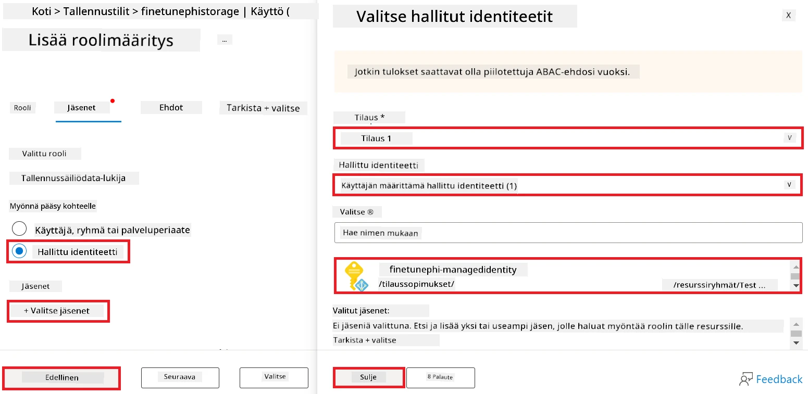

1. Valitse **Review + assign**.

#### Lisää AcrPull-roolimääritys hallitulle identiteetille

1. Kirjoita **hakupalkkiin** portaalisivun yläreunassa *container registries* ja valitse avautuvista vaihtoehdoista **Container registries**.

    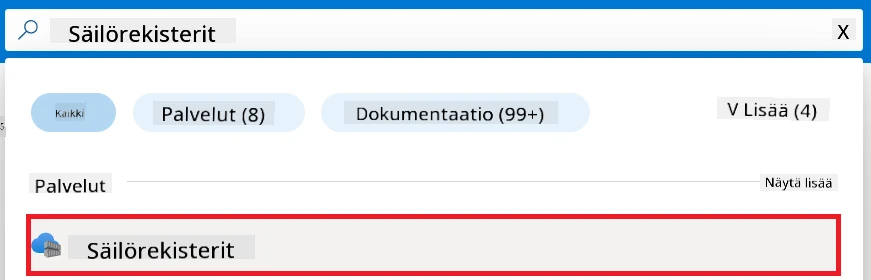

1. Valitse sen säilörekisterin kohde, joka on liitetty Azure Machine Learning -työtilaasi. Esimerkiksi *finetunephicontainerregistries*.

1. Suorita seuraavat toimet siirtyäksesi Add role assignment -sivulle:

    - Valitse vasemmanpuoleisesta välilehdestä **Access Control (IAM)**.
    - Valitse navigointivalikosta **+ Add**.
    - Valitse navigointivalikosta **Add role assignment**.

1. Add role assignment -sivulla tee seuraavat:

    - Kirjoita roolisivulla **hakupalkkiin** *AcrPull* ja valitse avautuvista vaihtoehdoista **AcrPull**.
    - Valitse roolisivulla **Next**.
    - Jäsenten sivulla valitse **Assign access to** -kohdasta **Managed identity**.
    - Jäsenten sivulla valitse **+ Select members**.
    - Select managed identities -sivulla valitse Azure-tilauksesi **Subscription**.
    - Select managed identities -sivulla valitse **Managed identity**ksi **Manage Identity**.
    - Select managed identities -sivulla valitse luomasi Managed Identity. Esimerkiksi *finetunephi-managedidentity*.
    - Select managed identities -sivulla valitse **Select**.
    - Valitse **Review + assign**.

### Pystytä projekti

Nyt luot kansiota, jossa työskentelet, ja pystytät virtuaaliympäristön kehitelläksesi ohjelmaa, joka kommunikoi käyttäjien kanssa ja käyttää Azure Cosmos DB:ssä tallennettua keskusteluhistoriaa vastauksissaan.

#### Luo kansio, jossa työskentelet

1. Avaa päätelaite ja kirjoita seuraava komento luodaksesi kansion nimeltä *finetune-phi* oletuspolkuun.

    ```console
    mkdir finetune-phi
    ```

1. Kirjoita seuraava komento terminaaliisi siirtyäksesi luomaasi *finetune-phi* -kansioon.

    ```console
    cd finetune-phi
    ```

#### Luo virtuaaliympäristö

1. Kirjoita seuraava komento terminaalissa luodaksesi nimetty virtuaaliympäristö *.venv*.

    ```console
    python -m venv .venv
    ```

1. Kirjoita seuraava komento aktivoidaksesi virtuaaliympäristön terminaalissa.

    ```console
    .venv\Scripts\activate.bat
    ```

> [!NOTE]
>
> Jos onnistui, sinun pitäisi nähdä *(.venv)* komentokehotteen edessä.

#### Asenna vaaditut paketit

1. Kirjoita seuraavat komennot terminaaliin asentaaksesi vaaditut paketit.

    ```console
    pip install datasets==2.19.1
    pip install transformers==4.41.1
    pip install azure-ai-ml==1.16.0
    pip install torch==2.3.1
    pip install trl==0.9.4
    pip install promptflow==1.12.0
    ```

#### Luo projektitiedostot
Tässä harjoituksessa luot projektimme olennaiset tiedostot. Näihin tiedostoihin sisältyy skriptejä datasetin lataamista, Azure Machine Learning -ympäristön määrittämistä, Phi-3-mallin hienosäätöä ja hienosäädetyn mallin käyttöönottoa varten. Luot myös *conda.yml* -tiedoston hienosäätöympäristön määrittämiseksi.

Tässä harjoituksessa teet seuraavaa:

- Luo *download_dataset.py* -tiedosto datasetin lataamista varten.
- Luo *setup_ml.py* -tiedosto Azure Machine Learning -ympäristön määrittämistä varten.
- Luo *fine_tune.py* -tiedosto *finetuning_dir* -kansioon Phi-3-mallin hienosäätöä varten datasetin avulla.
- Luo *conda.yml* -tiedosto hienosäätöympäristön määrittämiseksi.
- Luo *deploy_model.py* -tiedosto hienosäädetyn mallin käyttöönottoa varten.
- Luo *integrate_with_promptflow.py* -tiedosto, jolla hienosäädetty malli integroidaan ja ajetaan Prompt Flow -ympäristössä.
- Luo *flow.dag.yml* -tiedosto työnkulun rakenteen määrittämiseksi Prompt Flow:lle.
- Luo *config.py* -tiedosto Azure-tietojen lisäämistä varten.

> [!NOTE]
>
> Koko kansiorakenne:
>
> ```text
> └── YourUserName
> .    └── finetune-phi
> .        ├── finetuning_dir
> .        │      └── fine_tune.py
> .        ├── conda.yml
> .        ├── config.py
> .        ├── deploy_model.py
> .        ├── download_dataset.py
> .        ├── flow.dag.yml
> .        ├── integrate_with_promptflow.py
> .        └── setup_ml.py
> ```

1. Avaa **Visual Studio Code**.

1. Valitse valikkopalkista **File**.

1. Valitse **Open Folder**.

1. Valitse luomasi *finetune-phi* -kansio, joka sijaitsee polussa *C:\Users\yourUserName\finetune-phi*.

    

1. Visual Studio Coden vasemmassa paneelissa napsauta hiiren oikealla ja valitse **New File** luodaksesi uuden tiedoston nimeltä *download_dataset.py*.

1. Visual Studio Coden vasemmassa paneelissa napsauta hiiren oikealla ja valitse **New File** luodaksesi uuden tiedoston nimeltä *setup_ml.py*.

1. Visual Studio Coden vasemmassa paneelissa napsauta hiiren oikealla ja valitse **New File** luodaksesi uuden tiedoston nimeltä *deploy_model.py*.

    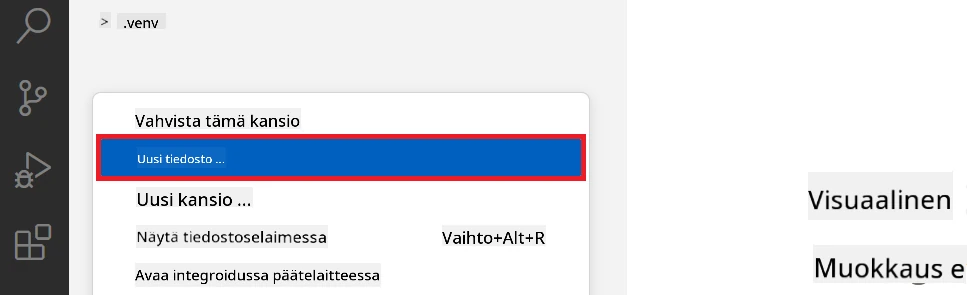

1. Visual Studio Coden vasemmassa paneelissa napsauta hiiren oikealla ja valitse **New Folder** luodaksesi uuden kansion nimeltä *finetuning_dir*.

1. *finetuning_dir* -kansioon luo uusi tiedosto nimeltä *fine_tune.py*.

#### Luo ja määritä *conda.yml* -tiedosto

1. Visual Studio Coden vasemmassa paneelissa napsauta hiiren oikealla ja valitse **New File** luodaksesi uuden tiedoston nimeltä *conda.yml*.

1. Lisää seuraava koodi *conda.yml* -tiedostoon Phi-3-mallin hienosäätöympäristön määrittämiseksi.

    ```yml
    name: phi-3-training-env
    channels:
      - defaults
      - conda-forge
    dependencies:
      - python=3.10
      - pip
      - numpy<2.0
      - pip:
          - torch==2.4.0
          - torchvision==0.19.0
          - trl==0.8.6
          - transformers==4.41
          - datasets==2.21.0
          - azureml-core==1.57.0
          - azure-storage-blob==12.19.0
          - azure-ai-ml==1.16
          - azure-identity==1.17.1
          - accelerate==0.33.0
          - mlflow==2.15.1
          - azureml-mlflow==1.57.0
    ```

#### Luo ja määritä *config.py* -tiedosto

1. Visual Studio Coden vasemmassa paneelissa napsauta hiiren oikealla ja valitse **New File** luodaksesi uuden tiedoston nimeltä *config.py*.

1. Lisää seuraava koodi *config.py* -tiedostoon lisätäksesi Azure-tietosi.

    ```python
    # Azure-asetukset
    AZURE_SUBSCRIPTION_ID = "your_subscription_id"
    AZURE_RESOURCE_GROUP_NAME = "your_resource_group_name" # "TestGroup"

    # Azure Machine Learning -asetukset
    AZURE_ML_WORKSPACE_NAME = "your_workspace_name" # "finetunephi-työtila"

    # Azure Hallinnoidut tunnistetiedot -asetukset
    AZURE_MANAGED_IDENTITY_CLIENT_ID = "your_azure_managed_identity_client_id"
    AZURE_MANAGED_IDENTITY_NAME = "your_azure_managed_identity_name" # "finetunephi-hallinnoiduttunnistetieto"
    AZURE_MANAGED_IDENTITY_RESOURCE_ID = f"/subscriptions/{AZURE_SUBSCRIPTION_ID}/resourceGroups/{AZURE_RESOURCE_GROUP_NAME}/providers/Microsoft.ManagedIdentity/userAssignedIdentities/{AZURE_MANAGED_IDENTITY_NAME}"

    # Dataset-tiedostopolut
    TRAIN_DATA_PATH = "data/train_data.jsonl"
    TEST_DATA_PATH = "data/test_data.jsonl"

    # Hienosäädetyn mallin asetukset
    AZURE_MODEL_NAME = "your_fine_tuned_model_name" # "finetune-phi-malli"
    AZURE_ENDPOINT_NAME = "your_fine_tuned_model_endpoint_name" # "finetune-phi-päätepiste"
    AZURE_DEPLOYMENT_NAME = "your_fine_tuned_model_deployment_name" # "finetune-phi-julkaisu"

    AZURE_ML_API_KEY = "your_fine_tuned_model_api_key"
    AZURE_ML_ENDPOINT = "your_fine_tuned_model_endpoint_uri" # "https://{your-endpoint-name}.{your-region}.inference.ml.azure.com/score"
    ```

#### Lisää Azure-ympäristömuuttujat

1. Suorita seuraavat toimenpiteet Azure-tilaustunnuksen lisäämiseksi:

    - Kirjoita *subscriptions* portaalin sivun yläosassa olevaan **hakupalkkiin** ja valitse vaihtoehdoista **Subscriptions**.
    - Valitse käytössä oleva Azure-tilauksesi.
    - Kopioi ja liitä tilauksen tunnus *config.py* -tiedostoon.

    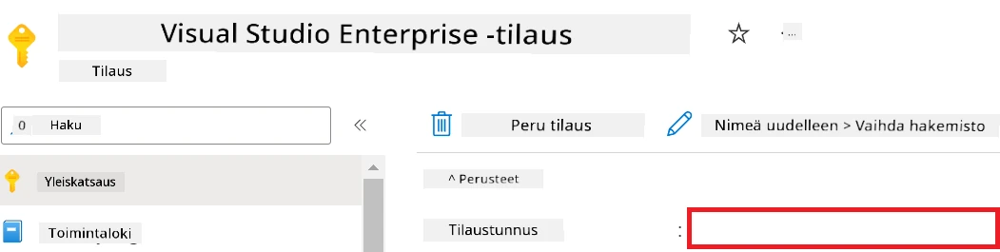

1. Suorita seuraavat toimenpiteet Azure-työtilan nimen lisäämiseksi:

    - Siirry luomallesi Azure Machine Learning -resurssille.
    - Kopioi ja liitä tilauksen nimi *config.py* -tiedostoon.

    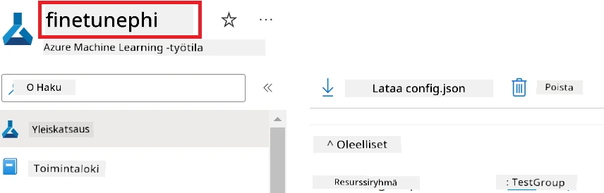

1. Suorita seuraavat toimenpiteet Azure-resurssiryhmän nimen lisäämiseksi:

    - Siirry luomallesi Azure Machine Learning -resurssille.
    - Kopioi ja liitä Azure-resurssiryhmäsi nimi *config.py* -tiedostoon.

    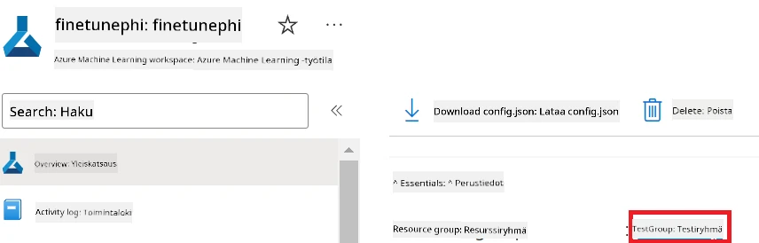

2. Suorita seuraavat toimenpiteet Azure Managed Identity -nimen lisäämiseksi:

    - Siirry luomallesi Managed Identities -resurssille.
    - Kopioi ja liitä Azure Managed Identity -nimesi *config.py* -tiedostoon.

    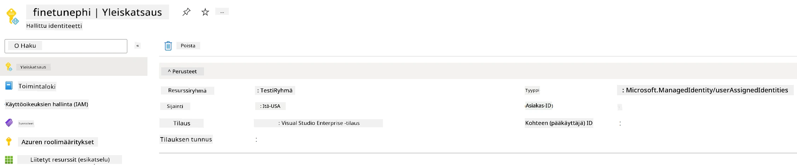

### Valmistele dataset hienosäätöä varten

Tässä harjoituksessa suoritat *download_dataset.py* -tiedoston ladataksesi *ULTRACHAT_200k* datasetit paikalliseen ympäristöösi. Käytät näitä datasettejä Phi-3-mallin hienosäätöön Azure Machine Learning -ympäristössä.

#### Lataa dataset *download_dataset.py* -tiedoston avulla

1. Avaa *download_dataset.py* -tiedosto Visual Studio Codessa.

1. Lisää seuraava koodi *download_dataset.py* -tiedostoon.

    ```python
    import json
    import os
    from datasets import load_dataset
    from config import (
        TRAIN_DATA_PATH,
        TEST_DATA_PATH)

    def load_and_split_dataset(dataset_name, config_name, split_ratio):
        """
        Load and split a dataset.
        """
        # Lataa datasetti määritetyllä nimellä, kokoonpanolla ja jakoasteella
        dataset = load_dataset(dataset_name, config_name, split=split_ratio)
        print(f"Original dataset size: {len(dataset)}")
        
        # Jaa datasetti opetus- ja testijoukkoihin (80 % opetus, 20 % testi)
        split_dataset = dataset.train_test_split(test_size=0.2)
        print(f"Train dataset size: {len(split_dataset['train'])}")
        print(f"Test dataset size: {len(split_dataset['test'])}")
        
        return split_dataset

    def save_dataset_to_jsonl(dataset, filepath):
        """
        Save a dataset to a JSONL file.
        """
        # Luo hakemisto, jos sitä ei ole olemassa
        os.makedirs(os.path.dirname(filepath), exist_ok=True)
        
        # Avaa tiedosto kirjoitustilassa
        with open(filepath, 'w', encoding='utf-8') as f:
            # Käy läpi jokainen tietue datasetissä
            for record in dataset:
                # Vie tietue JSON-objektina ja kirjoita se tiedostoon
                json.dump(record, f)
                # Kirjoita rivinvaihto erottamaan tietueet
                f.write('\n')
        
        print(f"Dataset saved to {filepath}")

    def main():
        """
        Main function to load, split, and save the dataset.
        """
        # Lataa ja jaa ULTRACHAT_200k-datasetti tietyllä kokoonpanolla ja jakoasteella
        dataset = load_and_split_dataset("HuggingFaceH4/ultrachat_200k", 'default', 'train_sft[:1%]')
        
        # Ota opetus- ja testidatasetit jaosta
        train_dataset = dataset['train']
        test_dataset = dataset['test']

        # Tallenna opetusdatasetti JSONL-tiedostoon
        save_dataset_to_jsonl(train_dataset, TRAIN_DATA_PATH)
        
        # Tallenna testidatasetti erilliseen JSONL-tiedostoon
        save_dataset_to_jsonl(test_dataset, TEST_DATA_PATH)

    if __name__ == "__main__":
        main()

    ```

> [!TIP]
>
> **Ohjeet pienellä datasetilla suoritettavalle hienosäädölle käyttäen CPU:ta**
>
> Jos haluat käyttää CPU:ta hienosäätöön, tämä menetelmä on ihanteellinen esimerkiksi Visual Studio Enterprise Subscription -tyyppisille hyötytilauksille tai hienosäädön ja käyttöönoton prosessin nopeaan testaamiseen.
>
> Korvaa `dataset = load_and_split_dataset("HuggingFaceH4/ultrachat_200k", 'default', 'train_sft[:1%]')` arvolla `dataset = load_and_split_dataset("HuggingFaceH4/ultrachat_200k", 'default', 'train_sft[:10]')`
>

1. Kirjoita terminaaliisi seuraava komento suorittaaksesi skriptin ja ladataksesi datasetin paikalliseen ympäristöön.

    ```console
    python download_data.py
    ```

1. Varmista, että datasetit on tallennettu onnistuneesti paikalliseen *finetune-phi/data* -hakemistoosi.

> [!NOTE]
>
> **Datasetin koko ja hienosäädön kesto**
>
> Tässä E2E-esimerkissä käytät vain 1 % datasetista (`train_sft[:1%]`). Tämä vähentää merkittävästi datan määrää, nopeuttaen sekä datan latausta että hienosäätöprosessia. Voit säätää prosenttiosuutta löytääksesi sopivan tasapainon opetusajan ja mallin suorituskyvyn välillä. Pienen dataset-osajoukon käyttäminen lyhentää hienosäädön vaatimaa aikaa, mikä tekee prosessista hallittavamman E2E-esimerkillä.

## Skenaario 2: Hienosäädä Phi-3-malli ja ota se käyttöön Azure Machine Learning Studiossa

### Määritä Azure CLI

Sinun tulee määrittää Azure CLI todennusta varten ympäristössäsi. Azure CLI mahdollistaa Azure-resurssien hallinnan suoraan komentoriviltä ja tarjoaa Azure Machine Learning -palvelulle tarvittavat tunnistetiedot resurssien käyttämiseen. Aloittaaksesi asenna [Azure CLI](https://learn.microsoft.com/cli/azure/install-azure-cli)

1. Avaa terminaali-ikkuna ja kirjoita seuraava komento kirjautuaksesi Azure-tiliisi.

    ```console
    az login
    ```

1. Valitse käytettävä Azure-tili.

1. Valitse käytössä oleva Azure-tilaus.

    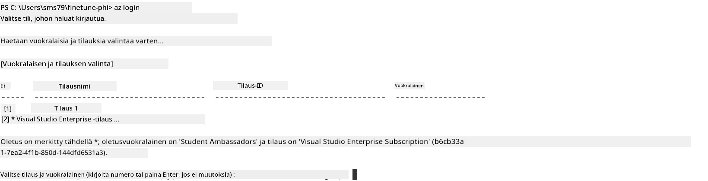

> [!TIP]
>
> Jos sinulla on ongelmia Azure-tilille kirjautumisessa, kokeile käyttää laitekoodeja. Avaa terminaali-ikkuna ja kirjoita seuraava komento kirjautuaksesi Azure-tilillesi:
>
> ```console
> az login --use-device-code
> ```
>

### Hienosäädä Phi-3-malli

Tässä harjoituksessa hienosäätö tehdään Phi-3-mallille annetun datasetin perusteella. Ensin määrittelet hienosäätöprosessin *fine_tune.py* -tiedostossa. Sen jälkeen määrität Azure Machine Learning -ympäristön ja käynnistät hienosäädön suorittamalla *setup_ml.py* -tiedoston. Tämä skripti varmistaa, että hienosäätö tehdään Azure Machine Learning -ympäristössä.

Suorittamalla *setup_ml.py* -tiedoston suoritat hienosäädön Azure Machine Learning -ympäristössä.

#### Lisää koodi *fine_tune.py* -tiedostoon

1. Siirry *finetuning_dir* -kansioon ja avaa *fine_tune.py* -tiedosto Visual Studio Codessa.

1. Lisää seuraava koodi *fine_tune.py* -tiedostoon.

    ```python
    import argparse
    import sys
    import logging
    import os
    from datasets import load_dataset
    import torch
    import mlflow
    from transformers import AutoModelForCausalLM, AutoTokenizer, TrainingArguments
    from trl import SFTTrainer

    # Välttääksesi INVALID_PARAMETER_VALUE -virheen MLflow'ssa, poista MLflow-integraatio käytöstä
    os.environ["DISABLE_MLFLOW_INTEGRATION"] = "True"

    # Lokitusasetukset
    logging.basicConfig(
        format="%(asctime)s - %(levelname)s - %(name)s - %(message)s",
        datefmt="%Y-%m-%d %H:%M:%S",
        handlers=[logging.StreamHandler(sys.stdout)],
        level=logging.WARNING
    )
    logger = logging.getLogger(__name__)

    def initialize_model_and_tokenizer(model_name, model_kwargs):
        """
        Initialize the model and tokenizer with the given pretrained model name and arguments.
        """
        model = AutoModelForCausalLM.from_pretrained(model_name, **model_kwargs)
        tokenizer = AutoTokenizer.from_pretrained(model_name)
        tokenizer.model_max_length = 2048
        tokenizer.pad_token = tokenizer.unk_token
        tokenizer.pad_token_id = tokenizer.convert_tokens_to_ids(tokenizer.pad_token)
        tokenizer.padding_side = 'right'
        return model, tokenizer

    def apply_chat_template(example, tokenizer):
        """
        Apply a chat template to tokenize messages in the example.
        """
        messages = example["messages"]
        if messages[0]["role"] != "system":
            messages.insert(0, {"role": "system", "content": ""})
        example["text"] = tokenizer.apply_chat_template(
            messages, tokenize=False, add_generation_prompt=False
        )
        return example

    def load_and_preprocess_data(train_filepath, test_filepath, tokenizer):
        """
        Load and preprocess the dataset.
        """
        train_dataset = load_dataset('json', data_files=train_filepath, split='train')
        test_dataset = load_dataset('json', data_files=test_filepath, split='train')
        column_names = list(train_dataset.features)

        train_dataset = train_dataset.map(
            apply_chat_template,
            fn_kwargs={"tokenizer": tokenizer},
            num_proc=10,
            remove_columns=column_names,
            desc="Applying chat template to train dataset",
        )

        test_dataset = test_dataset.map(
            apply_chat_template,
            fn_kwargs={"tokenizer": tokenizer},
            num_proc=10,
            remove_columns=column_names,
            desc="Applying chat template to test dataset",
        )

        return train_dataset, test_dataset

    def train_and_evaluate_model(train_dataset, test_dataset, model, tokenizer, output_dir):
        """
        Train and evaluate the model.
        """
        training_args = TrainingArguments(
            bf16=True,
            do_eval=True,
            output_dir=output_dir,
            eval_strategy="epoch",
            learning_rate=5.0e-06,
            logging_steps=20,
            lr_scheduler_type="cosine",
            num_train_epochs=3,
            overwrite_output_dir=True,
            per_device_eval_batch_size=4,
            per_device_train_batch_size=4,
            remove_unused_columns=True,
            save_steps=500,
            seed=0,
            gradient_checkpointing=True,
            gradient_accumulation_steps=1,
            warmup_ratio=0.2,
        )

        trainer = SFTTrainer(
            model=model,
            args=training_args,
            train_dataset=train_dataset,
            eval_dataset=test_dataset,
            max_seq_length=2048,
            dataset_text_field="text",
            tokenizer=tokenizer,
            packing=True
        )

        train_result = trainer.train()
        trainer.log_metrics("train", train_result.metrics)

        mlflow.transformers.log_model(
            transformers_model={"model": trainer.model, "tokenizer": tokenizer},
            artifact_path=output_dir,
        )

        tokenizer.padding_side = 'left'
        eval_metrics = trainer.evaluate()
        eval_metrics["eval_samples"] = len(test_dataset)
        trainer.log_metrics("eval", eval_metrics)

    def main(train_file, eval_file, model_output_dir):
        """
        Main function to fine-tune the model.
        """
        model_kwargs = {
            "use_cache": False,
            "trust_remote_code": True,
            "torch_dtype": torch.bfloat16,
            "device_map": None,
            "attn_implementation": "eager"
        }

        # pretrained_model_name = "microsoft/Phi-3-mini-4k-instruct"
        pretrained_model_name = "microsoft/Phi-3.5-mini-instruct"

        with mlflow.start_run():
            model, tokenizer = initialize_model_and_tokenizer(pretrained_model_name, model_kwargs)
            train_dataset, test_dataset = load_and_preprocess_data(train_file, eval_file, tokenizer)
            train_and_evaluate_model(train_dataset, test_dataset, model, tokenizer, model_output_dir)

    if __name__ == "__main__":
        parser = argparse.ArgumentParser()
        parser.add_argument("--train-file", type=str, required=True, help="Path to the training data")
        parser.add_argument("--eval-file", type=str, required=True, help="Path to the evaluation data")
        parser.add_argument("--model_output_dir", type=str, required=True, help="Directory to save the fine-tuned model")
        args = parser.parse_args()
        main(args.train_file, args.eval_file, args.model_output_dir)

    ```

1. Tallenna ja sulje *fine_tune.py* -tiedosto.

> [!TIP]
> **Voit hienosäätää myös Phi-3.5-mallia**
>
> *fine_tune.py* -tiedostossa voit vaihtaa `pretrained_model_name` arvosta `"microsoft/Phi-3-mini-4k-instruct"` mihin tahansa haluamaasi malliin. Esimerkiksi vaihtamalla arvoksi `"microsoft/Phi-3.5-mini-instruct"` käytät Phi-3.5-mini-instruct-mallia hienosäätöön. Löytääksesi ja käyttääksesi haluamasi mallin nimen, käy osoitteessa [Hugging Face](https://huggingface.co/), etsi kiinnostava malli ja kopioi sen nimi `pretrained_model_name` -kenttään skriptissäsi.
>
> <image type="content" src="../../../../imgs/02/FineTuning-PromptFlow/finetunephi3.5.png" alt-text="Hienosäädä Phi-3.5.">
>

#### Lisää koodi *setup_ml.py* -tiedostoon

1. Avaa *setup_ml.py* -tiedosto Visual Studio Codessa.

1. Lisää seuraava koodi *setup_ml.py* -tiedostoon.

    ```python
    import logging
    from azure.ai.ml import MLClient, command, Input
    from azure.ai.ml.entities import Environment, AmlCompute
    from azure.identity import AzureCliCredential
    from config import (
        AZURE_SUBSCRIPTION_ID,
        AZURE_RESOURCE_GROUP_NAME,
        AZURE_ML_WORKSPACE_NAME,
        TRAIN_DATA_PATH,
        TEST_DATA_PATH
    )

    # Vakiot

    # Poista kommentit seuraavilta riveiltä käyttääksesi CPU-instanssia koulutukseen
    # COMPUTE_INSTANCE_TYPE = "Standard_E16s_v3" # cpu
    # COMPUTE_NAME = "cpu-e16s-v3"
    # DOCKER_IMAGE_NAME = "mcr.microsoft.com/azureml/openmpi4.1.0-ubuntu20.04:latest"

    # Poista kommentit seuraavilta riveiltä käyttääksesi GPU-instanssia koulutukseen
    COMPUTE_INSTANCE_TYPE = "Standard_NC24ads_A100_v4"
    COMPUTE_NAME = "gpu-nc24s-a100-v4"
    DOCKER_IMAGE_NAME = "mcr.microsoft.com/azureml/curated/acft-hf-nlp-gpu:59"

    CONDA_FILE = "conda.yml"
    LOCATION = "eastus2" # Korvaa omalla laskentaklusterisi sijainnilla
    FINETUNING_DIR = "./finetuning_dir" # Polku hienosäätöskriptiin
    TRAINING_ENV_NAME = "phi-3-training-environment" # Koulutusympäristön nimi
    MODEL_OUTPUT_DIR = "./model_output" # Polku mallin tuloshakemistoon Azure ML:ssä

    # Lokituksen asetus prosessin seuraamiseksi
    logger = logging.getLogger(__name__)
    logging.basicConfig(
        format="%(asctime)s - %(levelname)s - %(name)s - %(message)s",
        datefmt="%Y-%m-%d %H:%M:%S",
        level=logging.WARNING
    )

    def get_ml_client():
        """
        Initialize the ML Client using Azure CLI credentials.
        """
        credential = AzureCliCredential()
        return MLClient(credential, AZURE_SUBSCRIPTION_ID, AZURE_RESOURCE_GROUP_NAME, AZURE_ML_WORKSPACE_NAME)

    def create_or_get_environment(ml_client):
        """
        Create or update the training environment in Azure ML.
        """
        env = Environment(
            image=DOCKER_IMAGE_NAME,  # Docker-kuva ympäristölle
            conda_file=CONDA_FILE,  # Conda-ympäristötiedosto
            name=TRAINING_ENV_NAME,  # Ympäristön nimi
        )
        return ml_client.environments.create_or_update(env)

    def create_or_get_compute_cluster(ml_client, compute_name, COMPUTE_INSTANCE_TYPE, location):
        """
        Create or update the compute cluster in Azure ML.
        """
        try:
            compute_cluster = ml_client.compute.get(compute_name)
            logger.info(f"Compute cluster '{compute_name}' already exists. Reusing it for the current run.")
        except Exception:
            logger.info(f"Compute cluster '{compute_name}' does not exist. Creating a new one with size {COMPUTE_INSTANCE_TYPE}.")
            compute_cluster = AmlCompute(
                name=compute_name,
                size=COMPUTE_INSTANCE_TYPE,
                location=location,
                tier="Dedicated",  # Laskentaklusterin taso
                min_instances=0,  # Minimimäärä instansseja
                max_instances=1  # Maksimimäärä instansseja
            )
            ml_client.compute.begin_create_or_update(compute_cluster).wait()  # Odota klusterin luomista
        return compute_cluster

    def create_fine_tuning_job(env, compute_name):
        """
        Set up the fine-tuning job in Azure ML.
        """
        return command(
            code=FINETUNING_DIR,  # Polku fine_tune.py-tiedostoon
            command=(
                "python fine_tune.py "
                "--train-file ${{inputs.train_file}} "
                "--eval-file ${{inputs.eval_file}} "
                "--model_output_dir ${{inputs.model_output}}"
            ),
            environment=env,  # Koulutusympäristö
            compute=compute_name,  # Käytettävä laskentaklusteri
            inputs={
                "train_file": Input(type="uri_file", path=TRAIN_DATA_PATH),  # Polku koulutusdatatiedostoon
                "eval_file": Input(type="uri_file", path=TEST_DATA_PATH),  # Polku arviointidatatiedostoon
                "model_output": MODEL_OUTPUT_DIR
            }
        )

    def main():
        """
        Main function to set up and run the fine-tuning job in Azure ML.
        """
        # Alusta ML Client
        ml_client = get_ml_client()

        # Luo ympäristö
        env = create_or_get_environment(ml_client)
        
        # Luo tai hae olemassa oleva laskentaklusteri
        create_or_get_compute_cluster(ml_client, COMPUTE_NAME, COMPUTE_INSTANCE_TYPE, LOCATION)

        # Luo ja lähetä hienosäätötyö
        job = create_fine_tuning_job(env, COMPUTE_NAME)
        returned_job = ml_client.jobs.create_or_update(job)  # Lähetä työ
        ml_client.jobs.stream(returned_job.name)  # Jatkuva työlokien suoratoisto
        
        # Tallenna työn nimi
        job_name = returned_job.name
        print(f"Job name: {job_name}")

    if __name__ == "__main__":
        main()

    ```

1. Korvaa `COMPUTE_INSTANCE_TYPE`, `COMPUTE_NAME` ja `LOCATION` omilla tiedoillasi.

    ```python
   # Poista seuraavien rivien kommenttimerkinnät käyttääksesi GPU-instanssia koulutukseen
    COMPUTE_INSTANCE_TYPE = "Standard_NC24ads_A100_v4"
    COMPUTE_NAME = "gpu-nc24s-a100-v4"
    ...
    LOCATION = "eastus2" # Korvaa laskentaklusterisi sijainnilla
    ```

> [!TIP]
>
> **Ohjeet pienellä datasetilla suoritettavalle hienosäädölle käyttäen CPU:ta**
>
> Jos haluat käyttää CPU:ta hienosäätöön, tämä menetelmä on ihanteellinen esimerkiksi Visual Studio Enterprise Subscription -tyyppisille hyötytilauksille tai hienosäädön ja käyttöönoton prosessin nopeaan testaamiseen.
>
> 1. Avaa *setup_ml* -tiedosto.
> 1. Korvaa `COMPUTE_INSTANCE_TYPE`, `COMPUTE_NAME` ja `DOCKER_IMAGE_NAME` seuraavasti. Jos sinulla ei ole pääsyä *Standard_E16s_v3* -instanssiin, voit valita vastaavan CPU-instanssin tai pyytää uutta käyttöoikeutta.
> 1. Korvaa `LOCATION` omilla tiedoillasi.
>
>    ```python
>    # Uncomment the following lines to use a CPU instance for training
>    COMPUTE_INSTANCE_TYPE = "Standard_E16s_v3" # cpu
>    COMPUTE_NAME = "cpu-e16s-v3"
>    DOCKER_IMAGE_NAME = "mcr.microsoft.com/azureml/openmpi4.1.0-ubuntu20.04:latest"
>    LOCATION = "eastus2" # Replace with the location of your compute cluster
>    ```
>

1. Kirjoita seuraava komento suorittaaksesi *setup_ml.py* -skriptin ja aloittaaksesi hienosäätöprosessin Azure Machine Learningissä.

    ```python
    python setup_ml.py
    ```

1. Tässä harjoituksessa olet onnistuneesti hienosäätänyt Phi-3-mallin käyttämällä Azure Machine Learning -palvelua. Suorittamalla *setup_ml.py* -skriptin olet määrittänyt Azure Machine Learning -ympäristön ja käynnistänyt hienosäätöprosessin, joka määriteltiin *fine_tune.py* -tiedostossa. Huomaa, että hienosäätö voi kestää melko kauan. Käytä `python setup_ml.py` -komentoa ja odota prosessin valmistumista. Voit seurata hienosäätötyön tilaa käyttämällä terminaaliin tulostettua linkkiä Azure Machine Learning -portaaliin.

    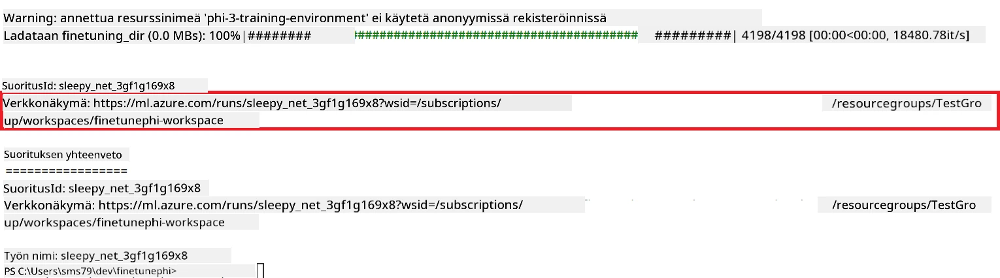

### Ota hienosäädetty malli käyttöön

Jotta voit integroida hienosäädetyn Phi-3-mallin Prompt Flow -ympäristöön, sinun täytyy ottaa malli käyttöön, jotta se on käytettävissä reaaliaikaiseen päättelyyn. Tämä prosessi sisältää mallin rekisteröinnin, online-päätepisteen luomisen ja mallin käyttöönoton.

#### Määritä mallin nimi, päätepisteen nimi ja käyttöönoton nimi käyttöä varten

1. Avaa *config.py* -tiedosto.

1. Korvaa `AZURE_MODEL_NAME = "your_fine_tuned_model_name"` haluamallasi mallin nimellä.

1. Korvaa `AZURE_ENDPOINT_NAME = "your_fine_tuned_model_endpoint_name"` haluamallasi päätepisteen nimellä.

1. Korvaa `AZURE_DEPLOYMENT_NAME = "your_fine_tuned_model_deployment_name"` haluamallasi käyttöönoton nimellä.

#### Lisää koodi *deploy_model.py* -tiedostoon

*deploy_model.py* -tiedoston suorittaminen automatisoi koko käyttöönoton prosessin. Se rekisteröi mallin, luo päätepisteen ja suorittaa käyttöönoton *config.py* -tiedostossa määriteltyjen asetusten mukaan, joihin sisältyvät mallin nimi, päätepisteen nimi ja käyttöönoton nimi.

1. Avaa *deploy_model.py* -tiedosto Visual Studio Codessa.

1. Lisää seuraava koodi *deploy_model.py* -tiedostoon.

    ```python
    import logging
    from azure.identity import AzureCliCredential
    from azure.ai.ml import MLClient
    from azure.ai.ml.entities import Model, ProbeSettings, ManagedOnlineEndpoint, ManagedOnlineDeployment, IdentityConfiguration, ManagedIdentityConfiguration, OnlineRequestSettings
    from azure.ai.ml.constants import AssetTypes

    # Konfiguraation tuonnit
    from config import (
        AZURE_SUBSCRIPTION_ID,
        AZURE_RESOURCE_GROUP_NAME,
        AZURE_ML_WORKSPACE_NAME,
        AZURE_MANAGED_IDENTITY_RESOURCE_ID,
        AZURE_MANAGED_IDENTITY_CLIENT_ID,
        AZURE_MODEL_NAME,
        AZURE_ENDPOINT_NAME,
        AZURE_DEPLOYMENT_NAME
    )

    # Vakioarvot
    JOB_NAME = "your-job-name"
    COMPUTE_INSTANCE_TYPE = "Standard_E4s_v3"

    deployment_env_vars = {
        "SUBSCRIPTION_ID": AZURE_SUBSCRIPTION_ID,
        "RESOURCE_GROUP_NAME": AZURE_RESOURCE_GROUP_NAME,
        "UAI_CLIENT_ID": AZURE_MANAGED_IDENTITY_CLIENT_ID,
    }

    # Lokituksen asetukset
    logging.basicConfig(
        format="%(asctime)s - %(levelname)s - %(name)s - %(message)s",
        datefmt="%Y-%m-%d %H:%M:%S",
        level=logging.DEBUG
    )
    logger = logging.getLogger(__name__)

    def get_ml_client():
        """Initialize and return the ML Client."""
        credential = AzureCliCredential()
        return MLClient(credential, AZURE_SUBSCRIPTION_ID, AZURE_RESOURCE_GROUP_NAME, AZURE_ML_WORKSPACE_NAME)

    def register_model(ml_client, model_name, job_name):
        """Register a new model."""
        model_path = f"azureml://jobs/{job_name}/outputs/artifacts/paths/model_output"
        logger.info(f"Registering model {model_name} from job {job_name} at path {model_path}.")
        run_model = Model(
            path=model_path,
            name=model_name,
            description="Model created from run.",
            type=AssetTypes.MLFLOW_MODEL,
        )
        model = ml_client.models.create_or_update(run_model)
        logger.info(f"Registered model ID: {model.id}")
        return model

    def delete_existing_endpoint(ml_client, endpoint_name):
        """Delete existing endpoint if it exists."""
        try:
            endpoint_result = ml_client.online_endpoints.get(name=endpoint_name)
            logger.info(f"Deleting existing endpoint {endpoint_name}.")
            ml_client.online_endpoints.begin_delete(name=endpoint_name).result()
            logger.info(f"Deleted existing endpoint {endpoint_name}.")
        except Exception as e:
            logger.info(f"No existing endpoint {endpoint_name} found to delete: {e}")

    def create_or_update_endpoint(ml_client, endpoint_name, description=""):
        """Create or update an endpoint."""
        delete_existing_endpoint(ml_client, endpoint_name)
        logger.info(f"Creating new endpoint {endpoint_name}.")
        endpoint = ManagedOnlineEndpoint(
            name=endpoint_name,
            description=description,
            identity=IdentityConfiguration(
                type="user_assigned",
                user_assigned_identities=[ManagedIdentityConfiguration(resource_id=AZURE_MANAGED_IDENTITY_RESOURCE_ID)]
            )
        )
        endpoint_result = ml_client.online_endpoints.begin_create_or_update(endpoint).result()
        logger.info(f"Created new endpoint {endpoint_name}.")
        return endpoint_result

    def create_or_update_deployment(ml_client, endpoint_name, deployment_name, model):
        """Create or update a deployment."""

        logger.info(f"Creating deployment {deployment_name} for endpoint {endpoint_name}.")
        deployment = ManagedOnlineDeployment(
            name=deployment_name,
            endpoint_name=endpoint_name,
            model=model.id,
            instance_type=COMPUTE_INSTANCE_TYPE,
            instance_count=1,
            environment_variables=deployment_env_vars,
            request_settings=OnlineRequestSettings(
                max_concurrent_requests_per_instance=3,
                request_timeout_ms=180000,
                max_queue_wait_ms=120000
            ),
            liveness_probe=ProbeSettings(
                failure_threshold=30,
                success_threshold=1,
                period=100,
                initial_delay=500,
            ),
            readiness_probe=ProbeSettings(
                failure_threshold=30,
                success_threshold=1,
                period=100,
                initial_delay=500,
            ),
        )
        deployment_result = ml_client.online_deployments.begin_create_or_update(deployment).result()
        logger.info(f"Created deployment {deployment.name} for endpoint {endpoint_name}.")
        return deployment_result

    def set_traffic_to_deployment(ml_client, endpoint_name, deployment_name):
        """Set traffic to the specified deployment."""
        try:
            # Hae nykyisen päätepisteen tiedot
            endpoint = ml_client.online_endpoints.get(name=endpoint_name)
            
            # Kirjaa nykyinen liikenteen jakautuminen virheiden seurantaa varten
            logger.info(f"Current traffic allocation: {endpoint.traffic}")
            
            # Aseta liikenteen jako käyttöönotolle
            endpoint.traffic = {deployment_name: 100}
            
            # Päivitä päätepiste uudella liikenteen jaolla
            endpoint_poller = ml_client.online_endpoints.begin_create_or_update(endpoint)
            updated_endpoint = endpoint_poller.result()
            
            # Kirjaa päivitetty liikenteen jako virheiden seurantaa varten
            logger.info(f"Updated traffic allocation: {updated_endpoint.traffic}")
            logger.info(f"Set traffic to deployment {deployment_name} at endpoint {endpoint_name}.")
            return updated_endpoint
        except Exception as e:
            # Kirjaa mahdolliset prosessin aikana tapahtuvat virheet
            logger.error(f"Failed to set traffic to deployment: {e}")
            raise


    def main():
        ml_client = get_ml_client()

        registered_model = register_model(ml_client, AZURE_MODEL_NAME, JOB_NAME)
        logger.info(f"Registered model ID: {registered_model.id}")

        endpoint = create_or_update_endpoint(ml_client, AZURE_ENDPOINT_NAME, "Endpoint for finetuned Phi-3 model")
        logger.info(f"Endpoint {AZURE_ENDPOINT_NAME} is ready.")

        try:
            deployment = create_or_update_deployment(ml_client, AZURE_ENDPOINT_NAME, AZURE_DEPLOYMENT_NAME, registered_model)
            logger.info(f"Deployment {AZURE_DEPLOYMENT_NAME} is created for endpoint {AZURE_ENDPOINT_NAME}.")

            set_traffic_to_deployment(ml_client, AZURE_ENDPOINT_NAME, AZURE_DEPLOYMENT_NAME)
            logger.info(f"Traffic is set to deployment {AZURE_DEPLOYMENT_NAME} at endpoint {AZURE_ENDPOINT_NAME}.")
        except Exception as e:
            logger.error(f"Failed to create or update deployment: {e}")

    if __name__ == "__main__":
        main()

    ```

1. Suorita seuraavat toimenpiteet saadaksesi `JOB_NAME`:

    - Siirry Azure Machine Learning -resurssille, jonka loit.
    - Valitse **Studio web URL** avataksesi Azure Machine Learning -työtilan.
    - Valitse vasemman sivupalkin välilehdeltä **Jobs**.
    - Valitse hienosäätöä vastaava koe. Esimerkkinä *finetunephi*.
    - Valitse luomasi työtehtävä.
- Kopioi ja liitä työnimesi kohtaan `JOB_NAME = "your-job-name"` tiedostossa *deploy_model.py*.

1. Korvaa `COMPUTE_INSTANCE_TYPE` omilla tiedoillasi.

1. Kirjoita seuraava komento suorittaaksesi *deploy_model.py* -skriptin ja aloittaaksesi käyttöönoton Azure Machine Learningissa.

    ```python
    python deploy_model.py
    ```

> [!WARNING]
> Välttääksesi ylimääräiset maksut tilillesi, muista poistaa luotu päätepiste Azure Machine Learning -työtilasta.
>

#### Tarkista käyttöönoton tila Azure Machine Learning -työtilassa

1. Käy osoitteessa [Azure ML Studio](https://ml.azure.com/home?wt.mc_id=studentamb_279723).

1. Siirry luomaasi Azure Machine Learning -työtilaan.

1. Valitse **Studio web URL** avataksesi Azure Machine Learning -työtilan.

1. Valitse vasemman sivun välilehdeltä **Endpoints**.

    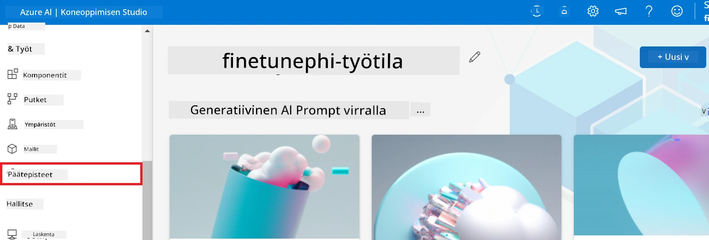

2. Valitse luomasi päätepiste.

    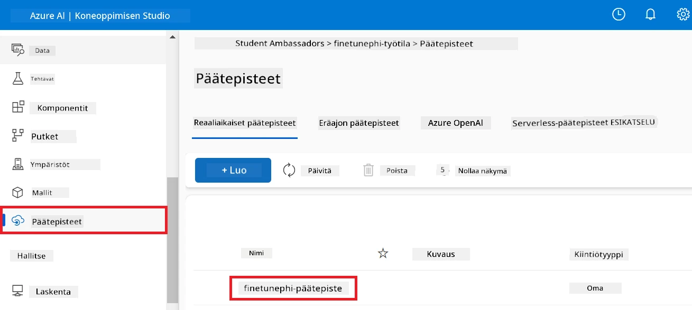

3. Tällä sivulla voit hallita käyttöönottoprosessin aikana luotuja päätepisteitä.

## Tilanne 3: Integroi Prompt flow’hun ja keskustele omalla mallillasi

### Integroi oma Phi-3-malli Prompt flow’hun

Onnistuneen hienosäädön jälkeen voit nyt integroida mallisi Prompt flow’hun käyttääksesi sitä reaaliaikaisissa sovelluksissa ja mahdollistaaksesi erilaisia interaktiivisia tehtäviä omalla Phi-3-mallillasi.

#### Aseta hienosäädetyn Phi-3-mallin api-avain ja päätepisteen osoite

1. Siirry luomaasi Azure Machine Learning -työtilaan.
1. Valitse vasemman sivun välilehdeltä **Endpoints**.
1. Valitse luomasi päätepiste.
1. Valitse navigointivalikosta **Consume**.
1. Kopioi ja liitä **REST endpoint** tiedostoon *config.py*, korvaten `AZURE_ML_ENDPOINT = "your_fine_tuned_model_endpoint_uri"` omalla **REST endpoint** -arvolla.
1. Kopioi ja liitä **Primary key** tiedostoon *config.py*, korvaten `AZURE_ML_API_KEY = "your_fine_tuned_model_api_key"` omalla **Primary key** -avaimellasi.

    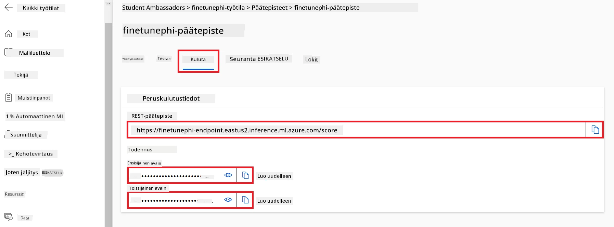

#### Lisää koodi tiedostoon *flow.dag.yml*

1. Avaa tiedosto *flow.dag.yml* Visual Studio Codessa.

1. Lisää seuraava koodi tiedostoon *flow.dag.yml*.

    ```yml
    inputs:
      input_data:
        type: string
        default: "Who founded Microsoft?"

    outputs:
      answer:
        type: string
        reference: ${integrate_with_promptflow.output}

    nodes:
    - name: integrate_with_promptflow
      type: python
      source:
        type: code
        path: integrate_with_promptflow.py
      inputs:
        input_data: ${inputs.input_data}
    ```

#### Lisää koodi tiedostoon *integrate_with_promptflow.py*

1. Avaa tiedosto *integrate_with_promptflow.py* Visual Studio Codessa.

1. Lisää seuraava koodi tiedostoon *integrate_with_promptflow.py*.

    ```python
    import logging
    import requests
    from promptflow.core import tool
    import asyncio
    import platform
    from config import (
        AZURE_ML_ENDPOINT,
        AZURE_ML_API_KEY
    )

    # Lokitusasetukset
    logging.basicConfig(
        format="%(asctime)s - %(levelname)s - %(name)s - %(message)s",
        datefmt="%Y-%m-%d %H:%M:%S",
        level=logging.DEBUG
    )
    logger = logging.getLogger(__name__)

    def query_azml_endpoint(input_data: list, endpoint_url: str, api_key: str) -> str:
        """
        Send a request to the Azure ML endpoint with the given input data.
        """
        headers = {
            "Content-Type": "application/json",
            "Authorization": f"Bearer {api_key}"
        }
        data = {
            "input_data": [input_data],
            "params": {
                "temperature": 0.7,
                "max_new_tokens": 128,
                "do_sample": True,
                "return_full_text": True
            }
        }
        try:
            response = requests.post(endpoint_url, json=data, headers=headers)
            response.raise_for_status()
            result = response.json()[0]
            logger.info("Successfully received response from Azure ML Endpoint.")
            return result
        except requests.exceptions.RequestException as e:
            logger.error(f"Error querying Azure ML Endpoint: {e}")
            raise

    def setup_asyncio_policy():
        """
        Setup asyncio event loop policy for Windows.
        """
        if platform.system() == 'Windows':
            asyncio.set_event_loop_policy(asyncio.WindowsSelectorEventLoopPolicy())
            logger.info("Set Windows asyncio event loop policy.")

    @tool
    def my_python_tool(input_data: str) -> str:
        """
        Tool function to process input data and query the Azure ML endpoint.
        """
        setup_asyncio_policy()
        return query_azml_endpoint(input_data, AZURE_ML_ENDPOINT, AZURE_ML_API_KEY)

    ```

### Keskustele omalla mallillasi

1. Kirjoita seuraava komento suorittaaksesi *deploy_model.py* -skriptin ja aloittaaksesi käyttöönoton Azure Machine Learningissa.

    ```python
    pf flow serve --source ./ --port 8080 --host localhost
    ```

1. Tässä on esimerkki tuloksista: Nyt voit keskustella omalla Phi-3-mallillasi. Suositellaan esittämään kysymyksiä, jotka perustuvat hienosäädössä käytettyyn dataan.

    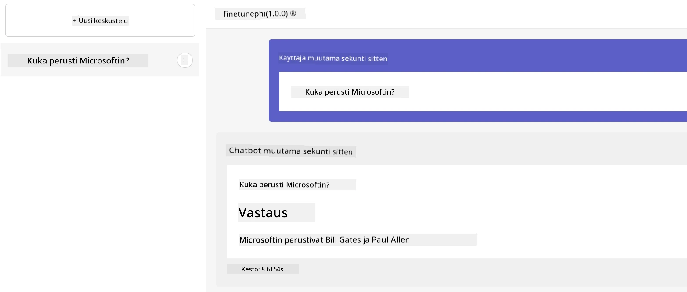

---

<!-- CO-OP TRANSLATOR DISCLAIMER START -->
**Vastuuvapauslauseke**:
Tämä asiakirja on käännetty käyttämällä tekoälypohjaista käännöspalvelua [Co-op Translator](https://github.com/Azure/co-op-translator). Pyrimme tarkkuuteen, mutta ole hyvä ja huomioi, että automaattikäännöksissä voi esiintyä virheitä tai epätarkkuuksia. Alkuperäistä asiakirjaa sen alkuperäiskielellä tulee pitää virallisena lähteenä. Tärkeissä tiedoissa suositellaan ammattilaisen tekemää ihmiskäännöstä. Emme ole vastuussa tästä käännöksestä mahdollisesti aiheutuvista väärinkäsityksistä tai tulkinnoista.
<!-- CO-OP TRANSLATOR DISCLAIMER END -->