<!--
CO_OP_TRANSLATOR_METADATA:
{
  "original_hash": "455be2b7b9c3390d367d528f8fab2aa0",
  "translation_date": "2025-07-17T00:33:03+00:00",
  "source_file": "md/02.Application/01.TextAndChat/Phi3/E2E_Phi-3-FineTuning_PromptFlow_Integration.md",
  "language_code": "fi"
}
-->
# Hienosäädä ja integroi mukautetut Phi-3-mallit Prompt flow'n kanssa

Tämä end-to-end (E2E) esimerkki perustuu Microsoft Tech Communityn oppaaseen "[Fine-Tune and Integrate Custom Phi-3 Models with Prompt Flow: Step-by-Step Guide](https://techcommunity.microsoft.com/t5/educator-developer-blog/fine-tune-and-integrate-custom-phi-3-models-with-prompt-flow/ba-p/4178612?WT.mc_id=aiml-137032-kinfeylo)". Se esittelee mukautettujen Phi-3-mallien hienosäädön, käyttöönoton ja integroinnin Prompt flow'n kanssa.

## Yleiskatsaus

Tässä E2E-esimerkissä opit hienosäätämään Phi-3-mallin ja integroimaan sen Prompt flow'hun. Hyödyntämällä Azure Machine Learningiä ja Prompt flow'ta luot työnkulun mukautettujen tekoälymallien käyttöönottoa ja hyödyntämistä varten. Tämä E2E-esimerkki on jaettu kolmeen skenaarioon:

**Skenaario 1: Azure-resurssien perustaminen ja valmistautuminen hienosäätöön**

**Skenaario 2: Phi-3-mallin hienosäätö ja käyttöönotto Azure Machine Learning Studiossa**

**Skenaario 3: Integrointi Prompt flow'hun ja keskustelu mukautetun mallisi kanssa**

Tässä on yleiskatsaus tähän E2E-esimerkkiin.

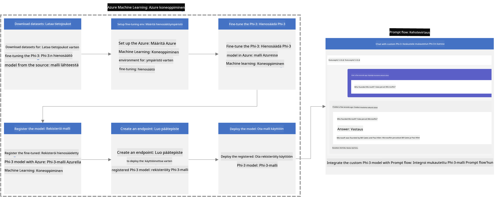

### Sisällysluettelo

1. **[Skenaario 1: Azure-resurssien perustaminen ja valmistautuminen hienosäätöön](../../../../../../md/02.Application/01.TextAndChat/Phi3)**
    - [Luo Azure Machine Learning -työtila](../../../../../../md/02.Application/01.TextAndChat/Phi3)
    - [Pyydä GPU-kiintiöitä Azure-tilauksessa](../../../../../../md/02.Application/01.TextAndChat/Phi3)
    - [Lisää roolimääritys](../../../../../../md/02.Application/01.TextAndChat/Phi3)
    - [Perusta projekti](../../../../../../md/02.Application/01.TextAndChat/Phi3)
    - [Valmistele aineisto hienosäätöä varten](../../../../../../md/02.Application/01.TextAndChat/Phi3)

1. **[Skenaario 2: Phi-3-mallin hienosäätö ja käyttöönotto Azure Machine Learning Studiossa](../../../../../../md/02.Application/01.TextAndChat/Phi3)**
    - [Asenna Azure CLI](../../../../../../md/02.Application/01.TextAndChat/Phi3)
    - [Hienosäädä Phi-3-malli](../../../../../../md/02.Application/01.TextAndChat/Phi3)
    - [Ota hienosäädetty malli käyttöön](../../../../../../md/02.Application/01.TextAndChat/Phi3)

1. **[Skenaario 3: Integroi Prompt flow'hun ja keskustele mukautetun mallisi kanssa](../../../../../../md/02.Application/01.TextAndChat/Phi3)**
    - [Integroi mukautettu Phi-3-malli Prompt flow'hun](../../../../../../md/02.Application/01.TextAndChat/Phi3)
    - [Keskustele mukautetun mallisi kanssa](../../../../../../md/02.Application/01.TextAndChat/Phi3)

## Skenaario 1: Azure-resurssien perustaminen ja valmistautuminen hienosäätöön

### Luo Azure Machine Learning -työtila

1. Kirjoita *azure machine learning* **hakupalkkiin** portaalin yläosassa ja valitse **Azure Machine Learning** vaihtoehdoista.

    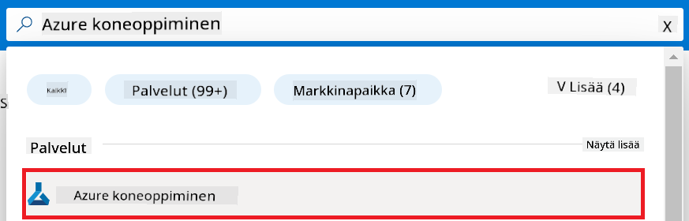

1. Valitse navigointivalikosta **+ Create**.

1. Valitse navigointivalikosta **New workspace**.

    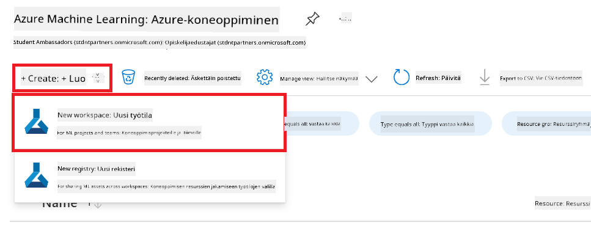

1. Suorita seuraavat tehtävät:

    - Valitse Azure-**Subscription**.
    - Valitse käytettävä **Resource group** (luo uusi tarvittaessa).
    - Anna **Workspace Name**. Sen on oltava yksilöllinen.
    - Valitse haluamasi **Region**.
    - Valitse käytettävä **Storage account** (luo uusi tarvittaessa).
    - Valitse käytettävä **Key vault** (luo uusi tarvittaessa).
    - Valitse käytettävä **Application insights** (luo uusi tarvittaessa).
    - Valitse käytettävä **Container registry** (luo uusi tarvittaessa).

    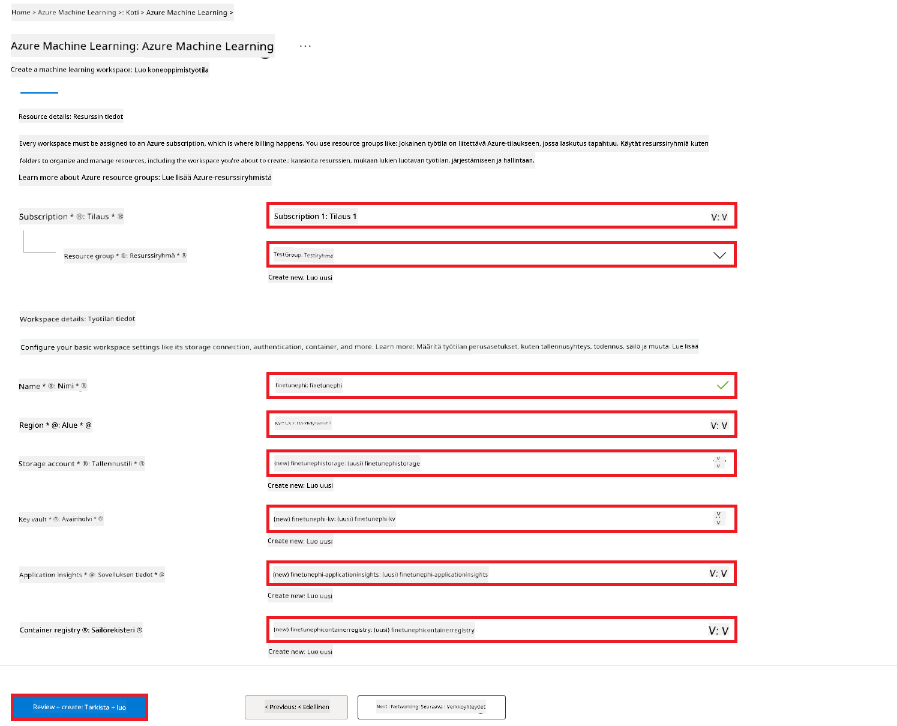

1. Valitse **Review + Create**.

1. Valitse **Create**.

### Pyydä GPU-kiintiöitä Azure-tilauksessa

Tässä E2E-esimerkissä käytät hienosäätöön *Standard_NC24ads_A100_v4 GPU*:ta, joka vaatii kiintiöpyynnön, ja käyttöönottoon *Standard_E4s_v3* CPU:ta, joka ei vaadi kiintiöpyyntöä.

> [!NOTE]
>
> Vain Pay-As-You-Go -tilaukset (vakio-tilauksen tyyppi) ovat oikeutettuja GPU-varauksiin; etuustilaukset eivät tällä hetkellä tue tätä.
>
> Niille, jotka käyttävät etuustilauksia (kuten Visual Studio Enterprise Subscription) tai haluavat nopeasti testata hienosäätö- ja käyttöönotto-prosessia, tämä opas tarjoaa myös ohjeita hienosäätöön pienellä aineistolla CPU:lla. On kuitenkin tärkeää huomata, että hienosäätötulokset ovat merkittävästi parempia, kun käytetään GPU:ta suuremmilla aineistoilla.

1. Siirry osoitteeseen [Azure ML Studio](https://ml.azure.com/home?wt.mc_id=studentamb_279723).

1. Suorita seuraavat tehtävät pyytääksesi *Standard NCADSA100v4 Family* -kiintiötä:

    - Valitse vasemman sivupalkin välilehdeltä **Quota**.
    - Valitse käytettävä **Virtual machine family**. Esimerkiksi valitse **Standard NCADSA100v4 Family Cluster Dedicated vCPUs**, joka sisältää *Standard_NC24ads_A100_v4* GPU:n.
    - Valitse navigointivalikosta **Request quota**.

        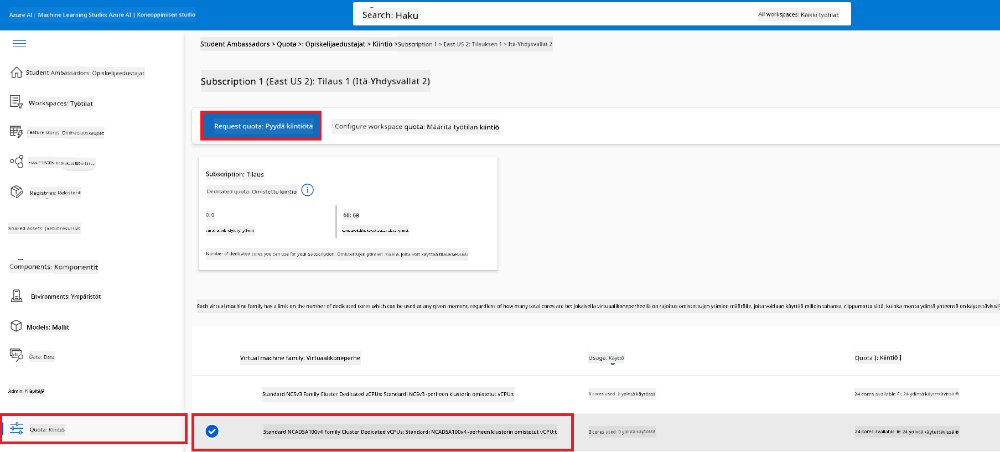

    - Kirjoita Request quota -sivulla haluamasi **New cores limit**. Esimerkiksi 24.
    - Valitse Request quota -sivulla **Submit** pyytääksesi GPU-kiintiötä.

> [!NOTE]
> Voit valita tarpeisiisi sopivan GPU:n tai CPU:n tutustumalla [Sizes for Virtual Machines in Azure](https://learn.microsoft.com/azure/virtual-machines/sizes/overview?tabs=breakdownseries%2Cgeneralsizelist%2Ccomputesizelist%2Cmemorysizelist%2Cstoragesizelist%2Cgpusizelist%2Cfpgasizelist%2Chpcsizelist) -dokumentaatioon.

### Lisää roolimääritys

Hienosäätöä ja käyttöönottoa varten sinun on ensin luotava User Assigned Managed Identity (UAI) ja annettava sille tarvittavat oikeudet. Tätä UAI:ta käytetään todennukseen käyttöönoton aikana.

#### Luo User Assigned Managed Identity (UAI)

1. Kirjoita *managed identities* **hakupalkkiin** portaalin yläosassa ja valitse **Managed Identities** vaihtoehdoista.

    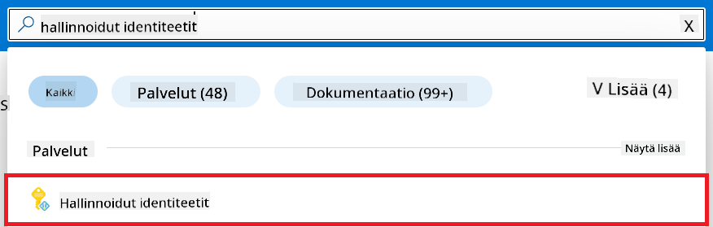

1. Valitse **+ Create**.

    

1. Suorita seuraavat tehtävät:

    - Valitse Azure-**Subscription**.
    - Valitse käytettävä **Resource group** (luo uusi tarvittaessa).
    - Valitse haluamasi **Region**.
    - Anna **Name**. Sen on oltava yksilöllinen.

1. Valitse **Review + create**.

1. Valitse **+ Create**.

#### Lisää Contributor-roolimääritys Managed Identitylle

1. Siirry luomaasi Managed Identity -resurssiin.

1. Valitse vasemman sivupalkin välilehdeltä **Azure role assignments**.

1. Valitse navigointivalikosta **+Add role assignment**.

1. Add role assignment -sivulla suorita seuraavat tehtävät:
    - Valitse **Scope** arvoksi **Resource group**.
    - Valitse Azure-**Subscription**.
    - Valitse käytettävä **Resource group**.
    - Valitse **Role** arvoksi **Contributor**.

    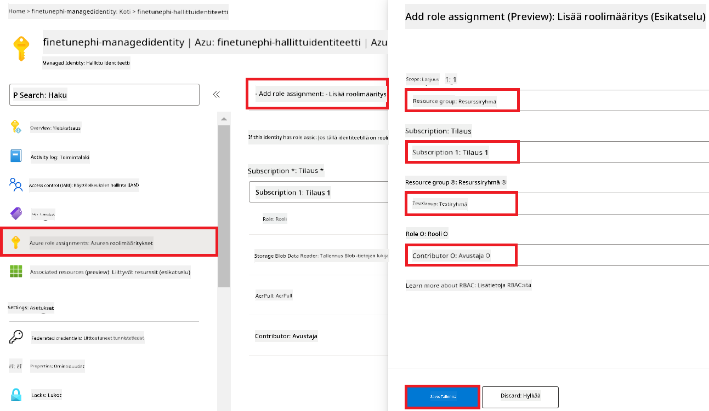

1. Valitse **Save**.

#### Lisää Storage Blob Data Reader -roolimääritys Managed Identitylle

1. Kirjoita *storage accounts* **hakupalkkiin** portaalin yläosassa ja valitse **Storage accounts** vaihtoehdoista.

    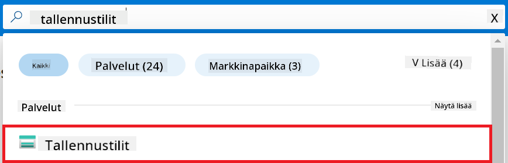

1. Valitse Azure Machine Learning -työtilaan liittyvä tallennustili, jonka loit. Esimerkiksi *finetunephistorage*.

1. Suorita seuraavat tehtävät siirtyäksesi Add role assignment -sivulle:

    - Siirry luomaasi Azure Storage -tiliin.
    - Valitse vasemman sivupalkin välilehdeltä **Access Control (IAM)**.
    - Valitse navigointivalikosta **+ Add**.
    - Valitse navigointivalikosta **Add role assignment**.

    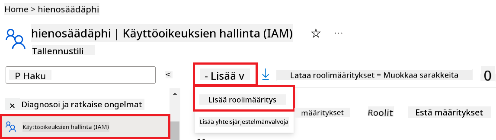

1. Add role assignment -sivulla suorita seuraavat tehtävät:

    - Kirjoita roolisivulla **search bar** -kenttään *Storage Blob Data Reader* ja valitse **Storage Blob Data Reader** vaihtoehdoista.
    - Valitse roolisivulla **Next**.
    - Jäsenet-sivulla valitse **Assign access to** arvoksi **Managed identity**.
    - Jäsenet-sivulla valitse **+ Select members**.
    - Valitse Select managed identities -sivulla Azure-**Subscription**.
    - Valitse Select managed identities -sivulla **Managed identity** arvoksi **Manage Identity**.
    - Valitse luomasi Manage Identity, esimerkiksi *finetunephi-managedidentity*.
    - Valitse Select managed identities -sivulla **Select**.

    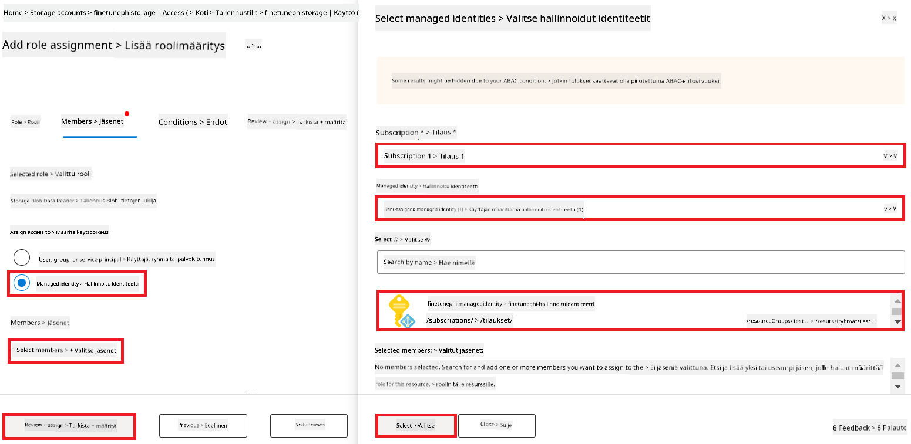

1. Valitse **Review + assign**.

#### Lisää AcrPull-roolimääritys Managed Identitylle

1. Kirjoita *container registries* **hakupalkkiin** portaalin yläosassa ja valitse **Container registries** vaihtoehdoista.

    

1. Valitse Azure Machine Learning -työtilaan liittyvä container registry, esimerkiksi *finetunephicontainerregistries*.

1. Suorita seuraavat tehtävät siirtyäksesi Add role assignment -sivulle:

    - Valitse vasemman sivupalkin välilehdeltä **Access Control (IAM)**.
    - Valitse navigointivalikosta **+ Add**.
    - Valitse navigointivalikosta **Add role assignment**.

1. Add role assignment -sivulla suorita seuraavat tehtävät:

    - Kirjoita roolisivulla **search bar** -kenttään *AcrPull* ja valitse **AcrPull** vaihtoehdoista.
    - Valitse roolisivulla **Next**.
    - Jäsenet-sivulla valitse **Assign access to** arvoksi **Managed identity**.
    - Jäsenet-sivulla valitse **+ Select members**.
    - Valitse Select managed identities -sivulla Azure-**Subscription**.
    - Valitse Select managed identities -sivulla **Managed identity** arvoksi **Manage Identity**.
    - Valitse luomasi Manage Identity, esimerkiksi *finetunephi-managedidentity*.
    - Valitse Select managed identities -sivulla **Select**.
    - Valitse **Review + assign**.

### Perusta projekti

Nyt luot kansion, jossa työskentelet, ja asetat virtuaaliympäristön ohjelman kehittämistä varten. Ohjelma kommunikoi käyttäjien kanssa ja hyödyntää Azure Cosmos DB:stä tallennettua keskusteluhistoriaa vastauksissaan.

#### Luo kansio työskentelyä varten

1. Avaa terminaali ja kirjoita seuraava komento luodaksesi kansion nimeltä *finetune-phi* oletuspolkuun.

    ```console
    mkdir finetune-phi
    ```

1. Kirjoita terminaaliin seuraava komento siirtyäksesi luomaasi *finetune-phi* -kansioon.

    ```console
    cd finetune-phi
    ```

#### Luo virtuaaliympäristö

1. Kirjoita terminaaliin seuraava komento luodaksesi virtuaaliympäristön nimeltä *.venv*.

    ```console
    python -m venv .venv
    ```

1. Kirjoita terminaaliin seuraava komento aktivoidaksesi virtuaaliympäristön.

    ```console
    .venv\Scripts\activate.bat
    ```
> [!NOTE]
>
> Jos kaikki meni oikein, komentokehotteen edessä pitäisi näkyä *(.venv)*.
#### Asenna tarvittavat paketit

1. Kirjoita seuraavat komennot terminaaliisi asentaaksesi tarvittavat paketit.

    ```console
    pip install datasets==2.19.1
    pip install transformers==4.41.1
    pip install azure-ai-ml==1.16.0
    pip install torch==2.3.1
    pip install trl==0.9.4
    pip install promptflow==1.12.0
    ```

#### Luo projektitiedostot

Tässä harjoituksessa luot projektimme olennaiset tiedostot. Näihin tiedostoihin sisältyy skriptejä datasetin lataamiseen, Azure Machine Learning -ympäristön määrittämiseen, Phi-3-mallin hienosäätöön sekä hienosäädetyn mallin käyttöönottoon. Lisäksi luot *conda.yml* -tiedoston hienosäätöympäristön määrittämiseksi.

Tässä harjoituksessa teet seuraavaa:

- Luo *download_dataset.py* -tiedosto datasetin lataamista varten.
- Luo *setup_ml.py* -tiedosto Azure Machine Learning -ympäristön määrittämistä varten.
- Luo *fine_tune.py* -tiedosto *finetuning_dir* -kansioon Phi-3-mallin hienosäätöä varten datasetin avulla.
- Luo *conda.yml* -tiedosto hienosäätöympäristön määrittämiseksi.
- Luo *deploy_model.py* -tiedosto hienosäädetyn mallin käyttöönottoa varten.
- Luo *integrate_with_promptflow.py* -tiedosto hienosäädetyn mallin integroimiseksi ja suorittamiseksi Prompt Flow'n avulla.
- Luo *flow.dag.yml* -tiedosto työnkulun rakenteen määrittämiseksi Prompt Flow'hun.
- Luo *config.py* -tiedosto Azure-tietojen syöttämistä varten.

> [!NOTE]
>
> Koko kansiorakenne:
>
> ```text
> └── YourUserName
> .    └── finetune-phi
> .        ├── finetuning_dir
> .        │      └── fine_tune.py
> .        ├── conda.yml
> .        ├── config.py
> .        ├── deploy_model.py
> .        ├── download_dataset.py
> .        ├── flow.dag.yml
> .        ├── integrate_with_promptflow.py
> .        └── setup_ml.py
> ```

1. Avaa **Visual Studio Code**.

1. Valitse valikkoriviltä **File**.

1. Valitse **Open Folder**.

1. Valitse luomasi *finetune-phi* -kansio, joka sijaitsee polussa *C:\Users\yourUserName\finetune-phi*.

    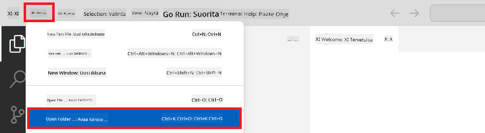

1. Visual Studio Coden vasemmassa paneelissa napsauta hiiren oikealla ja valitse **New File** luodaksesi uuden tiedoston nimeltä *download_dataset.py*.

1. Visual Studio Coden vasemmassa paneelissa napsauta hiiren oikealla ja valitse **New File** luodaksesi uuden tiedoston nimeltä *setup_ml.py*.

1. Visual Studio Coden vasemmassa paneelissa napsauta hiiren oikealla ja valitse **New File** luodaksesi uuden tiedoston nimeltä *deploy_model.py*.

    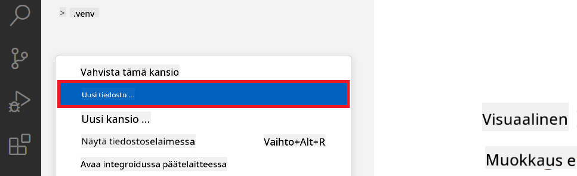

1. Visual Studio Coden vasemmassa paneelissa napsauta hiiren oikealla ja valitse **New Folder** luodaksesi uuden kansion nimeltä *finetuning_dir*.

1. Luo *finetuning_dir* -kansioon uusi tiedosto nimeltä *fine_tune.py*.

#### Luo ja määritä *conda.yml* -tiedosto

1. Visual Studio Coden vasemmassa paneelissa napsauta hiiren oikealla ja valitse **New File** luodaksesi uuden tiedoston nimeltä *conda.yml*.

1. Lisää seuraava koodi *conda.yml* -tiedostoon määrittääksesi Phi-3-mallin hienosäätöympäristön.

    ```yml
    name: phi-3-training-env
    channels:
      - defaults
      - conda-forge
    dependencies:
      - python=3.10
      - pip
      - numpy<2.0
      - pip:
          - torch==2.4.0
          - torchvision==0.19.0
          - trl==0.8.6
          - transformers==4.41
          - datasets==2.21.0
          - azureml-core==1.57.0
          - azure-storage-blob==12.19.0
          - azure-ai-ml==1.16
          - azure-identity==1.17.1
          - accelerate==0.33.0
          - mlflow==2.15.1
          - azureml-mlflow==1.57.0
    ```

#### Luo ja määritä *config.py* -tiedosto

1. Visual Studio Coden vasemmassa paneelissa napsauta hiiren oikealla ja valitse **New File** luodaksesi uuden tiedoston nimeltä *config.py*.

1. Lisää seuraava koodi *config.py* -tiedostoon lisätäksesi Azure-tietosi.

    ```python
    # Azure settings
    AZURE_SUBSCRIPTION_ID = "your_subscription_id"
    AZURE_RESOURCE_GROUP_NAME = "your_resource_group_name" # "TestGroup"

    # Azure Machine Learning settings
    AZURE_ML_WORKSPACE_NAME = "your_workspace_name" # "finetunephi-workspace"

    # Azure Managed Identity settings
    AZURE_MANAGED_IDENTITY_CLIENT_ID = "your_azure_managed_identity_client_id"
    AZURE_MANAGED_IDENTITY_NAME = "your_azure_managed_identity_name" # "finetunephi-mangedidentity"
    AZURE_MANAGED_IDENTITY_RESOURCE_ID = f"/subscriptions/{AZURE_SUBSCRIPTION_ID}/resourceGroups/{AZURE_RESOURCE_GROUP_NAME}/providers/Microsoft.ManagedIdentity/userAssignedIdentities/{AZURE_MANAGED_IDENTITY_NAME}"

    # Dataset file paths
    TRAIN_DATA_PATH = "data/train_data.jsonl"
    TEST_DATA_PATH = "data/test_data.jsonl"

    # Fine-tuned model settings
    AZURE_MODEL_NAME = "your_fine_tuned_model_name" # "finetune-phi-model"
    AZURE_ENDPOINT_NAME = "your_fine_tuned_model_endpoint_name" # "finetune-phi-endpoint"
    AZURE_DEPLOYMENT_NAME = "your_fine_tuned_model_deployment_name" # "finetune-phi-deployment"

    AZURE_ML_API_KEY = "your_fine_tuned_model_api_key"
    AZURE_ML_ENDPOINT = "your_fine_tuned_model_endpoint_uri" # "https://{your-endpoint-name}.{your-region}.inference.ml.azure.com/score"
    ```

#### Lisää Azure-ympäristömuuttujat

1. Suorita seuraavat toimenpiteet lisätäksesi Azure Subscription ID:n:

    - Kirjoita *subscriptions* portaalin sivun yläosan **hakupalkkiin** ja valitse avautuvista vaihtoehdoista **Subscriptions**.
    - Valitse käyttämäsi Azure-tilaus.
    - Kopioi ja liitä tilaus-ID *config.py* -tiedostoon.

    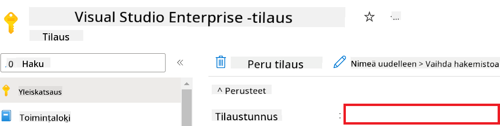

1. Suorita seuraavat toimenpiteet lisätäksesi Azure Workspace -nimen:

    - Siirry luomaasi Azure Machine Learning -resurssiin.
    - Kopioi ja liitä tilisi nimi *config.py* -tiedostoon.

    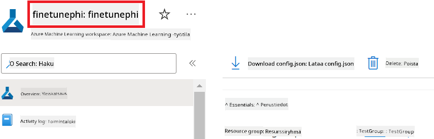

1. Suorita seuraavat toimenpiteet lisätäksesi Azure Resource Group -nimen:

    - Siirry luomaasi Azure Machine Learning -resurssiin.
    - Kopioi ja liitä Azure Resource Group -nimesi *config.py* -tiedostoon.

    

2. Suorita seuraavat toimenpiteet lisätäksesi Azure Managed Identity -nimen:

    - Siirry luomaasi Managed Identities -resurssiin.
    - Kopioi ja liitä Azure Managed Identity -nimesi *config.py* -tiedostoon.

    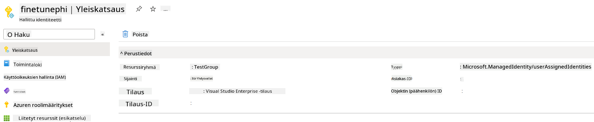

### Valmistele dataset hienosäätöä varten

Tässä harjoituksessa suoritat *download_dataset.py* -tiedoston ladataksesi *ULTRACHAT_200k* -datasetit paikalliseen ympäristöösi. Käytät näitä datasettejä Phi-3-mallin hienosäätöön Azure Machine Learningissä.

#### Lataa dataset *download_dataset.py* -tiedostolla

1. Avaa *download_dataset.py* -tiedosto Visual Studio Codessa.

1. Lisää seuraava koodi *download_dataset.py* -tiedostoon.

    ```python
    import json
    import os
    from datasets import load_dataset
    from config import (
        TRAIN_DATA_PATH,
        TEST_DATA_PATH)

    def load_and_split_dataset(dataset_name, config_name, split_ratio):
        """
        Load and split a dataset.
        """
        # Load the dataset with the specified name, configuration, and split ratio
        dataset = load_dataset(dataset_name, config_name, split=split_ratio)
        print(f"Original dataset size: {len(dataset)}")
        
        # Split the dataset into train and test sets (80% train, 20% test)
        split_dataset = dataset.train_test_split(test_size=0.2)
        print(f"Train dataset size: {len(split_dataset['train'])}")
        print(f"Test dataset size: {len(split_dataset['test'])}")
        
        return split_dataset

    def save_dataset_to_jsonl(dataset, filepath):
        """
        Save a dataset to a JSONL file.
        """
        # Create the directory if it does not exist
        os.makedirs(os.path.dirname(filepath), exist_ok=True)
        
        # Open the file in write mode
        with open(filepath, 'w', encoding='utf-8') as f:
            # Iterate over each record in the dataset
            for record in dataset:
                # Dump the record as a JSON object and write it to the file
                json.dump(record, f)
                # Write a newline character to separate records
                f.write('\n')
        
        print(f"Dataset saved to {filepath}")

    def main():
        """
        Main function to load, split, and save the dataset.
        """
        # Load and split the ULTRACHAT_200k dataset with a specific configuration and split ratio
        dataset = load_and_split_dataset("HuggingFaceH4/ultrachat_200k", 'default', 'train_sft[:1%]')
        
        # Extract the train and test datasets from the split
        train_dataset = dataset['train']
        test_dataset = dataset['test']

        # Save the train dataset to a JSONL file
        save_dataset_to_jsonl(train_dataset, TRAIN_DATA_PATH)
        
        # Save the test dataset to a separate JSONL file
        save_dataset_to_jsonl(test_dataset, TEST_DATA_PATH)

    if __name__ == "__main__":
        main()

    ```

> [!TIP]
>
> **Ohjeita pienen datasetin hienosäätöön CPU:lla**
>
> Jos haluat käyttää CPU:ta hienosäätöön, tämä lähestymistapa sopii erityisesti niille, joilla on etuoikeutettuja tilauksia (kuten Visual Studio Enterprise Subscription) tai jotka haluavat nopeasti testata hienosäätö- ja käyttöönotto-prosessia.
>
> Korvaa `dataset = load_and_split_dataset("HuggingFaceH4/ultrachat_200k", 'default', 'train_sft[:1%]')` seuraavalla: `dataset = load_and_split_dataset("HuggingFaceH4/ultrachat_200k", 'default', 'train_sft[:10]')`
>

1. Kirjoita seuraava komento terminaaliisi suorittaaksesi skriptin ja ladataksesi datasetin paikalliseen ympäristöösi.

    ```console
    python download_data.py
    ```

1. Varmista, että datasetit tallentuivat onnistuneesti paikalliseen *finetune-phi/data* -hakemistoon.

> [!NOTE]
>
> **Datasetin koko ja hienosäätöaika**
>
> Tässä E2E-esimerkissä käytät vain 1 % datasetistä (`train_sft[:1%]`). Tämä vähentää merkittävästi datan määrää, nopeuttaen sekä latausta että hienosäätöä. Voit säätää prosenttiosuutta löytääksesi sopivan tasapainon koulutuksen keston ja mallin suorituskyvyn välillä. Pienemmän datasetin käyttö lyhentää hienosäätöön kuluvaa aikaa, mikä tekee prosessista hallittavamman E2E-esimerkin yhteydessä.

## Tapaus 2: Hienosäädä Phi-3-malli ja ota käyttöön Azure Machine Learning Studiolla

### Määritä Azure CLI

Sinun täytyy määrittää Azure CLI todennusta varten. Azure CLI:n avulla voit hallita Azure-resursseja suoraan komentoriviltä ja se tarjoaa tarvittavat tunnistetiedot, jotta Azure Machine Learning pääsee käsiksi näihin resursseihin. Aloittaaksesi asenna [Azure CLI](https://learn.microsoft.com/cli/azure/install-azure-cli)

1. Avaa terminaali ja kirjoita seuraava komento kirjautuaksesi Azure-tilillesi.

    ```console
    az login
    ```

1. Valitse käytettävä Azure-tilisi.

1. Valitse käytettävä Azure-tilaus.

    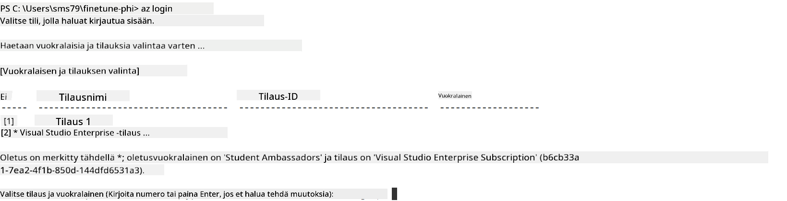

> [!TIP]
>
> Jos sinulla on ongelmia Azureen kirjautumisessa, kokeile käyttää laitekoodia. Avaa terminaali ja kirjoita seuraava komento kirjautuaksesi Azure-tilillesi:
>
> ```console
> az login --use-device-code
> ```
>

### Hienosäädä Phi-3-malli

Tässä harjoituksessa hienosäädät Phi-3-mallin annetun datasetin avulla. Ensin määrittelet hienosäätöprosessin *fine_tune.py* -tiedostossa. Sen jälkeen määrität Azure Machine Learning -ympäristön ja käynnistät hienosäädön suorittamalla *setup_ml.py* -tiedoston. Tämä skripti varmistaa, että hienosäätö tapahtuu Azure Machine Learning -ympäristössä.

Suorittamalla *setup_ml.py* käynnistät hienosäätöprosessin Azure Machine Learning -ympäristössä.

#### Lisää koodi *fine_tune.py* -tiedostoon

1. Siirry *finetuning_dir* -kansioon ja avaa *fine_tune.py* Visual Studio Codessa.

1. Lisää seuraava koodi *fine_tune.py* -tiedostoon.

    ```python
    import argparse
    import sys
    import logging
    import os
    from datasets import load_dataset
    import torch
    import mlflow
    from transformers import AutoModelForCausalLM, AutoTokenizer, TrainingArguments
    from trl import SFTTrainer

    # To avoid the INVALID_PARAMETER_VALUE error in MLflow, disable MLflow integration
    os.environ["DISABLE_MLFLOW_INTEGRATION"] = "True"

    # Logging setup
    logging.basicConfig(
        format="%(asctime)s - %(levelname)s - %(name)s - %(message)s",
        datefmt="%Y-%m-%d %H:%M:%S",
        handlers=[logging.StreamHandler(sys.stdout)],
        level=logging.WARNING
    )
    logger = logging.getLogger(__name__)

    def initialize_model_and_tokenizer(model_name, model_kwargs):
        """
        Initialize the model and tokenizer with the given pretrained model name and arguments.
        """
        model = AutoModelForCausalLM.from_pretrained(model_name, **model_kwargs)
        tokenizer = AutoTokenizer.from_pretrained(model_name)
        tokenizer.model_max_length = 2048
        tokenizer.pad_token = tokenizer.unk_token
        tokenizer.pad_token_id = tokenizer.convert_tokens_to_ids(tokenizer.pad_token)
        tokenizer.padding_side = 'right'
        return model, tokenizer

    def apply_chat_template(example, tokenizer):
        """
        Apply a chat template to tokenize messages in the example.
        """
        messages = example["messages"]
        if messages[0]["role"] != "system":
            messages.insert(0, {"role": "system", "content": ""})
        example["text"] = tokenizer.apply_chat_template(
            messages, tokenize=False, add_generation_prompt=False
        )
        return example

    def load_and_preprocess_data(train_filepath, test_filepath, tokenizer):
        """
        Load and preprocess the dataset.
        """
        train_dataset = load_dataset('json', data_files=train_filepath, split='train')
        test_dataset = load_dataset('json', data_files=test_filepath, split='train')
        column_names = list(train_dataset.features)

        train_dataset = train_dataset.map(
            apply_chat_template,
            fn_kwargs={"tokenizer": tokenizer},
            num_proc=10,
            remove_columns=column_names,
            desc="Applying chat template to train dataset",
        )

        test_dataset = test_dataset.map(
            apply_chat_template,
            fn_kwargs={"tokenizer": tokenizer},
            num_proc=10,
            remove_columns=column_names,
            desc="Applying chat template to test dataset",
        )

        return train_dataset, test_dataset

    def train_and_evaluate_model(train_dataset, test_dataset, model, tokenizer, output_dir):
        """
        Train and evaluate the model.
        """
        training_args = TrainingArguments(
            bf16=True,
            do_eval=True,
            output_dir=output_dir,
            eval_strategy="epoch",
            learning_rate=5.0e-06,
            logging_steps=20,
            lr_scheduler_type="cosine",
            num_train_epochs=3,
            overwrite_output_dir=True,
            per_device_eval_batch_size=4,
            per_device_train_batch_size=4,
            remove_unused_columns=True,
            save_steps=500,
            seed=0,
            gradient_checkpointing=True,
            gradient_accumulation_steps=1,
            warmup_ratio=0.2,
        )

        trainer = SFTTrainer(
            model=model,
            args=training_args,
            train_dataset=train_dataset,
            eval_dataset=test_dataset,
            max_seq_length=2048,
            dataset_text_field="text",
            tokenizer=tokenizer,
            packing=True
        )

        train_result = trainer.train()
        trainer.log_metrics("train", train_result.metrics)

        mlflow.transformers.log_model(
            transformers_model={"model": trainer.model, "tokenizer": tokenizer},
            artifact_path=output_dir,
        )

        tokenizer.padding_side = 'left'
        eval_metrics = trainer.evaluate()
        eval_metrics["eval_samples"] = len(test_dataset)
        trainer.log_metrics("eval", eval_metrics)

    def main(train_file, eval_file, model_output_dir):
        """
        Main function to fine-tune the model.
        """
        model_kwargs = {
            "use_cache": False,
            "trust_remote_code": True,
            "torch_dtype": torch.bfloat16,
            "device_map": None,
            "attn_implementation": "eager"
        }

        # pretrained_model_name = "microsoft/Phi-3-mini-4k-instruct"
        pretrained_model_name = "microsoft/Phi-3.5-mini-instruct"

        with mlflow.start_run():
            model, tokenizer = initialize_model_and_tokenizer(pretrained_model_name, model_kwargs)
            train_dataset, test_dataset = load_and_preprocess_data(train_file, eval_file, tokenizer)
            train_and_evaluate_model(train_dataset, test_dataset, model, tokenizer, model_output_dir)

    if __name__ == "__main__":
        parser = argparse.ArgumentParser()
        parser.add_argument("--train-file", type=str, required=True, help="Path to the training data")
        parser.add_argument("--eval-file", type=str, required=True, help="Path to the evaluation data")
        parser.add_argument("--model_output_dir", type=str, required=True, help="Directory to save the fine-tuned model")
        args = parser.parse_args()
        main(args.train_file, args.eval_file, args.model_output_dir)

    ```

1. Tallenna ja sulje *fine_tune.py* -tiedosto.

> [!TIP]
> **Voit hienosäätää myös Phi-3.5-mallia**
>
> *fine_tune.py* -tiedostossa voit vaihtaa `pretrained_model_name` arvosta `"microsoft/Phi-3-mini-4k-instruct"` mihin tahansa haluamaasi malliin. Esimerkiksi vaihtamalla sen arvoon `"microsoft/Phi-3.5-mini-instruct"` käytät Phi-3.5-mini-instruct -mallia hienosäätöön. Löytääksesi ja käyttääksesi haluamasi mallin nimen, käy [Hugging Face](https://huggingface.co/) -sivustolla, etsi kiinnostava malli ja kopioi sen nimi `pretrained_model_name` -kenttään skriptissäsi.
>
> :::image type="content" source="../../imgs/03/FineTuning-PromptFlow/finetunephi3.5.png" alt-text="Hienosäädä Phi-3.5.":::
>

#### Lisää koodi *setup_ml.py* -tiedostoon

1. Avaa *setup_ml.py* Visual Studio Codessa.

1. Lisää seuraava koodi *setup_ml.py* -tiedostoon.

    ```python
    import logging
    from azure.ai.ml import MLClient, command, Input
    from azure.ai.ml.entities import Environment, AmlCompute
    from azure.identity import AzureCliCredential
    from config import (
        AZURE_SUBSCRIPTION_ID,
        AZURE_RESOURCE_GROUP_NAME,
        AZURE_ML_WORKSPACE_NAME,
        TRAIN_DATA_PATH,
        TEST_DATA_PATH
    )

    # Constants

    # Uncomment the following lines to use a CPU instance for training
    # COMPUTE_INSTANCE_TYPE = "Standard_E16s_v3" # cpu
    # COMPUTE_NAME = "cpu-e16s-v3"
    # DOCKER_IMAGE_NAME = "mcr.microsoft.com/azureml/openmpi4.1.0-ubuntu20.04:latest"

    # Uncomment the following lines to use a GPU instance for training
    COMPUTE_INSTANCE_TYPE = "Standard_NC24ads_A100_v4"
    COMPUTE_NAME = "gpu-nc24s-a100-v4"
    DOCKER_IMAGE_NAME = "mcr.microsoft.com/azureml/curated/acft-hf-nlp-gpu:59"

    CONDA_FILE = "conda.yml"
    LOCATION = "eastus2" # Replace with the location of your compute cluster
    FINETUNING_DIR = "./finetuning_dir" # Path to the fine-tuning script
    TRAINING_ENV_NAME = "phi-3-training-environment" # Name of the training environment
    MODEL_OUTPUT_DIR = "./model_output" # Path to the model output directory in azure ml

    # Logging setup to track the process
    logger = logging.getLogger(__name__)
    logging.basicConfig(
        format="%(asctime)s - %(levelname)s - %(name)s - %(message)s",
        datefmt="%Y-%m-%d %H:%M:%S",
        level=logging.WARNING
    )

    def get_ml_client():
        """
        Initialize the ML Client using Azure CLI credentials.
        """
        credential = AzureCliCredential()
        return MLClient(credential, AZURE_SUBSCRIPTION_ID, AZURE_RESOURCE_GROUP_NAME, AZURE_ML_WORKSPACE_NAME)

    def create_or_get_environment(ml_client):
        """
        Create or update the training environment in Azure ML.
        """
        env = Environment(
            image=DOCKER_IMAGE_NAME,  # Docker image for the environment
            conda_file=CONDA_FILE,  # Conda environment file
            name=TRAINING_ENV_NAME,  # Name of the environment
        )
        return ml_client.environments.create_or_update(env)

    def create_or_get_compute_cluster(ml_client, compute_name, COMPUTE_INSTANCE_TYPE, location):
        """
        Create or update the compute cluster in Azure ML.
        """
        try:
            compute_cluster = ml_client.compute.get(compute_name)
            logger.info(f"Compute cluster '{compute_name}' already exists. Reusing it for the current run.")
        except Exception:
            logger.info(f"Compute cluster '{compute_name}' does not exist. Creating a new one with size {COMPUTE_INSTANCE_TYPE}.")
            compute_cluster = AmlCompute(
                name=compute_name,
                size=COMPUTE_INSTANCE_TYPE,
                location=location,
                tier="Dedicated",  # Tier of the compute cluster
                min_instances=0,  # Minimum number of instances
                max_instances=1  # Maximum number of instances
            )
            ml_client.compute.begin_create_or_update(compute_cluster).wait()  # Wait for the cluster to be created
        return compute_cluster

    def create_fine_tuning_job(env, compute_name):
        """
        Set up the fine-tuning job in Azure ML.
        """
        return command(
            code=FINETUNING_DIR,  # Path to fine_tune.py
            command=(
                "python fine_tune.py "
                "--train-file ${{inputs.train_file}} "
                "--eval-file ${{inputs.eval_file}} "
                "--model_output_dir ${{inputs.model_output}}"
            ),
            environment=env,  # Training environment
            compute=compute_name,  # Compute cluster to use
            inputs={
                "train_file": Input(type="uri_file", path=TRAIN_DATA_PATH),  # Path to the training data file
                "eval_file": Input(type="uri_file", path=TEST_DATA_PATH),  # Path to the evaluation data file
                "model_output": MODEL_OUTPUT_DIR
            }
        )

    def main():
        """
        Main function to set up and run the fine-tuning job in Azure ML.
        """
        # Initialize ML Client
        ml_client = get_ml_client()

        # Create Environment
        env = create_or_get_environment(ml_client)
        
        # Create or get existing compute cluster
        create_or_get_compute_cluster(ml_client, COMPUTE_NAME, COMPUTE_INSTANCE_TYPE, LOCATION)

        # Create and Submit Fine-Tuning Job
        job = create_fine_tuning_job(env, COMPUTE_NAME)
        returned_job = ml_client.jobs.create_or_update(job)  # Submit the job
        ml_client.jobs.stream(returned_job.name)  # Stream the job logs
        
        # Capture the job name
        job_name = returned_job.name
        print(f"Job name: {job_name}")

    if __name__ == "__main__":
        main()

    ```

1. Korvaa `COMPUTE_INSTANCE_TYPE`, `COMPUTE_NAME` ja `LOCATION` omilla tiedoillasi.

    ```python
   # Uncomment the following lines to use a GPU instance for training
    COMPUTE_INSTANCE_TYPE = "Standard_NC24ads_A100_v4"
    COMPUTE_NAME = "gpu-nc24s-a100-v4"
    ...
    LOCATION = "eastus2" # Replace with the location of your compute cluster
    ```

> [!TIP]
>
> **Ohjeita pienen datasetin hienosäätöön CPU:lla**
>
> Jos haluat käyttää CPU:ta hienosäätöön, tämä lähestymistapa sopii erityisesti niille, joilla on etuoikeutettuja tilauksia (kuten Visual Studio Enterprise Subscription) tai jotka haluavat nopeasti testata hienosäätö- ja käyttöönotto-prosessia.
>
> 1. Avaa *setup_ml* -tiedosto.
> 1. Korvaa `COMPUTE_INSTANCE_TYPE`, `COMPUTE_NAME` ja `DOCKER_IMAGE_NAME` seuraavilla arvoilla. Jos sinulla ei ole pääsyä *Standard_E16s_v3* -instanssiin, voit käyttää vastaavaa CPU-instanssia tai pyytää uutta kiintiötä.
> 1. Korvaa `LOCATION` omilla tiedoillasi.
>
>    ```python
>    # Uncomment the following lines to use a CPU instance for training
>    COMPUTE_INSTANCE_TYPE = "Standard_E16s_v3" # cpu
>    COMPUTE_NAME = "cpu-e16s-v3"
>    DOCKER_IMAGE_NAME = "mcr.microsoft.com/azureml/openmpi4.1.0-ubuntu20.04:latest"
>    LOCATION = "eastus2" # Replace with the location of your compute cluster
>    ```
>

1. Kirjoita seuraava komento suorittaaksesi *setup_ml.py* -skriptin ja aloittaaksesi hienosäätöprosessin Azure Machine Learningissä.

    ```python
    python setup_ml.py
    ```

1. Tässä harjoituksessa hienosäädit Phi-3-mallin onnistuneesti Azure Machine Learningin avulla. Suorittamalla *setup_ml.py* -skriptin olet määrittänyt Azure Machine Learning -ympäristön ja käynnistänyt hienosäätöprosessin, joka on määritelty *fine_tune.py* -tiedostossa. Huomioithan, että hienosäätö voi kestää jonkin aikaa. Kun suoritat `python setup_ml.py` -komennon, sinun tulee odottaa prosessin valmistumista. Voit seurata hienosäätötyön tilaa seuraamalla terminaalissa annettua linkkiä Azure Machine Learning -portaaliin.

    

### Ota hienosäädetty malli käyttöön

Jotta voit integroida hienosäädetyn Phi-3-mallin Prompt Flow'hun, sinun täytyy ottaa malli käyttöön, jotta se on saatavilla reaaliaikaista ennustamista varten. Tämä prosessi sisältää mallin rekisteröinnin, online-päätepisteen luomisen ja mallin käyttöönoton.

#### Määritä mallin nimi, päätepisteen nimi ja käyttöönoton nimi

1. Avaa *config.py* -tiedosto.

1. Korvaa `AZURE_MODEL_NAME = "your_fine_tuned_model_name"` haluamallasi mallin nimellä.

1. Korvaa `AZURE_ENDPOINT_NAME = "your_fine_tuned_model_endpoint_name"` haluamallasi päätepisteen nimellä.

1. Korvaa `AZURE_DEPLOYMENT_NAME = "your_fine_tuned_model_deployment_name"` haluamallasi käyttöönoton nimellä.

#### Lisää koodi *deploy_model.py* -tiedostoon

*deploy_model.py* -tiedoston suorittaminen automatisoi koko käyttöönoton. Se rekisteröi mallin, luo päätepisteen ja suorittaa käyttöönoton *config.py* -tiedostossa määriteltyjen asetusten mukaan, jotka sisältävät mallin nimen, päätepisteen nimen ja käyttöönoton nimen.

1. Avaa *deploy_model.py* Visual Studio Codessa.

1. Lisää seuraava koodi *deploy_model.py* -tiedostoon.

    ```python
    import logging
    from azure.identity import AzureCliCredential
    from azure.ai.ml import MLClient
    from azure.ai.ml.entities import Model, ProbeSettings, ManagedOnlineEndpoint, ManagedOnlineDeployment, IdentityConfiguration, ManagedIdentityConfiguration, OnlineRequestSettings
    from azure.ai.ml.constants import AssetTypes

    # Configuration imports
    from config import (
        AZURE_SUBSCRIPTION_ID,
        AZURE_RESOURCE_GROUP_NAME,
        AZURE_ML_WORKSPACE_NAME,
        AZURE_MANAGED_IDENTITY_RESOURCE_ID,
        AZURE_MANAGED_IDENTITY_CLIENT_ID,
        AZURE_MODEL_NAME,
        AZURE_ENDPOINT_NAME,
        AZURE_DEPLOYMENT_NAME
    )

    # Constants
    JOB_NAME = "your-job-name"
    COMPUTE_INSTANCE_TYPE = "Standard_E4s_v3"

    deployment_env_vars = {
        "SUBSCRIPTION_ID": AZURE_SUBSCRIPTION_ID,
        "RESOURCE_GROUP_NAME": AZURE_RESOURCE_GROUP_NAME,
        "UAI_CLIENT_ID": AZURE_MANAGED_IDENTITY_CLIENT_ID,
    }

    # Logging setup
    logging.basicConfig(
        format="%(asctime)s - %(levelname)s - %(name)s - %(message)s",
        datefmt="%Y-%m-%d %H:%M:%S",
        level=logging.DEBUG
    )
    logger = logging.getLogger(__name__)

    def get_ml_client():
        """Initialize and return the ML Client."""
        credential = AzureCliCredential()
        return MLClient(credential, AZURE_SUBSCRIPTION_ID, AZURE_RESOURCE_GROUP_NAME, AZURE_ML_WORKSPACE_NAME)

    def register_model(ml_client, model_name, job_name):
        """Register a new model."""
        model_path = f"azureml://jobs/{job_name}/outputs/artifacts/paths/model_output"
        logger.info(f"Registering model {model_name} from job {job_name} at path {model_path}.")
        run_model = Model(
            path=model_path,
            name=model_name,
            description="Model created from run.",
            type=AssetTypes.MLFLOW_MODEL,
        )
        model = ml_client.models.create_or_update(run_model)
        logger.info(f"Registered model ID: {model.id}")
        return model

    def delete_existing_endpoint(ml_client, endpoint_name):
        """Delete existing endpoint if it exists."""
        try:
            endpoint_result = ml_client.online_endpoints.get(name=endpoint_name)
            logger.info(f"Deleting existing endpoint {endpoint_name}.")
            ml_client.online_endpoints.begin_delete(name=endpoint_name).result()
            logger.info(f"Deleted existing endpoint {endpoint_name}.")
        except Exception as e:
            logger.info(f"No existing endpoint {endpoint_name} found to delete: {e}")

    def create_or_update_endpoint(ml_client, endpoint_name, description=""):
        """Create or update an endpoint."""
        delete_existing_endpoint(ml_client, endpoint_name)
        logger.info(f"Creating new endpoint {endpoint_name}.")
        endpoint = ManagedOnlineEndpoint(
            name=endpoint_name,
            description=description,
            identity=IdentityConfiguration(
                type="user_assigned",
                user_assigned_identities=[ManagedIdentityConfiguration(resource_id=AZURE_MANAGED_IDENTITY_RESOURCE_ID)]
            )
        )
        endpoint_result = ml_client.online_endpoints.begin_create_or_update(endpoint).result()
        logger.info(f"Created new endpoint {endpoint_name}.")
        return endpoint_result

    def create_or_update_deployment(ml_client, endpoint_name, deployment_name, model):
        """Create or update a deployment."""

        logger.info(f"Creating deployment {deployment_name} for endpoint {endpoint_name}.")
        deployment = ManagedOnlineDeployment(
            name=deployment_name,
            endpoint_name=endpoint_name,
            model=model.id,
            instance_type=COMPUTE_INSTANCE_TYPE,
            instance_count=1,
            environment_variables=deployment_env_vars,
            request_settings=OnlineRequestSettings(
                max_concurrent_requests_per_instance=3,
                request_timeout_ms=180000,
                max_queue_wait_ms=120000
            ),
            liveness_probe=ProbeSettings(
                failure_threshold=30,
                success_threshold=1,
                period=100,
                initial_delay=500,
            ),
            readiness_probe=ProbeSettings(
                failure_threshold=30,
                success_threshold=1,
                period=100,
                initial_delay=500,
            ),
        )
        deployment_result = ml_client.online_deployments.begin_create_or_update(deployment).result()
        logger.info(f"Created deployment {deployment.name} for endpoint {endpoint_name}.")
        return deployment_result

    def set_traffic_to_deployment(ml_client, endpoint_name, deployment_name):
        """Set traffic to the specified deployment."""
        try:
            # Fetch the current endpoint details
            endpoint = ml_client.online_endpoints.get(name=endpoint_name)
            
            # Log the current traffic allocation for debugging
            logger.info(f"Current traffic allocation: {endpoint.traffic}")
            
            # Set the traffic allocation for the deployment
            endpoint.traffic = {deployment_name: 100}
            
            # Update the endpoint with the new traffic allocation
            endpoint_poller = ml_client.online_endpoints.begin_create_or_update(endpoint)
            updated_endpoint = endpoint_poller.result()
            
            # Log the updated traffic allocation for debugging
            logger.info(f"Updated traffic allocation: {updated_endpoint.traffic}")
            logger.info(f"Set traffic to deployment {deployment_name} at endpoint {endpoint_name}.")
            return updated_endpoint
        except Exception as e:
            # Log any errors that occur during the process
            logger.error(f"Failed to set traffic to deployment: {e}")
            raise


    def main():
        ml_client = get_ml_client()

        registered_model = register_model(ml_client, AZURE_MODEL_NAME, JOB_NAME)
        logger.info(f"Registered model ID: {registered_model.id}")

        endpoint = create_or_update_endpoint(ml_client, AZURE_ENDPOINT_NAME, "Endpoint for finetuned Phi-3 model")
        logger.info(f"Endpoint {AZURE_ENDPOINT_NAME} is ready.")

        try:
            deployment = create_or_update_deployment(ml_client, AZURE_ENDPOINT_NAME, AZURE_DEPLOYMENT_NAME, registered_model)
            logger.info(f"Deployment {AZURE_DEPLOYMENT_NAME} is created for endpoint {AZURE_ENDPOINT_NAME}.")

            set_traffic_to_deployment(ml_client, AZURE_ENDPOINT_NAME, AZURE_DEPLOYMENT_NAME)
            logger.info(f"Traffic is set to deployment {AZURE_DEPLOYMENT_NAME} at endpoint {AZURE_ENDPOINT_NAME}.")
        except Exception as e:
            logger.error(f"Failed to create or update deployment: {e}")

    if __name__ == "__main__":
        main()

    ```

1. Suorita seuraavat toimenpiteet saadaksesi `JOB_NAME`:

    - Siirry luomaasi Azure Machine Learning -resurssiin.
    - Valitse **Studio web URL** avataksesi Azure Machine Learning -työpöydän.
    - Valitse vasemman sivupalkin valikosta **Jobs**.
    - Valitse hienosäätöön liittyvä kokeilu, esimerkiksi *finetunephi*.
    - Valitse luomasi työ.
- Kopioi ja liitä työnimesi `JOB_NAME = "your-job-name"` kohtaan *deploy_model.py* tiedostossa.

1. Korvaa `COMPUTE_INSTANCE_TYPE` omilla tiedoillasi.

1. Kirjoita seuraava komento ajaaksesi *deploy_model.py* skriptin ja aloittaaksesi käyttöönoton Azure Machine Learningissä.

    ```python
    python deploy_model.py
    ```


> [!WARNING]
> Välttääksesi ylimääräiset maksut tilillesi, muista poistaa luotu endpoint Azure Machine Learning -työtilasta.
>

#### Tarkista käyttöönoton tila Azure Machine Learning -työtilassa

1. Siirry osoitteeseen [Azure ML Studio](https://ml.azure.com/home?wt.mc_id=studentamb_279723).

1. Siirry luomaasi Azure Machine Learning -työtilaan.

1. Valitse **Studio web URL** avataksesi Azure Machine Learning -työtilan.

1. Valitse vasemman sivupalkin valikosta **Endpoints**.

    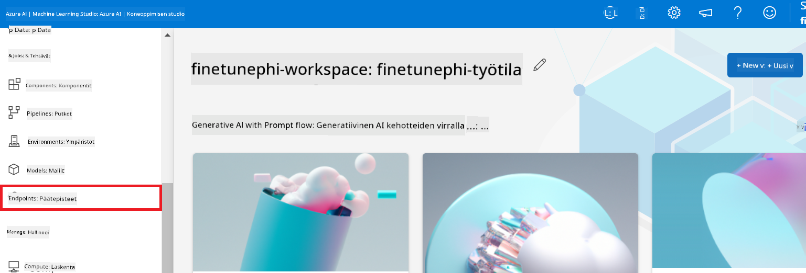

2. Valitse luomasi endpoint.

    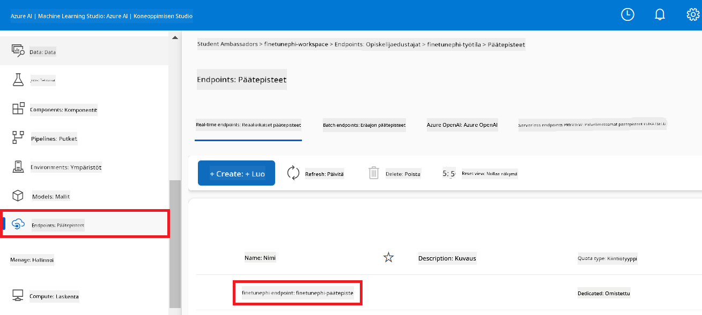

3. Tällä sivulla voit hallita käyttöönoton aikana luotuja endpointteja.

## Tapaus 3: Integroi Prompt flow’n kanssa ja keskustele mukautetulla mallillasi

### Integroi mukautettu Phi-3 malli Prompt flow’hun

Kun hienosäädetty mallisi on onnistuneesti otettu käyttöön, voit nyt integroida sen Prompt flow’hun käyttääksesi malliasi reaaliaikaisissa sovelluksissa, mahdollistaen monipuoliset vuorovaikutteiset tehtävät mukautetulla Phi-3 mallillasi.

#### Aseta hienosäädetyn Phi-3 mallin api-avain ja endpoint-osoite

1. Siirry luomaasi Azure Machine Learning -työtilaan.
1. Valitse vasemman sivupalkin valikosta **Endpoints**.
1. Valitse luomasi endpoint.
1. Valitse navigointivalikosta **Consume**.
1. Kopioi ja liitä **REST endpoint** *config.py* tiedostoon korvaten `AZURE_ML_ENDPOINT = "your_fine_tuned_model_endpoint_uri"` omalla **REST endpoint** -osoitteellasi.
1. Kopioi ja liitä **Primary key** *config.py* tiedostoon korvaten `AZURE_ML_API_KEY = "your_fine_tuned_model_api_key"` omalla **Primary key** -avaimellasi.

    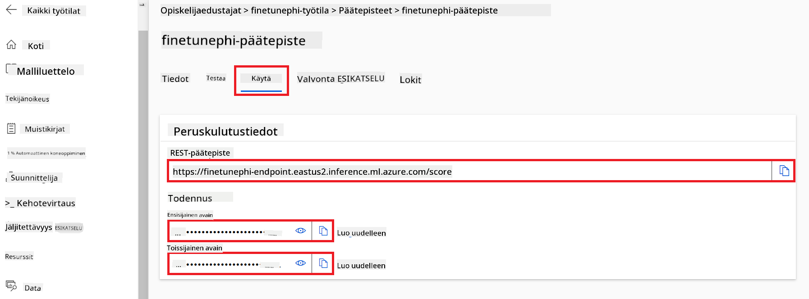

#### Lisää koodi *flow.dag.yml* tiedostoon

1. Avaa *flow.dag.yml* tiedosto Visual Studio Codessa.

1. Lisää seuraava koodi *flow.dag.yml* tiedostoon.

    ```yml
    inputs:
      input_data:
        type: string
        default: "Who founded Microsoft?"

    outputs:
      answer:
        type: string
        reference: ${integrate_with_promptflow.output}

    nodes:
    - name: integrate_with_promptflow
      type: python
      source:
        type: code
        path: integrate_with_promptflow.py
      inputs:
        input_data: ${inputs.input_data}
    ```

#### Lisää koodi *integrate_with_promptflow.py* tiedostoon

1. Avaa *integrate_with_promptflow.py* tiedosto Visual Studio Codessa.

1. Lisää seuraava koodi *integrate_with_promptflow.py* tiedostoon.

    ```python
    import logging
    import requests
    from promptflow.core import tool
    import asyncio
    import platform
    from config import (
        AZURE_ML_ENDPOINT,
        AZURE_ML_API_KEY
    )

    # Logging setup
    logging.basicConfig(
        format="%(asctime)s - %(levelname)s - %(name)s - %(message)s",
        datefmt="%Y-%m-%d %H:%M:%S",
        level=logging.DEBUG
    )
    logger = logging.getLogger(__name__)

    def query_azml_endpoint(input_data: list, endpoint_url: str, api_key: str) -> str:
        """
        Send a request to the Azure ML endpoint with the given input data.
        """
        headers = {
            "Content-Type": "application/json",
            "Authorization": f"Bearer {api_key}"
        }
        data = {
            "input_data": [input_data],
            "params": {
                "temperature": 0.7,
                "max_new_tokens": 128,
                "do_sample": True,
                "return_full_text": True
            }
        }
        try:
            response = requests.post(endpoint_url, json=data, headers=headers)
            response.raise_for_status()
            result = response.json()[0]
            logger.info("Successfully received response from Azure ML Endpoint.")
            return result
        except requests.exceptions.RequestException as e:
            logger.error(f"Error querying Azure ML Endpoint: {e}")
            raise

    def setup_asyncio_policy():
        """
        Setup asyncio event loop policy for Windows.
        """
        if platform.system() == 'Windows':
            asyncio.set_event_loop_policy(asyncio.WindowsSelectorEventLoopPolicy())
            logger.info("Set Windows asyncio event loop policy.")

    @tool
    def my_python_tool(input_data: str) -> str:
        """
        Tool function to process input data and query the Azure ML endpoint.
        """
        setup_asyncio_policy()
        return query_azml_endpoint(input_data, AZURE_ML_ENDPOINT, AZURE_ML_API_KEY)

    ```

### Keskustele mukautetulla mallillasi

1. Kirjoita seuraava komento ajaaksesi *deploy_model.py* skriptin ja aloittaaksesi käyttöönoton Azure Machine Learningissä.

    ```python
    pf flow serve --source ./ --port 8080 --host localhost
    ```

1. Tässä esimerkki tuloksista: Nyt voit keskustella mukautetun Phi-3 mallisi kanssa. Suositeltavaa on esittää kysymyksiä, jotka perustuvat hienosäätöön käytettyyn dataan.

    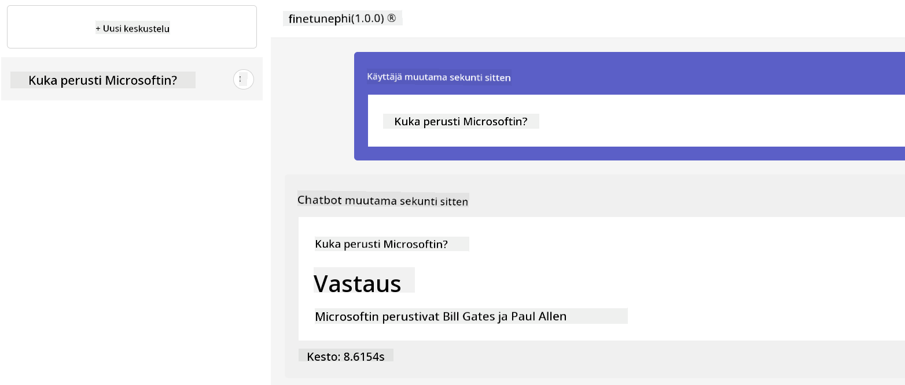

**Vastuuvapauslauseke**:  
Tämä asiakirja on käännetty käyttämällä tekoälypohjaista käännöspalvelua [Co-op Translator](https://github.com/Azure/co-op-translator). Vaikka pyrimme tarkkuuteen, huomioithan, että automaattikäännöksissä saattaa esiintyä virheitä tai epätarkkuuksia. Alkuperäistä asiakirjaa sen alkuperäiskielellä tulee pitää virallisena lähteenä. Tärkeissä asioissa suositellaan ammattimaista ihmiskäännöstä. Emme ole vastuussa tämän käännöksen käytöstä aiheutuvista väärinymmärryksistä tai tulkinnoista.