<!--
CO_OP_TRANSLATOR_METADATA:
{
  "original_hash": "0df910a227098303cc392b6ad204c271",
  "translation_date": "2026-01-06T04:48:10+00:00",
  "source_file": "md/02.Application/01.TextAndChat/Phi3/E2E_Phi-3-FineTuning_PromptFlow_Integration_AIFoundry.md",
  "language_code": "fi"
}
-->
# Hienosäädä ja integroi mukautetut Phi-3-mallit Prompt flow’n kanssa Azure AI Foundryssa

Tämä kokonaisvaltainen (E2E) esimerkkikokonaisuus perustuu Microsoft Tech Communityn opastukseen "[Fine-Tune and Integrate Custom Phi-3 Models with Prompt Flow in Azure AI Foundry](https://techcommunity.microsoft.com/t5/educator-developer-blog/fine-tune-and-integrate-custom-phi-3-models-with-prompt-flow-in/ba-p/4191726?WT.mc_id=aiml-137032-kinfeylo)". Se esittelee hienosäädön, käyttöönoton ja mukautettujen Phi-3-mallien integroimisen Prompt flow'n kanssa Azure AI Foundryssa.
Toisin kuin E2E-esimerkki "[Fine-Tune and Integrate Custom Phi-3 Models with Prompt Flow](./E2E_Phi-3-FineTuning_PromptFlow_Integration.md)", joka sisälsi koodin suorittamisen paikallisesti, tämä opas keskittyy täysin mallin hienosäätöön ja integrointiin Azure AI / ML Studiolla.

## Yleiskatsaus

Tässä E2E-esimerkkikokonaisuudessa opit hienosäätämään Phi-3-mallin ja integroimaan sen Prompt flow’n kanssa Azure AI Foundryssa. Hyödyntämällä Azure AI / ML Studiota laadit työnkulun mukautettujen AI-mallien käyttöönotolle ja hyödyntämiselle. Tämä E2E-esimerkkikokonaisuus on jaettu kolmeen skenaarioon:

**Skenaario 1: Azure-resurssien perustaminen ja valmistautuminen hienosäätöön**

**Skenaario 2: Phi-3-mallin hienosäätö ja käyttöönotto Azure Machine Learning Studiossa**

**Skenaario 3: Integrointi Prompt flow’n kanssa ja keskustelu mukautetulla mallillasi Azure AI Foundryssa**

Tässä on yleiskatsaus tähän E2E-esimerkkikokonaisuuteen.

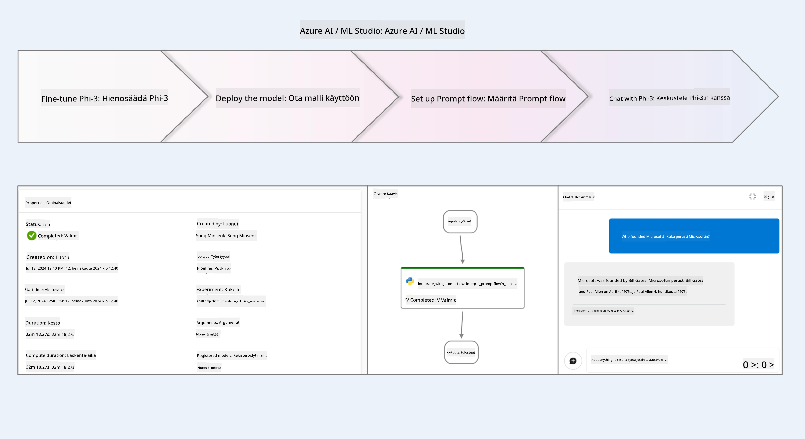

### Sisällysluettelo

1. **[Skenaario 1: Azure-resurssien perustaminen ja valmistautuminen hienosäätöön](../../../../../../md/02.Application/01.TextAndChat/Phi3)**
    - [Luo Azure Machine Learning -työtila](../../../../../../md/02.Application/01.TextAndChat/Phi3)
    - [Pyydä GPU-rajoja Azure-tilauksessa](../../../../../../md/02.Application/01.TextAndChat/Phi3)
    - [Lisää roolimääritys](../../../../../../md/02.Application/01.TextAndChat/Phi3)
    - [Perusta projekti](../../../../../../md/02.Application/01.TextAndChat/Phi3)
    - [Valmistele datasetti hienosäätöä varten](../../../../../../md/02.Application/01.TextAndChat/Phi3)

1. **[Skenaario 2: Phi-3-mallin hienosäätö ja käyttöönotto Azure Machine Learning Studiossa](../../../../../../md/02.Application/01.TextAndChat/Phi3)**
    - [Hienosäädä Phi-3-malli](../../../../../../md/02.Application/01.TextAndChat/Phi3)
    - [Ota käyttöön hienosäädetty Phi-3-malli](../../../../../../md/02.Application/01.TextAndChat/Phi3)

1. **[Skenaario 3: Integroi Prompt flow’n kanssa ja keskustele mukautetulla mallillasi Azure AI Foundryssa](../../../../../../md/02.Application/01.TextAndChat/Phi3)**
    - [Integroi mukautettu Phi-3-malli Prompt flow’n kanssa](../../../../../../md/02.Application/01.TextAndChat/Phi3)
    - [Keskustele mukautetun Phi-3-mallisi kanssa](../../../../../../md/02.Application/01.TextAndChat/Phi3)

## Skenaario 1: Azure-resurssien perustaminen ja valmistautuminen hienosäätöön

### Luo Azure Machine Learning -työtila

1. Kirjoita *azure machine learning* portaalin sivun yläosan **hakupalkkiin** ja valitse vaihtoehdoista **Azure Machine Learning**.

    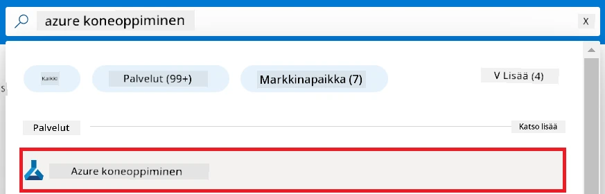

2. Valitse navigointivalikosta **+ Luo**.

3. Valitse navigointivalikosta **Uusi työtila**.

    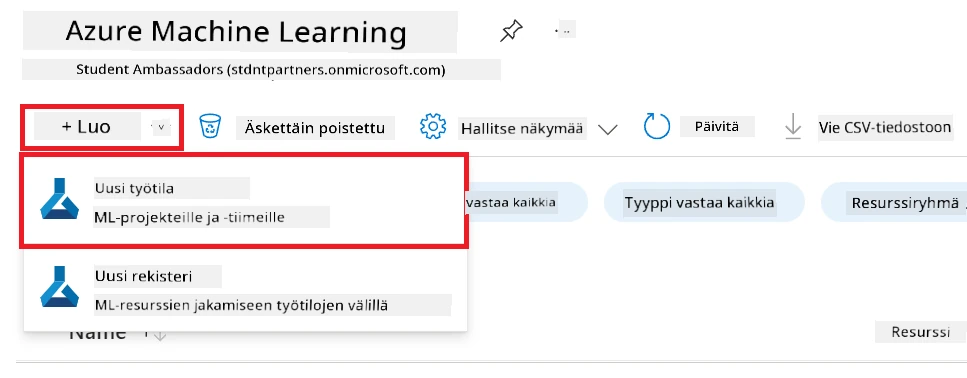

4. Suorita seuraavat tehtävät:

    - Valitse Azure-**tilauksesi**.
    - Valitse käytettävä **Resurssiryhmä** (luo uusi tarvittaessa).
    - Kirjoita **Työtilan nimi**. Sen on oltava ainutlaatuinen arvo.
    - Valitse haluamasi **alue**.
    - Valitse käytettävä **tallennustili** (luo uusi tarvittaessa).
    - Valitse käytettävä **avaintalli** (luo uusi tarvittaessa).
    - Valitse käytettävä **sovellusinsights** (luo uusi tarvittaessa).
    - Valitse käytettävä **säiliörekisteri** (luo uusi tarvittaessa).

    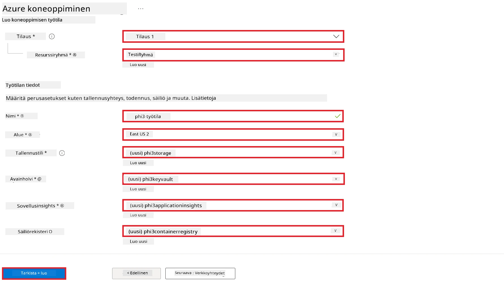

5. Valitse **Tarkista + Luo**.

6. Valitse **Luo**.

### Pyydä GPU-rajoja Azure-tilauksessa

Tässä oppaassa opit hienosäätämään ja ottamaan käyttöön Phi-3-mallin käyttäen GPU:ita. Hienosäätöön käytät *Standard_NC24ads_A100_v4* -GPU:ta, mikä vaatii varauspyynnön. Käyttöönottoon käytät *Standard_NC6s_v3* -GPU:ta, joka myös edellyttää varausta.

> [!NOTE]
>
> Vain Pay-As-You-Go -tilaukset (standardi tilausmuoto) voivat saada GPU-varauksia; edutilaustyypit eivät ole tällä hetkellä tuettuja.
>

1. Siirry osoitteeseen [Azure ML Studio](https://ml.azure.com/home?wt.mc_id=studentamb_279723).

1. Suorita seuraavat tehtävät pyytääksesi *Standard NCADSA100v4 Family* -rajoitetta:

    - Valitse vasemmasta välilehdestä **Quota** (Kiintiö).
    - Valitse käytettävä **Virtuaalikoneperhe**. Esimerkiksi **Standard NCADSA100v4 Family Cluster Dedicated vCPUs**, joka sisältää *Standard_NC24ads_A100_v4* GPU:n.
    - Valitse navigointivalikosta **Request quota** (Pyydä kiintiötä).

        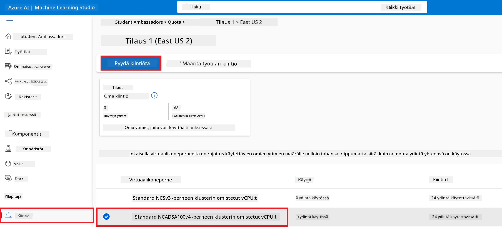

    - Pyynnön sivulla kirjoita haluamasi uusi **ydinraja** (esim. 24).
    - Valitse **Lähetä** pyytääksesi GPU-kiintiötä.

1. Suorita seuraavat tehtävät pyytääksesi *Standard NCSv3 Family* -rajoitetta:

    - Valitse vasemman reunan välilehdestä **Quota**.
    - Valitse käytettävä **Virtuaalikoneperhe**. Esimerkiksi **Standard NCSv3 Family Cluster Dedicated vCPUs**, joka sisältää *Standard_NC6s_v3* GPU:n.
    - Valitse **Request quota**.
    - Pyynnön sivulla kirjoita haluamasi uusi **ydinraja**, esimerkiksi 24.
    - Valitse **Lähetä** pyytääksesi GPU-kiintiötä.

### Lisää roolimääritys

Hienosäätääksesi ja ottaaksesi mallit käyttöön sinun täytyy ensin luoda käyttäjän määrittämä hallittu identiteetti (User Assigned Managed Identity, UAI) ja antaa sille asianmukaiset oikeudet. Tätä UAI:ta käytetään todennuksessa käyttöönoton aikana.

#### Luo käyttäjän määrittämä hallittu identiteetti (UAI)

1. Kirjoita *managed identities* portaalin sivun yläosan **hakupalkkiin** ja valitse avautuvista vaihtoehdoista **Managed Identities**.

    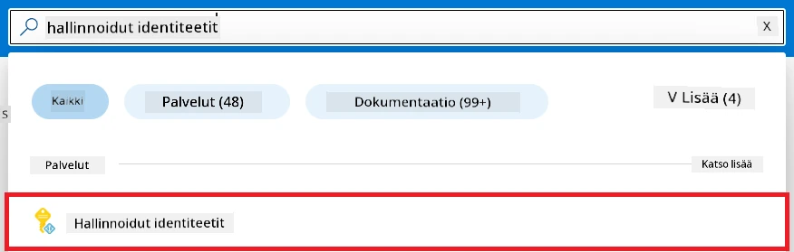

1. Valitse **+ Luo**.

    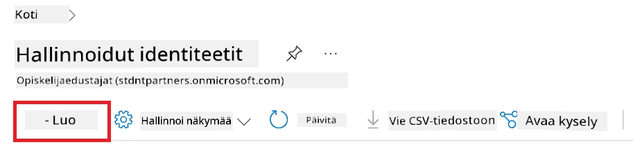

1. Suorita seuraavat tehtävät:

    - Valitse Azure-**tilauksesi**.
    - Valitse käytettävä **resurssiryhmä** (luo uusi tarvittaessa).
    - Valitse haluamasi **alue**.
    - Kirjoita **nimi**. Sen täytyy olla ainutlaatuinen.

    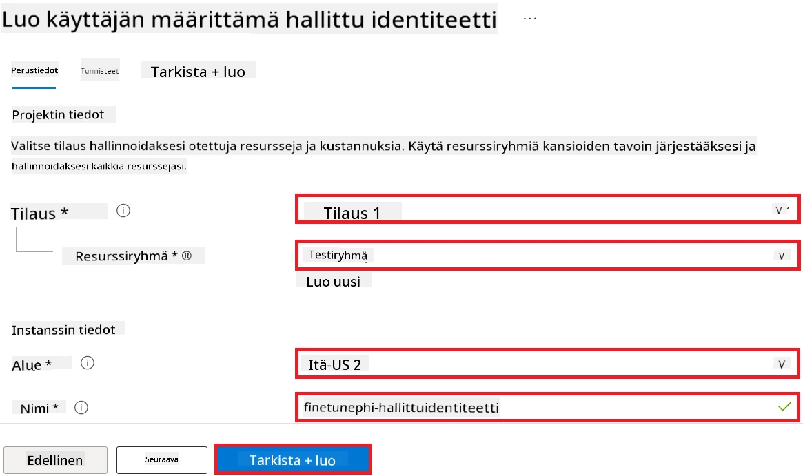

1. Valitse **Tarkista + Luo**.

1. Valitse **+ Luo**.

#### Lisää Contributor-roolimääritys hallitulle identiteetille

1. Siirry luomaasi Managed Identity -resurssiin.

1. Valitse vasemman reunan välilehdestä **Azure-roolimääritykset**.

1. Valitse navigointipalkista **+ Lisää roolimääritys**.

1. Lisää roolimäärityssivulla seuraavat tiedot:
    - Valitse **Laajuus** arvoksi **Resurssiryhmä**.
    - Valitse Azure-tilauksesi.
    - Valitse käytettävä resurssiryhmä.
    - Valitse rooliksi **Contributor**.

    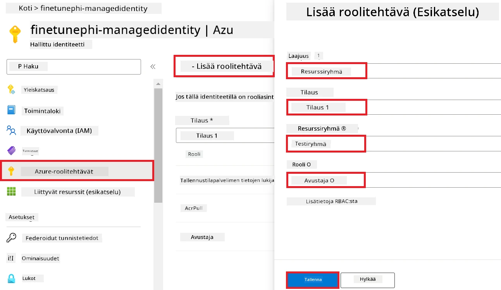

2. Valitse **Tallenna**.

#### Lisää Storage Blob Data Reader -roolimääritys hallitulle identiteetille

1. Kirjoita *storage accounts* portaalin hakupalkkiin ja valitse avautuvista vaihtoehdoista **Storage accounts**.

    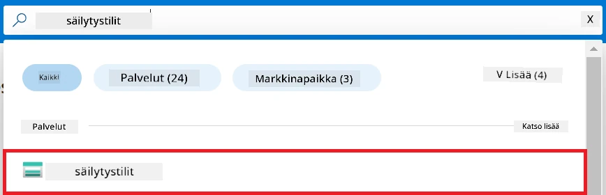

1. Valitse tallennustili, joka liittyy Azure Machine Learning -työtilaasi, esimerkiksi *finetunephistorage*.

1. Suorita seuraavat tehtävät siirtyäksesi Roolimäärityksen lisäyssivulle:

    - Siirry Azure Storage -tilillesi.
    - Valitse vasemman reunan välilehdestä **Access Control (IAM)**.
    - Valitse navigointivalikosta **+ Lisää**.
    - Valitse **Lisää roolimääritys**.

    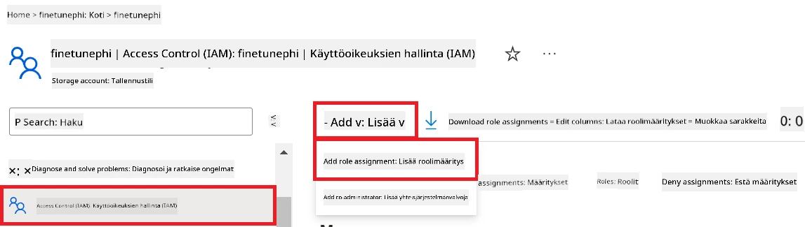

1. Lisää roolimäärityssivulla seuraavat tiedot:

    - Kirjoita **Storage Blob Data Reader** roolin hakukenttään ja valitse se avautuvista vaihtoehdoista.
    - Valitse **Seuraava**.
    - Jäsen-sivulla valitse **Määritä käyttö** arvoksi **Managed identity**.
    - Valitse **+ Valitse jäsenet**.
    - Valitse Azure-tilauksesi.
    - Valitse hallittu identiteetti arvoksi **Manage Identity**.
    - Valitse luomasi Managed Identity, esimerkiksi *finetunephi-managedidentity*.
    - Valitse **Valitse**.

    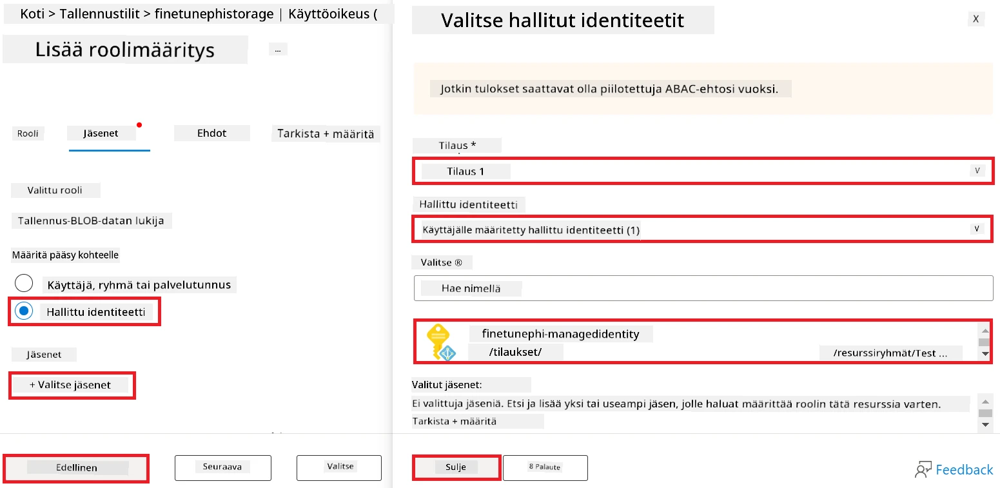

1. Valitse **Tarkista + määritä**.

#### Lisää AcrPull-roolimääritys hallitulle identiteetille

1. Kirjoita *container registries* portaalin hakupalkkiin ja valitse avautuvista vaihtoehdoista **Container registries**.

    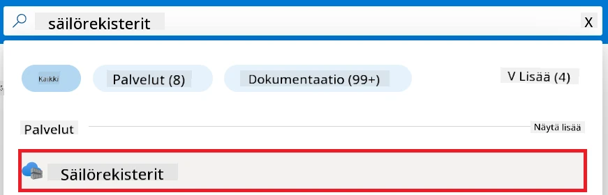

1. Valitse säiliörekisteri, joka liittyy Azure Machine Learning -työtilaasi, esimerkiksi *finetunephicontainerregistry*.

1. Suorita seuraavat tehtävät siirtyäksesi Roolimäärityksen lisäyssivulle:

    - Valitse vasemman reunan välilehdestä **Access Control (IAM)**.
    - Valitse navigointivalikosta **+ Lisää**.
    - Valitse **Lisää roolimääritys**.

1. Lisää roolimäärityssivulla seuraavat tiedot:

    - Kirjoita *AcrPull* roolin hakukenttään ja valitse se avautuvista vaihtoehdoista.
    - Valitse **Seuraava**.
    - Jäsen-sivulla valitse **Määritä käyttö** arvoksi **Managed identity**.
    - Valitse **+ Valitse jäsenet**.
    - Valitse Azure-tilauksesi.
    - Valitse hallittu identiteetti arvoksi **Manage Identity**.
    - Valitse luomasi Managed Identity, esimerkiksi *finetunephi-managedidentity*.
    - Valitse **Valitse**.
    - Valitse **Tarkista + määritä**.

### Perusta projekti

Lataaaksesi hienosäätöä varten tarvittavat aineistot, luot paikallisen ympäristön.

Tässä harjoituksessa:

- Luo kansio, jossa työskentelet.
- Luo virtuaaliympäristö.
- Asenna tarvittavat paketit.
- Luo tiedosto *download_dataset.py* aineiston lataamista varten.

#### Luo kansio työtä varten

1. Avaa terminaali ja kirjoita seuraava komento luodaksesi kansion nimeltä *finetune-phi* oletuspolkuun.

    ```console
    mkdir finetune-phi
    ```

2. Kirjoita seuraava komento terminaaliisi siirtyäksesi luomaasi *finetune-phi*-kansioon.

    ```console
    cd finetune-phi
    ```

#### Luo virtuaaliympäristö

1. Kirjoita seuraava komento terminaaliisi luodaksesi virtuaaliympäristön nimeltä *.venv*.

    ```console
    python -m venv .venv
    ```

2. Kirjoita seuraava komento terminaaliisi aktivoidaksesi virtuaaliympäristön.

    ```console
    .venv\Scripts\activate.bat
    ```

> [!NOTE]
> Jos se onnistui, sinun pitäisi nähdä *(.venv)* ennen komentokehotetta.

#### Asenna vaaditut paketit

1. Kirjoita seuraavat komennot terminaaliisi asentaaksesi vaaditut paketit.

    ```console
    pip install datasets==2.19.1
    ```

#### Luo `donload_dataset.py`

> [!NOTE]
> Koko kansiorakenne:
>
> ```text
> └── YourUserName
> .    └── finetune-phi
> .        └── download_dataset.py
> ```

1. Avaa **Visual Studio Code**.

1. Valitse valikkopalkista **File**.

1. Valitse **Open Folder**.

1. Valitse luomasi *finetune-phi*-kansio, joka sijaitsee polussa *C:\Users\yourUserName\finetune-phi*.

    

1. Visual Studio Coden vasemmassa paneelissa napsauta hiiren oikealla ja valitse **New File** luodaksesi uuden tiedoston nimeltä *download_dataset.py*.

    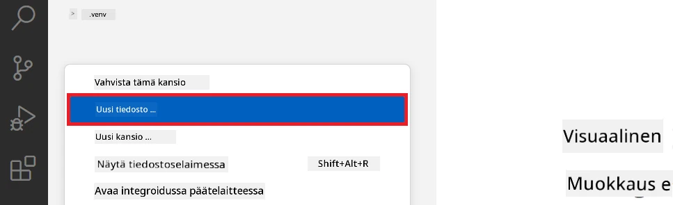

### Valmistele datasarja hienosäätöä varten

Tässä tehtävässä suoritat *download_dataset.py*-tiedoston ladataksesi *ultrachat_200k* -datasarjat paikalliseen ympäristöösi. Käytät näitä datasarjoja hienosäätääksesi Phi-3-mallia Azure Machine Learningissä.

Tässä tehtävässä:

- Lisää koodi *download_dataset.py*-tiedostoon datasarjojen lataamista varten.
- Suorita *download_dataset.py* ladataksesi datasarjat paikalliseen ympäristöösi.

#### Lataa datasarja käyttämällä *download_dataset.py*-tiedostoa

1. Avaa *download_dataset.py*-tiedosto Visual Studio Codessa.

1. Lisää seuraava koodi *download_dataset.py* -tiedostoon.

    ```python
    import json
    import os
    from datasets import load_dataset

    def load_and_split_dataset(dataset_name, config_name, split_ratio):
        """
        Load and split a dataset.
        """
        # Lataa tietojoukko määritetyllä nimellä, kokoonpanolla ja jakosuhteella
        dataset = load_dataset(dataset_name, config_name, split=split_ratio)
        print(f"Original dataset size: {len(dataset)}")
        
        # Jaa tietojoukko koulutus- ja testijoukkoihin (80 % koulutus, 20 % testaus)
        split_dataset = dataset.train_test_split(test_size=0.2)
        print(f"Train dataset size: {len(split_dataset['train'])}")
        print(f"Test dataset size: {len(split_dataset['test'])}")
        
        return split_dataset

    def save_dataset_to_jsonl(dataset, filepath):
        """
        Save a dataset to a JSONL file.
        """
        # Luo hakemisto, jos se ei ole olemassa
        os.makedirs(os.path.dirname(filepath), exist_ok=True)
        
        # Avaa tiedosto kirjoitustilassa
        with open(filepath, 'w', encoding='utf-8') as f:
            # Käy läpi jokainen tietue tietojoukossa
            for record in dataset:
                # Vie tietue JSON-objektina ja kirjoita se tiedostoon
                json.dump(record, f)
                # Kirjoita rivinvaihtomerkki erottamaan tietueet
                f.write('\n')
        
        print(f"Dataset saved to {filepath}")

    def main():
        """
        Main function to load, split, and save the dataset.
        """
        # Lataa ja jaa ULTRACHAT_200k-tietojoukko tietyllä kokoonpanolla ja jakosuhteella
        dataset = load_and_split_dataset("HuggingFaceH4/ultrachat_200k", 'default', 'train_sft[:1%]')
        
        # Ota koulutus- ja testitietojoukot jaosta
        train_dataset = dataset['train']
        test_dataset = dataset['test']

        # Tallenna koulutustietojoukko JSONL-tiedostoon
        save_dataset_to_jsonl(train_dataset, "data/train_data.jsonl")
        
        # Tallenna testitietojoukko erilliseen JSONL-tiedostoon
        save_dataset_to_jsonl(test_dataset, "data/test_data.jsonl")

    if __name__ == "__main__":
        main()

    ```

1. Kirjoita seuraava komento terminaaliisi suorittaaksesi skriptin ja ladataksesi datasarjan paikalliseen ympäristöösi.

    ```console
    python download_dataset.py
    ```

1. Varmista, että datasarjat tallennettiin onnistuneesti paikalliseen *finetune-phi/data* -hakemistoon.

> [!NOTE]
>
> #### Huomautus datasarjan koosta ja hienosäätöajasta
>
> Tässä ohjeessa käytät vain 1 % datasarjasta (`split='train[:1%]'`). Tämä vähentää merkittävästi datamäärää, nopeuttaen sekä lataus- että hienosäätöprosesseja. Voit säätää prosenttiosuutta löytääksesi oikean tasapainon koulutuksen ajan ja mallin suorituskyvyn välillä. Pienemmän datasarjan osa-alueen käyttö vähentää hienosäätöön tarvittavaa aikaa, mikä tekee prosessista helpommin hallittavan tutoriaalissa.

## Tilanne 2: Hienosäädä Phi-3-malli ja ota käyttöön Azure Machine Learning Studiossa

### Hienosäädä Phi-3-malli

Tässä tehtävässä hienosäädät Phi-3-mallia Azure Machine Learning Studiossa.

Tässä tehtävässä:

- Luo tietokonelaskentaklusteri hienosäätöä varten.
- Hienosäädä Phi-3-malli Azure Machine Learning Studiossa.

#### Luo tietokonelaskentaklusteri hienosäätöä varten

1. Siirry osoitteeseen [Azure ML Studio](https://ml.azure.com/home?wt.mc_id=studentamb_279723).

1. Valitse vasemman reunan välilehdeltä **Compute**.

1. Valitse navigointivalikosta **Compute clusters**.

1. Valitse **+ New**.

    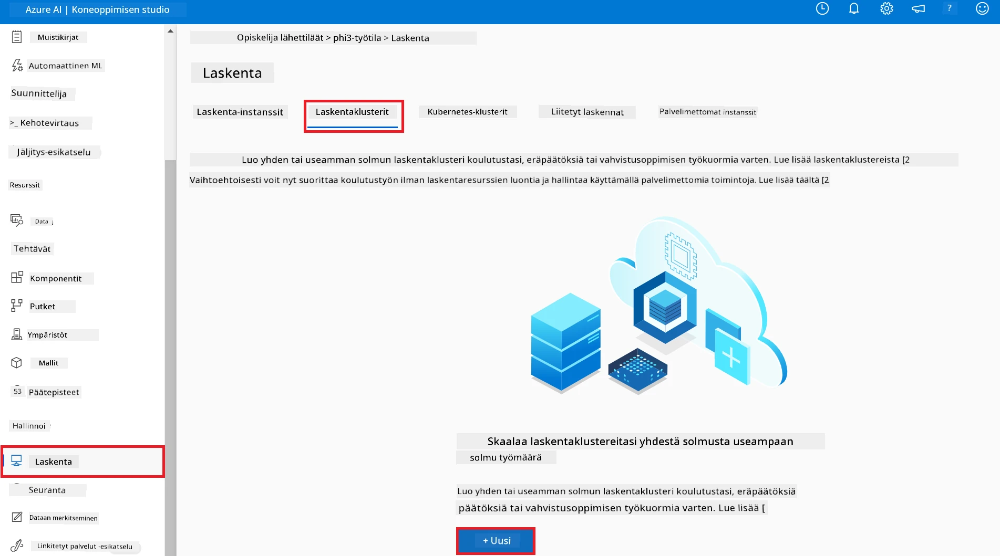

1. Suorita seuraavat tehtävät:

    - Valitse haluamasi **Region**.
    - Valitse **Virtual machine tier**ksi **Dedicated**.
    - Valitse **Virtual machine type**ksi **GPU**.
    - Valitse **Virtual machine size** -suodattimeksi **Select from all options**.
    - Valitse **Virtual machine size**ksi **Standard_NC24ads_A100_v4**.

    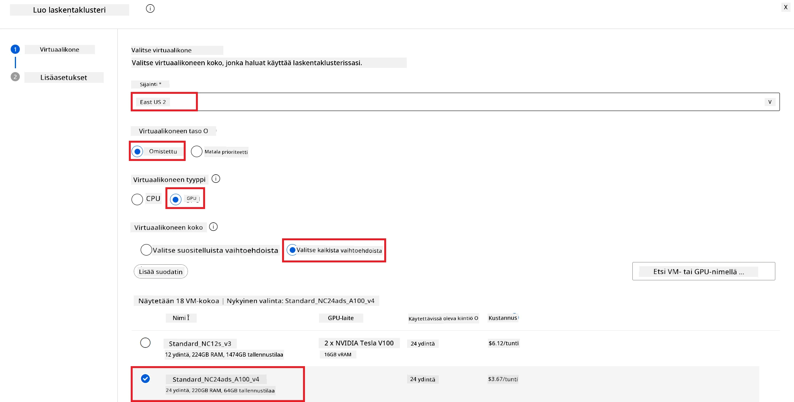

1. Valitse **Next**.

1. Suorita seuraavat tehtävät:

    - Anna **Compute name**. Sen on oltava yksilöllinen arvo.
    - Valitse **Minimum number of nodes**ksi **0**.
    - Valitse **Maximum number of nodes**ksi **1**.
    - Valitse **Idle seconds before scale down**ksi **120**.

    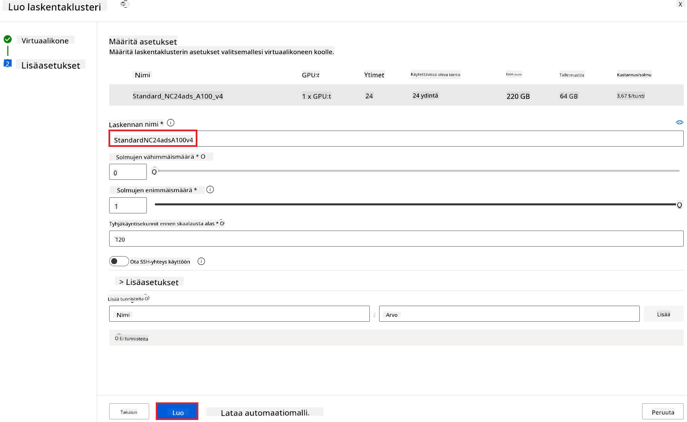

1. Valitse **Create**.

#### Hienosäädä Phi-3-malli

1. Siirry osoitteeseen [Azure ML Studio](https://ml.azure.com/home?wt.mc_id=studentamb_279723).

1. Valitse luomasi Azure Machine Learning -työtila.

    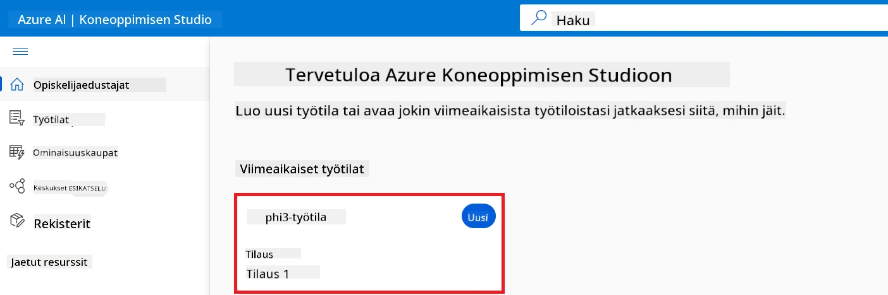

1. Suorita seuraavat tehtävät:

    - Valitse vasemman reunan välilehdeltä **Model catalog**.
    - Kirjoita **hakupalkkiin** *phi-3-mini-4k* ja valitse ilmestyvistä vaihtoehdoista **Phi-3-mini-4k-instruct**.

    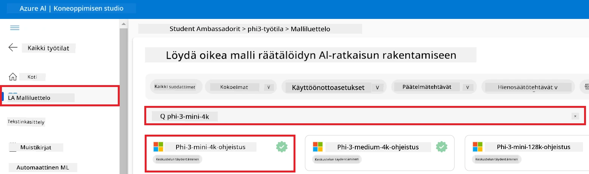

1. Valitse navigointivalikosta **Fine-tune**.

    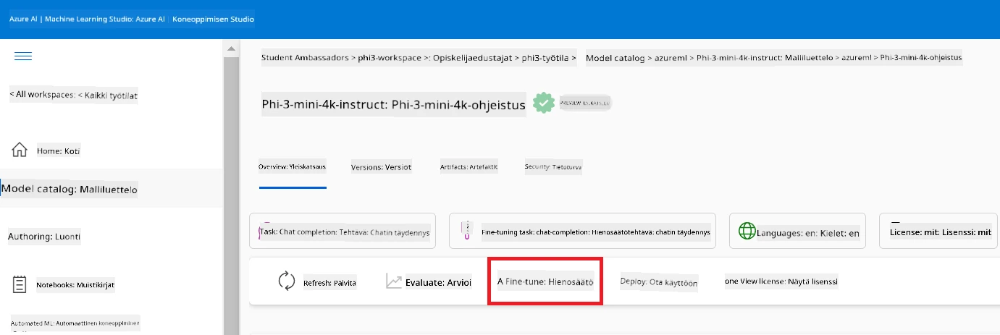

1. Suorita seuraavat tehtävät:

    - Valitse **Select task type**ksi **Chat completion**.
    - Valitse **+ Select data** ladataksesi **Traning data**.
    - Valitse Validointidatan lataustavaksi **Provide different validation data**.
    - Valitse **+ Select data** ladataksesi **Validation data**.

    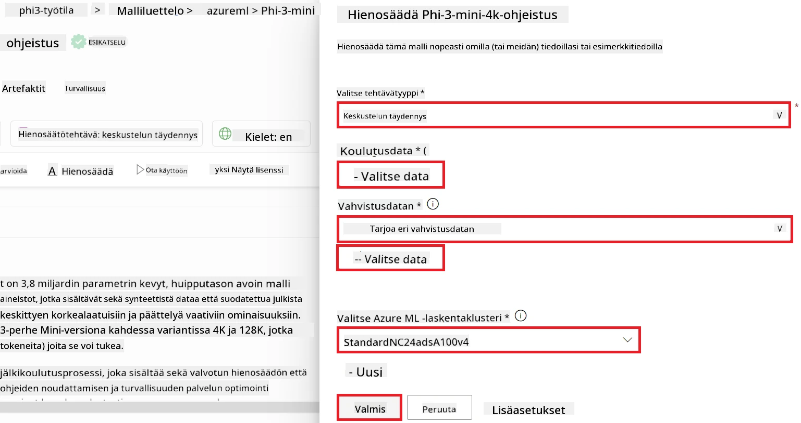

> [!TIP]
>
> Voit valita **Advanced settings** mukauttaaksesi asetuksia, kuten **learning_rate** ja **lr_scheduler_type**, optimoidaksesi hienosäätöprosessin tarpeidesi mukaan.

1. Valitse **Finish**.

1. Tässä tehtävässä hienosäädit Phi-3-mallin onnistuneesti Azure Machine Learningillä. Huomaa, että hienosäätöprosessi voi kestää huomattavan kauan. Hienosäätötyön suorittamisen jälkeen sinun tulee odottaa sen valmistumista. Voit seurata hienosäätötyön tilaa siirtymällä Azure Machine Learning -työtilasi vasemman reunan valikon Jobs-välilehdelle. Seuraavassa osassa otat käyttöön hienosäädetyn mallin ja integroit sen Prompt flow'hun.

    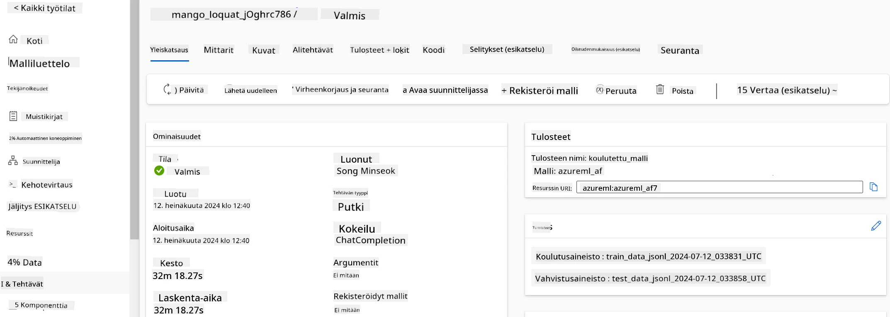

### Ota käyttöön hienosäädetty Phi-3-malli

Jotta voit integroida hienosäätömallin Prompt flow’hun, sinun on otettava malli käyttöön, jotta se on saatavilla reaaliaikaista päättelyä varten. Tämä prosessi sisältää mallin rekisteröinnin, online-päätepisteen luomisen ja mallin käyttöönoton.

Tässä tehtävässä:

- Rekisteröi hienosäädetty malli Azure Machine Learning -työtilaan.
- Luo online-päätepiste.
- Ota käyttöön rekisteröity hienosäädetty Phi-3-malli.

#### Rekisteröi hienosäädetty malli

1. Siirry osoitteeseen [Azure ML Studio](https://ml.azure.com/home?wt.mc_id=studentamb_279723).

1. Valitse luomasi Azure Machine Learning -työtila.

    

1. Valitse vasemman reunan välilehdeltä **Models**.
1. Valitse **+ Register**.
1. Valitse **From a job output**.

    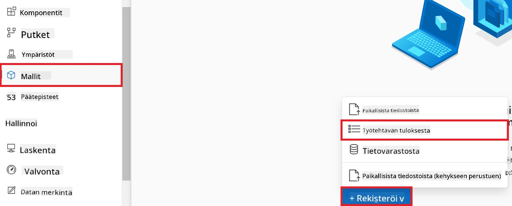

1. Valitse luomasi työtehtävä.

    

1. Valitse **Next**.

1. Valitse **Model type**ksi **MLflow**.

1. Varmista, että **Job output** on valittuna; sen pitäisi olla automaattisesti valittu.

    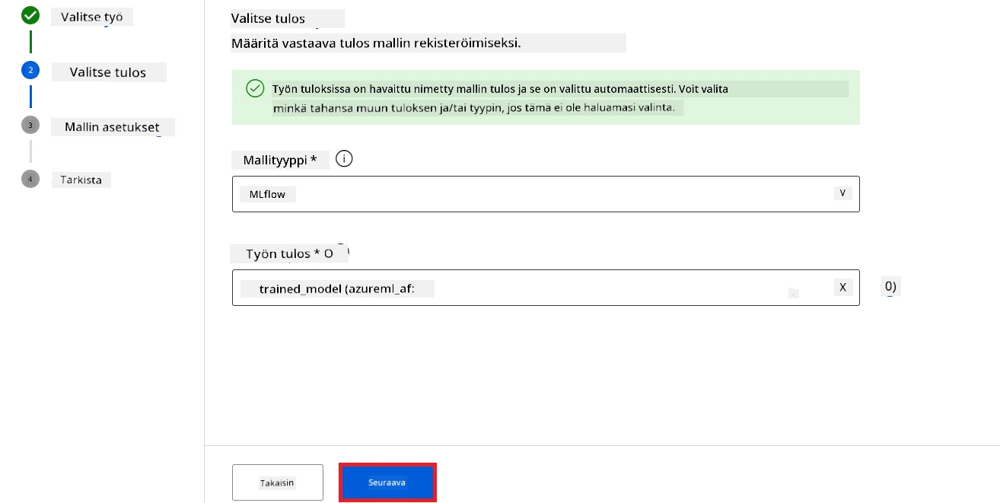

2. Valitse **Next**.

3. Valitse **Register**.

    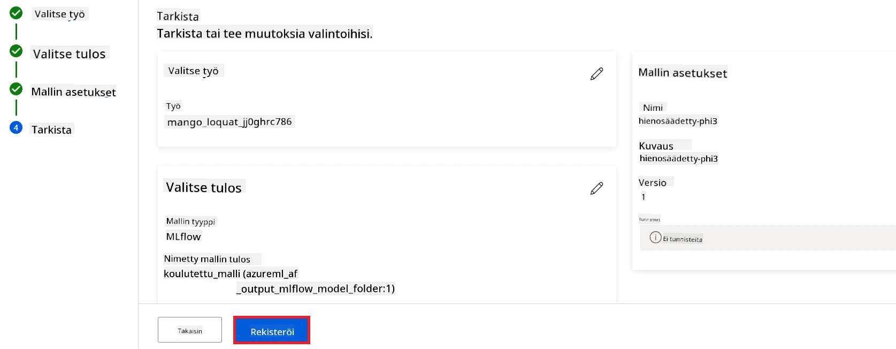

4. Näet rekisteröidyn mallisi siirtymällä vasemman reunan välilehdellä olevaan **Models**-valikkoon.

    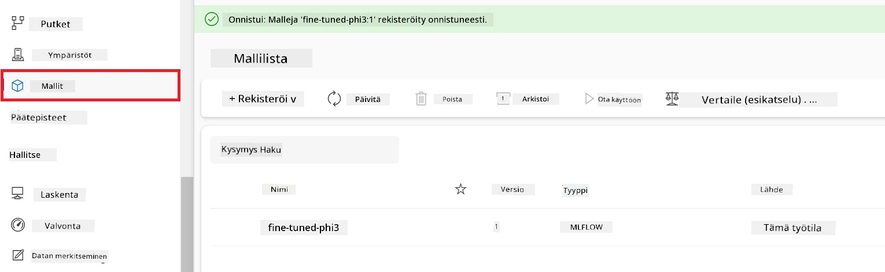

#### Ota hienosäädetty malli käyttöön

1. Siirry luomallesi Azure Machine Learning -työtilalle.

1. Valitse vasemman reunan välilehdeltä **Endpoints**.

1. Valitse navigointivalikosta **Real-time endpoints**.

    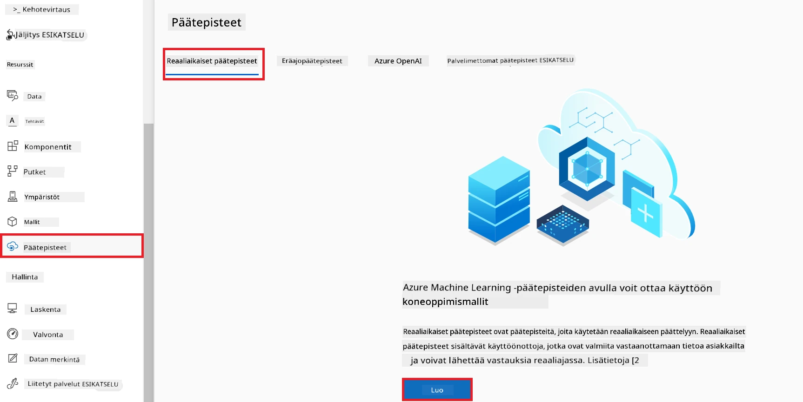

1. Valitse **Create**.

1. Valitse luomasi rekisteröity malli.

    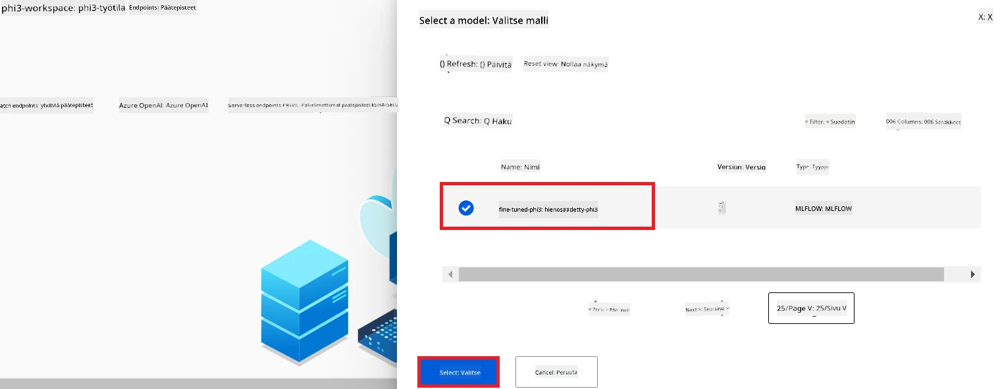

1. Valitse **Select**.

1. Suorita seuraavat tehtävät:

    - Valitse **Virtual machine**ksi *Standard_NC6s_v3*.
    - Valitse haluamasi **Instance count**, esim. *1*.
    - Valitse **Endpoint**ksi **New** luodaksesi uuden päätepisteen.
    - Anna **Endpoint name**. Sen on oltava yksilöllinen arvo.
    - Anna **Deployment name**. Sen on oltava yksilöllinen arvo.

    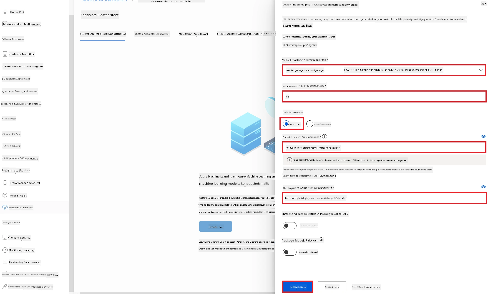

1. Valitse **Deploy**.

> [!WARNING]
> Välttääksesi lisälaskutuksia tilillesi, muista poistaa luotu päätepiste Azure Machine Learning -työtilasta.
>

#### Tarkista käyttöönoton tila Azure Machine Learning -työtilassa

1. Siirry luomaasi Azure Machine Learning -työtilaan.

1. Valitse vasemman reunan välilehdeltä **Endpoints**.

1. Valitse luomasi päätepiste.

    

1. Tällä sivulla voit hallita päätepisteitä käyttöönoton aikana.

> [!NOTE]
> Kun käyttöönotto on valmis, varmista, että **Live traffic** on asetettu arvoon **100%**. Jos ei ole, valitse **Update traffic** säätääksesi liikenneasetuksia. Huomaa, että mallia ei voi testata, jos liikenne on asetettu arvoon 0 %.
>
> 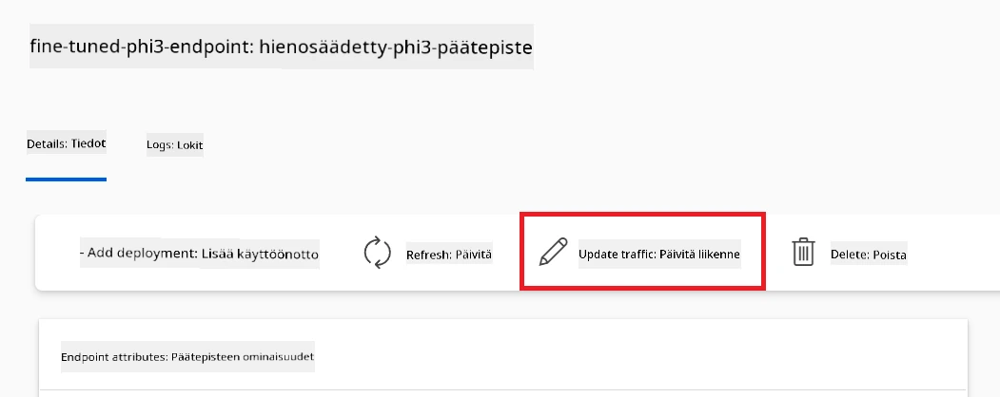
>

## Tilanne 3: Integroi Prompt flow’hun ja keskustele mukautetulla mallillasi Azure AI Foundryssa

### Integroi mukautettu Phi-3-malli Prompt flow’hun

Kun hienosäädetty malli on otettu onnistuneesti käyttöön, voit nyt integroida sen Prompt Flow’hun ja käyttää sitä reaaliaikaisissa sovelluksissa, mahdollistaen erilaiset interaktiiviset tehtävät mukautetulla Phi-3-mallillasi.

Tässä tehtävässä:

- Luo Azure AI Foundry Hub.
- Luo Azure AI Foundry Project.
- Luo Prompt flow.
- Lisää mukautettu yhteys hienosäädetylle Phi-3-mallille.
- Määritä Prompt flow keskustelua varten mukautetun Phi-3-mallisi kanssa.

> [!NOTE]
> Voit myös integroida Promptflow’hun käyttämällä Azure ML Studiota. Sama integrointiprosessi pätee Azure ML Studioon.

#### Luo Azure AI Foundry Hub

Hub on luotava ennen Projektin luomista. Hub toimii kuin resurssiryhmä, jonka avulla voit järjestää ja hallita useita projekteja Azure AI Foundryssa.

1. Siirry osoitteeseen [Azure AI Foundry](https://ai.azure.com/?WT.mc_id=aiml-137032-kinfeylo).

1. Valitse vasemman reunan välilehdeltä **All hubs**.

1. Valitse navigointivalikosta **+ New hub**.
    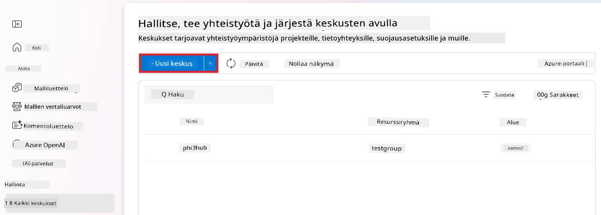

1. Suorita seuraavat tehtävät:

    - Syötä **Keskuksen nimi**. Sen on oltava ainutlaatuinen arvo.
    - Valitse Azure-tilauksesi **Subscription**.
    - Valitse käytettävä **Resource group** (luo uusi tarvittaessa).
    - Valitse haluamasi **Sijainti**.
    - Valitse käytettävä **Connect Azure AI Services** (luo uusi tarvittaessa).
    - Valitse **Connect Azure AI Search** -kohdassa **Ohita yhdistäminen**.

    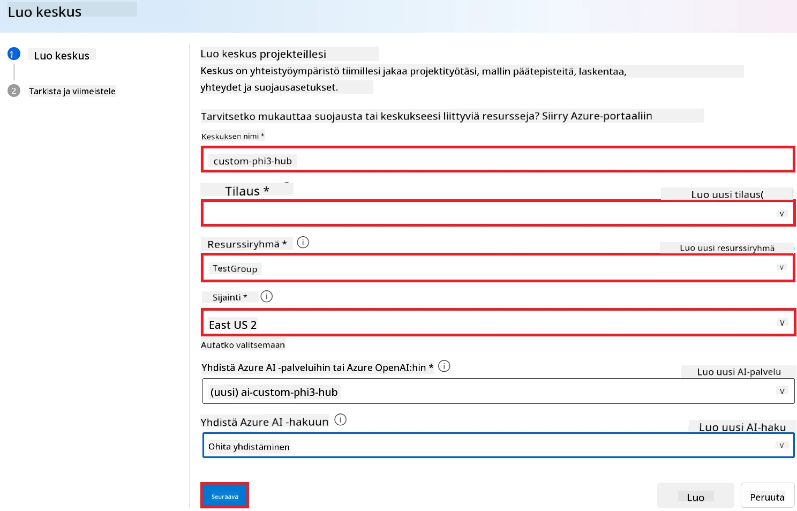

1. Valitse **Seuraava**.

#### Luo Azure AI Foundry -projekti

1. Luomassasi Keskuksessa valitse vasemman reunan välilehdeltä **All projects**.

1. Valitse navigointivalikosta **+ New project**.

    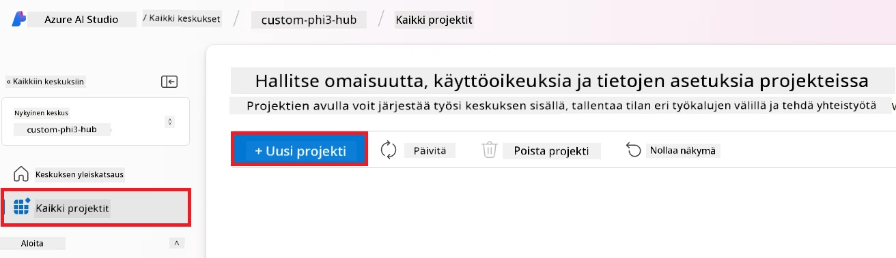

1. Syötä **Projektin nimi**. Sen on oltava ainutlaatuinen arvo.

    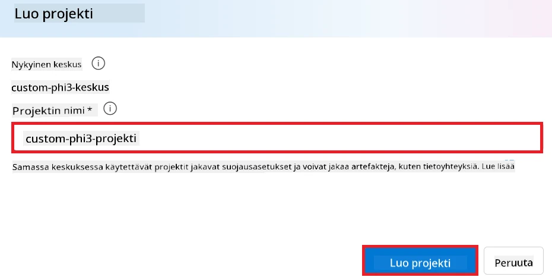

1. Valitse **Create a project**.

#### Lisää mukautettu yhteys hienosäädetylle Phi-3 -mallille

Integroiaksesi oman Phi-3 -mallisi Prompt flow'n kanssa, sinun täytyy tallentaa mallin päätepiste ja avain mukautettuun yhteyteen. Tämä asetus varmistaa, että sinulla on pääsy omaan Phi-3 -malliisi Prompt flow'ssa.

#### Aseta hienosäädetyn Phi-3 -mallin api-avain ja päätepiste-URI

1. Mene osoitteeseen [Azure ML Studio](https://ml.azure.com/home?WT.mc_id=aiml-137032-kinfeylo).

1. Siirry luomaasi Azure Machine Learning -työtilaan.

1. Valitse vasemman reunan välilehdeltä **Endpoints**.

    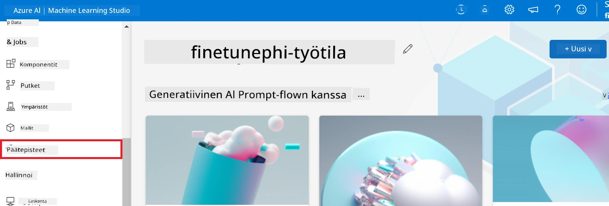

1. Valitse luomasi päätepiste.

    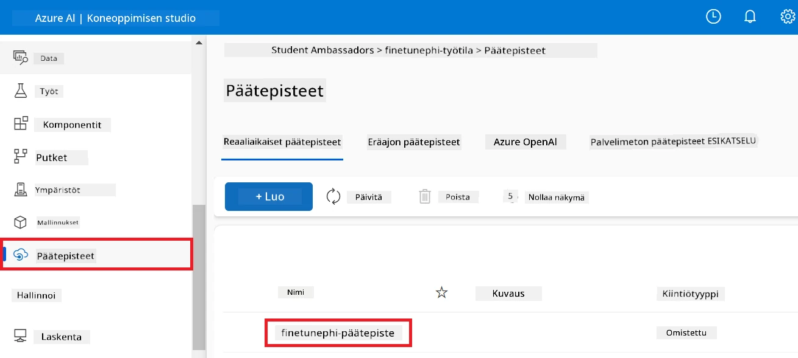

1. Valitse navigointivalikosta **Consume**.

1. Kopioi **REST endpoint** ja **Primary key**.

    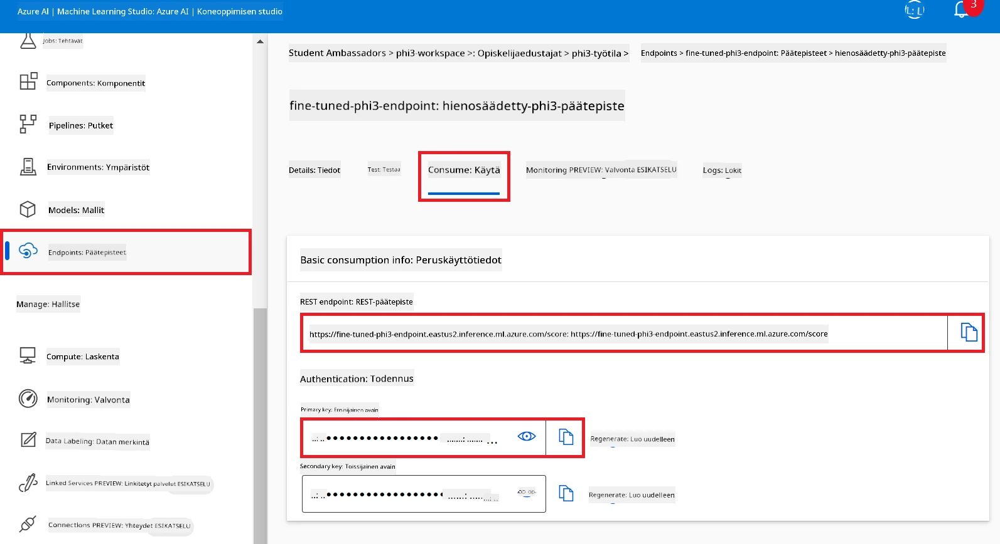

#### Lisää mukautettu yhteys

1. Mene osoitteeseen [Azure AI Foundry](https://ai.azure.com/?WT.mc_id=aiml-137032-kinfeylo).

1. Siirry luomaasi Azure AI Foundry -projektiin.

1. Valitse luomassasi projektissa vasemman reunan välilehdeltä **Settings**.

1. Valitse **+ New connection**.

    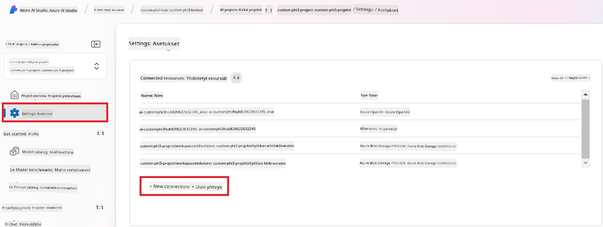

1. Valitse navigointivalikosta **Custom keys**.

    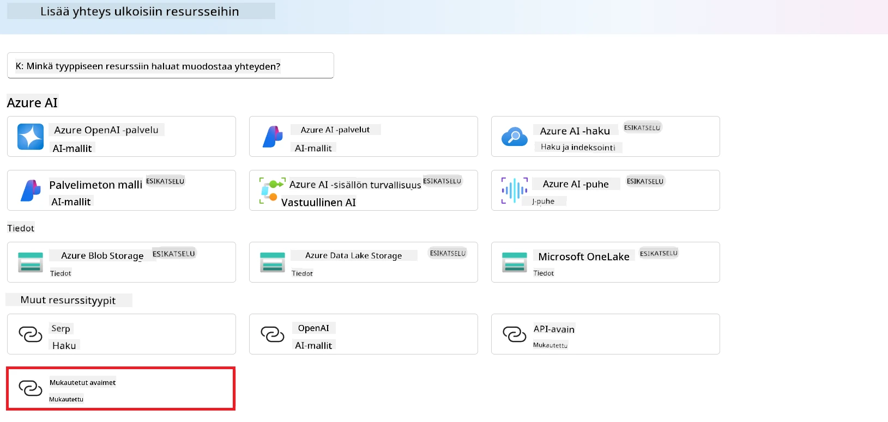

1. Suorita seuraavat tehtävät:

    - Valitse **+ Add key value pairs**.
    - Syötä avaimen nimeksi **endpoint** ja liitä Azure ML Studiosta kopioimasi päätepiste arvokenttään.
    - Valitse uudelleen **+ Add key value pairs**.
    - Syötä avaimen nimeksi **key** ja liitä Azure ML Studiosta kopioimasi avain arvokenttään.
    - Avainparien lisäämisen jälkeen valitse **is secret**, jotta avain ei paljastu.

    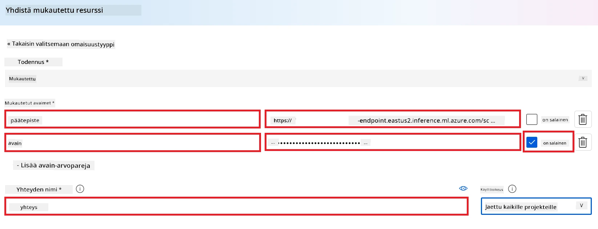

1. Valitse **Add connection**.

#### Luo Prompt flow

Olet lisännyt mukautetun yhteyden Azure AI Foundryssa. Nyt luodaan Prompt flow seuraavien vaiheiden avulla. Sen jälkeen yhdistät tämän Prompt flow'n mukautettuun yhteyteen, jotta voit käyttää hienosäädettyä mallia Prompt flow'ssa.

1. Siirry luomaasi Azure AI Foundry -projektiin.

1. Valitse vasemman reunan välilehdeltä **Prompt flow**.

1. Valitse navigointivalikosta **+ Create**.

    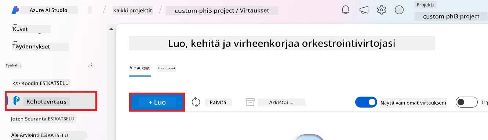

1. Valitse navigointivalikosta **Chat flow**.

    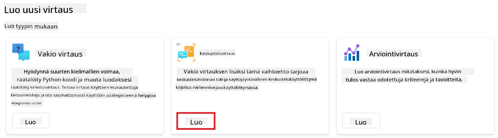

1. Syötä käytettävä **Kansion nimi**.

    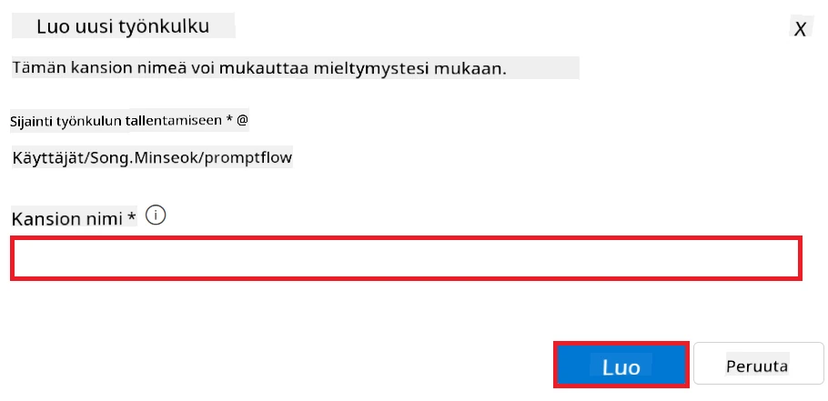

2. Valitse **Luo**.

#### Määritä Prompt flow keskustelemaan mukautetun Phi-3 -mallisi kanssa

Sinun täytyy integroida hienosäädetty Phi-3 -malli Prompt flow'hun. Kuitenkin olemassa oleva Prompt flow ei ole suunniteltu tähän tarkoitukseen. Siksi sinun täytyy uudelleensuunnitella Prompt flow, jotta mukautettu malli voidaan integroida.

1. Prompt flow'ssa suorita seuraavat tehtävät rakentaksesi nykyinen virta uudelleen:

    - Valitse **Raw file mode**.
    - Poista kaikki nykyinen koodi *flow.dag.yml*-tiedostosta.
    - Lisää seuraava koodi *flow.dag.yml*-tiedostoon.

        ```yml
        inputs:
          input_data:
            type: string
            default: "Who founded Microsoft?"

        outputs:
          answer:
            type: string
            reference: ${integrate_with_promptflow.output}

        nodes:
        - name: integrate_with_promptflow
          type: python
          source:
            type: code
            path: integrate_with_promptflow.py
          inputs:
            input_data: ${inputs.input_data}
        ```

    - Valitse **Tallenna**.

    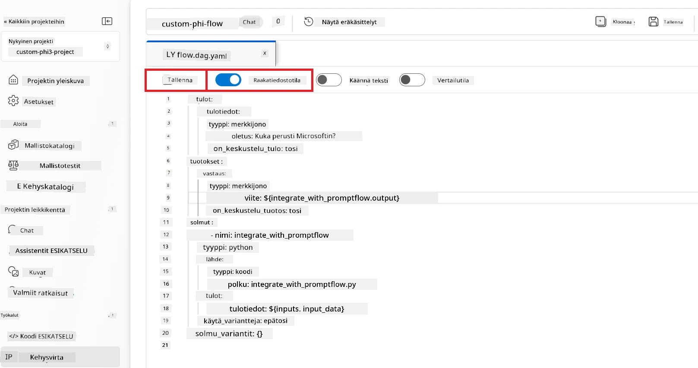

1. Lisää seuraava koodi tiedostoon *integrate_with_promptflow.py* käyttääksesi mukautettua Phi-3 -mallia Prompt flow'ssa.

    ```python
    import logging
    import requests
    from promptflow import tool
    from promptflow.connections import CustomConnection

    # Lokitusasetukset
    logging.basicConfig(
        format="%(asctime)s - %(levelname)s - %(name)s - %(message)s",
        datefmt="%Y-%m-%d %H:%M:%S",
        level=logging.DEBUG
    )
    logger = logging.getLogger(__name__)

    def query_phi3_model(input_data: str, connection: CustomConnection) -> str:
        """
        Send a request to the Phi-3 model endpoint with the given input data using Custom Connection.
        """

        # "connection" on mukautetun yhteyden nimi, "endpoint", "key" ovat avaimet mukautetussa yhteydessä
        endpoint_url = connection.endpoint
        api_key = connection.key

        headers = {
            "Content-Type": "application/json",
            "Authorization": f"Bearer {api_key}"
        }
        data = {
            "input_data": {
                "input_string": [
                    {"role": "user", "content": input_data}
                ],
                "parameters": {
                    "temperature": 0.7,
                    "max_new_tokens": 128
                }
            }
        }
        try:
            response = requests.post(endpoint_url, json=data, headers=headers)
            response.raise_for_status()
            
            # Kirjaa koko JSON-vastaus
            logger.debug(f"Full JSON response: {response.json()}")

            result = response.json()["output"]
            logger.info("Successfully received response from Azure ML Endpoint.")
            return result
        except requests.exceptions.RequestException as e:
            logger.error(f"Error querying Azure ML Endpoint: {e}")
            raise

    @tool
    def my_python_tool(input_data: str, connection: CustomConnection) -> str:
        """
        Tool function to process input data and query the Phi-3 model.
        """
        return query_phi3_model(input_data, connection)

    ```

    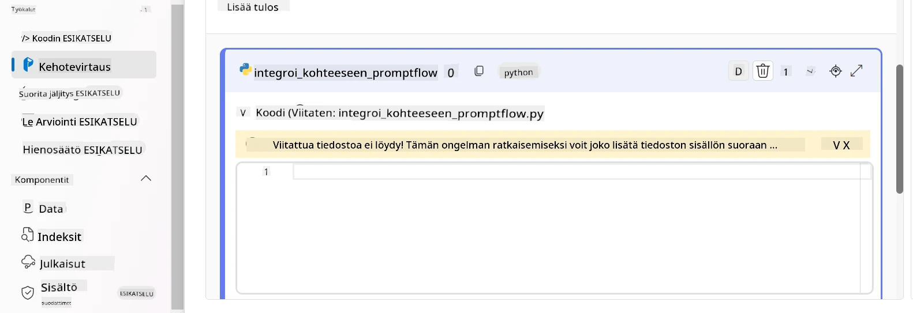

> [!NOTE]
> Lisätietoja Prompt flow'n käytöstä Azure AI Foundryssa on saatavilla osoitteessa [Prompt flow in Azure AI Foundry](https://learn.microsoft.com/azure/ai-studio/how-to/prompt-flow).

1. Valitse **Chat input**, **Chat output** ottaaksesi käyttöön keskustelun mallisi kanssa.

    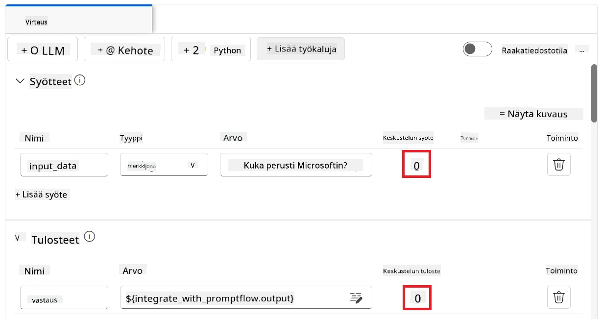

1. Nyt voit keskustella mukautetun Phi-3 -mallisi kanssa. Seuraavassa harjoituksessa opit, miten Prompt flow käynnistetään ja miten sitä käytetään kommunikoimaan hienosäädetyn Phi-3 -mallisi kanssa.

> [!NOTE]
>
> Uudelleen rakennettu virta näyttää alla olevalta kuvalta:
>
> 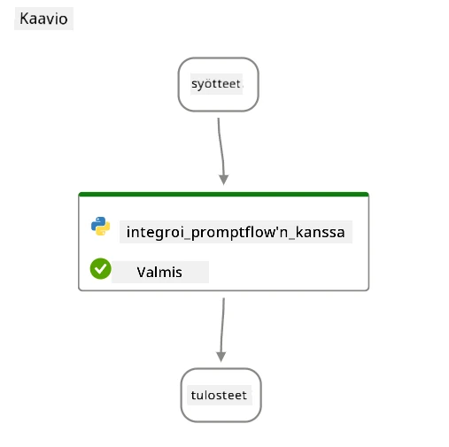
>

### Keskustele mukautetun Phi-3 -mallisi kanssa

Kun olet hienosäätänyt ja integroinut mukautetun Phi-3 -mallisi Prompt flow'hun, olet valmis aloittamaan vuorovaikutuksen sen kanssa. Tämä harjoitus opastaa sinut mallin kanssa keskustelun asetuksissa ja käynnistämisessä Prompt flow'n avulla. Noudattamalla näitä ohjeita voit hyödyntää täysin hienosäädetyn Phi-3 -mallisi mahdollisuuksia monenlaisiin tehtäviin ja keskusteluihin.

- Keskustele mukautetun Phi-3 -mallisi kanssa Prompt flow'n avulla.

#### Käynnistä Prompt flow

1. Valitse **Start compute sessions** aloittaaksesi Prompt flow'n.

    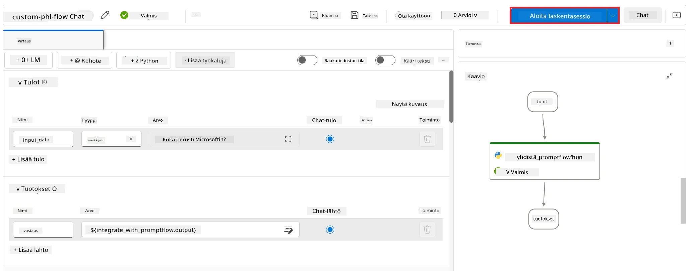

1. Valitse **Validate and parse input** uusien parametrien päivittämiseksi.

    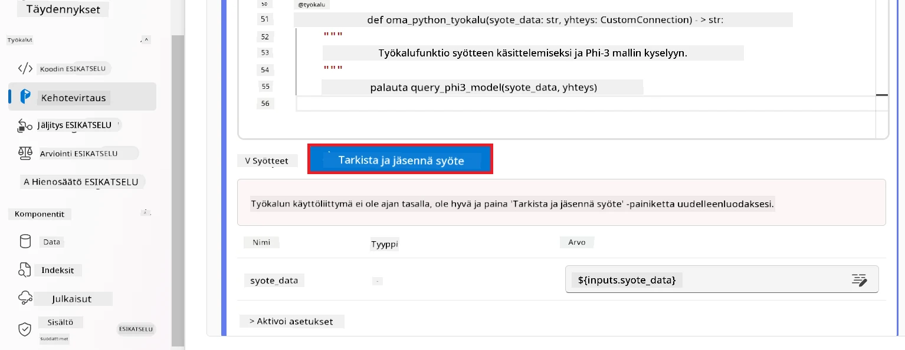

1. Valitse **connection**-arvoksi luomasi mukautettu yhteys, esimerkiksi *connection*.

    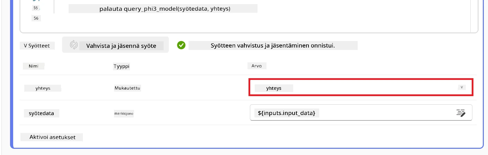

#### Keskustele mukautetun mallisi kanssa

1. Valitse **Chat**.

    

1. Tässä on esimerkki tuloksista: Nyt voit keskustella omalla Phi-3 -mallillasi. On suositeltavaa kysyä kysymyksiä hienosäätöön käytettyihin tietoihin perustuen.

    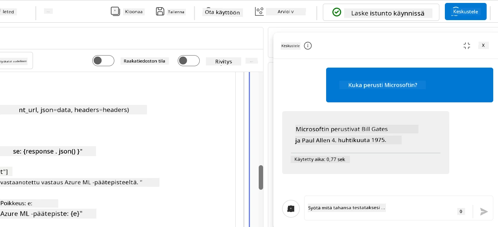

---

<!-- CO-OP TRANSLATOR DISCLAIMER START -->
**Vastuuvapauslauseke**:
Tämä asiakirja on käännetty käyttämällä tekoälypohjaista käännöspalvelua [Co-op Translator](https://github.com/Azure/co-op-translator). Vaikka pyrimme tarkkuuteen, otathan huomioon, että automaattiset käännökset voivat sisältää virheitä tai epätarkkuuksia. Alkuperäistä asiakirjaa sen alkuperäiskielisessä muodossa tulee pitää päätöksentekoon oikeana lähteenä. Tärkeissä asioissa suosittelemme ammattimaista ihmiskäännöstä. Emme ota vastuuta tämän käännöksen käytöstä mahdollisesti aiheutuvista väärinymmärryksistä tai tulkinnoista.
<!-- CO-OP TRANSLATOR DISCLAIMER END -->