<!--
CO_OP_TRANSLATOR_METADATA:
{
  "original_hash": "ecbd9179a21edbaafaf114d47f09f3e3",
  "translation_date": "2025-05-09T18:12:40+00:00",
  "source_file": "md/02.Application/01.TextAndChat/Phi3/E2E_Phi-3-FineTuning_PromptFlow_Integration_AIFoundry.md",
  "language_code": "fi"
}
-->
# Hienosäädä ja integroi mukautetut Phi-3-mallit Prompt flow’n kanssa Azure AI Foundryssa

Tämä kokonaisvaltainen (E2E) esimerkki perustuu Microsoft Tech Communityn oppaaseen "[Fine-Tune and Integrate Custom Phi-3 Models with Prompt Flow in Azure AI Foundry](https://techcommunity.microsoft.com/t5/educator-developer-blog/fine-tune-and-integrate-custom-phi-3-models-with-prompt-flow-in/ba-p/4191726?WT.mc_id=aiml-137032-kinfeylo)". Se esittelee mukautettujen Phi-3-mallien hienosäätö-, käyttöönotto- ja integrointiprosessit Prompt flow’n kanssa Azure AI Foundryssa. Toisin kuin E2E-esimerkki "[Fine-Tune and Integrate Custom Phi-3 Models with Prompt Flow](./E2E_Phi-3-FineTuning_PromptFlow_Integration.md)", jossa koodi ajettiin paikallisesti, tässä opetusohjelmassa keskitytään täysin mallin hienosäätöön ja integrointiin Azure AI / ML Studiossa.

## Yleiskatsaus

Tässä E2E-esimerkissä opit hienosäätämään Phi-3-mallin ja integroimaan sen Prompt flow’n kanssa Azure AI Foundryssa. Hyödyntämällä Azure AI / ML Studiota luot työnkulun mukautettujen tekoälymallien käyttöönottoon ja hyödyntämiseen. Tämä E2E-esimerkki on jaettu kolmeen skenaarioon:

**Skenaario 1: Azure-resurssien perustaminen ja valmistautuminen hienosäätöön**

**Skenaario 2: Phi-3-mallin hienosäätö ja käyttöönotto Azure Machine Learning Studiossa**

**Skenaario 3: Integrointi Prompt flow’n kanssa ja keskustelu mukautetulla mallillasi Azure AI Foundryssa**

Tässä on yleiskatsaus tähän E2E-esimerkkiin.


### Sisällysluettelo

1. **[Skenaario 1: Azure-resurssien perustaminen ja valmistautuminen hienosäätöön](../../../../../../md/02.Application/01.TextAndChat/Phi3)**
    - [Luo Azure Machine Learning -työtila](../../../../../../md/02.Application/01.TextAndChat/Phi3)
    - [Pyydä GPU-kiintiöt Azure-tilauksessa](../../../../../../md/02.Application/01.TextAndChat/Phi3)
    - [Lisää roolimääritys](../../../../../../md/02.Application/01.TextAndChat/Phi3)
    - [Perusta projekti](../../../../../../md/02.Application/01.TextAndChat/Phi3)
    - [Valmistele aineisto hienosäätöä varten](../../../../../../md/02.Application/01.TextAndChat/Phi3)

1. **[Skenaario 2: Phi-3-mallin hienosäätö ja käyttöönotto Azure Machine Learning Studiossa](../../../../../../md/02.Application/01.TextAndChat/Phi3)**
    - [Hienosäädä Phi-3-malli](../../../../../../md/02.Application/01.TextAndChat/Phi3)
    - [Ota hienosäädetty Phi-3-malli käyttöön](../../../../../../md/02.Application/01.TextAndChat/Phi3)

1. **[Skenaario 3: Integroi Prompt flow’n kanssa ja keskustele mukautetulla mallillasi Azure AI Foundryssa](../../../../../../md/02.Application/01.TextAndChat/Phi3)**
    - [Integroi mukautettu Phi-3-malli Prompt flow’n kanssa](../../../../../../md/02.Application/01.TextAndChat/Phi3)
    - [Keskustele mukautetun Phi-3-mallisi kanssa](../../../../../../md/02.Application/01.TextAndChat/Phi3)

## Skenaario 1: Azure-resurssien perustaminen ja valmistautuminen hienosäätöön

### Luo Azure Machine Learning -työtila

1. Kirjoita *azure machine learning* **hakupalkkiin** portaalin sivun yläosassa ja valitse ilmestyvistä vaihtoehdoista **Azure Machine Learning**.

    

2. Valitse navigointivalikosta **+ Create**.

3. Valitse navigointivalikosta **New workspace**.

    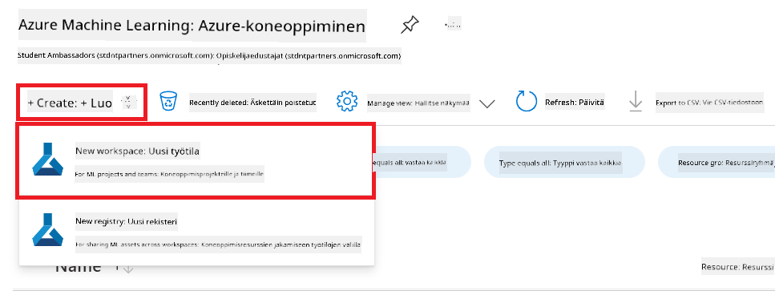

4. Tee seuraavat toimenpiteet:

    - Valitse Azure-**Subscription**.
    - Valitse käytettävä **Resource group** (luo uusi tarvittaessa).
    - Syötä **Workspace Name**. Sen on oltava yksilöllinen.
    - Valitse käytettävä **Region**.
    - Valitse käytettävä **Storage account** (luo uusi tarvittaessa).
    - Valitse käytettävä **Key vault** (luo uusi tarvittaessa).
    - Valitse käytettävä **Application insights** (luo uusi tarvittaessa).
    - Valitse käytettävä **Container registry** (luo uusi tarvittaessa).

    

5. Valitse **Review + Create**.

6. Valitse **Create**.

### Pyydä GPU-kiintiöt Azure-tilauksessa

Tässä opetusohjelmassa opit hienosäätämään ja ottamaan käyttöön Phi-3-mallin käyttäen GPU:ita. Hienosäätöön käytät *Standard_NC24ads_A100_v4* GPU:ta, johon tarvitaan kiintiöpyyntö. Käyttöönottoon käytät *Standard_NC6s_v3* GPU:ta, johon myös tarvitaan kiintiöpyyntö.

> [!NOTE]
>
> Vain Pay-As-You-Go -tilaukset (vakio-tilauksen tyyppi) ovat oikeutettuja GPU-resurssien käyttöön; etuustilaukset eivät tällä hetkellä ole tuettuja.
>

1. Siirry osoitteeseen [Azure ML Studio](https://ml.azure.com/home?wt.mc_id=studentamb_279723).

1. Tee seuraavat toimenpiteet pyytääksesi *Standard NCADSA100v4 Family* -kiintiötä:

    - Valitse vasemman sivun välilehdeltä **Quota**.
    - Valitse käytettävä **Virtual machine family**. Esimerkiksi **Standard NCADSA100v4 Family Cluster Dedicated vCPUs**, joka sisältää *Standard_NC24ads_A100_v4* GPU:n.
    - Valitse navigointivalikosta **Request quota**.

        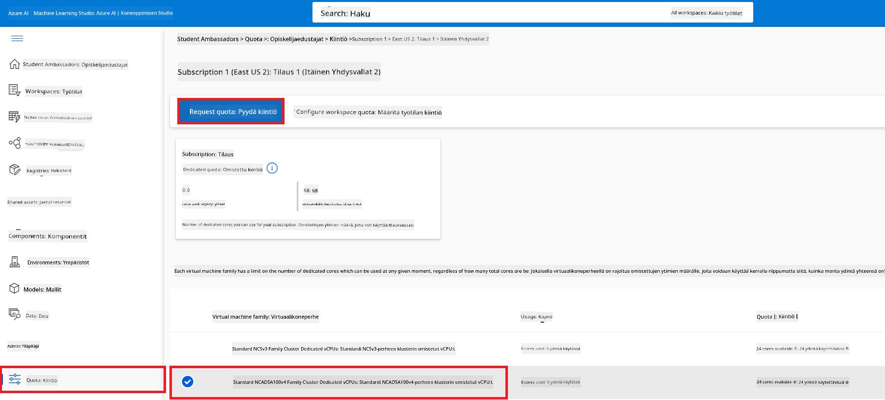

    - Syötä Request quota -sivulla haluamasi **New cores limit**, esimerkiksi 24.
    - Valitse Request quota -sivulla **Submit** pyytääksesi GPU-kiintiön.

1. Tee seuraavat toimenpiteet pyytääksesi *Standard NCSv3 Family* -kiintiötä:

    - Valitse vasemman sivun välilehdeltä **Quota**.
    - Valitse käytettävä **Virtual machine family**. Esimerkiksi **Standard NCSv3 Family Cluster Dedicated vCPUs**, joka sisältää *Standard_NC6s_v3* GPU:n.
    - Valitse navigointivalikosta **Request quota**.
    - Syötä Request quota -sivulla haluamasi **New cores limit**, esimerkiksi 24.
    - Valitse Request quota -sivulla **Submit** pyytääksesi GPU-kiintiön.

### Lisää roolimääritys

Malliesi hienosäätöä ja käyttöönottoa varten sinun on ensin luotava käyttäjän määrittämä hallittu identiteetti (User Assigned Managed Identity, UAI) ja annettava sille tarvittavat käyttöoikeudet. Tätä UAI:ta käytetään todennuksessa käyttöönoton aikana.

#### Luo User Assigned Managed Identity (UAI)

1. Kirjoita *managed identities* **hakupalkkiin** portaalin sivun yläosassa ja valitse ilmestyvistä vaihtoehdoista **Managed Identities**.

    

1. Valitse **+ Create**.

    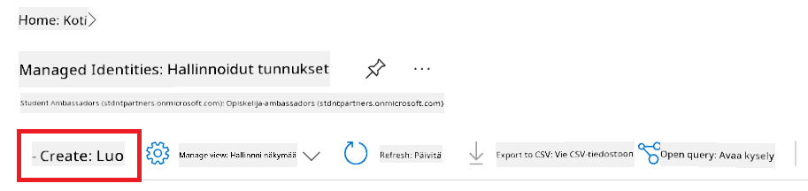

1. Tee seuraavat toimenpiteet:

    - Valitse Azure-**Subscription**.
    - Valitse käytettävä **Resource group** (luo uusi tarvittaessa).
    - Valitse käytettävä **Region**.
    - Syötä **Name**. Sen on oltava yksilöllinen.

    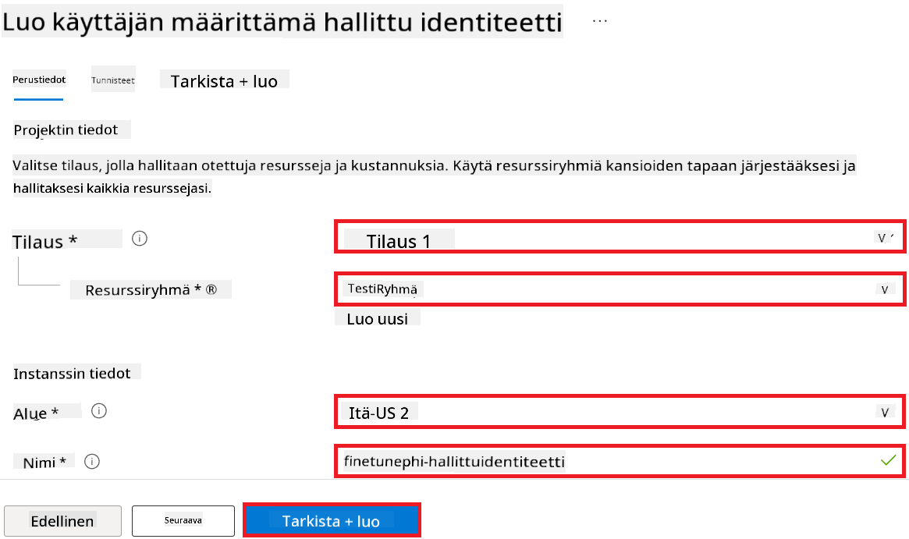

1. Valitse **Review + create**.

1. Valitse **+ Create**.

#### Lisää Contributor-roolimääritys hallitulle identiteetille

1. Siirry luomaasi Managed Identity -resurssiin.

1. Valitse vasemman sivun välilehdeltä **Azure role assignments**.

1. Valitse navigointivalikosta **+Add role assignment**.

1. Lisää roolimäärityksen sivulla tee seuraavat toimenpiteet:
    - Valitse **Scope**ksi **Resource group**.
    - Valitse Azure-**Subscription**.
    - Valitse käytettävä **Resource group**.
    - Valitse **Role**ksi **Contributor**.

    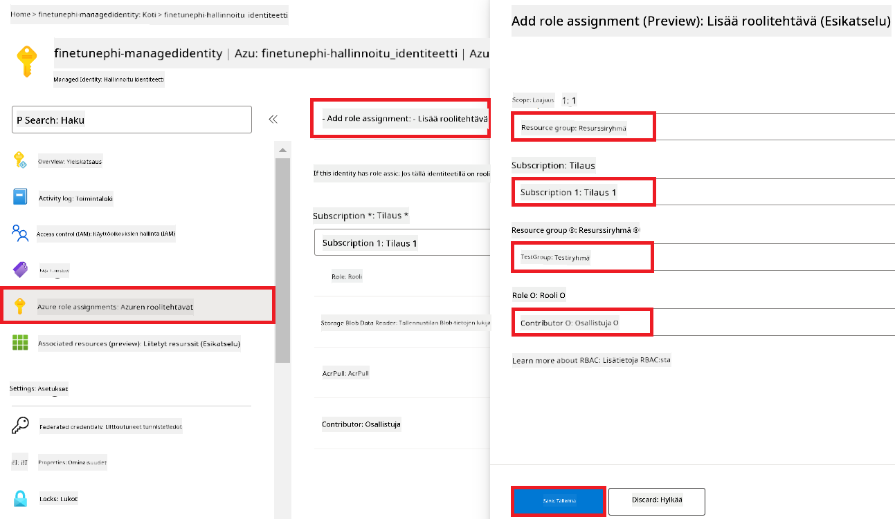

2. Valitse **Save**.

#### Lisää Storage Blob Data Reader -roolimääritys hallitulle identiteetille

1. Kirjoita *storage accounts* **hakupalkkiin** portaalin sivun yläosassa ja valitse ilmestyvistä vaihtoehdoista **Storage accounts**.

    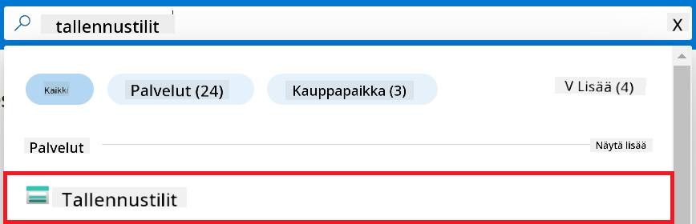

1. Valitse tallennustili, joka liittyy luomaasi Azure Machine Learning -työtilaan. Esimerkiksi *finetunephistorage*.

1. Siirry Add role assignment -sivulle seuraavasti:

    - Siirry luomaasi Azure Storage -tiliin.
    - Valitse vasemman sivun välilehdeltä **Access Control (IAM)**.
    - Valitse navigointivalikosta **+ Add**.
    - Valitse navigointivalikosta **Add role assignment**.

    

1. Lisää roolimäärityksessä tee seuraavat toimenpiteet:

    - Kirjoita roolisivun **hakupalkkiin** *Storage Blob Data Reader* ja valitse vaihtoehdoista **Storage Blob Data Reader**.
    - Valitse roolisivulla **Next**.
    - Jäsen-sivulla valitse **Assign access to** -kohdasta **Managed identity**.
    - Jäsen-sivulla valitse **+ Select members**.
    - Valitse Azure-**Subscription**.
    - Valitse **Managed identity**ksi **Manage Identity**.
    - Valitse luomasi hallittu identiteetti, esimerkiksi *finetunephi-managedidentity*.
    - Valitse **Select**.

    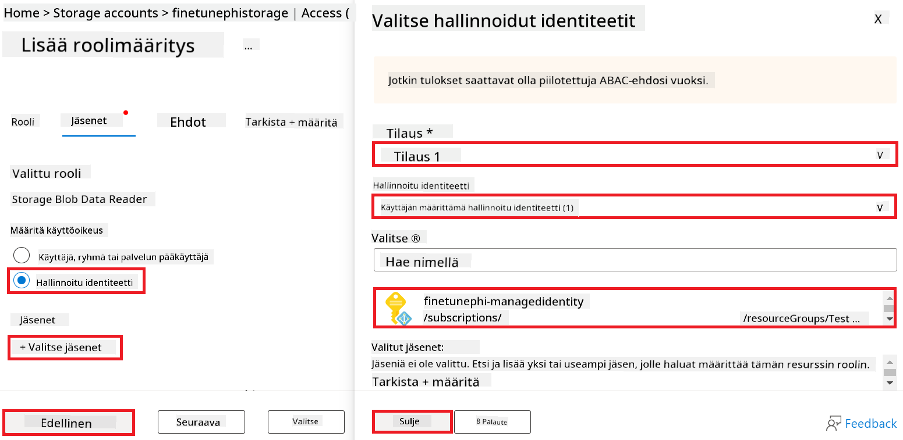

1. Valitse **Review + assign**.

#### Lisää AcrPull-roolimääritys hallitulle identiteetille

1. Kirjoita *container registries* **hakupalkkiin** portaalin sivun yläosassa ja valitse ilmestyvistä vaihtoehdoista **Container registries**.

    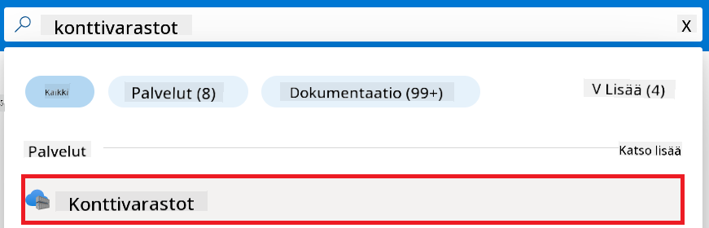

1. Valitse Azure Machine Learning -työtilaan liittyvä container registry, esimerkiksi *finetunephicontainerregistry*.

1. Siirry Add role assignment -sivulle seuraavasti:

    - Valitse vasemman sivun välilehdeltä **Access Control (IAM)**.
    - Valitse navigointivalikosta **+ Add**.
    - Valitse navigointivalikosta **Add role assignment**.

1. Lisää roolimäärityksessä tee seuraavat toimenpiteet:

    - Kirjoita roolisivun **hakupalkkiin** *AcrPull* ja valitse vaihtoehdoista **AcrPull**.
    - Valitse roolisivulla **Next**.
    - Jäsen-sivulla valitse **Assign access to** -kohdasta **Managed identity**.
    - Jäsen-sivulla valitse **+ Select members**.
    - Valitse Azure-**Subscription**.
    - Valitse **Managed identity**ksi **Manage Identity**.
    - Valitse luomasi hallittu identiteetti, esimerkiksi *finetunephi-managedidentity*.
    - Valitse **Select**.
    - Valitse **Review + assign**.

### Perusta projekti

Ladataksesi hienosäätöön tarvittavat aineistot, perustat paikallisen ympäristön.

Tässä harjoituksessa:

- Luo kansio, jossa työskentelet.
- Luo virtuaaliympäristö.
- Asenna tarvittavat paketit.
- Luo *download_dataset.py* -tiedosto aineiston lataamista varten.

#### Luo kansio työskentelyä varten

1. Avaa komentorivi ja kirjoita seuraava komento luodaksesi *finetune-phi* -nimisen kansion oletuspolkuun.

    ```console
    mkdir finetune-phi
    ```

2. Kirjoita komentoriville seuraava komento siirtyäksesi luomaasi *finetune-phi* -kansioon.

    ```console
    cd finetune-phi
    ```

#### Luo virtuaaliympäristö

1. Kirjoita komentoriville seuraava komento luodaksesi *.venv* -nimisen virtuaaliympäristön.

    ```console
    python -m venv .venv
    ```

2. Aktivoi virtuaaliympäristö kirjoittamalla komentoriville seuraava komento.

    ```console
    .venv\Scripts\activate.bat
    ```

> [!NOTE]
> Jos aktivointi onnistui, komentokehotteessa näkyy *(.venv)*.

#### Asenna tarvittavat paketit

1. Asenna vaaditut paketit kirjoittamalla komentoriville seuraavat komennot.

    ```console
    pip install datasets==2.19.1
    ```

#### Luo `download_dataset.py`

> [!NOTE]
> Koko kansiorakenne:
>
> ```text
> └── YourUserName
> .    └── finetune-phi
> .        └── download_dataset.py
> ```

1. Avaa **Visual Studio Code**.

1. Valitse valikkoriviltä **File**.

1. Valitse **Open Folder**.

1. Valitse luomasi *finetune-phi* -kansio, joka sijaitsee polussa *C:\Users\yourUserName\finetune-phi*.

    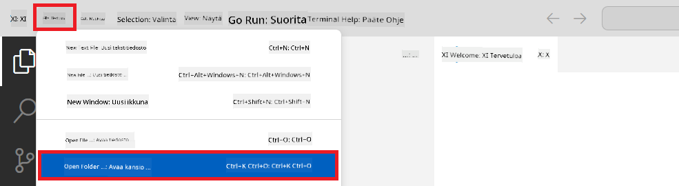

1. Visual Studio Coden vasemmassa paneelissa napsauta hiiren oikealla ja valitse **New File** luodaksesi uuden tiedoston nimeltä *download_dataset.py*.

    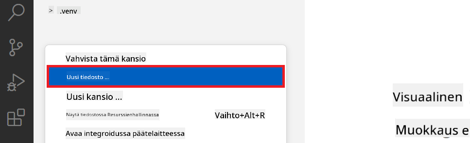

### Valmistele aineisto hienosäätöä varten

Tässä harjoituksessa suoritat *download_dataset.py* -tiedoston ladataksesi *ultrachat_200k* -aineistot paikalliseen ympäristöösi. Käytät tätä aineistoa Phi-3-mallin hienosäätöön Azure Machine Learningissä.

Harjoituksessa:

- Lisää koodi *download_dataset.py* -tiedostoon aineiston lataamista varten.
- Suorita *download_dataset.py* -tiedosto ladataksesi aineiston paikalliseen ympäristöön.

#### Lataa aineisto käyttämällä *download_dataset.py* -tiedostoa

1. Avaa *download_dataset.py* Visual Studio Codessa.

1. Lisää seuraava koodi tiedostoon.

    ```python
    import json
    import os
    from datasets import load_dataset

    def load_and_split_dataset(dataset_name, config_name, split_ratio):
        """
        Load and split a dataset.
        """
        # Load the dataset with the specified name, configuration, and split ratio
        dataset = load_dataset(dataset_name, config_name, split=split_ratio)
        print(f"Original dataset size: {len(dataset)}")
        
        # Split the dataset into train and test sets (80% train, 20% test)
        split_dataset = dataset.train_test_split(test_size=0.2)
        print(f"Train dataset size: {len(split_dataset['train'])}")
        print(f"Test dataset size: {len(split_dataset['test'])}")
        
        return split_dataset

    def save_dataset_to_jsonl(dataset, filepath):
        """
        Save a dataset to a JSONL file.
        """
        # Create the directory if it does not exist
        os.makedirs(os.path.dirname(filepath), exist_ok=True)
        
        # Open the file in write mode
        with open(filepath, 'w', encoding='utf-8') as f:
            # Iterate over each record in the dataset
            for record in dataset:
                # Dump the record as a JSON object and write it to the file
                json.dump(record, f)
                # Write a newline character to separate records
                f.write('\n')
        
        print(f"Dataset saved to {filepath}")

    def main():
        """
        Main function to load, split, and save the dataset.
        """
        # Load and split the ULTRACHAT_200k dataset with a specific configuration and split ratio
        dataset = load_and_split_dataset("HuggingFaceH4/ultrachat_200k", 'default', 'train_sft[:1%]')
        
        # Extract the train and test datasets from the split
        train_dataset = dataset['train']
        test_dataset = dataset['test']

        # Save the train dataset to a JSONL file
        save_dataset_to_jsonl(train_dataset, "data/train_data.jsonl")
        
        # Save the test dataset to a separate JSONL file
        save_dataset_to_jsonl(test_dataset, "data/test_data.jsonl")

    if __name__ == "__main__":
        main()

    ```

1. Kirjoita komentoriville seuraava komento suorittaaksesi skriptin ja ladataksesi aineiston paikalliseen ympäristöön.

    ```console
    python download_dataset.py
    ```

1. Varmista, että aineistot tallentuivat onnistuneesti paikalliseen *finetune-phi/data* -hakemistoon.

> [!NOTE]
>
> #### Huomautus aineiston koosta ja hienosäätöajasta
>
> Tässä opetusohjelmassa käytät vain 1 % aineistosta (`split='train[:1%]'`). Tämä pienentää merkittävästi datamäärää, nopeuttaen sekä latausta että hienosäätöä. Voit säätää prosenttiosuutta löytääksesi sopivan tasapainon koulutusajan ja mallin suorituskyvyn välillä. Pienemmän osajoukon käyttö lyhentää hienosäätöön kuluvaa aikaa, mikä tekee prosessista helpommin hallittavan opetusohjelmassa.

## Skenaario 2: Phi-3-mallin hienosäätö ja käyttöönotto Azure Machine Learning Studiossa

### Hienosäädä Phi-3-malli

Tässä harjoituksessa hienosäädät
1. Siirry osoitteeseen [Azure ML Studio](https://ml.azure.com/home?wt.mc_id=studentamb_279723).

1. Valitse vasemman puolen välilehdeltä **Compute**.

1. Valitse navigointivalikosta **Compute clusters**.

1. Valitse **+ New**.

    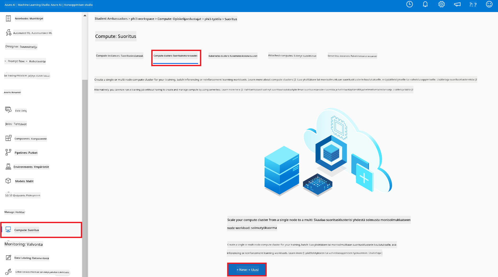

1. Suorita seuraavat toimenpiteet:

    - Valitse haluamasi **Region**.
    - Valitse **Virtual machine tier** arvoksi **Dedicated**.
    - Valitse **Virtual machine type** arvoksi **GPU**.
    - Valitse **Virtual machine size** suodattimeksi **Select from all options**.
    - Valitse **Virtual machine size** arvoksi **Standard_NC24ads_A100_v4**.

    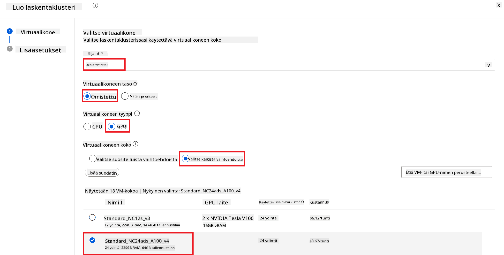

1. Valitse **Next**.

1. Suorita seuraavat toimenpiteet:

    - Anna **Compute name**. Sen täytyy olla ainutlaatuinen.
    - Aseta **Minimum number of nodes** arvoksi **0**.
    - Aseta **Maximum number of nodes** arvoksi **1**.
    - Aseta **Idle seconds before scale down** arvoksi **120**.

    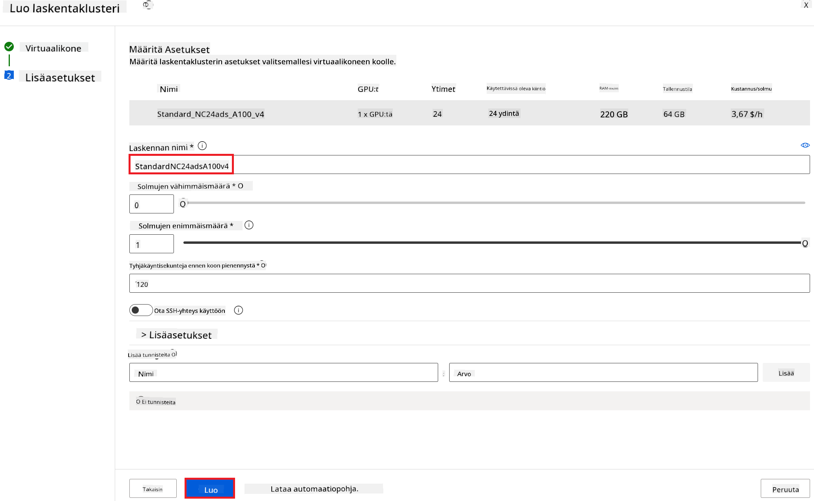

1. Valitse **Create**.

#### Hienosäädä Phi-3-malli

1. Siirry osoitteeseen [Azure ML Studio](https://ml.azure.com/home?wt.mc_id=studentamb_279723).

1. Valitse luomasi Azure Machine Learning -työtila.

    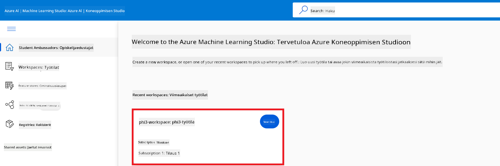

1. Suorita seuraavat toimenpiteet:

    - Valitse vasemman puolen välilehdeltä **Model catalog**.
    - Kirjoita **hakupalkkiin** *phi-3-mini-4k* ja valitse vaihtoehdoista **Phi-3-mini-4k-instruct**.

    

1. Valitse navigointivalikosta **Fine-tune**.

    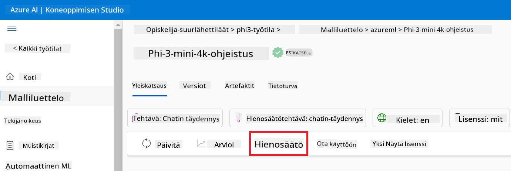

1. Suorita seuraavat toimenpiteet:

    - Valitse **Select task type** arvoksi **Chat completion**.
    - Valitse **+ Select data** ladataksesi **Training data**.
    - Valitse validointidatan lataustavaksi **Provide different validation data**.
    - Valitse **+ Select data** ladataksesi **Validation data**.

    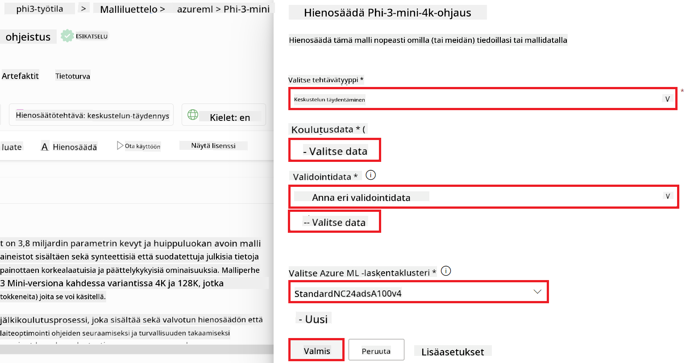

    > [!TIP]
    >
    > Voit valita **Advanced settings** mukauttaaksesi asetuksia, kuten **learning_rate** ja **lr_scheduler_type**, optimoidaksesi hienosäätöprosessia tarpeidesi mukaan.

1. Valitse **Finish**.

1. Tässä harjoituksessa hienosäädit Phi-3-mallin onnistuneesti Azure Machine Learningin avulla. Huomioithan, että hienosäätöprosessi voi kestää jonkin aikaa. Kun hienosäätötyö on käynnissä, sinun täytyy odottaa sen valmistumista. Voit seurata hienosäätötyön tilaa siirtymällä Azure Machine Learning -työtilasi vasemman puolen välilehdeltä **Jobs**-osioon. Seuraavassa osassa otat käyttöön hienosäädetyn mallin ja yhdistät sen Prompt flow -järjestelmään.

    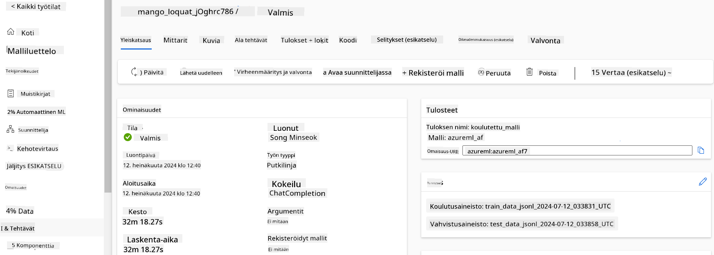

### Ota käyttöön hienosäädetty Phi-3-malli

Jotta voit integroida hienosäädetyn Phi-3-mallin Prompt flow -järjestelmään ja tehdä siitä reaaliaikaisesti käytettävän, sinun tulee ottaa malli käyttöön. Tämä prosessi sisältää mallin rekisteröinnin, online-päätepisteen luomisen ja mallin käyttöönoton.

Tässä harjoituksessa teet seuraavaa:

- Rekisteröit hienosäädetyn mallin Azure Machine Learning -työtilaan.
- Luot online-päätepisteen.
- Otat käyttöön rekisteröidyn hienosäädetyn Phi-3-mallin.

#### Rekisteröi hienosäädetty malli

1. Siirry osoitteeseen [Azure ML Studio](https://ml.azure.com/home?wt.mc_id=studentamb_279723).

1. Valitse luomasi Azure Machine Learning -työtila.

    

1. Valitse vasemman puolen välilehdeltä **Models**.
1. Valitse **+ Register**.
1. Valitse **From a job output**.

    

1. Valitse luomasi työ.

    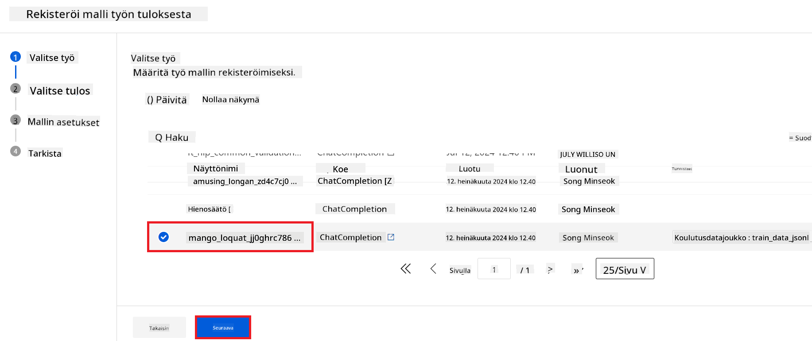

1. Valitse **Next**.

1. Valitse **Model type** arvoksi **MLflow**.

1. Varmista, että **Job output** on valittuna; sen pitäisi olla automaattisesti valittu.

    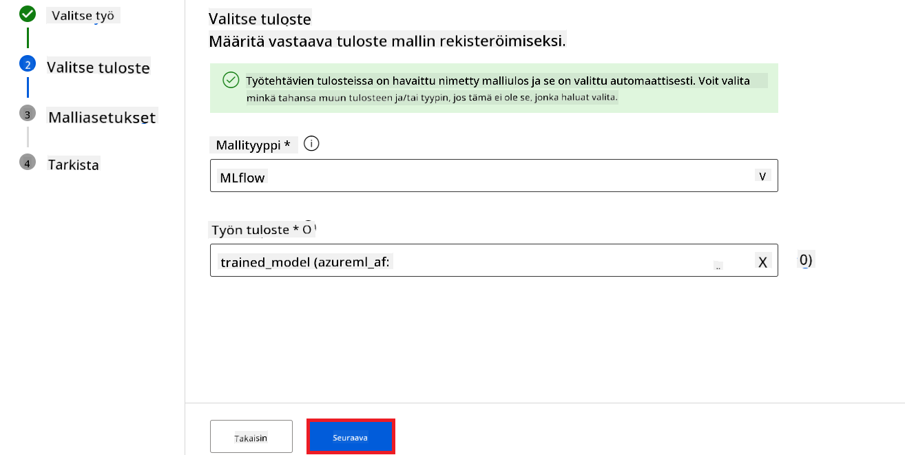

2. Valitse **Next**.

3. Valitse **Register**.

    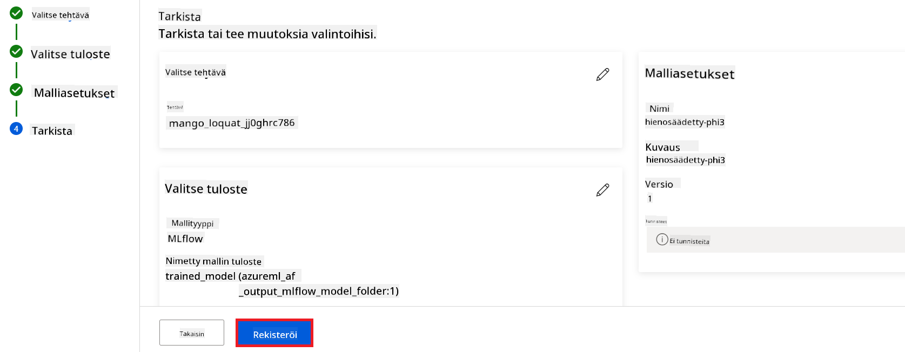

4. Voit tarkastella rekisteröityä malliasi valitsemalla vasemman puolen välilehdeltä **Models**.

    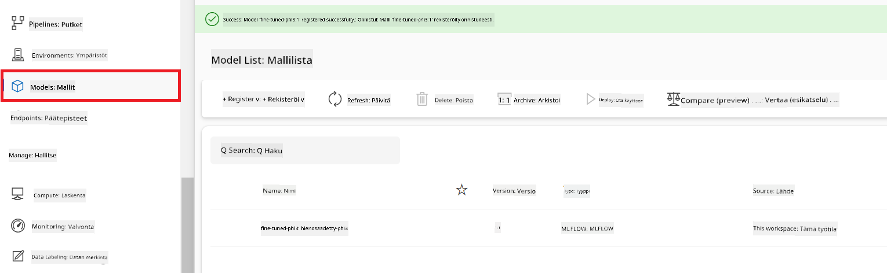

#### Ota hienosäädetty malli käyttöön

1. Siirry luomaasi Azure Machine Learning -työtilaan.

1. Valitse vasemman puolen välilehdeltä **Endpoints**.

1. Valitse navigointivalikosta **Real-time endpoints**.

    

1. Valitse **Create**.

1. Valitse luomasi rekisteröity malli.

    

1. Valitse **Select**.

1. Suorita seuraavat toimenpiteet:

    - Valitse **Virtual machine** arvoksi *Standard_NC6s_v3*.
    - Valitse haluamasi **Instance count**, esimerkiksi *1*.
    - Valitse **Endpoint** arvoksi **New** luodaksesi uuden päätepisteen.
    - Anna **Endpoint name**. Sen täytyy olla ainutlaatuinen.
    - Anna **Deployment name**. Sen täytyy olla ainutlaatuinen.

    

1. Valitse **Deploy**.

> [!WARNING]
> Välttääksesi ylimääräiset maksut, muista poistaa luomasi päätepiste Azure Machine Learning -työtilasta, kun et enää tarvitse sitä.
>

#### Tarkista käyttöönoton tila Azure Machine Learning -työtilassa

1. Siirry luomaasi Azure Machine Learning -työtilaan.

1. Valitse vasemman puolen välilehdeltä **Endpoints**.

1. Valitse luomasi päätepiste.

    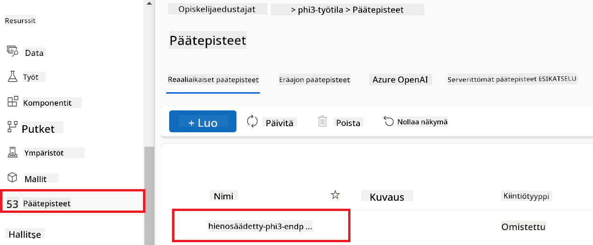

1. Tällä sivulla voit hallita päätepisteitä käyttöönoton aikana.

> [!NOTE]
> Kun käyttöönotto on valmis, varmista, että **Live traffic** on asetettu arvoon **100%**. Jos näin ei ole, valitse **Update traffic** säätääksesi liikenneasetuksia. Huomioithan, että mallia ei voi testata, jos liikenne on asetettu arvoon 0%.
>
> 
>

## Tapaus 3: Integroi Prompt flow -järjestelmään ja keskustele omalla mallillasi Azure AI Foundryssa

### Integroi oma Phi-3-malli Prompt flow -järjestelmään

Kun olet ottanut hienosäädetyn mallisi käyttöön, voit nyt yhdistää sen Prompt Flow'hun käyttääksesi malliasi reaaliaikaisissa sovelluksissa. Tämä mahdollistaa monipuoliset vuorovaikutteiset tehtävät omalla Phi-3-mallillasi.

Tässä harjoituksessa teet seuraavaa:

- Luo Azure AI Foundry Hub.
- Luo Azure AI Foundry Project.
- Luo Prompt flow.
- Lisää mukautettu yhteys hienosäädetylle Phi-3-mallille.
- Määritä Prompt flow keskustelemaan omalla Phi-3-mallillasi.

> [!NOTE]
> Voit myös integroida Promptflow'n käyttämällä Azure ML Studiota. Sama integraatioprosessi toimii myös Azure ML Studion kanssa.

#### Luo Azure AI Foundry Hub

Hub täytyy luoda ennen projektia. Hub toimii kuin resurssiryhmä, jonka avulla voit järjestellä ja hallita useita projekteja Azure AI Foundryssa.

1. Siirry osoitteeseen [Azure AI Foundry](https://ai.azure.com/?WT.mc_id=aiml-137032-kinfeylo).

1. Valitse vasemman puolen välilehdeltä **All hubs**.

1. Valitse navigointivalikosta **+ New hub**.

    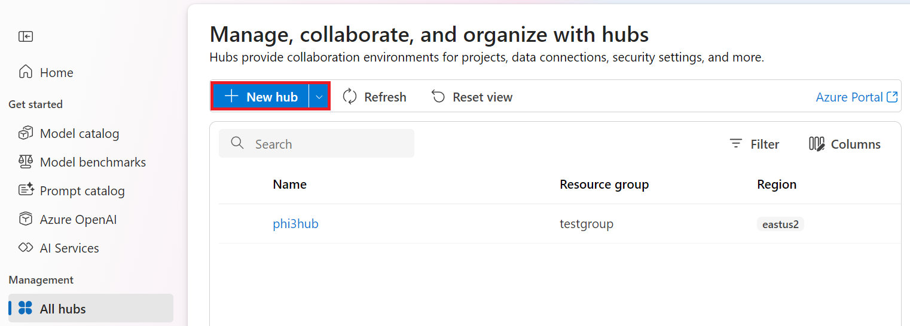

1. Suorita seuraavat toimenpiteet:

    - Anna **Hub name**. Sen täytyy olla ainutlaatuinen.
    - Valitse Azure-tilauksesi (**Subscription**).
    - Valitse käytettävä **Resource group** (luo tarvittaessa uusi).
    - Valitse haluamasi **Location**.
    - Valitse käytettävä **Connect Azure AI Services** (luo tarvittaessa uusi).
    - Valitse **Connect Azure AI Search** arvoksi **Skip connecting**.

    

1. Valitse **Next**.

#### Luo Azure AI Foundry Project

1. Valitse luomassasi Hubissa vasemman puolen välilehdeltä **All projects**.

1. Valitse navigointivalikosta **+ New project**.

    

1. Anna **Project name**. Sen täytyy olla ainutlaatuinen.

    

1. Valitse **Create a project**.

#### Lisää mukautettu yhteys hienosäädetylle Phi-3-mallille

Jotta voit integroida oman Phi-3-mallisi Prompt flow'hun, sinun tulee tallentaa mallin päätepiste ja avain mukautettuun yhteyteen. Tämä varmistaa pääsyn omaan Phi-3-malliisi Prompt flow'ssa.

#### Aseta hienosäädetyn Phi-3-mallin api-avain ja päätepisteen URI

1. Siirry osoitteeseen [Azure ML Studio](https://ml.azure.com/home?WT.mc_id=aiml-137032-kinfeylo).

1. Siirry luomaasi Azure Machine Learning -työtilaan.

1. Valitse vasemman puolen välilehdeltä **Endpoints**.

    

1. Valitse luomasi päätepiste.

    

1. Valitse navigointivalikosta **Consume**.

1. Kopioi **REST endpoint** ja **Primary key**.


#### Lisää mukautettu yhteys

1. Siirry osoitteeseen [Azure AI Foundry](https://ai.azure.com/?WT.mc_id=aiml-137032-kinfeylo).

1. Siirry luomaasi Azure AI Foundry -projektiin.

1. Valitse luomassasi projektissa vasemman puolen välilehdestä **Settings**.

1. Valitse **+ New connection**.

    

1. Valitse navigaatiovalikosta **Custom keys**.

    

1. Suorita seuraavat toimenpiteet:

    - Valitse **+ Add key value pairs**.
    - Kirjoita avaimen nimeksi **endpoint** ja liitä Azure ML Studiosta kopioimasi endpoint arvokenttään.
    - Valitse uudelleen **+ Add key value pairs**.
    - Kirjoita avaimen nimeksi **key** ja liitä Azure ML Studiosta kopioimasi avain arvokenttään.
    - Avaimien lisäämisen jälkeen valitse **is secret** estääksesi avaimen paljastumisen.

    

1. Valitse **Add connection**.

#### Luo Prompt flow

Olet lisännyt mukautetun yhteyden Azure AI Foundryssa. Luodaan nyt Prompt flow seuraavien ohjeiden mukaisesti. Tämän jälkeen yhdistät Prompt flown mukautettuun yhteyteen, jotta voit käyttää hienosäädettyä mallia Prompt flowssa.

1. Siirry luomaasi Azure AI Foundry -projektiin.

1. Valitse vasemman puolen välilehdestä **Prompt flow**.

1. Valitse navigaatiovalikosta **+ Create**.

    

1. Valitse navigaatiovalikosta **Chat flow**.

    

1. Kirjoita käytettävä **Folder name**.

    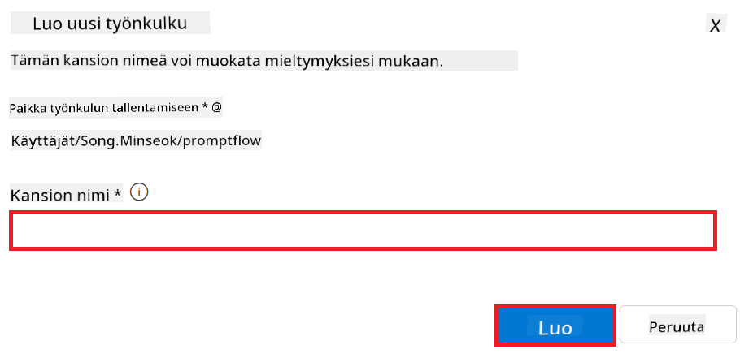

2. Valitse **Create**.

#### Määritä Prompt flow keskustelemaan mukautetun Phi-3 mallisi kanssa

Sinun täytyy integroida hienosäädetty Phi-3 malli Prompt flowhun. Kuitenkin olemassa oleva Prompt flow ei ole suunniteltu tätä tarkoitusta varten. Siksi sinun tulee suunnitella Prompt flow uudelleen, jotta mukautettu malli voidaan integroida.

1. Prompt flowssa tee seuraavat toimenpiteet olemassa olevan flown uudelleen rakentamiseksi:

    - Valitse **Raw file mode**.
    - Poista kaikki nykyinen koodi *flow.dag.yml* tiedostosta.
    - Lisää seuraava koodi *flow.dag.yml* tiedostoon.

        ```yml
        inputs:
          input_data:
            type: string
            default: "Who founded Microsoft?"

        outputs:
          answer:
            type: string
            reference: ${integrate_with_promptflow.output}

        nodes:
        - name: integrate_with_promptflow
          type: python
          source:
            type: code
            path: integrate_with_promptflow.py
          inputs:
            input_data: ${inputs.input_data}
        ```

    - Valitse **Save**.

    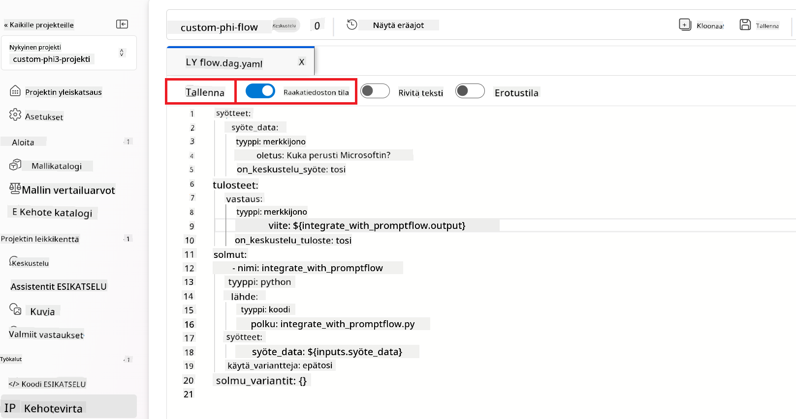

1. Lisää seuraava koodi *integrate_with_promptflow.py* tiedostoon käyttääksesi mukautettua Phi-3 mallia Prompt flowssa.

    ```python
    import logging
    import requests
    from promptflow import tool
    from promptflow.connections import CustomConnection

    # Logging setup
    logging.basicConfig(
        format="%(asctime)s - %(levelname)s - %(name)s - %(message)s",
        datefmt="%Y-%m-%d %H:%M:%S",
        level=logging.DEBUG
    )
    logger = logging.getLogger(__name__)

    def query_phi3_model(input_data: str, connection: CustomConnection) -> str:
        """
        Send a request to the Phi-3 model endpoint with the given input data using Custom Connection.
        """

        # "connection" is the name of the Custom Connection, "endpoint", "key" are the keys in the Custom Connection
        endpoint_url = connection.endpoint
        api_key = connection.key

        headers = {
            "Content-Type": "application/json",
            "Authorization": f"Bearer {api_key}"
        }
        data = {
            "input_data": {
                "input_string": [
                    {"role": "user", "content": input_data}
                ],
                "parameters": {
                    "temperature": 0.7,
                    "max_new_tokens": 128
                }
            }
        }
        try:
            response = requests.post(endpoint_url, json=data, headers=headers)
            response.raise_for_status()
            
            # Log the full JSON response
            logger.debug(f"Full JSON response: {response.json()}")

            result = response.json()["output"]
            logger.info("Successfully received response from Azure ML Endpoint.")
            return result
        except requests.exceptions.RequestException as e:
            logger.error(f"Error querying Azure ML Endpoint: {e}")
            raise

    @tool
    def my_python_tool(input_data: str, connection: CustomConnection) -> str:
        """
        Tool function to process input data and query the Phi-3 model.
        """
        return query_phi3_model(input_data, connection)

    ```

    

> [!NOTE]
> Lisätietoja Prompt flown käytöstä Azure AI Foundryssa löydät osoitteesta [Prompt flow in Azure AI Foundry](https://learn.microsoft.com/azure/ai-studio/how-to/prompt-flow).

1. Valitse **Chat input**, **Chat output** ottaaksesi chat-toiminnon käyttöön mallisi kanssa.

    

1. Nyt olet valmis keskustelemaan mukautetun Phi-3 mallisi kanssa. Seuraavassa harjoituksessa opit, miten käynnistät Prompt flown ja käytät sitä keskusteluun hienosäädetyn Phi-3 mallisi kanssa.

> [!NOTE]
>
> Uudelleen rakennettu flow näyttää tältä:
>
> 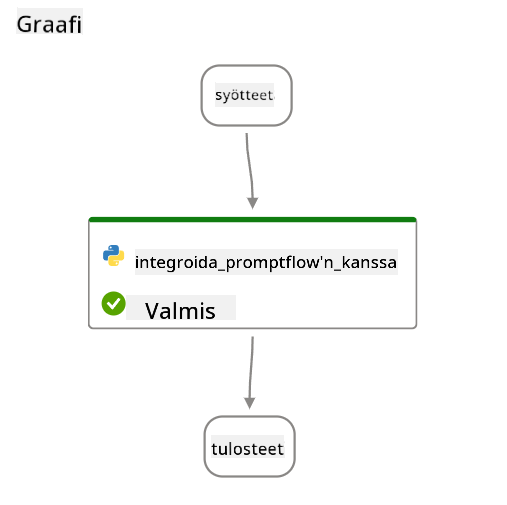
>

### Keskustele mukautetun Phi-3 mallisi kanssa

Nyt kun olet hienosäätänyt ja integroinut mukautetun Phi-3 mallisi Prompt flowhin, olet valmis aloittamaan vuorovaikutuksen sen kanssa. Tämä harjoitus ohjaa sinut mallisi kanssa keskustelun aloittamisessa ja asetusten tekemisessä Prompt flown avulla. Näiden vaiheiden avulla voit hyödyntää hienosäädetyn Phi-3 mallisi kyvykkyyksiä monenlaisissa tehtävissä ja keskusteluissa.

- Keskustele mukautetun Phi-3 mallisi kanssa Prompt flown avulla.

#### Käynnistä Prompt flow

1. Valitse **Start compute sessions** käynnistääksesi Prompt flown.

    

1. Valitse **Validate and parse input** päivittääksesi parametrit.

    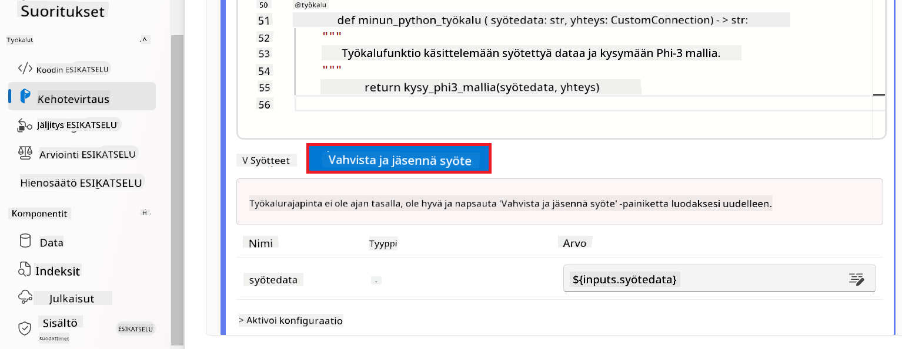

1. Valitse **Value** kentästä **connection** luomasi mukautetun yhteyden arvo, esimerkiksi *connection*.

    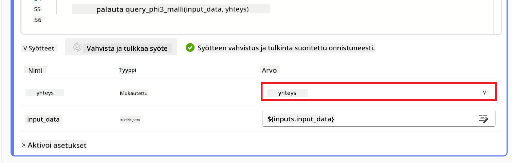

#### Keskustele mukautetun mallisi kanssa

1. Valitse **Chat**.

    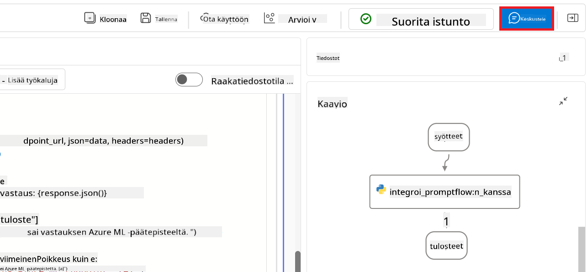

1. Tässä esimerkki tuloksista: nyt voit keskustella mukautetun Phi-3 mallisi kanssa. Suositeltavaa on esittää kysymyksiä, jotka perustuvat hienosäädössä käytettyyn aineistoon.

    

**Vastuuvapauslauseke**:  
Tämä asiakirja on käännetty käyttämällä tekoälypohjaista käännöspalvelua [Co-op Translator](https://github.com/Azure/co-op-translator). Vaikka pyrimme tarkkuuteen, huomioithan, että automaattikäännöksissä voi esiintyä virheitä tai epätarkkuuksia. Alkuperäistä asiakirjaa sen alkuperäisellä kielellä tulee pitää virallisena lähteenä. Tärkeissä asioissa suositellaan ammattimaista ihmiskäännöstä. Emme ole vastuussa tästä käännöksestä aiheutuvista väärinkäsityksistä tai virhetulkinnoista.