# Hienosäädä ja integroi mukautetut Phi-3-mallit Prompt flow -työkalulla Microsoft Foundryssa

Tämä end-to-end (E2E) -esimerkki perustuu Microsoft Tech Communityssä julkaistuun oppaaseen "[Fine-Tune and Integrate Custom Phi-3 Models with Prompt Flow in Microsoft Foundry](https://techcommunity.microsoft.com/t5/educator-developer-blog/fine-tune-and-integrate-custom-phi-3-models-with-prompt-flow-in/ba-p/4191726?WT.mc_id=aiml-137032-kinfeylo)". Se esittelee mukautettujen Phi-3-mallien hienosäädön, käyttöönoton ja integroinnin Prompt flow’n avulla Microsoft Foundryssa.
Toisin kuin E2E-esimerkissä "[Fine-Tune and Integrate Custom Phi-3 Models with Prompt Flow](./E2E_Phi-3-FineTuning_PromptFlow_Integration.md)", jossa koodia ajettiin paikallisesti, tässä opetusohjelmassa keskitytään kokonaan mallisi hienosäätöön ja integrointiin Azure AI/ML Studion sisällä.

## Yleiskatsaus

Tässä E2E-esimerkissä opit hienosäätämään Phi-3-mallin ja integroimaan sen Prompt flow’n kanssa Microsoft Foundryssa. Hyödyntämällä Azure AI/ML Studiota luot työnkulkusi mukautettujen tekoälymallien käyttöönottoa ja hyödyntämistä varten. Tämä E2E-esimerkki on jaettu kolmeen skenaarioon:

**Skenaario 1: Azure-resurssien asennus ja valmistautuminen hienosäätöön**

**Skenaario 2: Phi-3-mallin hienosäätö ja käyttöönotto Azure Machine Learning Studiossa**

**Skenaario 3: Integrointi Prompt flow’n kanssa ja keskustelu mukautetulla mallillasi Microsoft Foundryssa**

Tässä on yleiskatsaus tähän E2E-esimerkkiin.

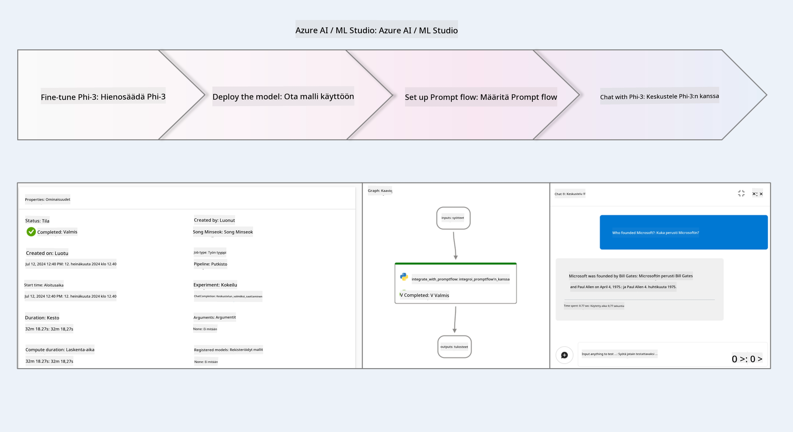

### Sisällysluettelo

1. **[Skenaario 1: Azure-resurssien asennus ja valmistautuminen hienosäätöön](../../../../../../md/02.Application/01.TextAndChat/Phi3)**
    - [Luo Azure Machine Learning -työtila](../../../../../../md/02.Application/01.TextAndChat/Phi3)
    - [Pyydä GPU-rajoja Azure-tilauksen käyttöön](../../../../../../md/02.Application/01.TextAndChat/Phi3)
    - [Lisää roolimääritys](../../../../../../md/02.Application/01.TextAndChat/Phi3)
    - [Projektin asennus](../../../../../../md/02.Application/01.TextAndChat/Phi3)
    - [Valmistele tietojoukko hienosäätöä varten](../../../../../../md/02.Application/01.TextAndChat/Phi3)

1. **[Skenaario 2: Phi-3-mallin hienosäätö ja käyttöönotto Azure Machine Learning Studiossa](../../../../../../md/02.Application/01.TextAndChat/Phi3)**
    - [Hienosäädä Phi-3-malli](../../../../../../md/02.Application/01.TextAndChat/Phi3)
    - [Ota hienosäädetty Phi-3-malli käyttöön](../../../../../../md/02.Application/01.TextAndChat/Phi3)

1. **[Skenaario 3: Integroi Prompt flow’n kanssa ja keskustele mukautetulla mallillasi Microsoft Foundryssa](../../../../../../md/02.Application/01.TextAndChat/Phi3)**
    - [Integroi mukautettu Phi-3-malli Prompt flow’n kanssa](../../../../../../md/02.Application/01.TextAndChat/Phi3)
    - [Keskustele mukautetun Phi-3-mallisi kanssa](../../../../../../md/02.Application/01.TextAndChat/Phi3)

## Skenaario 1: Azure-resurssien asennus ja valmistautuminen hienosäätöön

### Luo Azure Machine Learning -työtila

1. Kirjoita *azure machine learning* **hakupalkkiin** portaalisivun yläosassa ja valitse vaihtoehdoista **Azure Machine Learning**.

    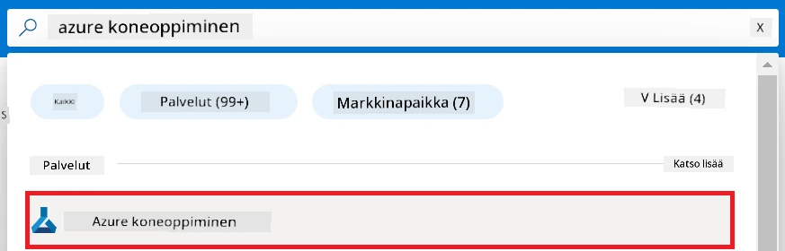

2. Valitse navigointivalikosta **+ Luo**.

3. Valitse navigointivalikosta **Uusi työtila**.

    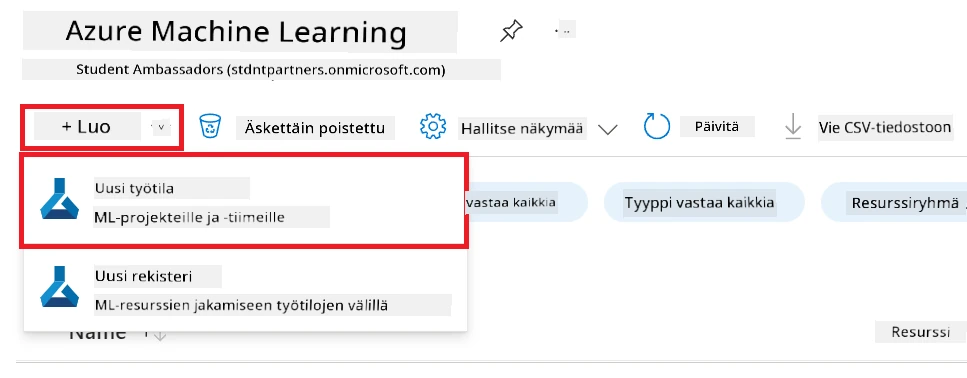

4. Suorita seuraavat tehtävät:

    - Valitse Azure-tilauksesi **Tilauksesi**.
    - Valitse käytettävä **Resurssiryhmä** (luo uusi tarvittaessa).
    - Kirjoita **Työtilan nimi**. Sen on oltava yksilöllinen.
    - Valitse haluamasi **Alue**.
    - Valitse käytettävä **Tallennustili** (luo uusi tarvittaessa).
    - Valitse käytettävä **Avainnippu** (luo uusi tarvittaessa).
    - Valitse käytettävä **Sovelluksen tiedot** (luo uusi tarvittaessa).
    - Valitse käytettävä **Säilörekisteri** (luo uusi tarvittaessa).

    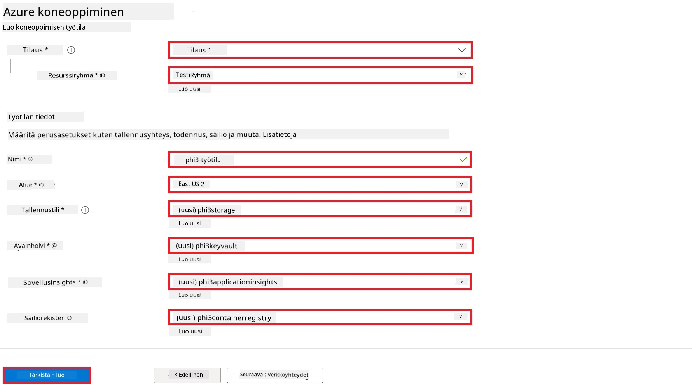

5. Valitse **Tarkista + luo**.

6. Valitse **Luo**.

### Pyydä GPU-rajoja Azure-tilaukseen

Tässä ohjeessa opit hienosäätämään ja käyttämään Phi-3-mallia GPU:iden avulla. Hienosäätöä varten käytät *Standard_NC24ads_A100_v4* -GPU:ta, johon vaaditaan rajoituspyyntö. Käyttöönotossa käytät *Standard_NC6s_v3* -GPU:ta, johon myös tarvitaan rajoituspyyntö.

> [!NOTE]
>
> Vain Pay-As-You-Go -tilaukset (standardi tilaus) voivat saada GPU-varauksia; etuustilauksia ei tällä hetkellä tueta.
>

1. Siirry osoitteeseen [Azure ML Studio](https://ml.azure.com/home?wt.mc_id=studentamb_279723).

1. Suorita seuraavat toimet pyytääksesi *Standard NCADSA100v4 Family* -rajoitusta:

    - Valitse vasemman puolen välilehdeltä **Quota**.
    - Valitse käytettävä **Virtuaalikoneiden perhe**. Esimerkiksi **Standard NCADSA100v4 Family Cluster Dedicated vCPUs**, joka sisältää *Standard_NC24ads_A100_v4* -GPU:n.
    - Valitse navigointivalikosta **Request quota**.

        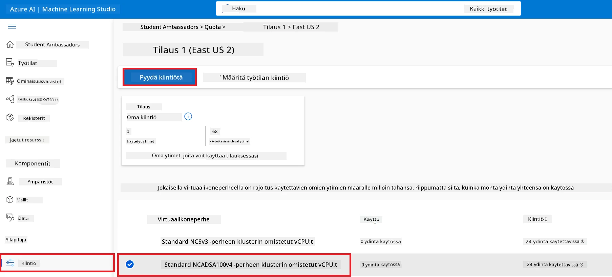

    - Rajoituspyyntösivulla kirjoita haluamasi uusi **Ytimien maksimimäärä**. Esimerkiksi 24.
    - Rajoituspyyntösivulla valitse **Submit** pyytääksesi GPU-rajoitusta.

1. Suorita seuraavat toimet pyytääksesi *Standard NCSv3 Family* -rajoitusta:

    - Valitse vasemman puolen välilehdeltä **Quota**.
    - Valitse käytettävä **Virtuaalikoneiden perhe**. Esimerkiksi **Standard NCSv3 Family Cluster Dedicated vCPUs**, joka sisältää *Standard_NC6s_v3* -GPU:n.
    - Valitse navigointivalikosta **Request quota**.
    - Rajoituspyyntösivulla kirjoita haluamasi uusi **Ytimien maksimimäärä**. Esimerkiksi 24.
    - Rajoituspyyntösivulla valitse **Submit** pyytääksesi GPU-rajoitusta.

### Lisää roolimääritys

Hienosäätöä ja käyttöönottoa varten sinun tulee ensin luoda Käyttäjän määrittämä hallittu identiteetti (User Assigned Managed Identity, UAI) ja antaa sille tarvittavat käyttöoikeudet. Tätä UAI:a käytetään todennuksessa käyttöönoton aikana.

#### Luo Käyttäjän määrittämä hallittu identiteetti (UAI)

1. Kirjoita *managed identities* **hakupalkkiin** portaalisivun yläosassa ja valitse vaihtoehdoista **Managed Identities**.

    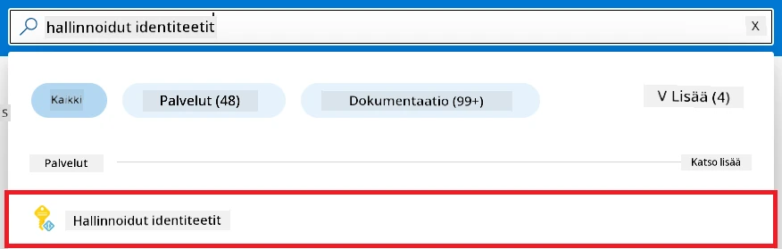

1. Valitse **+ Luo**.

    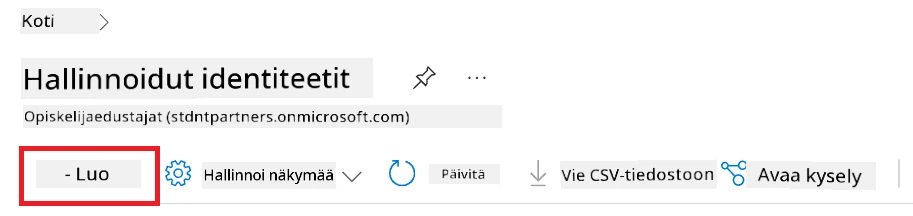

1. Suorita seuraavat tehtävät:

    - Valitse Azure-tilauksesi **Tilauksesi**.
    - Valitse käytettävä **Resurssiryhmä** (luo uusi tarvittaessa).
    - Valitse haluamasi **Alue**.
    - Kirjoita **Nimi**. Sen on oltava yksilöllinen.

    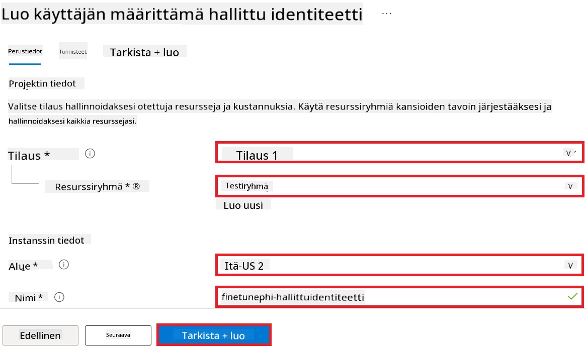

1. Valitse **Tarkista + luo**.

1. Valitse **+ Luo**.

#### Lisää Hallinnoijan roolimääritys hallittuun identiteettiin

1. Siirry luomaasi hallittuun identiteettiin liittyvään resurssiin.

1. Valitse vasemman puolen välilehdeltä **Azure role assignments**.

1. Valitse navigointivalikosta **+Lisää roolimääritys**.

1. Lisää roolimäärityssivulla suorita seuraavat tehtävät:
    - Valitse **Alue** arvoksi **Resurssiryhmä**.
    - Valitse Azure-tilauksesi **Tilauksesi**.
    - Valitse käytettävä **Resurssiryhmä**.
    - Valitse **Rooli** arvoksi **Contributor**.

    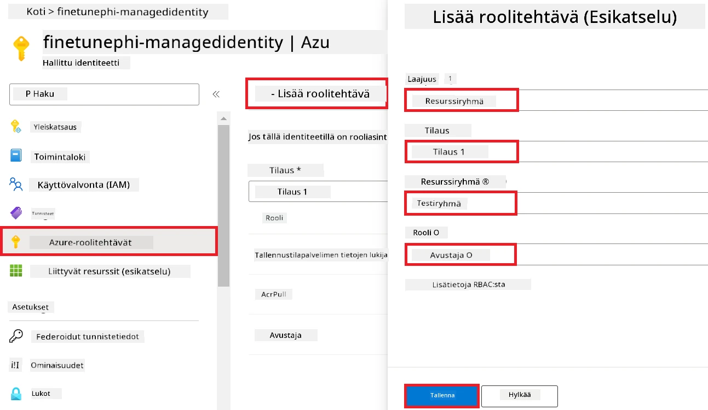

2. Valitse **Tallenna**.

#### Lisää Storage Blob Data Reader -roolimääritys hallittuun identiteettiin

1. Kirjoita *storage accounts* **hakupalkkiin** portaalisivun yläosassa ja valitse vaihtoehdoista **Storage accounts**.

    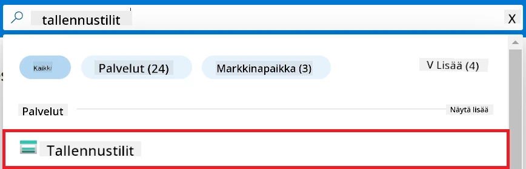

1. Valitse tallennustili, joka liittyy luomaasi Azure Machine Learning -työtilaan. Esimerkiksi *finetunephistorage*.

1. Suorita seuraavat tehtävät siirtyäksesi Lisää roolimääritys -sivulle:

    - Siirry luomaasi Azure Storage -tilille.
    - Valitse vasemman puolen välilehdeltä **Access Control (IAM)**.
    - Valitse navigointivalikosta **+ Lisää**.
    - Valitse navigointivalikosta **Lisää roolimääritys**.

    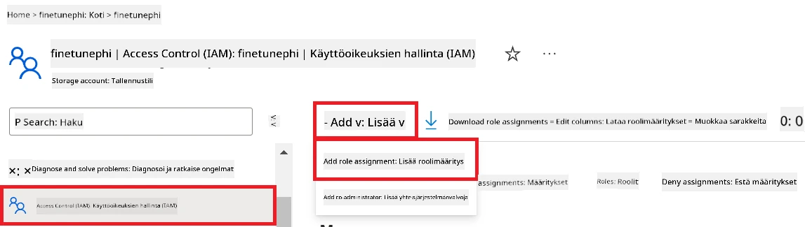

1. Lisää roolimäärityssivulla suorita seuraavat tehtävät:

    - Roolisivulla kirjoita **Storage Blob Data Reader** **hakupalkkiin** ja valitse **Storage Blob Data Reader** vaihtoehdoista.
    - Roolisivulla valitse **Seuraava**.
    - Jäsenet-sivulla valitse **Määritä käyttöoikeus** arvoksi **Hallittu identiteetti**.
    - Jäsenet-sivulla valitse **+ Valitse jäsenet**.
    - Valitse Hallitut identiteetit -sivulla Azure-tilauksesi **Tilauksesi**.
    - Valitse Hallitut identiteetit -sivulla valitse **Hallittu identiteetti**.
    - Valitse Hallitut identiteetit -sivulla luomasi hallittu identiteetti. Esimerkiksi *finetunephi-managedidentity*.
    - Valitse Hallitut identiteetit -sivulla **Valitse**.

    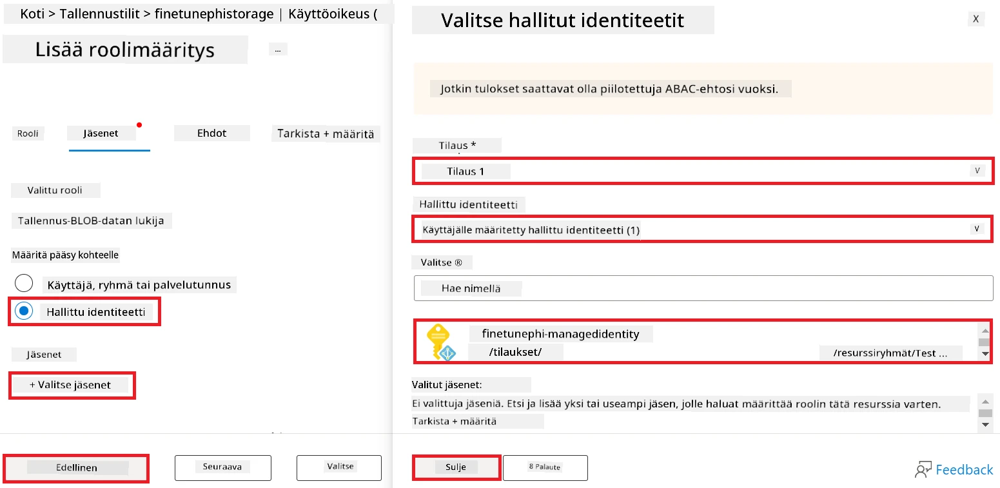

1. Valitse **Tarkista + määritä**.

#### Lisää AcrPull-rooli hallittuun identiteettiin

1. Kirjoita *container registries* **hakupalkkiin** portaalisivun yläosassa ja valitse vaihtoehdoista **Container registries**.

    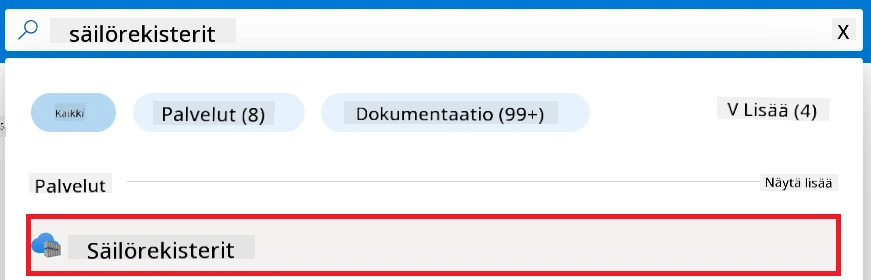

1. Valitse Azure Machine Learning -työtilaan liitetty konttirekisteri. Esimerkiksi *finetunephicontainerregistry*

1. Suorita seuraavat tehtävät siirtyäksesi Lisää roolimääritys -sivulle:

    - Valitse vasemman puolen välilehdeltä **Access Control (IAM)**.
    - Valitse navigointivalikosta **+ Lisää**.
    - Valitse navigointivalikosta **Lisää roolimääritys**.

1. Lisää roolimäärityssivulla suorita seuraavat tehtävät:

    - Roolisivulla kirjoita **AcrPull** **hakupalkkiin** ja valitse **AcrPull** vaihtoehdoista.
    - Roolisivulla valitse **Seuraava**.
    - Jäsenet-sivulla valitse **Määritä käyttöoikeus** arvoksi **Hallittu identiteetti**.
    - Jäsenet-sivulla valitse **+ Valitse jäsenet**.
    - Valitse Hallitut identiteetit -sivulla Azure-tilauksesi **Tilauksesi**.
    - Valitse Hallitut identiteetit -sivulla valitse **Hallittu identiteetti**.
    - Valitse Hallitut identiteetit -sivulla luomasi hallittu identiteetti. Esimerkiksi *finetunephi-managedidentity*.
    - Valitse Hallitut identiteetit -sivulla **Valitse**.
    - Valitse **Tarkista + määritä**.

### Projektin asennus

Ladataksesi hienosäätöön tarvittavat tietojoukot, asennat paikallisen ympäristön.

Tässä harjoituksessa teet seuraavat asiat:

- Luo kansio, johon työskentelet.
- Luo virtuaaliympäristö.
- Asenna tarvittavat paketit.
- Luo *download_dataset.py* tiedosto tietojoukon lataamista varten.

#### Luo kansio, johon työskentelet

1. Avaa terminaali-ikkuna ja kirjoita seuraava komento luodaksesi kansion nimeltä *finetune-phi* oletuspolkuun.

    ```console
    mkdir finetune-phi
    ```

2. Kirjoita seuraava komento terminaaliisi siirtyäksesi äsken luomaasi *finetune-phi* -kansioon.

    ```console
    cd finetune-phi
    ```

#### Luo virtuaaliympäristö

1. Kirjoita seuraava komento terminaaliisi luodaksesi virtuaaliympäristön nimeltä *.venv*.
    ```console
    python -m venv .venv
    ```

2. Kirjoita seuraava komento terminaaliisi aktivoidaksesi virtuaaliympäristön.

    ```console
    .venv\Scripts\activate.bat
    ```

> [!NOTE]
> Jos se onnistui, sinun pitäisi nähdä *(.venv)* ennen komentokehotetta.

#### Asenna vaaditut paketit

1. Kirjoita seuraavat komennot terminaaliisi asentaaksesi vaaditut paketit.

    ```console
    pip install datasets==2.19.1
    ```

#### Luo `donload_dataset.py`

> [!NOTE]
> Täydellinen kansiorakenne:
>
> ```text
> └── YourUserName
> .    └── finetune-phi
> .        └── download_dataset.py
> ```

1. Avaa **Visual Studio Code**.

1. Valitse valikkoriviltä **File**.

1. Valitse **Open Folder**.

1. Valitse *finetune-phi*-kansio, jonka loit, ja joka sijaitsee polussa *C:\Users\yourUserName\finetune-phi*.

    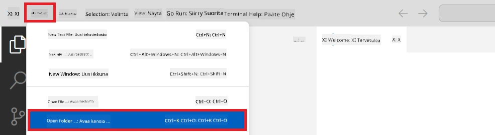

1. Visual Studio Coden vasemmassa paneelissa napsauta hiiren oikealla ja valitse **New File** luodaksesi uuden tiedoston nimeltään *download_dataset.py*.

    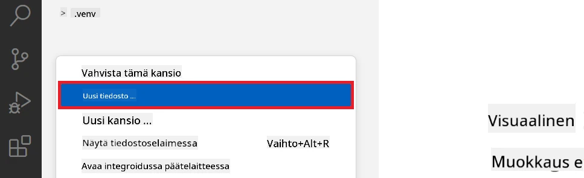

### Valmistele aineisto hienosäätöä varten

Tässä harjoituksessa suoritat *download_dataset.py* -tiedoston ladataksesi *ultrachat_200k* -aineistot paikalliseen ympäristöösi. Käytät näitä aineistoja hienosäätämään Phi-3-mallia Azure Machine Learningissä.

Tässä harjoituksessa:

- Lisää koodi *download_dataset.py* -tiedostoon ladataksesi aineistot.
- Suorita *download_dataset.py* -tiedosto ladataksesi aineistot paikalliseen ympäristöösi.

#### Lataa aineisto *download_dataset.py* -tiedostolla

1. Avaa *download_dataset.py* -tiedosto Visual Studio Codessa.

1. Lisää seuraava koodi *download_dataset.py* -tiedostoon.

    ```python
    import json
    import os
    from datasets import load_dataset

    def load_and_split_dataset(dataset_name, config_name, split_ratio):
        """
        Load and split a dataset.
        """
        # Lataa tietoaineisto määritetyllä nimellä, kokoonpanolla ja jako-osuudella
        dataset = load_dataset(dataset_name, config_name, split=split_ratio)
        print(f"Original dataset size: {len(dataset)}")
        
        # Jaa tietoaineisto koulutus- ja testijoukkoihin (80 % koulutus, 20 % testaus)
        split_dataset = dataset.train_test_split(test_size=0.2)
        print(f"Train dataset size: {len(split_dataset['train'])}")
        print(f"Test dataset size: {len(split_dataset['test'])}")
        
        return split_dataset

    def save_dataset_to_jsonl(dataset, filepath):
        """
        Save a dataset to a JSONL file.
        """
        # Luo hakemisto, jos sitä ei ole olemassa
        os.makedirs(os.path.dirname(filepath), exist_ok=True)
        
        # Avaa tiedosto kirjoitustilassa
        with open(filepath, 'w', encoding='utf-8') as f:
            # Käy läpi jokainen tietue tietoaineistossa
            for record in dataset:
                # Tallenna tietue JSON-objektina ja kirjoita se tiedostoon
                json.dump(record, f)
                # Kirjoita rivinvaihtomerkki tietueiden erottamiseksi
                f.write('\n')
        
        print(f"Dataset saved to {filepath}")

    def main():
        """
        Main function to load, split, and save the dataset.
        """
        # Lataa ja jaa ULTRACHAT_200k-tietoaineisto erityisellä kokoonpanolla ja jako-osuudella
        dataset = load_and_split_dataset("HuggingFaceH4/ultrachat_200k", 'default', 'train_sft[:1%]')
        
        # Erottele koulutus- ja testijoukot jaosta
        train_dataset = dataset['train']
        test_dataset = dataset['test']

        # Tallenna koulutusjoukko JSONL-tiedostoon
        save_dataset_to_jsonl(train_dataset, "data/train_data.jsonl")
        
        # Tallenna testijoukko erilliseen JSONL-tiedostoon
        save_dataset_to_jsonl(test_dataset, "data/test_data.jsonl")

    if __name__ == "__main__":
        main()

    ```

1. Kirjoita seuraava komento terminaaliisi ajaaksesi skriptin ja ladataksesi aineiston paikalliseen ympäristöösi.

    ```console
    python download_dataset.py
    ```

1. Varmista, että aineistot tallentuivat onnistuneesti paikalliseen *finetune-phi/data* -hakemistoon.

> [!NOTE]
>
> #### Huomautus aineiston koosta ja hienosäätöajan kestosta
>
> Tässä ohjeessa käytät vain 1 % aineistosta (`split='train[:1%]'`). Tämä pienentää merkittävästi datan määrää, nopeuttaen sekä lataus- että hienosäätöprosesseja. Voit säätää prosenttiosuutta löytääksesi oikean tasapainon koulutusajan ja mallin suorituskyvyn välillä. Vähemmän dataa käyttämällä hienosäätöaika lyhenee, mikä tekee prosessista hallittavamman tälle ohjeelle.

## Tapaus 2: Hienosäädä Phi-3-malli ja ota käyttöön Azure Machine Learning Studiossa

### Hienosäädä Phi-3-malli

Tässä harjoituksessa hienosäätät Phi-3-mallia Azure Machine Learning Studiossa.

Tässä harjoituksessa:

- Luo laskentaklusteri hienosäätöä varten.
- Hienosäädä Phi-3-malli Azure Machine Learning Studiossa.

#### Luo laskentaklusteri hienosäätöä varten

1. Käy osoitteessa [Azure ML Studio](https://ml.azure.com/home?wt.mc_id=studentamb_279723).

1. Valitse vasemman puolen välilehdeltä **Compute**.

1. Valitse navigointivalikosta **Compute clusters**.

1. Valitse **+ New**.

    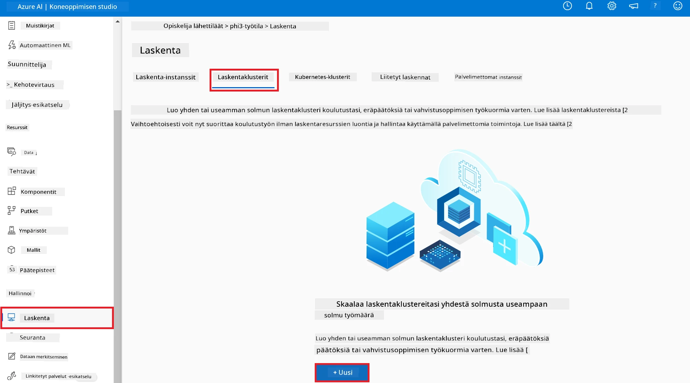

1. Suorita seuraavat tehtävät:

    - Valitse haluamasi **Region**.
    - Valitse **Virtual machine tier** arvoksi **Dedicated**.
    - Valitse **Virtual machine type** arvoksi **GPU**.
    - Valitse **Virtual machine size** -suodattimeksi **Select from all options**.
    - Valitse **Virtual machine size** arvoksi **Standard_NC24ads_A100_v4**.

    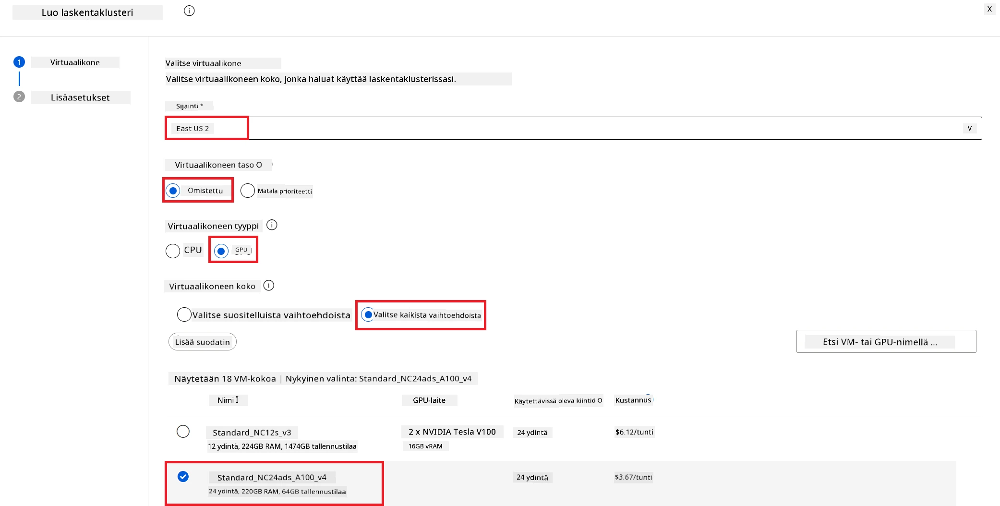

1. Valitse **Next**.

1. Suorita seuraavat tehtävät:

    - Kirjoita **Compute name**. Sen täytyy olla yksilöllinen arvo.
    - Valitse **Minimum number of nodes** arvoksi **0**.
    - Valitse **Maximum number of nodes** arvoksi **1**.
    - Valitse **Idle seconds before scale down** arvoksi **120**.

    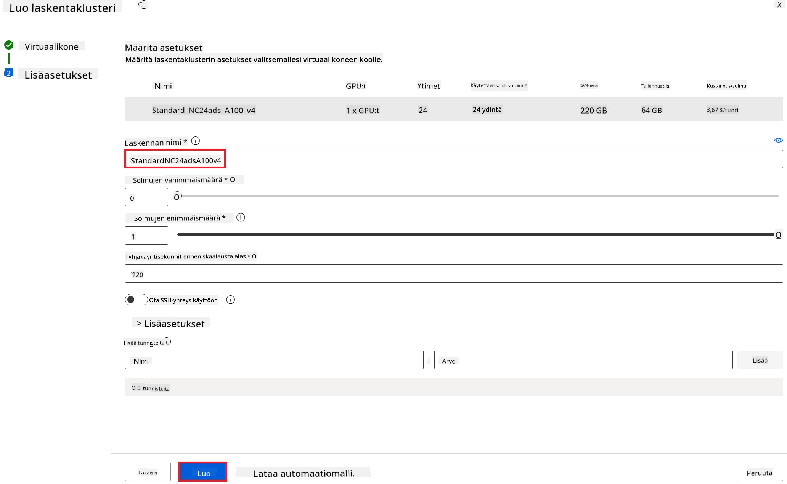

1. Valitse **Create**.

#### Hienosäädä Phi-3-malli

1. Käy osoitteessa [Azure ML Studio](https://ml.azure.com/home?wt.mc_id=studentamb_279723).

1. Valitse luomasi Azure Machine Learning -työtila.

    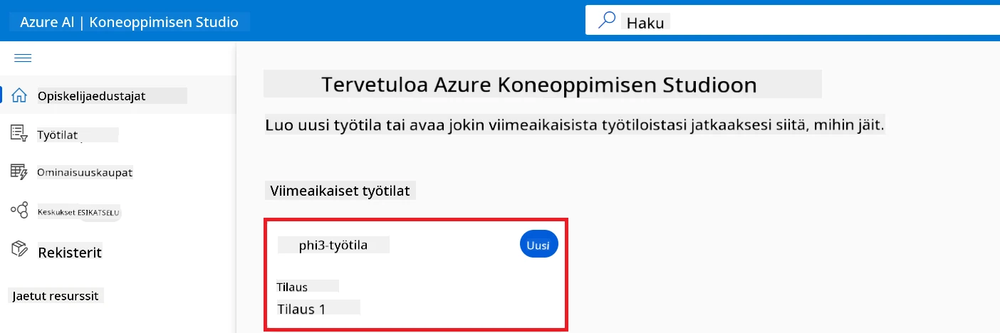

1. Suorita seuraavat tehtävät:

    - Valitse vasemman puolen välilehdeltä **Model catalog**.
    - Kirjoita **hakuikkunaan** *phi-3-mini-4k* ja valitse esiin tulevista vaihtoehdoista **Phi-3-mini-4k-instruct**.

    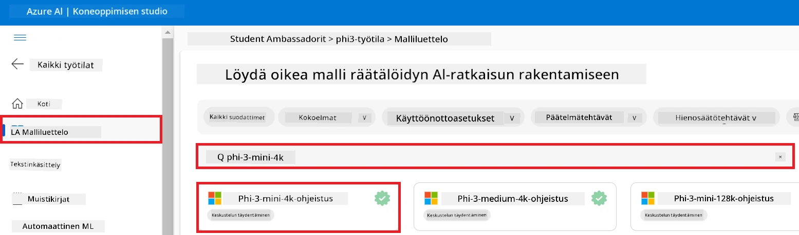

1. Valitse navigointivalikosta **Fine-tune**.

    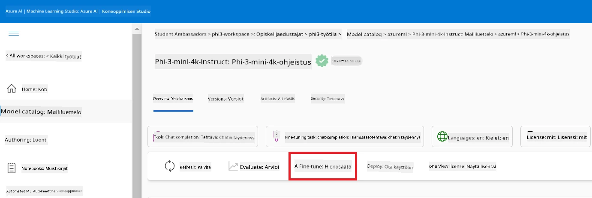

1. Suorita seuraavat tehtävät:

    - Valitse **Select task type** arvoksi **Chat completion**.
    - Valitse **+ Select data** ladataksesi **Koulutusdataa**.
    - Valitse validoivan datan lataustavaksi **Provide different validation data**.
    - Valitse **+ Select data** ladataksesi **Validointidataa**.

    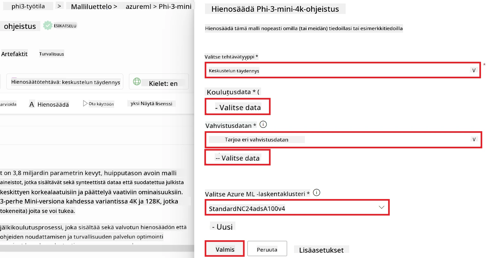

> [!TIP]
>
> Voit valita **Advanced settings** mukauttaaksesi asetuksia, kuten **learning_rate** ja **lr_scheduler_type**, optimoidaksesi hienosäätöprosessia tarpeidesi mukaan.

1. Valitse **Finish**.

1. Tässä harjoituksessa hienosäätö Phi-3-mallille onnistui Azure Machine Learningissa. Huomioithan, että hienosäätöprosessi voi kestää merkittävästi aikaa. Kun olet käynnistänyt hienosäätötyön, sinun on odotettava sen valmistumista. Voit seurata työn tilaa siirtymällä Jobs-välilehdelle Azure Machine Learning -työtilassa vasemmalla puolella. Seuraavassa osassa otat hienosäädetyn mallin käyttöön ja yhdistät sen Prompt flow'hun.

    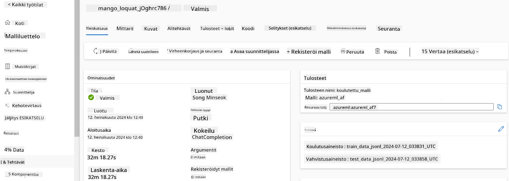

### Ota hienosäädetty Phi-3-malli käyttöön

Jotta voit yhdistää hienosäädetyn Phi-3-mallin Prompt flow'hun, sinun täytyy ottaa malli käyttöön, jotta sitä voi kutsua reaaliaikaisesti. Tämä sisältää mallin rekisteröimisen, online-päätepisteen luomisen ja mallin käyttöönoton.

Tässä harjoituksessa:

- Rekisteröi hienosäädetty malli Azure Machine Learning -työtilaan.
- Luo online-päätepiste.
- Ota käyttöön rekisteröity hienosäädetty Phi-3-malli.

#### Rekisteröi hienosäädetty malli

1. Käy osoitteessa [Azure ML Studio](https://ml.azure.com/home?wt.mc_id=studentamb_279723).

1. Valitse luomasi Azure Machine Learning -työtila.

    

1. Valitse vasemman puolen välilehdeltä **Models**.
1. Valitse **+ Register**.
1. Valitse **From a job output**.

    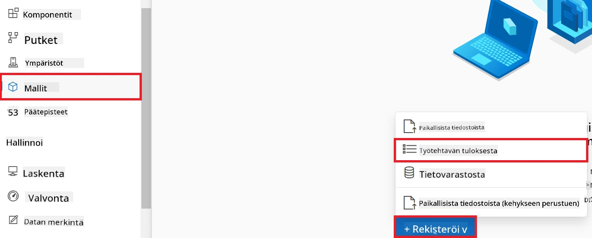

1. Valitse luomasi työ.

    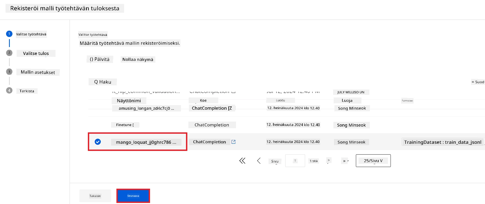

1. Valitse **Next**.

1. Valitse **Model type** arvoksi **MLflow**.

1. Varmista, että **Job output** on valittuna; sen pitäisi olla automaattisesti valittuna.

    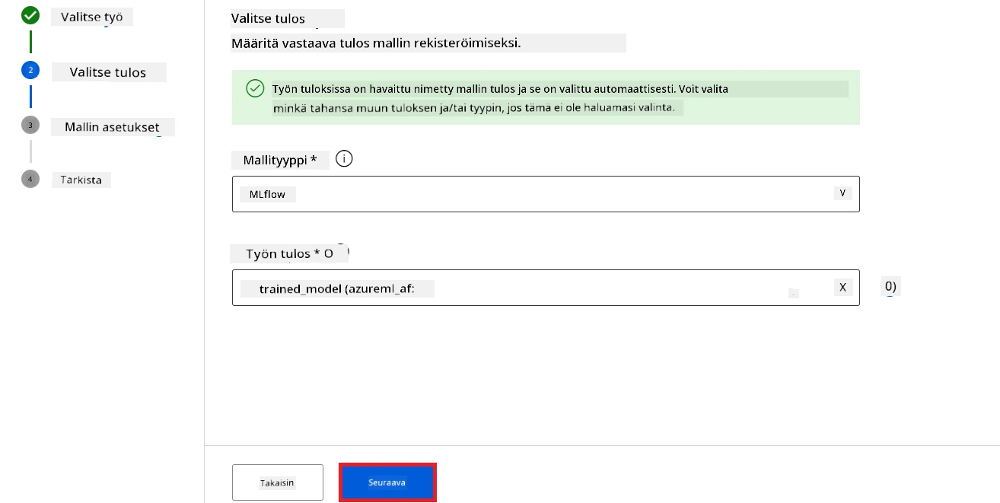

2. Valitse **Next**.

3. Valitse **Register**.

    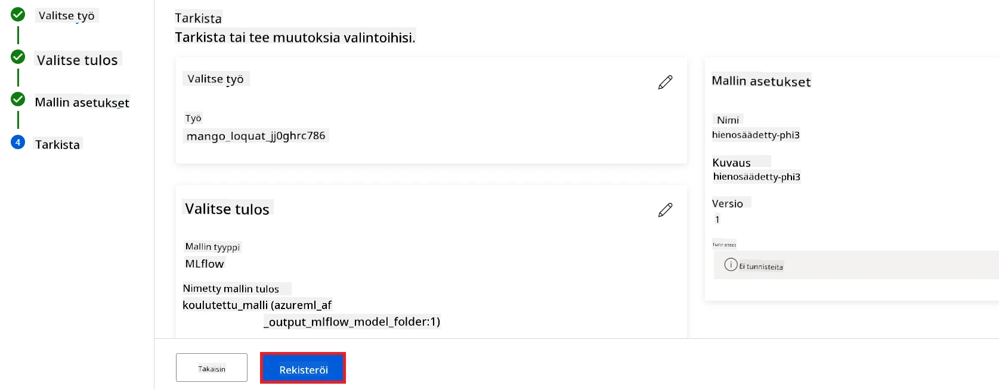

4. Näet rekisteröidyn mallisi valitsemalla vasemman puolen välilehdeltä **Models**.

    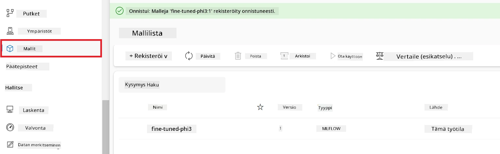

#### Ota hienosäädetty malli käyttöön

1. Siirry luomaasi Azure Machine Learning -työtilaan.

1. Valitse vasemman puolen välilehdeltä **Endpoints**.

1. Valitse navigointivalikosta **Real-time endpoints**.

    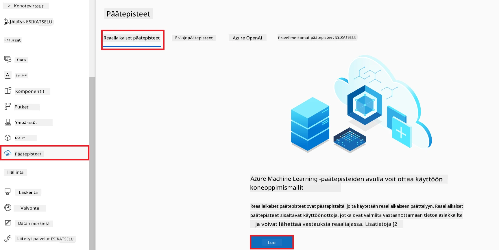

1. Valitse **Create**.

1. Valitse luomasi rekisteröity malli.

    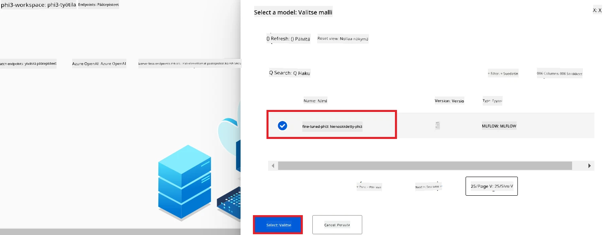

1. Valitse **Select**.

1. Suorita seuraavat tehtävät:

    - Valitse **Virtual machine** arvoksi *Standard_NC6s_v3*.
    - Valitse haluamasi **Instance count**. Esimerkiksi *1*.
    - Valitse **Endpoint** arvoksi **New** luodaksesi uuden päätepisteen.
    - Kirjoita **Endpoint name**. Sen täytyy olla yksilöllinen.
    - Kirjoita **Deployment name**. Sen täytyy olla yksilöllinen.

    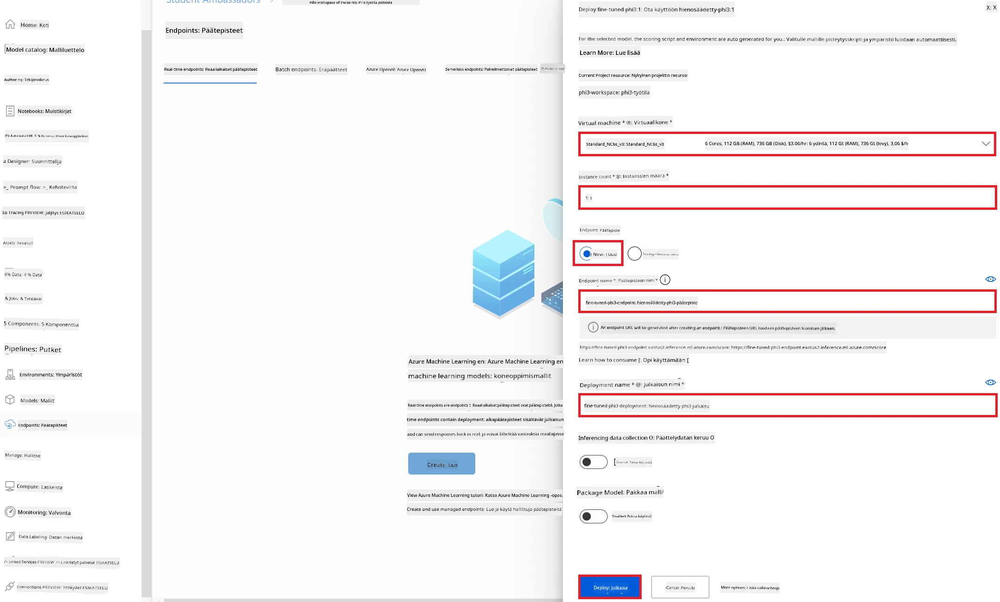

1. Valitse **Deploy**.

> [!WARNING]
> Välttääksesi ylimääräiset maksut, muista poistaa luotu päätepiste Azure Machine Learning -työtilasta.
>

#### Tarkista käyttöönoton tila Azure Machine Learning -työtilassa

1. Siirry luomaasi Azure Machine Learning -työtilaan.

1. Valitse vasemman puolen välilehdeltä **Endpoints**.

1. Valitse luomasi päätepiste.

    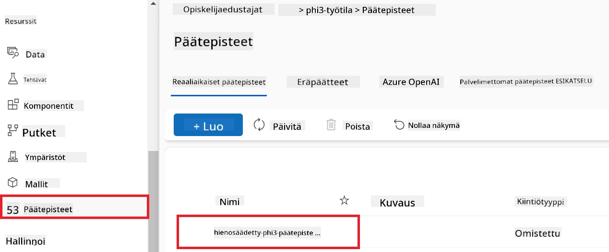

1. Tällä sivulla voit hallita päätepisteitä käyttöönoton aikana.

> [!NOTE]
> Kun käyttöönotto on valmis, varmista, että **Live traffic** on asetettu arvoon **100 %**. Jos näin ei ole, valitse **Update traffic** säätääksesi liikennettä. Huomaa, että mallia ei voi testata, jos liikenne on asetettu nollaan.
>
> 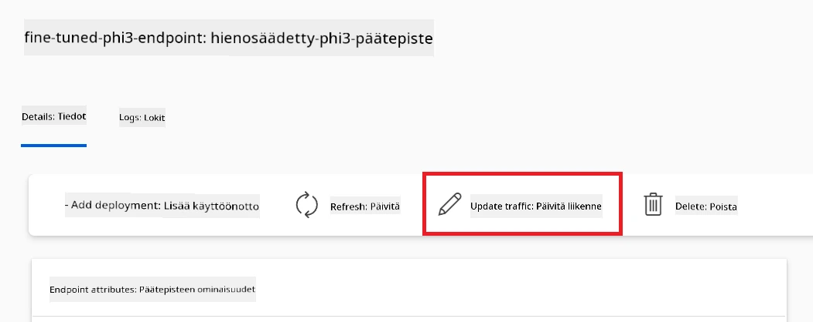
>

## Tapaus 3: Yhdistä Prompt flow'hun ja keskustele mukautetulla mallillasi Microsoft Foundryssä

### Yhdistä mukautettu Phi-3-malli Prompt flow'hun

Onnistuneen käyttöönoton jälkeen voit nyt yhdistää hienosäädetyn mallisi Prompt Flow'hun käyttääksesi malliasi reaaliaikaisissa sovelluksissa, mikä mahdollistaa monenlaiset vuorovaikutteiset tehtävät mukautetulla Phi-3-mallillasi.

Tässä harjoituksessa:

- Luo Microsoft Foundry Hub.
- Luo Microsoft Foundry Project.
- Luo Prompt flow.
- Lisää mukautettu yhteys hienosäädetylle Phi-3-mallille.
- Määritä Prompt flow keskustelemaan mukautetun Phi-3-mallisi kanssa.

> [!NOTE]
> Voit myös integroida Promptflow'n Azure ML Studiossa. Sama integraatioprosessi voidaan soveltaa Azure ML Studioon.

#### Luo Microsoft Foundry Hub

Sinun täytyy luoda Hub ennen Projectin luontia. Hub toimii kuin resurssiryhmä, jonka avulla voit järjestää ja hallita useita Projekteja Microsoft Foundryssä.
1. Käy osoitteessa [Microsoft Foundry](https://ai.azure.com/?WT.mc_id=aiml-137032-kinfeylo).

1. Valitse vasemman sivun välilehdeltä **All hubs**.

1. Valitse navigaatiovalikosta **+ New hub**.

    

1. Suorita seuraavat tehtävät:

    - Kirjoita **Hub name**. Sen on oltava yksilöllinen arvo.
    - Valitse Azure-tilauksesi **Subscription**.
    - Valitse käytettävä **Resource group** (luo uusi tarvittaessa).
    - Valitse käytettävä **Location**.
    - Valitse käytettävät **Connect Azure AI Services** (luo uusi tarvittaessa).
    - Valitse **Connect Azure AI Search** ja valitse **Skip connecting**.

    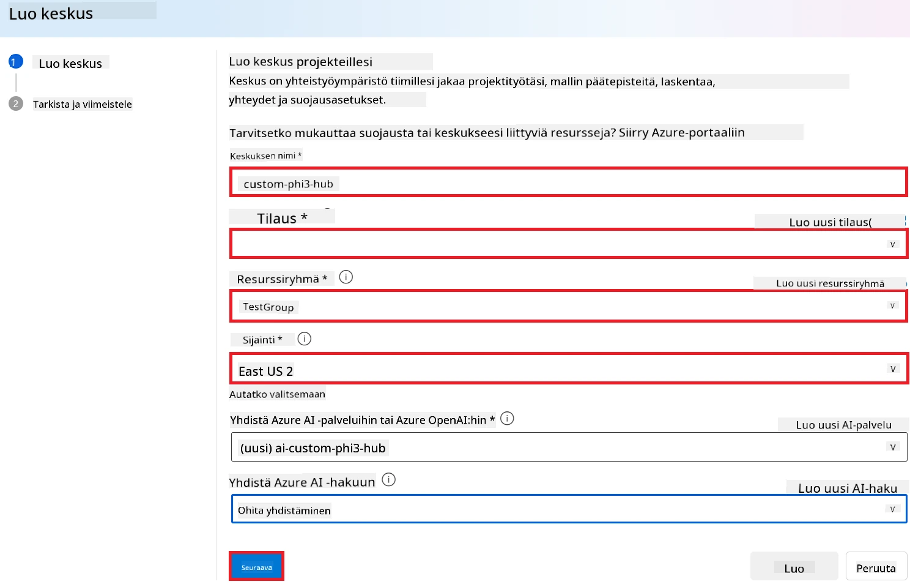

1. Valitse **Next**.

#### Luo Microsoft Foundry -projekti

1. Luomassasi Hubissa valitse vasemman sivun välilehdeltä **All projects**.

1. Valitse navigaatiovalikosta **+ New project**.

    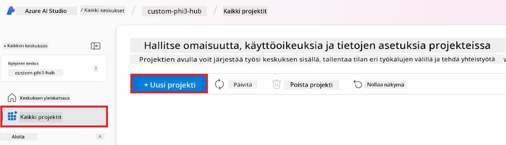

1. Kirjoita **Project name**. Sen on oltava yksilöllinen arvo.

    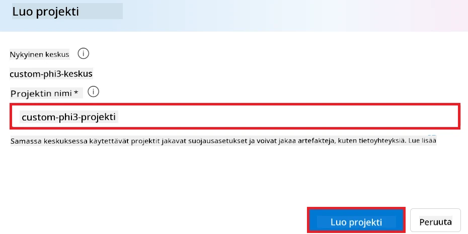

1. Valitse **Create a project**.

#### Lisää mukautettu yhteys hienosäädetylle Phi-3-mallille

Jotta voit integroida mukautetun Phi-3-mallisi Prompt flow'hun, sinun täytyy tallentaa mallin päätepiste ja avain mukautettuun yhteyteen. Tämä varmistaa pääsyn mukautettuun Phi-3-malliisi Prompt flow'ssa.

#### Aseta hienosäädetyn Phi-3-mallin api-avain ja päätepisteen uri

1. Käy osoitteessa [Azure ML Studio](https://ml.azure.com/home?WT.mc_id=aiml-137032-kinfeylo).

1. Siirry luomaasi Azure Machine Learning -työtilaan.

1. Valitse vasemman sivun välilehdeltä **Endpoints**.

    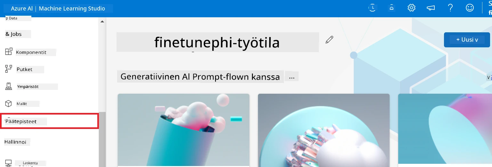

1. Valitse luomasi päätepiste.

    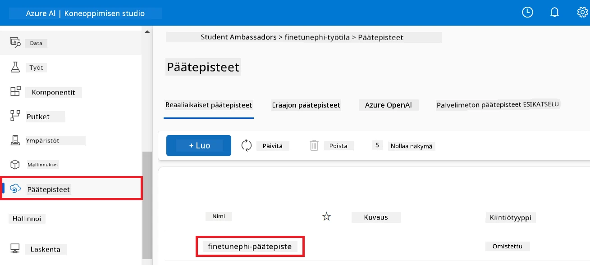

1. Valitse navigaatiovalikosta **Consume**.

1. Kopioi **REST endpoint** ja **Primary key**.

    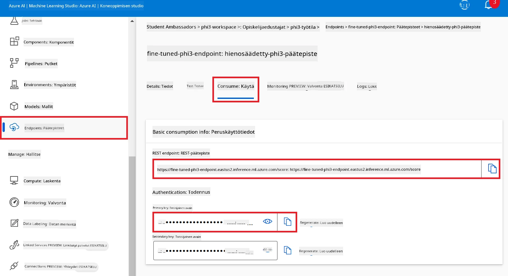

#### Lisää mukautettu yhteys

1. Käy osoitteessa [Microsoft Foundry](https://ai.azure.com/?WT.mc_id=aiml-137032-kinfeylo).

1. Siirry luomaasi Microsoft Foundry -projektiin.

1. Luomassasi projektissa valitse vasemman sivun välilehdeltä **Settings**.

1. Valitse **+ New connection**.

    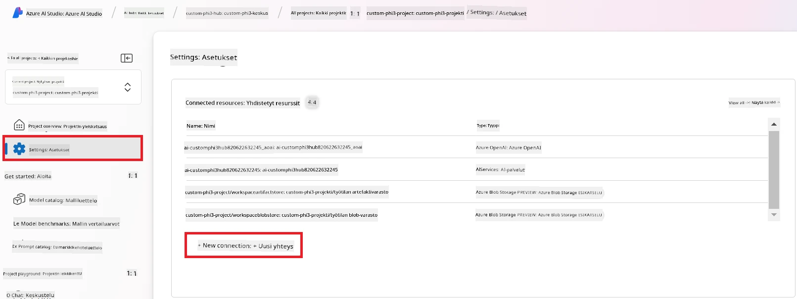

1. Valitse navigaatiovalikosta **Custom keys**.

    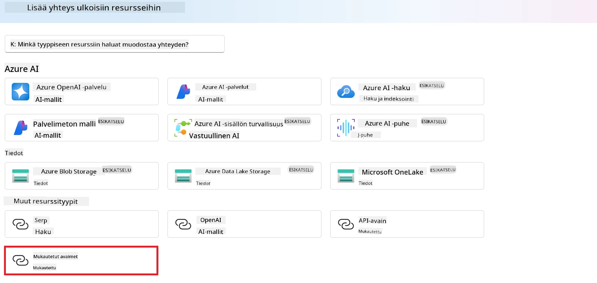

1. Suorita seuraavat tehtävät:

    - Valitse **+ Add key value pairs**.
    - Kirjoita avaimen nimeksi **endpoint** ja liitä Azure ML Studiosta kopioimasi päätepiste arvokenttään.
    - Valitse uudelleen **+ Add key value pairs**.
    - Kirjoita avaimen nimeksi **key** ja liitä Azure ML Studiosta kopioimasi avain arvokenttään.
    - Avaintehtävän lisäämisen jälkeen valitse **is secret** estääksesi avaimen paljastumisen.

    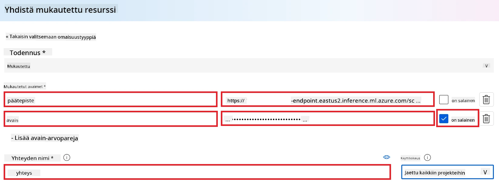

1. Valitse **Add connection**.

#### Luo Prompt flow

Olet lisännyt mukautetun yhteyden Microsoft Foundryssa. Luodaan nyt Prompt flow seuraavien vaiheiden avulla. Sen jälkeen yhdistät tämän Prompt flow'n mukautettuun yhteyteen, jotta voit käyttää hienosäädettyä mallia Prompt flow'ssa.

1. Siirry luomaasi Microsoft Foundry -projektiin.

1. Valitse vasemman sivun välilehdeltä **Prompt flow**.

1. Valitse navigaatiovalikosta **+ Create**.

    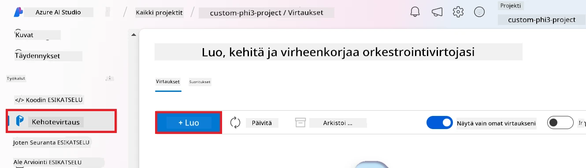

1. Valitse navigaatiovalikosta **Chat flow**.

    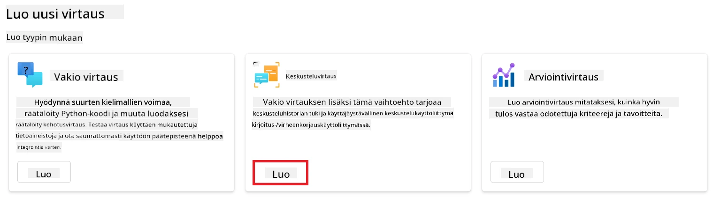

1. Kirjoita käytettävä **Folder name**.

    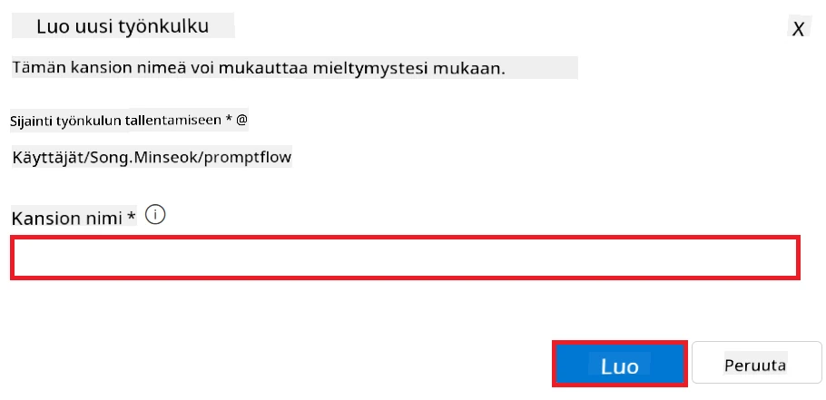

2. Valitse **Create**.

#### Määritä Prompt flow keskustelemaan mukautetun Phi-3-mallisi kanssa

Sinun on integroitava hienosäädetty Phi-3-malli Prompt flow'hun. Kuitenkin nykyinen tarjolla oleva Prompt flow ei ole suunniteltu tätä tarkoitusta varten. Siksi sinun täytyy suunnitella Prompt flow uudelleen, jotta mukautettu malli voidaan integroida.

1. Prompt flow'ssa suorita seuraavat tehtävät rakentaaksesi olemassa oleva flow uudelleen:

    - Valitse **Raw file mode**.
    - Poista kaikki olemassa oleva koodi tiedostosta *flow.dag.yml*.
    - Lisää seuraava koodi tiedostoon *flow.dag.yml*.

        ```yml
        inputs:
          input_data:
            type: string
            default: "Who founded Microsoft?"

        outputs:
          answer:
            type: string
            reference: ${integrate_with_promptflow.output}

        nodes:
        - name: integrate_with_promptflow
          type: python
          source:
            type: code
            path: integrate_with_promptflow.py
          inputs:
            input_data: ${inputs.input_data}
        ```

    - Valitse **Save**.

    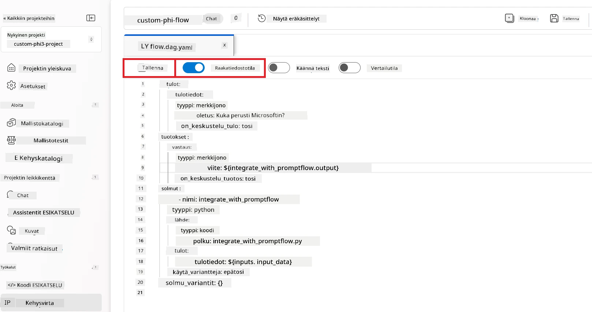

1. Lisää seuraava koodi tiedostoon *integrate_with_promptflow.py* käyttääksesi mukautettua Phi-3-mallia Prompt flow'ssa.

    ```python
    import logging
    import requests
    from promptflow import tool
    from promptflow.connections import CustomConnection

    # Lokituksen asetukset
    logging.basicConfig(
        format="%(asctime)s - %(levelname)s - %(name)s - %(message)s",
        datefmt="%Y-%m-%d %H:%M:%S",
        level=logging.DEBUG
    )
    logger = logging.getLogger(__name__)

    def query_phi3_model(input_data: str, connection: CustomConnection) -> str:
        """
        Send a request to the Phi-3 model endpoint with the given input data using Custom Connection.
        """

        # "connection" on Custom Connectionin nimi, "endpoint", "key" ovat avaimet Custom Connectionissa
        endpoint_url = connection.endpoint
        api_key = connection.key

        headers = {
            "Content-Type": "application/json",
            "Authorization": f"Bearer {api_key}"
        }
        data = {
            "input_data": {
                "input_string": [
                    {"role": "user", "content": input_data}
                ],
                "parameters": {
                    "temperature": 0.7,
                    "max_new_tokens": 128
                }
            }
        }
        try:
            response = requests.post(endpoint_url, json=data, headers=headers)
            response.raise_for_status()
            
            # Kirjaa koko JSON-vastaus
            logger.debug(f"Full JSON response: {response.json()}")

            result = response.json()["output"]
            logger.info("Successfully received response from Azure ML Endpoint.")
            return result
        except requests.exceptions.RequestException as e:
            logger.error(f"Error querying Azure ML Endpoint: {e}")
            raise

    @tool
    def my_python_tool(input_data: str, connection: CustomConnection) -> str:
        """
        Tool function to process input data and query the Phi-3 model.
        """
        return query_phi3_model(input_data, connection)

    ```

    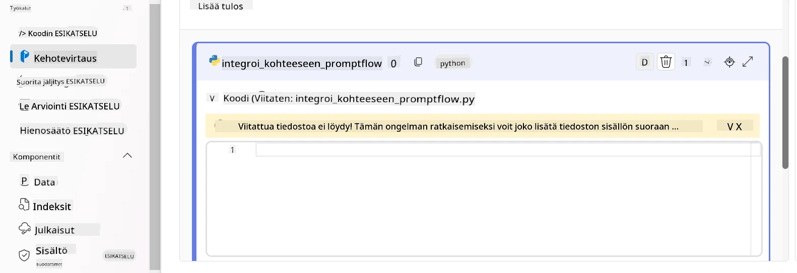

> [!NOTE]
> Lisätietoja Prompt flow'n käytöstä Microsoft Foundryssa löydät kohdasta [Prompt flow in Microsoft Foundry](https://learn.microsoft.com/azure/ai-studio/how-to/prompt-flow).

1. Valitse **Chat input**, **Chat output** ottaaksesi keskustelun käyttöön mallisi kanssa.

    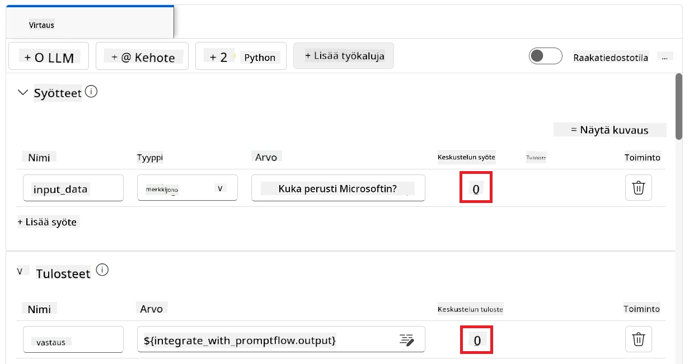

1. Nyt olet valmis keskustelemaan mukautetun Phi-3-mallisi kanssa. Seuraavassa harjoituksessa opit, kuinka käynnistää Prompt flow ja käyttää sitä keskusteluun hienosäädetyn Phi-3-mallisi kanssa.

> [!NOTE]
>
> Uudelleen rakennettu flow näyttää alla olevalta kuvalta:
>
> 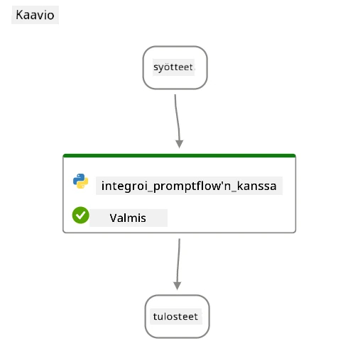
>

### Keskustele mukautetun Phi-3-mallisi kanssa

Nyt kun olet hienosäätänyt ja integroinut mukautetun Phi-3-mallisi Prompt flow'hun, olet valmis aloittamaan vuorovaikutuksen sen kanssa. Tämä harjoitus opastaa sinut läpi prosessin, jossa asetat ja käynnistät keskustelun mallisi kanssa Prompt flow'n avulla. Noudattamalla näitä ohjeita voit hyödyntää täysimääräisesti hienosäädetyn Phi-3-mallisi kykyjä eri tehtäviin ja keskusteluihin.

- Keskustele mukautetun Phi-3-mallisi kanssa käyttäen Prompt flow'ta.

#### Käynnistä Prompt flow

1. Valitse **Start compute sessions** aloittaaksesi Prompt flow'n.

    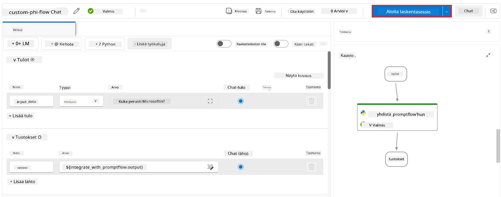

1. Valitse **Validate and parse input** päivittääksesi parametrit.

    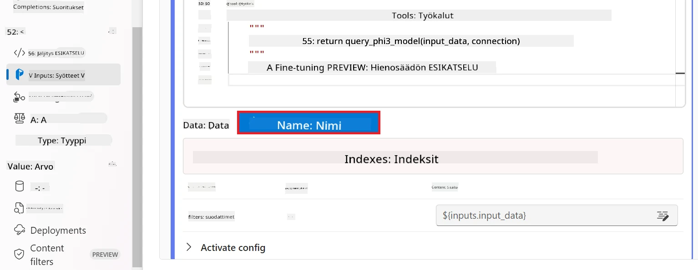

1. Valitse **connection** -arvo mukautetulle yhteydelle, jonka loit. Esimerkiksi *connection*.

    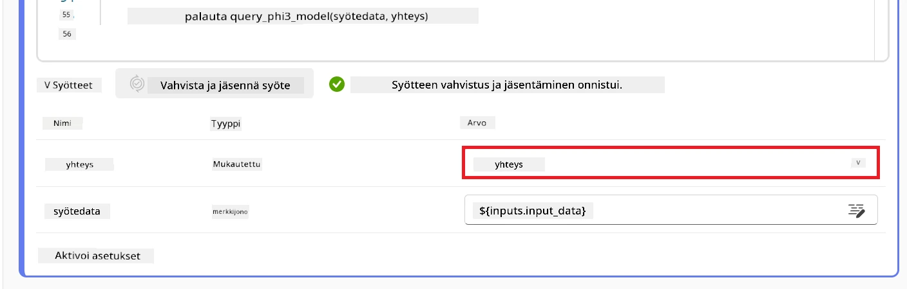

#### Keskustele mukautetun mallisi kanssa

1. Valitse **Chat**.

    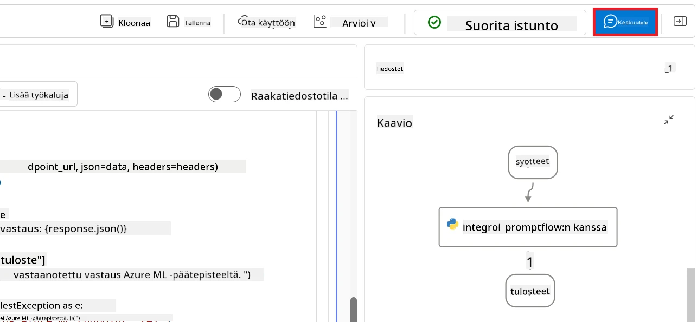

1. Tässä on esimerkki tuloksista: Nyt voit keskustella mukautetun Phi-3-mallisi kanssa. On suositeltavaa esittää kysymyksiä käytettyjen hienosäätötietojen perusteella.

    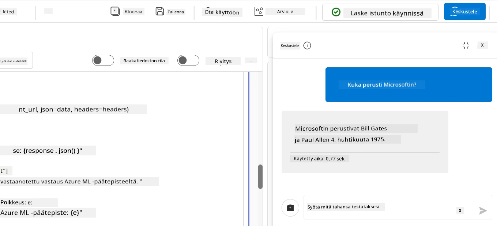

---

<!-- CO-OP TRANSLATOR DISCLAIMER START -->
**Vastuuvapauslauseke**:
Tämä asiakirja on käännetty käyttämällä tekoälypohjaista käännöspalvelua [Co-op Translator](https://github.com/Azure/co-op-translator). Vaikka pyrimme tarkkuuteen, otathan huomioon, että automaattiset käännökset saattavat sisältää virheitä tai epätarkkuuksia. Alkuperäistä asiakirjaa sen alkuperäisellä kielellä tulee pitää ensisijaisena lähteenä. Tärkeissä asioissa suositellaan ammattimaista ihmiskäännöstä. Emme ole vastuussa käännöksen käytöstä aiheutuvista väärinymmärryksistä tai virhetulkinnoista.
<!-- CO-OP TRANSLATOR DISCLAIMER END -->