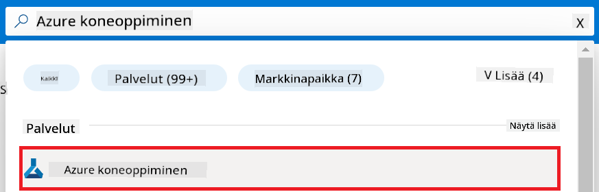
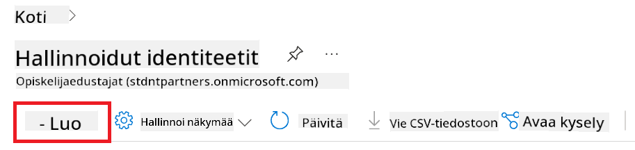
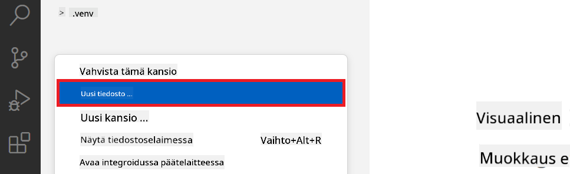
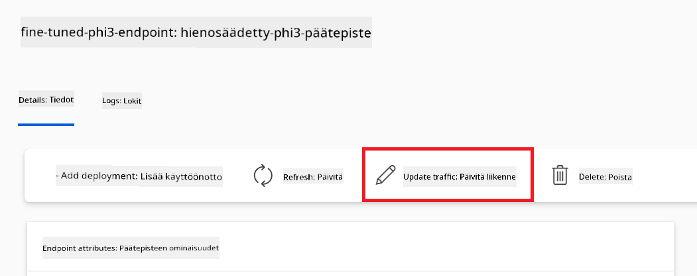
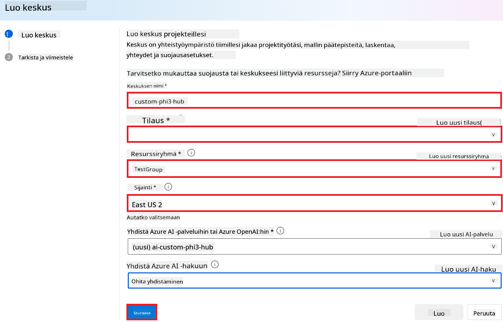
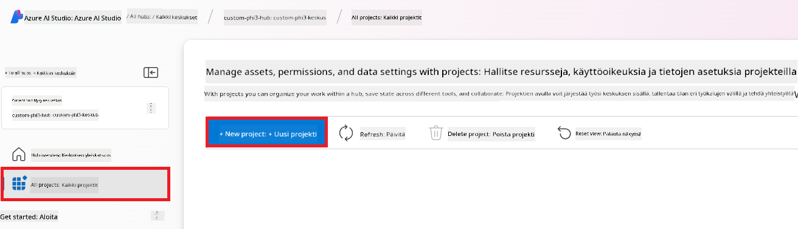
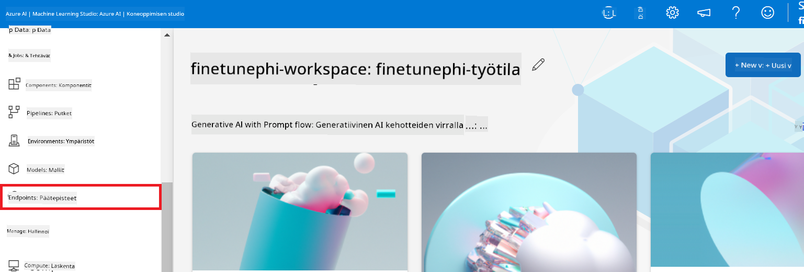
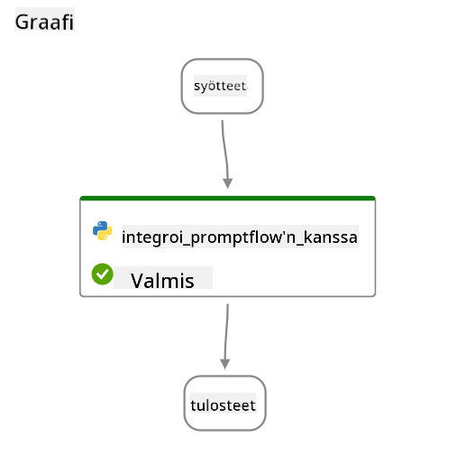
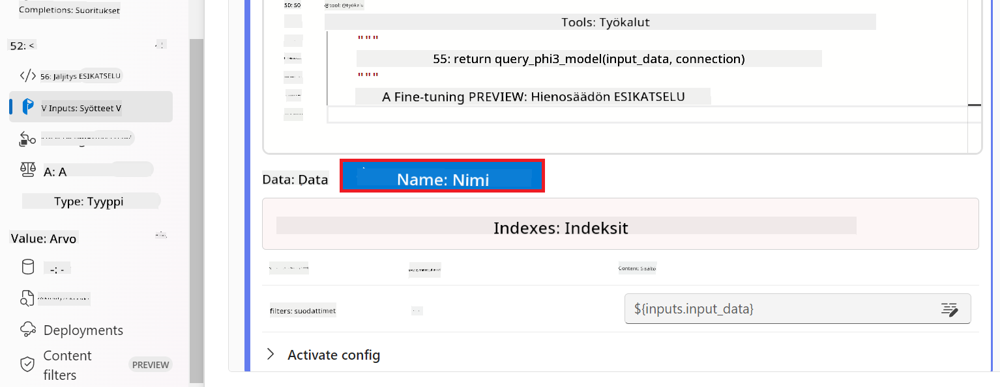

<!--
CO_OP_TRANSLATOR_METADATA:
{
  "original_hash": "ecbd9179a21edbaafaf114d47f09f3e3",
  "translation_date": "2025-07-17T01:36:35+00:00",
  "source_file": "md/02.Application/01.TextAndChat/Phi3/E2E_Phi-3-FineTuning_PromptFlow_Integration_AIFoundry.md",
  "language_code": "fi"
}
-->
# Hienosäädä ja integroi mukautetut Phi-3-mallit Prompt flow’n kanssa Azure AI Foundryssa

Tämä end-to-end (E2E) esimerkki perustuu Microsoft Tech Communityn oppaaseen "[Fine-Tune and Integrate Custom Phi-3 Models with Prompt Flow in Azure AI Foundry](https://techcommunity.microsoft.com/t5/educator-developer-blog/fine-tune-and-integrate-custom-phi-3-models-with-prompt-flow-in/ba-p/4191726?WT.mc_id=aiml-137032-kinfeylo)". Se esittelee mukautettujen Phi-3-mallien hienosäädön, käyttöönoton ja integroinnin Prompt flow’n kanssa Azure AI Foundryssa. Toisin kuin E2E-esimerkissä "[Fine-Tune and Integrate Custom Phi-3 Models with Prompt Flow](./E2E_Phi-3-FineTuning_PromptFlow_Integration.md)", jossa koodi ajettiin paikallisesti, tässä opetusohjelmassa keskitytään kokonaan mallin hienosäätöön ja integrointiin Azure AI / ML Studiolla.

## Yleiskatsaus

Tässä E2E-esimerkissä opit hienosäätämään Phi-3-mallin ja integroimaan sen Prompt flow’hun Azure AI Foundryssa. Hyödyntämällä Azure AI / ML Studiota luot työnkulun mukautettujen tekoälymallien käyttöönottoa ja hyödyntämistä varten. Tämä E2E-esimerkki on jaettu kolmeen skenaarioon:

**Skenaario 1: Azure-resurssien perustaminen ja valmistautuminen hienosäätöön**

**Skenaario 2: Phi-3-mallin hienosäätö ja käyttöönotto Azure Machine Learning Studiossa**

**Skenaario 3: Integrointi Prompt flow’hun ja keskustelu mukautetun mallisi kanssa Azure AI Foundryssa**

Tässä on yleiskatsaus tähän E2E-esimerkkiin.


### Sisällysluettelo

1. **[Skenaario 1: Azure-resurssien perustaminen ja valmistautuminen hienosäätöön](../../../../../../md/02.Application/01.TextAndChat/Phi3)**
    - [Luo Azure Machine Learning -työtila](../../../../../../md/02.Application/01.TextAndChat/Phi3)
    - [Pyydä GPU-kiintiöitä Azure-tilauksessa](../../../../../../md/02.Application/01.TextAndChat/Phi3)
    - [Lisää roolimääritys](../../../../../../md/02.Application/01.TextAndChat/Phi3)
    - [Perusta projekti](../../../../../../md/02.Application/01.TextAndChat/Phi3)
    - [Valmistele aineisto hienosäätöä varten](../../../../../../md/02.Application/01.TextAndChat/Phi3)

1. **[Skenaario 2: Phi-3-mallin hienosäätö ja käyttöönotto Azure Machine Learning Studiossa](../../../../../../md/02.Application/01.TextAndChat/Phi3)**
    - [Hienosäädä Phi-3-malli](../../../../../../md/02.Application/01.TextAndChat/Phi3)
    - [Ota hienosäädetty Phi-3-malli käyttöön](../../../../../../md/02.Application/01.TextAndChat/Phi3)

1. **[Skenaario 3: Integroi Prompt flow’hun ja keskustele mukautetun mallisi kanssa Azure AI Foundryssa](../../../../../../md/02.Application/01.TextAndChat/Phi3)**
    - [Integroi mukautettu Phi-3-malli Prompt flow’hun](../../../../../../md/02.Application/01.TextAndChat/Phi3)
    - [Keskustele mukautetun Phi-3-mallisi kanssa](../../../../../../md/02.Application/01.TextAndChat/Phi3)

## Skenaario 1: Azure-resurssien perustaminen ja valmistautuminen hienosäätöön

### Luo Azure Machine Learning -työtila

1. Kirjoita *azure machine learning* **hakupalkkiin** portaalin yläosassa ja valitse vaihtoehdoista **Azure Machine Learning**.

    

2. Valitse navigointivalikosta **+ Create**.

3. Valitse navigointivalikosta **New workspace**.

    

4. Suorita seuraavat tehtävät:

    - Valitse Azure-**Subscription**.
    - Valitse käytettävä **Resource group** (luo uusi tarvittaessa).
    - Syötä **Workspace Name**. Sen on oltava yksilöllinen.
    - Valitse haluamasi **Region**.
    - Valitse käytettävä **Storage account** (luo uusi tarvittaessa).
    - Valitse käytettävä **Key vault** (luo uusi tarvittaessa).
    - Valitse käytettävä **Application insights** (luo uusi tarvittaessa).
    - Valitse käytettävä **Container registry** (luo uusi tarvittaessa).

    

5. Valitse **Review + Create**.

6. Valitse **Create**.

### Pyydä GPU-kiintiöitä Azure-tilauksessa

Tässä opetusohjelmassa opit hienosäätämään ja ottamaan käyttöön Phi-3-mallin käyttäen GPU:ita. Hienosäätöön käytät *Standard_NC24ads_A100_v4* GPU:ta, johon tarvitaan kiintiöpyyntö. Käyttöönottoon käytät *Standard_NC6s_v3* GPU:ta, johon myös tarvitaan kiintiöpyyntö.

> [!NOTE]
>
> Vain Pay-As-You-Go -tilaukset (vakio-tilaus) ovat oikeutettuja GPU-varauksiin; etuustilaukset eivät tällä hetkellä ole tuettuja.
>

1. Siirry osoitteeseen [Azure ML Studio](https://ml.azure.com/home?wt.mc_id=studentamb_279723).

1. Suorita seuraavat toimet pyytääksesi *Standard NCADSA100v4 Family* -kiintiötä:

    - Valitse vasemman puolen välilehdeltä **Quota**.
    - Valitse käytettävä **Virtual machine family**. Esimerkiksi valitse **Standard NCADSA100v4 Family Cluster Dedicated vCPUs**, joka sisältää *Standard_NC24ads_A100_v4* GPU:n.
    - Valitse navigointivalikosta **Request quota**.

        

    - Pyynnön sivulla syötä haluamasi **New cores limit**. Esimerkiksi 24.
    - Pyynnön sivulla valitse **Submit** GPU-kiintiön pyytämiseksi.

1. Suorita seuraavat toimet pyytääksesi *Standard NCSv3 Family* -kiintiötä:

    - Valitse vasemman puolen välilehdeltä **Quota**.
    - Valitse käytettävä **Virtual machine family**. Esimerkiksi valitse **Standard NCSv3 Family Cluster Dedicated vCPUs**, joka sisältää *Standard_NC6s_v3* GPU:n.
    - Valitse navigointivalikosta **Request quota**.
    - Pyynnön sivulla syötä haluamasi **New cores limit**. Esimerkiksi 24.
    - Pyynnön sivulla valitse **Submit** GPU-kiintiön pyytämiseksi.

### Lisää roolimääritys

Mallien hienosäätöä ja käyttöönottoa varten sinun on ensin luotava User Assigned Managed Identity (UAI) ja annettava sille tarvittavat oikeudet. Tätä UAI:ta käytetään todennuksessa käyttöönoton aikana.

#### Luo User Assigned Managed Identity (UAI)

1. Kirjoita *managed identities* **hakupalkkiin** portaalin yläosassa ja valitse vaihtoehdoista **Managed Identities**.

    

1. Valitse **+ Create**.

    

1. Suorita seuraavat tehtävät:

    - Valitse Azure-**Subscription**.
    - Valitse käytettävä **Resource group** (luo uusi tarvittaessa).
    - Valitse haluamasi **Region**.
    - Syötä **Name**. Sen on oltava yksilöllinen.

    

1. Valitse **Review + create**.

1. Valitse **+ Create**.

#### Lisää Contributor-roolimääritys Managed Identitylle

1. Siirry luomaasi Managed Identity -resurssiin.

1. Valitse vasemman puolen välilehdeltä **Azure role assignments**.

1. Valitse navigointivalikosta **+Add role assignment**.

1. Lisää roolimäärityksen sivulla suorita seuraavat tehtävät:
    - Valitse **Scope** arvoksi **Resource group**.
    - Valitse Azure-**Subscription**.
    - Valitse käytettävä **Resource group**.
    - Valitse **Role** arvoksi **Contributor**.

    

2. Valitse **Save**.

#### Lisää Storage Blob Data Reader -roolimääritys Managed Identitylle

1. Kirjoita *storage accounts* **hakupalkkiin** portaalin yläosassa ja valitse vaihtoehdoista **Storage accounts**.

    

1. Valitse Azure Machine Learning -työtilaan liittyvä tallennustili, jonka loit. Esimerkiksi *finetunephistorage*.

1. Suorita seuraavat toimet siirtyäksesi Lisää roolimääritys -sivulle:

    - Siirry luomaasi Azure Storage -tiliin.
    - Valitse vasemman puolen välilehdeltä **Access Control (IAM)**.
    - Valitse navigointivalikosta **+ Add**.
    - Valitse navigointivalikosta **Add role assignment**.

    

1. Lisää roolimäärityksen sivulla suorita seuraavat tehtävät:

    - Roolisivulla kirjoita *Storage Blob Data Reader* **hakupalkkiin** ja valitse **Storage Blob Data Reader**.
    - Roolisivulla valitse **Next**.
    - Jäsenet-sivulla valitse **Assign access to** arvoksi **Managed identity**.
    - Jäsenet-sivulla valitse **+ Select members**.
    - Valitse Azure-**Subscription**.
    - Valitse **Managed identity** arvoksi **Manage Identity**.
    - Valitse luomasi Managed Identity, esimerkiksi *finetunephi-managedidentity*.
    - Valitse **Select**.

    

1. Valitse **Review + assign**.

#### Lisää AcrPull-roolimääritys Managed Identitylle

1. Kirjoita *container registries* **hakupalkkiin** portaalin yläosassa ja valitse vaihtoehdoista **Container registries**.

    

1. Valitse Azure Machine Learning -työtilaan liittyvä container registry, esimerkiksi *finetunephicontainerregistry*.

1. Suorita seuraavat toimet siirtyäksesi Lisää roolimääritys -sivulle:

    - Valitse vasemman puolen välilehdeltä **Access Control (IAM)**.
    - Valitse navigointivalikosta **+ Add**.
    - Valitse navigointivalikosta **Add role assignment**.

1. Lisää roolimäärityksen sivulla suorita seuraavat tehtävät:

    - Roolisivulla kirjoita *AcrPull* **hakupalkkiin** ja valitse **AcrPull**.
    - Roolisivulla valitse **Next**.
    - Jäsenet-sivulla valitse **Assign access to** arvoksi **Managed identity**.
    - Jäsenet-sivulla valitse **+ Select members**.
    - Valitse Azure-**Subscription**.
    - Valitse **Managed identity** arvoksi **Manage Identity**.
    - Valitse luomasi Managed Identity, esimerkiksi *finetunephi-managedidentity*.
    - Valitse **Select**.
    - Valitse **Review + assign**.

### Perusta projekti

Ladataksesi hienosäätöön tarvittavat aineistot, perustat paikallisen ympäristön.

Tässä harjoituksessa:

- Luot kansion, jossa työskentelet.
- Luot virtuaaliympäristön.
- Asennat tarvittavat paketit.
- Luot *download_dataset.py* -tiedoston aineiston lataamista varten.

#### Luo kansio, jossa työskentelet

1. Avaa terminaali-ikkuna ja kirjoita seuraava komento luodaksesi kansion nimeltä *finetune-phi* oletuspolkuun.

    ```console
    mkdir finetune-phi
    ```

2. Kirjoita seuraava komento terminaaliin siirtyäksesi luomaasi *finetune-phi* -kansioon.
#### Luo virtuaaliympäristö

1. Kirjoita seuraava komento terminaaliisi luodaksesi virtuaaliympäristön nimeltä *.venv*.

    ```console
    python -m venv .venv
    ```

2. Kirjoita seuraava komento terminaaliisi aktivoidaksesi virtuaaliympäristön.

    ```console
    .venv\Scripts\activate.bat
    ```


> [!NOTE]
> Jos kaikki meni oikein, näet *(.venv)* komentokehotteen edessä.

#### Asenna tarvittavat paketit

1. Kirjoita seuraavat komennot terminaaliisi asentaaksesi tarvittavat paketit.

    ```console
    pip install datasets==2.19.1
    ```

#### Luo `download_dataset.py`

> [!NOTE]
> Koko kansiorakenne:
>
> ```text
> └── YourUserName
> .    └── finetune-phi
> .        └── download_dataset.py
> ```

1. Avaa **Visual Studio Code**.

1. Valitse valikkoriviltä **File**.

1. Valitse **Open Folder**.

1. Valitse *finetune-phi* -kansio, jonka loit, se sijaitsee polussa *C:\Users\yourUserName\finetune-phi*.

    

1. Visual Studio Coden vasemmassa paneelissa, napsauta hiiren oikealla ja valitse **New File** luodaksesi uuden tiedoston nimeltä *download_dataset.py*.

    

### Valmistele datasetti hienosäätöä varten

Tässä harjoituksessa suoritat *download_dataset.py* -tiedoston ladataksesi *ultrachat_200k* datasetit paikalliseen ympäristöösi. Käytät näitä datasettejä hienosäätääksesi Phi-3 mallia Azure Machine Learningissä.

Tässä harjoituksessa teet seuraavaa:

- Lisää koodi *download_dataset.py* -tiedostoon datasetin lataamista varten.
- Suorita *download_dataset.py* -tiedosto ladataksesi datasetit paikalliseen ympäristöösi.

#### Lataa datasetti käyttämällä *download_dataset.py* -tiedostoa

1. Avaa *download_dataset.py* tiedosto Visual Studio Codessa.

1. Lisää seuraava koodi *download_dataset.py* -tiedostoon.

    ```python
    import json
    import os
    from datasets import load_dataset

    def load_and_split_dataset(dataset_name, config_name, split_ratio):
        """
        Load and split a dataset.
        """
        # Load the dataset with the specified name, configuration, and split ratio
        dataset = load_dataset(dataset_name, config_name, split=split_ratio)
        print(f"Original dataset size: {len(dataset)}")
        
        # Split the dataset into train and test sets (80% train, 20% test)
        split_dataset = dataset.train_test_split(test_size=0.2)
        print(f"Train dataset size: {len(split_dataset['train'])}")
        print(f"Test dataset size: {len(split_dataset['test'])}")
        
        return split_dataset

    def save_dataset_to_jsonl(dataset, filepath):
        """
        Save a dataset to a JSONL file.
        """
        # Create the directory if it does not exist
        os.makedirs(os.path.dirname(filepath), exist_ok=True)
        
        # Open the file in write mode
        with open(filepath, 'w', encoding='utf-8') as f:
            # Iterate over each record in the dataset
            for record in dataset:
                # Dump the record as a JSON object and write it to the file
                json.dump(record, f)
                # Write a newline character to separate records
                f.write('\n')
        
        print(f"Dataset saved to {filepath}")

    def main():
        """
        Main function to load, split, and save the dataset.
        """
        # Load and split the ULTRACHAT_200k dataset with a specific configuration and split ratio
        dataset = load_and_split_dataset("HuggingFaceH4/ultrachat_200k", 'default', 'train_sft[:1%]')
        
        # Extract the train and test datasets from the split
        train_dataset = dataset['train']
        test_dataset = dataset['test']

        # Save the train dataset to a JSONL file
        save_dataset_to_jsonl(train_dataset, "data/train_data.jsonl")
        
        # Save the test dataset to a separate JSONL file
        save_dataset_to_jsonl(test_dataset, "data/test_data.jsonl")

    if __name__ == "__main__":
        main()

    ```

1. Kirjoita seuraava komento terminaaliisi suorittaaksesi skriptin ja ladataksesi datasetin paikalliseen ympäristöösi.

    ```console
    python download_dataset.py
    ```

1. Varmista, että datasetit tallentuivat onnistuneesti paikalliseen *finetune-phi/data* -hakemistoon.

> [!NOTE]
>
> #### Huomio datasetin koosta ja hienosäädön kestosta
>
> Tässä ohjeessa käytät vain 1 % datasetistä (`split='train[:1%]'`). Tämä vähentää merkittävästi datan määrää, nopeuttaen sekä latausta että hienosäätöä. Voit säätää prosenttiosuutta löytääksesi sopivan tasapainon koulutusajan ja mallin suorituskyvyn välillä. Pienempi datasetin osajoukko lyhentää hienosäädön kestoa, mikä tekee prosessista helpommin hallittavan tässä opetusmateriaalissa.

## Tilanne 2: Hienosäädä Phi-3 malli ja ota käyttöön Azure Machine Learning Studiolla

### Hienosäädä Phi-3 malli

Tässä harjoituksessa hienosäädät Phi-3 mallin Azure Machine Learning Studiolla.

Tässä harjoituksessa teet seuraavaa:

- Luo laskentaklusteri hienosäätöä varten.
- Hienosäädä Phi-3 malli Azure Machine Learning Studiolla.

#### Luo laskentaklusteri hienosäätöä varten

1. Siirry osoitteeseen [Azure ML Studio](https://ml.azure.com/home?wt.mc_id=studentamb_279723).

1. Valitse vasemman reunan välilehdeltä **Compute**.

1. Valitse navigaatiovalikosta **Compute clusters**.

1. Valitse **+ New**.

    

1. Tee seuraavat valinnat:

    - Valitse haluamasi **Region**.
    - Valitse **Virtual machine tier** arvoksi **Dedicated**.
    - Valitse **Virtual machine type** arvoksi **GPU**.
    - Valitse **Virtual machine size** -suodattimeksi **Select from all options**.
    - Valitse **Virtual machine size** arvoksi **Standard_NC24ads_A100_v4**.

    

1. Valitse **Next**.

1. Tee seuraavat valinnat:

    - Anna **Compute name**. Sen täytyy olla yksilöllinen.
    - Valitse **Minimum number of nodes** arvoksi **0**.
    - Valitse **Maximum number of nodes** arvoksi **1**.
    - Valitse **Idle seconds before scale down** arvoksi **120**.

    

1. Valitse **Create**.

#### Hienosäädä Phi-3 malli

1. Siirry osoitteeseen [Azure ML Studio](https://ml.azure.com/home?wt.mc_id=studentamb_279723).

1. Valitse luomasi Azure Machine Learning -työtila.

    

1. Tee seuraavat valinnat:

    - Valitse vasemman reunan välilehdeltä **Model catalog**.
    - Kirjoita hakupalkkiin *phi-3-mini-4k* ja valitse vaihtoehdoista **Phi-3-mini-4k-instruct**.

    

1. Valitse navigaatiovalikosta **Fine-tune**.

    

1. Tee seuraavat valinnat:

    - Valitse **Select task type** arvoksi **Chat completion**.
    - Valitse **+ Select data** ladataksesi **Training data**.
    - Valitse validointidatan lataustavaksi **Provide different validation data**.
    - Valitse **+ Select data** ladataksesi **Validation data**.

    

    > [!TIP]
    >
    > Voit valita **Advanced settings** mukauttaaksesi asetuksia, kuten **learning_rate** ja **lr_scheduler_type**, optimoidaksesi hienosäätöprosessia tarpeidesi mukaan.

1. Valitse **Finish**.

1. Tässä harjoituksessa hienosäädit Phi-3 mallin onnistuneesti Azure Machine Learningissä. Huomioi, että hienosäätö voi kestää huomattavan kauan. Kun käynnistät hienosäätötyön, sinun täytyy odottaa sen valmistumista. Voit seurata työn tilaa siirtymällä Azure Machine Learning -työtilasi vasemman reunan välilehdelle **Jobs**. Seuraavassa osassa otat hienosäädetyn mallin käyttöön ja integroit sen Prompt Flow -järjestelmään.

    

### Ota hienosäädetty Phi-3 malli käyttöön

Jotta voit integroida hienosäädetyn Phi-3 mallin Prompt Flow -järjestelmään, sinun täytyy ottaa malli käyttöön, jotta se on saatavilla reaaliaikaiseen päättelyyn. Tämä prosessi sisältää mallin rekisteröinnin, online-päätepisteen luomisen ja mallin käyttöönoton.

Tässä harjoituksessa teet seuraavaa:

- Rekisteröi hienosäädetty malli Azure Machine Learning -työtilaan.
- Luo online-päätepiste.
- Ota rekisteröity hienosäädetty Phi-3 malli käyttöön.

#### Rekisteröi hienosäädetty malli

1. Siirry osoitteeseen [Azure ML Studio](https://ml.azure.com/home?wt.mc_id=studentamb_279723).

1. Valitse luomasi Azure Machine Learning -työtila.

    

1. Valitse vasemman reunan välilehdeltä **Models**.
1. Valitse **+ Register**.
1. Valitse **From a job output**.

    

1. Valitse luomasi työ.

    

1. Valitse **Next**.

1. Valitse **Model type** arvoksi **MLflow**.

1. Varmista, että **Job output** on valittuna; sen pitäisi olla automaattisesti valittu.

    

2. Valitse **Next**.

3. Valitse **Register**.

    

4. Näet rekisteröidyn mallisi valitsemalla vasemman reunan välilehdeltä **Models**.

    

#### Ota hienosäädetty malli käyttöön

1. Siirry luomaasi Azure Machine Learning -työtilaan.

1. Valitse vasemman reunan välilehdeltä **Endpoints**.

1. Valitse navigaatiovalikosta **Real-time endpoints**.

    

1. Valitse **Create**.

1. Valitse luomasi rekisteröity malli.

    

1. Valitse **Select**.

1. Tee seuraavat valinnat:

    - Valitse **Virtual machine** arvoksi *Standard_NC6s_v3*.
    - Valitse haluamasi **Instance count**, esimerkiksi *1*.
    - Valitse **Endpoint** arvoksi **New** luodaksesi uuden päätepisteen.
    - Anna **Endpoint name**. Sen täytyy olla yksilöllinen.
    - Anna **Deployment name**. Sen täytyy olla yksilöllinen.

    

1. Valitse **Deploy**.

> [!WARNING]
> Välttääksesi ylimääräiset maksut, muista poistaa luomasi päätepiste Azure Machine Learning -työtilasta, kun et enää tarvitse sitä.
>

#### Tarkista käyttöönoton tila Azure Machine Learning -työtilassa

1. Siirry luomaasi Azure Machine Learning -työtilaan.

1. Valitse vasemman reunan välilehdeltä **Endpoints**.

1. Valitse luomasi päätepiste.

    

1. Tällä sivulla voit hallita päätepisteitä käyttöönoton aikana.

> [!NOTE]
> Kun käyttöönotto on valmis, varmista, että **Live traffic** on asetettu arvoon **100%**. Jos näin ei ole, valitse **Update traffic** säätääksesi liikenneasetuksia. Huomaa, että mallia ei voi testata, jos liikenne on asetettu arvoon 0 %.
>
> 
>

## Tilanne 3: Integroi Prompt Flow -järjestelmään ja keskustele omalla mallillasi Azure AI Foundryssa

### Integroi oma Phi-3 malli Prompt Flow -järjestelmään

Kun olet onnistuneesti ottanut hienosäädetyn mallisi käyttöön, voit nyt integroida sen Prompt Flow -järjestelmään käyttääksesi malliasi reaaliaikaisissa sovelluksissa. Tämä mahdollistaa monenlaiset vuorovaikutteiset tehtävät omalla Phi-3 mallillasi.

Tässä harjoituksessa teet seuraavaa:

- Luo Azure AI Foundry Hub.
- Luo Azure AI Foundry -projekti.
- Luo Prompt Flow.
- Lisää mukautettu yhteys hienosäädetylle Phi-3 mallille.
- Määritä Prompt Flow keskustelemaan oman Phi-3 mallisi kanssa.
> [!NOTE]
> Voit myös integroida Promptflow'n Azure ML Studion kautta. Sama integrointiprosessi toimii myös Azure ML Studiossa.
#### Luo Azure AI Foundry Hub

Sinun täytyy luoda Hub ennen projektin luomista. Hub toimii kuin resurssiryhmä, jonka avulla voit järjestää ja hallita useita projekteja Azure AI Foundryssa.

1. Siirry osoitteeseen [Azure AI Foundry](https://ai.azure.com/?WT.mc_id=aiml-137032-kinfeylo).

1. Valitse vasemman sivupalkin välilehdeltä **All hubs**.

1. Valitse navigaatiovalikosta **+ New hub**.

    

1. Suorita seuraavat toimenpiteet:

    - Syötä **Hub name**. Sen on oltava yksilöllinen arvo.
    - Valitse Azure-tilauksesi (**Subscription**).
    - Valitse käytettävä **Resource group** (luo uusi tarvittaessa).
    - Valitse haluamasi **Location**.
    - Valitse käytettävä **Connect Azure AI Services** (luo uusi tarvittaessa).
    - Valitse **Connect Azure AI Search** ja valitse **Skip connecting**.

    

1. Valitse **Next**.

#### Luo Azure AI Foundry -projekti

1. Hubissa, jonka loit, valitse vasemman sivupalkin välilehdeltä **All projects**.

1. Valitse navigaatiovalikosta **+ New project**.

    

1. Syötä **Project name**. Sen on oltava yksilöllinen arvo.

    

1. Valitse **Create a project**.

#### Lisää mukautettu yhteys hienosäädetylle Phi-3 -mallille

Jotta voit integroida mukautetun Phi-3 -mallisi Prompt flow'hun, sinun täytyy tallentaa mallin päätepiste ja avain mukautettuun yhteyteen. Tämä varmistaa pääsyn mukautettuun Phi-3 -malliisi Prompt flow'ssa.

#### Aseta hienosäädetyn Phi-3 -mallin api-avain ja päätepisteen URI

1. Siirry osoitteeseen [Azure ML Studio](https://ml.azure.com/home?WT.mc_id=aiml-137032-kinfeylo).

1. Siirry luomaasi Azure Machine Learning -työtilaan.

1. Valitse vasemman sivupalkin välilehdeltä **Endpoints**.

    

1. Valitse luomasi päätepiste.

    

1. Valitse navigaatiovalikosta **Consume**.

1. Kopioi **REST endpoint** ja **Primary key**.

    

#### Lisää mukautettu yhteys

1. Siirry osoitteeseen [Azure AI Foundry](https://ai.azure.com/?WT.mc_id=aiml-137032-kinfeylo).

1. Siirry luomaasi Azure AI Foundry -projektiin.

1. Projektissa, jonka loit, valitse vasemman sivupalkin välilehdeltä **Settings**.

1. Valitse **+ New connection**.

    

1. Valitse navigaatiovalikosta **Custom keys**.

    

1. Suorita seuraavat toimenpiteet:

    - Valitse **+ Add key value pairs**.
    - Avaimen nimeksi kirjoita **endpoint** ja liitä Azure ML Studiosta kopioimasi päätepiste arvokenttään.
    - Valitse uudelleen **+ Add key value pairs**.
    - Avaimen nimeksi kirjoita **key** ja liitä Azure ML Studiosta kopioimasi avain arvokenttään.
    - Kun avaimet on lisätty, valitse **is secret** estääksesi avaimen paljastumisen.

    

1. Valitse **Add connection**.

#### Luo Prompt flow

Olet lisännyt mukautetun yhteyden Azure AI Foundryssa. Luodaan nyt Prompt flow seuraavien ohjeiden avulla. Sen jälkeen yhdistät tämän Prompt flow'n mukautettuun yhteyteen, jotta voit käyttää hienosäädettyä mallia Prompt flow'ssa.

1. Siirry luomaasi Azure AI Foundry -projektiin.

1. Valitse vasemman sivupalkin välilehdeltä **Prompt flow**.

1. Valitse navigaatiovalikosta **+ Create**.

    

1. Valitse navigaatiovalikosta **Chat flow**.

    

1. Syötä käytettävä **Folder name**.

    

2. Valitse **Create**.

#### Määritä Prompt flow keskustelemaan mukautetun Phi-3 -mallisi kanssa

Sinun täytyy integroida hienosäädetty Phi-3 -malli Prompt flow'hun. Nykyinen tarjottu Prompt flow ei ole suunniteltu tätä varten, joten sinun täytyy suunnitella Prompt flow uudelleen, jotta mukautettu malli voidaan integroida.

1. Prompt flow'ssa tee seuraavat toimenpiteet rakentaaksesi olemassa oleva flow uudelleen:

    - Valitse **Raw file mode**.
    - Poista kaikki olemassa oleva koodi tiedostosta *flow.dag.yml*.
    - Lisää seuraava koodi tiedostoon *flow.dag.yml*.

        ```yml
        inputs:
          input_data:
            type: string
            default: "Who founded Microsoft?"

        outputs:
          answer:
            type: string
            reference: ${integrate_with_promptflow.output}

        nodes:
        - name: integrate_with_promptflow
          type: python
          source:
            type: code
            path: integrate_with_promptflow.py
          inputs:
            input_data: ${inputs.input_data}
        ```

    - Valitse **Save**.

    

1. Lisää seuraava koodi tiedostoon *integrate_with_promptflow.py* käyttääksesi mukautettua Phi-3 -mallia Prompt flow'ssa.

    ```python
    import logging
    import requests
    from promptflow import tool
    from promptflow.connections import CustomConnection

    # Logging setup
    logging.basicConfig(
        format="%(asctime)s - %(levelname)s - %(name)s - %(message)s",
        datefmt="%Y-%m-%d %H:%M:%S",
        level=logging.DEBUG
    )
    logger = logging.getLogger(__name__)

    def query_phi3_model(input_data: str, connection: CustomConnection) -> str:
        """
        Send a request to the Phi-3 model endpoint with the given input data using Custom Connection.
        """

        # "connection" is the name of the Custom Connection, "endpoint", "key" are the keys in the Custom Connection
        endpoint_url = connection.endpoint
        api_key = connection.key

        headers = {
            "Content-Type": "application/json",
            "Authorization": f"Bearer {api_key}"
        }
        data = {
            "input_data": {
                "input_string": [
                    {"role": "user", "content": input_data}
                ],
                "parameters": {
                    "temperature": 0.7,
                    "max_new_tokens": 128
                }
            }
        }
        try:
            response = requests.post(endpoint_url, json=data, headers=headers)
            response.raise_for_status()
            
            # Log the full JSON response
            logger.debug(f"Full JSON response: {response.json()}")

            result = response.json()["output"]
            logger.info("Successfully received response from Azure ML Endpoint.")
            return result
        except requests.exceptions.RequestException as e:
            logger.error(f"Error querying Azure ML Endpoint: {e}")
            raise

    @tool
    def my_python_tool(input_data: str, connection: CustomConnection) -> str:
        """
        Tool function to process input data and query the Phi-3 model.
        """
        return query_phi3_model(input_data, connection)

    ```

    

> [!NOTE]
> Lisätietoja Prompt flow'n käytöstä Azure AI Foundryssa löydät osoitteesta [Prompt flow in Azure AI Foundry](https://learn.microsoft.com/azure/ai-studio/how-to/prompt-flow).

1. Valitse **Chat input** ja **Chat output** ottaaksesi keskustelun mallisi kanssa käyttöön.

    

1. Nyt olet valmis keskustelemaan mukautetun Phi-3 -mallisi kanssa. Seuraavassa harjoituksessa opit, miten Prompt flow käynnistetään ja miten sitä käytetään keskusteluun hienosäädetyn Phi-3 -mallisi kanssa.

> [!NOTE]
>
> Uudelleen rakennettu flow näyttää tältä:
>
> 
>

### Keskustele mukautetun Phi-3 -mallisi kanssa

Nyt kun olet hienosäätänyt ja integroinut mukautetun Phi-3 -mallisi Prompt flow'hun, olet valmis aloittamaan vuorovaikutuksen sen kanssa. Tämä harjoitus opastaa sinut läpi prosessin, jossa asetat ja käynnistät keskustelun mallisi kanssa Prompt flow'n avulla. Näiden ohjeiden avulla voit hyödyntää hienosäädetyn Phi-3 -mallisi kykyjä monenlaisissa tehtävissä ja keskusteluissa.

- Keskustele mukautetun Phi-3 -mallisi kanssa Prompt flow'n avulla.

#### Käynnistä Prompt flow

1. Valitse **Start compute sessions** käynnistääksesi Prompt flow'n.

    

1. Valitse **Validate and parse input** päivittääksesi parametrit.

    

1. Valitse **connection**-arvoksi luomasi mukautettu yhteys, esimerkiksi *connection*.

    

#### Keskustele mukautetun mallisi kanssa

1. Valitse **Chat**.

    

1. Tässä esimerkki tuloksista: Nyt voit keskustella mukautetun Phi-3 -mallisi kanssa. On suositeltavaa esittää kysymyksiä, jotka perustuvat hienosäädössä käytettyyn dataan.

    

**Vastuuvapauslauseke**:  
Tämä asiakirja on käännetty käyttämällä tekoälypohjaista käännöspalvelua [Co-op Translator](https://github.com/Azure/co-op-translator). Vaikka pyrimme tarkkuuteen, huomioithan, että automaattikäännöksissä saattaa esiintyä virheitä tai epätarkkuuksia. Alkuperäistä asiakirjaa sen alkuperäiskielellä tulee pitää virallisena lähteenä. Tärkeissä asioissa suositellaan ammattimaista ihmiskäännöstä. Emme ole vastuussa tämän käännöksen käytöstä aiheutuvista väärinymmärryksistä tai tulkinnoista.