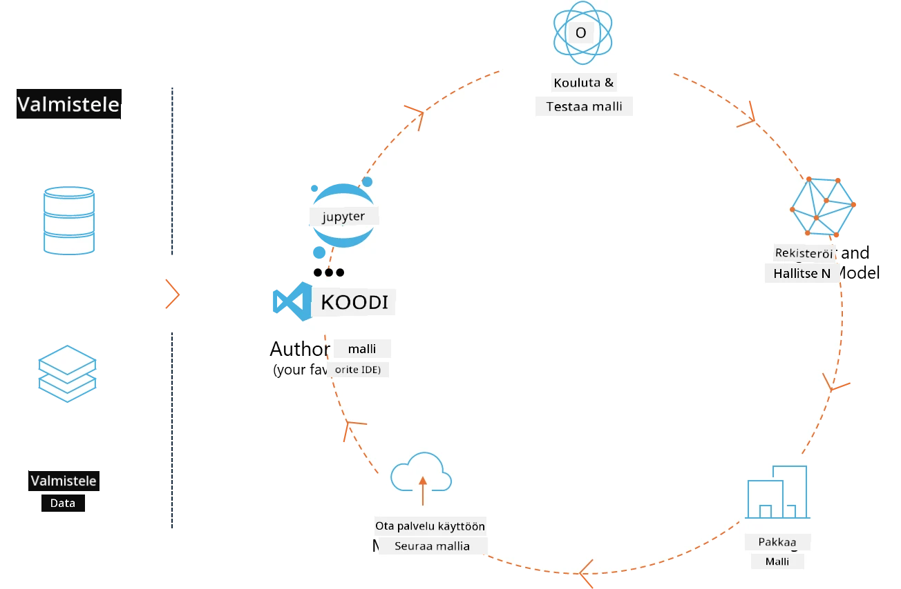
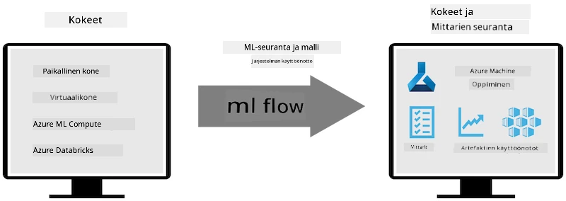
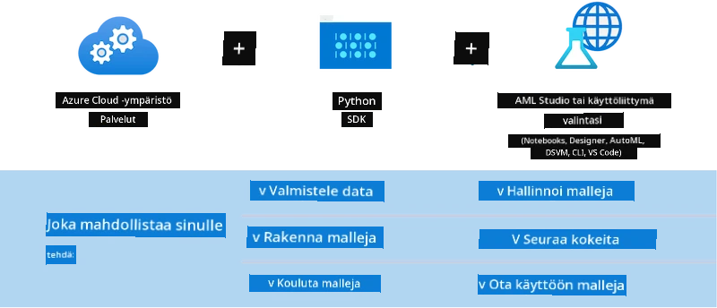

<!--
CO_OP_TRANSLATOR_METADATA:
{
  "original_hash": "f61c383bbf0c3dac97e43f833c258731",
  "translation_date": "2025-07-17T02:32:54+00:00",
  "source_file": "md/02.Application/01.TextAndChat/Phi3/E2E_Phi-3-MLflow.md",
  "language_code": "fi"
}
-->
# MLflow

[MLflow](https://mlflow.org/) on avoimen lähdekoodin alusta, joka on suunniteltu hallitsemaan koneoppimisen koko elinkaarta.



MLFlowa käytetään koneoppimisen elinkaaren hallintaan, mukaan lukien kokeilut, toistettavuus, käyttöönotto ja keskitetty mallirekisteri. MLflow tarjoaa tällä hetkellä neljä komponenttia.

- **MLflow Tracking:** Tallenna ja hae kokeiluja, koodia, datakonfiguraatioita ja tuloksia.
- **MLflow Projects:** Pakkaa data-analytiikan koodi muotoon, jolla ajot voidaan toistaa millä tahansa alustalla.
- **Mlflow Models:** Ota koneoppimismallit käyttöön erilaisissa palveluympäristöissä.
- **Model Registry:** Tallenna, kommentoi ja hallitse malleja keskitetysti.

Se sisältää ominaisuuksia kokeilujen seurantaan, koodin pakkaamiseen toistettaviksi ajoiksi sekä mallien jakamiseen ja käyttöönottoon. MLFlow on integroitu Databricksiin ja tukee monia koneoppimiskirjastoja, joten se on kirjasto-riippumaton. Sitä voi käyttää minkä tahansa koneoppimiskirjaston kanssa ja millä tahansa ohjelmointikielellä, sillä se tarjoaa REST-rajapinnan ja komentorivityökalun helppokäyttöisyyttä varten.



MLFlow:n keskeisiä ominaisuuksia ovat:

- **Kokeilujen seuranta:** Tallenna ja vertaa parametreja ja tuloksia.
- **Mallien hallinta:** Ota mallit käyttöön eri palvelu- ja päättelyalustoilla.
- **Model Registry:** Hallitse yhteistyössä MLflow-mallien elinkaarta, mukaan lukien versiointi ja kommentointi.
- **Projects:** Pakkaa koneoppimiskoodi jakamista tai tuotantokäyttöä varten.

MLFlow tukee myös MLOps-silmukkaa, joka sisältää datan valmistelun, mallien rekisteröinnin ja hallinnan, mallien pakkaamisen suoritusta varten, palveluiden käyttöönoton ja mallien seurannan. Sen tavoitteena on yksinkertaistaa siirtymistä prototyypistä tuotantotyönkulkuun, erityisesti pilvi- ja reunaympäristöissä.

## E2E-skenaario – Wrapperin rakentaminen ja Phi-3:n käyttäminen MLFlow-mallina

Tässä E2E-esimerkissä demonstroimme kahta eri lähestymistapaa wrapperin rakentamiseen Phi-3-pienelle kielimallille (SLM) ja sen ajamiseen MLFlow-mallina joko paikallisesti tai pilvessä, esimerkiksi Azure Machine Learning -työtilassa.



| Projekti | Kuvaus | Sijainti |
| ------------ | ----------- | -------- |
| Transformer Pipeline | Transformer Pipeline on helpoin tapa rakentaa wrapper, jos haluat käyttää HuggingFace-mallia MLFlow’n kokeellisella transformers-versiolla. | [**TransformerPipeline.ipynb**](../../../../../../code/06.E2E/E2E_Phi-3-MLflow_TransformerPipeline.ipynb) |
| Custom Python Wrapper | Kirjoitushetkellä transformer pipeline ei tukenut MLFlow-wrapperin generointia HuggingFace-malleille ONNX-muodossa, edes kokeellisen optimum Python -paketin kanssa. Tällaisissa tapauksissa voit rakentaa oman Python-wrapperin MLFlow-mallille. | [**CustomPythonWrapper.ipynb**](../../../../../../code/06.E2E/E2E_Phi-3-MLflow_CustomPythonWrapper.ipynb) |

## Projekti: Transformer Pipeline

1. Tarvitset asianmukaiset Python-kirjastot MLFlow’sta ja HuggingFacesta:

    ``` Python
    import mlflow
    import transformers
    ```

2. Seuraavaksi sinun tulee käynnistää transformer pipeline viittaamalla kohdemalliin Phi-3 HuggingFace-rekisterissä. Kuten _Phi-3-mini-4k-instruct_-mallikortista näkyy, sen tehtävä on “Tekstin generointi”:

    ``` Python
    pipeline = transformers.pipeline(
        task = "text-generation",
        model = "microsoft/Phi-3-mini-4k-instruct"
    )
    ```

3. Voit nyt tallentaa Phi-3-mallisi transformer-pipelinen MLFlow-muodossa ja antaa lisätietoja, kuten kohdeartifaktien polun, mallin erityiset konfiguraatioasetukset ja päättely-API-tyypin:

    ``` Python
    model_info = mlflow.transformers.log_model(
        transformers_model = pipeline,
        artifact_path = "phi3-mlflow-model",
        model_config = model_config,
        task = "llm/v1/chat"
    )
    ```

## Projekti: Custom Python Wrapper

1. Tässä voimme hyödyntää Microsoftin [ONNX Runtime generate() APIa](https://github.com/microsoft/onnxruntime-genai) ONNX-mallin päättelyyn sekä tokenien koodaukseen ja dekoodaukseen. Sinun tulee valita _onnxruntime_genai_ -paketti kohdelaitteellesi, alla oleva esimerkki kohdistuu CPU:hun:

    ``` Python
    import mlflow
    from mlflow.models import infer_signature
    import onnxruntime_genai as og
    ```

1. Oma luokkamme toteuttaa kaksi metodia: _load_context()_, jolla alustetaan **ONNX-malli** Phi-3 Mini 4K Instructille, **generaattorin parametrit** ja **tokenisaattori**; sekä _predict()_, jolla generoidaan ulostulotokenit annetulle kehotteelle:

    ``` Python
    class Phi3Model(mlflow.pyfunc.PythonModel):
        def load_context(self, context):
            # Retrieving model from the artifacts
            model_path = context.artifacts["phi3-mini-onnx"]
            model_options = {
                 "max_length": 300,
                 "temperature": 0.2,         
            }
        
            # Defining the model
            self.phi3_model = og.Model(model_path)
            self.params = og.GeneratorParams(self.phi3_model)
            self.params.set_search_options(**model_options)
            
            # Defining the tokenizer
            self.tokenizer = og.Tokenizer(self.phi3_model)
    
        def predict(self, context, model_input):
            # Retrieving prompt from the input
            prompt = model_input["prompt"][0]
            self.params.input_ids = self.tokenizer.encode(prompt)
    
            # Generating the model's response
            response = self.phi3_model.generate(self.params)
    
            return self.tokenizer.decode(response[0][len(self.params.input_ids):])
    ```

1. Voit nyt käyttää _mlflow.pyfunc.log_model()_ -funktiota luodaksesi oman Python-wrapperin (pickle-muodossa) Phi-3-mallille, alkuperäisen ONNX-mallin ja tarvittavien riippuvuuksien kanssa:

    ``` Python
    model_info = mlflow.pyfunc.log_model(
        artifact_path = artifact_path,
        python_model = Phi3Model(),
        artifacts = {
            "phi3-mini-onnx": "cpu_and_mobile/cpu-int4-rtn-block-32-acc-level-4",
        },
        input_example = input_example,
        signature = infer_signature(input_example, ["Run"]),
        extra_pip_requirements = ["torch", "onnxruntime_genai", "numpy"],
    )
    ```

## Generoitujen MLFlow-mallien allekirjoitukset

1. Transformer Pipeline -projektin vaiheessa 3 asetimme MLFlow-mallin tehtäväksi “_llm/v1/chat_”. Tämä ohje luo mallin API-wrapperin, joka on yhteensopiva OpenAI:n Chat API:n kanssa, kuten alla näkyy:

    ``` Python
    {inputs: 
      ['messages': Array({content: string (required), name: string (optional), role: string (required)}) (required), 'temperature': double (optional), 'max_tokens': long (optional), 'stop': Array(string) (optional), 'n': long (optional), 'stream': boolean (optional)],
    outputs: 
      ['id': string (required), 'object': string (required), 'created': long (required), 'model': string (required), 'choices': Array({finish_reason: string (required), index: long (required), message: {content: string (required), name: string (optional), role: string (required)} (required)}) (required), 'usage': {completion_tokens: long (required), prompt_tokens: long (required), total_tokens: long (required)} (required)],
    params: 
      None}
    ```

1. Tämän seurauksena voit lähettää kehotteesi seuraavassa muodossa:

    ``` Python
    messages = [{"role": "user", "content": "What is the capital of Spain?"}]
    ```

1. Käytä sitten OpenAI API -yhteensopivaa jälkikäsittelyä, esimerkiksi _response[0][‘choices’][0][‘message’][‘content’]_, kaunistamaan tulostasi esimerkiksi näin:

    ``` JSON
    Question: What is the capital of Spain?
    
    Answer: The capital of Spain is Madrid. It is the largest city in Spain and serves as the political, economic, and cultural center of the country. Madrid is located in the center of the Iberian Peninsula and is known for its rich history, art, and architecture, including the Royal Palace, the Prado Museum, and the Plaza Mayor.
    
    Usage: {'prompt_tokens': 11, 'completion_tokens': 73, 'total_tokens': 84}
    ```

1. Custom Python Wrapper -projektin vaiheessa 3 annamme MLFlow-paketin generoida mallin allekirjoituksen annetusta syöte-esimerkistä. MLFlow-wrapperimme allekirjoitus näyttää tältä:

    ``` Python
    {inputs: 
      ['prompt': string (required)],
    outputs: 
      [string (required)],
    params: 
      None}
    ```

1. Joten kehotteemme tulisi sisältää "prompt"-sanakirjan avain, kuten tässä:

    ``` Python
    {"prompt": "<|system|>You are a stand-up comedian.<|end|><|user|>Tell me a joke about atom<|end|><|assistant|>",}
    ```

1. Mallin ulostulo annetaan sitten merkkijonona:

    ``` JSON
    Alright, here's a little atom-related joke for you!
    
    Why don't electrons ever play hide and seek with protons?
    
    Because good luck finding them when they're always "sharing" their electrons!
    
    Remember, this is all in good fun, and we're just having a little atomic-level humor!
    ```

**Vastuuvapauslauseke**:  
Tämä asiakirja on käännetty käyttämällä tekoälypohjaista käännöspalvelua [Co-op Translator](https://github.com/Azure/co-op-translator). Vaikka pyrimme tarkkuuteen, huomioithan, että automaattikäännöksissä saattaa esiintyä virheitä tai epätarkkuuksia. Alkuperäistä asiakirjaa sen alkuperäiskielellä tulee pitää virallisena lähteenä. Tärkeissä tiedoissa suositellaan ammattimaista ihmiskäännöstä. Emme ole vastuussa tämän käännöksen käytöstä aiheutuvista väärinymmärryksistä tai tulkinnoista.