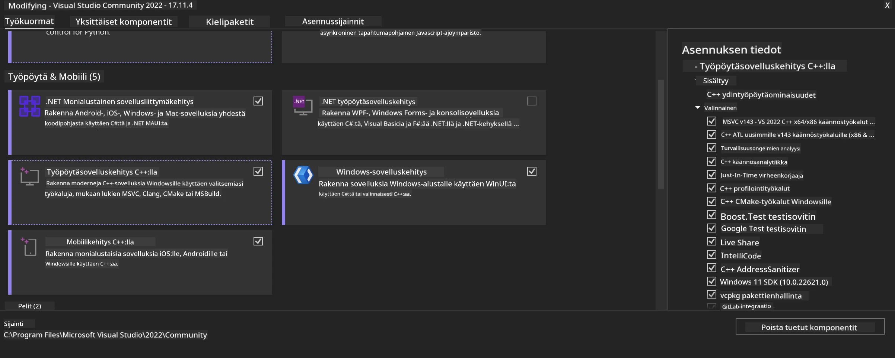
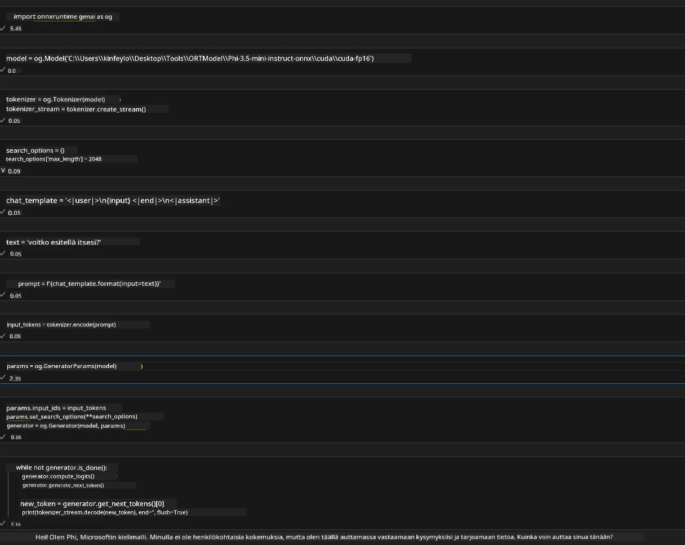
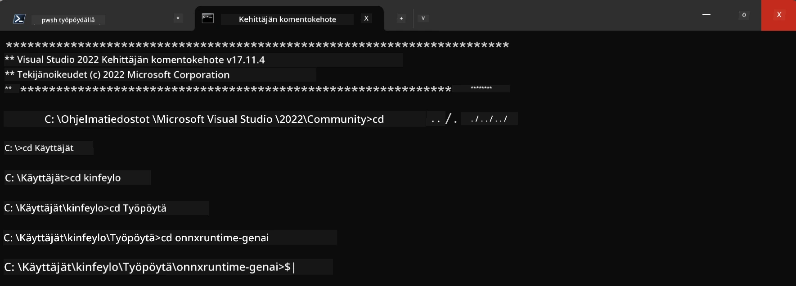

<!--
CO_OP_TRANSLATOR_METADATA:
{
  "original_hash": "b066fc29c1b2129df84e027cb75119ce",
  "translation_date": "2025-07-17T02:44:41+00:00",
  "source_file": "md/02.Application/01.TextAndChat/Phi3/ORTWindowGPUGuideline.md",
  "language_code": "fi"
}
-->
# **Ohjeistus OnnxRuntime GenAI Windows GPU:lle**

Tämä ohjeistus sisältää vaiheet ONNX Runtime (ORT) -ympäristön käyttöönottoon ja GPU:n hyödyntämiseen Windowsilla. Sen tarkoituksena on auttaa sinua hyödyntämään GPU-kiihdytystä malleissasi, parantaen suorituskykyä ja tehokkuutta.

Dokumentti kattaa:

- Ympäristön asennus: Ohjeet tarvittavien riippuvuuksien, kuten CUDA:n, cuDNN:n ja ONNX Runtime:n asentamiseen.
- Konfigurointi: Kuinka määrittää ympäristö ja ONNX Runtime hyödyntämään GPU-resursseja tehokkaasti.
- Optimointivinkit: Neuvoja GPU-asetusten hienosäätöön parhaan suorituskyvyn saavuttamiseksi.

### **1. Python 3.10.x /3.11.8**

   ***Note*** Suositellaan käyttämään [miniforge](https://github.com/conda-forge/miniforge/releases/latest/download/Miniforge3-Windows-x86_64.exe) Python-ympäristönä

   ```bash

   conda create -n pydev python==3.11.8

   conda activate pydev

   ```

   ***Reminder*** Jos olet asentanut jonkin Python ONNX -kirjaston, poista se ensin

### **2. Asenna CMake wingetillä**

   ```bash

   winget install -e --id Kitware.CMake

   ```

### **3. Asenna Visual Studio 2022 - Desktop Development with C++**

   ***Note*** Jos et halua kääntää itse, voit ohittaa tämän vaiheen



### **4. Asenna NVIDIA-ajuri**

1. **NVIDIA GPU Driver**  [https://www.nvidia.com/en-us/drivers/](https://www.nvidia.com/en-us/drivers/)

2. **NVIDIA CUDA 12.4** [https://developer.nvidia.com/cuda-12-4-0-download-archive](https://developer.nvidia.com/cuda-12-4-0-download-archive)

3. **NVIDIA CUDNN 9.4**  [https://developer.nvidia.com/cudnn-downloads](https://developer.nvidia.com/cudnn-downloads)

***Reminder*** Käytä asennuksen oletusasetuksia

### **5. Määritä NVIDIA-ympäristö**

Kopioi NVIDIA CUDNN 9.4:n lib-, bin- ja include-kansiot NVIDIA CUDA 12.4:n vastaaviin kansioihin

- kopioi *'C:\Program Files\NVIDIA\CUDNN\v9.4\bin\12.6'* tiedostot kansioon *'C:\Program Files\NVIDIA GPU Computing Toolkit\CUDA\v12.4\bin'*

- kopioi *'C:\Program Files\NVIDIA\CUDNN\v9.4\include\12.6'* tiedostot kansioon *'C:\Program Files\NVIDIA GPU Computing Toolkit\CUDA\v12.4\include'*

- kopioi *'C:\Program Files\NVIDIA\CUDNN\v9.4\lib\12.6'* tiedostot kansioon *'C:\Program Files\NVIDIA GPU Computing Toolkit\CUDA\v12.4\lib\x64'*

### **6. Lataa Phi-3.5-mini-instruct-onnx**

   ```bash

   winget install -e --id Git.Git

   winget install -e --id GitHub.GitLFS

   git lfs install

   git clone https://huggingface.co/microsoft/Phi-3.5-mini-instruct-onnx

   ```

### **7. Suorita InferencePhi35Instruct.ipynb**

   Avaa [Notebook](../../../../../../code/09.UpdateSamples/Aug/ortgpu-phi35-instruct.ipynb) ja suorita se



### **8. Käännä ORT GenAI GPU**

   ***Note*** 
   
   1. Poista ensin kaikki onnx-, onnxruntime- ja onnxruntime-genai -kirjastot

   ```bash

   pip list 
   
   ```

   Sen jälkeen poista kaikki onnxruntime-kirjastot, esimerkiksi

   ```bash

   pip uninstall onnxruntime

   pip uninstall onnxruntime-genai

   pip uninstall onnxruntume-genai-cuda
   
   ```

   2. Tarkista Visual Studio -laajennuksen tuki

   Tarkista, että kansio C:\Program Files\NVIDIA GPU Computing Toolkit\CUDA\v12.4\extras sisältää alikansion visual_studio_integration. 

   Jos sitä ei löydy, etsi se muista CUDA Toolkit -kansioista ja kopioi visual_studio_integration -kansio ja sen sisältö kansioon C:\Program Files\NVIDIA GPU Computing Toolkit\CUDA\v12.4\extras\visual_studio_integration

   - Jos et halua kääntää itse, voit ohittaa tämän vaiheen

   ```bash

   git clone https://github.com/microsoft/onnxruntime-genai

   ```

   - Lataa [https://github.com/microsoft/onnxruntime/releases/download/v1.19.2/onnxruntime-win-x64-gpu-1.19.2.zip](https://github.com/microsoft/onnxruntime/releases/download/v1.19.2/onnxruntime-win-x64-gpu-1.19.2.zip)

   - Pura onnxruntime-win-x64-gpu-1.19.2.zip, nimeä purettu kansio **ort** ja kopioi se onnxruntime-genai -kansioon

   - Käynnistä Windows Terminal, avaa Developer Command Prompt for VS 2022 ja siirry onnxruntime-genai -kansioon



   - Käännä se Python-ympäristössäsi

   ```bash

   cd onnxruntime-genai

   python build.py --use_cuda  --cuda_home "C:\Program Files\NVIDIA GPU Computing Toolkit\CUDA\v12.4" --config Release
 

   cd build/Windows/Release/Wheel

   pip install .whl

   ```

**Vastuuvapauslauseke**:  
Tämä asiakirja on käännetty käyttämällä tekoälypohjaista käännöspalvelua [Co-op Translator](https://github.com/Azure/co-op-translator). Vaikka pyrimme tarkkuuteen, huomioithan, että automaattikäännöksissä saattaa esiintyä virheitä tai epätarkkuuksia. Alkuperäistä asiakirjaa sen alkuperäiskielellä tulee pitää virallisena lähteenä. Tärkeissä tiedoissa suositellaan ammattimaista ihmiskäännöstä. Emme ole vastuussa tämän käännöksen käytöstä aiheutuvista väärinymmärryksistä tai tulkinnoista.