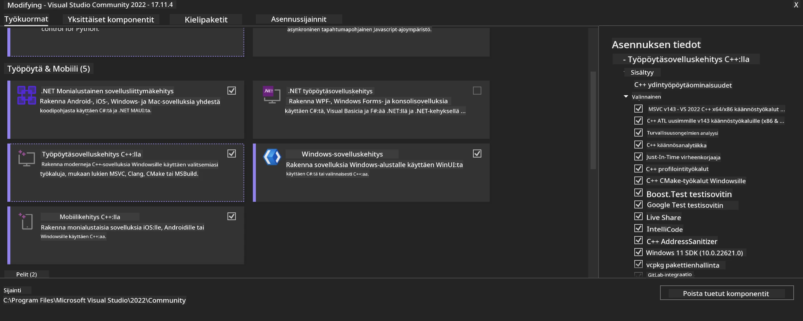
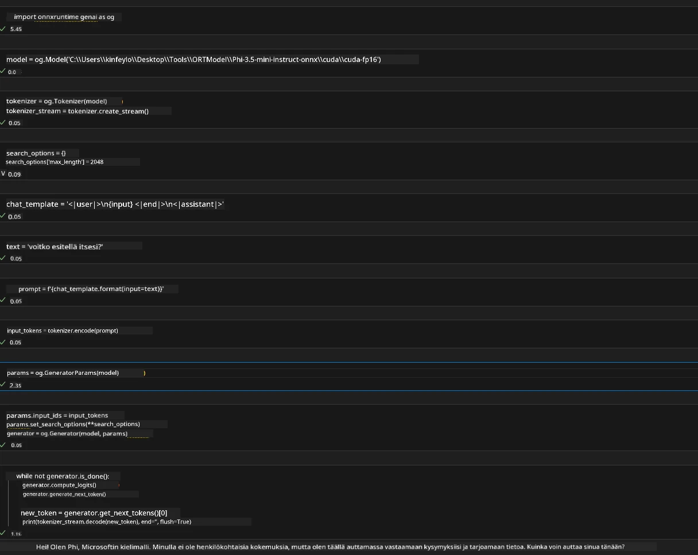
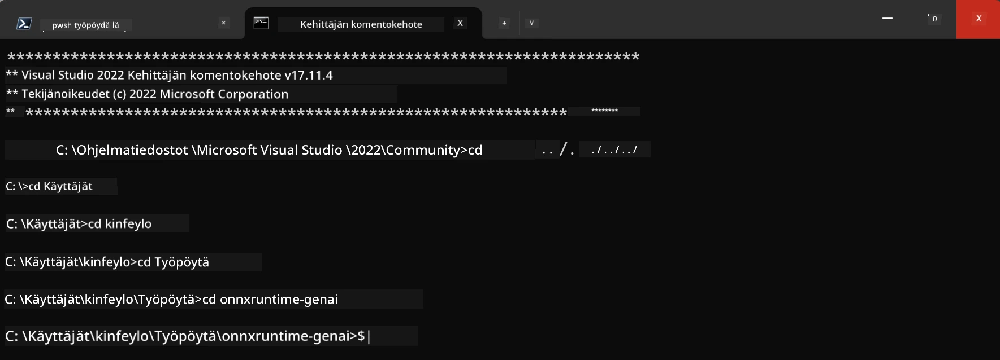

# **Ohjeet OnnxRuntime GenAI Windows GPU:lle**

Tämä ohje tarjoaa vaiheet ONNX Runtime (ORT) ympäristön pystyttämiseen ja käyttöön GPU:illa Windowsilla. Se on suunniteltu auttamaan sinua hyödyntämään GPU-kiihdytystä malleissasi, parantaen suorituskykyä ja tehokkuutta.

Asiakirja tarjoaa ohjeita:

- Ympäristön pystytys: Ohjeita tarvittavien riippuvuuksien, kuten CUDA:n, cuDNN:n ja ONNX Runtimen, asentamiseen.
- Konfigurointi: Kuinka konfiguroida ympäristö ja ONNX Runtime hyödyntämään GPU-resursseja tehokkaasti.
- Optimointivinkit: Neuvoja GPU-asetusten hienosäätöön optimaalisen suorituskyvyn saavuttamiseksi.

### **1. Python 3.10.x /3.11.8**

   ***Huomautus*** Suositellaan käyttämään [miniforge](https://github.com/conda-forge/miniforge/releases/latest/download/Miniforge3-Windows-x86_64.exe) Python-ympäristönäsi

   ```bash

   conda create -n pydev python==3.11.8

   conda activate pydev

   ```

   ***Muistutus*** Jos olet asentanut jotain Python ONNX -kirjastoja, poista ne asennuksesta

### **2. Asenna CMake wingetillä**


   ```bash

   winget install -e --id Kitware.CMake

   ```

### **3. Asenna Visual Studio 2022 - Työpöytäsovelluskehitys C++:lla**

   ***Huomautus*** Jos et halua kääntää lähdekoodia, voit ohittaa tämän vaiheen




### **4. Asenna NVIDIA-ajuri**

1. **NVIDIA GPU -ajuri**  [https://www.nvidia.com/en-us/drivers/](https://www.nvidia.com/en-us/drivers/)

2. **NVIDIA CUDA 12.4** [https://developer.nvidia.com/cuda-12-4-0-download-archive](https://developer.nvidia.com/cuda-12-4-0-download-archive)

3. **NVIDIA CUDNN 9.4**  [https://developer.nvidia.com/cudnn-downloads](https://developer.nvidia.com/cudnn-downloads)

***Muistutus*** Käytä asennuksen oletusasetuksia  

### **5. Aseta NVIDIA-ympäristö**

Kopioi NVIDIA CUDNN 9.4:n lib, bin, include kansiot NVIDIA CUDA 12.4:n vastaaviin kansioihin

- kopioi tiedostot *'C:\Program Files\NVIDIA\CUDNN\v9.4\bin\12.6'* kansiosta *'C:\Program Files\NVIDIA GPU Computing Toolkit\CUDA\v12.4\bin'*

- kopioi tiedostot *'C:\Program Files\NVIDIA\CUDNN\v9.4\include\12.6'* kansiosta *'C:\Program Files\NVIDIA GPU Computing Toolkit\CUDA\v12.4\include'*

- kopioi tiedostot *'C:\Program Files\NVIDIA\CUDNN\v9.4\lib\12.6'* kansiosta *'C:\Program Files\NVIDIA GPU Computing Toolkit\CUDA\v12.4\lib\x64'*


### **6. Lataa Phi-3.5-mini-instruct-onnx**


   ```bash

   winget install -e --id Git.Git

   winget install -e --id GitHub.GitLFS

   git lfs install

   git clone https://huggingface.co/microsoft/Phi-3.5-mini-instruct-onnx

   ```

### **7. Suorita InferencePhi35Instruct.ipynb**

   Avaa [Notebook](../../../../code/09.UpdateSamples/Aug/ortgpu-phi35-instruct.ipynb) ja suorita





### **8. Käännä ORT GenAI GPU**


   ***Huomautus*** 
   
   1. Poista ensin kaikki onnx-, onnxruntime- ja onnxruntime-genai -paketit

   
   ```bash

   pip list 
   
   ```

   Sen jälkeen poista kaikki onnxruntime-kirjastot, esim. 


   ```bash

   pip uninstall onnxruntime

   pip uninstall onnxruntime-genai

   pip uninstall onnxruntume-genai-cuda
   
   ```

   2. Tarkista Visual Studion lisäosan tuki

   Tarkista kansio C:\Program Files\NVIDIA GPU Computing Toolkit\CUDA\v12.4\extras varmistaaksesi, että polku C:\Program Files\NVIDIA GPU Computing Toolkit\CUDA\v12.4\extras\visual_studio_integration löytyy
   
   Jos polkua ei löydy, tarkista muiden CUDA toolkit -ajurikansioiden sisältö ja kopioi kansio visual_studio_integration sisällön kera kohtaan C:\Program Files\NVIDIA GPU Computing Toolkit\CUDA\v12.4\extras\visual_studio_integration


   - Jos et halua kääntää, voit ohittaa tämän vaiheen


   ```bash

   git clone https://github.com/microsoft/onnxruntime-genai

   ```

   - Lataa [https://github.com/microsoft/onnxruntime/releases/download/v1.19.2/onnxruntime-win-x64-gpu-1.19.2.zip](https://github.com/microsoft/onnxruntime/releases/download/v1.19.2/onnxruntime-win-x64-gpu-1.19.2.zip)

   - Pura onnxruntime-win-x64-gpu-1.19.2.zip ja nimeä kansio uudelleen **ort**, kopioi ort-kansio onnxruntime-genai-hakemistoon

   - Käytä Windows Terminalia, siirry Developer Command Prompt for VS 2022 -ikkunaan ja siirry onnxruntime-genai-hakemistoon



   - Käännä se Python-ympäristösi avulla

   
   ```bash

   cd onnxruntime-genai

   python build.py --use_cuda  --cuda_home "C:\Program Files\NVIDIA GPU Computing Toolkit\CUDA\v12.4" --config Release
 

   cd build/Windows/Release/Wheel

   pip install .whl

   ```

---

<!-- CO-OP TRANSLATOR DISCLAIMER START -->
**Vastuuvapauslauseke**:
Tämä asiakirja on käännetty käyttämällä tekoälypohjaista käännöspalvelua [Co-op Translator](https://github.com/Azure/co-op-translator). Vaikka pyrimme tarkkuuteen, otathan huomioon, että automaattiset käännökset saattavat sisältää virheitä tai epätarkkuuksia. Alkuperäinen asiakirja sen alkuperäiskielellä on virallinen lähde. Tärkeissä asioissa suositellaan ammattimaista ihmiskäännöstä. Emme ole vastuussa tämän käännöksen käytöstä aiheutuvista väärinymmärryksistä tai tulkinnoista.
<!-- CO-OP TRANSLATOR DISCLAIMER END -->