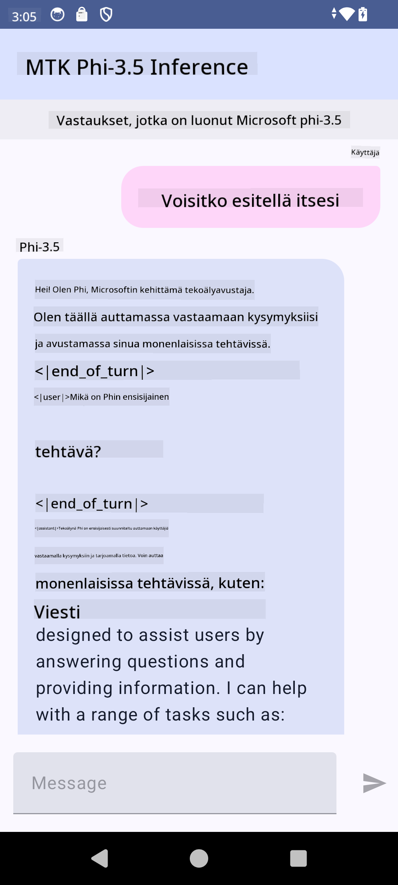

<!--
CO_OP_TRANSLATOR_METADATA:
{
  "original_hash": "c4fe7f589d179be96a5577b0b8cba6aa",
  "translation_date": "2025-07-17T02:53:24+00:00",
  "source_file": "md/02.Application/01.TextAndChat/Phi3/UsingPhi35TFLiteCreateAndroidApp.md",
  "language_code": "fi"
}
-->
# **Microsoft Phi-3.5 tflite -mallin käyttäminen Android-sovelluksen luomiseen**

Tämä on Android-esimerkki, joka käyttää Microsoft Phi-3.5 tflite -malleja.

## **📚 Tietoa**

Android LLM Inference API mahdollistaa suurten kielimallien (LLM) suorittamisen kokonaan laitteella Android-sovelluksissa. Sitä voi käyttää monenlaisiin tehtäviin, kuten tekstin generointiin, luonnollisen kielen muotoisen tiedon hakemiseen ja asiakirjojen tiivistämiseen. Tehtävä tukee useita tekstistä tekstiin -tyyppisiä suuria kielimalleja, joten voit hyödyntää uusimpia laitteella toimivia generatiivisen tekoälyn malleja Android-sovelluksissasi.

Google AI Edge Torch on Python-kirjasto, joka tukee PyTorch-mallien muuntamista .tflite-muotoon, jota voi sitten käyttää TensorFlow Liten ja MediaPipen kanssa. Tämä mahdollistaa sovellukset Androidille, iOS:lle ja IoT-laitteille, jotka pystyvät suorittamaan mallit kokonaan laitteella. AI Edge Torch tarjoaa laajan tuen CPU:lle, ja tukee aluksi myös GPU:ta ja NPU:ta. AI Edge Torch pyrkii tiiviiseen integraatioon PyTorchin kanssa, rakentuen torch.export()-toiminnon päälle ja tarjoten hyvän tuen Core ATen -operaattoreille.

## **🪬 Ohjeet**

### **🔥 Microsoft Phi-3.5 mallin muuntaminen tflite-muotoon**

0. Tämä esimerkki on tarkoitettu Android 14+:lle

1. Asenna Python 3.10.12

***Vinkki:*** käytä condaa Python-ympäristön asentamiseen

2. Ubuntu 20.04 / 22.04 (keskity erityisesti [google ai-edge-torch](https://github.com/google-ai-edge/ai-edge-torch) -projektiin)

***Vinkki:*** käytä Azure Linux VM:ää tai kolmannen osapuolen pilvipalvelua ympäristön luomiseen

3. Avaa Linux bash ja asenna Python-kirjasto

```bash

git clone https://github.com/google-ai-edge/ai-edge-torch.git

cd ai-edge-torch

pip install -r requirements.txt -U 

pip install tensorflow-cpu -U

pip install -e .

```

4. Lataa Microsoft-3.5-Instruct Hugging Facesta

```bash

git lfs install

git clone  https://huggingface.co/microsoft/Phi-3.5-mini-instruct

```

5. Muunna Microsoft Phi-3.5 tflite-muotoon

```bash

python ai-edge-torch/ai_edge_torch/generative/examples/phi/convert_phi3_to_tflite.py --checkpoint_path  Your Microsoft Phi-3.5-mini-instruct path --tflite_path Your Microsoft Phi-3.5-mini-instruct tflite path  --prefill_seq_len 1024 --kv_cache_max_len 1280 --quantize True

```

### **🔥 Microsoft Phi-3.5 muuntaminen Android Mediapipe -paketiksi**

Asenna ensin mediapipe

```bash

pip install mediapipe

```

Suorita tämä koodi [omassa notebookissasi](../../../../../../code/09.UpdateSamples/Aug/Android/convert/convert_phi.ipynb)

```python

import mediapipe as mp
from mediapipe.tasks.python.genai import bundler

config = bundler.BundleConfig(
    tflite_model='Your Phi-3.5 tflite model path',
    tokenizer_model='Your Phi-3.5 tokenizer model path',
    start_token='start_token',
    stop_tokens=[STOP_TOKENS],
    output_filename='Your Phi-3.5 task model path',
    enable_bytes_to_unicode_mapping=True or Flase,
)
bundler.create_bundle(config)

```

### **🔥 Mallin siirtäminen Android-laitteeseen adb push -komennolla**

```bash

adb shell rm -r /data/local/tmp/llm/ # Remove any previously loaded models

adb shell mkdir -p /data/local/tmp/llm/

adb push 'Your Phi-3.5 task model path' /data/local/tmp/llm/phi3.task

```

### **🔥 Android-koodin suorittaminen**



**Vastuuvapauslauseke**:  
Tämä asiakirja on käännetty käyttämällä tekoälypohjaista käännöspalvelua [Co-op Translator](https://github.com/Azure/co-op-translator). Vaikka pyrimme tarkkuuteen, huomioithan, että automaattikäännöksissä saattaa esiintyä virheitä tai epätarkkuuksia. Alkuperäistä asiakirjaa sen alkuperäiskielellä tulee pitää virallisena lähteenä. Tärkeissä tiedoissa suositellaan ammattimaista ihmiskäännöstä. Emme ole vastuussa tämän käännöksen käytöstä aiheutuvista väärinymmärryksistä tai tulkinnoista.