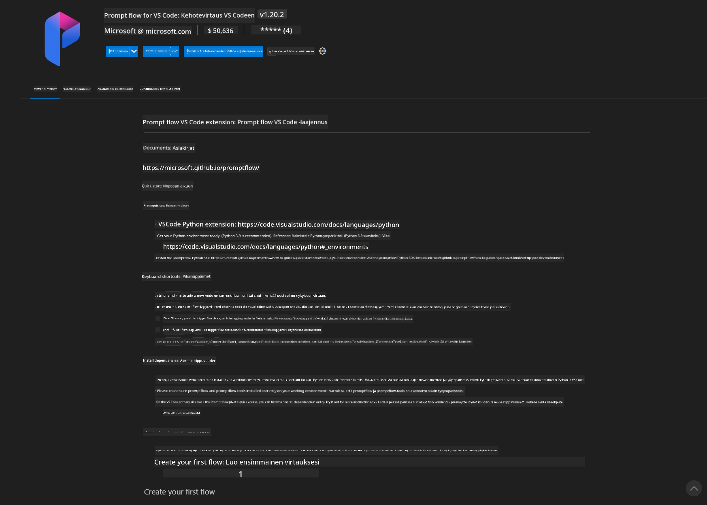
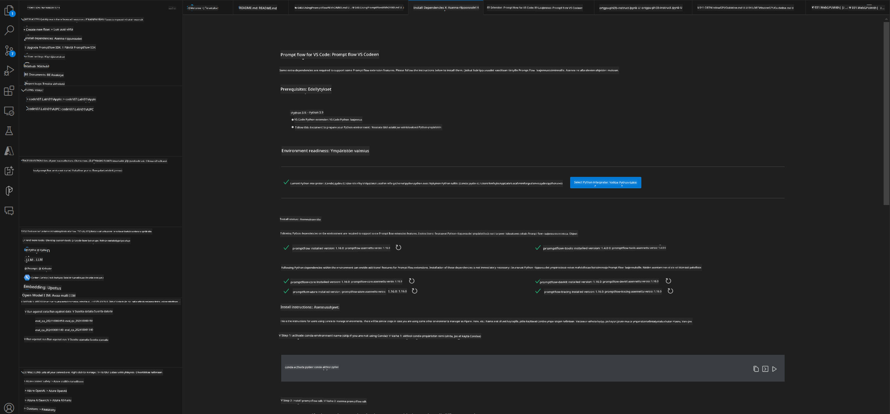
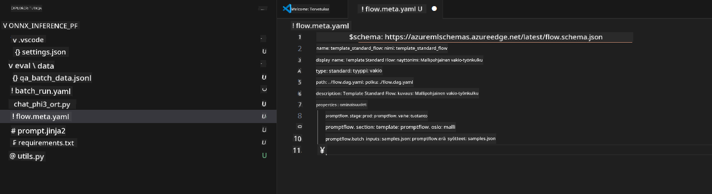
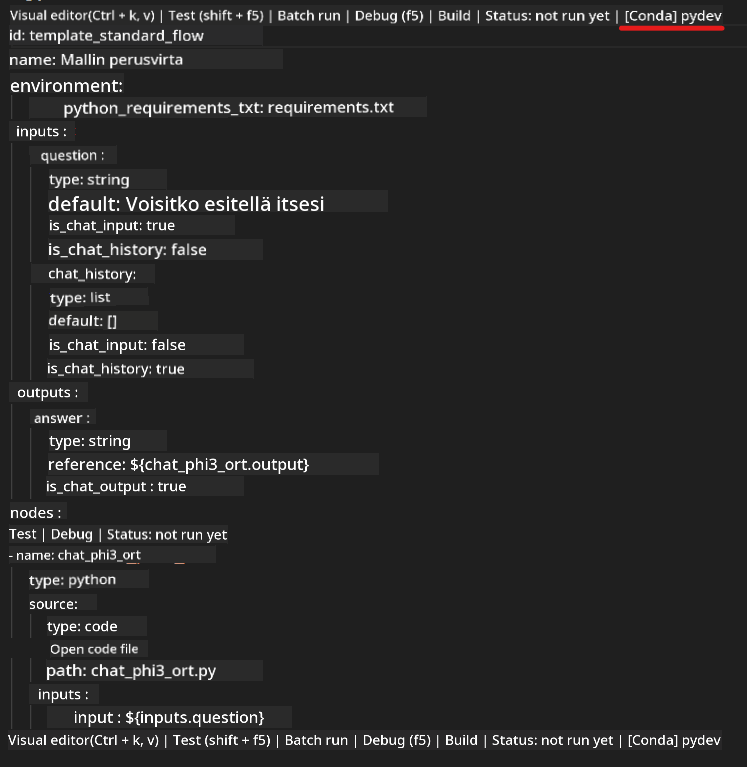
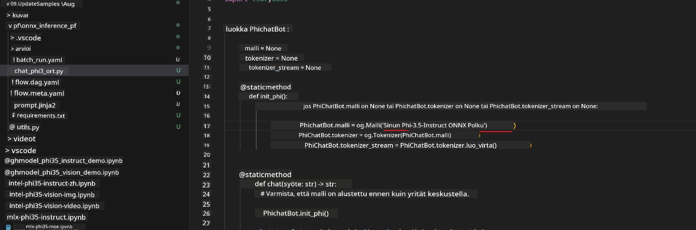
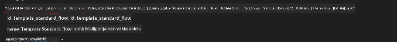
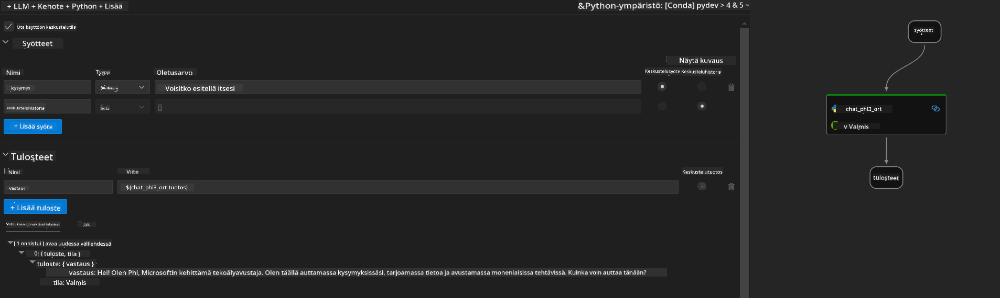
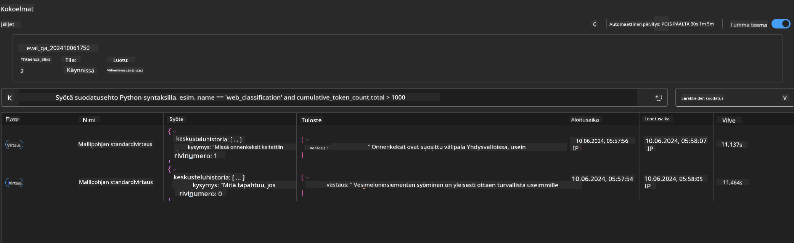

<!--
CO_OP_TRANSLATOR_METADATA:
{
  "original_hash": "92e7dac1e5af0dd7c94170fdaf6860fe",
  "translation_date": "2025-05-09T18:53:37+00:00",
  "source_file": "md/02.Application/01.TextAndChat/Phi3/UsingPromptFlowWithONNX.md",
  "language_code": "fi"
}
-->
# Windowsin GPU:n käyttäminen Prompt flow -ratkaisun luomiseen Phi-3.5-Instruct ONNX:n kanssa

Seuraava dokumentti on esimerkki siitä, miten PromptFlowa käytetään ONNX:n (Open Neural Network Exchange) kanssa Phi-3 -mallien pohjalta kehitettyjen tekoälysovellusten luomiseen.

PromptFlow on kehitystyökalupaketti, joka helpottaa LLM-pohjaisten (Large Language Model) tekoälysovellusten koko kehityssykliä ideoinnista ja prototypoinnista testaukseen ja arviointiin.

Integroimalla PromptFlow ONNX:n kanssa kehittäjät voivat:

- Optimoida mallin suorituskykyä: Hyödyntää ONNX:ää tehokkaaseen mallin päättelyyn ja käyttöönottoon.
- Yksinkertaistaa kehitystä: Käyttää PromptFlowta työnkulun hallintaan ja toistuvien tehtävien automatisointiin.
- Parantaa yhteistyötä: Mahdollistaa paremman tiimityön tarjoamalla yhtenäisen kehitysympäristön.

**Prompt flow** on kehitystyökalupaketti, joka helpottaa LLM-pohjaisten tekoälysovellusten koko kehityssykliä ideoinnista, prototypoinnin, testauksen ja arvioinnin kautta tuotantoon ja seurantaan asti. Se tekee prompt-tekniikasta paljon helpompaa ja mahdollistaa LLM-sovellusten rakentamisen tuotantolaatuisina.

Prompt flow voi yhdistää OpenAI:hin, Azure OpenAI Serviceen sekä räätälöitäviin malleihin (Huggingface, paikalliset LLM/SLM). Tavoitteenamme on ottaa käyttöön Phi-3.5:n kvantisoitu ONNX-malli paikallisissa sovelluksissa. Prompt flow voi auttaa meitä suunnittelemaan liiketoimintaa paremmin ja toteuttamaan paikallisia ratkaisuja Phi-3.5:n pohjalta. Tässä esimerkissä yhdistämme ONNX Runtime GenAI -kirjaston ja toteutamme Prompt flow -ratkaisun Windows GPU:lla.

## **Asennus**

### **ONNX Runtime GenAI Windows GPU:lle**

Lue tämä ohje ONNX Runtime GenAI:n asentamiseksi Windows GPU:lle [klikkaa tästä](./ORTWindowGPUGuideline.md)

### **Prompt flow:n käyttöönotto VSCodessa**

1. Asenna Prompt flow VS Code -laajennus



2. Laajennuksen asennuksen jälkeen klikkaa laajennusta ja valitse **Installation dependencies** asentaaksesi Prompt flow SDK:n ympäristöösi tämän ohjeen mukaan



3. Lataa [Esimerkkikoodi](../../../../../../code/09.UpdateSamples/Aug/pf/onnx_inference_pf) ja avaa se VS Codessa



4. Avaa **flow.dag.yaml** ja valitse Python-ympäristösi



   Avaa **chat_phi3_ort.py** ja vaihda Phi-3.5-instruct ONNX -mallin sijainti



5. Suorita prompt flow testataksesi

Avaa **flow.dag.yaml** ja klikkaa visual editor



klikkauksen jälkeen suorita testi



1. Voit ajaa eräajon terminaalissa nähdäksesi lisää tuloksia


```bash

pf run create --file batch_run.yaml --stream --name 'Your eval qa name'    

```

Tulokset voit tarkistaa oletusselaimessasi




**Vastuuvapauslauseke**:  
Tämä asiakirja on käännetty käyttämällä tekoälypohjaista käännöspalvelua [Co-op Translator](https://github.com/Azure/co-op-translator). Vaikka pyrimme tarkkuuteen, otathan huomioon, että automaattiset käännökset saattavat sisältää virheitä tai epätarkkuuksia. Alkuperäistä asiakirjaa sen alkuperäiskielellä tulee pitää virallisena lähteenä. Tärkeissä tiedoissa suositellaan ammattimaista ihmiskäännöstä. Emme ole vastuussa tämän käännöksen käytöstä aiheutuvista väärinymmärryksistä tai tulkinnoista.