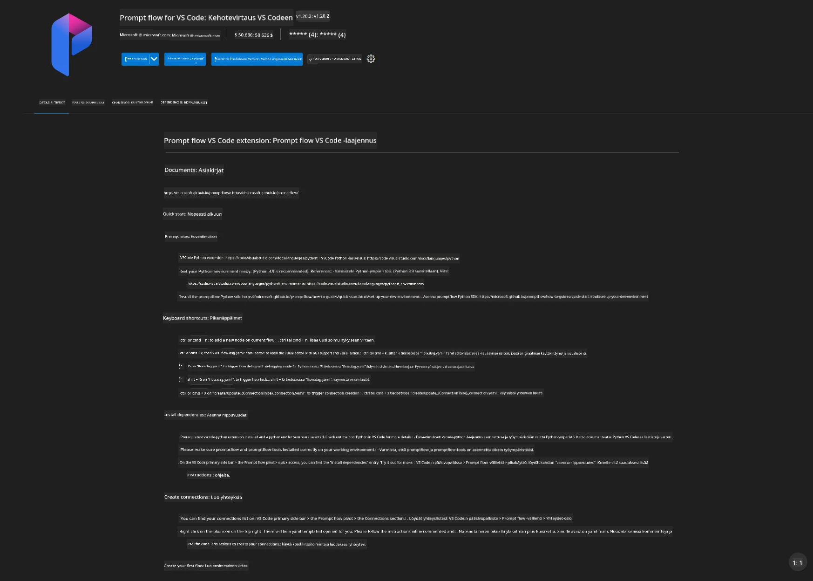
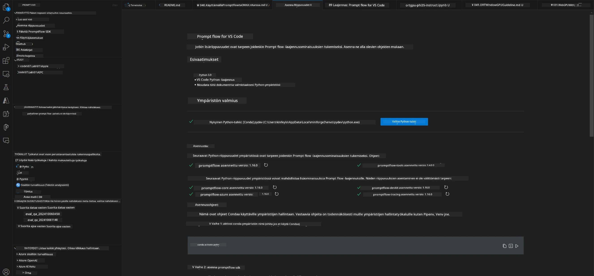
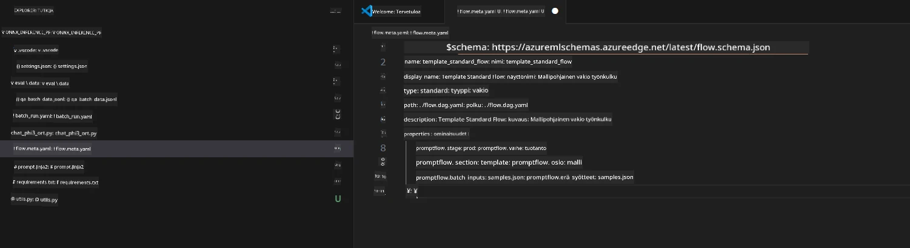
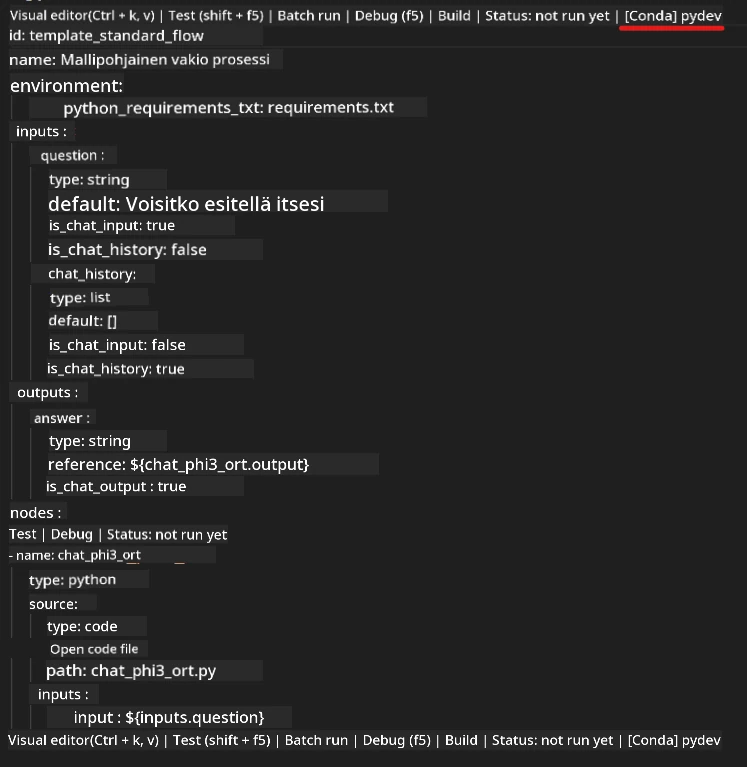
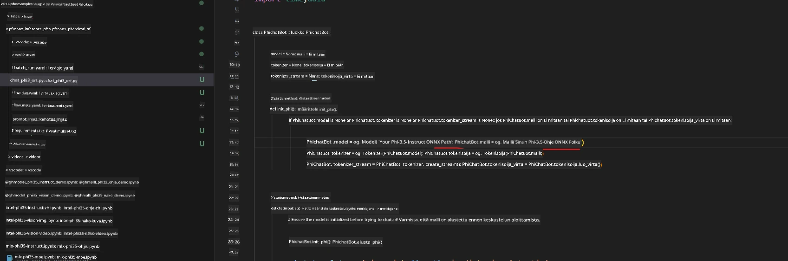
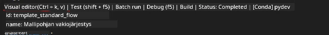
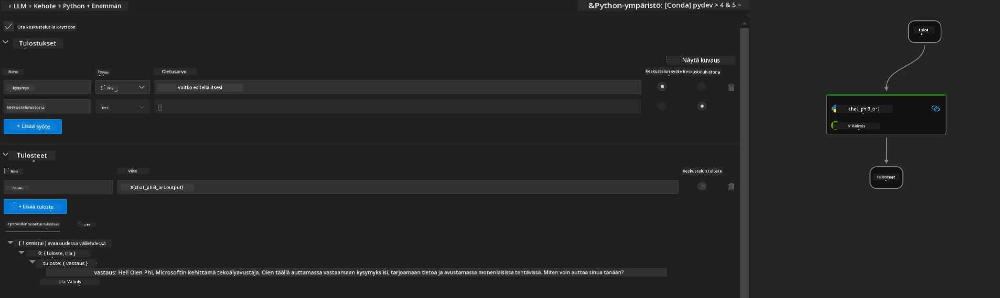
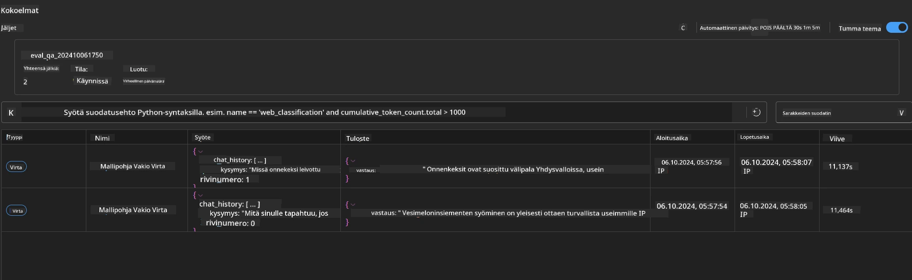

# Windowsin GPU:n käyttäminen Prompt flow -ratkaisun luomiseen Phi-3.5-Instruct ONNX:n kanssa 

Seuraava dokumentti on esimerkki siitä, miten PromptFlowa käytetään ONNX:n (Open Neural Network Exchange) kanssa Phi-3 -mallien pohjalta rakennettujen tekoälysovellusten kehittämiseen.

PromptFlow on kehitystyökalujen kokonaisuus, joka on suunniteltu sujuvoittamaan LLM-pohjaisten (Large Language Model) tekoälysovellusten koko kehityssykliä ideoinnista ja prototypoinnista testaukseen ja arviointiin.

Integroimalla PromptFlow ONNX:n kanssa kehittäjät voivat:

- Optimoida Mallin Suorituskykyä: Hyödyntää ONNX:ää tehokkaaseen mallin päättelyyn ja käyttöönottoon.
- Yksinkertaistaa Kehitystä: Käyttää PromptFlowta työnkulun hallintaan ja toistuvien tehtävien automatisointiin.
- Parantaa Yhteistyötä: Mahdollistaa paremman tiimityön tarjoamalla yhtenäisen kehitysympäristön.

**Prompt flow** on kehitystyökalujen kokonaisuus, joka on suunniteltu sujuvoittamaan koko LLM-pohjaisten tekoälysovellusten kehityssykliä ideoinnista, prototypoinnista, testauksesta ja arvioinnista aina tuotantoon vientiin ja valvontaan asti. Se tekee prompt-tekniikan kehittämisestä paljon helpompaa ja mahdollistaa LLM-sovellusten rakentamisen tuotantolaatuisiksi.

Prompt flow voi yhdistää OpenAI:hin, Azure OpenAI Serviceen ja muokattaviin malleihin (Huggingface, paikalliset LLM/SLM). Toivomme voivamme ottaa Phi-3.5:n kvantisoidun ONNX-mallin käyttöön paikallisissa sovelluksissa. Prompt flow voi auttaa meitä suunnittelemaan liiketoimintaamme paremmin ja toteuttamaan paikallisia ratkaisuja Phi-3.5:n pohjalta. Tässä esimerkissä yhdistämme ONNX Runtime GenAI -kirjaston Prompt flow -ratkaisun toteuttamiseksi Windowsin GPU:lla.

## **Asennus**

### **ONNX Runtime GenAI Windows GPU:lle**

Lue tämä ohjeistus asettaaksesi ONNX Runtime GenAI Windows GPU:lle [klikkaa tästä](./ORTWindowGPUGuideline.md)

### **Prompt flow:n asennus VSCodessa**

1. Asenna Prompt flow VS Code -laajennus



2. Asennuksen jälkeen napsauta Prompt flow VS Code -laajennusta ja valitse **Installation dependencies** noudata tätä ohjetta asentaaksesi Prompt flow SDK:n ympäristöösi



3. Lataa [Esimerkkikoodi](../../../../../../code/09.UpdateSamples/Aug/pf/onnx_inference_pf) ja avaa se VS Codella



4. Avaa **flow.dag.yaml** ja valitse Python-ympäristösi



   Avaa **chat_phi3_ort.py** muuttaaksesi Phi-3.5-instruct ONNX -mallin sijainnin



5. Suorita prompt flow testeihin

Avaa **flow.dag.yaml** ja napsauta visuaalieditoria



napsauta tätä ja suorita testi



1. Voit ajaa erän terminaalissa tarkistaaksesi lisää tuloksia


```bash

pf run create --file batch_run.yaml --stream --name 'Your eval qa name'    

```

Voit tarkistaa tulokset oletusselaimessasi




---

<!-- CO-OP TRANSLATOR DISCLAIMER START -->
**Vastuuvapauslauseke**:
Tämä asiakirja on käännetty käyttämällä tekoälypohjaista käännöspalvelua [Co-op Translator](https://github.com/Azure/co-op-translator). Vaikka pyrimme tarkkuuteen, otathan huomioon, että automaattiset käännökset saattavat sisältää virheitä tai epätarkkuuksia. Alkuperäinen asiakirja sen alkuperäiskielellä on virallinen lähde. Tärkeissä asioissa suositellaan ammattimaista ihmiskäännöstä. Emme ole vastuussa tämän käännöksen käytöstä aiheutuvista väärinymmärryksistä tai tulkinnoista.
<!-- CO-OP TRANSLATOR DISCLAIMER END -->