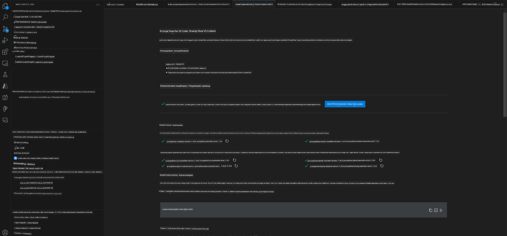

<!--
CO_OP_TRANSLATOR_METADATA:
{
  "original_hash": "92e7dac1e5af0dd7c94170fdaf6860fe",
  "translation_date": "2025-07-17T03:01:29+00:00",
  "source_file": "md/02.Application/01.TextAndChat/Phi3/UsingPromptFlowWithONNX.md",
  "language_code": "fi"
}
-->
# Windows GPU:n käyttäminen Prompt flow -ratkaisun luomiseen Phi-3.5-Instruct ONNX:llä

Seuraava dokumentti on esimerkki siitä, miten PromptFlowa käytetään ONNX:n (Open Neural Network Exchange) kanssa Phi-3 -mallien pohjalta kehitettyjen tekoälysovellusten rakentamiseen.

PromptFlow on kehitystyökalupaketti, joka on suunniteltu sujuvoittamaan koko LLM-pohjaisten (Large Language Model) tekoälysovellusten kehityssykliä ideoinnista ja prototypoinnista testaukseen ja arviointiin.

Integroimalla PromptFlow ONNX:n kanssa kehittäjät voivat:

- Optimoida mallin suorituskyvyn: Hyödyntää ONNX:ää tehokkaaseen mallin päättelyyn ja käyttöönottoon.
- Yksinkertaistaa kehitystä: Käyttää PromptFlowta työnkulun hallintaan ja toistuvien tehtävien automatisointiin.
- Parantaa yhteistyötä: Mahdollistaa paremman tiimityön tarjoamalla yhtenäisen kehitysympäristön.

**Prompt flow** on kehitystyökalupaketti, joka on suunniteltu sujuvoittamaan koko LLM-pohjaisten tekoälysovellusten kehityssykliä ideoinnista, prototypoinnista, testauksesta ja arvioinnista aina tuotantoon käyttöönottoon ja seurantaan asti. Se tekee prompt-tekniikasta paljon helpompaa ja mahdollistaa tuotantolaatuisten LLM-sovellusten rakentamisen.

Prompt flow voi yhdistää OpenAI:hin, Azure OpenAI Serviceen sekä räätälöitäviin malleihin (Huggingface, paikalliset LLM/SLM). Tavoitteenamme on ottaa Phi-3.5:n kvantisoitu ONNX-malli käyttöön paikallisissa sovelluksissa. Prompt flow auttaa meitä suunnittelemaan liiketoimintaamme paremmin ja toteuttamaan paikallisia ratkaisuja Phi-3.5:n pohjalta. Tässä esimerkissä yhdistämme ONNX Runtime GenAI -kirjaston Prompt flow -ratkaisun toteuttamiseksi Windows GPU:lla.

## **Asennus**

### **ONNX Runtime GenAI Windows GPU:lle**

Lue tämä ohje ONNX Runtime GenAI:n asentamiseksi Windows GPU:lle [klikkaa tästä](./ORTWindowGPUGuideline.md)

### **Prompt flow -ympäristön asennus VSCodeen**

1. Asenna Prompt flow VS Code -laajennus


2. Asennuksen jälkeen avaa Prompt flow VS Code -laajennus, valitse **Installation dependencies** ja seuraa ohjeita Prompt flow SDK:n asentamiseksi ympäristöösi



3. Lataa [Esimerkkikoodi](../../../../../../code/09.UpdateSamples/Aug/pf/onnx_inference_pf) ja avaa se VS Codessa


4. Avaa **flow.dag.yaml** ja valitse Python-ympäristösi


   Avaa **chat_phi3_ort.py** ja muuta Phi-3.5-instruct ONNX -mallin sijainti


5. Suorita prompt flow testataksesi

Avaa **flow.dag.yaml** ja klikkaa visual editoria


Klikkaa tätä ja suorita testi


1. Voit ajaa eräajon terminaalissa saadaksesi lisää tuloksia


```bash

pf run create --file batch_run.yaml --stream --name 'Your eval qa name'    

```

Tulokset voit tarkistaa oletusselaimessasi


**Vastuuvapauslauseke**:  
Tämä asiakirja on käännetty käyttämällä tekoälypohjaista käännöspalvelua [Co-op Translator](https://github.com/Azure/co-op-translator). Vaikka pyrimme tarkkuuteen, huomioithan, että automaattikäännöksissä saattaa esiintyä virheitä tai epätarkkuuksia. Alkuperäistä asiakirjaa sen alkuperäiskielellä tulee pitää virallisena lähteenä. Tärkeissä asioissa suositellaan ammattimaista ihmiskäännöstä. Emme ole vastuussa tämän käännöksen käytöstä aiheutuvista väärinymmärryksistä tai tulkinnoista.